## MODULE 1: What Data Engineering Actually Solves

- The core mission of data engineering: bridging raw data to reliable, actionable information
- Common failure modes in data pipelines (silent data corruption, schema drift, pipeline debt, lack of observability)
- The "iceberg" of data engineering: visible outputs vs. invisible infrastructure
- Why most data pipelines fail: patterns from real-world postmortems
- The data engineering value chain: ingestion → transformation → storage → serving → consumption
- Distinction between data engineering, data science, analytics engineering, and ML engineering

## MODULE 2: OLTP vs OLAP

- Fundamental differences in design philosophy, query patterns, and optimization strategies
- Row-oriented vs column-oriented storage: when and why each matters
- Write-optimized vs read-optimized systems
- Hybrid approaches (HTAP) and their trade-offs
- Common OLTP systems (PostgreSQL, MySQL, SQL Server) vs OLAP systems (Snowflake, BigQuery, ClickHouse, Redshift, DuckDB)
- Anti-patterns: using OLTP for analytics workloads (and vice versa)
- Migration patterns: extracting from OLTP to OLAP (CDC, batch ETL, real-time sync)

## MODULE 3: Batch vs Streaming

- Defining the spectrum: true real-time, near-real-time, micro-batch, batch
- When batch is the right answer (cost, simplicity, correctness guarantees)
- When streaming is essential (fraud detection, real-time personalization, operational dashboards)
- Lambda vs Kappa architecture: historical context and modern perspectives
- The hidden complexity of streaming: exactly-once semantics, late-arriving data, watermarks, state management
- Tools landscape: Airflow/Dagster/Prefect (batch orchestration) vs Kafka/Flink/Spark Streaming (streaming)
- Hybrid patterns: streaming ingestion with batch transformation

## MODULE 4: Learning from Failure – Postmortem Analysis

- How to read and learn from engineering postmortems
- Anatomy of a postmortem: timeline, root cause, contributing factors, remediation, lessons learned
- Deep analysis of 3–5 real or realistic postmortem scenarios:
  - **Case 1**: Silent data corruption due to schema evolution (e.g., upstream API change)
  - **Case 2**: Pipeline cascade failure from a single point of failure
  - **Case 3**: Data latency SLA breach during peak load
  - **Case 4**: Incorrect business metrics due to duplicate event processing
  - **Case 5**: Catastrophic data loss from misconfigured retention policies
- Extracting patterns: what systemic issues recur across failures?

## MODULE 5: CAP Theorem & Distributed Systems Fundamentals

- CAP theorem: Consistency, Availability, Partition Tolerance — pick two (and why you can't avoid partitions)
- Practical implications for data platform design
- PACELC: extending CAP for latency considerations
- Consistency models: strong, eventual, causal, read-your-writes
- Real-world examples: How does Cassandra differ from PostgreSQL? Why does Kafka behave the way it does?
- When "eventual consistency" bites you: debugging data that "should be there"

## MODULE 6: ACID vs BASE

- ACID deep dive: Atomicity, Consistency, Isolation, Durability — what each means operationally
- BASE philosophy: Basically Available, Soft state, Eventually consistent
- When ACID is non-negotiable (financial transactions, inventory systems)
- When BASE enables scale (social feeds, activity logs, recommendations)
- The spectrum between ACID and BASE in modern systems
- Transactional guarantees in distributed databases (Spanner, CockroachDB, YugabyteDB)

## MODULE 7: Data Latency Spectrum

- Defining latency tiers: real-time (<1s), near-real-time (1s–1min), micro-batch (1–15min), batch (hourly/daily)
- Matching latency requirements to business use cases
- The cost curve: why lower latency is exponentially more expensive
- Latency vs throughput trade-offs
- SLA definition and measurement: p50, p95, p99 latency
- Practical techniques for reducing end-to-end data latency

## MODULE 8: Schema-on-Write vs Schema-on-Read

- Schema-on-write: enforced structure at ingestion time (traditional RDBMS, strongly-typed data warehouses)
- Schema-on-read: defer structure to query time (data lakes, raw JSON storage)
- Advantages and dangers of each approach
- Schema evolution strategies: additive changes, breaking changes, versioning
- The rise of schema registries (Confluent Schema Registry, AWS Glue Schema Registry)
- Modern middle ground: schema enforcement in lakehouses (Delta Lake, Iceberg, Hudi)

## MODULE 9: Data Maturity Models

- Stages of data maturity: reactive → defined → managed → optimized → innovative
- Symptoms of each stage: what does a "Stage 2" organization look like?
- Common stalls: why organizations get stuck at "defined" for years
- Assessing your organization's current maturity
- Building a roadmap: incremental improvements vs platform rewrites
- The people dimension: how team skills must evolve with platform maturity

## MODULE 10: Organizational Models for Data

- Centralized data teams: pros (consistency, governance) and cons (bottlenecks, slow delivery)
- Embedded/federated data engineers: pros (speed, domain knowledge) and cons (fragmentation, duplication)
- Data mesh principles: domain ownership, data as a product, self-serve platform, federated governance
- When data mesh makes sense vs when it's premature complexity
- Hybrid models: centralized platform, federated ownership
- Conway's Law and data architecture: your data platform will mirror your org chart

## MODULE 11: Cost vs Performance Trade-offs

- The cost dimensions: compute, storage, network egress, operational overhead, opportunity cost
- Cloud pricing models: on-demand, reserved, spot/preemptible, serverless
- Storage tiering: hot, warm, cold, archive
- Compute elasticity: right-sizing, auto-scaling, scheduled scaling
- Query optimization as cost optimization
- FinOps for data: visibility, accountability, optimization
- Case studies: cutting cloud data costs by 50%+ without sacrificing performance

## MODULE 12: Architecture at Scale – From Startup to Enterprise

- Architectural patterns at different scales:
  - **Early stage (100k users)**: Simplicity-first, monolithic data stack
  - **Growth stage (1M users)**: Introducing orchestration, data warehouse, basic governance
  - **Scale stage (10M+ users)**: Distributed systems, real-time capabilities, data products
- Evolution patterns: what changes and what stays constant
- Technical debt in data platforms: identifying and addressing it
- Build vs buy decisions at each stage

---

## Audience

Junior-to-mid-level data engineers (1–4 years experience) who have foundational SQL skills, basic familiarity with at least one programming language (Python preferred), and some exposure to data pipelines but lack:
- Deep understanding of distributed systems principles
- Experience making architectural trade-off decisions
- Exposure to systems operating at scale
- Framework for analyzing failures systematically

Assume intellectual curiosity and desire to understand "why," not just "how."

---

## Technology Context

**Primary Focus**: Cloud-native, vendor-agnostic principles with specific examples from:
- **Orchestration**: Apache Airflow, Dagster
- **Streaming**: Apache Kafka, Apache Flink
- **Storage**: PostgreSQL (OLTP reference), Snowflake/BigQuery (OLAP reference), S3/GCS (object storage)
- **Processing**: Spark, dbt

**Secondary References**: Note behavioral differences or alternatives in:
- AWS, GCP, Azure managed services
- Open-source alternatives (ClickHouse, DuckDB, Trino)
- Emerging paradigms (data lakehouses with Delta Lake/Iceberg)

---

## Required Elements

### Structure
- Use clear hierarchical headings (H1/H2/H3)
- Begin with an executive summary (1-page "TL;DR for architects")
- Follow a logical progression from "why" (business context) → "what" (concepts) → "how" (implementation) → "when" (decision frameworks)
- End each major section with key takeaways and reflection questions
- Include a glossary of terms for quick reference

### Diagrams (Mermaid format)

Include diagrams to illustrate:

1. **Data Engineering Value Chain**: Ingestion → Storage → Transformation → Serving → Consumption (with feedback loops)

2. **OLTP vs OLAP Comparison**: Visual showing query patterns, storage layout, and optimization focus for each

3. **Batch vs Streaming Decision Tree**: Flowchart for selecting the right paradigm based on requirements

4. **Data Latency Spectrum**: Timeline visualization showing different latency tiers with example use cases

5. **CAP Theorem Triangle**: With real database systems plotted showing their trade-off positions

6. **ACID vs BASE Spectrum**: Showing where different systems fall on the consistency-availability trade-off

7. **Schema Evolution Patterns**: Showing safe vs breaking changes and mitigation strategies

8. **Data Maturity Model Stages**: Visual progression with key characteristics of each stage

9. **Organizational Models Comparison**: Centralized vs embedded vs data mesh structures

10. **End-to-End Architecture Examples**: Three complete architectures at different scales (100k, 1M, 10M users)

### Postmortem Case Studies (5 required)

For each case study, provide:

1. **The Alert/Symptom**: What triggered investigation (monitoring alert, user complaint, business report anomaly)
2. **Initial Investigation**: First hypotheses and diagnostic steps taken
3. **Root Cause Analysis**: The actual underlying issue (architectural, operational, or process failure)
4. **The Fix**: Immediate remediation and long-term solution
5. **Lessons Learned**: Systemic improvements to prevent recurrence
6. **Diagnostic Queries/Commands**: Actual commands used to investigate (SQL, CLI tools, monitoring queries)

Case studies should cover:
- Silent data corruption scenario
- Pipeline performance degradation at scale
- Data consistency issue from distributed system misunderstanding
- Cost explosion from architectural decision
- SLA breach during traffic spike

### Architecture Proposal Exercise

Include a detailed architecture proposal template and worked example for:

**Scenario**: A fintech startup scaling from 100k to 10M users

The proposal should include:
- Current state architecture (100k users)
- Target state architecture (10M users)
- Migration strategy (phased approach with milestones)
- Technology choices with justification
- Risk assessment and mitigation
- Cost projections and ROI
- Team/skill requirements
- Timeline and dependencies

### Common Mistakes & Anti-Patterns

Explicitly call out common mistakes including:

1. **Over-engineering early**: Building for Netflix scale at startup stage
2. **Under-engineering for growth**: Technical debt that blocks scaling
3. **Ignoring data quality**: "We'll fix it later" mentality
4. **Wrong tool for the job**: Using streaming when batch suffices (and vice versa)
5. **Neglecting observability**: Flying blind in production
6. **Schema chaos**: No evolution strategy, breaking downstream consumers
7. **Vendor lock-in without awareness**: Making irreversible platform decisions casually
8. **Ignoring cost until the bill arrives**: No FinOps practices
9. **Treating data as exhaust**: No strategy, just "store everything"
10. **Cargo-culting architectures**: Copying FAANG designs without understanding constraints

For each mistake, provide:
- How to recognize it (symptoms, smells)
- Why it happens (organizational/technical pressures)
- How to prevent it (practices, guardrails)
- How to recover from it (remediation strategies)

### Decision Frameworks & Checklists

Include actionable decision aids:

1. **Batch vs Streaming Decision Matrix**
   - Criteria: latency requirements, data volume, complexity budget, cost tolerance, team expertise
   - Scoring rubric with clear thresholds

2. **OLTP vs OLAP Selection Guide**
   - Query pattern analysis
   - Workload characterization
   - Hybrid considerations

3. **Data Platform Maturity Assessment**
   - Self-assessment questionnaire
   - Scoring guide with recommendations per level

4. **Architecture Review Checklist**
   - Pre-launch verification points
   - Scalability considerations
   - Failure mode analysis

5. **Postmortem Template**
   - Structured format for documenting incidents
   - Blameless analysis framework

### Code Examples & Practical Exercises

Include real code/configuration snippets for:

```sql
-- Sample queries for OLTP vs OLAP comparison
-- Demonstrating query patterns and optimization differences
```

```python
# Pipeline code showing batch vs streaming patterns
# With annotations explaining trade-offs
```

```yaml
# Configuration examples for orchestration tools
# Showing proper error handling and retry strategies
```

**Exercises** (3–5):
1. Analyze a provided postmortem and identify three root causes not explicitly stated
2. Design a data architecture given specific constraints (complete with diagram)
3. Write a decision document for batch vs streaming for a given use case
4. Calculate total cost of ownership for two architecture alternatives
5. Identify anti-patterns in a provided architecture diagram

### Reflection Questions

End each major module with 2–3 reflection questions that encourage critical thinking:

- "What would have to be true about your business for eventual consistency to be unacceptable?"
- "If you had to cut your data platform cost by 40% tomorrow, what would you sacrifice?"
- "How would you explain CAP theorem to a product manager concerned about data 'sometimes being wrong'?"

---

## Tone

- **Technically rigorous but accessible**: Complex concepts explained with clarity, precision maintained
- **Opinionated but justified**: Take clear positions while acknowledging trade-offs and context-dependency
- **Practical over theoretical**: Every concept tied to real-world application
- **War stories included**: Draw from realistic production experiences to illustrate points
- **Honest about uncertainty**: Acknowledge where "it depends" is the real answer, but provide frameworks for deciding

Use analogies where helpful:
- CAP theorem as "choosing between being right, being available, and handling network issues"
- OLTP vs OLAP as "cash register vs quarterly financial report"
- Schema-on-write vs read as "organized filing cabinet vs box of receipts"
- Data maturity as "learning to cook: following recipes → improvising → running a restaurant"

---

## Length & Format

Aim for a comprehensive, reference-quality document:
- **Total length**: 8,000–12,000 words (this is foundational curriculum covering 4 weeks of material)
- **Modular structure**: Each module should stand alone for reference but connect to form cohesive curriculum
- **Progressive complexity**: Build from foundational concepts to advanced synthesis
- **Reference-friendly**: Include summary tables, quick-reference boxes, and a comprehensive glossary

---

## Deliverable Alignment

This guide should directly support the creation of:

1. **Week 1 Deliverable**: 2-page architecture memo on "Why most data pipelines fail"
   - Include template
   - Provide worked example
   - List evaluation criteria

2. **Week 2 Deliverable**: Decision matrix for batch vs streaming
   - Include blank template
   - Provide completed example
   - Explain scoring methodology

3. **Week 3 Deliverable**: Architecture proposal for fintech scaling (100k → 10M users)
   - Include proposal template
   - Provide annotated example
   - List common pitfalls to avoid

4. **Week 4 Deliverable**: 3 end-to-end data architecture diagrams
   - Provide diagram notation guide
   - Include checklist for completeness
   - Show exemplar architectures for reference


---

## Usage Notes

This prompt is designed to generate foundational curriculum material that:

1. **Prioritizes understanding over memorization** — focuses on "why" before "how"
2. **Emphasizes failure literacy** — learning from what goes wrong
3. **Provides decision frameworks** — actionable tools, not just concepts
4. **Scales with the learner** — accessible entry points with depth available
5. **Connects to real deliverables** — every concept tied to a practical output

The generated content should serve as both learning material and ongoing reference for engineers progressing through a structured data engineering curriculum.


**Anthropic**
# Foundations of Data Engineering: A Comprehensive Technical Guide

## Executive Summary: The Architect's TL;DR

**What This Guide Covers**: A foundational curriculum spanning the critical concepts, patterns, failures, and decision frameworks that separate junior data engineers from architects who can design systems that scale.

**The Core Thesis**: Data engineering is not about tools—it's about making principled trade-offs under uncertainty. Every architectural decision involves sacrificing something: consistency for availability, latency for cost, flexibility for governance, simplicity for capability. Mastery comes from understanding *when* to make each trade-off, not from memorizing the "right" answer.

**Key Principles**:
1. **Failure is the teacher**: More wisdom lives in postmortems than in product documentation
2. **Context is everything**: Netflix's architecture is wrong for your startup; your startup's architecture is wrong for Netflix
3. **Simple systems fail less**: Complexity is a liability that must justify its cost
4. **Data quality compounds**: Garbage in, garbage forever—invest early in quality
5. **Observability is non-negotiable**: If you can't see it breaking, you can't fix it

**Decision Framework Summary**:
- **Batch vs Streaming**: Default to batch. Stream only when latency requirements *demand* it.
- **OLTP vs OLAP**: Use OLTP for transactions, OLAP for analysis. Never cross the streams.
- **ACID vs BASE**: Financial transactions get ACID. User activity feeds can be BASE.
- **Centralized vs Federated**: Start centralized. Federate when bottlenecks exceed coordination costs.

**The Hidden Cost Formula**:
```
True System Cost = Infrastructure + Operational Overhead + Cognitive Load + Technical Debt Interest + Opportunity Cost
```

Most teams optimize only the first term. Architects optimize all five.

---

# MODULE 1: What Data Engineering Actually Solves

## 1.1 The Core Mission

Data engineering exists because raw data is useless—and worse, it's dangerous. An unprocessed event stream, a corrupted JSON payload, a schema change that silently breaks downstream reports—these aren't edge cases. They're Tuesday.

The core mission is deceptively simple: **bridge the gap between raw data and reliable, actionable information**. This involves:

1. **Ingestion**: Getting data from where it's generated to where it can be processed
2. **Transformation**: Converting raw data into trustworthy, modeled information
3. **Storage**: Persisting data in formats optimized for its access patterns
4. **Serving**: Making data available with appropriate latency and access controls
5. **Consumption**: Enabling analysts, scientists, and applications to derive value

The challenge is that each of these steps can fail silently, at scale, in ways that propagate downstream for months before anyone notices.

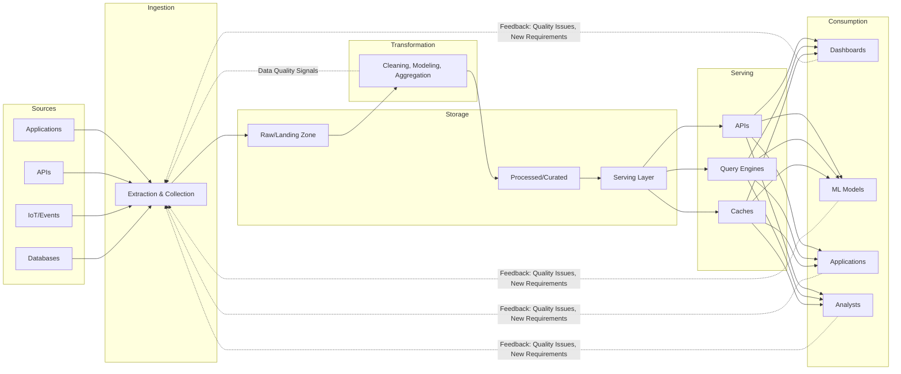

## 1.2 Common Failure Modes

### Silent Data Corruption
The most dangerous failures are the ones nobody notices. A field changes from integer to string upstream. A timezone conversion introduces an off-by-one day error. A join condition silently produces duplicates. Reports continue to render. Dashboards stay green. Decisions get made on wrong data for weeks or months.

*War Story*: At a fintech company, a currency conversion rate was accidentally inverted for 73 days. Every transaction report showed inverted profits/losses. The issue was discovered only when Q3 numbers "didn't feel right" to the CFO. By then, investor communications had been sent with incorrect figures.

### Schema Drift
Upstream systems don't notify you when they change. That `user_id` field that was always an integer? Now it's sometimes a string UUID in the mobile app. Your pipeline continues running, casting to integer, and silently converting `"abc-123-def"` to `0`.

### Pipeline Debt
The "quick fix" pipeline that was supposed to be temporary—three years ago—is now load-bearing infrastructure. It has no tests, no documentation, and the engineer who wrote it left the company. It processes 40% of your critical business data.

### Lack of Observability
You can't find problems in systems you can't see. Most data pipelines have excellent observability for whether they *ran*, but none for whether they *ran correctly*. The pipeline succeeded. It processed 1.2 million rows. Is that right? Was it 1.4 million yesterday? Nobody knows.

## 1.3 The Iceberg of Data Engineering

What stakeholders see:
- Dashboards with charts
- SQL tables they can query
- APIs that return data

What they don't see:
- 47 orchestrated DAGs with 300+ dependencies
- Schema validation and enforcement logic
- Retry mechanisms and dead letter queues
- Monitoring alerts at 3 AM
- Data quality rules and anomaly detection
- Access control and PII handling
- Backup and recovery procedures
- Incident runbooks
- Cost optimization work

The visible 10% is where stakeholders measure value. The invisible 90% is where data engineering lives.

## 1.4 Why Most Data Pipelines Fail: Patterns from Postmortems

Analyzing hundreds of production incidents reveals consistent patterns:

| Failure Category | Frequency | Typical Cause | Prevention |
|-----------------|-----------|---------------|------------|
| Schema Evolution | 31% | Upstream changes without notification | Schema contracts, validation |
| Data Quality | 24% | Missing/malformed data passing through | Expectations, circuit breakers |
| Resource Exhaustion | 18% | Unbounded data, memory leaks | Backpressure, resource limits |
| Dependency Failures | 15% | Upstream system outages | Timeouts, fallbacks, idempotency |
| Configuration Errors | 12% | Wrong environments, bad credentials | IaC, deployment automation |

## 1.5 Role Distinctions

| Role | Primary Focus | Key Deliverables | Works With |
|------|---------------|------------------|------------|
| **Data Engineer** | Infrastructure, pipelines, reliability | Pipelines, data models, platform capabilities | Analytics Engineers, Platform teams |
| **Analytics Engineer** | Business logic, semantic modeling | dbt models, documentation, metrics definitions | Analysts, Data Engineers |
| **Data Analyst** | Insights, reporting, ad-hoc analysis | Dashboards, reports, analyses | Business stakeholders |
| **Data Scientist** | Statistical modeling, experimentation | Models, experiments, recommendations | ML Engineers, Product |
| **ML Engineer** | Model deployment, inference systems | Serving infrastructure, feature stores | Data Scientists, Platform teams |

The boundaries blur. In smaller organizations, one person wears many hats. In larger organizations, specialization increases. But the core distinction remains: **data engineers build infrastructure; analytics engineers define business logic; analysts extract insights; scientists build models; ML engineers deploy them.**

### Key Takeaways
- Data engineering's value is measured in reliability, not features
- Silent failures are more dangerous than loud ones
- Most pipeline failures stem from insufficient validation and observability
- The invisible infrastructure is where the real work happens

### Reflection Questions
1. If your data pipeline has been running successfully for six months, how confident are you that it's producing correct results right now?
2. What's the oldest "temporary" solution in your data infrastructure?
3. How long would it take to detect if a critical business metric was off by 15%?

---

# MODULE 2: OLTP vs OLAP

## 2.1 Fundamental Design Philosophy

These two paradigms exist because no single system can optimize for both transactional workloads and analytical workloads. The fundamental tension:

**OLTP (Online Transaction Processing)**: Optimized for many small, concurrent operations that read and write individual records. The cash register model—fast, reliable, consistent operations on small amounts of data.

**OLAP (Online Analytical Processing)**: Optimized for few large operations that read many records to produce aggregates. The quarterly report model—scanning millions of rows to answer complex business questions.

| Dimension | OLTP | OLAP |
|-----------|------|------|
| **Primary Operation** | INSERT, UPDATE, DELETE | SELECT with aggregations |
| **Query Pattern** | Point lookups (WHERE id = X) | Full scans, range queries |
| **Data Volume per Query** | Rows to thousands | Millions to billions |
| **Concurrent Users** | Thousands | Dozens to hundreds |
| **Optimization Goal** | Transaction throughput | Query throughput |
| **Data Freshness** | Real-time | Minutes to hours acceptable |
| **Normalization** | Highly normalized (3NF+) | Denormalized (star/snowflake schema) |

## 2.2 Row-Oriented vs Column-Oriented Storage

The physical storage layout is the key differentiator:

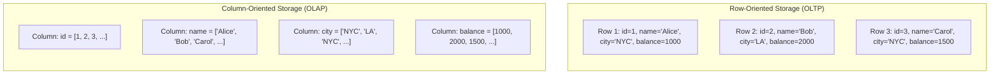

**Row-oriented** (PostgreSQL, MySQL):
- Stores all columns of a row together on disk
- Excellent for `SELECT * FROM users WHERE id = 12345`
- Terrible for `SELECT AVG(balance) FROM users`
- Reads entire rows even if you only need one column

**Column-oriented** (Snowflake, BigQuery, ClickHouse):
- Stores all values of a column together
- Excellent for `SELECT city, SUM(balance) FROM users GROUP BY city`
- Can read only the columns needed (massive I/O savings)
- Better compression (similar values stored together)
- Terrible for `INSERT INTO users VALUES (...)` (must update many files)

## 2.3 Write-Optimized vs Read-Optimized

OLTP systems optimize for writes:
- Append-only logging (WAL)
- Small, fast index updates
- ACID guarantees with minimal latency
- Row-level locking

OLAP systems optimize for reads:
- Batch-oriented data loading
- Pre-computed aggregations (materialized views, cubes)
- Columnar compression (10-100x storage savings)
- Partition pruning (skip entire data segments)

## 2.4 Hybrid Approaches (HTAP)

**HTAP (Hybrid Transactional/Analytical Processing)** systems attempt to handle both workloads. Examples: TiDB, CockroachDB, SingleStore.

The promise: One database for everything. No ETL. No synchronization.

The reality: Compromise. You get okay performance at both workloads, but excellent performance at neither. The trade-offs:
- More complex operational model
- Higher cost than specialized systems
- Still need to segregate workloads at scale
- Analytical queries can impact transactional performance

**When HTAP makes sense**: Early-stage companies with limited data volume, strong real-time requirements, and constrained operational capacity.

**When to avoid**: High-volume transactional systems, complex analytical workloads, cost-sensitive environments.

## 2.5 System Comparison

| System | Type | Best For | Watch Out For |
|--------|------|----------|---------------|
| PostgreSQL | OLTP | General purpose, ACID transactions | Analytical query performance |
| MySQL | OLTP | Web applications, read replicas | Complex queries, joins at scale |
| Snowflake | OLAP (Cloud) | Elastic scaling, SQL analytics | Cost (pay per query), egress fees |
| BigQuery | OLAP (Cloud) | Serverless, massive scale | Slot management, cost prediction |
| Redshift | OLAP (Cloud) | AWS ecosystem, predictable pricing | Cluster management, vacuum operations |
| ClickHouse | OLAP (OSS) | Real-time analytics, time-series | Operational complexity, JOINs |
| DuckDB | OLAP (Embedded) | Local analytics, development | Not distributed, memory-bound |

## 2.6 Anti-Patterns

### Using OLTP for Analytics
**Symptoms**: Queries taking minutes. Replication lag spiking. Application latency increasing during reporting hours. Read replicas falling behind.

**Why it happens**: "It's all in Postgres already. Why move it?" The answer: because your production database will fall over when someone runs a quarterly revenue report.

**Solution**: Extract to OLAP. Start simple—nightly batch exports. Add CDC when latency requirements justify complexity.

### Using OLAP for Transactions
**Symptoms**: High latency on point lookups. Consistency violations. Data appearing late. Users seeing stale data.

**Why it happens**: "We have all our data in Snowflake. Let's just serve the API from there." OLAP systems are optimized for throughput, not latency.

**Solution**: Serve transactional workloads from OLTP. Use OLAP for analysis. If you need real-time serving of analytical results, add a serving layer (Redis, Elasticsearch, or a purpose-built feature store).

## 2.7 Migration Patterns: OLTP to OLAP

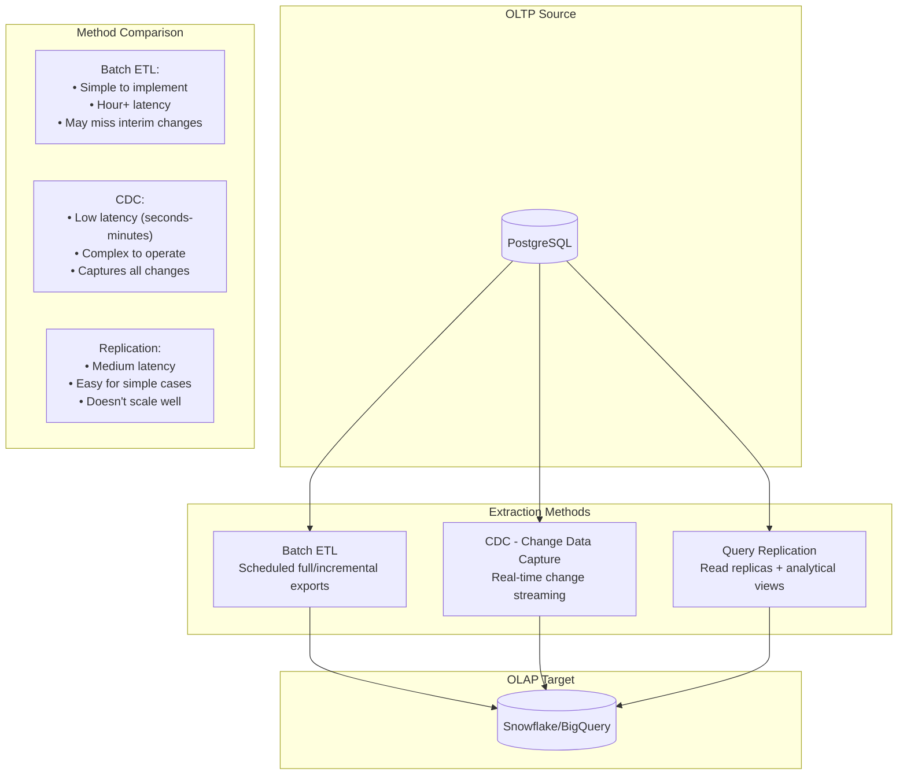

**Batch ETL**: Extract data on a schedule (hourly, daily). Simple, reliable, but data is always stale.

**CDC (Change Data Capture)**: Stream changes from database transaction logs. Tools: Debezium, Fivetran, Airbyte. Complex but enables near-real-time synchronization.

**Recommendation**: Start with batch ETL. Move to CDC only when you have a demonstrated need for lower latency *and* the operational capacity to manage it.

### Key Takeaways
- OLTP and OLAP are fundamentally different; optimize for one workload per system
- Row-oriented storage for transactions, column-oriented for analytics
- HTAP is a compromise—evaluate carefully before adopting
- Default to batch extraction; CDC is complex and often unnecessary

### Reflection Questions
1. How many analytical queries are currently running against your production OLTP database?
2. If your analytics database went down, what would break besides dashboards?
3. What's the latency requirement for your slowest-acceptable analytical query? Your fastest?

---

# MODULE 3: Batch vs Streaming

## 3.1 Defining the Spectrum

The batch vs streaming dichotomy is false. What you have in reality is a spectrum:

| Tier | Latency | Example Use Cases | Typical Technologies |
|------|---------|-------------------|---------------------|
| **True Real-Time** | < 100ms | Fraud detection, trading, gaming | Flink, custom solutions |
| **Near-Real-Time** | 100ms - 1min | Live dashboards, notifications | Kafka + Flink, Spark Streaming |
| **Micro-Batch** | 1 - 15 min | Operational reporting, alerting | Spark Streaming, scheduled jobs |
| **Batch** | 15min - 24hr | Daily reports, ML training, historical analysis | Airflow + Spark, dbt |

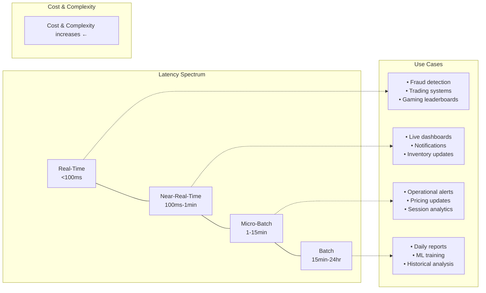

## 3.2 When Batch is the Right Answer

**Default to batch.** This is contrarian advice in an industry enamored with real-time, but it's correct for most use cases.

Batch is right when:
- **Business decisions are made on daily/weekly cycles**: If nobody acts on data faster than daily, why process it faster?
- **Correctness matters more than speed**: Batch allows for retries, validation, and reconciliation
- **Cost is a constraint**: Streaming infrastructure costs 5-10x more to operate
- **Team is small**: Streaming requires specialized expertise to operate reliably
- **Data volume is predictable**: Batch handles bursty loads more gracefully

*War Story*: A retail company spent $2M building a real-time inventory system. Business requirement: "We need to know stock levels in real-time." Actual usage: Buyers checked stock levels once per morning meeting. The 15-minute batch job they had before was perfectly adequate. The real-time system added complexity, cost, and failure modes without changing any business outcome.

## 3.3 When Streaming is Essential

Streaming is essential when:
- **Decisions must be made within seconds**: Fraud detection, security alerts
- **The value of data decays rapidly**: Social media trending, dynamic pricing
- **Downstream systems require continuous input**: Real-time recommendations, operational automation
- **You can't reprocess**: The action must happen now or not at all

**The Streaming Litmus Test**:
1. If this data arrived 15 minutes late, what business value would be lost?
2. If the answer is "significant revenue" or "regulatory violation," consider streaming
3. If the answer is "someone would have to wait for their dashboard," use batch

## 3.4 Lambda vs Kappa Architecture

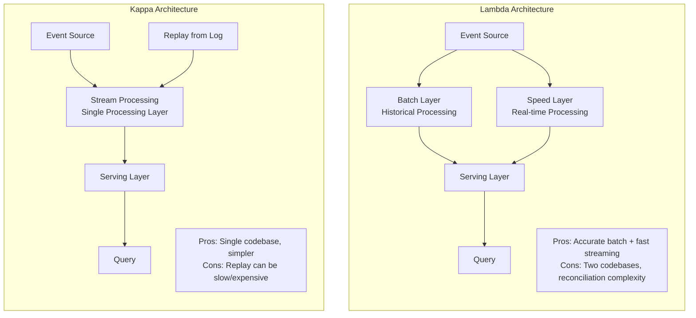

**Lambda Architecture** (circa 2011): Run parallel batch and streaming pipelines. Merge results in serving layer. Two systems, two codebases, two sources of bugs.

**Kappa Architecture** (circa 2014): Use streaming for everything. Treat batch as just a very slow stream. Replay from the log when you need to reprocess.

**Modern Reality** (2024): Most organizations use a pragmatic hybrid:
- Streaming for genuinely time-sensitive use cases
- Batch for everything else
- Well-defined handoff points between the two

The religious wars have subsided. Use what makes sense for your latency requirements and team capabilities.

## 3.5 The Hidden Complexity of Streaming

Streaming looks simple in diagrams. Production streaming is hard.

### Exactly-Once Semantics
**The problem**: Messages can be lost (at-most-once) or duplicated (at-least-once). Achieving exactly-once requires coordination between producer, broker, and consumer.

**The reality**: True exactly-once is expensive and often unnecessary. Many use cases tolerate at-least-once with idempotent processing.

### Late-Arriving Data
**The problem**: An event that happened at 2:00 PM might arrive at 2:15 PM. Do you:
- Drop it? (Lose data)
- Include it in the 2:00 PM window? (Reprocess and republish)
- Include it in the 2:15 PM window? (Incorrect aggregation)

**The solution**: Watermarks—a declaration of "I believe I've seen all events up to time T." But watermarks are heuristics, not guarantees.

```python
# Flink example: Handling late data with allowed lateness
from pyflink.datastream import StreamExecutionEnvironment
from pyflink.datastream.window import TumblingEventTimeWindows
from pyflink.common.time import Time

env = StreamExecutionEnvironment.get_execution_environment()

# Allow events up to 5 minutes late
stream \
    .key_by(lambda x: x.user_id) \
    .window(TumblingEventTimeWindows.of(Time.minutes(1))) \
    .allowed_lateness(Time.minutes(5)) \
    .side_output_late_data(late_output_tag) \
    .aggregate(CountAggregator())
```

### State Management
Streaming aggregations require state: counters, windows, session data. State must be:
- **Durable**: Survive failures
- **Consistent**: Checkpointed atomically
- **Scalable**: Distributed across workers
- **Fast**: Accessible without killing latency

This is hard. Flink's managed state is excellent but complex. Rolling your own is a recipe for data loss.

## 3.6 Tools Landscape

| Category | Batch | Streaming | Hybrid |
|----------|-------|-----------|--------|
| **Orchestration** | Airflow, Dagster, Prefect | N/A (streaming is continuous) | Dagster (native asset-based) |
| **Processing** | Spark (batch), dbt | Flink, Kafka Streams, Spark Streaming | Flink (unified batch/stream) |
| **Messaging** | N/A | Kafka, Pulsar, Kinesis | Kafka (batch consumption possible) |
| **Storage** | Data Warehouse, Data Lake | Kafka (short-term), specialized stores | Lakehouse (Delta, Iceberg) |

### Orchestration: Airflow vs Dagster

```python
# Airflow: Task-centric DAG definition
from airflow import DAG
from airflow.operators.python import PythonOperator
from datetime import datetime

with DAG('daily_etl', start_date=datetime(2024, 1, 1), schedule='@daily') as dag:
    
    extract = PythonOperator(
        task_id='extract',
        python_callable=extract_data,
        retries=3,
        retry_delay=timedelta(minutes=5)
    )
    
    transform = PythonOperator(
        task_id='transform',
        python_callable=transform_data
    )
    
    load = PythonOperator(
        task_id='load',
        python_callable=load_data
    )
    
    extract >> transform >> load
```

```python
# Dagster: Asset-centric definition
from dagster import asset, Definitions

@asset
def raw_orders():
    """Extract orders from source system."""
    return extract_orders()

@asset
def clean_orders(raw_orders):
    """Clean and validate order data."""
    return clean_data(raw_orders)

@asset
def order_metrics(clean_orders):
    """Calculate order-level metrics."""
    return calculate_metrics(clean_orders)

defs = Definitions(assets=[raw_orders, clean_orders, order_metrics])
```

**Airflow**: Industry standard. Large ecosystem. Task-centric (define what to do, not what to produce). Excellent for complex dependencies. Steeper learning curve.

**Dagster**: Asset-centric (define what you're producing). Better data lineage. Easier testing. Smaller ecosystem. Growing rapidly.

## 3.7 Batch vs Streaming Decision Framework

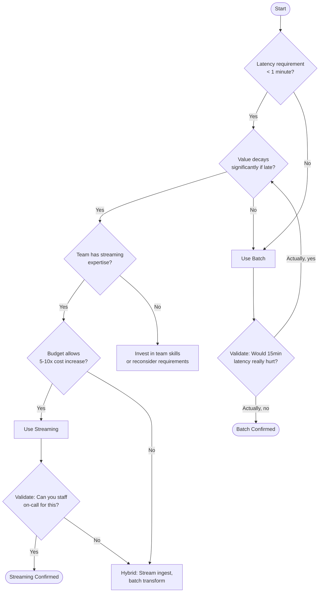

### Key Takeaways
- Default to batch; streaming is expensive and complex
- The latency spectrum is continuous—choose the tier that matches business value
- Late-arriving data, exactly-once semantics, and state management are the hard parts of streaming
- Lambda architecture is largely obsolete; use pragmatic hybrids

### Reflection Questions
1. What's the fastest-moving business decision in your organization? How quickly does data need to arrive to inform it?
2. If your streaming pipeline went down for an hour, what business impact would occur?
3. How would you explain to a CFO why streaming costs 5-10x more than batch?

---

# MODULE 4: Learning from Failure – Postmortem Analysis

## 4.1 How to Read Engineering Postmortems

Postmortems are the most underutilized learning resource in engineering. A well-written postmortem contains:

1. **What actually happened** (timeline, facts)
2. **Why it happened** (root cause, contributing factors)
3. **What we learned** (systemic issues)
4. **What we'll change** (preventive measures)

The key skill is reading *between* the lines. The stated root cause is often a proximate cause. The real root cause is usually systemic: missing testing, inadequate monitoring, insufficient documentation, or organizational dysfunction.

## 4.2 Anatomy of a Postmortem

```
## Incident Summary
- Date: 2024-03-15
- Duration: 4 hours 23 minutes
- Severity: P1 (Revenue-impacting)
- Impact: 847,000 orders processed with incorrect pricing

## Timeline
- 14:32 UTC: Deployment of pricing service v2.3.4
- 14:47 UTC: First customer complaint received
- 15:12 UTC: Incident declared, investigation begins
- 16:45 UTC: Root cause identified
- 17:03 UTC: Rollback initiated
- 18:55 UTC: Rollback complete, verification in progress

## Root Cause
Schema change in pricing API response removed deprecated `discount_rate` 
field. Data pipeline defaulted to 0 when field was missing, applying 
no discounts to any orders.

## Contributing Factors
1. No schema validation on ingestion
2. Upstream team did not notify downstream consumers
3. No data quality alert on discount_rate distribution
4. Rollback process required manual intervention

## Remediation
- Immediate: Manual correction of 847,000 orders ($2.3M adjustments)
- Short-term: Add schema validation with explicit failure on missing fields
- Long-term: Implement schema registry with breaking change detection
```

## 4.3 Case Study 1: Silent Data Corruption from Schema Evolution

### The Alert/Symptom
**Wednesday, 9:47 AM**: Finance team opens ticket: "March revenue numbers don't match between dashboard and ERP system. Delta is $4.7M."

### Initial Investigation
```sql
-- Compare dashboard source table to ERP extract
SELECT 
    DATE_TRUNC('month', order_date) as month,
    SUM(total_amount) as dashboard_revenue,
    (SELECT SUM(amount) FROM erp_extract WHERE month = '2024-03') as erp_revenue
FROM orders
WHERE order_date >= '2024-03-01' AND order_date < '2024-04-01'
GROUP BY 1;
```

Results show dashboard is lower. Investigation focus: missing orders.

```sql
-- Check order counts
SELECT COUNT(*) FROM orders WHERE order_date >= '2024-03-01'; -- 2.3M
SELECT COUNT(*) FROM erp_extract WHERE month = '2024-03'; -- 2.3M
-- Same count. Not missing orders.
```

Pivot to data values:

```sql
-- Sample comparison
SELECT 
    o.order_id,
    o.total_amount as dashboard_amount,
    e.amount as erp_amount
FROM orders o
JOIN erp_extract e ON o.order_id = e.order_id
WHERE o.total_amount != e.amount
LIMIT 100;
```

**Finding**: 340,000 orders have `total_amount = 0` in dashboard but correct values in ERP.

### Root Cause Analysis

```sql
-- When did zeros start appearing?
SELECT 
    DATE(ingested_at) as ingest_date,
    COUNT(*) as total_orders,
    SUM(CASE WHEN total_amount = 0 THEN 1 ELSE 0 END) as zero_amount_orders
FROM orders
WHERE order_date >= '2024-02-01'
GROUP BY 1
ORDER BY 1;
```

**Finding**: Zero amounts started appearing March 3rd.

Checked deployment logs: March 2nd, upstream orders API was updated.

Checked API response diff:

```json
// Before March 2nd
{"order_id": "123", "total": {"amount": 99.99, "currency": "USD"}}

// After March 2nd  
{"order_id": "123", "total_amount": {"value": 99.99, "currency": "USD"}}
```

The field was renamed from `total.amount` to `total_amount.value`. Our extraction code:

```python
# Pipeline code (problematic)
def extract_order(response):
    return {
        'order_id': response['order_id'],
        'total_amount': response.get('total', {}).get('amount', 0)  # Silent default!
    }
```

When the field path changed, `.get('total', {}).get('amount', 0)` returned 0 instead of failing.

### The Fix

**Immediate**:
```sql
-- Backfill from ERP as source of truth
UPDATE orders o
SET total_amount = e.amount
FROM erp_extract e
WHERE o.order_id = e.order_id
  AND o.order_date >= '2024-03-03'
  AND o.total_amount = 0;
-- Updated 340,847 rows
```

**Short-term**:
```python
# Pipeline code (fixed)
def extract_order(response):
    # Explicit validation - fail loudly on missing fields
    if 'total_amount' not in response:
        raise SchemaValidationError(f"Missing 'total_amount' in response: {response}")
    
    total = response['total_amount']
    if 'value' not in total:
        raise SchemaValidationError(f"Missing 'value' in total_amount: {total}")
    
    return {
        'order_id': response['order_id'],
        'total_amount': total['value']
    }
```

**Long-term**:
- Implemented schema registry with versioning
- Added data quality checks for statistical anomalies
- Established upstream notification SLA for breaking changes

### Lessons Learned
1. **Never silently default on critical fields** - Fail loudly, not silently
2. **Monitor data distributions, not just data presence** - Zeros were present; the distribution was wrong
3. **Upstream teams don't know who consumes their data** - Create a consumer registry

### Diagnostic Commands Used
```bash
# Check when pipeline config last changed
git log --oneline --since="2024-02-01" -- pipelines/orders/

# Verify API response schema
curl -s https://api.internal/orders/sample | jq 'keys'

# Check pipeline logs for warnings
grep -i "warning\|missing\|default" /var/log/pipelines/orders/2024-03-03.log
```

---

## 4.4 Case Study 2: Pipeline Cascade Failure from Single Point of Failure

### The Alert/Symptom
**Friday, 11:23 PM**: PagerDuty alert storm. 47 pipeline failure alerts within 3 minutes. On-call engineer's phone battery dies from vibrations.

### Initial Investigation
```bash
# Check Airflow dashboard
# Result: 47 DAGs in failed state, all with "upstream_failed" status

# Find the common ancestor
airflow tasks list daily_user_metrics --tree | head -20
```

All failures traced back to single DAG: `raw_events_ingestion`.

```bash
# Check the failing task
airflow tasks logs raw_events_ingestion extract_events 2024-03-15

# Output:
# ERROR - Connection refused: events-db-replica-01.internal:5432
# ERROR - Retry 1/3 failed
# ERROR - Retry 2/3 failed  
# ERROR - Retry 3/3 failed
# ERROR - Task failed with exception
```

### Root Cause Analysis

```bash
# Check database status
psql -h events-db-replica-01.internal -c "SELECT 1"
# Connection refused

# Check if host is up
ping events-db-replica-01.internal
# Host unreachable

# Check AWS console
aws rds describe-db-instances --db-instance-identifier events-db-replica-01
# Status: "storage-full"
```

The read replica ran out of disk space due to a bloated temporary table from an analyst's runaway query. When the replica went down, the single extraction task that depended on it failed. That task was upstream of 46 other DAGs.

Architecture diagram revealed the problem:

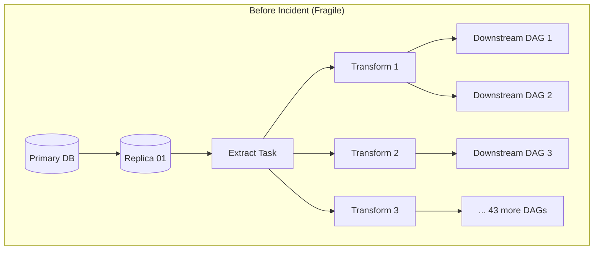

**Single point of failure**: One replica, one extract task, 47 dependent DAGs.

### The Fix

**Immediate**:
```bash
# Resize replica storage (emergency)
aws rds modify-db-instance \
    --db-instance-identifier events-db-replica-01 \
    --allocated-storage 500 \
    --apply-immediately

# Wait for replica to come back online (took 45 minutes)

# Clear failed states and retry
airflow dags backfill --reset-dagruns -s 2024-03-15 -e 2024-03-15 raw_events_ingestion
```

**Short-term**:
```python
# Modified extraction task with failover
def extract_events(**context):
    replicas = [
        'events-db-replica-01.internal',
        'events-db-replica-02.internal',
        'events-db-primary.internal'  # Fallback to primary as last resort
    ]
    
    for replica in replicas:
        try:
            conn = connect_with_timeout(replica, timeout=30)
            return extract_from_connection(conn)
        except ConnectionError as e:
            logger.warning(f"Failed to connect to {replica}: {e}")
            continue
    
    raise AllReplicasFailedError("All database replicas unavailable")
```

**Long-term**:
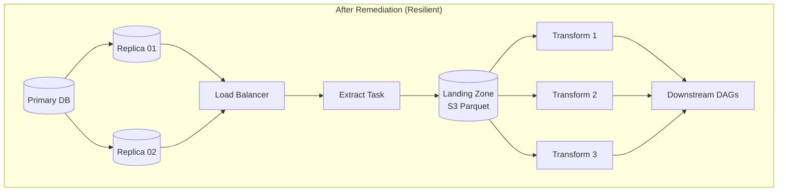

Architecture changes:
1. Added second read replica
2. Implemented connection load balancing with health checks
3. Introduced landing zone buffer (S3) to decouple extraction from transformation
4. Added storage monitoring with alerts at 70%, 85%, 95%

### Lessons Learned
1. **Every pipeline has a single point of failure until you find it** - Actively hunt for them
2. **Buffers and decoupling prevent cascade failures** - Don't chain tasks directly
3. **Monitor resources, not just task status** - Disk space, memory, connections
4. **47 DAGs depending on one task is a design smell** - Refactor into isolated stages

### Diagnostic Commands Used
```bash
# Find all downstream dependencies
airflow dags show raw_events_ingestion --save deps.png

# Count affected DAGs
airflow dags list-runs -d raw_events_ingestion -s 2024-03-15 --state failed | wc -l

# Check disk space on RDS
aws cloudwatch get-metric-statistics \
    --namespace AWS/RDS \
    --metric-name FreeStorageSpace \
    --dimensions Name=DBInstanceIdentifier,Value=events-db-replica-01 \
    --start-time 2024-03-15T00:00:00Z \
    --end-time 2024-03-16T00:00:00Z \
    --period 300 \
    --statistics Average
```

---

## 4.5 Case Study 3: Data Latency SLA Breach During Peak Load

### The Alert/Symptom
**Black Friday, 2:34 PM**: Operations team escalation: "Real-time inventory dashboard showing data from 45 minutes ago. Stores are overselling."

### Initial Investigation
```sql
-- Check data freshness in serving layer
SELECT 
    MAX(event_timestamp) as latest_event,
    MAX(processed_at) as latest_processed,
    CURRENT_TIMESTAMP - MAX(event_timestamp) as data_lag
FROM inventory_current;

-- Result:
-- latest_event: 2024-11-29 13:47:22
-- latest_processed: 2024-11-29 13:52:18
-- data_lag: 00:47:16
```

Data is 47 minutes stale. SLA is 5 minutes.

```bash
# Check Kafka consumer lag
kafka-consumer-groups --bootstrap-server kafka:9092 \
    --group inventory-processor \
    --describe

# Output:
# TOPIC              PARTITION  CURRENT-OFFSET  LOG-END-OFFSET  LAG
# inventory-events   0          45892012        48921847        3029835
# inventory-events   1          44521098        47891204        3370106
# inventory-events   2          46102384        49201847        3099463
# Total lag: 9,499,404 messages
```

9.5 million messages behind. Normal lag is under 1,000.

### Root Cause Analysis

```bash
# Check consumer instance metrics
kubectl top pods -l app=inventory-processor

# Output:
# NAME                      CPU     MEMORY
# inventory-processor-0     982m    3.8Gi  (limit: 4Gi)
# inventory-processor-1     978m    3.9Gi
# inventory-processor-2     995m    3.7Gi
```

All pods at CPU limit. Checked throughput:

```bash
# Calculate processing rate
kafka-consumer-groups --bootstrap-server kafka:9092 \
    --group inventory-processor \
    --describe | awk 'NR>1 {sum += $5} END {print sum}'
    
# Run again after 60 seconds, calculate delta
# Result: Processing 2,400 messages/second
# Incoming rate on Black Friday: 8,500 messages/second
```

Processing at 28% of incoming rate. Falling further behind every second.

**Root cause**: Kafka consumer instances were not configured to auto-scale. Fixed pod count of 3 was sized for normal traffic (2,000 msg/sec), not Black Friday traffic (8,500 msg/sec).

### The Fix

**Immediate**:
```bash
# Emergency scale-up
kubectl scale deployment inventory-processor --replicas=12

# Increase consumer parallelism (required Kafka partition increase)
# Kafka topic had 3 partitions = max 3 parallel consumers
# Need to increase partitions

kafka-topics --bootstrap-server kafka:9092 \
    --topic inventory-events \
    --alter \
    --partitions 12

# Restart consumers to rebalance
kubectl rollout restart deployment inventory-processor
```

```bash
# Monitor recovery
watch -n 5 'kafka-consumer-groups --bootstrap-server kafka:9092 \
    --group inventory-processor --describe | tail -1'

# Lag decreased from 9.5M to 0 over 23 minutes
```

**Short-term**:
```yaml
# Kubernetes HPA configuration
apiVersion: autoscaling/v2
kind: HorizontalPodAutoscaler
metadata:
  name: inventory-processor-hpa
spec:
  scaleTargetRef:
    apiVersion: apps/v1
    kind: Deployment
    name: inventory-processor
  minReplicas: 3
  maxReplicas: 20
  metrics:
  - type: External
    external:
      metric:
        name: kafka_consumer_lag
        selector:
          matchLabels:
            consumer_group: inventory-processor
      target:
        type: AverageValue
        averageValue: "10000"  # Scale up when lag > 10k per pod
```

**Long-term**:
- Pre-provisioned capacity for known peak events (Black Friday, Prime Day)
- Implemented backpressure mechanisms to gracefully degrade
- Created runbook for traffic spike scenarios
- Added lag-based alerting with tiered thresholds

### Lessons Learned
1. **Kafka partitions = maximum parallelism** - Can't scale consumers beyond partition count
2. **Load testing must include peak scenarios** - Normal load tests don't find peak failures
3. **Auto-scaling must be tested** - Configured but never triggered ≠ working
4. **Known peak events should be pre-scaled** - Don't rely on auto-scaling for predictable spikes

### Diagnostic Commands Used
```bash
# Real-time lag monitoring
kafka-consumer-groups --bootstrap-server kafka:9092 \
    --group inventory-processor \
    --describe 2>/dev/null | \
    awk 'NR>1 {lag += $5} END {print strftime("%H:%M:%S"), "Lag:", lag}'

# Producer rate calculation
kafka-run-class kafka.tools.GetOffsetShell \
    --broker-list kafka:9092 \
    --topic inventory-events \
    --time -1 | awk -F: '{sum += $3} END {print sum}'
# Run twice, 60 seconds apart, calculate delta

# Check for consumer rebalancing issues
kubectl logs -l app=inventory-processor --since=1h | grep -i rebalance
```

---

## 4.6 Case Study 4: Incorrect Business Metrics from Duplicate Event Processing

### The Alert/Symptom
**Monday, 10:15 AM**: CEO asks in Slack: "Why does the investor dashboard show we did $47M in GMV yesterday when finance says it was $31M?"

### Initial Investigation
```sql
-- Compare aggregate numbers
SELECT 
    SUM(order_value) as dashboard_gmv
FROM analytics.daily_gmv
WHERE date = '2024-03-17';
-- Result: 47,234,891.23

SELECT 
    SUM(amount) as finance_gmv  
FROM finance.reconciled_orders
WHERE order_date = '2024-03-17';
-- Result: 31,421,847.56

-- Delta: $15.8M (50% inflation!)
```

```sql
-- Check for duplicates
SELECT 
    order_id, 
    COUNT(*) as occurrences
FROM analytics.orders_raw
WHERE order_date = '2024-03-17'
GROUP BY order_id
HAVING COUNT(*) > 1
ORDER BY COUNT(*) DESC
LIMIT 10;

-- Result:
-- order_id          | occurrences
-- ORD-2024-8847123  | 3
-- ORD-2024-8847124  | 3
-- ORD-2024-8847125  | 3
-- ... (pattern continues)
```

Massive duplication. Every order from a specific time window is tripled.

### Root Cause Analysis

```sql
-- Find when duplicates started
SELECT 
    DATE_TRUNC('hour', ingested_at) as hour,
    COUNT(*) as records,
    COUNT(DISTINCT order_id) as unique_orders,
    COUNT(*) / COUNT(DISTINCT order_id)::float as duplication_ratio
FROM analytics.orders_raw
WHERE order_date = '2024-03-17'
GROUP BY 1
ORDER BY 1;

-- Result shows duplication_ratio of 3.0 from 02:00 to 05:00
```

Checked Kafka consumer offset commits:

```bash
# Examine consumer offset history
kafka-consumer-groups --bootstrap-server kafka:9092 \
    --group orders-analytics-consumer \
    --describe --offsets --verbose

# Check consumer logs
kubectl logs orders-processor-pod --since=24h | grep -i "offset\|commit\|rebalance"
```

**Finding**: Consumer group experienced three rebalances between 02:00 and 05:00 due to pod evictions. Each rebalance caused consumers to restart from the last committed offset. Offset commits were configured to occur every 5 minutes, but processing a batch took 7 minutes.

```
Timeline:
02:00 - Consumer reads messages 1000-2000, starts processing
02:05 - Offset commit scheduled but processing not complete (no commit)
02:07 - Pod evicted (memory pressure), processing interrupted
02:08 - New pod starts, reads from last committed offset (1000)
02:08 - Messages 1000-2000 processed AGAIN
02:15 - Another eviction... (cycle repeats)
```

**Root cause**: At-least-once delivery combined with non-idempotent aggregation. Messages were
processed multiple times, and the aggregation logic summed all occurrences instead of deduplicating.

### The Fix

**Immediate**:
```sql
-- Rebuild daily_gmv with deduplication
CREATE OR REPLACE TABLE analytics.daily_gmv_fixed AS
WITH deduplicated_orders AS (
    SELECT DISTINCT ON (order_id)
        order_id,
        order_date,
        order_value,
        ingested_at
    FROM analytics.orders_raw
    WHERE order_date = '2024-03-17'
    ORDER BY order_id, ingested_at ASC  -- Take first occurrence
)
SELECT 
    order_date as date,
    SUM(order_value) as gmv,
    COUNT(*) as order_count
FROM deduplicated_orders
GROUP BY order_date;

-- Verify fix
SELECT * FROM analytics.daily_gmv_fixed;
-- Result: 31,421,847.56 ✓ (matches finance)
```

**Short-term** - Make aggregation idempotent:
```python
# Before: Non-idempotent aggregation
def aggregate_orders(orders_df):
    return orders_df.groupby('date').agg({
        'order_value': 'sum',
        'order_id': 'count'
    })

# After: Idempotent aggregation with deduplication
def aggregate_orders(orders_df):
    # Deduplicate first, then aggregate
    deduplicated = orders_df.drop_duplicates(
        subset=['order_id'], 
        keep='first'
    )
    return deduplicated.groupby('date').agg({
        'order_value': 'sum',
        'order_id': 'count'
    })
```

```sql
-- Better: Deduplication in dbt model
-- models/marts/daily_gmv.sql
WITH source AS (
    SELECT * FROM {{ ref('stg_orders') }}
),

deduplicated AS (
    SELECT *,
        ROW_NUMBER() OVER (
            PARTITION BY order_id 
            ORDER BY ingested_at ASC
        ) as rn
    FROM source
),

unique_orders AS (
    SELECT * FROM deduplicated WHERE rn = 1
)

SELECT
    order_date as date,
    SUM(order_value) as gmv,
    COUNT(*) as order_count,
    CURRENT_TIMESTAMP as calculated_at
FROM unique_orders
GROUP BY order_date
```

**Long-term** - Address root causes:

```yaml
# Kafka consumer configuration fixes
# 1. More frequent offset commits
enable.auto.commit: true
auto.commit.interval.ms: 1000  # Every 1 second instead of 5 minutes

# 2. Or better: manual commits after successful processing
enable.auto.commit: false
# Commit offsets explicitly after each batch is fully processed
```

```python
# Manual offset commit after successful processing
def process_batch(consumer, messages):
    try:
        # Process all messages
        processed_records = transform(messages)
        
        # Write to target
        write_to_warehouse(processed_records)
        
        # Only commit AFTER successful write
        consumer.commit()
        
    except Exception as e:
        logger.error(f"Batch processing failed: {e}")
        # Don't commit - messages will be reprocessed
        # But our aggregation is now idempotent, so this is safe
        raise
```

```yaml
# Pod resource configuration to prevent evictions
resources:
  requests:
    memory: "2Gi"
    cpu: "500m"
  limits:
    memory: "4Gi"
    cpu: "2000m"
# Also: set PodDisruptionBudget to prevent simultaneous evictions
```

### Lessons Learned
1. **At-least-once delivery requires idempotent processing** - Always design for duplicates
2. **Offset commit timing is critical** - Commit after processing, not on a timer
3. **Aggregations should deduplicate by default** - Make it impossible to double-count
4. **Resource pressure causes unexpected reprocessing** - Memory limits trigger evictions

### Diagnostic Commands Used
```sql
-- Find duplication rate by time window
SELECT 
    DATE_TRUNC('hour', ingested_at) as hour,
    ROUND(COUNT(*)::numeric / COUNT(DISTINCT order_id), 2) as dup_ratio
FROM analytics.orders_raw
WHERE order_date >= CURRENT_DATE - INTERVAL '7 days'
GROUP BY 1
ORDER BY 1 DESC;

-- Identify which orders are duplicated
SELECT order_id, array_agg(ingested_at ORDER BY ingested_at) as ingestion_times
FROM analytics.orders_raw
WHERE order_date = '2024-03-17'
GROUP BY order_id
HAVING COUNT(*) > 1
LIMIT 20;
```

```bash
# Check for consumer group rebalances
kafka-consumer-groups --bootstrap-server kafka:9092 \
    --group orders-analytics-consumer \
    --describe --state

# Check pod eviction events
kubectl get events --sort-by='.lastTimestamp' | grep -i evict
```

---

## 4.7 Case Study 5: Catastrophic Data Loss from Misconfigured Retention Policies

### The Alert/Symptom
**Thursday, 3:00 PM**: Data scientist opens urgent ticket: "All training data before January is gone. 14 months of historical data missing from the feature store."

### Initial Investigation
```sql
-- Check data availability
SELECT 
    DATE_TRUNC('month', event_date) as month,
    COUNT(*) as record_count
FROM feature_store.user_events
GROUP BY 1
ORDER BY 1;

-- Result:
-- month       | record_count
-- 2024-01     | 45,231,847
-- 2024-02     | 48,102,934
-- 2024-03     | 51,234,123
-- (no data before 2024-01!)
```

```sql
-- Verify this isn't a query issue
SELECT MIN(event_date), MAX(event_date) 
FROM feature_store.user_events;

-- Result: 2024-01-01, 2024-03-21
-- Confirmed: Data before 2024-01-01 is gone
```

Checked backup availability:
```bash
# List available backups
aws s3 ls s3://company-backups/feature-store/ --recursive | head -20

# Result: Only backups from last 30 days
# Backup retention was also set to 30 days!
```

### Root Cause Analysis

Investigated the data lifecycle configuration:

```bash
# Check table properties
aws glue get-table --database-name feature_store --name user_events

# Output included:
# "Parameters": {
#     "retention_days": "90",      # <-- This was the problem
#     "auto_purge": "true"
# }
```

```bash
# Check when this configuration was applied
git log --all --oneline -- infrastructure/glue/user_events.tf

# Found commit from 2 months ago:
# abc1234 "Reduce storage costs - set 90 day retention"
```

**The chain of events**:
1. FinOps initiative to reduce storage costs
2. Engineer set `retention_days: 90` on feature store tables
3. Configuration applied via Terraform
4. Background purge job ran nightly, deleting data older than 90 days
5. Backup retention was also 30 days (set during a separate cost-cutting exercise)
6. After 90 days, 14 months of historical data permanently gone
7. After 30 more days, backups of that data also gone
8. No one noticed until ML team needed historical data for retraining

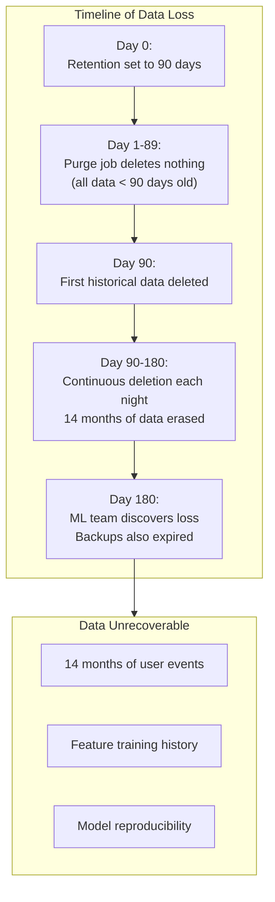

### The Fix

**Immediate**:
```bash
# STOP THE BLEEDING - Disable purge job immediately
aws glue update-table \
    --database-name feature_store \
    --table-input '{"Name": "user_events", "Parameters": {"auto_purge": "false"}}'

# Check what data remains
aws s3 ls s3://feature-store-data/user_events/ --recursive | \
    awk '{print $4}' | cut -d'/' -f3 | sort -u | head -20
```

**Attempted recovery** (partially successful):
```bash
# 1. Check if any replicas exist
aws s3 ls s3://feature-store-replica/ --recursive  # Nothing

# 2. Check if source systems still have data
# Application database had 6 months of data (its own retention)
# Recovered 6 months from application DB

# 3. Check data lake raw zone
aws s3 ls s3://data-lake-raw/events/ --recursive | head -20
# Raw zone had NO retention policy - found 18 months of raw data!
```

```python
# Rebuild feature store from raw data lake
# This took 3 days of processing and validation

from pyspark.sql import SparkSession

spark = SparkSession.builder.appName("FeatureStoreRecovery").getOrCreate()

# Read raw events (unprocessed, but present)
raw_events = spark.read.parquet("s3://data-lake-raw/events/")

# Apply feature engineering transformations
features = (
    raw_events
    .filter("event_date >= '2022-11-01'")
    .transform(apply_feature_engineering)
    .transform(validate_schema)
)

# Write back to feature store
features.write \
    .partitionBy("event_date") \
    .mode("append") \
    .parquet("s3://feature-store-data/user_events/")
```

**Long-term**:

```hcl
# Terraform module for data lifecycle with safeguards
# infrastructure/modules/data_table/main.tf

variable "retention_days" {
  type        = number
  description = "Data retention period in days"
  
  validation {
    condition     = var.retention_days >= 365 || var.retention_days == 0
    error_message = "Retention must be at least 365 days or 0 (infinite). For shorter retention, use 'short_retention_days' with explicit approval."
  }
}

variable "short_retention_days" {
  type        = number
  default     = 0
  description = "Override for retention < 365 days. Requires approval tag."
}

variable "short_retention_approval" {
  type        = string
  default     = ""
  description = "JIRA ticket approving short retention policy"
  
  validation {
    condition     = var.short_retention_days == 0 || can(regex("^DATA-[0-9]+$", var.short_retention_approval))
    error_message = "Short retention requires a DATA-XXXX approval ticket."
  }
}

resource "aws_glue_table" "this" {
  # ... table configuration ...
  
  parameters = {
    retention_days              = coalesce(var.short_retention_days, var.retention_days)
    retention_approval_ticket   = var.short_retention_approval
    auto_purge                  = "true"
    
    # CRITICAL: These tables feed ML training
    critical_data_classification = var.is_ml_training_data ? "ML_TRAINING" : "STANDARD"
  }
}
```

```yaml
# Backup policy with safety margins
# backup_policy.yaml

backup_schedules:
  feature_store:
    frequency: daily
    retention_days: 730  # 2 years - MUST exceed data retention
    cross_region_copy: true
    immutable_period: 90  # Cannot be deleted for 90 days even intentionally
    
  raw_data_lake:
    frequency: weekly
    retention_days: 0  # Infinite - this is source of truth
    storage_class: GLACIER_DEEP_ARCHIVE
```

### Lessons Learned
1. **Backup retention must exceed data retention** - Otherwise backups expire before you need them
2. **Retention changes need mandatory review** - Especially for ML training data
3. **Keep raw data forever (or archive cheaply)** - It's your recovery option
4. **Test recovery procedures** - Untested backups are Schrödinger's backups
5. **Classify data by recovery requirements** - ML training data is often irreplaceable

### Diagnostic Commands Used
```bash
# Audit retention settings across all tables
aws glue get-tables --database-name feature_store | \
    jq '.TableList[] | {name: .Name, retention: .Parameters.retention_days}'

# Check when data was deleted (CloudTrail)
aws cloudtrail lookup-events \
    --lookup-attributes AttributeKey=EventName,AttributeValue=DeleteObject \
    --start-time 2024-01-01 \
    --end-time 2024-03-21 | \
    jq '.Events[] | select(.Resources[].ResourceName | contains("user_events"))'

# Estimate storage of raw data lake
aws s3 ls s3://data-lake-raw/events/ --recursive --summarize | tail -2
```

---

## 4.8 Pattern Extraction: Systemic Issues Across Failures

Analyzing these five cases reveals recurring systemic issues:

| Pattern | Cases | Root Cause | Prevention |
|---------|-------|------------|------------|
| **Silent Defaults** | 1, 4 | Code defaults to zero/null instead of failing | Fail loudly on unexpected input |
| **Single Points of Failure** | 2, 3 | No redundancy in critical path | Design for failure at every layer |
| **Untested Scaling** | 3 | Auto-scaling configured but never triggered | Load test to breaking point |
| **Non-Idempotent Processing** | 4 | Duplicates cause incorrect aggregation | Design all operations to be idempotent |
| **Retention Misalignment** | 5 | Backup retention < data retention | Backup retention must exceed data retention |
| **Missing Validation** | 1, 4, 5 | No checks on data shape, volume, or distribution | Validate at every boundary |
| **Change Without Notification** | 1, 5 | Upstream/configuration changes break downstream | Schema contracts, change review processes |

### Key Takeaways
- Every postmortem reveals systemic issues, not just proximate causes
- Silent failures are more dangerous than loud failures
- Most incidents involve multiple contributing factors
- Prevention requires both technical safeguards and process changes
- The best time to find these patterns is before the incident

### Reflection Questions
1. Which of these five failure patterns is most likely to occur in your current systems?
2. If you had to bet, which of your pipelines would fail first under 10x load?
3. How would you know if data from 6 months ago was silently corrupted today?

---

# MODULE 5: CAP Theorem & Distributed Systems Fundamentals

## 5.1 CAP Theorem: The Fundamental Trade-off

The CAP theorem states that a distributed data store can provide at most two of three guarantees:

- **Consistency (C)**: Every read receives the most recent write or an error
- **Availability (A)**: Every request receives a response (not an error)
- **Partition Tolerance (P)**: The system continues to operate despite network partitions

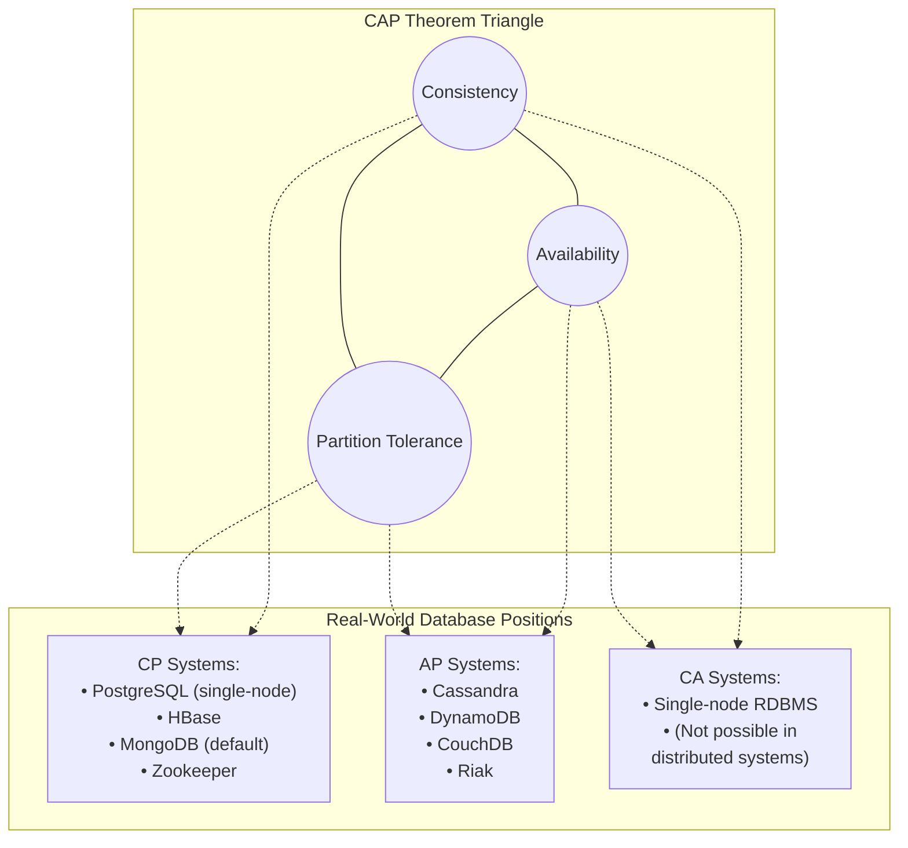

**The critical insight**: In distributed systems, network partitions *will* happen. You cannot choose to avoid them. Therefore, the real choice is between **consistency** and **availability** when a partition occurs.

### Why You Can't Have All Three

Imagine two database nodes, A and B, that must stay synchronized. A network partition occurs—they can't communicate. A client writes to Node A. What happens when a client reads from Node B?

- **If you choose Consistency**: Node B must reject the read (it might return stale data). System is unavailable.
- **If you choose Availability**: Node B returns its (stale) data. System is inconsistent.

You cannot have both during a partition. This isn't a software limitation—it's a fundamental property of distributed systems.

## 5.2 Practical Implications for Data Platforms

| Scenario | Choose CP When... | Choose AP When... |
|----------|-------------------|-------------------|
| **Financial Transactions** | Account balances must never be wrong | Never (always choose CP) |
| **Inventory Systems** | Overselling has high cost | Underselling is acceptable |
| **User Sessions** | Session integrity is critical | Occasional re-login is acceptable |
| **Analytics Data** | Regulatory accuracy requirements | Dashboards can show slightly stale data |
| **Social Feeds** | Never (always choose AP) | Users expect instant updates |

### Decision Framework

```python
def choose_cap_trade_off(use_case):
    """
    Framework for choosing consistency vs availability.
    """
    questions = {
        "financial_impact_of_inconsistency": "HIGH/MEDIUM/LOW",
        "user_tolerance_for_unavailability": "HIGH/MEDIUM/LOW",
        "regulatory_requirements": "STRICT/MODERATE/NONE",
        "data_correction_cost": "HIGH/MEDIUM/LOW"
    }
    
    # If any of these are true, choose CP
    cp_indicators = [
        answers["financial_impact_of_inconsistency"] == "HIGH",
        answers["regulatory_requirements"] == "STRICT",
        answers["data_correction_cost"] == "HIGH"
    ]
    
    # If any of these are true, choose AP
    ap_indicators = [
        answers["user_tolerance_for_unavailability"] == "LOW",
        answers["financial_impact_of_inconsistency"] == "LOW",
        use_case in ["social_feeds", "activity_logs", "recommendations"]
    ]
    
    if any(cp_indicators):
        return "CP - Consistency over Availability"
    elif any(ap_indicators):
        return "AP - Availability over Consistency"
    else:
        return "Evaluate case-by-case with stakeholders"
```

## 5.3 PACELC: Extending CAP for Normal Operations

CAP only describes behavior during partitions. PACELC extends this to normal operations:

**PACELC**: If there is a **P**artition, choose between **A**vailability and **C**onsistency. **E**lse (normal operation), choose between **L**atency and **C**onsistency.

| System | During Partition (PAC) | Normal Operation (ELC) |
|--------|------------------------|------------------------|
| PostgreSQL | PC (unavailable during partition) | EC (consistent, higher latency for distributed reads) |
| Cassandra | PA (available, inconsistent) | EL (low latency, eventual consistency) |
| DynamoDB | PA (available) | EL (low latency by default) |
| Spanner | PC (consistent) | EC (consistent, moderate latency) |
| MongoDB | PA or PC (configurable) | EL or EC (configurable) |

This explains why Cassandra is so fast for reads (EL) but might return stale data, while Spanner is slower but always correct.

## 5.4 Consistency Models Deep Dive

Not all "consistency" is equal. A spectrum exists:

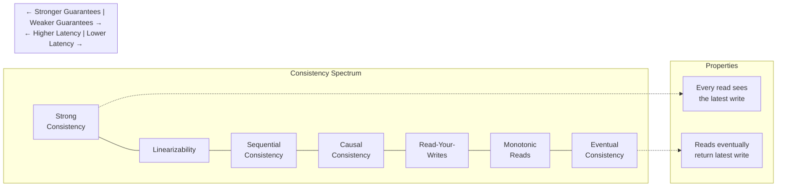

### Strong Consistency
Every read receives the most recent write. If I write "balance = 100", every subsequent read—from any node—returns 100.

**Systems**: PostgreSQL (single-node), Google Spanner, CockroachDB
**Cost**: Higher latency (must coordinate across nodes)

### Linearizability
Strongest form of consistency. Operations appear to occur instantaneously at some point between their invocation and completion.

**Systems**: Zookeeper, etcd
**Cost**: Very high latency for writes (consensus required)

### Causal Consistency
If operation A causes operation B, everyone sees A before B. But concurrent operations may be seen in different orders.

**Systems**: MongoDB (with causal sessions)
**Use case**: Chat applications where reply must appear after original message

### Read-Your-Writes
You always see your own writes, but may see stale data from others.

**Systems**: Many databases support this as a session guarantee
**Use case**: User updates profile, immediately sees their changes

### Eventual Consistency
If no new writes occur, eventually all reads return the last written value. No guarantee on when "eventually" is.

**Systems**: Cassandra, DynamoDB (default), S3
**Cost**: Lowest latency, but readers may see stale data

## 5.5 Real-World Examples

### Why Cassandra Works the Way It Does

Cassandra is designed for **availability and partition tolerance** (AP), sacrificing consistency.

```
Write path:
1. Client writes to coordinator node
2. Coordinator forwards to N replica nodes (typically 3)
3. Returns success when W nodes acknowledge (typically 2)
4. Third replica receives write eventually (async)

Read path:
1. Client reads from coordinator
2. Coordinator queries R replica nodes (typically 2)
3. Returns most recent value based on timestamp
4. Background repair fixes inconsistencies
```

**Tunable consistency**: You can choose W (write) and R (read) levels.
- W=1, R=1: Fastest, least consistent
- W=QUORUM, R=QUORUM: Stronger consistency, higher latency
- W=ALL, R=ONE: Writes are slow but reads are consistent

```python
# Cassandra query with tunable consistency
from cassandra.cluster import Cluster
from cassandra.query import SimpleStatement
from cassandra import ConsistencyLevel

cluster = Cluster(['node1', 'node2', 'node3'])
session = cluster.connect('my_keyspace')

# Strong consistency - wait for quorum
statement = SimpleStatement(
    "SELECT * FROM users WHERE user_id = %s",
    consistency_level=ConsistencyLevel.QUORUM
)
result = session.execute(statement, [user_id])

# Weak consistency - fast but may be stale
statement_fast = SimpleStatement(
    "SELECT * FROM users WHERE user_id = %s",
    consistency_level=ConsistencyLevel.ONE
)
result_fast = session.execute(statement_fast, [user_id])
```

### Why Kafka Behaves As It Does

Kafka prioritizes **durability and ordering** over low latency.

```
Write path (producer):
1. Producer sends message to partition leader
2. Leader writes to local log
3. Followers replicate from leader
4. Producer receives ack based on `acks` setting:
   - acks=0: Don't wait (fastest, may lose data)
   - acks=1: Wait for leader (balanced)
   - acks=all: Wait for all in-sync replicas (safest, slowest)

Read path (consumer):
1. Consumer reads from partition leader (or follower with KIP-392)
2. Receives messages in strict order within partition
3. Must track offsets to handle failures
```

**Key insight**: Kafka is a CP system. If partitions lose quorum, writes fail (unavailable). This ensures you never lose acknowledged messages.

```python
# Kafka producer with different durability settings
from kafka import KafkaProducer

# Maximum durability - wait for all replicas
producer_safe = KafkaProducer(
    bootstrap_servers=['kafka:9092'],
    acks='all',  # Wait for all in-sync replicas
    retries=3,
    max_in_flight_requests_per_connection=1  # Preserve order on retry
)

# Maximum throughput - don't wait for acks
producer_fast = KafkaProducer(
    bootstrap_servers=['kafka:9092'],
    acks=0,  # Fire and forget
    batch_size=65536,
    linger_ms=10
)
```

## 5.6 When Eventual Consistency Bites You

*War Story*: A user updates their email address. The write goes to Node A. The user immediately clicks "Send verification email." That request goes to Node B, which hasn't replicated yet. Verification email goes to the *old* address. User complains, "I just updated my email!"

**Symptoms of eventual consistency issues**:
- "I just saved this, why isn't it showing?"
- "The data was there a second ago, now it's gone"
- "Two users see different values for the same record"
- Data that oscillates between values

**Mitigation strategies**:

```python
# 1. Read-your-writes: Route reads to same node as writes
class SessionStickyRouter:
    def __init__(self):
        self.session_to_node = {}
    
    def route_write(self, session_id, write_request):
        node = self.get_primary_node()
        self.session_to_node[session_id] = node
        return node.write(write_request)
    
    def route_read(self, session_id, read_request):
        # Read from same node we wrote to
        node = self.session_to_node.get(session_id, self.get_any_node())
        return node.read(read_request)
```

```python
# 2. Synchronous replication for critical paths
def update_email(user_id, new_email):
    # Use strong consistency for this critical operation
    result = db.execute(
        "UPDATE users SET email = %s WHERE id = %s",
        [new_email, user_id],
        consistency='strong'  # Wait for replication
    )
    return result

def update_preferences(user_id, preferences):
    # Eventual consistency is fine for non-critical updates
    result = db.execute(
        "UPDATE user_preferences SET prefs = %s WHERE user_id = %s",
        [preferences, user_id],
        consistency='eventual'  # Don't wait
    )
    return result
```

```python
# 3. Version vectors / conflict detection
def update_with_version(user_id, field, value, expected_version):
    result = db.execute("""
        UPDATE users 
        SET {field} = %s, version = version + 1 
        WHERE id = %s AND version = %s
    """.format(field=field), [value, user_id, expected_version])
    
    if result.rows_affected == 0:
        raise ConcurrentModificationError(
            "Record was modified by another process. Please refresh and retry."
        )
```

### Key Takeaways
- CAP theorem forces a choice between consistency and availability during partitions
- PACELC extends this to latency/consistency trade-offs during normal operation
- Consistency exists on a spectrum—choose the level your application needs
- Eventual consistency causes real user-facing issues; design around them
- Different parts of your system can make different CAP trade-offs

### Reflection Questions
1. What would have to be true about your business for eventual consistency to be unacceptable?
2. How would you explain CAP theorem to a product manager concerned about data "sometimes being wrong"?
3. If you had to debug "data that should be there but isn't," what would you check first?

---

# MODULE 6: ACID vs BASE

## 6.1 ACID Deep Dive

ACID properties define transaction guarantees in traditional databases:

### Atomicity
All operations in a transaction succeed together or fail together. There is no partial state.

```sql
-- Example: Bank transfer (atomic)
BEGIN TRANSACTION;
    UPDATE accounts SET balance = balance - 100 WHERE id = 'alice';
    UPDATE accounts SET balance = balance + 100 WHERE id = 'bob';
COMMIT;
-- Either both updates happen, or neither happens
```

**What happens on failure**:
```sql
BEGIN TRANSACTION;
    UPDATE accounts SET balance = balance - 100 WHERE id = 'alice';  -- Succeeds
    UPDATE accounts SET balance = balance + 100 WHERE id = 'bob';    -- Fails (constraint violation)
ROLLBACK;
-- Alice's balance is unchanged - the first update was rolled back
```

### Consistency
A transaction brings the database from one valid state to another valid state. All constraints, triggers, and rules are enforced.

```sql
-- Example: Consistency constraint
ALTER TABLE accounts ADD CONSTRAINT positive_balance CHECK (balance >= 0);

BEGIN TRANSACTION;
    UPDATE accounts SET balance = balance - 1000 WHERE id = 'alice';
    -- Alice only has $500
COMMIT;  -- FAILS - violates positive_balance constraint
-- Database remains in original consistent state
```

### Isolation
Concurrent transactions don't interfere with each other. Each transaction sees a consistent snapshot.

**Isolation levels** (from weakest to strongest):

| Level | Dirty Reads | Non-Repeatable Reads | Phantom Reads |
|-------|-------------|---------------------|---------------|
| Read Uncommitted | ✓ Possible | ✓ Possible | ✓ Possible |
| Read Committed | ✗ Prevented | ✓ Possible | ✓ Possible |
| Repeatable Read | ✗ Prevented | ✗ Prevented | ✓ Possible |
| Serializable | ✗ Prevented | ✗ Prevented | ✗ Prevented |

```sql
-- Example: Isolation issue (non-repeatable read)
-- Transaction A                    -- Transaction B
BEGIN;                              
SELECT balance FROM accounts        
WHERE id = 'alice';                 
-- Returns: 500                     
                                    BEGIN;
                                    UPDATE accounts SET balance = 400
                                    WHERE id = 'alice';
                                    COMMIT;

SELECT balance FROM accounts        
WHERE id = 'alice';                 
-- Returns: 400 (different!)        
-- This is a non-repeatable read    
COMMIT;                             
```

```sql
-- PostgreSQL: Setting isolation level
BEGIN TRANSACTION ISOLATION LEVEL SERIALIZABLE;
    -- All reads are repeatable
    -- No phantoms possible
    -- But: may fail with serialization error, must retry
COMMIT;
```

### Durability
Once a transaction commits, it survives crashes, power failures, etc. Data is persisted to non-volatile storage.

**Implementation**: Write-ahead logging (WAL)
1. Write changes to WAL (on disk)
2. Acknowledge commit to client
3. Apply changes to data files (asynchronously)

If crash occurs after step 2, WAL allows recovery of committed transactions.

## 6.2 BASE Philosophy

BASE is an alternative philosophy for distributed systems prioritizing availability:

- **Basically Available**: System guarantees availability (per CAP)
- **Soft state**: State may change over time, even without input (due to eventual consistency)
- **Eventually consistent**: Given enough time without updates, all replicas converge to the same value

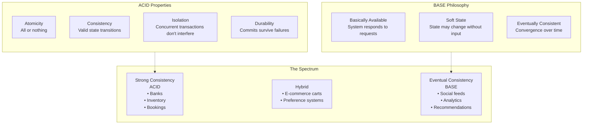

### BASE in Practice

```python
# Example: Eventually consistent shopping cart (Cassandra/DynamoDB style)

class EventuallyConsistentCart:
    """
    Cart that prioritizes availability over consistency.
    Uses last-write-wins with vector clocks for conflict resolution.
    """
    
    def add_item(self, user_id, item_id, quantity):
        # Write to local node immediately
        # Replication happens asynchronously
        cart_item = {
            'user_id': user_id,
            'item_id': item_id,
            'quantity': quantity,
            'timestamp': time.time(),
            'node_id': self.local_node_id
        }
        
        # Local write - returns immediately
        self.local_store.write(cart_item)
        
        # Async replication - doesn't block
        self.replication_queue.enqueue(cart_item)
        
        return {'status': 'accepted'}  # Not 'confirmed'!
    
    def get_cart(self, user_id):
        # Read from local node - may be stale
        items = self.local_store.read(user_id)
        
        # Optionally: read-repair from other nodes
        if self.should_read_repair():
            self.trigger_background_repair(user_id)
        
        return items
    
    def resolve_conflicts(self, conflicting_items):
        """
        When replicas have different values, resolve using:
        1. Last-write-wins (by timestamp)
        2. Or merge (add quantities together)
        """
        # Last-write-wins
        return max(conflicting_items, key=lambda x: x['timestamp'])
        
        # Alternative: Merge strategy (CRDT-style)
        # return {'quantity': sum(i['quantity'] for i in conflicting_items)}
```

## 6.3 When ACID is Non-Negotiable

Some domains cannot tolerate inconsistency:

### Financial Transactions
```sql
-- Bank transfer: ACID required
BEGIN TRANSACTION ISOLATION LEVEL SERIALIZABLE;
    -- Check sufficient funds
    SELECT balance INTO @alice_balance FROM accounts WHERE id = 'alice' FOR UPDATE;
    
    IF @alice_balance < 100 THEN
        ROLLBACK;
        SIGNAL SQLSTATE '45000' SET MESSAGE_TEXT = 'Insufficient funds';
    END IF;
    
    -- Perform transfer atomically
    UPDATE accounts SET balance = balance - 100 WHERE id = 'alice';
    UPDATE accounts SET balance = balance + 100 WHERE id = 'bob';
    
    -- Record transaction for audit
    INSERT INTO transactions (from_account, to_account, amount, timestamp)
    VALUES ('alice', 'bob', 100, NOW());
COMMIT;
```

**Why ACID**: If Alice has $100 and tries two $100 transfers simultaneously, without ACID one might succeed while the other sees stale balance. Result: Alice transferred $200 with only $100.

### Inventory Systems (With High Cost of Overselling)
```python
# Atomic inventory reservation
def reserve_inventory(product_id: str, quantity: int) -> bool:
    with database.transaction(isolation='SERIALIZABLE'):
        current = db.query(
            "SELECT available_qty FROM inventory WHERE product_id = %s FOR UPDATE",
            [product_id]
        ).fetchone()
        
        if current.available_qty < quantity:
            raise InsufficientInventoryError()
        
        db.execute(
            "UPDATE inventory SET available_qty = available_qty - %s WHERE product_id = %s",
            [quantity, product_id]
        )
        
        db.execute(
            "INSERT INTO reservations (product_id, quantity, expires_at) VALUES (%s, %s, %s)",
            [product_id, quantity, datetime.now() + timedelta(minutes=15)]
        )
        
        return True
```

### Booking Systems (Seats, Appointments, Reservations)
Double-booking a flight seat, hotel room, or doctor's appointment is unacceptable. ACID ensures only one booking succeeds.

## 6.4 When BASE Enables Scale

Some domains benefit from relaxed consistency:

### Social Media Feeds
```python
# Eventually consistent feed (acceptable)
class SocialFeed:
    """
    When Alice posts, her followers don't need to see it instantly.
    Eventual consistency allows massive scale.
    """
    
    def post(self, user_id, content):
        # Write to user's timeline immediately
        self.user_timeline.append(user_id, content)
        
        # Fan out to followers asynchronously
        for follower_id in self.get_followers(user_id):
            # This might take seconds or minutes
            self.follower_timeline_queue.enqueue({
                'follower_id': follower_id,
                'content': content
            })
        
        return {'status': 'posted'}
    
    def get_feed(self, user_id):
        # Return whatever is in local timeline
        # Might be missing recent posts from people user follows
        return self.follower_timeline.read(user_id)
```

**Why BASE is acceptable**: If a user sees a friend's post 30 seconds later, no business value is lost. But if the system is unavailable, user engagement drops.

### Activity Logs and Analytics
```python
# Eventually consistent event logging
class AnalyticsLogger:
    """
    Missing a few pageview events doesn't materially impact analytics.
    Prioritize availability and throughput.
    """
    
    def log_event(self, event):
        # Fire and forget - don't wait for confirmation
        try:
            self.kafka_producer.send(
                'events',
                value=event,
                # Don't wait for broker acknowledgment
            )
        except Exception as e:
            # Log locally, don't fail the user request
            self.local_buffer.append(event)
            self.metrics.increment('analytics.events.buffered')
        
        # Never block or fail the main user request
        return True
```

### Recommendation Systems
```python
# Eventually consistent recommendations
class RecommendationEngine:
    """
    Recommendations based on slightly stale data are still valuable.
    Fresh data isn't worth the latency cost.
    """
    
    def get_recommendations(self, user_id):
        # Read from cache (may be hours old)
        cached = self.cache.get(f'recs:{user_id}')
        if cached:
            return cached
        
        # Compute from eventually consistent feature store
        features = self.feature_store.get(user_id)  # Eventual consistency
        recommendations = self.model.predict(features)
        
        # Cache for future requests
        self.cache.set(f'recs:{user_id}', recommendations, ttl=3600)
        
        return recommendations
```

## 6.5 The Spectrum in Modern Systems

Modern distributed databases often offer tunable consistency, existing on a spectrum:

| System | Default Behavior | Tunable? | ACID Support |
|--------|------------------|----------|--------------|
| PostgreSQL | Strong ACID | Limited (sync/async replication) | Full |
| MySQL | Strong ACID | Limited | Full |
| MongoDB | Eventually consistent | Yes (write concern, read concern) | Multi-document ACID (4.0+) |
| Cassandra | Eventually consistent | Yes (consistency levels) | Lightweight transactions only |
| DynamoDB | Eventually consistent | Yes (strongly consistent reads) | Transactions (limited) |
| CockroachDB | Strong ACID | No (always serializable) | Full |
| Spanner | Strong ACID | No (always external consistency) | Full |
| TiDB | Strong ACID | Limited | Full |

### Tunable Consistency Example: MongoDB

```javascript
// MongoDB: Choose your consistency level per operation

// Eventually consistent write (fast)
db.users.insertOne(
    { name: "Alice", email: "alice@example.com" },
    { writeConcern: { w: 1 } }  // Acknowledge after primary writes
);

// Strongly consistent write (slower, safer)
db.users.insertOne(
    { name: "Bob", email: "bob@example.com" },
    { writeConcern: { w: "majority", j: true } }  // Majority of replicas + journaled
);

// Eventually consistent read (fast)
db.users.find({ email: "alice@example.com" })
    .readConcern("local");  // Read from local replica

// Strongly consistent read (slower)
db.users.find({ email: "bob@example.com" })
    .readConcern("majority");  // Only return data acknowledged by majority
```

## 6.6 Distributed ACID: NewSQL Databases

A new generation of databases provides ACID guarantees at scale:

### Google Spanner
- Globally distributed with strong consistency
- Uses TrueTime (atomic clocks + GPS) for global ordering
- External consistency: If transaction T1 commits before T2 starts, T1 is visible to T2 everywhere

### CockroachDB
- Open-source Spanner-inspired design
- Serializable isolation by default
- Automatic sharding and rebalancing

### YugabyteDB
- PostgreSQL-compatible wire protocol
- Distributed ACID transactions
- Tunable consistency for read-heavy workloads

```sql
-- CockroachDB: ACID transactions across distributed nodes
-- Works exactly like PostgreSQL

BEGIN;
    -- These rows might be on different nodes in different regions
    UPDATE accounts SET balance = balance - 100 WHERE id = 'alice';  -- Node in US-East
    UPDATE accounts SET balance = balance + 100 WHERE id = 'bob';    -- Node in EU-West
    
    -- CockroachDB ensures atomic commit across regions
COMMIT;
```

**Trade-off**: These systems have higher write latency than eventually consistent systems (cross-region coordination required), but provide strong guarantees.

### Key Takeaways
- ACID guarantees correctness; BASE enables availability and scale
- Choose ACID for financial, inventory, and booking systems
- Choose BASE for social feeds, analytics, and recommendations
- Modern systems offer tunable consistency—choose per operation
- NewSQL databases provide distributed ACID when you need both scale and consistency

### Reflection Questions
1. In your current systems, which operations require ACID guarantees that aren't currently receiving them?
2. Which operations have stronger consistency than they need, potentially sacrificing performance?
3. How would you explain to a business stakeholder the trade-off between "always correct" and "always available"?

---

# MODULE 7: Data Latency Spectrum

## 7.1 Defining Latency Tiers

Data latency isn't binary (real-time vs batch). It exists on a spectrum, and choosing the right tier is a critical architectural decision.

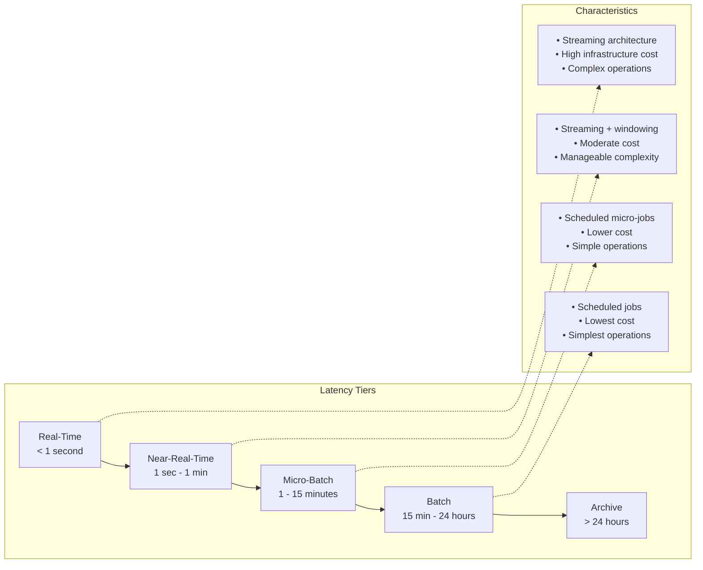

## 7.2 Matching Latency to Business Use Cases

| Latency Tier | Example Use Cases | Business Justification |
|--------------|-------------------|------------------------|
| **Real-Time (<1s)** | Fraud detection, trading, gaming leaderboards | Revenue loss or regulatory violation if delayed |
| **Near-Real-Time (1s-1min)** | Live dashboards, inventory updates, notifications | User experience or operational efficiency |
| **Micro-Batch (1-15min)** | Operational alerts, pricing updates, session analytics | Business cycles operate at this frequency |
| **Batch (15min-24hr)** | Daily reports, ML training, historical analysis | Decisions made daily/weekly, not hourly |
| **Archive (>24hr)** | Compliance, research, disaster recovery | Legal requirements, occasional access |

### The Latency Requirement Interview

Before choosing a tier, conduct this interview with stakeholders:

```markdown
## Latency Requirements Discovery

1. **What decision or action does this data support?**
   [Understanding the downstream use case]

2. **What is the cost of this data arriving 1 hour late?**
   - Lost revenue: $________
   - Regulatory penalty: $________
   - Customer impact: ________
   - Operational inefficiency: ________

3. **What is the cost of this data arriving 1 day late?**
   [Compare to hourly to understand the decay curve]

4. **How frequently do humans actually look at this data?**
   - Real-time (constantly monitored)
   - Hourly
   - Daily
   - Weekly
   - Ad-hoc

5. **Are there existing SLAs or contracts specifying latency?**
   [External requirements override internal preferences]

6. **What is the budget for infrastructure to achieve lower latency?**
   [Reality check on what's affordable]
```

## 7.3 The Cost Curve: Latency is Expensive

Lower latency costs exponentially more—in infrastructure, complexity, and operational burden.

```
                     │
 Infrastructure      │                                    ●
    Cost             │                               ●
                     │                          ●
                     │                     ●
                     │               ●
                     │         ●
                     │    ●
                     │●
                     └────────────────────────────────────────
                    Real-Time    NRT    Micro-Batch    Batch
                                 Latency Tier
```

**Real numbers** (approximate, highly variable):

| Latency Tier | Monthly Infrastructure Cost | Operational Complexity | On-Call Burden |
|--------------|----------------------------|----------------------|----------------|
| Batch (daily) | $1,000 - $5,000 | Low | Minimal |
| Micro-Batch (15min) | $3,000 - $15,000 | Low-Medium | Occasional |
| Near-Real-Time (1min) | $10,000 - $50,000 | Medium-High | Regular |
| Real-Time (<1s) | $30,000 - $200,000+ | High | Significant |

**The multipliers**:
- Streaming infrastructure (Kafka, Flink) vs batch (Airflow, Spark)
- Operational expertise (streaming specialists command premium)
- Failure modes (streaming failures are harder to diagnose and recover)
- Testing complexity (testing streaming is harder than testing batch)

## 7.4 Latency vs Throughput Trade-offs

You can optimize for latency OR throughput, not both simultaneously.

**Low Latency, Lower Throughput:
```python
# Process each event immediately
async def process_event(event):
    # No batching - immediate processing
    result = await transform(event)
    await write_to_database(result)  # One write per event
    return result

# Result: ~10ms latency, 100 events/second throughput
```

**High Throughput, Higher Latency**:
```python
# Batch events for efficient processing
class BatchProcessor:
    def __init__(self, batch_size=1000, max_wait_seconds=5):
        self.buffer = []
        self.batch_size = batch_size
        self.max_wait = max_wait_seconds
        self.last_flush = time.time()
    
    async def add_event(self, event):
        self.buffer.append(event)
        
        if len(self.buffer) >= self.batch_size or \
           time.time() - self.last_flush > self.max_wait:
            await self.flush()
    
    async def flush(self):
        if not self.buffer:
            return
        
        # Batch transform and write
        results = await batch_transform(self.buffer)
        await batch_write_to_database(results)  # One write for many events
        
        self.buffer = []
        self.last_flush = time.time()

# Result: ~5 second latency, 50,000 events/second throughput
```

**The trade-off in practice**:

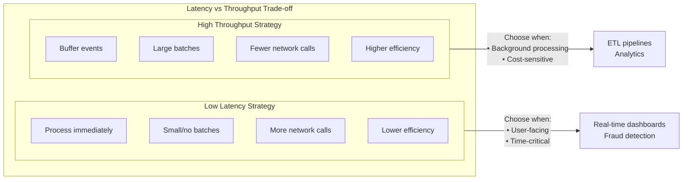

## 7.5 SLA Definition and Measurement

### Defining Meaningful SLAs

```yaml
# Example: Data Latency SLA Definition
data_pipeline_sla:
  name: "Order Events to Analytics"
  description: "Time from order placement to availability in analytics warehouse"
  
  measurement_points:
    start: "order.created event timestamp"
    end: "record available in analytics.orders table"
  
  targets:
    p50: 2 minutes   # 50% of events within 2 minutes
    p95: 5 minutes   # 95% of events within 5 minutes
    p99: 15 minutes  # 99% of events within 15 minutes
    max: 60 minutes  # No event should exceed 60 minutes
  
  exclusions:
    - "Planned maintenance windows"
    - "Force majeure events"
  
  measurement_frequency: "Continuous, reported hourly"
  
  breach_response:
    p95_breach: "Page on-call engineer"
    p99_breach: "Escalate to team lead"
    max_breach: "Incident declared, all hands"
```

### Percentile Latencies Explained

**Why percentiles matter more than averages**:

```
Scenario: 1000 requests
- 990 requests complete in 50ms
- 10 requests complete in 5000ms

Average: (990 × 50 + 10 × 5000) / 1000 = 99.5ms
p50 (median): 50ms
p99: 5000ms

The average looks fine. But 1% of users wait 100x longer.
```

```python
# Calculating latency percentiles
import numpy as np

def calculate_latency_percentiles(latencies):
    """
    Calculate standard latency percentiles.
    
    Args:
        latencies: List of latency measurements in milliseconds
    
    Returns:
        Dictionary of percentile values
    """
    return {
        'p50': np.percentile(latencies, 50),
        'p75': np.percentile(latencies, 75),
        'p90': np.percentile(latencies, 90),
        'p95': np.percentile(latencies, 95),
        'p99': np.percentile(latencies, 99),
        'p999': np.percentile(latencies, 99.9),
        'max': np.max(latencies),
        'mean': np.mean(latencies)
    }

# Example usage
latencies = [50, 52, 48, 55, 51, 5000, 49, 53, 47, 54]  # One slow request
print(calculate_latency_percentiles(latencies))
# {'p50': 51.5, 'p95': 2527.5, 'p99': 4505.0, 'max': 5000, 'mean': 545.9}
```

### Measuring End-to-End Data Latency

```sql
-- Measure actual data latency in your warehouse
-- Compare event timestamp to ingestion timestamp

SELECT
    DATE_TRUNC('hour', event_timestamp) as hour,
    
    -- Percentiles of ingestion latency
    PERCENTILE_CONT(0.50) WITHIN GROUP (ORDER BY latency_seconds) as p50_latency,
    PERCENTILE_CONT(0.95) WITHIN GROUP (ORDER BY latency_seconds) as p95_latency,
    PERCENTILE_CONT(0.99) WITHIN GROUP (ORDER BY latency_seconds) as p99_latency,
    MAX(latency_seconds) as max_latency,
    
    -- Volume context
    COUNT(*) as event_count,
    
    -- SLA compliance
    SUM(CASE WHEN latency_seconds <= 300 THEN 1 ELSE 0 END)::float / COUNT(*) as sla_compliance_rate

FROM (
    SELECT 
        event_timestamp,
        ingested_at,
        EXTRACT(EPOCH FROM (ingested_at - event_timestamp)) as latency_seconds
    FROM analytics.events
    WHERE event_timestamp >= CURRENT_DATE - INTERVAL '7 days'
) latency_data
GROUP BY 1
ORDER BY 1 DESC;
```

```python
# Automated SLA monitoring
from dataclasses import dataclass
from typing import Optional
import datetime

@dataclass
class LatencySLA:
    name: str
    p50_target_seconds: float
    p95_target_seconds: float
    p99_target_seconds: float
    max_target_seconds: float

@dataclass
class SLAReport:
    sla: LatencySLA
    measurement_time: datetime.datetime
    p50_actual: float
    p95_actual: float
    p99_actual: float
    max_actual: float
    
    @property
    def is_p50_compliant(self) -> bool:
        return self.p50_actual <= self.sla.p50_target_seconds
    
    @property
    def is_p95_compliant(self) -> bool:
        return self.p95_actual <= self.sla.p95_target_seconds
    
    @property
    def is_p99_compliant(self) -> bool:
        return self.p99_actual <= self.sla.p99_target_seconds
    
    @property
    def is_fully_compliant(self) -> bool:
        return all([
            self.is_p50_compliant,
            self.is_p95_compliant,
            self.is_p99_compliant,
            self.max_actual <= self.sla.max_target_seconds
        ])
    
    def get_violations(self) -> list[str]:
        violations = []
        if not self.is_p50_compliant:
            violations.append(f"p50: {self.p50_actual:.1f}s > {self.sla.p50_target_seconds}s target")
        if not self.is_p95_compliant:
            violations.append(f"p95: {self.p95_actual:.1f}s > {self.sla.p95_target_seconds}s target")
        if not self.is_p99_compliant:
            violations.append(f"p99: {self.p99_actual:.1f}s > {self.sla.p99_target_seconds}s target")
        if self.max_actual > self.sla.max_target_seconds:
            violations.append(f"max: {self.max_actual:.1f}s > {self.sla.max_target_seconds}s target")
        return violations
```

## 7.6 Practical Techniques for Reducing Latency

### Technique 1: Reduce Processing Stages

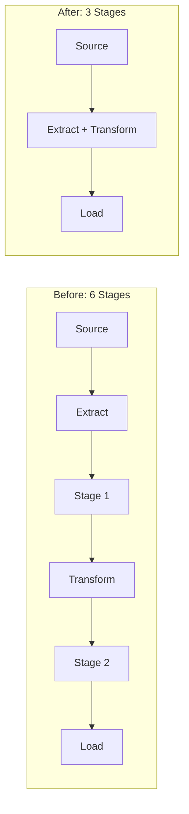

Every stage adds latency: serialization, network transfer, deserialization, scheduling overhead.

### Technique 2: Parallelize Where Possible

```python
# Before: Sequential processing
def process_partitions_sequential(partitions):
    results = []
    for partition in partitions:
        result = process_partition(partition)  # 10 seconds each
        results.append(result)
    return results  # 100 seconds for 10 partitions

# After: Parallel processing
from concurrent.futures import ThreadPoolExecutor

def process_partitions_parallel(partitions, max_workers=10):
    with ThreadPoolExecutor(max_workers=max_workers) as executor:
        results = list(executor.map(process_partition, partitions))
    return results  # ~10 seconds for 10 partitions (parallel)
```

### Technique 3: Push Computation Closer to Data

```python
# Before: Move data to compute
def aggregate_slow(source_table):
    # Pull all data to local machine
    df = spark.read.table(source_table)  # 1M rows, 5 minutes
    result = df.groupBy('category').agg(sum('amount'))
    return result

# After: Push computation to data
def aggregate_fast(source_table):
    # Execute aggregation in the database
    return spark.sql(f"""
        SELECT category, SUM(amount) 
        FROM {source_table} 
        GROUP BY category
    """)  # Database does the work, returns small result
```

### Technique 4: Use Incremental Processing

```python
# Before: Full recompute every run
def compute_daily_metrics_full():
    return spark.sql("""
        SELECT date, SUM(revenue) as total_revenue
        FROM orders
        WHERE date >= '2020-01-01'  -- Process ALL historical data
        GROUP BY date
    """)  # 30 minutes

# After: Incremental update
def compute_daily_metrics_incremental(last_processed_date):
    # Only process new data
    new_data = spark.sql(f"""
        SELECT date, SUM(revenue) as total_revenue
        FROM orders
        WHERE date > '{last_processed_date}'
        GROUP BY date
    """)  # 30 seconds
    
    # Merge with existing results
    existing = spark.read.table('daily_metrics')
    return existing.union(new_data)
```

### Technique 5: Optimize the Slowest Stage

```sql
-- Find the bottleneck: which stage takes longest?
SELECT
    stage_name,
    AVG(duration_seconds) as avg_duration,
    PERCENTILE_CONT(0.95) WITHIN GROUP (ORDER BY duration_seconds) as p95_duration,
    COUNT(*) as executions
FROM pipeline_stage_metrics
WHERE execution_date >= CURRENT_DATE - INTERVAL '7 days'
GROUP BY stage_name
ORDER BY avg_duration DESC;

-- Result might show:
-- stage_name          | avg_duration | p95_duration
-- join_customer_data  | 847          | 1203
-- aggregate_metrics   | 123          | 156
-- write_to_warehouse  | 45           | 67

-- Focus optimization on join_customer_data (the bottleneck)
```

### Key Takeaways
- Latency exists on a spectrum; choose the tier that matches business value
- Lower latency costs exponentially more in infrastructure and complexity
- Measure latency with percentiles (p50, p95, p99), not averages
- Define SLAs explicitly with clear measurement points and targets
- Optimize the bottleneck—faster non-bottleneck stages don't help

### Reflection Questions
1. What is the actual latency of your most critical data pipeline today? When was it last measured?
2. If you had to cut your data platform cost by 40% tomorrow, which latency requirements would you relax?
3. What would break if your real-time pipeline became a 15-minute batch job?

---

# MODULE 8: Schema-on-Write vs Schema-on-Read

## 8.1 Schema-on-Write: Enforced Structure

Schema-on-write means data must conform to a predefined structure at the moment it's written. If it doesn't conform, the write fails.

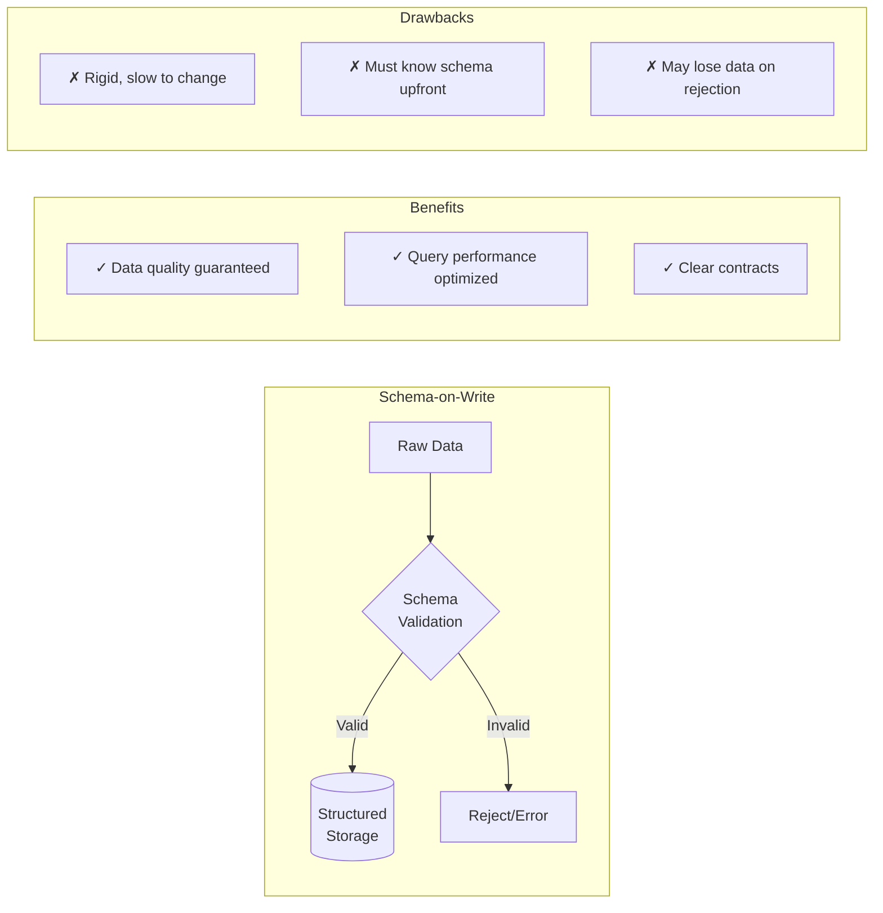

**Example: PostgreSQL Table**

```sql
-- Schema is defined upfront and enforced
CREATE TABLE orders (
    order_id UUID PRIMARY KEY,
    customer_id UUID NOT NULL REFERENCES customers(id),
    order_date TIMESTAMP NOT NULL,
    total_amount DECIMAL(10,2) NOT NULL CHECK (total_amount >= 0),
    status VARCHAR(20) NOT NULL CHECK (status IN ('pending', 'shipped', 'delivered', 'cancelled')),
    created_at TIMESTAMP DEFAULT CURRENT_TIMESTAMP
);

-- This insert works
INSERT INTO orders (order_id, customer_id, order_date, total_amount, status)
VALUES ('a1b2c3d4-...', 'x1y2z3-...', '2024-03-15', 99.99, 'pending');

-- This insert FAILS - schema enforced
INSERT INTO orders (order_id, customer_id, order_date, total_amount, status)
VALUES ('a1b2c3d4-...', 'x1y2z3-...', '2024-03-15', -50.00, 'unknown');
-- ERROR: new row violates check constraint "orders_total_amount_check"
-- ERROR: new row violates check constraint "orders_status_check"
```

## 8.2 Schema-on-Read: Deferred Structure

Schema-on-read means data is stored in its raw form. Structure is applied at query time.

```mermaid
flowchart LR
    subgraph SOR ["Schema-on-Read"]
        Source[Raw Data] --> Write[(Raw Storage<br/>JSON, Parquet)]
        Write --> Query[Query Engine]
        Query --> Apply{Apply<br/>Schema}
        Apply --> Result[Structured Result]
    end
    
    subgraph Benefits ["Benefits"]
        B1["✓ Flexible, fast ingestion"]
        B2
["✓ Schema evolves easily"]
        B3["✓ Never lose data on ingest"]
    end
    
    subgraph Drawbacks ["Drawbacks"]
        D1["✗ Query-time errors"]
        D2["✗ Performance overhead"]
        D3["✗ Quality issues hidden"]
    end
```

**Example: Raw JSON in S3/Data Lake**

```python
# Store raw JSON - no schema enforcement
import json
import boto3

s3 = boto3.client('s3')

def store_event(event: dict):
    # Accept anything - no validation
    s3.put_object(
        Bucket='data-lake-raw',
        Key=f'events/{event.get("date", "unknown")}/{event.get("id", "unknown")}.json',
        Body=json.dumps(event)
    )

# These all succeed - no schema enforcement
store_event({"id": "123", "date": "2024-03-15", "amount": 99.99, "status": "pending"})
store_event({"id": "456", "date": "2024-03-15", "amount": "not_a_number", "status": 123})
store_event({"completely": "different", "structure": True})
```

```sql
-- Schema applied at query time
-- Works for conforming data, fails or returns NULL for non-conforming

SELECT 
    JSON_EXTRACT_SCALAR(raw_json, '$.id') as id,
    CAST(JSON_EXTRACT_SCALAR(raw_json, '$.amount') as DECIMAL) as amount,  -- May fail!
    JSON_EXTRACT_SCALAR(raw_json, '$.status') as status
FROM raw_events
WHERE date_partition = '2024-03-15';

-- For the malformed record, this might:
-- 1. Return NULL for amount (if CAST is lenient)
-- 2. Throw an error (if CAST is strict)
-- 3. Skip the row entirely (with TRY_CAST)
```

## 8.3 Advantages and Dangers

### Schema-on-Write Advantages

| Advantage | Explanation |
|-----------|-------------|
| **Data Quality** | Bad data can't enter the system |
| **Query Performance** | Columnar storage, predicate pushdown, efficient encoding |
| **Clear Contracts** | Producers and consumers agree on structure |
| **Tooling Support** | IDEs, linters, type checkers work well |

### Schema-on-Write Dangers

| Danger | Explanation |
|--------|-------------|
| **Data Loss** | Rejected records may be lost forever if not handled |
| **Rigidity** | Schema changes require migrations, coordination |
| **Upfront Design** | Must know structure before collecting data |
| **Producer Burden** | Sources must transform data to fit schema |

### Schema-on-Read Advantages

| Advantage | Explanation |
|-----------|-------------|
| **Agility** | Ingest first, figure out structure later |
| **Exploration** | Useful for unknown or evolving data sources |
| **No Data Loss** | Everything is stored, even if malformed |
| **Producer Freedom** | Sources send what they have |

### Schema-on-Read Dangers

| Danger | Explanation | *War Story* |
|--------|-------------|-------------|
| **Hidden Quality Issues** | Problems discovered at query time, not ingest time | A data scientist spent 3 weeks on a model before realizing 30% of training data had NULL labels due to schema changes |
| **Query Failures** | Malformed data breaks queries | Production dashboard failed every Monday because weekend events had different format |
| **Performance** | Schema inference is expensive | A "simple" query took 45 minutes because it parsed 10TB of JSON |
| **Technical Debt** | "We'll clean it up later" never happens | 4 years of raw JSON with 47 different implicit schemas, undocumented |

## 8.4 Schema Evolution Strategies

Schemas change over time. How you handle changes determines system stability.

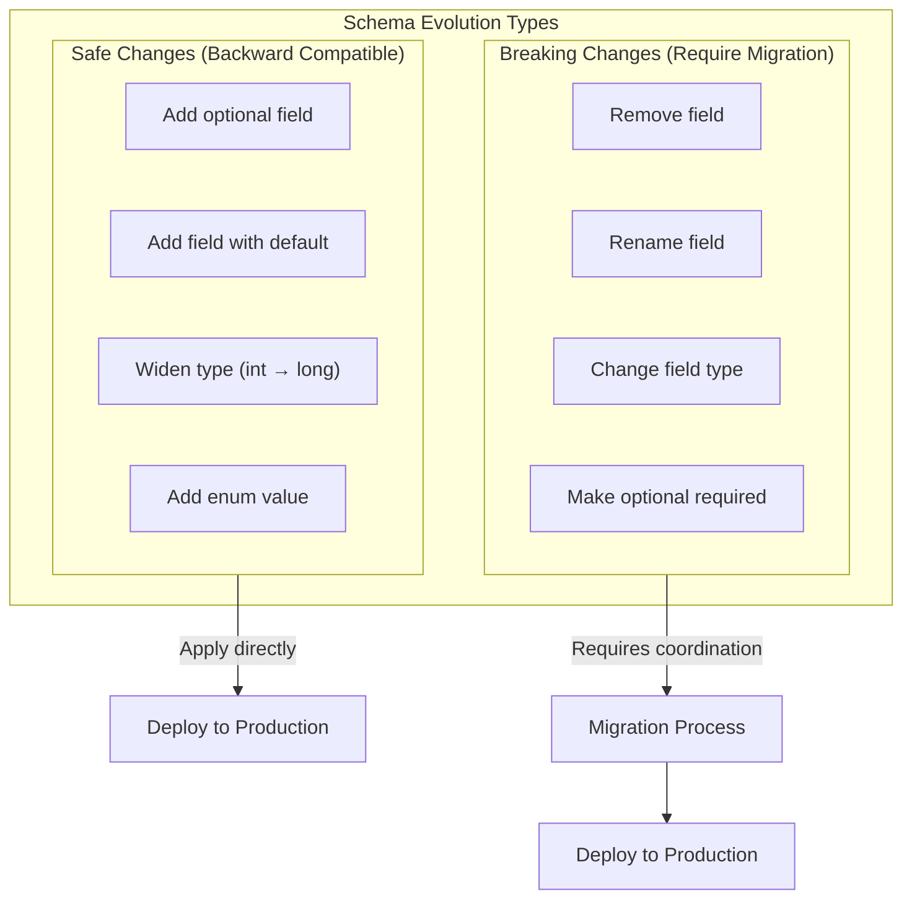

### Safe Changes: Add New Optional Fields

```sql
-- PostgreSQL: Safe schema evolution
-- Adding a new column with default is safe

ALTER TABLE orders ADD COLUMN shipping_method VARCHAR(50) DEFAULT 'standard';

-- Existing queries continue to work
-- New queries can use the new field
-- Old data has the default value
```

```python
# Avro: Backward compatible schema evolution
# Version 1
schema_v1 = {
    "type": "record",
    "name": "Order",
    "fields": [
        {"name": "order_id", "type": "string"},
        {"name": "amount", "type": "double"}
    ]
}

# Version 2 - backward compatible (new optional field with default)
schema_v2 = {
    "type": "record",
    "name": "Order",
    "fields": [
        {"name": "order_id", "type": "string"},
        {"name": "amount", "type": "double"},
        {"name": "currency", "type": "string", "default": "USD"}  # Safe!
    ]
}

# Readers with v2 schema can read v1 data (missing field gets default)
```

### Breaking Changes: Require Migration

```python
# Breaking change: Renaming a field
# WRONG: Just rename (breaks all consumers)
schema_wrong = {
    "fields": [
        {"name": "order_total", "type": "double"}  # Was "amount" - BREAKS CONSUMERS
    ]
}

# RIGHT: Add new field, deprecate old, migrate
schema_migration_step1 = {
    "fields": [
        {"name": "amount", "type": "double"},  # Keep old
        {"name": "order_total", "type": ["null", "double"], "default": None}  # Add new
    ]
}

# Producers start populating both fields
# Consumers migrate to new field
# After all consumers migrated, remove old field (step 2)
```

### Field Deprecation Process

```python
from datetime import date
from typing import Optional

class SchemaField:
    """Track field lifecycle for safe evolution."""
    
    def __init__(
        self,
        name: str,
        introduced_date: date,
        deprecated_date: Optional[date] = None,
        removal_date: Optional[date] = None,
        replaced_by: Optional[str] = None
    ):
        self.name = name
        self.introduced_date = introduced_date
        self.deprecated_date = deprecated_date
        self.removal_date = removal_date
        self.replaced_by = replaced_by
    
    @property
    def is_deprecated(self) -> bool:
        return self.deprecated_date is not None and date.today() >= self.deprecated_date
    
    @property
    def is_safe_to_remove(self) -> bool:
        return self.removal_date is not None and date.today() >= self.removal_date

# Document field lifecycle
ORDER_SCHEMA_FIELDS = [
    SchemaField("amount", introduced_date=date(2020, 1, 1), 
                deprecated_date=date(2024, 1, 1),
                removal_date=date(2024, 7, 1),
                replaced_by="order_total"),
    SchemaField("order_total", introduced_date=date(2024, 1, 1)),
]
```

## 8.5 Schema Registries

Schema registries provide a centralized source of truth for data schemas, enabling:
- Schema versioning and history
- Compatibility checking (prevent breaking changes)
- Schema discovery for consumers
- Serialization/deserialization standardization

### Confluent Schema Registry (Kafka Ecosystem)

```python
from confluent_kafka.schema_registry import SchemaRegistryClient
from confluent_kafka.schema_registry.avro import AvroSerializer, AvroDeserializer

# Connect to schema registry
schema_registry = SchemaRegistryClient({'url': 'http://schema-registry:8081'})

# Register a schema
schema_str = """
{
    "type": "record",
    "name": "Order",
    "namespace": "com.example",
    "fields": [
        {"name": "order_id", "type": "string"},
        {"name": "customer_id", "type": "string"},
        {"name": "amount", "type": "double"},
        {"name": "currency", "type": "string", "default": "USD"}
    ]
}
"""

# Schema ID is returned - used for serialization
schema_id = schema_registry.register_subject('orders-value', Schema(schema_str, 'AVRO'))
print(f"Registered schema with ID: {schema_id}")

# Set compatibility mode (prevents breaking changes)
schema_registry.set_compatibility('orders-value', 'BACKWARD')
# Options: BACKWARD, FORWARD, FULL, NONE
```

```bash
# Check schema compatibility before deploying
curl -X POST -H "Content-Type: application/vnd.schemaregistry.v1+json" \
    --data '{"schema": "{\"type\":\"record\",\"name\":\"Order\",\"fields\":[...]}"}' \
    http://schema-registry:8081/compatibility/subjects/orders-value/versions/latest

# Response: {"is_compatible": true} or {"is_compatible": false}
```

### AWS Glue Schema Registry

```python
import boto3

glue = boto3.client('glue')

# Create a registry
glue.create_registry(
    RegistryName='analytics-schemas',
    Description='Schemas for analytics data lake'
)

# Register a schema
response = glue.create_schema(
    RegistryId={'RegistryName': 'analytics-schemas'},
    SchemaName='orders',
    DataFormat='AVRO',
    Compatibility='BACKWARD',  # Enforce backward compatibility
    SchemaDefinition=schema_json_string
)

# Check compatibility before updating
compatibility_response = glue.check_schema_version_validity(
    DataFormat='AVRO',
    SchemaDefinition=new_schema_json_string
)

if compatibility_response['Valid']:
    glue.register_schema_version(
        SchemaId={'SchemaName': 'orders', 'RegistryName': 'analytics-schemas'},
        SchemaDefinition=new_schema_json_string
    )
```

## 8.6 Modern Middle Ground: Lakehouses

Lakehouse architectures combine the flexibility of data lakes with the structure of data warehouses.

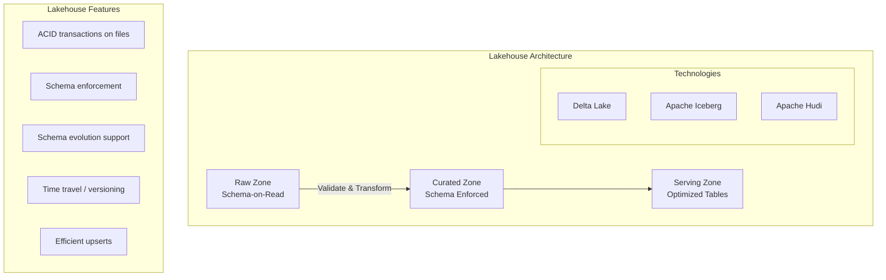

### Delta Lake Example

```python
from delta import DeltaTable
from pyspark.sql import SparkSession

spark = SparkSession.builder \
    .config("spark.sql.extensions", "io.delta.sql.DeltaSparkSessionExtension") \
    .getOrCreate()

# Write with schema enforcement
df = spark.createDataFrame([
    {"order_id": "123", "amount": 99.99, "currency": "USD"},
    {"order_id": "456", "amount": 149.99, "currency": "EUR"}
])

# First write establishes schema
df.write.format("delta").mode("overwrite").save("/data/orders")

# Subsequent writes must match schema (or explicitly evolve it)
new_df = spark.createDataFrame([
    {"order_id": "789", "amount": "not_a_number", "currency": "GBP"}  # Wrong type!
])

# This FAILS - schema mismatch
new_df.write.format("delta").mode("append").save("/data/orders")
# AnalysisException: Failed to merge fields 'amount' and 'amount'. 
# Failed to merge incompatible data types double and string

# To add a new column, explicitly allow schema evolution
df_with_new_col = spark.createDataFrame([
    {"order_id": "789", "amount": 79.99, "currency": "GBP", "shipping_method": "express"}
])

df_with_new_col.write \
    .format("delta") \
    .mode("append") \
    .option("mergeSchema", "true") \  # Explicitly allow evolution
    .save("/data/orders")
```

### Apache Iceberg Example

```python
from pyspark.sql import SparkSession

spark = SparkSession.builder \
    .config("spark.sql.catalog.my_catalog", "org.apache.iceberg.spark.SparkCatalog") \
    .config("spark.sql.catalog.my_catalog.type", "hadoop") \
    .config("spark.sql.catalog.my_catalog.warehouse", "s3://my-bucket/iceberg") \
    .getOrCreate()

# Create table with explicit schema
spark.sql("""
    CREATE TABLE my_catalog.analytics.orders (
        order_id STRING,
        customer_id STRING,
        amount DOUBLE,
        order_date DATE
    )
    USING iceberg
    PARTITIONED BY (order_date)
""")

# Schema evolution - add column (safe)
spark.sql("""
    ALTER TABLE my_catalog.analytics.orders
    ADD COLUMN currency STRING DEFAULT 'USD'
""")

# Schema evolution - rename column (safe in Iceberg)
spark.sql("""
    ALTER TABLE my_catalog.analytics.orders
    RENAME COLUMN amount TO order_total
""")

# Time travel - query historical data
spark.sql("""
    SELECT * FROM my_catalog.analytics.orders
    VERSION AS OF 3  -- Query version 3 of the table
""")

# Or by timestamp
spark.sql("""
    SELECT * FROM my_catalog.analytics.orders
    TIMESTAMP AS OF '2024-03-01 00:00:00'
""")
```

### Key Takeaways
- Schema-on-write ensures quality but requires upfront design
- Schema-on-read enables agility but hides quality issues
- Use schema-on-read for raw/landing zones, schema-on-write for curated/serving zones
- Schema registries prevent breaking changes in distributed systems
- Lakehouse technologies combine file-based storage with warehouse-like schema enforcement

### Reflection Questions
1. Where in your current architecture do schema problems typically surface—at ingest or at query time?
2. How would you discover if an upstream source changed their schema yesterday?
3. What's the oldest undocumented schema in your data platform?

---

# MODULE 9: Data Maturity Models

## 9.1 Stages of Data Maturity

Organizations progress through predictable stages of data capability:

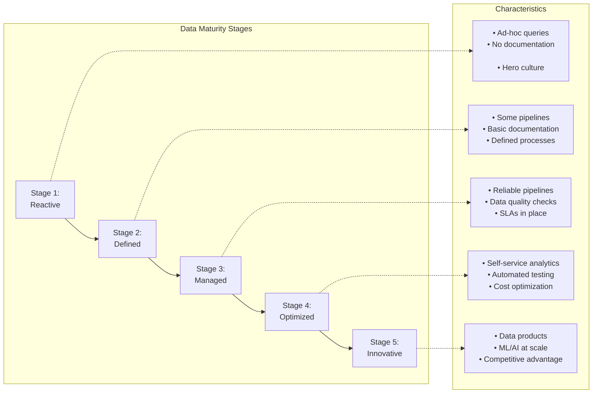

## 9.2 Detailed Stage Characteristics

### Stage 1: Reactive

**Symptoms**:
- Data lives in spreadsheets, emails, and individual databases
- "The data person" (singular) knows where everything is
- Queries are written ad-hoc, often from scratch
- No version control for SQL or transformations
- Reports are generated manually, often inconsistent
- Data requests take days or weeks

**Technical Indicators**:
```sql
-- You might find queries like this in someone's desktop folder
-- No comments, no version control, hardcoded values
SELECT * FROM orders WHERE date > '2023-06-01' AND sales_rep = 'John';
-- Run in production database directly
```

**Organizational Indicators**:
- No dedicated data team
- Business users export to Excel for analysis
- "Can you pull this data for me?" is a daily request
- No idea how much data infrastructure costs

### Stage 2: Defined

**Symptoms**:
- First dedicated data engineer or analyst hired
- Some pipelines exist (often fragile)
- Basic documentation in wikis or READMEs
- Defined (but not enforced) processes for data requests
- Single data warehouse established
- Still significant tribal knowledge

**Technical Indicators**:
```python
# Airflow DAG exists, but limited error handling
@dag(schedule='@daily', start_date=datetime(2024, 1, 1))
def sales_pipeline():
    
    @task
    def extract():
        # Hardcoded credentials, no retry logic
        conn = psycopg2.connect("host=prod-db user=admin password=password123")
        return pd.read_sql("SELECT * FROM orders", conn)
    
    @task
    def load(df):
        # No schema validation, no data quality checks
        df.to_gbq('analytics.orders', if_exists='replace')
    
    load(extract())
```

**Organizational Indicators**:
- Data team of 1-3 people
- Backlog of data requests exists
- Some dashboards, but trust is mixed
- "Can you check if this number is right?" is common

### Stage 3: Managed

**Symptoms**:
- Reliable data pipelines with monitoring
- Data quality checks implemented
- SLAs defined and tracked
- Documentation is current and discoverable
- Self-service for simple queries
- Clear ownership of data assets

**Technical Indicators**:
```python
# dbt model with tests and documentation
# models/marts/orders.sql
"""
{{ config(
    materialized='incremental',
    unique_key='order_id',
    tags=['daily', 'finance']
) }}

/*
    Orders fact table - source of truth for order metrics
    Owner: data-platform@company.com
    SLA: Updated by 6am UTC daily
*/

WITH source AS (
    SELECT * FROM {{ ref('stg_orders') }}
    WHERE order_date > COALESCE(
        (SELECT MAX(order_date) FROM {{ this }}),
        '2020-01-01'
    )
),

validated AS (
    SELECT *
    FROM source
    WHERE order_id IS NOT NULL
      AND total_amount >= 0
      AND customer_id IS NOT NULL
)

SELECT * FROM validated
"""

# schema.yml - tests and documentation
"""
models:
  - name: orders
    description: "Cleaned and validated orders fact table"
    columns:
      - name: order_id
        description: "Unique order identifier"
        tests:
          - unique
          - not_null
      - name: total_amount
        tests:
          - not_null
          - dbt_utils.accepted_range:
              min_value: 0
              max_value: 1000000
"""
```

**Organizational Indicators**:
- Data team of 5-15 people
- Data catalog or documentation portal exists
- Regular data quality reviews
- Stakeholders trust "official" metrics
- Incident response process for data issues

### Stage 4: Optimized

**Symptoms**:
- Self-service analytics for most use cases
- Automated testing and deployment pipelines
- Cost visibility and optimization practices
- Data products with defined consumers
- Advanced analytics and basic ML in production
- Data governance program in place

**Technical Indicators**:
```yaml
# CI/CD pipeline for data assets
# .github/workflows/data-ci.yml
name: Data Pipeline CI

on:
  pull_request:
    paths:
      - 'dbt/**'
      - 'airflow/**'

jobs:
  test:
    runs-on: ubuntu-latest
    steps:
      - uses: actions/checkout@v3
      
      - name: Install dbt
        run: pip install dbt-snowflake
      
      - name: Run dbt compile
        run: dbt compile --target ci
      
      - name: Run dbt test
        run: dbt test --target ci --select state:modified+
      
      - name: Check SQL linting
        run: sqlfluff lint dbt/models/
      
      - name: Validate DAG structure
        run: python scripts/validate_dags.py
      
      - name: Cost impact analysis
        run: python scripts/estimate_query_cost.py --pr ${{ github.event.number }}

  deploy:
    needs: test
    if: github.ref == 'refs/heads/main'
    runs-on: ubuntu-latest
    steps:
      - name: Deploy to production
        run: dbt run --target prod --select state:modified+
```

**Organizational Indicators**:
- Dedicated data platform team
- Business analysts can self-serve most queries
- FinOps practices for data costs
- Regular architecture reviews
- ML models in production (beyond experimentation)

### Stage 5: Innovative

**Symptoms**:
- Data is a core business asset and competitive advantage
- Data products generate revenue or significant efficiency
- Real-time and streaming capabilities mature
- Advanced ML/AI embedded in products
- Data mesh or federated ownership models
- Continuous experimentation culture

**Technical Indicators**:
```python
# Feature store with real-time serving
# Automated ML pipelines, A/B testing infrastructure

from feast import FeatureStore

store = FeatureStore(repo_path=".")

# Real-time feature retrieval for ML serving
features = store.get_online_features(
    features=[
        "user_features:lifetime_value",
        "user_features:purchase_frequency",
        "user_features:last_activity_days",
        "product_features:category_affinity_score"
    ],
    entity_rows=[{"user_id": "user_123", "product_id": "prod_456"}]
).to_dict()

# Feed to real-time recommendation model
recommendation = model.predict(features)
```

**Organizational Indicators**:
- Chief Data Officer or equivalent executive
- Data team as a profit center, not cost center
- Domain teams own their data products
- Industry-recognized data capabilities
- Data-driven decision making is cultural norm

## 9.3 Common Stalls: Why Organizations Get Stuck

### Stuck at Stage 2 (Defined)

**Symptoms**:
- "We have Airflow/dbt but things still break"
- Documentation exists but is outdated
- Data team is always firefighting
- Business still doesn't trust the data

**Root Causes**:
1. **Underinvestment in quality**: Pipelines built without testing or monitoring
2. **Hero culture**: One person knows everything, no knowledge sharing
3. **Technical debt accumulation**: "We'll fix it later" never happens
4. **Lack of executive sponsorship**: Data seen as cost center

**Escape Path**:
```markdown
## Stage 2 → Stage 3 Transition Checklist

### People
- [ ] Hire or develop dedicated data quality focus
- [ ] Implement on-call rotation (share the pain)
- [ ] Document tribal knowledge before people leave

### Process
- [ ] Define SLAs for critical pipelines
- [ ] Implement incident review process
- [ ] Create data request intake process with prioritization

### Technology
- [ ] Add data quality testing to all pipelines
- [ ] Implement alerting and monitoring
- [ ] Create data catalog (even if simple)
- [ ] Version control ALL SQL and transformations
```

### Stuck at Stage 3 (Managed)

**Symptoms**:
- Reliable pipelines but slow to change
- Self-service is "almost there" but never arrives
- Data team is bottleneck for new requests
- Advanced analytics/ML projects stall

**Root Causes**:
1. **Centralized bottleneck**: All requests funnel through data team
2. **Fear of change**: Working systems not refactored
3. **Technical platform gaps**: Infrastructure doesn't support self-service
4. **Skill gaps**: Team strong on engineering, weak on ML/advanced analytics

**Escape Path**:
```markdown
## Stage 3 → Stage 4 Transition Checklist

### People
- [ ] Embed data engineers in domain teams (or train domain analysts)
- [ ] Hire or develop ML engineering capabilities
- [ ] Create data champions in business units

### Process
- [ ] Define data product ownership model
- [ ] Implement self-service data request workflow
- [ ] Create clear path for "promote to production" from ad-hoc analysis

### Technology
- [ ] Deploy semantic layer or metrics store
- [ ] Implement feature store for ML
- [ ] Create sandbox environments for exploration
- [ ] Automate pipeline deployment (CI/CD)
```

## 9.4 Maturity Assessment Questionnaire

Score each item: 0 (Not at all) to 4 (Fully implemented)

```markdown
## Data Maturity Self-Assessment

### Data Infrastructure (max 20 points)
___ Centralized data warehouse or lakehouse exists
___ Pipelines are version controlled
___ Automated testing for data pipelines
___ Monitoring and alerting in place
___ CI/CD for data assets

### Data Quality (max 20 points)
___ Data quality checks on critical pipelines
___ Schema validation at ingestion
___ Anomaly detection for key metrics
___ Data quality SLAs defined and tracked
___ Data quality issues are systematically addressed

### Documentation & Discovery (max 20 points)
___ Data catalog exists and is current
___ Business glossary defines key terms
___ Lineage tracking (where data comes from)
___ Documentation is discoverable (not hidden in wikis)
___ New team members can find data independently

### Self-Service & Access (max 20 points)
___ Business users can query data without data team
___ Semantic layer or governed metrics exist
___ Access controls are defined and enforced
___ Sandbox environments available for exploration
___ Training and support for self-service tools

### Advanced Capabilities (max 20 points)
___ ML models in production (not just experiments)
___ Real-time or streaming data available
___ Data products with defined consumers
___ A/B testing infrastructure exists
___ Data contributes directly to revenue/efficiency

## Scoring Guide
0-20:   Stage 1 (Reactive)
21-40:  Stage 2 (Defined)
41-60:  Stage 3 (Managed)
61-80:  Stage 4 (Optimized)
81-100: Stage 5 (Innovative)
```

## 9.5 Building a Maturity Roadmap

### Incremental Improvements vs Platform Rewrites

**Default to incremental improvements**:
```mermaid
flowchart LR
    subgraph Incremental ["Incremental Approach"]
        I1["Add tests to<br/>critical pipelines"]
        I2["Document top 10<br/>data assets"]
        I3["Implement alerting<br/>for failures"]
        I4["Create simple<br/>data catalog"]
        I5["Train analysts<br/>on SQL"]
    end
    
    I1 --> I2 --> I3 --> I4 --> I5
    
    subgraph Characteristics
        C1["• Low risk"]
        C2["• Continuous value"]
        C3["• Builds capability"]
    end
```

**Platform rewrites only when**:
- Current platform fundamentally cannot scale
- Technical debt interest exceeds new development capacity
- Business requirements are impossible on current stack
- Team has capacity for 6-12 month investment

```mermaid
flowchart TD
    subgraph Decision ["Rewrite Decision Framework"]
        Q1{Can current platform<br/>support 3-year growth?}
        Q1 -->|Yes| Incremental[Incremental Improvements]
        Q1 -->|No| Q2{Is technical debt<br/>> 50% of sprint capacity?}
        Q2 -->|No| Incremental
        Q2 -->|Yes| Q3{Do you have 6-12 months<br/>of dedicated capacity?}
        Q3 -->|No| Incremental[Incremental + Hire]
        Q3 -->|Yes| Rewrite[Consider Rewrite]
    end
```

## 9.6 The People Dimension

**Skills must evolve with maturity**:

| Stage | Key Skills Needed |
|-------|-------------------|
| 1 → 2 | SQL, basic Python, first orchestration tool |
| 2 → 3 | Testing practices, monitoring, documentation |
| 3 → 4 | CI/CD, infrastructure as code, ML basics, mentoring |
| 4 → 5 | Architecture, data mesh, advanced ML, leadership |

**Team structure evolution**:

```
Stage 2: Centralized generalists
┌─────────────────────────────────┐
│         Data Team               │
│  ┌─────┐ ┌─────┐ ┌─────┐       │
│  │ DE  │ │ DE  │ │ DA  │       │
│  └─────┘ └─────┘ └─────┘       │
└─────────────────────────────────┘

Stage 4: Platform + Embedded specialists
┌───────────────────┐
│   Data Platform   │ ← Shared infrastructure
│  ┌─────┐ ┌─────┐  │
│  │ PE  │ │ PE  │  │
│  └─────┘ └─────┘  │
└───────────────────┘
         │
    ┌────┴────┬─────────┐
    ▼         ▼         ▼
┌───────┐ ┌───────┐ ┌───────┐
│Sales  │ │Product│ │Finance│ ← Domain teams with embedded data
│Domain │ │Domain │ │Domain │
│┌────┐ │ │┌────┐ │ │┌────┐ │
││ AE ││ ││ AE ││ ││ AE ││   (AE = Analytics Engineer)
│└────┘ │ │└────┘ │ │└────┘ │
└───────┘ └───────┘ └───────┘
```

### Key Takeaways
- Maturity progression is sequential—you can't skip stages
- Most organizations stall at Stage 2 due to underinvestment in quality
- Incremental improvement beats platform rewrites in most cases
- Team skills must evolve alongside platform maturity
- Assessment should drive prioritized roadmap, not boil-the-ocean initiatives

### Reflection Questions
1. What stage is your current organization at? What evidence supports your assessment?
2. What's the single biggest blocker preventing progression to the next stage?
3. If you could only improve three things in the next quarter, what would have the highest maturity impact?

---

# MODULE 10: Organizational Models for Data

## 10.1 Centralized Data Teams

All data engineers, analysts, and scientists report to a single data organization.

```mermaid
flowchart TB
    subgraph Centralized ["Centralized Data Team"]
        CDO[Chief Data Officer]
        CDO --> DE[Data Engineering]
        CDO --> DA[Data Analytics]
        CDO --> DS[Data Science]
        
        DE -->
DE1[DE 1] & DE2[DE 2] & DE3[DE 3]
        DA --> DA1[Analyst 1] & DA2[Analyst 2]
        DS --> DS1[DS 1] & DS2[DS 2]
    end
    
    subgraph Business ["Business Units (Requesters)"]
        Sales[Sales]
        Product[Product]
        Finance[Finance]
        Marketing[Marketing]
    end
    
    Business -->|"Data Requests"| Centralized
    Centralized -->|"Dashboards, Reports, Models"| Business
```

### Advantages

| Advantage | Explanation |
|-----------|-------------|
| **Consistency** | Single standards for data models, quality, tools |
| **Efficiency** | No duplicated effort across teams |
| **Governance** | Centralized control over access, security, compliance |
| **Career paths** | Clear progression within data discipline |
| **Knowledge sharing** | Data practitioners learn from each other |

### Disadvantages

| Disadvantage | Explanation |
|--------------|-------------|
| **Bottleneck** | All requests funnel through one team |
| **Context switching** | Team serves many domains, masters none |
| **Prioritization conflicts** | Which business unit gets served first? |
| **Slow delivery** | Backlog grows faster than capacity |
| **Domain ignorance** | Data team doesn't understand business nuances |

### When Centralized Works Best

- **Early stage** (< 10 data practitioners): Not enough people to distribute
- **Heavy governance requirements**: Regulated industries (finance, healthcare)
- **Shared data assets**: Most data is used across multiple domains
- **Immature data culture**: Business units not ready to own data

```python
# Centralized team: Request intake process
class DataRequest:
    """
    All data work flows through centralized intake.
    Good for governance, bad for speed.
    """
    
    PRIORITY_WEIGHTS = {
        'revenue_impact': 0.3,
        'executive_sponsor': 0.2,
        'regulatory_requirement': 0.3,
        'effort_estimate': 0.1,
        'strategic_alignment': 0.1
    }
    
    def __init__(self, title, requester, domain, description):
        self.title = title
        self.requester = requester
        self.domain = domain
        self.description = description
        self.scores = {}
    
    def calculate_priority(self):
        """Weighted scoring to prioritize across domains."""
        total = sum(
            self.scores.get(factor, 0) * weight 
            for factor, weight in self.PRIORITY_WEIGHTS.items()
        )
        return total
    
    def assign_to_sprint(self, sprint_capacity):
        """Central team assigns work from prioritized backlog."""
        # This is where bottlenecks form
        pass
```

## 10.2 Embedded/Federated Data Engineers

Data practitioners report to domain teams (Sales, Product, Finance) rather than a central data organization.

```mermaid
flowchart TB
    subgraph Sales ["Sales Domain"]
        SM[Sales Manager]
        SM --> SR[Sales Reps]
        SM --> SDE[Data Engineer]
        SM --> SA[Analyst]
    end
    
    subgraph Product ["Product Domain"]
        PM[Product Manager]
        PM --> ENG[Engineers]
        PM --> PDE[Data Engineer]
        PM --> PA[Analyst]
    end
    
    subgraph Finance ["Finance Domain"]
        FM[Finance Manager]
        FM --> FA[Accountants]
        FM --> FDE[Data Engineer]
        FM --> FAN[Analyst]
    end
    
    subgraph SharedInfra ["Shared Infrastructure (Minimal)"]
        Infra[Platform Team]
    end
    
    SDE & PDE & FDE -.->|"Uses shared tools"| Infra
```

### Advantages

| Advantage | Explanation |
|-----------|-------------|
| **Speed** | No cross-team dependencies for domain work |
| **Domain expertise** | Deep understanding of business context |
| **Alignment** | Data priorities match domain priorities |
| **Ownership** | Clear accountability for domain data |
| **Responsiveness** | Can react quickly to domain needs |

### Disadvantages

| Disadvantage | Explanation |
|--------------|-------------|
| **Fragmentation** | Multiple conflicting definitions of metrics |
| **Duplication** | Same data modeled differently in each domain |
| **Tool sprawl** | Each team picks their own tools |
| **Governance gaps** | No one owns cross-domain concerns |
| **Career isolation** | Data practitioners disconnected from peers |

### When Embedded Works Best

- **Mature domains**: Business units ready to own data responsibility
- **Distinct data needs**: Domains have different data, not shared
- **Speed over consistency**: Time-to-insight more valuable than standardization
- **Strong platform**: Shared infrastructure reduces duplication

```python
# Embedded model: Domain-owned data products
class DomainDataProduct:
    """
    Each domain owns their data products.
    Fast iteration, potential inconsistency.
    """
    
    def __init__(self, domain, name, owner):
        self.domain = domain
        self.name = name
        self.owner = owner  # Reports to domain, not data team
        self.consumers = []
    
    def define_metric(self, metric_name, definition):
        """
        Domain defines their own metrics.
        Risk: Sales "revenue" != Finance "revenue"
        """
        self.metrics[metric_name] = definition
        # No central approval required - fast but risky
    
    def publish(self):
        """
        Domain publishes without central review.
        Speed advantage, governance risk.
        """
        self.catalog.register(self)
        self.notify_consumers()
```

## 10.3 Data Mesh Principles

Data mesh is an organizational and architectural paradigm treating data as a product, owned by domain teams, supported by a self-serve platform.

```mermaid
flowchart TB
    subgraph DataMesh ["Data Mesh Architecture"]
        subgraph Platform ["Self-Serve Data Platform"]
            Infra[Infrastructure as a Service]
            Catalog[Data Catalog]
            Governance[Federated Governance]
            Tools[Standard Tools & Templates]
        end
        
        subgraph Domains ["Domain Data Products"]
            subgraph Sales ["Sales Domain"]
                SP1[Customer Data Product]
                SP2[Pipeline Data Product]
            end
            
            subgraph Product ["Product Domain"]
                PP1[Usage Data Product]
                PP2[Feature Data Product]
            end
            
            subgraph Finance ["Finance Domain"]
                FP1[Revenue Data Product]
                FP2[Cost Data Product]
            end
        end
        
        Platform -->|"Enables"| Domains
        SP1 & SP2 & PP1 & PP2 & FP1 & FP2 -->|"Register"| Catalog
        Governance -->|"Policies apply to"| Domains
    end
```

### The Four Principles

#### 1. Domain Ownership
Domains own their data end-to-end: ingestion, transformation, quality, serving.

```python
class DomainOwnership:
    """
    The domain that generates data owns it as a product.
    """
    
    def __init__(self, domain_name):
        self.domain_name = domain_name
        self.data_products = []
        self.team = DomainTeam()  # Includes data engineers
    
    def own_data_product(self, product):
        """Domain takes full responsibility."""
        product.owner = self.domain_name
        product.sla = self.define_sla(product)
        product.quality_checks = self.define_quality(product)
        product.documentation = self.write_docs(product)
        self.data_products.append(product)
    
    def define_sla(self, product):
        """Domain commits to service level."""
        return {
            'freshness': '1 hour',
            'availability': '99.9%',
            'quality_score': '>95%'
        }
```

#### 2. Data as a Product
Data is treated with the same rigor as customer-facing products: discoverable, addressable, trustworthy, self-describing.

```python
class DataProduct:
    """
    Data treated as a product with consumers.
    """
    
    def __init__(self, name, domain):
        self.name = name
        self.domain = domain
        
        # Product characteristics
        self.discoverable = True  # In catalog
        self.addressable = True   # Stable, published location
        self.trustworthy = True   # Quality guarantees
        self.self_describing = True  # Schema, docs included
        self.interoperable = True  # Standard formats
        self.secure = True  # Access controls
    
    def publish(self):
        """Publishing requires meeting quality bar."""
        assert self.has_documentation(), "Documentation required"
        assert self.has_schema(), "Schema required"
        assert self.has_quality_checks(), "Quality checks required"
        assert self.has_sla(), "SLA required"
        
        self.catalog.register(self)
        self.notify_potential_consumers()
    
    def get_consumer_satisfaction(self):
        """Track product success like any product."""
        return {
            'nps_score': self.survey_consumers(),
            'usage_count': self.count_queries(),
            'issue_count': self.count_support_tickets()
        }
```

#### 3. Self-Serve Data Platform
A platform team provides infrastructure that enables domains to build and operate data products without deep platform expertise.

```python
class SelfServeDataPlatform:
    """
    Platform enables domains, doesn't own data.
    """
    
    def __init__(self):
        self.infrastructure = ManagedInfrastructure()
        self.templates = DataProductTemplates()
        self.governance = AutomatedGovernance()
    
    def provision_domain_environment(self, domain):
        """One-click setup for new domain."""
        return {
            'storage': self.infrastructure.create_bucket(domain),
            'compute': self.infrastructure.create_compute(domain),
            'catalog_namespace': self.catalog.create_namespace(domain),
            'cicd_pipeline': self.templates.create_pipeline(domain),
            'monitoring': self.observability.create_dashboards(domain)
        }
    
    def provide_templates(self):
        """Domains use templates, don't build from scratch."""
        return [
            'data-ingestion-template',
            'data-transformation-template',
            'data-quality-template',
            'data-serving-template'
        ]
    
    def enforce_governance_automatically(self, data_product):
        """Policies applied automatically, not manually."""
        self.governance.apply_pii_detection(data_product)
        self.governance.apply_access_controls(data_product)
        self.governance.apply_retention_policies(data_product)
```

#### 4. Federated Computational Governance
Governance is embedded in the platform, applied automatically, but defined collaboratively.

```python
class FederatedGovernance:
    """
    Global policies, local execution.
    """
    
    def __init__(self):
        self.global_policies = []  # Defined by governance council
        self.domain_policies = {}   # Extended by domains
    
    def define_global_policy(self, policy):
        """
        Global standards apply everywhere.
        E.g., PII handling, retention minimums
        """
        self.global_policies.append(policy)
    
    def allow_domain_extension(self, domain, policy):
        """
        Domains can add stricter policies.
        E.g., Finance adds extra audit requirements
        """
        self.domain_policies[domain].append(policy)
    
    def enforce_at_publish_time(self, data_product):
        """
        Policies checked automatically at publish.
        No manual review required for compliant products.
        """
        all_policies = (
            self.global_policies + 
            self.domain_policies.get(data_product.domain, [])
        )
        
        violations = []
        for policy in all_policies:
            if not policy.check(data_product):
                violations.append(policy.describe_violation())
        
        if violations:
            raise GovernanceViolation(violations)
```

## 10.4 When Data Mesh Makes Sense vs Premature Complexity

### Data Mesh Prerequisites

| Prerequisite | Why Required |
|--------------|--------------|
| **Multiple domains with distinct data** | If all data is shared, centralized is simpler |
| **Domain teams with data capability** | Domains must be able to own data work |
| **Mature platform engineering** | Self-serve platform requires significant investment |
| **Executive alignment** | Organizational change requires top-down support |
| **Scale (50+ data practitioners)** | Coordination overhead not worth it for small teams |

### Warning Signs: Too Early for Data Mesh

```markdown
## You're NOT ready for data mesh if:

- [ ] You have fewer than 5 data engineers total
- [ ] Domains don't have embedded data capability
- [ ] No platform team exists
- [ ] Data governance is immature or non-existent
- [ ] "Data mesh" is being proposed to solve a tooling problem
- [ ] Executive sponsor doesn't understand organizational implications
- [ ] Domains don't want ownership (want to throw requests over wall)
```

### Data Mesh Adoption Path

```mermaid
flowchart TD
    Start[Current State] --> Q1{Do you have<br/>50+ data practitioners?}
    Q1 -->|No| NotReady[Not ready for data mesh]
    Q1 -->|Yes| Q2{Do domains have<br/>embedded data capability?}
    Q2 -->|No| BuildCapability[Build domain capability first]
    Q2 -->|Yes| Q3{Is platform team<br/>mature?}
    Q3 -->|No| BuildPlatform[Invest in platform team]
    Q3 -->|Yes| Q4{Is governance<br/>defined?}
    Q4 -->|No| BuildGovernance[Define governance framework]
    Q4 -->|Yes| Ready[Ready for data mesh pilot]
    Ready --> Pilot[Start with 1-2 domains]
    Pilot --> Evaluate{Pilot successful?}
    Evaluate -->|Yes| Expand[Expand to more domains]
    Evaluate -->|No| Adjust[Adjust approach or reconsider]
```

## 10.5 Hybrid Models

Most organizations end up with hybrid models—centralized platform, federated ownership.

```mermaid
flowchart TB
    subgraph Hybrid ["Hybrid Model: Centralized Platform + Federated Ownership"]
        subgraph CentralPlatform ["Central Platform Team"]
            Infra[Infrastructure]
            Tools[Tooling & Standards]
            CoreData[Core/Shared Data]
            Gov[Governance Framework]
        end
        
        subgraph Domains ["Domain Teams (Own Their Data)"]
            Sales[Sales Domain<br/>+ Embedded AE]
            Product[Product Domain<br/>+ Embedded DE]
            Finance[Finance Domain<br/>+ Embedded Analyst]
        end
        
        CentralPlatform -->|"Provides platform"| Domains
        Domains -->|"Uses platform,<br/>owns domain data"| CentralPlatform
        
        subgraph CoE ["Data CoE (Community of Practice)"]
            Standards[Standards Definition]
            Training[Training & Mentorship]
            BestPractices[Best Practices]
        end
        
        CoE -.->|"Guides"| Domains
        CoE -.->|"Informs"| CentralPlatform
    end
```

### Division of Responsibilities

| Responsibility | Central Platform | Domain Team |
|----------------|------------------|-------------|
| Infrastructure (compute, storage) | ✓ Provides | Uses |
| Tooling (orchestration, catalog) | ✓ Provides | Uses |
| Core/shared data models | ✓ Owns | Consumes |
| Domain-specific data | Enables | ✓ Owns |
| Data quality standards | ✓ Defines | ✓ Implements |
| Access controls framework | ✓ Provides | ✓ Configures |
| Pipeline templates | ✓ Provides | ✓ Uses/extends |
| SLA definition | ✓ Framework |
✓ Specific commitments |
| Incident response | ✓ Platform issues | ✓ Domain data issues |
| Cost management | ✓ Platform costs | ✓ Domain usage costs |

## 10.6 Conway's Law and Data Architecture

> "Organizations which design systems are constrained to produce designs which are copies of the communication structures of these organizations." — Melvin Conway, 1967

**Implication for data**: Your data platform will mirror your org chart, whether you intend it or not.

```mermaid
flowchart LR
    subgraph OrgStructure ["Organization Structure"]
        direction TB
        CEO[CEO]
        CEO --> Sales[Sales VP]
        CEO --> Product[Product VP]
        CEO --> Eng[Engineering VP]
        Sales --> SalesTeam[Sales Team]
        Product --> ProductTeam[Product Team]
        Eng --> DataTeam[Data Team]
    end
    
    subgraph DataArch ["Resulting Data Architecture"]
        direction TB
        DW[(Data Warehouse)]
        DW --> SalesMart[Sales Mart<br/>Owned by Data Team<br/>Requested by Sales]
        DW --> ProductMart[Product Mart<br/>Owned by Data Team<br/>Requested by Product]
        SalesMart -.->|"Friction"| ProductMart
    end
    
    OrgStructure -->|"Conway's Law"| DataArch
```

### Conway's Law Manifestations

| Org Pattern | Data Architecture Result |
|-------------|-------------------------|
| Siloed departments | Siloed data marts with no integration |
| Central IT controls all | Monolithic data warehouse, all requests through IT |
| Autonomous product teams | Fragmented data, inconsistent definitions |
| Matrix organization | Complex, confusing data ownership |
| Strong platform team | Well-governed, self-service capabilities |

### Working With Conway's Law

**Option 1: Accept and optimize**
```markdown
If org structure won't change, design data architecture to work with it:
- Clear handoff points between teams
- Explicit contracts at boundaries
- Accept some duplication as cost of autonomy
```

**Option 2: Inverse Conway Maneuver**
```markdown
Change org structure to get desired architecture:
- Want data mesh? Create domain teams with data capability
- Want consistency? Centralize data team with embedded model
- Want speed? Co-locate data engineers with product teams
```

```python
# Inverse Conway: Org design drives architecture

class OrganizationDesign:
    """
    Design org structure to get desired data architecture.
    """
    
    def __init__(self, desired_architecture):
        self.target = desired_architecture
    
    def recommend_org_changes(self):
        if self.target == "data_mesh":
            return [
                "Embed data engineers in domain teams",
                "Create platform team for shared infrastructure",
                "Establish federated governance council",
                "Define clear domain boundaries"
            ]
        elif self.target == "centralized_warehouse":
            return [
                "Consolidate data team under single leader",
                "Create service catalog for data requests",
                "Establish data stewards in each business unit",
                "Centralize tooling decisions"
            ]
        elif self.target == "hybrid":
            return [
                "Central platform team for infrastructure",
                "Embedded analytics engineers in domains",
                "Community of practice for standards",
                "Shared ownership of core entities"
            ]
```

### Key Takeaways
- Centralized teams provide consistency but create bottlenecks
- Embedded teams provide speed but risk fragmentation
- Data mesh requires significant prerequisites; don't adopt prematurely
- Hybrid models work well: centralized platform, federated ownership
- Your data architecture will reflect your org chart—design intentionally

### Reflection Questions
1. Does your current data architecture reflect your org structure? Is that intentional?
2. If you wanted to move to a data mesh model, what prerequisites are missing?
3. Who is responsible for data that spans multiple domains in your organization?

---

# MODULE 11: Cost vs Performance Trade-offs

## 11.1 The Cost Dimensions

Data platform costs extend far beyond cloud bills:

```mermaid
flowchart TB
    subgraph TotalCost ["Total Cost of Ownership"]
        direction TB
        
        subgraph Direct ["Direct Costs (Visible)"]
            Compute[Compute<br/>VMs, Containers, Serverless]
            Storage[Storage<br/>S3, Databases, Warehouses]
            Network[Network<br/>Egress, Transfer, VPN]
            Licenses[Licenses<br/>Software, Tools, Support]
        end
        
        subgraph Indirect ["Indirect Costs (Hidden)"]
            Ops[Operational Overhead<br/>On-call, Maintenance, Upgrades]
            Opportunity[Opportunity Cost<br/>What else could team build?]
            Cognitive[Cognitive Load<br/>Complexity tax on team]
            Debt[Technical Debt Interest<br/>Cost of workarounds]
        end
    end
    
    Direct --> TCO[Total Cost of Ownership]
    Indirect --> TCO
```

### The Hidden Cost Multiplier

```python
def calculate_true_cost(
    infrastructure_cost: float,
    team_size: int,
    avg_salary: float,
    operational_overhead_percent: float = 0.30,
    opportunity_cost_multiplier: float = 1.5
) -> dict:
    """
    Calculate true cost including hidden factors.
    
    Most teams only track infrastructure_cost.
    True cost is often 3-5x higher.
    """
    
    # Direct costs
    direct_cost = infrastructure_cost
    
    # Operational overhead (on-call, maintenance, firefighting)
    ops_overhead = team_size * avg_salary * operational_overhead_percent
    
    # Opportunity cost (what else could team build?)
    opportunity_cost = ops_overhead * opportunity_cost_multiplier
    
    # Technical debt interest (estimate)
    # Every hour of firefighting = 2 hours of future remediation
    debt_interest = ops_overhead * 0.5
    
    return {
        'direct_infrastructure': direct_cost,
        'operational_overhead': ops_overhead,
        'opportunity_cost': opportunity_cost,
        'technical_debt_interest': debt_interest,
        'total_true_cost': direct_cost + ops_overhead + opportunity_cost + debt_interest,
        'hidden_cost_multiplier': (ops_overhead + opportunity_cost + debt_interest) / direct_cost
    }

# Example
result = calculate_true_cost(
    infrastructure_cost=50000,  # $50k/month cloud bill
    team_size=5,
    avg_salary=15000,  # $15k/month fully loaded
    operational_overhead_percent=0.30  # 30% time on ops
)

# Result:
# direct_infrastructure: $50,000
# operational_overhead: $22,500
# opportunity_cost: $33,750
# technical_debt_interest: $11,250
# total_true_cost: $117,500
# hidden_cost_multiplier: 1.35x
```

## 11.2 Cloud Pricing Models

### Compute Pricing Comparison

| Model | Discount | Commitment | Best For |
|-------|----------|------------|----------|
| **On-Demand** | 0% (baseline) | None | Unpredictable workloads, development |
| **Reserved/Committed** | 30-60% | 1-3 years | Steady-state production workloads |
| **Spot/Preemptible** | 60-90% | None (can be terminated) | Fault-tolerant batch jobs |
| **Serverless** | Varies | None | Spiky workloads, low utilization |

```python
class ComputeCostOptimizer:
    """
    Optimize compute costs by matching workload to pricing model.
    """
    
    def recommend_pricing_model(self, workload):
        """
        Analyze workload characteristics and recommend pricing.
        """
        if workload.is_fault_tolerant and workload.can_retry:
            if workload.avg_utilization < 0.3:
                return {
                    'model': 'spot',
                    'rationale': 'Low utilization + fault tolerant = maximize spot savings',
                    'expected_savings': '70-90%'
                }
        
        if workload.is_steady_state and workload.predictable:
            return {
                'model': 'reserved',
                'rationale': 'Predictable, consistent usage = commit for discount',
                'expected_savings': '30-60%'
            }
        
        if workload.is_spiky and workload.avg_utilization < 0.2:
            return {
                'model': 'serverless',
                'rationale': 'Spiky, low utilization = pay per invocation',
                'expected_savings': 'Variable, often 50%+ vs on-demand'
            }
        
        return {
            'model': 'on-demand',
            'rationale': 'Unpredictable or critical workload = flexibility',
            'expected_savings': '0% (baseline)'
        }
```

### Storage Tiering

```mermaid
flowchart LR
    subgraph StorageTiers ["Storage Tiering"]
        Hot["Hot Storage<br/>$0.023/GB/month<br/>Frequent access"]
        Warm["Warm Storage<br/>$0.0125/GB/month<br/>Infrequent access"]
        Cold["Cold Storage<br/>$0.004/GB/month<br/>Rare access"]
        Archive["Archive<br/>$0.00099/GB/month<br/>Compliance/DR only"]
    end
    
    Hot -->|"Age > 30 days"| Warm
    Warm -->|"Age > 90 days"| Cold
    Cold -->|"Age > 365 days"| Archive
    
    subgraph Retrieval ["Retrieval Costs"]
        HotR["Hot: Free"]
        WarmR["Warm: $0.01/GB"]
        ColdR["Cold: $0.02/GB + wait"]
        ArchiveR["Archive: $0.03/GB + hours wait"]
    end
```

```python
# S3 Lifecycle policy for automatic tiering
lifecycle_policy = {
    'Rules': [
        {
            'ID': 'TierDataByAge',
            'Status': 'Enabled',
            'Prefix': 'data/',
            'Transitions': [
                {
                    'Days': 30,
                    'StorageClass': 'STANDARD_IA'  # Warm
                },
                {
                    'Days': 90,
                    'StorageClass': 'GLACIER_IR'  # Cold
                },
                {
                    'Days': 365,
                    'StorageClass': 'DEEP_ARCHIVE'  # Archive
                }
            ]
        }
    ]
}
```

## 11.3 Query Optimization as Cost Optimization

In data warehouses like BigQuery and Snowflake, query cost is directly tied to data scanned.

```sql
-- EXPENSIVE: Full table scan
SELECT * 
FROM events 
WHERE user_id = '12345';
-- Scans: 10 TB
-- Cost: $50 (BigQuery at $5/TB)

-- CHEAP: Partition pruning
SELECT * 
FROM events 
WHERE event_date = '2024-03-15' 
  AND user_id = '12345';
-- Scans: 50 GB (only one partition)
-- Cost: $0.25

-- CHEAPER: Column pruning + partition pruning
SELECT user_id, event_type, event_timestamp
FROM events 
WHERE event_date = '2024-03-15' 
  AND user_id = '12345';
-- Scans: 5 GB (only needed columns)
-- Cost: $0.025
```

### Cost Reduction Techniques

```sql
-- 1. Partition tables by commonly filtered columns
CREATE TABLE events (
    event_id STRING,
    user_id STRING,
    event_type STRING,
    event_timestamp TIMESTAMP,
    event_date DATE,
    properties JSON
)
PARTITION BY event_date
CLUSTER BY user_id;

-- 2. Use clustered columns for frequent filters
-- Clustering on user_id allows efficient point lookups

-- 3. Materialize expensive aggregations
CREATE MATERIALIZED VIEW daily_event_counts AS
SELECT 
    event_date,
    event_type,
    COUNT(*) as event_count,
    COUNT(DISTINCT user_id) as unique_users
FROM events
GROUP BY event_date, event_type;

-- Query the materialized view instead of base table
SELECT * FROM daily_event_counts WHERE event_date = '2024-03-15';
-- Cost: Nearly zero (small table)

-- 4. Use approximate functions for large datasets
SELECT APPROX_COUNT_DISTINCT(user_id) as approx_users
FROM events
WHERE event_date >= '2024-01-01';
-- 3% error, 90% cost reduction vs exact count
```

## 11.4 FinOps for Data

FinOps (Financial Operations) applies software development practices to cloud financial management.

### The Three Pillars

```mermaid
flowchart LR
    subgraph FinOps ["FinOps Lifecycle"]
        Inform[Inform<br/>Visibility & Allocation]
        Optimize[Optimize<br/>Reduce & Rightsize]
        Operate[Operate<br/>Continuous Governance]
    end
    
    Inform --> Optimize --> Operate --> Inform
```

### Implementing FinOps for Data Platforms

```python
class DataPlatformFinOps:
    """
    FinOps practices for data platforms.
    """
    
    def __init__(self, cloud_provider):
        self.provider = cloud_provider
        self.cost_data = CostExplorer(cloud_provider)
    
    # INFORM: Visibility & Allocation
    def generate_cost_report(self, period='monthly'):
        """
        Break down costs by team, project, environment.
        """
        costs = self.cost_data.get_costs(period)
        
        return {
            'by_service': costs.group_by('service'),
            'by_team': costs.group_by(tag='team'),
            'by_environment': costs.group_by(tag='environment'),
            'by_pipeline': costs.group_by(tag='pipeline'),
            'trends': costs.compare_to_previous(period)
        }
    
    def allocate_to_cost_centers(self):
        """
        Tag resources for accurate allocation.
        """
        required_tags = [
            'team',           # Owning team
            'environment',    # prod/staging/dev
            'pipeline',       # Which pipeline
            'cost_center'     # Finance allocation
        ]
        
        untagged = self.find_untagged_resources(required_tags)
        return {
            'untagged_resources': untagged,
            'unallocated_cost': sum(r.cost for r in untagged)
        }
    
    # OPTIMIZE: Reduce & Rightsize
    def identify_savings_opportunities(self):
        """
        Find waste and optimization opportunities.
        """
        opportunities = []
        
        # Unused resources
        unused = self.find_unused_resources()
        opportunities.append({
            'type': 'unused_resources',
            'items': unused,
            'potential_savings': sum(r.cost for r in unused)
        })
        
        # Oversized resources
        oversized = self.find_oversized_resources()
        opportunities.append({
            'type': 'rightsizing',
            'items': oversized,
            'potential_savings': sum(r.savings_potential for r in oversized)
        })
        
        # Reserved instance opportunities
        ri_candidates = self.find_ri_candidates()
        opportunities.append({
            'type': 'reserved_instances',
            'items': ri_candidates,
            'potential_savings': sum(r.savings_potential for r in ri_candidates)
        })
        
        # Storage tiering
        tiering_candidates = self.find_tiering_candidates()
        opportunities.append({
            'type': 'storage_tiering',
            'items': tiering_candidates,
            'potential_savings': sum(r.savings_potential for
r in tiering_candidates)
        })
        
        return opportunities
    
    # OPERATE: Continuous Governance
    def set_budget_alerts(self, team, monthly_budget):
        """
        Proactive alerting before costs exceed budget.
        """
        return {
            'team': team,
            'monthly_budget': monthly_budget,
            'alerts': [
                {'threshold': 0.5, 'message': f'{team} at 50% of monthly budget'},
                {'threshold': 0.8, 'message': f'{team} at 80% of monthly budget'},
                {'threshold': 1.0, 'message': f'{team} EXCEEDED monthly budget'}
            ]
        }
    
    def enforce_cost_policies(self):
        """
        Automated guardrails to prevent waste.
        """
        policies = [
            {
                'name': 'dev_env_shutdown',
                'rule': 'Shut down dev environments outside business hours',
                'savings': '65% of dev compute'
            },
            {
                'name': 'query_cost_limit',
                'rule': 'Reject queries estimated to cost > $100',
                'savings': 'Prevents runaway queries'
            },
            {
                'name': 'storage_lifecycle',
                'rule': 'Auto-tier data older than 90 days',
                'savings': '70% of cold storage costs'
            },
            {
                'name': 'require_tags',
                'rule': 'Block resource creation without required tags',
                'savings': 'Enables accurate allocation'
            }
        ]
        return policies
```

### Cost Visibility Dashboard

```sql
-- Query to build cost visibility dashboard
-- Snowflake example using ACCOUNT_USAGE views

WITH daily_costs AS (
    SELECT 
        DATE_TRUNC('day', start_time) as date,
        warehouse_name,
        SUM(credits_used) as credits_used,
        SUM(credits_used) * 3.00 as estimated_cost  -- $3/credit
    FROM snowflake.account_usage.warehouse_metering_history
    WHERE start_time >= DATEADD('day', -30, CURRENT_DATE)
    GROUP BY 1, 2
),

query_costs AS (
    SELECT
        DATE_TRUNC('day', start_time) as date,
        user_name,
        warehouse_name,
        COUNT(*) as query_count,
        SUM(total_elapsed_time) / 1000 / 60 as total_minutes,
        SUM(bytes_scanned) / POWER(1024, 4) as tb_scanned
    FROM snowflake.account_usage.query_history
    WHERE start_time >= DATEADD('day', -30, CURRENT_DATE)
    GROUP BY 1, 2, 3
)

SELECT 
    dc.date,
    dc.warehouse_name,
    dc.credits_used,
    dc.estimated_cost,
    qc.query_count,
    qc.total_minutes,
    qc.tb_scanned,
    dc.estimated_cost / NULLIF(qc.query_count, 0) as cost_per_query
FROM daily_costs dc
LEFT JOIN query_costs qc 
    ON dc.date = qc.date 
    AND dc.warehouse_name = qc.warehouse_name
ORDER BY dc.date DESC, dc.estimated_cost DESC;
```

## 11.5 Case Study: Cutting Costs by 50%+

### Scenario
A mid-size company was spending $180,000/month on their data platform (Snowflake + Airflow + supporting infrastructure). Leadership demanded a 50% reduction without impacting capabilities.

### Discovery Phase

```python
# Cost breakdown analysis
cost_breakdown = {
    'snowflake_compute': 95000,    # 53%
    'snowflake_storage': 25000,    # 14%
    'airflow_infrastructure': 20000,  # 11%
    'data_transfer': 15000,        # 8%
    'other_services': 25000        # 14%
}

# Deep dive into Snowflake compute
snowflake_analysis = {
    'always_on_warehouses': {
        'cost': 45000,
        'finding': '3 warehouses running 24/7, used only during business hours'
    },
    'oversized_warehouses': {
        'cost': 25000,
        'finding': 'XL warehouses used for small queries'
    },
    'inefficient_queries': {
        'cost': 15000,
        'finding': '10 queries responsible for 40% of compute'
    },
    'appropriate_usage': {
        'cost': 10000,
        'finding': 'Legitimate production workloads'
    }
}
```

### Optimization Actions

```yaml
# Optimization plan with expected savings

phase_1_quick_wins:
  - action: "Auto-suspend warehouses after 60 seconds"
    expected_savings: $20,000/month
    effort: 1 day
    risk: Low
    
  - action: "Schedule dev/staging warehouses off nights/weekends"
    expected_savings: $15,000/month
    effort: 1 day
    risk: Low
    
  - action: "Rightsize 3 XL warehouses to Medium"
    expected_savings: $12,000/month
    effort: 2 days
    risk: Medium (test performance)

phase_2_query_optimization:
  - action: "Add clustering keys to 5 large tables"
    expected_savings: $8,000/month
    effort: 1 week
    risk: Low
    
  - action: "Optimize top 10 expensive queries"
    expected_savings: $10,000/month
    effort: 2 weeks
    risk: Low
    
  - action: "Materialize common aggregations"
    expected_savings: $5,000/month
    effort: 1 week
    risk: Low

phase_3_architecture_changes:
  - action: "Move cold data to cheaper storage tier"
    expected_savings: $15,000/month
    effort: 2 weeks
    risk: Medium
    
  - action: "Consolidate 4 Airflow environments to 2"
    expected_savings: $10,000/month
    effort: 3 weeks
    risk: Medium
    
  - action: "Eliminate cross-region data transfer"
    expected_savings: $8,000/month
    effort: 2 weeks
    risk: Low

total_expected_savings: $103,000/month (57%)
implementation_timeline: 8 weeks
```

### Results

```python
# Before and after comparison
results = {
    'before': {
        'monthly_cost': 180000,
        'cost_per_query': 0.85,
        'query_performance_p95': 45  # seconds
    },
    'after': {
        'monthly_cost': 78000,  # 57% reduction
        'cost_per_query': 0.32,
        'query_performance_p95': 38  # seconds (actually improved!)
    },
    'savings': {
        'monthly': 102000,
        'annual': 1224000,
        'percentage': 57
    },
    'unexpected_benefits': [
        'Query performance improved 15% due to better clustering',
        'Reduced complexity from environment consolidation',
        'Better cost visibility enabled ongoing optimization'
    ]
}
```

### Key Takeaways
- True cost = infrastructure + operations + opportunity cost + technical debt
- Match workload to pricing model: spot for batch, reserved for steady-state
- Query optimization is cost optimization in usage-based pricing
- FinOps requires visibility, optimization, and ongoing governance
- 50%+ cost reductions are often achievable without sacrificing capability

### Reflection Questions
1. What percentage of your data platform cost can you attribute to specific pipelines or teams?
2. How much compute runs outside business hours that doesn't need to?
3. What are your top 10 most expensive queries, and when were they last optimized?

---

# MODULE 12: Architecture at Scale – From Startup to Enterprise

## 12.1 Architectural Patterns at Different Scales

### Early Stage (< 100k users): Simplicity First

**Principles**:
- Minimize moving parts
- Optimize for development speed
- Avoid premature optimization
- Use managed services

```mermaid
flowchart TB
    subgraph EarlyStage ["Early Stage Architecture (100k users)"]
        subgraph Sources
            App[(Application DB<br/>PostgreSQL)]
            Events[Event Tracking<br/>Segment/Amplitude]
        end
        
        subgraph Processing
            Fivetran[Managed ETL<br/>Fivetran/Airbyte]
        end
        
        subgraph Warehouse
            DW[(Cloud Warehouse<br/>BigQuery/Snowflake)]
        end
        
        subgraph Consumption
            BI[BI Tool<br/>Metabase/Looker]
            Sheets[Google Sheets]
        end
        
        App --> Fivetran
        Events --> DW
        Fivetran --> DW
        DW --> BI
        DW --> Sheets
    end
    
    subgraph Characteristics
        C1["• 1-2 data engineers"]
        C2["• Managed services everywhere"]
        C3["• Simple dbt models"]
        C4["• No real-time requirements"]
        C5["• $5-15k/month infrastructure"]
    end
```

**Technology Choices**:
```yaml
early_stage_stack:
  extraction: 
    tool: Fivetran or Airbyte
    rationale: "Managed connectors, no code, fast setup"
  
  warehouse:
    tool: BigQuery or Snowflake
    rationale: "Serverless/elastic, pay-per-use, zero ops"
  
  transformation:
    tool: dbt Cloud
    rationale: "SQL-based, version controlled, low learning curve"
  
  orchestration:
    tool: dbt Cloud scheduler or Fivetran
    rationale: "Built-in, no separate tool to manage"
  
  visualization:
    tool: Metabase or Mode
    rationale: "Simple, self-service friendly, low cost"
  
  monitoring:
    tool: dbt tests + warehouse alerts
    rationale: "Good enough for this scale"

  estimated_cost: "$5,000-15,000/month"
  team_size: "1-2 people"
```

**Anti-patterns to Avoid**:
- Don't build custom pipelines when managed tools exist
- Don't deploy Kubernetes for 3 containers
- Don't implement streaming unless absolutely required
- Don't adopt data mesh with 2 people

### Growth Stage (1M users): Introducing Structure

**Principles**:
- Add orchestration for complex dependencies
- Implement data quality at critical points
- Establish governance basics
- Prepare for (but don't overbuild for) scale

```mermaid
flowchart TB
    subgraph GrowthStage ["Growth Stage Architecture (1M users)"]
        subgraph Sources
            App[(Application DB)]
            Events[Events Stream]
            ThirdParty[3rd Party APIs]
        end
        
        subgraph Ingestion
            CDC[CDC Tool<br/>Debezium/Fivetran]
            EventCollector[Event Collector<br/>Segment]
            APIExtract[API Extraction]
        end
        
        subgraph Orchestration
            Airflow[Airflow/Dagster]
        end
        
        subgraph Storage
            Lake[(Data Lake<br/>S3/GCS)]
            DW[(Data Warehouse<br/>Snowflake)]
        end
        
        subgraph Transform
            dbt[dbt]
            Spark[Spark<br/>Heavy transforms]
        end
        
        subgraph Serving
            BI[BI Platform]
            Notebooks[Notebooks]
            RevProxy[Reverse ETL]
        end
        
        App --> CDC --> Lake
        Events --> EventCollector --> Lake
        ThirdParty --> APIExtract --> Lake
        
        Lake --> Airflow
        Airflow --> dbt --> DW
        Airflow --> Spark --> DW
        
        DW --> BI
        DW --> Notebooks
        DW --> RevProxy --> App
    end
    
    subgraph Characteristics
        C1["• 5-10 data team members"]
        C2["• Mix of managed and self-hosted"]
        C3["• Data quality tests on critical paths"]
        C4["• Basic governance (catalog, ownership)"]
        C5["• $30-80k/month infrastructure"]
    end
```

**Technology Choices**:
```yaml
growth_stage_stack:
  extraction:
    managed: Fivetran (for standard sources)
    custom: Python + Airflow (for complex APIs)
    cdc: Debezium or Fivetran (database changes)
  
  lake:
    storage: S3/GCS
    format: Parquet (transitioning to Delta Lake)
    rationale: "Decouple storage from compute"
  
  warehouse:
    tool: Snowflake or BigQuery
    rationale: "Separate compute for different workloads"
  
  transformation:
    sql: dbt
    heavy: Spark (for TB+ datasets)
  
  orchestration:
    tool: Airflow or Dagster
    hosting: Managed (Astronomer/MWAA) or Kubernetes
  
  quality:
    tool: dbt tests + Great Expectations
    coverage: "Critical paths, not everything"
  
  governance:
    catalog: Basic (dbt docs or simple catalog)
    access: Role-based warehouse permissions
  
  estimated_cost: "$30,000-80,000/month"
  team_size: "5-10 people"
```

### Scale Stage (10M+ users): Distributed and Real-Time

**Principles**:
- Invest in platform capabilities
- Enable self-service for common patterns
- Implement real-time where valuable
- Federate ownership with governance guardrails

```mermaid
flowchart TB
    subgraph ScaleStage ["Scale Stage Architecture (10M+ users)"]
        subgraph Sources
            Apps[(Microservices)]
            Events[Event Streams]
            External[External Data]
        end
        
        subgraph RealTime
            Kafka[Kafka/Kinesis]
            Flink[Flink/Spark Streaming]
            RT_Store[(Real-time Store<br/>Redis/Druid)]
        end
        
        subgraph Batch
            Lake[(Data Lakehouse<br/>Delta Lake/Iceberg)]
            Spark[Spark]
            dbt[dbt]
            DW[(Data Warehouse)]
        end
        
        subgraph Platform
            Catalog[Data Catalog<br/>DataHub/Atlan]
            Quality[Data Quality<br/>Automated]
            Governance[Governance<br/>Policies]
            Features[Feature Store]
            Metrics[Metrics Layer]
        end
        
        subgraph Serving
            BI[BI Platform]
            ML[ML Platform]
            APIs[Data APIs]
            SelfServe[Self-Service<br/>Query Tools]
        end
        
        subgraph Orchestration
            Orch[Orchestration<br/>Dagster/Airflow]
        end
        
        Apps --> Kafka
        Events --> Kafka
        Kafka --> Flink --> RT_Store
        Kafka --> Lake
        External --> Lake
        
        Lake --> Spark --> DW
        Lake --> dbt --> DW
        
        Orch --> Spark
        Orch --> dbt
        
        DW --> Catalog
        DW --> Quality
        DW --> Features
        DW --> Metrics
        
        Metrics --> BI
        Features --> ML
        DW --> APIs
        DW --> SelfServe
        
        Governance --> Platform
    end
```

**Technology Choices**:
```yaml
scale_stage_stack:
  streaming:
    messaging: Kafka or Confluent Cloud
    processing: Flink or Kafka Streams
    serving: Druid, Pinot, or ClickHouse
  
  batch:
    lake: Delta Lake or Iceberg on S3/GCS
    processing: Spark on Kubernetes or
Databricks
    warehouse: Snowflake, BigQuery, or Redshift
    transformation: dbt + Spark
  
  orchestration:
    tool: Dagster or Airflow
    hosting: Kubernetes with autoscaling
    patterns: Asset-based, not just task-based
  
  platform_services:
    catalog: DataHub, Atlan, or Collibra
    quality: Monte Carlo, Great Expectations, or custom
    feature_store: Feast, Tecton, or Databricks Feature Store
    metrics: dbt Semantic Layer, Cube, or Looker
    governance: Automated policy enforcement
  
  ml_platform:
    training: Kubeflow, SageMaker, or Databricks
    serving: Seldon, KServe, or SageMaker Endpoints
    monitoring: Evidently, Arize, or custom
  
  self_service:
    query: Trino/Starburst or warehouse direct
    notebooks: Jupyter Hub, Hex, or Databricks
    visualization: Looker, Tableau, or Superset
  
  estimated_cost: "$200,000-1,000,000+/month"
  team_size: "25-100+ people"
```

## 12.2 Evolution Patterns: What Changes and What Stays Constant

### What Changes With Scale

| Aspect | Early Stage | Growth Stage | Scale Stage |
|--------|-------------|--------------|-------------|
| **Latency** | Batch only | Near-real-time for key use cases | Real-time streaming |
| **Governance** | Tribal knowledge | Basic catalog, docs | Automated policy enforcement |
| **Quality** | Ad-hoc checks | Tests on critical paths | Automated quality at scale |
| **Self-Service** | SQL for analysts | BI for business | Full self-service platform |
| **Ownership** | Centralized | Hybrid | Federated (data mesh) |
| **Processing** | SQL only | SQL + occasional Spark | SQL + Spark + streaming |

### What Stays Constant

```python
# Core principles that never change

IMMUTABLE_PRINCIPLES = [
    "Data quality is non-negotiable at any scale",
    "Documentation must stay current",
    "Version control for all transformations",
    "Testing before deployment",
    "Monitoring and alerting for production",
    "Clear ownership for every data asset",
    "Idempotent pipelines (safe to re-run)",
    "Schema contracts between producers and consumers"
]

# These apply whether you have 1 engineer or 100
```

## 12.3 Technical Debt in Data Platforms

### Identifying Technical Debt

```python
class TechnicalDebtAssessment:
    """
    Framework for identifying and prioritizing technical debt.
    """
    
    DEBT_CATEGORIES = {
        'documentation_debt': {
            'symptoms': [
                'Only one person knows how a pipeline works',
                'Onboarding takes weeks instead of days',
                'Same questions asked repeatedly'
            ],
            'impact': 'Knowledge risk, slow onboarding',
            'remediation_effort': 'Medium'
        },
        'testing_debt': {
            'symptoms': [
                'Changes frequently break production',
                'Fear of modifying existing pipelines',
                'Issues discovered by end users, not monitoring'
            ],
            'impact': 'Reliability risk, slow velocity',
            'remediation_effort': 'High'
        },
        'architecture_debt': {
            'symptoms': [
                'Pipelines have circular dependencies',
                'Same data modeled multiple inconsistent ways',
                'Performance degrades non-linearly with data volume'
            ],
            'impact': 'Scalability risk, maintenance burden',
            'remediation_effort': 'Very High'
        },
        'infrastructure_debt': {
            'symptoms': [
                'Manual deployments required',
                'Inconsistent environments (dev vs prod)',
                'No disaster recovery tested'
            ],
            'impact': 'Operational risk, deployment friction',
            'remediation_effort': 'Medium-High'
        },
        'quality_debt': {
            'symptoms': [
                'Known data issues not addressed',
                'No data quality SLAs',
                'Stakeholder trust is low'
            ],
            'impact': 'Business risk, credibility damage',
            'remediation_effort': 'Medium'
        }
    }
    
    def assess(self, pipelines, team_interviews):
        """
        Score technical debt across categories.
        """
        scores = {}
        for category, details in self.DEBT_CATEGORIES.items():
            symptom_count = sum(
                1 for symptom in details['symptoms']
                if self.symptom_present(symptom, pipelines, team_interviews)
            )
            scores[category] = {
                'score': symptom_count / len(details['symptoms']),
                'impact': details['impact'],
                'effort': details['remediation_effort']
            }
        return scores
    
    def prioritize_remediation(self, scores):
        """
        Prioritize debt by impact/effort ratio.
        """
        effort_map = {'Low': 1, 'Medium': 2, 'Medium-High': 3, 'High': 4, 'Very High': 5}
        
        priorities = []
        for category, data in scores.items():
            if data['score'] > 0.5:  # More than half symptoms present
                priority_score = data['score'] / effort_map[data['effort']]
                priorities.append({
                    'category': category,
                    'severity': data['score'],
                    'effort': data['effort'],
                    'priority_score': priority_score
                })
        
        return sorted(priorities, key=lambda x: x['priority_score'], reverse=True)
```

### Addressing Technical Debt

```yaml
# Technical debt remediation strategy

principles:
  - "Allocate 20% of capacity to debt reduction continuously"
  - "Address debt in the path of current work (boy scout rule)"
  - "Don't rewrite; refactor incrementally"
  - "Measure improvement, don't just work on it"

quick_wins:  # < 1 week effort
  - Add documentation to top 5 most-queried tables
  - Add basic tests to most critical pipeline
  - Set up alerting for pipeline failures
  - Create runbook for common issues

medium_term:  # 1-4 weeks effort
  - Refactor monolithic DAG into modular components
  - Implement CI/CD for dbt models
  - Add data quality checks to ingestion layer
  - Consolidate duplicate data models

strategic:  # 1-3 months effort
  - Migrate from legacy warehouse to modern lakehouse
  - Implement proper data catalog
  - Build self-service query layer
  - Establish data quality SLAs
```

## 12.4 Build vs Buy Decisions

### Decision Framework

```mermaid
flowchart TD
    Start([Need Identified]) --> Q1{Is this core<br/>to your business?}
    Q1 -->|Yes| Q2{Does a good<br/>solution exist?}
    Q1 -->|No| Buy[Buy/Use Managed Service]
    
    Q2 -->|No| Build[Build Custom]
    Q2 -->|Yes| Q3{Can you afford<br/>the vendor?}
    
    Q3 -->|No| Q4{Can you afford<br/>to build?}
    Q3 -->|Yes| Q5{Does vendor meet<br/>requirements?}
    
    Q4 -->|No| Defer[Defer or Find Alternative]
    Q4 -->|Yes| Build
    
    Q5 -->|Yes| Buy
    Q5 -->|No| Q6{Is gap addressable<br/>with customization?}
    
    Q6 -->|Yes| BuyCustomize[Buy + Customize]
    Q6 -->|No| Build
    
    Build --> ValidateBuild{Validate:<br/>Do you have skills?<br/>Can you maintain it?}
    ValidateBuild -->|No| Reconsider[Reconsider Buy]
    ValidateBuild -->|Yes| ProceedBuild[Proceed with Build]
```

### Build vs Buy Matrix

| Capability | Early Stage | Growth Stage | Scale Stage |
|------------|-------------|--------------|-------------|
| **ETL/Ingestion** | Buy (Fivetran) | Buy + custom for edge cases | Hybrid |
| **Warehouse** | Buy (Snowflake/BQ) | Buy | Buy |
| **Orchestration** | Buy (managed) | Buy or OSS managed | OSS or custom |
| **Transformation** | OSS (dbt) | OSS (dbt) | OSS (dbt + Spark) |
| **Quality** | OSS (dbt tests) | OSS + Buy (Monte Carlo) | OSS + custom |
| **Catalog** | None / dbt docs | Buy (Atlan) or OSS (DataHub) | Buy or custom |
| **Feature Store** | None | Buy or OSS (Feast) | Buy or custom |
| **ML Platform** | Buy (SageMaker) | Buy | Buy + custom |

### Build Signals

```python
# When to consider building custom

BUILD_SIGNALS = {
    'strong_build_signals': [
        "Core competitive differentiation",
        "Existing solutions fundamentally don't fit",
        "You have specialized requirements no vendor meets",
        "You have unique scale that breaks vendor assumptions",
        "You have the team to build AND maintain"
    ],
    'weak_build_signals': [
        "Vendor is 'too expensive'",  # Often underestimates build cost
        "We want to 'own' the technology",  # Ego, not strategy
        "It would be 'fun' to build",  # Not a business reason
        "We don't trust vendors",  # May be valid, usually isn't
    ],
    'buy_unless': [
        "Total cost of ownership for build < buy over 3 years",
        "You can staff ongoing maintenance (not just initial build)",
        "You can keep up with evolving requirements",
        "Opportunity cost of team time is acceptable"
    ]
}
```

## 12.5 Architecture Proposal Template

### Template Structure

```markdown
# Data Architecture Proposal: [Project Name]

## Executive Summary
- **Problem Statement**: What business problem are we solving?
- **Proposed Solution**: High-level approach
- **Expected Outcomes**: Measurable benefits
- **Investment Required**: Cost, time, team
- **Recommendation**: Clear go/no-go recommendation

## Current State
### Architecture Diagram
[Diagram of current architecture]

### Pain Points
1. [Specific pain point with quantified impact]
2. [Another pain point]

### Constraints
- Technical constraints
- Organizational constraints
- Budget constraints
- Timeline constraints

## Requirements
### Functional Requirements
| ID | Requirement | Priority | Source |
|----|-------------|----------|--------|
| FR-1 | ... | Must Have | ... |

### Non-Functional Requirements
| ID | Requirement | Target | Current |
|----|-------------|--------|---------|
| NFR-1 | Latency | < 5 min | 2 hours |
| NFR-2 | Availability | 99.9% | 95% |

## Proposed Architecture
### Target State Diagram
[Diagram of proposed architecture]

### Component Decisions
| Component | Choice | Alternatives Considered | Rationale |
|-----------|--------|------------------------|-----------|
| Warehouse | Snowflake | BigQuery, Redshift | ... |

### Data Flow
[Detailed data flow diagram]

## Migration Strategy
### Phases
| Phase | Scope | Duration | Dependencies |
|-------|-------|----------|--------------|
| 1 | ... | 4 weeks | ... |

### Rollback Plan
[How to revert if things go wrong]

## Risk Assessment
| Risk | Likelihood | Impact | Mitigation |
|------|------------|--------|------------|
| ... | Medium | High | ... |

## Cost Analysis
### Implementation Cost
| Category | One-Time | Ongoing Monthly |
|----------|----------|-----------------|
| Infrastructure | $X | $Y |
| Licensing | $X | $Y |
| Professional Services | $X | - |
| Team Time (opportunity cost) | $X | - |

### ROI Analysis
[Projected return on investment]

## Team & Skills
### Required Roles
| Role | Current State | Gap | Plan to Address |
|------|---------------|-----|-----------------|
| ... | ... | ... | ... |

## Timeline
[Gantt chart or milestone timeline]

## Success Criteria
| Metric | Current | Target | Measurement Method |
|--------|---------|--------|-------------------|
| ... | ... | ... | ... |

## Appendices
- Detailed technical specifications
- Vendor evaluations
- Proof of concept results
```

## 12.6 Worked Example: Fintech Scaling from 100k to 10M Users

### Current State (100k Users)

```mermaid
flowchart TB
    subgraph Current ["Current State Architecture"]
        subgraph Sources
            App[(PostgreSQL<br/>Main Application)]
            Stripe[Stripe API]
            Plaid[Plaid API]
        end
        
        subgraph Processing
            Fivetran[Fivetran]
            Cron[Cron Jobs<br/>Python Scripts]
        end
        
        subgraph Warehouse
            BQ[(BigQuery)]
        end
        
        subgraph BI
            Metabase[Metabase]
        end
        
        App --> Fivetran --> BQ
        Stripe --> Fivetran --> BQ
        Plaid --> Cron --> BQ
        BQ --> Metabase
    end
    
    subgraph Issues
        I1["• Plaid sync breaks weekly"]
        I2["• 4-hour data latency"]
        I3["• No data quality checks"]
        I4["• Cron jobs undocumented"]
        I5["• Single point of failure"]
    end
```

### Target State (10M Users)

```mermaid
flowchart TB
    subgraph Target ["Target State Architecture"]
        subgraph Sources
            Apps[(Microservices<br/>PostgreSQL)]
            Events[Event Stream<br/>Application Events]
            Partners[Partner APIs<br/>Stripe, Plaid, etc.]
        end
        
        subgraph Streaming
            Kafka[Kafka]
            Flink[Flink]
            Redis[(Redis<br/>Real-time)]
        end
        
        subgraph BatchIngestion
            CDC[Debezium CDC]
            Airbyte[Airbyte<br/>Partner APIs]
        end
        
        subgraph Lake
            S3[(S3 + Delta Lake)]
        end
        
        subgraph Processing
            Dagster[Dagster]
            Spark[Spark]
            dbt[dbt]
        end
        
        subgraph Warehouse
            Snowflake[(Snowflake)]
        end
        
        subgraph Platform
            Catalog[DataHub]
            Quality[Great Expectations]
            Features[Feast]
        end
        
        subgraph Serving
            Looker[Looker]
            Notebooks[Jupyter Hub]
            API[Data API]
            ML[ML Platform]
        end
        
        Apps --> CDC --> S3
        Events --> Kafka --> Flink --> Redis
        Events --> Kafka --> S3
        Partners --> Airbyte --> S3
        
        S3 --> Dagster
        Dagster --> Spark --> S3
        Dagster --> dbt --> Snowflake
        
        Snowflake --> Catalog
        Snowflake --> Quality
        Snowflake --> Features
        
        Snowflake --> Looker
        Snowflake --> Notebooks
        Snowflake --> API
        Features --> ML
        Redis --> API
    end
```

### Migration Strategy

```yaml
phase_1:
  name: "Foundation"
  duration: "8 weeks"
  scope:
    - Deploy Dagster for orchestration
    - Migrate cron jobs to Dagster DAGs
    - Implement basic data quality with Great Expectations
    - Set up S3 data lake (raw zone)
  success_criteria:
    - All pipelines in version control
    - 100% of critical pipelines have basic tests
    - No cron jobs remaining
  risk: Low
  team: 2 data engineers

phase_2:
  name: "Reliability"
duration: "10 weeks"
  scope:
    - Implement CDC with Debezium (replace Fivetran for PostgreSQL)
    - Migrate to Delta Lake format
    - Deploy DataHub catalog
    - Implement comprehensive data quality checks
    - Add monitoring and alerting
  success_criteria:
    - Data latency < 15 minutes for critical tables
    - All tables documented in catalog
    - Data quality SLAs defined and monitored
  risk: Medium
  team: 3 data engineers
  dependencies:
    - Phase 1 complete
    - Kafka cluster provisioned

phase_3:
  name: "Scale & Real-Time"
  duration: "12 weeks"
  scope:
    - Deploy Kafka for event streaming
    - Implement Flink for real-time processing
    - Build real-time fraud detection pipeline
    - Migrate to Snowflake from BigQuery
    - Deploy feature store (Feast)
  success_criteria:
    - Real-time events available within 30 seconds
    - Fraud detection latency < 500ms
    - Feature store serving ML models
  risk: High
  team: 5 data engineers + 2 ML engineers
  dependencies:
    - Phase 2 complete
    - ML team ready for feature store

phase_4:
  name: "Self-Service & Optimization"
  duration: "8 weeks"
  scope:
    - Deploy Looker for self-service BI
    - Implement semantic layer
    - Build data API for applications
    - Cost optimization review
    - Documentation and training
  success_criteria:
    - 80% of standard reports self-service
    - API serving 3 internal applications
    - All team members trained on new platform
  risk: Low
  team: 3 data engineers + 1 analytics engineer
  dependencies:
    - Phase 3 complete
```

### Technology Choices with Justification

| Component | Choice | Alternatives Considered | Rationale |
|-----------|--------|------------------------|-----------|
| **Orchestration** | Dagster | Airflow, Prefect | Asset-centric model fits our data product approach; better testing story; modern developer experience |
| **Streaming** | Kafka + Flink | Kinesis, Pulsar | Industry standard; strong ecosystem; Flink provides exactly-once for financial data |
| **CDC** | Debezium | Fivetran, Airbyte | Lower cost at scale; more control; Kafka-native |
| **Lake Format** | Delta Lake | Iceberg, Hudi | Strong Spark integration; ACID transactions; time travel for compliance |
| **Warehouse** | Snowflake | BigQuery, Redshift | Separation of storage/compute; better performance isolation; cross-cloud flexibility |
| **Catalog** | DataHub | Atlan, Collibra | Open source; good Kafka integration; active community |
| **Feature Store** | Feast | Tecton, Databricks | Open source; simple to start; adequate for our scale |
| **BI** | Looker | Tableau, Metabase | Strong semantic layer; better governance; embedded analytics capability |

### Risk Assessment

| Risk | Likelihood | Impact | Mitigation |
|------|------------|--------|------------|
| **CDC complexity higher than expected** | Medium | High | Start with non-critical tables; maintain Fivetran fallback for 3 months |
| **Kafka operational burden** | Medium | Medium | Use Confluent Cloud managed service; invest in training |
| **Snowflake migration data issues** | Low | High | Parallel run both warehouses for 1 month; automated validation |
| **Team skill gaps** | High | Medium | Training budget; consider contractor for Flink expertise |
| **Timeline slippage** | Medium | Medium | Build 20% buffer into each phase; clear phase gates |
| **Cost overrun** | Medium | Low | Weekly cost reviews; alerts at 80% of budget |

### Cost Projections

```python
# Cost analysis: Current vs Target

current_state_costs = {
    'fivetran': 3000,
    'bigquery': 5000,
    'metabase': 500,
    'compute_cron': 500,
    'total_monthly': 9000,
    'annual': 108000
}

target_state_costs = {
    'phase_1': {  # Months 1-2
        'dagster_cloud': 1000,
        'bigquery': 5000,  # Still using
        's3': 500,
        'great_expectations': 0,  # OSS
        'total_monthly': 6500
    },
    'phase_2': {  # Months 3-5
        'dagster_cloud': 1500,
        'confluent_kafka': 3000,
        'debezium': 0,  # OSS
        's3_delta': 1500,
        'datahub': 500,
        'bigquery': 5000,  # Parallel run
        'total_monthly': 11500
    },
    'phase_3': {  # Months 6-8
        'dagster_cloud': 2000,
        'confluent_kafka': 5000,
        'confluent_flink': 3000,
        's3_delta': 3000,
        'snowflake': 15000,
        'feast': 500,
        'redis': 1000,
        'total_monthly': 29500
    },
    'steady_state': {  # Month 9+
        'dagster_cloud': 2500,
        'confluent_kafka': 6000,
        'confluent_flink': 4000,
        's3_delta': 5000,
        'snowflake': 20000,
        'feast': 1000,
        'redis': 1500,
        'looker': 5000,
        'datahub': 1000,
        'total_monthly': 46000,
        'annual': 552000
    }
}

# ROI Analysis
implementation_cost = {
    'infrastructure_transition': 150000,  # 8 months of extra costs during migration
    'team_time': 400000,  # 5 engineers * 8 months * loaded cost
    'training': 50000,
    'total_one_time': 600000
}

benefits = {
    'reduced_data_incidents': 200000,  # Per year (estimated from current incident costs)
    'faster_time_to_insight': 150000,  # Per year (analyst productivity)
    'fraud_prevention': 500000,  # Per year (real-time detection)
    'self_service_efficiency': 100000,  # Per year (reduced ad-hoc requests)
    'total_annual_benefit': 950000
}

# Payback period
annual_cost_increase = target_state_costs['steady_state']['annual'] - current_state_costs['annual']
# = 552000 - 108000 = 444000

net_annual_benefit = benefits['total_annual_benefit'] - annual_cost_increase
# = 950000 - 444000 = 506000

payback_months = implementation_cost['total_one_time'] / (net_annual_benefit / 12)
# = 600000 / 42167 = 14.2 months
```

### Team & Skill Requirements

| Role | Current | Required at Steady State | Gap | Plan |
|------|---------|-------------------------|-----|------|
| Data Engineer | 2 | 5 | 3 | Hire 2 in Phase 1, 1 in Phase 3 |
| Analytics Engineer | 0 | 2 | 2 | Hire 1 in Phase 2, 1 in Phase 4 |
| ML Engineer | 1 | 2 | 1 | Hire in Phase 3 |
| Data Platform Engineer | 0 | 1 | 1 | Hire in Phase 2 or upskill existing |

**Critical Skills Needed**:
- Kafka/Flink experience (contractor or training)
- Snowflake administration
- dbt advanced patterns
- DataOps/MLOps practices

### Success Criteria

| Metric | Current State | Target | Measurement |
|--------|---------------|--------|-------------|
| Data freshness (critical tables) | 4 hours | 15 minutes | Automated monitoring |
| Pipeline reliability | 85% | 99.5% | SLA tracking |
| Time to answer ad-hoc question | 2 days | 4 hours | Request tracking |
| Data quality score | Unknown | > 95% | Great Expectations |
| Self-service adoption | 10% of queries | 70% of queries | Query logs |
| Fraud detection latency | N/A (batch) | < 500ms | Application metrics |
| Cost per GB processed | Unknown | Tracked & optimized | FinOps dashboard |

---

# Common Mistakes & Anti-Patterns

## Anti-Pattern 1: Over-Engineering Early

### How to Recognize It
- Kubernetes cluster for 3 containers
- Kafka deployed for 100 events/second
- Data mesh discussion with 2 engineers
- Microservices architecture for single application's data

### Why It Happens
- Engineers want to build "the right way"
- Fear of future scaling problems
- Resume-driven development
- Copying FAANG architectures without understanding context

### How to Prevent It
```python
def should_add_complexity(proposal):
    """
    Framework for evaluating complexity additions.
    """
    questions = [
        "What problem does this solve TODAY (not in 2 years)?",
        "What's the simplest solution that solves today's problem?",
        "Can we migrate to this later when we need it?",
        "Do we have the team to operate this?",
        "What's the cost of being wrong (both directions)?"
    ]
    
    # If you can't answer all questions confidently, don't add the complexity
    return all(has_clear_answer(q) for q in questions)
```

### How to Recover
- Identify components with low utilization
- Consolidate where possible
- Accept sunk costs; don't let them drive future decisions
- Migrate to simpler solutions during natural refactoring

---

## Anti-Pattern 2: Under-Engineering for Growth

### How to Recognize It
- Production pipelines with no tests
- No version control for SQL
- Manual deployments to production
- "It works on my machine" culture
- Single points of failure everywhere

### Why It Happens
- "Move fast" culture taken to extreme
- Technical debt accumulates invisibly
- No one accountable for reliability
- Pressure to deliver features over infrastructure

### How to Prevent It
```yaml
minimum_viable_infrastructure:
  non_negotiable:
    - Version control for ALL code (including SQL)
    - Automated deployment (no manual production changes)
    - Basic monitoring and alerting
    - At least one test for critical pipelines
    - Documentation for on-call engineers
    
  implement_by:
    100k_users:
      - All of the above
    1m_users:
      - Comprehensive testing
      - Data quality checks
      - Disaster recovery plan
    10m_users:
      - Full CI/CD
      - Self-service capabilities
      - FinOps practices
```

### How to Recover
- Stop the bleeding: Add monitoring first
- Prioritize by blast radius (what breaks most things?)
- Allocate 20% of capacity to infrastructure
- Make it a team priority, not a side project

---

## Anti-Pattern 3: Ignoring Data Quality

### How to Recognize It
- "We'll fix it later" for known issues
- No data quality metrics or dashboards
- Stakeholders regularly question data accuracy
- Same data issues recur repeatedly
- No one owns data quality

### Why It Happens
- Quality is invisible until it fails
- Hard to quantify ROI of quality work
- Pressure to deliver new features
- "Good enough" mentality

### How to Prevent It
```python
class DataQualityProgram:
    """
    Make data quality visible and measurable.
    """
    
    def __init__(self):
        self.quality_score = QualityScore()
    
    def define_expectations(self, table):
        """
        Every table has explicit quality expectations.
        """
        return {
            'freshness': 'Updated within 4 hours',
            'completeness': 'No NULL values in required fields',
            'uniqueness': 'Primary key is unique',
            'validity': 'Values within expected ranges',
            'consistency': 'Matches source system within 0.1%'
        }
    
    def measure_continuously(self):
        """
        Quality measured and reported daily.
        """
        for table in self.critical_tables:
            score = self.quality_score.calculate(table)
            self.dashboard.update(table, score)
            
            if score < self.threshold:
                self.alert(table, score)
    
    def make_visible(self):
        """
        Quality scores visible to all stakeholders.
        """
        self.publish_to_catalog()
        self.include_in_weekly_report()
        self.display_on_dashboards()
```

### How to Recover
- Audit current state: Where are the known issues?
- Prioritize by business impact
- Implement quality checks incrementally
- Create accountability (data stewards)

---

## Anti-Pattern 4: Wrong Tool for the Job

### How to Recognize It
- Streaming infrastructure for batch workloads
- OLTP database for analytical queries
- Custom code for solved problems
- Multiple tools doing the same thing

### Why It Happens
- Tool familiarity over tool fit
- Vendor lock-in concerns (sometimes valid, often overblown)
- "One tool to rule them all" mentality
- Insufficient requirements analysis

### How to Prevent It
```mermaid
flowchart TD
    Start([New Requirement]) --> Analyze[Analyze Requirements]
    Analyze --> Q1{Latency<br/>requirement?}
    
    Q1 -->|< 1 second| Streaming[Streaming Tools]
    Q1 -->|1 sec - 15 min| Micro[Micro-batch Tools]
    Q1 -->|> 15 min| Batch[Batch Tools]
    
    Streaming --> Q2{Volume?}
    Micro --> Q2
    Batch --> Q2
    
    Q2 -->|< 1 GB/day| Simple[Simple Tools<br/>Python, SQL]
    Q2 -->|1 GB - 1 TB/day| Medium[Medium Tools<br/>dbt, Airflow]
    Q2 -->|> 1 TB/day| Heavy[Heavy Tools<br/>Spark, Flink]
    
    Simple --> Q3{Existing<br/>tool fits?}
    Medium --> Q3
    Heavy --> Q3
    
    Q3 -->|Yes| UseExisting[Use Existing]
    Q3 -->|No| Evaluate[Evaluate New Tool]
    
    Evaluate --> Q4{Worth the<br/>operational cost?}
    Q4 -->|Yes| AddTool[Add Tool]
    Q4 -->|No| Compromise[Compromise or Revisit Requirements]
```

### How to Recover
- Inventory current tools and their usage
- Identify overlap and waste
- Consolidate where possible
- Create tool selection guidelines

---

## Anti-Pattern 5: Neglecting Observability

### How to Recognize It
- "Did the pipeline run?" is hard to answer
- Issues discovered by end users
- No idea if data is correct, just that it exists
- Debugging requires SSH into production

### Why It Happens
- Observability isn't a feature
- Hard to prioritize over visible work
- "We'll add monitoring later"
- Tools seem complex

### How to Prevent It
```python
class ObservabilityMinimum:
    """
    Minimum viable observability for data pipelines.
    """
    
    REQUIRED_METRICS = {
        'pipeline_execution': [
            'run_started',
            'run_completed', 
            'run_failed',
            'run_duration_seconds',
            'records_processed'
        ],
        'data_quality': [
            'null_rate_by_column',
            'row_count_by_day',
            'freshness_seconds',
            'duplicate_rate'
        ],
        'infrastructure': [
            'cpu_utilization',
            'memory_utilization',
            'disk_utilization',
            'queue_depth'
        ]
    }
    
    REQUIRED_ALERTS = [
        {'condition': 'pipeline_failed', 'severity': 'critical'},
        {'condition': 'freshness > sla', 'severity': 'high'},
        {'condition': 'row_count_anomaly', 'severity': 'medium'},
        {'condition': 'quality_score < threshold', 'severity': 'high'},
        {'condition': 'resource_utilization > 80%', 'severity': 'warning'}
    ]
    
    REQUIRED_DASHBOARDS = [
        'pipeline_status_overview',
        'data_freshness_by_table',
        'quality_scores_trending',
        'resource_utilization',
        'cost_by_pipeline'
    ]
    
    def audit_observability(self, pipeline):
        """
        Check if pipeline meets minimum observability bar.
        """
        gaps = []
        
        for metric_category, metrics in self.REQUIRED_METRICS.items():
            for metric in metrics:
                if not pipeline.has_metric(metric):
                    gaps.append(f"Missing metric: {metric_category}.{metric}")
        
        for alert in self.REQUIRED_ALERTS:
            if not pipeline.has_alert(alert['condition']):
                gaps.append(f"Missing alert: {alert['condition']}")
        
        return {
            'compliant': len(gaps) == 0,
            'gaps': gaps,
            'score': 1 - (len(gaps) / (len(self.REQUIRED_METRICS) + len(self.REQUIRED_ALERTS)))
        }
```

### How to Recover
- Start with pipeline success/failure alerts
- Add freshness monitoring for critical tables
- Implement data quality metrics incrementally
- Create on-call runbooks as you learn

---

## Anti-Pattern 6: Schema Chaos

### How to Recognize It
- Upstream changes break pipelines regularly
- No one knows what fields mean
- Same field has different names in different tables
- Breaking changes deployed without notice

### Why It Happens
- No schema contracts between teams
- Documentation not maintained
- "Move fast" without coordination
- No governance process

### How to Prevent It
```yaml
schema_governance:
  contracts:
    - All APIs publish schemas to registry
    - Breaking changes require 30-day deprecation notice
    - Consumers register with producers
    
  validation:
    - Schema validation at ingestion (fail on violation)
    - Automated compatibility checking in CI/CD
    - Regular schema drift detection
    
  documentation:
    - All fields have descriptions
    - Business glossary maintained
    - Lineage tracked automatically
    
  change_process:
    - Additive changes: Deploy anytime
    - Deprecations: 30-day notice, then remove
    - Breaking changes: Versioned endpoint, migration plan
```

```python
# Schema contract enforcement
from dataclasses import dataclass
from typing import List, Optional
from datetime import date

@dataclass
class SchemaContract:
    """
    Formal contract between producer and consumers.
    """
    schema_name: str
    version: str
    producer: str
    consumers: List[str]
    fields: List['FieldDefinition']
    sla: 'SLA'
    
    def validate_change(self, new_schema: 'SchemaContract') -> 'ChangeValidation':
        """
        Validate proposed schema change against contract.
        """
        breaking_changes = []
        safe_changes = []
        
        for old_field in self.fields:
            new_field = new_schema.get_field(old_field.name)
            
            if new_field is None:
                breaking_changes.append(f"Removed field: {old_field.name}")
            elif new_field.type != old_field.type:
                breaking_changes.append(f"Changed type: {old_field.name}")
            elif new_field.nullable != old_field.nullable and not new_field.nullable:
                breaking_changes.append(f"Made non-nullable: {old_field.name}")
        
        for new_field in new_schema.fields:
            if self.get_field(new_field.name) is None:
                if new_field.has_default or new_field.nullable:
                    safe_changes.append(f"Added optional field: {new_field.name}")
                else:
                    breaking_changes.append(f"Added required field: {new_field.name}")
        
        return ChangeValidation(
            is_breaking=len(breaking_changes) > 0,
            breaking_changes=breaking_changes,
            safe_changes=safe_changes,
            requires_migration=len(breaking_changes) > 0,
            notification_required=len(self.consumers) > 0
        )
```

### How to Recover
- Document current schemas (even if messy)
- Implement validation at ingestion points
- Create change notification process
- Gradually migrate to schema registry

---

## Anti-Pattern 7: Vendor Lock-In Without Awareness

### How to Recognize It
- All logic in proprietary stored procedures
- Data in formats only one tool can read
- No ability to estimate migration cost
- Vendor price increases cause panic

### Why It Happens
- Path of least resistance
- Vendor-specific features are compelling
- Migration costs seem abstract
- "We'll never switch"

### How to Prevent It
```python
class VendorLockInAssessment:
    """
    Assess and manage vendor lock-in risk.
    """
    
    LOCK_IN_FACTORS = {
        'data_format': {
            'low_risk': ['Parquet', 'Avro', 'JSON', 'CSV'],
            'medium_risk': ['Delta Lake', 'Iceberg'],  # Open but ecosystem-specific
            'high_risk': ['Proprietary formats']
        },
        'query_language': {
            'low_risk': ['Standard SQL'],
            'medium_risk': ['SQL with extensions'],
            'high_risk': ['Proprietary languages']
        },
        'business_logic': {
            'low_risk': ['External transformation tools (dbt)'],
            'medium_risk': ['Mix of external and internal'],
            'high_risk': ['All logic in vendor stored procedures']
        },
        'integrations': {
            'low_risk': ['Standard APIs, connectors'],
            'medium_risk': ['Some proprietary integrations'],
            'high_risk': ['Mostly proprietary integrations']
        }
    }
    
    def assess_vendor(self, vendor_usage):
        """
        Calculate lock-in score for a vendor.
        """
        scores = {}
        for factor, levels in self.LOCK_IN_FACTORS.items():
            current_level = vendor_usage.get(factor)
            if current_level in levels['low_risk']:
                scores[factor] = 1
            elif current_level in levels['medium_risk']:
                scores[factor] = 2
            else:
                scores[factor] = 3
        
        return {
            'overall_score': sum(scores.values()) / len(scores),
            'by_factor': scores,
            'estimated_migration_effort': self.estimate_migration(scores)
        }
    
    def recommend_mitigation(self, assessment):
        """
        Recommend steps to reduce lock-in.
        """
        recommendations = []
        
        if assessment['by_factor'].get('data_format', 0) > 2:
            recommendations.append("Export data to open formats regularly")
        
        if assessment['by_factor'].get('business_logic', 0) > 2:
            recommendations.append("Move transformation logic to dbt or Spark")
        
        if assessment['by_factor'].get('query_language', 0) > 2:
            recommendations.append("Abstract proprietary functions behind views")
        
        return recommendations
```

### How to Recover
- Inventory vendor-specific dependencies
- Calculate migration cost estimates
- Prioritize abstraction for highest-risk areas
- Maintain regular data exports to open formats

---

## Anti-Pattern 8: Ignoring Cost Until the Bill Arrives

### How to Recognize It
- Cloud bills are a surprise each month
- No cost attribution to teams or projects
- No one responsible for cost optimization
- Runaway queries discovered after the fact

### Why It Happens
- Cost is someone else's problem
- Usage-based pricing is hard to predict
- No visibility into what drives cost
- Optimization isn't prioritized

### How to Prevent It
```sql
-- Snowflake: Query cost monitoring
CREATE OR REPLACE VIEW cost_monitoring.expensive_queries AS
SELECT 
    query_id,
    user_name,
    warehouse_name,
    query_text,
    total_elapsed_time / 1000 as duration_seconds,
    bytes_scanned / POWER(1024, 3) as gb_scanned,
    credits_used_cloud_services,
    -- Estimated cost at $3/credit
    credits_used_cloud_services * 3 as estimated_cost_usd
FROM snowflake.account_usage.query_history
WHERE start_time >= DATEADD('day', -7, CURRENT_TIMESTAMP)
  AND credits_used_cloud_services > 0.1  -- More than $0.30
ORDER BY credits_used_cloud_services DESC;

-- Alert on expensive queries
CREATE ALERT cost_alert
  WAREHOUSE = monitoring_wh
  SCHEDULE = '5 MINUTE'
  IF (EXISTS (
    SELECT 1 FROM snowflake.account_usage.query_history
    WHERE start_time >= DATEADD('minute', -5, CURRENT_TIMESTAMP)
      AND credits_used_cloud_services > 10  -- > $30 query
  ))
  THEN
    CALL system$send_email(
      'data-platform@company.com',
      'Expensive Query Alert',
      'A query costing >$30 was executed in the last 5 minutes'
    );
```

### How to Recover
- Implement cost visibility dashboard immediately
- Set up budget alerts at 50%, 80%, 100%
- Attribute costs to teams/projects with tags
- Review and optimize top 10 cost drivers

---

## Anti-Pattern 9: Treating Data as Exhaust

### How to Recognize It
- "Just store everything, we'll figure it out later"
- No retention policies
- No data classification
- Petabytes of data no one uses
- Storage costs growing faster than value

### Why It Happens
- Storage is cheap (until it isn't)
- Fear of deleting something useful
- No one owns data lifecycle
- "Data is the new oil" taken too literally

### How to Prevent It
```python
class DataLifecyclePolicy:
    """
    Intentional data lifecycle management.
    """
    
    CLASSIFICATION_TIERS = {
        'critical': {
            'description': 'Data required for business operations',
            'retention': 'Indefinite',
            'backup': 'Daily with 1-year retention',
            'encryption': 'Required',
            'access_review': 'Quarterly'
        },
        'important': {
            'description': 'Data valuable for analytics and reporting',
            'retention': '7 years',
            'backup': 'Weekly with 90-day retention',
            'encryption': 'Recommended',
            'access_review': 'Annual'
        },
        'standard': {
            'description': 'Operational data with limited long-term value',
            'retention': '2 years',
            'backup': 'Monthly with 30-day retention',
            'encryption': 'As needed',
            'access_review': 'As needed'
        },
        'temporary': {
            'description': 'Intermediate data, debug logs, staging',
            'retention': '30 days',
            'backup': 'None',
            'encryption': 'None',
            'access_review': 'None'
        }
    }
    
    def classify_table(self, table):
        """
        Every table must be classified.
        """
        classification = self.get_classification(table)
        
        if classification is None:
            # Unclassified data gets deleted after 90 days
            return {
                'classification': 'unclassified',
                'action': 'Classify within 30 days or auto-delete',
                'auto_delete_date': date.today() + timedelta(days=90)
            }
        
        return {
            'classification': classification,
            'policy': self.CLASSIFICATION_TIERS[classification]
        }
    
    def audit_usage(self):
        """
        Regularly audit data usage to inform retention.
        """
        return {
            'unused_tables': self.find_unused_tables(days=90),
            'low_usage_tables': self.find_low_usage_tables(queries_per_month=5),
            'storage_by_classification': self.calculate_storage_by_tier(),
            'recommendations': self.generate_cleanup_recommendations()
        }
```

### How to Recover
- Audit current data: What's actually used?
- Implement retention policies starting with temporary data
- Archive or delete unused data
- Create classification process for new data

---

## Anti-Pattern 10: Cargo-Culting Architectures

### How to Recognize It
- "Netflix does it this way"
- Technologies chosen without understanding trade-offs
- Architecture copied without context
- Solutions looking for problems

### Why It Happens
- Conference talks showcase extreme scale
- Vendor marketing emphasizes edge cases
- Desire to work with "cool" technology
- Assumption that FAANG solutions are universally applicable

### How to Prevent It
```python
def evaluate_architecture_reference(reference_architecture, your_context):
    """
    Framework for evaluating if a reference architecture applies.
    """
    
    questions = {
        'scale': {
            'question': "What scale was this designed for?",
            'comparison': f"Reference: {reference_architecture.scale}, You: {your_context.scale}",
            'fit': your_context.scale >= reference_architecture.scale * 0.1
        },
        'team': {
            'question': "What team size built and operates this?",
            'comparison': f"Reference: {reference_architecture.team_size}, You: {your_context.team_size}",
            'fit': your_context.team_size >= reference_architecture.team_size * 0.25
        },
        'constraints': {
            'question': "What constraints shaped this design?",
            'comparison': "Do you have similar constraints?",
            'fit': len(set(reference_architecture.constraints) & set(your_context.constraints)) > 2
        },
        'budget': {
            'question': "What was the infrastructure budget?",
            'comparison': f"Reference: {reference_architecture.budget}, You: {your_context.budget}",
            'fit': your_context.budget >= reference_architecture.budget * 0.1
        }
    }
    
    fits = sum(1 for q in questions.values() if q['fit'])
    
    if fits < 2:
        return {
            'recommendation': 'DO NOT COPY',
            'reason': 'Your context differs significantly',
            'alternative': 'Design for your actual constraints'
        }
    elif fits < 4:
        return {
            'recommendation': 'ADAPT CAREFULLY',
            'reason': 'Some aspects may apply',
            'alternative': 'Extract principles, not components'
        }
    else:
        return {
            'recommendation': 'CONSIDER APPLYING',
            'reason': 'Context is similar',
            'caveat': 'Still validate specific component choices'
        }
```

### How to Recover
- Revisit technology choices with fresh eyes
- Ask "What problem does this solve for US?"
- Simplify where overbuilt
- Focus on principles over implementations

---

# Decision Frameworks & Checklists

## Batch vs Streaming Decision Matrix

### Scoring Rubric

```markdown
## Batch vs Streaming Decision Matrix

For each criterion, score 1-5:
1 = Strongly favors Batch
3 = Neutral
5 = Strongly favors Streaming

### Criteria

| Criterion | Score (1-5) | Notes |
|-----------|-------------|-------|
| **Latency Requirement** | ___ | 1=Daily OK, 3=Hourly, 5=<1 min required |
| **Data Volume** | ___ | 1=<1GB/day, 3=1TB/day, 5=>10TB/day continuous |
| **Value Decay** | ___ | 1=Value stable over days, 5=Value gone in minutes |
| **Correctness Tolerance** | ___ | 1=Must be exactly correct, 5=Approximate OK |
| **Team Expertise** | ___ | 1=No streaming exp, 3=Some, 5=Deep expertise |
| **Budget Flexibility** | ___ | 1=Very constrained, 5=Cost not a concern |
| **Operational Capacity** | ___ | 1=No on-call, 3=Basic, 5=24/7 ops team |
| **Existing Infrastructure** | ___ | 1=No streaming infra, 5=Kafka already deployed |

### Scoring Guide

**Total Score: _____ / 40**

- **8-16**: Strong Batch recommendation
- **17-24**: Batch with potential micro-batch for specific use cases
- **25-32**: Hybrid approach (streaming ingestion, batch transformation)
- **33-40**: Streaming justified

### Decision

Based on score of ___:

[ ] **Batch**: Implement with [Airflow/Dagster] + [dbt/Spark]
[ ] **Micro-batch**: 15-minute scheduled jobs with [Airflow/Dagster]
[ ] **Hybrid**: Kafka for ingestion, batch for transformation
[ ] **Streaming**: Full streaming with [Kafka] + [Flink/Spark Streaming]

### Validation Questions

Before finalizing, answer:

1. If this data arrived 1 hour late, what business value would be lost? $______
2. What's the annual cost difference between batch and streaming? $______
3. Who will be on-call for streaming infrastructure? _____________
4. What's our rollback plan if streaming fails? _____________
```

### Completed Example

```markdown
## Batch vs Streaming Decision: Fraud Detection Pipeline

| Criterion | Score | Notes |
|-----------|-------|-------|
| Latency Requirement | 5 | Must detect fraud within seconds |
| Data Volume | 4 | 500GB/day, continuous |
| Value Decay | 5 | Fraudulent transaction irreversible after minutes |
| Correctness Tolerance | 2 | False negatives costly, false positives annoying |
| Team Expertise | 3 | Some Kafka experience, no Flink |
| Budget Flexibility | 4 | Fraud losses justify infrastructure cost |
| Operational Capacity | 3 | On-call exists but not 24/7 |
| Existing Infrastructure | 3 | Kafka for events, no stream processing |

**Total Score: 29 / 40**

**Decision**: Hybrid approach
- Kafka for real-time event ingestion
- Flink for real-time fraud scoring (simple rules)
- Batch for model training and complex analysis
- Fallback to batch scoring if streaming fails

**Validation**:
1. 1-hour delay = ~$50,000 in fraud losses (based on historical data)
2. Streaming adds ~$15,000/month vs batch
3. On-call: Backend team (training required)
4. Rollback: Batch scoring job runs hourly as backup
```

---

## OLTP vs OLAP Selection Guide

```markdown
## OLTP vs OLAP Selection Guide

### Step 1: Characterize the Workload

**Query Patterns** (check all that apply):

OLTP Indicators:
[ ] Point lookups by primary key
[ ] Small result sets (1-100 rows)
[ ] High concurrency (1000s of simultaneous queries)
[ ] Insert/Update/Delete operations
[ ] Transaction isolation required

OLAP Indicators:
[ ] Aggregations (SUM, COUNT, AVG)
[ ] Large scans (millions of rows)
[ ] Complex joins across many tables
[ ] Time-series analysis
[ ] Read-heavy, write-infrequent

### Step 2: Quantify Requirements

| Requirement | Value | OLTP Range | OLAP Range |
|-------------|-------|------------|------------|
| Query latency p99 | ___ms | <100ms | 1s-60s |
| Concurrent users | ___ | 100-10000 | 10-100 |
| Rows per query | ___ | 1-1000 | 10K-1B |
| Write frequency | ___ | Continuous | Batch |
| Data freshness | ___ | Real-time | Min-hours OK |

### Step 3: Evaluate Hybrid Needs

[ ] Need OLTP for transactions AND OLAP for analytics
[ ] Need real-time analytics on transactional data
[ ] Single system preferred for operational simplicity

### Decision Tree

```
Is this for transactions with ACID requirements?
├── Yes → OLTP (PostgreSQL, MySQL)
│   └── Also need analytics?
│       ├── Yes → Extract to OLAP (CDC or batch)
│       └── No → OLTP only
└── No → Is this for analytical queries?
    ├── Yes → OLAP (Snowflake, BigQuery)
    │   └── Need real-time?
    │       ├── Yes → Streaming OLAP (ClickHouse, Druid)
    │       └── No → Batch OLAP
    └── Hybrid → Consider HTAP (TiDB, SingleStore)
        └── Warning: Evaluate carefully, compromises both
```

### Recommendation

Based on analysis:

[ ] **OLTP Only**: [PostgreSQL / MySQL / SQL Server]
[ ] **OLAP Only**: [Snowflake / BigQuery / Redshift]
[ ] **OLTP + OLAP**: [PostgreSQL] → CDC → [Snowflake]
[ ] **HTAP**: [TiDB / SingleStore] (with caveats)
[ ] **Real-time OLAP**: [ClickHouse / Druid / Pinot]
```

---

## Data Platform Maturity Assessment

```markdown
## Data Platform Maturity Self-Assessment

### Instructions
Score each item: 0 (Not present) to 4 (Fully implemented and mature)

### Section A: Infrastructure (max 24 points)

| Item | Score (0-4) |
|------|-------------|
| A1. Centralized data warehouse or lakehouse | ___ |
| A2. All pipelines in version control | ___ |
| A3. Automated testing for critical pipelines | ___ |
| A4. CI/CD for data asset deployment | ___ |
| A5. Monitoring and alerting operational | ___ |
| A6. Disaster recovery tested | ___ |

**Section A Total: ___ / 24**

### Section B: Data Quality (max 20 points)

| Item | Score (0-4) |
|------|-------------|
| B1. Data quality checks on critical paths | ___ |
| B2. Schema validation at ingestion | ___ |
| B3. Anomaly detection for key metrics | ___ |
| B4. Data quality SLAs defined and tracked | ___ |
| B5. Data issues resolved systematically | ___ |

**Section B Total: ___ / 20**

### Section C: Documentation & Discovery (max 20 points)

| Item | Score (0-4) |
|------|-------------|
| C1. Data catalog exists and is current | ___ |
| C2. Business glossary defines key terms | ___ |
| C3. Data lineage tracked | ___ |
| C4. Documentation is discoverable | ___ |
| C5. New team members can self-serve | ___ |

**Section C Total: ___ / 20**

### Section D: Governance & Access (max 16 points)

| Item | Score (0-4) |
|------|-------------|
| D1. Access controls defined and enforced | ___ |
| D2. PII/sensitive data classified | ___ |
| D3. Retention policies implemented | ___ |
| D4. Audit logging in place | ___ |

**Section D Total: ___ / 16**

### Section E: Self-Service & Consumption (max 20 points)

| Item | Score (0-4) |
|------|-------------|
| E1. Business users can query without data team | ___ |
| E2. Semantic layer / governed metrics exist | ___ |
| E3. Sandbox environments for exploration | ___ |
| E4. Training and support available | ___ |
| E5. Reverse ETL / data activation in place | ___ |

**Section E Total: ___ / 20**

### Scoring Summary

| Section | Score | Max | Percentage |
|---------|-------|-----|------------|
| A. Infrastructure | ___ | 24 | ___% |
| B. Data Quality | ___ | 20 | ___% |
| C. Documentation | ___ | 20 | ___% |
| D. Governance | ___ | 16 | ___% |
| E. Self-Service | ___ | 20 | ___% |
| **Total** | ___ | 100 | ___% |

### Maturity Stage

| Total Score | Stage | Characteristics |
|-------------|-------|-----------------|
| 0-20 | Stage 1: Reactive | Ad-hoc, hero culture, no standards |
| 21-40 | Stage 2: Defined | Some structure, basic processes |
| 41-60 | Stage 3: Managed | Reliable, documented, SLAs exist |
| 61-80 | Stage 4: Optimized | Self-service, automated, cost-aware |
| 81-100 | Stage 5: Innovative | Data products, competitive advantage |

### Your Stage: _______________

### Priority Recommendations

Based on lowest-scoring sections:

1. **Immediate Focus**: [Lowest section]
   - Specific actions: _____________

2. **Next Quarter**: [Second lowest section]
   - Specific actions: _____________

3. **Next Half**: [Third lowest section]
   - Specific actions: _____________
```

---

## Architecture Review Checklist

```markdown
## Data Architecture Review Checklist

### Pre-Launch Verification

#### Data Flow & Processing

- [ ] All data sources identified and documented
- [ ] Ingestion method appropriate for each source (batch/streaming/CDC)
- [ ] Transformation logic version controlled
- [ ] Idempotent pipelines (safe to re-run)
- [ ] Error handling defined (retry, dead letter, alert)
- [ ] Backfill process documented and tested

#### Data Quality

- [ ] Schema validation at ingestion
- [ ] Critical fields have null/uniqueness checks
- [ ] Freshness SLA defined and monitored
- [ ] Anomaly detection for key metrics
- [ ] Data quality dashboard accessible
- [ ] Escalation path for quality issues

#### Reliability & Operations

- [ ] Pipeline monitoring and alerting configured
- [ ] On-call runbook created
- [ ] Failure modes documented with recovery steps
- [ ] Dependency health checks in place
- [ ] Resource limits configured (memory, timeout)
- [ ] Circuit breakers for external dependencies

#### Security & Governance

- [ ] Access controls implemented
- [ ] PII/sensitive data identified and protected
- [ ] Encryption at rest and in transit
- [ ] Audit logging enabled
- [ ] Retention policy defined
- [ ] Compliance requirements met

#### Performance & Cost

- [ ] Expected data volume validated
- [ ] Query performance tested at expected scale
- [ ] Cost estimate documented
- [ ] Cost monitoring configured
- [ ] Scaling approach defined (up and down)
- [ ] Resource utilization baseline established

#### Documentation

- [ ] Architecture diagram current
- [ ] Data dictionary complete
- [ ] Pipeline documentation written
- [ ] Consumer documentation available
- [ ] Change log maintained
- [ ] Ownership clearly assigned

### Scalability Considerations

| Dimension | Current | 10x Growth | Plan |
|-----------|---------|------------|------|
| Data volume | ___ | ___ | ___ |
| Query concurrency | ___ | ___ | ___ |
| Pipeline frequency | ___ | ___ | ___ |
| Team size | ___ | ___ | ___ |

### Failure Mode Analysis

| Failure Scenario | Detection | Impact | Recovery |
|-----------------|-----------|--------|----------|
| Source unavailable | ___ | ___ | ___ |
| Schema change | ___ | ___ | ___ |
| Data quality issue | ___ | ___ | ___ |
| Resource exhaustion | ___ | ___ | ___ |
| Downstream outage | ___ | ___ | ___ |

### Sign-Off

| Role | Name | Date | Approved |
|------|------|------|----------|
| Data Engineer | ___ | ___ | [ ] |
| Data Platform | ___ | ___ | [ ] |
| Security | ___ | ___ | [ ] |
| Product Owner | ___ | ___ | [ ] |
```

---

## Postmortem Template

```markdown
## Data Incident Postmortem

### Incident Summary

| Field | Value |
|-------|-------|
| Incident ID | INC-YYYY-NNNN |
| Date | YYYY-MM-DD |
| Duration | X hours Y minutes |
| Severity | P1 / P2 / P3 / P4 |
| Status | Complete / In Progress |
| Author | [Name] |
| Reviewers | [Names] |

### Impact

**Business Impact**:
- [Quantified impact: revenue, users affected, data volume]

**Data Impact**:
- [ ] Data loss
- [ ] Data corruption
- [ ] Data latency
- [ ] Data quality degradation

**Stakeholders Notified**:
- [List of stakeholders and notification method]

### Timeline

All times in UTC.

| Time | Event |
|------|-------|
| HH:MM | [First signal / trigger] |
| HH:MM | [Detection / alert fired] |
| HH:MM | [Investigation started] |
| HH:MM | [Root cause identified] |
| HH:MM | [Mitigation applied] |
| HH:MM | [Incident resolved] |
| HH:MM | [Verification complete] |

**Time to Detect (TTD)**: X minutes
**Time to Mitigate (TTM)**: X minutes
**Time to Resolve (TTR)**: X hours

### Root Cause Analysis

**Immediate Cause**:
[What directly caused the incident]

**Contributing Factors**:
1. [Factor 1]
2. [Factor 2]
3. [Factor 3]

**Root Cause**:
[The underlying systemic issue]

**5 Whys Analysis**:
1. Why did [symptom] occur? → Because [cause 1]
2. Why did [cause 1] occur? → Because [cause 2]
3. Why did [cause 2] occur? → Because [cause 3]
4. Why did [cause 3] occur? → Because [cause 4]
5. Why did [cause 4] occur? → Because [root cause]

### What Went Well

- [Positive aspect of incident response]
- [Another positive]

### What Went Poorly

- [Area for improvement]
- [Another area]

### Action Items

| ID | Action | Owner | Priority | Due Date | Status |
|----|--------|-------|----------|----------|--------|
| 1 | [Immediate fix] | [Name] | P1 | YYYY-MM-DD | [ ] |
| 2 | [Preventive measure] | [Name] | P2 | YYYY-MM-DD | [ ] |
| 3 | [Process improvement] | [Name] | P3 | YYYY-MM-DD | [ ] |

### Lessons Learned

1. [Key lesson 1]
2. [Key lesson 2]
3. [Key lesson 3]

### Appendix

**Diagnostic Commands Used**:
```bash
# [Command 1]
# [Command 2]
```

**Relevant Logs**:
```
[Log excerpts]
```

**Related Incidents**:
- INC-YYYY-NNNN: [Brief description]

---

**Postmortem Review Meeting**: YYYY-MM-DD
**Attendees**: [List]
**Action Items Reviewed**: [ ] Yes
```

---

# Practical Exercises

## Exercise 1: Postmortem Analysis

### Provided Postmortem

```markdown
## Incident: Revenue Dashboard Showing Wrong Numbers

**Date**: 2024-03-15
**Duration**: 3 days (until discovered by CFO)
**Impact**: Incorrect revenue figures reported to board

### Timeline
- March 12: Engineering deployed new order service
- March 12-15: Dashboard continued showing data
- March 15: CFO noticed Q1 numbers "felt wrong"
- March 15: Investigation revealed 30% revenue undercounting

### Stated Root Cause
New order service changed `total_amount` field from cents to dollars.
Pipeline continued treating values as cents.

### Fix Applied
- Updated pipeline to multiply by 100
- Backfilled corrected data
- Added alert for sudden metric changes

### Action Items
1. Add data validation
2. Improve communication with engineering
```

### Exercise Questions

**Question 1**: Identify three root causes NOT explicitly stated in this postmortem.

```markdown
Your analysis:

1. Root Cause #1: _______________________________________________
   Evidence from postmortem: ____________________________________
   Why it matters: _____________________________________________

2. Root Cause #2: _______________________________________________
   Evidence from postmortem: ____________________________________
   Why it matters: _____________________________________________

3. Root Cause #3: _______________________________________________
   Evidence from postmortem: ____________________________________
   Why it matters: _____________________________________________
```

**Question 2**: What additional action items would you recommend?

```markdown
Your recommendations:

1. Action: _____________________________________________________
   Prevents: ___________________________________________________
   Owner should be: ____________________________________________

2. Action: _____________________________________________________
   Prevents: ___________________________________________________
   Owner should be: ____________________________________________

3. Action: _____________________________________________________
   Prevents: ___________________________________________________
   Owner should be: ____________________________________________
```

**Question 3**: Design a detection mechanism that would have caught this issue on Day 1.

```markdown
Your design:

Detection Approach: ____________________________________________

Implementation (pseudocode or SQL):
```sql
-- Your detection query here
```

Alert Threshold: _______________________________________________

Notification: _________________________________________________
```

### Sample Solution

```markdown
**Question 1: Hidden Root Causes**

1. Root Cause #1: No schema contract between order service and data pipeline
   Evidence: Engineering changed field semantics without notification
   Why it matters: Any team can break downstream consumers silently

2. Root Cause #2: No automated data quality monitoring
   Evidence: Issue discovered by CFO "feeling" something was wrong after 3 days
   Why it matters: Business-critical metrics had no anomaly detection

3. Root Cause #3: Missing semantic validation (not just syntactic)
   Evidence: Pipeline processed data successfully; values were just wrong
   Why it matters: Schema validation wouldn't catch this; business logic validation needed

**Question 2: Additional Action Items**

1. Action: Implement schema registry with breaking change detection
   Prevents: Unnotified semantic changes to critical fields
   Owner: Data Platform + Engineering leads jointly

2. Action: Add statistical anomaly detection on revenue metrics
   Prevents: Multi-day delays in detecting significant changes
   Owner: Data Engineering

3. Action: Create cross-team data contract review process
   Prevents: Future breaking changes without stakeholder awareness
   Owner: Engineering Manager

**Question 3: Detection Mechanism**

Detection Approach: Day-over-day revenue comparison with statistical bounds

```sql
WITH daily_revenue AS (
    SELECT 
        DATE(order_date) as date,
        SUM(total_amount) as revenue
    FROM orders
    WHERE order_date >= CURRENT_DATE - INTERVAL '30 days'
    GROUP BY 1
),
statistics AS (
    SELECT 
        AVG(revenue) as avg_revenue,
        STDDEV(revenue) as stddev_revenue
    FROM daily_revenue
    WHERE date < CURRENT_DATE  -- Exclude today
),
today_check AS (
    SELECT 
        d.date,
        d.revenue,
        s.avg_revenue,
        s.stddev_revenue,
        ABS(d.revenue - s.avg_revenue) / NULLIF(s.stddev_revenue, 0) as z_score
    FROM daily_revenue d
    CROSS JOIN statistics s
    WHERE d.date = CURRENT_DATE - INTERVAL '1 day'
)
SELECT *
FROM today_check
WHERE z_score > 3;  -- More than 3 standard deviations

-- Alert if: Any rows returned (significant deviation detected)
```

Alert Threshold: Z-score > 3 (99.7% confidence interval)

Notification: Page on-call data engineer + notify finance stakeholder
```

---

## Exercise 2: Architecture Design

### Scenario

You are designing a data architecture for an e-commerce company with the following requirements:

**Current State**:
- 50,000 orders per day
- PostgreSQL database for orders, customers, products
- No data warehouse
- Analysts query production database directly
- Excel-based reporting

**Requirements**:
- Real-time inventory tracking (prevent overselling)
- Daily sales dashboards for executives
- Customer segmentation for marketing (updated weekly)
- 2-year data retention for compliance
- Budget: $20,000/month maximum

### Exercise Deliverables

**Deliverable 1**: Architecture Diagram

```markdown
Create a complete architecture diagram showing:
- Data sources
- Ingestion methods
- Storage layers
- Processing components
- Serving layer
- Consumption tools

Use the template below or create your own:

```mermaid
flowchart TB
    subgraph Sources
        %% Add your sources
    end
    
    subgraph Ingestion
        %% Add your ingestion components
    end
    
    subgraph Storage
        %% Add your storage layers
    end
    
    subgraph Processing
        %% Add your processing components
    end
    
    subgraph Serving
        %% Add your serving components
    end
    
    subgraph Consumption
        %% Add your consumption tools
    end
    
    %% Add connections
```
```

**Deliverable 2**: Technology Selection

```markdown
| Component | Technology Choice | Rationale | Monthly Cost Estimate |
|-----------|------------------|-----------|----------------------|
| Ingestion - Batch | | | $ |
| Ingestion - Real-time | | | $ |
| Storage - Raw | | | $ |
| Storage - Warehouse | | | $ |
| Processing - Orchestration | | | $ |
| Processing - Transformation | | | $ |
| Serving - BI | | | $ |
| Serving - Real-time | | | $ |
| **Total** | | | $ |
```

**Deliverable 3**: Real-time Inventory Design

```markdown
Describe your approach to real-time inventory tracking:

1. Event Flow:
   - What events trigger inventory updates?
   - How are events captured?
   - What is the expected latency?

2. Processing:
   - How is inventory calculated?
   - How is consistency maintained?
   - How are conflicts resolved?

3. Serving:
   - How do applications query current inventory?
   - What is the query latency?
   - How is caching handled?

4. Failure Handling:
   - What happens if the streaming system is down?
   - How is inventory reconciled after recovery?
```

### Sample Solution

```mermaid
flowchart TB
    subgraph Sources ["Data Sources"]
        PG[(PostgreSQL<br/>Orders, Customers, Products)]
        Events[Application Events<br/>Order Created, Inventory Changed]
        Marketing[Marketing Tools<br/>Segment, Mailchimp]
    end
    
    subgraph Ingestion ["Ingestion Layer"]
        CDC[Debezium CDC]
        Kafka[Kafka]
        Airbyte[Airbyte<br/>Marketing data]
    end
    
    subgraph Storage ["Storage Layer"]
        S3[(S3 Raw Zone<br/>Parquet)]
        Snowflake[(Snowflake<br/>Warehouse)]
        Redis[(Redis<br/>Real-time inventory)]
    end
    
    subgraph Processing ["Processing Layer"]
        Dagster[Dagster]
        dbt[dbt]
        Flink[Flink<br/>Inventory processing]
    end
    
    subgraph Serving ["Serving Layer"]
        API[Inventory API]
        Semantic[dbt Semantic Layer]
    end
    
    subgraph Consumption ["Consumption"]
        Metabase[Metabase<br/>Dashboards]
        Notebooks[Jupyter<br/>Analysis]
        App[E-commerce App]
    end
    
    PG --> CDC --> Kafka
    Events --> Kafka
    Kafka --> Flink --> Redis
    Kafka --> S3
    Marketing --> Airbyte --> S3
    
    S3 --> Dagster --> dbt --> Snowflake
    
    Redis --> API --> App
    Snowflake --> Semantic --> Metabase
    Snowflake --> Notebooks
```

**Technology Selection**:

| Component | Technology | Rationale | Monthly Cost |
|-----------|------------|-----------|--------------|
| Ingestion - Batch | Airbyte Cloud | Managed, marketing connectors | $500 |
| Ingestion - CDC | Debezium (self-hosted) | PostgreSQL native, Kafka integration | $200 (compute) |
| Ingestion - Streaming | Confluent Cloud Basic | Managed Kafka, low operational burden | $1,500 |
| Storage - Raw | S3 | Cheap, durable, Parquet format | $500 |
| Storage - Warehouse | Snowflake | Elastic, SQL-native, governed | $8,000 |
| Storage - Real-time | Redis Cloud | Sub-ms reads, managed | $500 |
| Processing - Orchestration | Dagster Cloud | Modern, asset-centric | $1,000 |
| Processing - Transformation | dbt Cloud | SQL-native, testing built-in | $500 |
| Processing - Streaming | Confluent Flink | Managed, exactly-once | $3,000 |
| Serving - BI | Metabase Cloud | Simple, self-service friendly | $500 |
| Serving - API | AWS Lambda + API Gateway | Serverless, scales to zero | $300 |
| **Total** | | | **$16,500** |

**Real-time Inventory Design**:

```markdown
1. Event Flow:
   - Events: order_created, order_cancelled, inventory_received, inventory_adjusted
   - Captured via application events → Kafka (< 100ms)
   - Target latency: < 2 seconds from event to queryable inventory

2. Processing (Flink):
   ```sql
   -- Flink SQL for inventory aggregation
   CREATE TABLE inventory_current (
       product_id STRING,
       available_qty INT,
       reserved_qty INT,
       last_updated TIMESTAMP,
       PRIMARY KEY (product_id) NOT ENFORCED
   ) WITH (
       'connector' = 'upsert-kafka',
       'topic' = 'inventory-state',
       'key.format' = 'json',
       'value.format' = 'json'
   );
   
   INSERT INTO inventory_current
   SELECT 
       product_id,
       SUM(CASE WHEN event_type = 'received' THEN quantity
                WHEN event_type = 'sold' THEN -quantity
                ELSE 0 END) as available_qty,
       SUM(CASE WHEN event_type = 'reserved' THEN quantity
                WHEN event_type = 'released' THEN -quantity
                ELSE 0 END) as reserved_qty,
       MAX(event_time) as last_updated
   FROM inventory_events
   GROUP BY product_id;
   ```

3. Serving:
   - Redis stores current inventory by product_id
   - API: GET /inventory/{product_id} → Redis lookup (< 5ms)
   - Cache: Redis IS the cache (no separate layer)
   - TTL: None (always current)

4. Failure Handling:
   - If Flink down: API returns last known + warning flag
   - Recovery: Flink replays from Kafka (offset-based)
   - Daily reconciliation: Batch job compares Redis to warehouse, alerts on discrepancy
   - Circuit breaker: If streaming lag > 5 min, fall back to PostgreSQL direct query
```

---

## Exercise 3: Batch vs Streaming Decision Document

### Scenario

Your company wants to implement a customer churn prediction system. The ML team has a model ready; you need to decide on the data pipeline architecture.

**Context**:
- 500,000 active customers
- Model uses 50 features from 5 data sources
- Current batch pipeline runs daily at 2 AM
- Business wants to identify "at-risk" customers and intervene
- Intervention is an email campaign (not real-time)

**Stakeholder Requests**:
- Product Manager: "We need real-time churn prediction"
- Data Scientist: "Model needs 30-day feature windows"
- Marketing: "We send emails once per day anyway"
- Engineering: "We can add Kafka if needed"
- Finance: "Budget is tight this quarter"

### Exercise Deliverable

Write a decision document recommending batch or streaming:

```markdown
# Decision Document: Churn Prediction Pipeline Architecture

## Executive Summary
[One paragraph: What do you recommend and why?]

## Context
[Brief description of the business problem]

## Requirements Analysis

### Functional Requirements
| Requirement | Source | Priority |
|-------------|--------|----------|
| | | |

### Latency Analysis
| Question | Answer |
|----------|--------|
| What is the fastest business action based on predictions? | |
| What is the value decay curve of predictions? | |
| What is the minimum acceptable latency? | |

### Scoring Matrix
[Use the batch vs streaming matrix from earlier]

## Options Considered

### Option A: Daily Batch
**Description**: 
**Pros**:
**Cons**:
**Cost Estimate**:

### Option B: Real-time Streaming
**Description**:
**Pros**:
**Cons**:
**Cost Estimate**:

### Option C: Hybrid
**Description**:
**Pros**:
**Cons**:
**Cost Estimate**:

## Recommendation
[Your recommendation with detailed rationale]

## Implementation Plan
[High-level implementation approach]

## Risks and Mitigations
| Risk | Mitigation |
|------|------------|
| | |

## Decision
[ ] Approved by: _____________ Date: _______
[ ] Rejected - Reason: _____________
[ ] Needs revision - Feedback: _____________
```

### Sample Solution

```markdown
# Decision Document: Churn Prediction Pipeline Architecture

## Executive Summary

**Recommendation: Daily Batch Processing**

Despite the stakeholder request for "real-time," analysis reveals that daily batch processing fully meets business requirements at significantly lower cost and complexity. The downstream action (email campaigns) runs once daily, making sub-daily prediction latency wasteful. We recommend a daily batch pipeline with an option to move to near-real-time (hourly) if future use cases justify it.

## Context

The company wants to reduce customer churn by predicting at-risk customers and intervening with targeted email campaigns. The ML team has developed a model using 50 features from 5 data sources. We must design the production data pipeline to generate predictions and serve them to the marketing platform.

## Requirements Analysis

### Functional Requirements

| Requirement | Source | Priority |
|-------------|--------|----------|
| Generate churn probability for all active customers | Data Science | Must Have |
| Predictions available before 6 AM daily | Marketing | Must Have |
| 30-day feature windows for model accuracy | Data Science | Must Have |
| Features from 5 data sources | Data Science | Must Have |
| Integration with email platform (Braze) | Marketing | Must Have |
| Historical predictions stored for analysis | Data Science | Should Have |

### Latency Analysis

| Question | Answer |
|----------|--------|
| What is the fastest business action based on predictions? | Email campaign, sent once daily at 9 AM |
| What is the value decay curve of predictions? | Minimal decay over 24 hours; customers churn over weeks, not hours |
| What is the minimum acceptable latency? | Predictions needed by 6 AM for 9 AM campaign |
| What would real-time enable that daily doesn't? | Nothing with current intervention mechanism |

### Scoring Matrix

| Criterion | Score (1-5) | Notes |
|-----------|-------------|-------|
| Latency Requirement | 1 | Daily is sufficient; action is daily email |
| Data Volume | 2 | 500K customers × 50 features = manageable batch |
| Value Decay | 1 | Churn happens over weeks; hourly predictions add no value |
| Correctness Tolerance | 2 | False positives (extra emails) OK; false negatives costly |
| Team Expertise | 2 | No streaming experience |
| Budget Flexibility | 1 | Tight budget this quarter |
| Operational Capacity | 2 | Small team, limited on-call |
| Existing Infrastructure | 2 | Batch pipelines exist; no Kafka |

**Total Score: 13 / 40** → Strong Batch recommendation

## Options Considered

### Option A: Daily Batch

**Description**: 
Run feature engineering and model scoring as a daily Airflow DAG at 2 AM. Write predictions to data warehouse and sync to Braze via reverse ETL.

**Pros**:
- Simple architecture using existing tools
- Low operational burden
- Fully meets business requirements
- Easy to debug and monitor
- Leverages team's existing skills

**Cons**:
- Cannot support future real-time use cases without rearchitecture
- 24-hour maximum latency for new customers

**Cost Estimate**: 
- Compute: $500/month (existing Airflow capacity)
- Storage: $200/month (incremental)
- Reverse ETL: $300/month (Hightouch or Census)
- **Total: $1,000/month**

### Option B: Real-time Streaming

**Description**:
Deploy Kafka for event streaming, Flink for real-time feature computation, and a feature store for serving. Score customers in real-time as events arrive.

**Pros**:
- Enables future real-time use cases
- Predictions always current
- Modern architecture

**Cons**:
- 10x cost for no additional business value today
- Significant operational complexity
- Team has no streaming experience
- 30-day feature windows are challenging in streaming
- Over-engineered for daily email use case

**Cost Estimate**:
- Kafka (Confluent Cloud): $2,000/month
- Flink: $3,000/month
- Feature Store: $1,500/month
- Additional compute: $1,000/month
- Training/ramp-up: $20,000 one-time
- **Total: $7,500/month + $20,000 one-time**

### Option C: Hybrid (Streaming Ingestion, Batch Scoring)

**Description**:
Use Kafka for event ingestion to data lake, but run feature engineering and scoring as daily batch. Enables future migration to real-time without full commitment today.

**Pros**:
- Positions for future real-time capability
- Lower complexity than full streaming
- Reuses most of batch pipeline

**Cons**:
- Still adds Kafka operational burden
- No immediate benefit over pure batch
- Medium complexity

**Cost Estimate**:
- Kafka (Confluent Cloud): $1,500/month
- Batch processing: $500/month
- Reverse ETL: $300/month
- **Total: $2,300/month**

## Recommendation

**Recommended: Option A (Daily Batch)** with a documented trigger for reevaluation.

### Rationale

1. **Business Value Alignment**: The downstream action (email campaigns) runs daily. Real-time predictions provide zero additional business value when the intervention has 24-hour latency.

2. **Cost Efficiency**: $1,000/month vs $7,500/month (7.5x) for the same business outcome.

3. **Team Capability**: The team has no streaming experience. Adding Kafka introduces operational risk without corresponding business benefit.

4. **Simplicity**: Simpler systems fail less. A daily batch job is easier to monitor, debug, and maintain.

5. **Reversibility**: We can add streaming later if use cases justify it. Starting simple doesn't preclude future complexity.

### Trigger for Reevaluation

Revisit this decision if ANY of the following occur:
- Marketing implements real-time intervention (in-app messaging, push notifications)
- Customer behavior changes require sub-hourly detection
- New use case emerges requiring real-time features

### Addressing Stakeholder Concerns

| Stakeholder | Original Request | Response |
|-------------|------------------|----------|
| Product Manager | "Real-time predictions" | Real-time predictions with daily intervention = waste. Let's revisit when we have real-time intervention. |
| Data Scientist | "30-day feature windows" | Daily batch handles this easily. Streaming would be more complex. |
| Marketing | "Emails once per day" | Exactly. Daily predictions perfectly match your cadence. |
| Engineering | "We can add Kafka" | Capability ≠ need. Let's add it when we have a use case. |
| Finance | "Budget is tight" | Daily batch saves $78,000/year vs streaming. |

## Implementation Plan

### Phase 1: Feature Pipeline (Weeks 1-2)
- Implement feature engineering in dbt
- Create 50 features from 5 sources
- Add data quality tests
- Schedule daily at 1 AM

### Phase 2: Model Scoring (Week 3)
- Integrate ML model scoring (Python operator in Airflow)
- Write predictions to warehouse
- Add prediction quality monitoring

### Phase 3: Activation (Week 4)
- Implement reverse ETL to Braze
- Create audience sync for at-risk customers
- End-to-end testing
- Marketing team validation

### Phase 4: Monitoring & Handoff (Week 5)
- Create monitoring dashboard
- Write runbook for on-call
- Document for future maintainers
- Stakeholder training

## Risks and Mitigations

| Risk | Likelihood | Impact | Mitigation |
|------|------------|--------|------------|
| Pipeline fails before 6 AM deadline | Medium | High | 4-hour buffer (1 AM start); alerting at 3 AM; manual fallback process |
| Model performance degrades | Medium | Medium | Weekly model monitoring; automated retraining pipeline (Phase 2) |
| Data source unavailable | Low | High | Retry logic; fallback to previous day's features for stable features |
| Stakeholder pushback on "not real-time" | Medium | Low | This document as evidence; offer to revisit with new use cases |

## Success Metrics

| Metric | Target | Measurement |
|--------|--------|-------------|
| Pipeline reliability | 99.5% daily success | Airflow success rate |
| Prediction freshness | Available by 6 AM | Monitoring timestamp |
| Model accuracy | AUC > 0.8 | Weekly validation report |
| Campaign effectiveness | 10% churn reduction | Marketing attribution |

## Appendix: Decision Log

| Date | Decision | Rationale | Participants |
|------|----------|-----------|--------------|
| 2024-03-15 | Batch over streaming | Business requirements don't justify streaming cost/complexity | Data Eng, DS, Marketing, Product |

## Decision

[X] **Approved** by: VP Engineering, Date: 2024-03-18
[ ] Rejected - Reason: _____________
[ ] Needs revision - Feedback: _____________
```

---

## Exercise 4: Total Cost of Ownership Analysis

### Scenario

You are evaluating two architecture options for your data warehouse migration:

**Option A: Snowflake**
- Managed service
- Pay per compute + storage
- No operational overhead

**Option B: Self-hosted ClickHouse on Kubernetes**
- Open source
- Run on AWS EKS
- Full control

### Current Workload
- 10 TB of data, growing 500 GB/month
- 50 analysts querying
- 8 hours of heavy usage per day
- 100 scheduled queries per day

### Exercise Deliverable

Calculate 3-year TCO for both options:

```markdown
## Total Cost of Ownership Analysis: Snowflake vs Self-Hosted ClickHouse

### Assumptions
[Document your assumptions]

### Option A: Snowflake

#### Year 1
| Cost Category | Monthly | Annual |
|---------------|---------|--------|
| Compute (credits) | $ | $ |
| Storage | $ | $ |
| Data transfer | $ | $ |
| **Subtotal Infrastructure** | $ | $ |
| Training | $ | $ |
| Implementation | $ | $ |
| **Year 1 Total** | | $ |

#### Years 2-3
[Similar table]

#### 3-Year TCO: $________

### Option B: Self-Hosted ClickHouse

#### Year 1
| Cost Category | Monthly | Annual |
|---------------|---------|--------|
| EKS cluster | $ | $ |
| EC2 instances | $ | $ |
| EBS storage | $ | $ |
| Data transfer | $ | $ |
| **Subtotal Infrastructure** | $ | $ |
| DevOps time (FTE %) | $ | $ |
| On-call burden | $ | $ |
| Training | $ | $ |
| Implementation | $ | $ |
| **Year 1 Total** | | $ |

#### Years 2-3
[Similar table]

#### 3-Year TCO: $________

### Comparison

| Factor | Snowflake | ClickHouse | Winner |
|--------|-----------|------------|--------|
| 3-Year TCO | $ | $ | |
| Implementation time | | | |
| Operational complexity | | | |
| Scalability | | | |
| Flexibility | | | |

### Recommendation
[Your recommendation with rationale]
```

### Sample Solution

```markdown
## Total Cost of Ownership Analysis: Snowflake vs Self-Hosted ClickHouse

### Assumptions

**General**:
- Average fully-loaded engineer cost: $200,000/year
- Heavy query hours: 8 hours/day, 22 days/month
- Data growth: 500 GB/month
- Query volume grows 20%/year

**Snowflake**:
- Medium warehouse for ad-hoc queries ($4/credit/hour)
- Small warehouse for scheduled queries ($2/credit/hour)
- Storage: $40/TB/month (on-demand)
- Auto-suspend after 1 minute

**ClickHouse**:
- 3-node cluster (r5.2xlarge) for HA
- 50% reserved instance discount
- 20% DevOps engineer time for operations
- On-call rotation (4 engineers, 1 week each/month)

### Option A: Snowflake

#### Year 1

| Cost Category | Monthly | Annual |
|---------------|---------|--------|
| **Compute** | | |
| Ad-hoc queries (Medium WH, 8hr × 22 days) | $2,816 | $33,792 |
| Scheduled queries (Small WH, 2hr/day) | $352 | $4,224 |
| **Storage** | | |
| 10 TB base + growth | $450 | $5,400 |
| **Data Transfer** | $200 | $2,400 |
| **Subtotal Infrastructure** | $3,818 | $45,816 |
| **One-time Costs** | | |
| Training (2 days, 5 people) | | $5,000 |
| Implementation (consultant) | | $15,000 |
| **Year 1 Total** | | **$65,816** |

#### Year 2

| Cost Category | Monthly | Annual |
|---------------|---------|--------|
| Compute (20% growth) | $3,802 | $45,619 |
| Storage (16 TB avg) | $640 | $7,680 |
| Data Transfer | $250 | $3,000 |
| **Year 2 Total** | | **$56,299** |

#### Year 3

| Cost Category | Monthly | Annual |
|---------------|---------|--------|
| Compute (20% growth) | $4,562 | $54,742 |
| Storage (22 TB avg) | $880 | $10,560 |
| Data Transfer | $300 | $3,600 |
| **Year 3 Total** | | **$68,902** |

#### 3-Year TCO: **$191,017**

### Option B: Self-Hosted ClickHouse

#### Year 1

| Cost Category | Monthly | Annual |
|---------------|---------|--------|
| **Infrastructure** | | |
| EKS cluster (control plane) | $73 | $876 |
| EC2 (3× r5.2xlarge, 50% RI) | $1,314 | $15,768 |
| EBS storage (10 TB gp3) | $800 | $9,600 |
| Data Transfer | $300 | $3,600 |
| Monitoring (Datadog) | $500 | $6,000 |
| **Subtotal Infrastructure** | $2,987 | $35,844 |
| **Operational Costs** | | |
| DevOps time (20% FTE) | $3,333 | $40,000 |
| On-call burden (4 eng × 25% premium) | $1,250 | $15,000 |
| Incident response (est. 40 hrs/year) | | $4,000 |
| **Subtotal Operational** | | $59,000 |
| **One-time Costs** | | |
| Training (5 days, 3 engineers) | | $15,000 |
| Implementation (3 months, 1 engineer) | | $50,000 |
| **Year 1 Total** | | **$159,844** |

#### Year 2

| Cost Category | Monthly | Annual |
|---------------|---------|--------|
| Infrastructure (20% growth) | $3,584 | $43,013 |
| DevOps time | $3,333 | $40,000 |
| On-call burden | $1,250 | $15,000 |
| Incident response | | $4,000 |
| Upgrades & maintenance (2 weeks) | | $10,000 |
| **Year 2 Total** | | **$112,013** |

#### Year 3

| Cost Category | Monthly | Annual |
|---------------|---------|--------|
| Infrastructure (20% growth) | $4,301 | $51,616 |
| DevOps time | $3,333 | $40,000 |
| On-call burden | $1,250 | $15,000 |
| Incident response | | $5,000 |
| Upgrades & maintenance | | $10,000 |
| **Year 3 Total** | | **$121,616** |

#### 3-Year TCO: **$393,473**

### Comparison

| Factor | Snowflake | ClickHouse | Winner |
|--------|-----------|------------|--------|
| 3-Year TCO | $191,017 | $393,473 | Snowflake (2x cheaper) |
| Implementation time | 2 weeks | 3 months | Snowflake |
| Operational complexity | Low | High | Snowflake |
| Scalability | Excellent (elastic) | Good (manual) | Snowflake |
| Flexibility/Control | Limited | Full | ClickHouse |
| Vendor lock-in risk | Medium | Low | ClickHouse |
| Real-time capability | Limited | Excellent | ClickHouse |

### Hidden Costs Often Missed

**ClickHouse hidden costs included in this analysis**:
- On-call burden (often forgotten)
- Incident response time
- Upgrade/maintenance windows
- DevOps opportunity cost (what else could they build?)

**ClickHouse hidden costs NOT included**:
- Hiring difficulty (ClickHouse expertise is rare)
- Knowledge concentration risk (what if the expert leaves?)
- Security patching burden
- Compliance audit overhead

### Recommendation

**Recommended: Snowflake**

Despite higher per-unit infrastructure costs, Snowflake has **51% lower 3-year TCO** when operational costs are properly accounted for.

**Choose ClickHouse only if**:
- You have existing ClickHouse expertise
- You need sub-second query latency (Snowflake can't match ClickHouse here)
- You have specific real-time analytics requirements
- You have DevOps capacity with no opportunity cost
- You're operating at 10x this scale (economics may shift)

**Sensitivity Analysis**:

| Scenario | Snowflake TCO | ClickHouse TCO | Difference |
|----------|---------------|----------------|------------|
| Base case | $191K | $393K | Snowflake 51% cheaper |
| 5x data volume | $380K | $520K | Snowflake 27% cheaper |
| 10x data volume | $750K | $680K | ClickHouse 9% cheaper |
| DevOps already allocated | $191K | $335K | Snowflake 43% cheaper |

ClickHouse becomes cost-competitive only at very large scale (10x current) or if DevOps resources have no opportunity cost.
```

---

## Exercise 5: Anti-Pattern Identification

### Provided Architecture Diagram

```mermaid
flowchart TB
    subgraph Sources
        App1[(App DB 1<br/>PostgreSQL)]
        App2[(App DB 2<br/>MySQL)]
        App3[(App DB 3<br/>MongoDB)]
        Logs[Application Logs]
        Events[Click Events]
    end
    
    subgraph Ingestion
        Script1[Python Script<br/>Cron 2AM]
        Script2[Python Script<br/>Cron 3AM]
        Script3[Node.js Script<br/>Cron 1AM]
        Kafka[Kafka]
        Fluentd[Fluentd]
    end
    
    subgraph Storage
        S3Raw[(S3 Raw)]
        S3Processed[(S3 Processed)]
        Snowflake[(Snowflake)]
        Redshift[(Redshift)]
        BigQuery[(BigQuery)]
        Elasticsearch[(Elasticsearch)]
    end
    
    subgraph Processing
        Airflow[Airflow<br/>50 DAGs]
        Spark1[Spark Cluster 1]
        Spark2[Spark Cluster 2]
        Lambda1[Lambda Functions]
        Lambda2[Lambda Functions]
        Glue[AWS Glue]
    end
    
    subgraph Serving
        Looker[Looker]
        Tableau[Tableau]
        Metabase[Metabase]
        CustomDash[Custom Dashboard]
    end
    
    App1 --> Script1 --> S3Raw
    App2 --> Script2 --> S3Raw
    App3 --> Script3 --> S3Raw
    Logs --> Fluentd --> Elasticsearch
    Events --> Kafka --> Lambda1 --> S3Raw
    
    S3Raw --> Airflow
    Airflow --> Spark1 --> Snowflake
    Airflow --> Spark2 --> Redshift
    Airflow --> Glue --> BigQuery
    Airflow --> Lambda2 --> S3Processed
    
    Snowflake --> Looker
    Redshift --> Tableau
    BigQuery --> Metabase
    S3Processed --> CustomDash
    Elasticsearch --> CustomDash
```

### Exercise Questions

**Question 1**: Identify at least 7 anti-patterns in this architecture.

```markdown
| # | Anti-Pattern | Location in Diagram | Impact | Severity |
|---|--------------|---------------------|--------|----------|
| 1 | | | | High/Medium/Low |
| 2 | | | | |
| 3 | | | | |
| 4 | | | | |
| 5 | | | | |
| 6 | | | | |
| 7 | | | | |
```

**Question 2**: Propose a simplified architecture that addresses these anti-patterns.

```markdown
Your simplified architecture:

[Create a Mermaid diagram or describe in text]

Key changes:
1. 
2.
3.
```

**Question 3**: Create a migration plan from current to proposed state.

```markdown
Migration Plan:

Phase 1: [Name] - [Duration]
- Actions:
- Risk mitigation:
- Success criteria:

Phase 2: [Name] - [Duration]
- Actions:
- Risk mitigation:
- Success criteria:

[Continue as needed]
```

### Sample Solution

**Question 1: Anti-Patterns Identified**

| # | Anti-Pattern | Location in Diagram | Impact | Severity |
|---|--------------|---------------------|--------|----------|
| 1 | **Tool sprawl / Multiple warehouses** | Snowflake, Redshift, AND BigQuery all in use | Duplicated data, inconsistent definitions, 3x cost, 3x operational burden | High |
| 2 | **Multiple BI tools** | Looker, Tableau, Metabase, Custom Dashboard | Inconsistent metrics, duplicated effort, confusing for business users | High |
| 3 | **Unmanaged ingestion scripts** | Python/Node.js cron scripts | No monitoring, no retry logic, likely no version control, single points of failure | High |
| 4 | **Duplicated processing engines** | Spark Cluster 1 AND 2, plus Glue, plus Lambda | Unnecessary complexity, duplicated logic, higher cost | Medium |
| 5 | **No clear data flow pattern** | Multiple paths from raw to serving | Difficult to trace lineage, debug issues, or understand dependencies | Medium |
| 6 | **Streaming and batch not integrated** | Kafka → Lambda separate from batch pipeline | Click events not available in warehouse, two systems to maintain | Medium |
| 7 | **No data quality layer** | Nowhere in diagram | Issues discovered by end users, not automated checks | High |
| 8 | **Elasticsearch for logs + analytics** | Logs → Elasticsearch → Dashboard | Wrong tool for analytics; expensive at scale | Low |
| 9 | **Custom dashboard** | Custom Dashboard consuming multiple sources | Maintenance burden, likely technical debt, fragile | Medium |
| 10 | **No data catalog/governance** | Not present | Tribal knowledge, no discoverability, compliance risk | Medium |

**Question 2: Simplified Architecture**

```mermaid
flowchart TB
    subgraph Sources ["Data Sources"]
        App1[(App DB 1<br/>PostgreSQL)]
        App2[(App DB 2<br/>MySQL)]
        App3[(App DB 3<br/>MongoDB)]
        Events[Click Events]
        Logs[Application Logs]
    end
    
    subgraph Ingestion ["Unified Ingestion"]
        Fivetran[Fivetran<br/>Managed CDC]
        Kafka[Kafka]
    end
    
    subgraph Storage ["Storage Layer"]
        S3[(S3 Data Lake<br/>Delta Lake format)]
        Snowflake[(Snowflake<br/>Single Warehouse)]
    end
    
    subgraph Processing ["Processing Layer"]
        Dagster[Dagster<br/>Orchestration]
        dbt[dbt<br/>Transformation]
        Quality[Great Expectations<br/>Data Quality]
    end
    
    subgraph Governance ["Governance Layer"]
        Catalog[DataHub<br/>Catalog + Lineage]
    end
    
    subgraph Serving ["Serving Layer"]
        Looker[Looker<br/>Single BI Tool]
    end
    
    App1 --> Fivetran
    App2 --> Fivetran
    App3 --> Fivetran
    Events --> Kafka --> S3
    Logs --> Kafka --> S3
    Fivetran --> S3
    
    S3 --> Dagster
    Dagster --> Quality --> dbt --> Snowflake
    
    Snowflake --> Catalog
    S3 --> Catalog
    
    Snowflake --> Looker
```

**Key Changes**:

| Change | Before | After | Benefit |
|--------|--------|-------|---------|
| Single warehouse | Snowflake + Redshift + BigQuery | Snowflake only | 67% cost reduction, single source of truth |
| Single BI tool | Looker + Tableau + Metabase + Custom | Looker only | Consistent metrics, reduced licensing |
| Managed ingestion | Custom scripts | Fivetran | Reliability, monitoring, no maintenance |
| Unified orchestration | Airflow + Lambda + Glue | Dagster | Single control plane, better observability |
| Unified processing | 2× Spark + Glue + Lambda | dbt (SQL) + Spark (heavy) | Simpler, more maintainable |
| Data quality | None | Great Expectations | Catch issues before business users |
| Governance | None | DataHub | Discoverability, lineage, compliance |
| Streaming integration | Separate | Kafka → S3 → Warehouse | Events available for analytics |

**Question 3: Migration Plan**

```markdown
## Migration Plan: Architecture Simplification

### Phase 0: Foundation (Weeks 1-2)
**Objective**: Establish governance and visibility before making changes

**Actions**:
- Deploy DataHub for catalog
- Document all existing data assets
- Identify data owners for each pipeline
- Map all consumers of each warehouse/dashboard
- Establish success metrics for migration

**Risk Mitigation**:
- No production changes yet
- Pure discovery and documentation

**Success Criteria**:
- All data assets documented in catalog
- Owner identified for each pipeline
- Consumer list complete for each endpoint

---

### Phase 1: Consolidate Ingestion (Weeks 3-6)
**Objective**: Replace custom scripts with managed ingestion

**Actions**:
- Week 3: Deploy Fivetran, configure PostgreSQL connector
- Week 4: Parallel run: Script + Fivetran for PostgreSQL
- Week 5: Validate data parity, cut over PostgreSQL
- Week 6: Repeat for MySQL, then MongoDB

**Risk Mitigation**:
- Parallel run before cutover
- Keep scripts disabled but deployable for 30 days
- Automated data comparison between old and new

**Success Criteria**:
- All 3 databases synced via Fivetran
- Zero data discrepancies
- Scripts decommissioned
- Alert coverage equal or better

---

### Phase 2: Consolidate Warehouse (Weeks 7-12)
**Objective**: Migrate from 3 warehouses to Snowflake only

**Actions**:
- Week 7-8: Inventory all Redshift objects, map to Snowflake equivalents
- Week 9-10: Migrate Redshift workloads to Snowflake
  - Migrate tables
  - Recreate views/transformations in dbt
  - Update Tableau connections to Snowflake (temporary)
- Week 11-12: Repeat for BigQuery → Snowflake

**Risk Mitigation**:
- Maintain read-only access to old warehouses for 60 days
- Run parallel queries to validate results match
- Staged rollout by workload criticality (low → high)

**Success Criteria**:
- All workloads running on Snowflake
- Query results validated against legacy systems
- Redshift/BigQuery scheduled for termination

**Cost Impact**:
- Month 1-2: +50% (running all 3)
- Month 3+: -60% (only Snowflake)

---

### Phase 3: Consolidate BI (Weeks 13-16)
**Objective**: Migrate from 4 BI tools to Looker only

**Actions**:
- Week 13: Inventory all dashboards across tools
  - Identify owners and usage frequency
  - Categorize: migrate / retire / consolidate
- Week 14: Migrate high-value Tableau dashboards to Looker
- Week 15: Migrate Metabase dashboards to Looker
- Week 16: Rebuild custom dashboard in Looker (or retire if unused)

**Risk Mitigation**:
- Usage analytics to identify unused dashboards (retire, don't migrate)
- Key stakeholder sign-off before retiring dashboards
- Maintain read-only access to old tools for 30 days

**Success Criteria**:
- All critical dashboards available in Looker
- Business user training complete
- Legacy BI tools scheduled for termination

---

### Phase 4: Add Data Quality (Weeks 17-18)
**Objective**: Implement automated data quality checks

**Actions**:
- Week 17: Deploy Great Expectations, define expectations for critical tables
- Week 18: Integrate with Dagster, add alerting

**Risk Mitigation**:
- Start with monitoring (alert only), not blocking
- Tune thresholds before enabling pipeline blocking

**Success Criteria**:
- Quality checks on all critical tables
- Alerting operational
- Quality scores visible in DataHub

---

### Phase 5: Consolidate Processing (Weeks 19-22)
**Objective**: Replace Airflow + Lambda + Glue + 2× Spark with Dagster + dbt

**Actions**:
- Week 19: Migrate simple DAGs to Dagster (Python operators)
- Week 20: Convert SQL transformations to dbt models
- Week 21: Migrate complex Spark jobs (keep Spark, orchestrate via Dagster)
- Week 22: Decommission Lambda, Glue, old Spark clusters

**Risk Mitigation**:
- Migrate one DAG at a time
- Parallel run for critical pipelines
- Maintain Airflow read-only for 30 days

**Success Criteria**:
- All pipelines running in Dagster
- dbt models tested and documented
- Legacy orchestration decommissioned

---

### Phase 6: Integrate Streaming (Weeks 23-24)
**Objective**: Unify streaming events into main data warehouse

**Actions**:
- Week 23: Configure Kafka → S3 (Delta Lake format)
- Week 24: Create dbt models for click events, integrate with batch models

**Risk Mitigation**:
- Non-breaking addition (doesn't affect existing pipelines)
- Start with 1-day delayed landing, reduce latency later if needed

**Success Criteria**:
- Click events available in Snowflake
- Joined with other data sources
- Real-time Elasticsearch pipeline can be evaluated for retirement

---

## Summary Timeline

| Phase | Weeks | Focus | Key Deliverable |
|-------|-------|-------|-----------------|
| 0 | 1-2 | Foundation | Catalog populated, owners identified |
| 1 | 3-6 | Ingestion | Fivetran replacing scripts |
| 2 | 7-12 | Warehouse | Single Snowflake warehouse |
| 3 | 13-16 | BI | Single Looker instance |
| 4 | 17-18 | Quality | Automated quality checks |
| 5 | 19-22 | Processing | Dagster + dbt |
| 6 | 23-24 | Streaming | Unified event data |

**Total Duration**: 24 weeks (6 months)

## Expected Outcomes

| Metric | Before | After |
|--------|--------|-------|
| Number of data warehouses | 3 | 1 |
| Number of BI tools | 4 | 1 |
| Number of orchestration tools | 3 | 1 |
| Monthly infrastructure cost | ~$50,000 | ~$25,000 |
| On-call incidents/month | ~15 | ~3 |
| Time to add new data source | 2 weeks | 2 days |
| Data quality visibility | None | Full |
```

---

# Glossary

| Term | Definition |
|------|------------|
| **ACID** | Atomicity, Consistency, Isolation, Durability — properties guaranteeing reliable database transactions |
| **BASE** | Basically Available, Soft state, Eventually consistent — alternative to ACID for distributed systems prioritizing availability |
| **Batch Processing** | Processing data in discrete groups on a schedule, rather than continuously |
| **CAP Theorem** | States that distributed systems can provide at most two of three guarantees: Consistency, Availability, Partition tolerance |
| **CDC (Change Data Capture)** | Technique for tracking changes in source databases and replicating them to downstream systems |
| **Columnar Storage** | Data storage format organizing data by columns rather than rows, optimized for analytical queries |
| **Data Lake** | Centralized repository storing raw data in native format, typically on object storage |
| **Data Lakehouse** | Architecture combining data lake flexibility with data warehouse reliability (ACID, schema enforcement) |
| **Data Mesh** | Organizational paradigm treating data as products owned by domain teams, supported by self-serve platform |
| **Data Warehouse** | Centralized repository of structured data optimized for analytical queries |
| **dbt (data build tool)** | SQL-first transformation tool enabling analytics engineering best practices |
| **ETL** | Extract, Transform, Load — traditional data integration pattern |
| **ELT** | Extract, Load, Transform — modern pattern loading raw data first, transforming in the warehouse |
| **Eventual Consistency** | Consistency model where all replicas converge to same value given enough time without updates |
| **Feature Store** | Centralized repository for storing, managing, and serving machine learning features |
| **FinOps** | Practice of bringing financial accountability to cloud spending |
| **HTAP** | Hybrid Transactional/Analytical Processing — systems handling both workloads |
| **Idempotency** | Property where an operation produces the same result regardless of how many times it's executed |
| **Kafka** | Distributed event streaming platform for high-throughput, fault-tolerant messaging |
| **Lakehouse** | See Data Lakehouse |
| **Latency** | Time delay between an event occurring and its data being available for use |
| **Lineage** | Tracking of data's origins, movements, and transformations through a system |
| **Micro-batch** | Processing pattern running small batches at frequent intervals (1-15 minutes) |
| **OLAP** | Online Analytical Processing — systems optimized for complex queries on large datasets |
| **OLTP** | Online Transaction Processing — systems optimized for fast, concurrent transactions |
| **Orchestration** | Automated coordination and scheduling of data pipeline tasks and dependencies |
| **PACELC** | Extension of CAP theorem: if Partition, choose Availability or Consistency; Else, choose Latency or Consistency |
| **Parquet** | Columnar file format optimized for analytical workloads, commonly used in data lakes |
| **Partition** | Division of data into segments for parallel processing or efficient querying |
| **Postmortem** | Blameless analysis conducted after an incident to identify root causes and prevent recurrence |
| **Reverse ETL** | Process of syncing data from the warehouse back to operational systems (CRM, marketing tools) |
| **Schema Registry** | Centralized service for managing and validating data schemas across systems |
| **Schema-on-Read** | Pattern where data structure is applied at query time, not at write time |
| **Schema-on-Write** | Pattern where data must conform to predefined structure when written |
| **Semantic Layer** | Abstraction layer defining business logic and metrics on top of raw data |
| **SLA (Service Level Agreement)** | Formal commitment defining expected service quality (uptime, latency, etc.) |
| **Slowly Changing Dimension (SCD)** | Technique for tracking historical changes in dimension data |
| **Spark** | Distributed computing engine for large-scale data processing |
| **Streaming** | Processing data continuously as it arrives, rather than in batches |
| **Strong Consistency** | Guarantee that all reads return the most recent write |
| **Technical Debt** | Implied cost of future rework caused by choosing expedient solutions over better approaches |
| **Throughput** | Rate at which a system processes data (records/second, GB/hour) |
| **Transformation** | Process of converting raw data into structured, modeled, business-ready information |
| **WAL (Write-Ahead Log)** | Technique ensuring durability by writing changes to a log before applying them |
| **Watermark** | In streaming, a declaration that all events up to a certain time have been received |

---

# Week 1 Deliverable: Architecture Memo Template

## Assignment: "Why Most Data Pipelines Fail"

Write a 2-page architecture memo analyzing failure patterns in data pipelines and proposing preventive measures for your organization.

### Template

```markdown
# Architecture Memo: Preventing Data Pipeline Failures

**To**: [Engineering Leadership]
**From**: [Your Name]
**Date**: [Date]
**Subject**: Analysis of Data Pipeline Failure Patterns and Prevention Strategy

---

## Executive Summary

[2-3 sentences summarizing key findings and recommendations]

---

## 1. Failure Pattern Analysis

Based on industry research and our organization's incident history, I have identified the following primary failure patterns:

### Pattern 1: [Name]
**Description**: [What this failure looks like]
**Frequency**: [How often it occurs in our systems]
**Impact**: [Business and technical impact]
**Example**: [Specific example from our organization or industry]

### Pattern 2: [Name]
[Same structure]

### Pattern 3: [Name]
[Same structure]

---

## 2. Current State Assessment

| Area | Current Maturity | Gap | Risk Level |
|------|------------------|-----|------------|
| Schema Validation | | | High/Med/Low |
| Data Quality Checks | | | |
| Monitoring & Alerting | | | |
| Documentation | | | |
| Testing | | | |

---

## 3. Recommended Preventive Measures

### Immediate (0-30 days)
1. [Action item with specific deliverable]
2. [Action item]

### Short-term (30-90 days)
1. [Action item]
2. [Action item]

### Long-term (90+ days)
1. [Action item]
2. [Action item]

---

## 4. Investment Required

| Initiative | Effort (person-weeks) | Cost | Expected ROI |
|------------|----------------------|------|--------------|
| | | | |

---

## 5. Success Metrics

| Metric | Current | Target | Timeline |
|--------|---------|--------|----------|
| Pipeline reliability | | | |
| Mean time to detect | | | |
| Incidents per month | | | |

---

## 6. Risks and Mitigations

| Risk | Mitigation |
|------|------------|
| | |

---

## Recommendation

[Clear recommendation with call to action]

---

**Appendix**: [Supporting data, incident examples, reference materials]
```

### Evaluation Criteria

| Criterion | Weight | Excellent | Satisfactory | Needs Improvement |
|-----------|--------|-----------|--------------|-------------------|
| **Failure Analysis** | 25% | Identifies 3+ patterns with evidence; shows understanding of root causes | Identifies patterns but lacks depth | Superficial analysis; misses key patterns |
| **Current State Assessment** | 20% | Honest, specific assessment with evidence | General assessment without specifics | Missing or unrealistic assessment |
| **Recommendations** | 25% | Specific, actionable, prioritized; addresses root causes | Reasonable but vague; doesn't address root causes | Generic or impractical recommendations |
| **Business Justification** | 15% | Clear ROI; connects to business outcomes | Some justification but incomplete | No business justification |
| **Communication Quality** | 15% | Clear, concise, appropriate for audience | Understandable but verbose or technical | Unclear or inappropriate for audience |

---

# Week 2 Deliverable: Batch vs Streaming Decision Matrix

## Assignment

Create a decision matrix for a specific use case in your organization, recommending batch or streaming architecture.

### Template

```markdown
# Batch vs Streaming Decision Matrix

## Use Case: [Name]

**Author**: [Your Name]
**Date**: [Date]
**Stakeholders**: [List]

---

## 1. Use Case Description

**Business Context**: [What business problem are we solving?]

**Data Sources**: [What data is involved?]

**Consumers**: [Who/what uses the output?]

**Current State**: [How is this handled today, if at all?]

---

## 2. Requirements Analysis

### Latency Requirements

| Question | Answer |
|----------|--------|
| What is the fastest action taken based on this data? | |
| What is the cost of 1-hour delay? | $ |
| What is the cost of 1-day delay? | $ |
| What latency do stakeholders request? | |
| What latency do stakeholders actually need? | |

### Volume and Velocity

| Metric | Current | Projected (1 year) |
|--------|---------|-------------------|
| Data volume per day | | |
| Peak events per second | | |
| Growth rate | | |

### Correctness Requirements

| Question | Answer |
|----------|--------|
| Is exactly-once processing required? | Yes/No |
| Can downstream tolerate duplicates? | Yes/No |
| Is out-of-order processing acceptable? | Yes/No |

---

## 3. Scoring Matrix

| Criterion | Weight | Score (1-5) | Weighted Score | Notes |
|-----------|--------|-------------|----------------|-------|
| Latency Requirement | 20% | | | |
| Data Volume | 10% | | | |
| Value Decay | 20% | | | |
| Correctness Tolerance | 15% | | | |
| Team Expertise | 15% | | | |
| Budget | 10% | | | |
| Operational Capacity | 10% | | | |
| **Total** | 100% | | **X.XX** | |

### Scoring Guide

- **1-2**: Strongly favors batch
- **3**: Neutral
- **4-5**: Strongly favors streaming

### Interpretation

| Total Score | Recommendation |
|-------------|----------------|
| 1.0 - 2.0 | Batch |
| 2.1 - 3.0 | Batch with micro-batch for specific needs |
| 3.1 - 4.0 | Hybrid (streaming ingestion, batch processing) |
| 4.1 - 5.0 | Full streaming |

**Your Score**: [X.XX] → **Recommendation**: [Batch/Hybrid/Streaming]

---

## 4. Options Analysis

### Option A: Batch
**Architecture**: [Brief description]
**Pros**: [List]
**Cons**: [List]
**Cost Estimate**: [$X/month]

### Option B: Streaming
**Architecture**: [Brief description]
**Pros**: [List]
**Cons**: [List]
**Cost Estimate**: [$X/month]

### Option C: Hybrid (if applicable)
**Architecture**: [Brief description]
**Pros**: [List]
**Cons**: [List]
**Cost Estimate**: [$X/month]

---

## 5. Recommendation

**Recommended Approach**: [Your recommendation]

**Rationale**: [Why this is the best choice given the requirements and constraints]

**Key Trade-offs Accepted**: [What are we giving up?]

**Trigger for Reevaluation**: [When should we revisit this decision?]

---

## 6. Implementation Considerations

**Technology Stack**: [Proposed tools]

**Team Requirements**: [Skills needed]

**Timeline**: [High-level estimate]

**Risks**: [Key risks and mitigations]

---

## Appendix

### Stakeholder Input
[Document stakeholder requirements and how they were addressed]

### Alternative Analysis
[Brief analysis of alternatives not recommended]
```

### Evaluation Criteria

| Criterion | Weight | Description |
|-----------|--------|-------------|
| **Requirements Analysis** | 25% | Thorough, evidence-based understanding of actual requirements |
| **Scoring Rigor** | 20% | Objective scoring with clear justification for each criterion |
| **Options Analysis** | 20% | Fair comparison of alternatives with accurate cost estimates |
| **Recommendation Quality** | 25% | Clear, justified recommendation that addresses requirements |
| **Communication** | 10% | Clear, concise, appropriate for decision-makers |

---

# Week 3 Deliverable: Architecture Proposal

## Assignment

Create a complete architecture proposal for scaling a data platform from current state to target state.

### Template

See Section 12.5 (Architecture Proposal Template) and Section 12.6 (Worked Example) for the complete template and example.

### Evaluation Criteria

| Criterion | Weight | Description |
|-----------|--------|-------------|
| **Current State Analysis** | 15% | Accurate, honest assessment of current architecture and pain points |
| **Requirements Gathering** | 15% | Complete functional and non-functional requirements with sources |
| **Target Architecture** | 25% | Sound architectural decisions with clear rationale |
| **Migration Strategy** | 20% | Realistic, phased approach with risk mitigation |
| **Cost Analysis** | 10% | Complete TCO including hidden costs |
| **Risk Assessment** | 10% | Realistic risks with practical mitigations |
| **Presentation Quality** | 5% | Clear diagrams, well-organized, appropriate for audience |

---

# Week 4 Deliverable: End-to-End Architecture Diagrams

## Assignment

Create three complete architecture diagrams showing data platforms at different scales:
1. Early Stage (100k users)
2. Growth Stage (1M users)
3. Scale Stage (10M+ users)

### Requirements

Each diagram must include:
- All data sources
- Ingestion methods (batch and/or streaming)
- Storage layers (raw, processed, serving)
- Processing components
- Orchestration
- Data quality layer
- Governance/catalog
- Serving layer
- Consumption tools
- Key technology choices labeled

### Diagram Notation Guide

```mermaid
flowchart TB
    subgraph Legend
        direction LR
        DB[(Database)]
        Service[Service/Application]
        Storage[(Storage)]
        Queue[/Queue/Stream/]
        Process[[Processing]]
    end
```

**Color Coding** (if your tool supports it):
- Blue: Storage systems
- Green: Processing/compute
- Orange: Ingestion
- Purple: Serving/consumption
- Red: Monitoring/quality

**Grouping**:
- Group related components in subgraphs
- Label each subgraph clearly
- Show data flow direction with arrows
- Annotate key decisions

### Completeness Checklist

For each diagram, verify:

- [ ] All data sources identified
- [ ] Batch ingestion path shown
- [ ] Real-time ingestion path shown (if applicable to stage)
- [ ] Raw storage layer present
- [ ] Transformation layer shown
- [ ] Processed/curated storage layer present
- [ ] Serving layer for consumption
- [ ] BI/visualization tools included
- [ ] Orchestration tool identified
- [ ] Data quality component present (Growth+)
- [ ] Catalog/governance component present (Growth+)
- [ ] Key technology choices labeled
- [ ] Estimated monthly cost noted
- [ ] Team size requirement noted

### Exemplar Diagrams

See Section 12.1 for complete exemplar diagrams at each scale:
- Early Stage: Simple, managed services, minimal components
- Growth Stage: Added orchestration, quality, basic governance
- Scale Stage: Full platform with streaming, ML, self-service

### Evaluation Criteria

| Criterion | Weight | Description |
|-----------|--------|-------------|
| **Completeness** | 25% | All required components present for each stage |
| **Appropriate Complexity** | 25% | Complexity matches stage (not over/under-engineered) |
| **Technology Choices** | 20% | Reasonable choices with clear rationale |
| **Progression Logic** | 15% | Clear evolution between stages |
| **Diagram Quality** | 15% | Clear, readable, well-organized |

---

# Final Notes

## How to Use This Guide

This guide is designed to be:

1. **A Learning Resource**: Read sequentially to build foundational knowledge
2. **A Reference Manual**: Return to specific sections when facing decisions
3. **A Template Library**: Use checklists, templates, and frameworks directly
4. **A Discussion Starter**: Share with team to align on principles and practices

## Continuing Your Learning

After completing this curriculum:

1. **Practice Postmortem Analysis**: Read public postmortems (Google SRE, AWS, GitHub) weekly
2. **Build Systems**: Nothing replaces hands-on experience with failure
3. **Teach Others**: Explaining concepts deepens understanding
4. **Stay Current**: Follow data engineering blogs, conferences, and communities
5. **Contribute Back**: Share your learnings and templates with the community

## Key Principles to Remember

1. **Simplicity is a feature**: The best architecture is the simplest one that meets requirements
2. **Failure is the teacher**: Learn more from incidents than from successes
3. **Context is everything**: There is no universal "best" architecture
4. **Trade-offs are unavoidable**: Every decision sacrifices something
5. **Data quality compounds**: Invest early in quality; it only gets harder later
6. **Observability is non-negotiable**: You can't fix what you can't see
7. **People matter most**: Technology is easy; organizational change is hard

---

*This guide represents accumulated wisdom from decades of building, breaking, and fixing data systems. Use it as a starting point, not an ending point. The best data engineers continuously learn, adapt, and share their knowledge with others.*


