## A Comprehensive Technical Guide for Data Engineers

---

**Document Version:** 2.0  
**Classification:** Internal Technical Reference  
**Target Audience:** Junior to Mid-Level Data Engineers  
**Primary Platforms:** SQL Server, PostgreSQL (with cross-RDBMS considerations)

---

## Table of Contents

1. [Executive Summary](#executive-summary)
2. [Part I: Indexing Strategies](#part-i-indexing-strategies)
3. [Part II: Execution Plans](#part-ii-execution-plans)
4. [Part III: Query Rewrites](#part-iii-query-rewrites)
5. [Part IV: Anti-Patterns](#part-iv-anti-patterns)
6. [Conclusion and Best Practices](#conclusion-and-best-practices)

---

## Executive Summary

Database performance optimization is both an art and a science. This guide provides you with the foundational knowledge and advanced techniques necessary to diagnose, analyze, and resolve performance issues across enterprise database systems. While our primary focus is on SQL Server and PostgreSQL—the platforms most prevalent in our client environments—we will also address the nuances of Oracle, MySQL, and other systems where relevant.

The ability to understand how databases execute queries, how indexes accelerate data retrieval, and how to recognize problematic patterns will distinguish you as a high-performing data engineer capable of handling complex production systems.


---

# Part I: Indexing Strategies

## 1.1 Understanding Index Fundamentals

### 1.1.1 What Is an Index?

An index is a database object that provides a fast lookup mechanism for rows in a table. Think of it as a book's index—rather than reading every page to find a topic, you look up the topic in the index and go directly to the relevant pages.

At the physical level, indexes are data structures (most commonly B-trees or B+trees) that maintain sorted references to table data. Understanding this structure is essential for making informed indexing decisions.


### 1.1.2 Clustered vs. Non-Clustered Indexes

Understanding the distinction between clustered and non-clustered indexes is fundamental to database design.

**Clustered Index:**
- Determines the physical order of data in a table
- Only one per table (the table IS the index)
- Leaf nodes contain the actual data rows
- Primary key creates a clustered index by default in SQL Server

**Non-Clustered Index:**
- A separate structure from the table data
- Multiple allowed per table
- Leaf nodes contain index keys plus a row locator (RID or clustering key)
- Requires a "bookmark lookup" to retrieve non-indexed columns


### 1.1.3 Platform Comparison: Clustered Index Terminology

| Concept | SQL Server | PostgreSQL | Oracle | MySQL (InnoDB) |
|---------|------------|------------|--------|----------------|
| Clustered Index | Clustered Index | Table (heap or index-organized via CLUSTER) | Index-Organized Table (IOT) | Primary Key (implicitly clustered) |
| Non-Clustered | Non-Clustered Index | Regular Index (B-tree) | Regular Index | Secondary Index |
| Default PK behavior | Creates clustered index | Creates unique B-tree index | Creates unique index | Creates clustered index |
| Physical ordering | Yes, enforced | Only after CLUSTER command | Yes, for IOT | Yes, for PK |

**PostgreSQL Note:** PostgreSQL does not have a true clustered index concept. The `CLUSTER` command reorders table data once based on an index, but this order is not maintained as new data is inserted. This is a critical distinction when working with PostgreSQL clients.

## 1.2 Composite (Multi-Column) Indexes

### 1.2.1 Column Order Matters

The order of columns in a composite index is crucial. The index can be used efficiently only when queries filter on a **leftmost prefix** of the indexed columns.

```sql
-- Creating a composite index
-- SQL Server
CREATE NONCLUSTERED INDEX IX_Orders_CustomerDate 
ON Orders (CustomerID, OrderDate, Status);

-- PostgreSQL
CREATE INDEX idx_orders_customer_date 
ON orders (customer_id, order_date, status);
```

**Queries that CAN use this index efficiently:**

```sql
-- Uses full index (all three columns in order)
SELECT * FROM Orders 
WHERE CustomerID = 100 
  AND OrderDate = '2024-01-15' 
  AND Status = 'Shipped';

-- Uses first two columns
SELECT * FROM Orders 
WHERE CustomerID = 100 
  AND OrderDate BETWEEN '2024-01-01' AND '2024-01-31';

-- Uses first column only
SELECT * FROM Orders 
WHERE CustomerID = 100;
```

**Queries that CANNOT use this index efficiently:**

```sql
-- Skips CustomerID - cannot use index for seek
SELECT * FROM Orders 
WHERE OrderDate = '2024-01-15';

-- Skips CustomerID and OrderDate
SELECT * FROM Orders 
WHERE Status = 'Shipped';

-- Skips OrderDate (can only use CustomerID portion)
SELECT * FROM Orders 
WHERE CustomerID = 100 
  AND Status = 'Shipped';
```


### 1.2.2 Designing Composite Indexes: The ESR Rule

When designing composite indexes, consider the **Equality, Sort, Range (ESR)** rule:

1. **Equality columns first:** Columns used with `=` comparisons
2. **Sort columns second:** Columns in `ORDER BY` clauses
3. **Range columns last:** Columns used with `>`, `<`, `BETWEEN`, `LIKE 'prefix%'`

```sql
-- Query pattern
SELECT OrderID, OrderDate, TotalAmount
FROM Orders
WHERE CustomerID = 100          -- Equality
  AND Status = 'Active'         -- Equality
  AND OrderDate >= '2024-01-01' -- Range
ORDER BY TotalAmount DESC;      -- Sort

-- Optimal index following ESR
CREATE INDEX IX_Orders_ESR 
ON Orders (CustomerID, Status, TotalAmount DESC, OrderDate);
```

## 1.3 Covering Indexes

### 1.3.1 The Concept

A covering index contains all columns required by a query, eliminating the need for bookmark lookups to the base table. This can dramatically improve performance for frequently executed queries.


### 1.3.2 Implementation Across Platforms

**SQL Server - INCLUDE Clause:**

```sql
-- The INCLUDE clause adds columns to leaf level only
-- These columns are not part of the index key
CREATE NONCLUSTERED INDEX IX_Orders_Covering
ON Orders (CustomerID, OrderDate)
INCLUDE (TotalAmount, ShippingAddress, Status);

-- This query is now fully covered
SELECT CustomerID, OrderDate, TotalAmount, ShippingAddress, Status
FROM Orders
WHERE CustomerID = 100
  AND OrderDate >= '2024-01-01';
```

**PostgreSQL - INCLUDE Clause (v11+):**

```sql
-- PostgreSQL 11 introduced INCLUDE clause
CREATE INDEX idx_orders_covering
ON orders (customer_id, order_date)
INCLUDE (total_amount, shipping_address, status);

-- For PostgreSQL < 11, you must include columns in the key
CREATE INDEX idx_orders_covering_legacy
ON orders (customer_id, order_date, total_amount, shipping_address, status);
```

**Key Differences:**

| Feature | SQL Server | PostgreSQL |
|---------|------------|------------|
| INCLUDE syntax | Supported (SQL Server 2005+) | Supported (PostgreSQL 11+) |
| Max columns in index | 32 key columns + 1023 included | 32 total columns |
| Max index key size | 900 bytes (1700 with large keys) | 8191 bytes (1/3 of page) |

### 1.3.3 When to Use Covering Indexes

**Good candidates:**
- High-frequency queries with specific column requirements
- Queries where bookmark lookup constitutes significant cost
- Reporting queries that access few columns but many rows

**Poor candidates:**
- Tables with heavy write operations (more columns = larger index = slower writes)
- Queries that frequently change column requirements
- Very wide columns (large text, blob data)

## 1.4 Filtered Indexes (Partial Indexes)

### 1.4.1 Concept and Benefits

Filtered indexes (SQL Server) or partial indexes (PostgreSQL) index only a subset of rows based on a predicate. They are smaller, faster to maintain, and can provide better statistics for specific query patterns.


### 1.4.2 Implementation

**SQL Server:**

```sql
-- Filtered index for active orders only
CREATE NONCLUSTERED INDEX IX_Orders_Active
ON Orders (CustomerID, OrderDate)
INCLUDE (TotalAmount)
WHERE Status = 'Active';

-- Filtered index for non-null values
CREATE NONCLUSTERED INDEX IX_Orders_WithDiscount
ON Orders (DiscountCode, OrderDate)
WHERE DiscountCode IS NOT NULL;

-- Filtered unique index (partial unique constraint)
CREATE UNIQUE NONCLUSTERED INDEX IX_Employee_ActiveEmail
ON Employees (Email)
WHERE IsActive = 1;
```

**PostgreSQL:**

```sql
-- Partial index for active orders
CREATE INDEX idx_orders_active
ON orders (customer_id, order_date)
WHERE status = 'Active';

-- Partial index for non-null discount codes
CREATE INDEX idx_orders_with_discount
ON orders (discount_code, order_date)
WHERE discount_code IS NOT NULL;

-- Partial unique index
CREATE UNIQUE INDEX idx_employee_active_email
ON employees (email)
WHERE is_active = true;
```

### 1.4.3 Important Considerations

**Query must match filter predicate:**

```sql
-- This query WILL use the filtered index
SELECT * FROM Orders 
WHERE CustomerID = 100 
  AND Status = 'Active';  -- Matches filter

-- This query WILL NOT use the filtered index
SELECT * FROM Orders 
WHERE CustomerID = 100;  -- No Status = 'Active' predicate

-- This query WILL NOT use the filtered index
SELECT * FROM Orders 
WHERE CustomerID = 100 
  AND Status = 'Pending';  -- Different status value
```

**SQL Server Quirk - Parameterization Issues:**

```sql
-- This may NOT use the filtered index due to parameterization
DECLARE @status VARCHAR(20) = 'Active';
SELECT * FROM Orders 
WHERE CustomerID = 100 
  AND Status = @status;

-- Solution: Use OPTION (RECOMPILE) or literal values
SELECT * FROM Orders 
WHERE CustomerID = 100 
  AND Status = @status
OPTION (RECOMPILE);
```

## 1.5 Specialized Index Types

### 1.5.1 Index Type Comparison


### 1.5.2 Columnstore Indexes (SQL Server)

Columnstore indexes store data in columnar format rather than row format, providing massive compression and performance benefits for analytical workloads.

```sql
-- Clustered columnstore index (entire table stored in columnar format)
CREATE CLUSTERED COLUMNSTORE INDEX CCI_Sales
ON SalesHistory;

-- Nonclustered columnstore index (hybrid approach)
CREATE NONCLUSTERED COLUMNSTORE INDEX NCCI_Orders_Analytics
ON Orders (OrderDate, CustomerID, ProductID, Quantity, TotalAmount)
WHERE OrderDate < DATEADD(YEAR, -1, GETDATE());

-- Filtered columnstore for archival data
CREATE NONCLUSTERED COLUMNSTORE INDEX NCCI_Orders_Archive
ON Orders (OrderDate, CustomerID, TotalAmount)
WHERE IsArchived = 1;
```

**When to Use Columnstore:**
- Data warehouse fact tables
- Large tables with analytical query patterns
- Queries that aggregate many rows but few columns
- Historical/archival data

**When NOT to Use:**
- OLTP workloads with frequent single-row operations
- Tables with many updates/deletes
- Small tables (< 100,000 rows)
- Queries that frequently retrieve entire rows

### 1.5.3 GIN Indexes (PostgreSQL)

Generalized Inverted Indexes (GIN) are ideal for indexing composite values where multiple keys can point to the same row.

```sql
-- GIN index for full-text search
CREATE INDEX idx_articles_search
ON articles USING GIN (to_tsvector('english', title || ' ' || body));

-- Query using the full-text index
SELECT * FROM articles
WHERE to_tsvector('english', title || ' ' || body) @@ to_tsquery('database & performance');

-- GIN index for JSONB columns
CREATE INDEX idx_products_attributes
ON products USING GIN (attributes jsonb_path_ops);

-- Query JSONB with the index
SELECT * FROM products
WHERE attributes @> '{"color": "red", "size": "large"}';

-- GIN index for array columns
CREATE INDEX idx_posts_tags
ON posts USING GIN (tags);

-- Query array containment
SELECT * FROM posts
WHERE tags @> ARRAY['postgresql', 'performance'];
```

### 1.5.4 BRIN Indexes (PostgreSQL)

Block Range Indexes (BRIN) are extremely compact indexes ideal for large tables where data is naturally ordered.

```sql
-- BRIN index for time-series data
CREATE INDEX idx_events_timestamp_brin
ON events USING BRIN (event_timestamp)
WITH (pages_per_range = 128);

-- BRIN for naturally ordered data
CREATE INDEX idx_logs_id_brin
ON application_logs USING BRIN (log_id);
```

**BRIN Characteristics:**
- Very small index size (orders of magnitude smaller than B-tree)
- Best for append-only tables with naturally ordered data
- Not suitable for randomly inserted data
- Great for time-series, IoT, logging tables


### 1.5.5 Hash Indexes

**PostgreSQL:**

```sql
-- Hash index for equality-only lookups
CREATE INDEX idx_users_session_hash
ON user_sessions USING HASH (session_token);

-- Only useful for equality comparisons
SELECT * FROM user_sessions WHERE session_token = 'abc123';  -- Uses hash index
SELECT * FROM user_sessions WHERE session_token LIKE 'abc%'; -- Cannot use hash index
```

**SQL Server (Memory-Optimized Tables):**

```sql
-- Hash index on memory-optimized table
CREATE TABLE dbo.SessionCache
(
    SessionID NVARCHAR(128) NOT NULL PRIMARY KEY NONCLUSTERED HASH 
        WITH (BUCKET_COUNT = 1000000),
    UserID INT NOT NULL,
    SessionData NVARCHAR(MAX),
    ExpiresAt DATETIME2
) WITH (MEMORY_OPTIMIZED = ON);
```

## 1.6 Index Maintenance and Monitoring

### 1.6.1 Fragmentation

Index fragmentation occurs when logical page order doesn't match physical order, causing additional I/O.

**SQL Server - Check Fragmentation:**

```sql
-- Check fragmentation levels
SELECT 
    OBJECT_SCHEMA_NAME(ips.object_id) AS schema_name,
    OBJECT_NAME(ips.object_id) AS table_name,
    i.name AS index_name,
    ips.index_type_desc,
    ips.avg_fragmentation_in_percent,
    ips.page_count,
    ips.avg_page_space_used_in_percent
FROM sys.dm_db_index_physical_stats(
    DB_ID(), NULL, NULL, NULL, 'LIMITED'
) ips
JOIN sys.indexes i ON ips.object_id = i.object_id 
    AND ips.index_id = i.index_id
WHERE ips.avg_fragmentation_in_percent > 10
    AND ips.page_count > 1000
ORDER BY ips.avg_fragmentation_in_percent DESC;
```

**SQL Server - Maintenance Actions:**

```sql
-- Reorganize (online, lightweight) - for 10-30% fragmentation
ALTER INDEX IX_Orders_CustomerDate ON Orders REORGANIZE;

-- Rebuild (heavier, but more thorough) - for >30% fragmentation
ALTER INDEX IX_Orders_CustomerDate ON Orders REBUILD 
WITH (ONLINE = ON, FILLFACTOR = 80);

-- Rebuild all indexes on a table
ALTER INDEX ALL ON Orders REBUILD WITH (ONLINE = ON);
```

**PostgreSQL - Check Bloat:**

```sql
-- Install pgstattuple extension
CREATE EXTENSION IF NOT EXISTS pgstattuple;

-- Check index bloat
SELECT 
    schemaname,
    tablename,
    indexname,
    pg_size_pretty(pg_relation_size(indexrelid)) AS index_size,
    idx_scan AS index_scans,
    idx_tup_read,
    idx_tup_fetch
FROM pg_stat_user_indexes
ORDER BY pg_relation_size(indexrelid) DESC;

-- Detailed bloat analysis
SELECT * FROM pgstattuple('idx_orders_customer_date');
```

**PostgreSQL - Maintenance Actions:**

```sql
-- REINDEX (blocks writes on the index)
REINDEX INDEX idx_orders_customer_date;

-- REINDEX CONCURRENTLY (PostgreSQL 12+, minimal locking)
REINDEX INDEX CONCURRENTLY idx_orders_customer_date;

-- Rebuild via CREATE INDEX CONCURRENTLY
CREATE INDEX CONCURRENTLY idx_orders_customer_date_new
ON orders (customer_id, order_date);

DROP INDEX idx_orders_customer_date;

ALTER INDEX idx_orders_customer_date_new 
RENAME TO idx_orders_customer_date;
```

### 1.6.2 Identifying Unused and Missing Indexes

**SQL Server - Find Unused Indexes:**

```sql
-- Indexes with low or zero usage
SELECT 
    OBJECT_SCHEMA_NAME(i.object_id) AS schema_name,
    OBJECT_NAME(i.object_id) AS table_name,
    i.name AS index_name,
    i.type_desc,
    ius.user_seeks,
    ius.user_scans,
    ius.user_lookups,
    ius.user_updates,
    (ius.user_seeks + ius.user_scans + ius.user_lookups) AS total_reads,
    ius.user_updates AS total_writes,
    CASE 
        WHEN ius.user_updates > 0 
        THEN CAST((ius.user_seeks + ius.user_scans + ius.user_lookups) AS FLOAT) 
             / ius.user_updates
        ELSE 0 
    END AS read_to_write_ratio
FROM sys.indexes i
LEFT JOIN sys.dm_db_index_usage_stats ius 
    ON i.object_id = ius.object_id 
    AND i.index_id = ius.index_id
    AND ius.database_id = DB_ID()
WHERE OBJECTPROPERTY(i.object_id, 'IsUserTable') = 1
    AND i.type_desc = 'NONCLUSTERED'
    AND i.is_primary_key = 0
    AND i.is_unique_constraint = 0
ORDER BY total_reads ASC, total_writes DESC;
```

**SQL Server - Find Missing Indexes:**

```sql
-- Missing index recommendations
SELECT 
    CONVERT(DECIMAL(18,2), migs.avg_total_user_cost * migs.avg_user_impact 
        * (migs.user_seeks + migs.user_scans)) AS improvement_measure,
    mig.index_handle,
    'CREATE INDEX [IX_' + OBJECT_NAME(mid.object_id) + '_' 
        + REPLACE(REPLACE(REPLACE(
            ISNULL(mid.equality_columns, '') + 
            ISNULL(mid.inequality_columns, ''), '[', ''), ']', ''), ', ', '_')
        + '] ON ' + mid.statement + ' (' 
        + ISNULL(mid.equality_columns, '')
        + CASE 
            WHEN mid.equality_columns IS NOT NULL 
                AND mid.inequality_columns IS NOT NULL THEN ','
            ELSE ''
          END
        + ISNULL(mid.inequality_columns, '')
        + ')' 
        + ISNULL(' INCLUDE (' + mid.included_columns + ')', '') 
    AS create_index_statement,
    migs.user_seeks,
    migs.user_scans,
    migs.avg_total_user_cost,
    migs.avg_user_impact
FROM sys.dm_db_missing_index_groups mig
JOIN sys.dm_db_missing_index_group_stats migs 
    ON migs.group_handle = mig.index_group_handle
JOIN sys.dm_db_missing_index_details mid 
    ON mig.index_handle = mid.index_handle
WHERE mid.database_id = DB_ID()
ORDER BY improvement_measure DESC;
```

**PostgreSQL - Find Unused Indexes:**

```sql
-- Identify potentially unused indexes
SELECT 
    schemaname,
    tablename,
    indexname,
    idx_scan AS times_used,
    pg_size_pretty(pg_relation_size(indexrelid)) AS index_size,
    pg_size_pretty(pg_relation_size(relid)) AS table_size
FROM pg_stat_user_indexes
WHERE idx_scan = 0
    AND indexrelid NOT IN (
        SELECT conindid FROM pg_constraint 
        WHERE contype IN ('p', 'u')  -- Exclude PK and unique constraints
    )
ORDER BY pg_relation_size(indexrelid) DESC;
```

**PostgreSQL - Find Missing Indexes (via pg_stat_statements):**

```sql
-- Enable pg_stat_statements extension
CREATE EXTENSION IF NOT EXISTS pg_stat_statements;

-- Find slow queries that might benefit from indexes
SELECT 
    calls,
    round(total_exec_time::numeric, 2) AS total_time_ms,
    round(mean_exec_time::numeric, 2) AS mean_time_ms,
    round((100 * total_exec_time / sum(total_exec_time) 
        OVER ())::numeric, 2) AS percent_total,
    query
FROM pg_stat_statements
WHERE calls > 100
    AND query NOT LIKE '%pg_stat%'
ORDER BY mean_exec_time DESC
LIMIT 20;
```

---

# Part II: Execution Plans

## 2.1 Understanding Execution Plans

### 2.1.1 What Is an Execution Plan?

An execution plan is the query optimizer's blueprint for retrieving data. It shows:
- Which indexes (if any) will be used
- How tables will be joined
- The order of operations
- Estimated vs. actual row counts and costs


### 2.1.2 Obtaining Execution Plans

**SQL Server:**

```sql
-- Estimated execution plan (doesn't execute query)
SET SHOWPLAN_XML ON;
GO
SELECT * FROM Orders WHERE CustomerID = 100;
GO
SET SHOWPLAN_XML OFF;

-- Actual execution plan (executes query, shows actual row counts)
SET STATISTICS XML ON;
SELECT * FROM Orders WHERE CustomerID = 100;
SET STATISTICS XML OFF;

-- Text-based plan output
SET SHOWPLAN_TEXT ON;
GO
SELECT * FROM Orders WHERE CustomerID = 100;
GO
SET SHOWPLAN_TEXT OFF;

-- Include runtime statistics
SET STATISTICS IO ON;
SET STATISTICS TIME ON;
SELECT * FROM Orders WHERE CustomerID = 100;
SET STATISTICS IO OFF;
SET STATISTICS TIME OFF;
```

**PostgreSQL:**

```sql
-- Estimated execution plan
EXPLAIN 
SELECT * FROM orders WHERE customer_id = 100;

-- Actual execution plan with runtime statistics
EXPLAIN ANALYZE 
SELECT * FROM orders WHERE customer_id = 100;

-- Verbose output with additional details
EXPLAIN (ANALYZE, VERBOSE, BUFFERS, FORMAT TEXT)
SELECT * FROM orders WHERE customer_id = 100;

-- JSON format for programmatic parsing
EXPLAIN (ANALYZE, BUFFERS, FORMAT JSON)
SELECT * FROM orders WHERE customer_id = 100;
```

## 2.2 Reading Execution Plans

### 2.2.1 SQL Server


**Key Operators in SQL Server:**

| Operator | Description | Performance Implication |
|----------|-------------|------------------------|
| **Index Seek** | Navigates B-tree to find specific rows | ✅ Excellent - O(log n) |
| **Index Scan** | Reads all/most of index pages | ⚠️ Check if seek is possible |
| **Table Scan** | Reads entire heap table | ❌ Usually problematic for large tables |
| **Clustered Index Scan** | Reads entire clustered index | ⚠️ May be acceptable for small tables |
| **Key Lookup** | Retrieves columns not in non-clustered index | ⚠️ Consider covering index |
| **RID Lookup** | Like Key Lookup but for heap tables | ⚠️ Consider adding clustered index |
| **Nested Loops** | For each row in outer, find matches in inner | ✅ Great for small outer, indexed inner |
| **Hash Match** | Builds hash table, probes for matches | ✅ Good for large unsorted datasets |
| **Merge Join** | Merges two sorted inputs | ✅ Excellent when both inputs sorted |
| **Sort** | Sorts data in memory or tempdb | ⚠️ Can be expensive, may spill to disk |
| **Parallelism** | Distributes work across CPUs | ℹ️ Good for large operations |

**Analyzing a SQL Server Plan:**

```sql
-- Example query
SELECT 
    o.OrderID,
    o.OrderDate,
    c.CustomerName,
    p.ProductName,
    od.Quantity
FROM Orders o
JOIN Customers c ON o.CustomerID = c.CustomerID
JOIN OrderDetails od ON o.OrderID = od.OrderID
JOIN Products p ON od.ProductID = p.ProductID
WHERE o.OrderDate >= '2024-01-01'
    AND c.Country = 'USA';
```

**What to Look For:**

1. **Thick arrows** = More rows flowing through that operator
2. **High percentage costs** = Where time is being spent
3. **Warning icons** = Implicit conversions, missing statistics, spills
4. **Actual vs Estimated rows** = Large discrepancies indicate statistics issues

### 2.2.2 PostgreSQL

PostgreSQL plans are read from the **innermost/bottom to outermost/top**.

```sql
EXPLAIN (ANALYZE, BUFFERS)
SELECT 
    o.order_id,
    o.order_date,
    c.customer_name,
    p.product_name,
    od.quantity
FROM orders o
JOIN customers c ON o.customer_id = c.customer_id
JOIN order_details od ON o.order_id = od.order_id
JOIN products p ON od.product_id = p.product_id
WHERE o.order_date >= '2024-01-01'
    AND c.country = 'USA';
```

**Example PostgreSQL EXPLAIN Output:**

```
Nested Loop  (cost=1.56..2847.65 rows=127 width=86) (actual time=0.089..15.234 rows=145 loops=1)
   Buffers: shared hit=892
   ->  Nested Loop  (cost=1.13..2456.78 rows=127 width=54) (actual time=0.067..12.456 rows=145 loops=1)
         Buffers: shared hit=623
         ->  Hash Join  (cost=0.71..1823.45 rows=127 width=28) (actual time=0.045..8.234 rows=145 loops=1)
               Hash Cond: (o.customer_id = c.customer_id)
               Buffers: shared hit=412
               ->  Index Scan using idx_orders_date on orders o  (cost=0.42..1567.89 rows=3456 width=20)
                     (actual time=0.023..5.678 rows=3521 loops=1)
                     Index Cond: (order_date >= '2024-01-01'::date)
                     Buffers: shared hit=234
               ->  Hash  (cost=0.28..0.28 rows=1 width=16) (actual time=0.015..0.016 rows=45 loops=1)
                     Buckets: 1024  Batches: 1  Memory Usage: 9kB
                     Buffers: shared hit=12
                     ->  Seq Scan on customers c  (cost=0.00..0.28 rows=1 width=16)
                           (actual time=0.008..0.012 rows=45 loops=1)
                           Filter: (country = 'USA'::text)
                           Rows Removed by Filter: 234
                           Buffers: shared hit=12
         ->  Index Scan using idx_order_details_order on order_details od  (cost=0.42..4.95 rows=1 width=26)
               (actual time=0.015..0.027 rows=1 loops=145)
               Index Cond: (order_id = o.order_id)
               Buffers: shared hit=211
   ->  Index Scan using products_pkey on products p  (cost=0.42..3.07 rows=1 width=36)
         (actual time=0.012..0.015 rows=1 loops=145)
         Index Cond: (product_id = od.product_id)
         Buffers: shared hit=269
Planning Time: 0.845 ms
Execution Time: 15.567 ms
```

**Key PostgreSQL Plan Elements:**

| Element | Description |
|---------|-------------|
| **cost=startup..total** | Estimated cost (first row..all rows) |
| **rows** | Estimated number of rows |
| **width** | Estimated average row size in bytes |
| **actual time** | Real execution time (first row..all rows) in ms |
| **rows** (actual) | Actual number of rows returned |
| **loops** | Number of times this node was executed |
| **Buffers: shared hit** | Pages found in cache |
| **Buffers: shared read** | Pages read from disk |

**PostgreSQL Scan Types:**

```mermaid
graph TD
    subgraph "PostgreSQL Scan Types"
        SS[Seq Scan<br/>Sequential table scan]
        IS[Index Scan<br/>Index + table access]
        IOS[Index Only Scan<br/>Index satisfies query]
        BIS[Bitmap Index Scan<br/>Build bitmap of pages]
        BHS[Bitmap Heap Scan<br/>Fetch pages from bitmap]
        TIS[TID Scan<br/>Direct tuple access]
    end
    
    subgraph "Performance Ranking (Generally)"
        P1[🥇 Index Only Scan]
        P2[🥈 Index Scan]
        P3[🥉 Bitmap Scan]
        P4[4️⃣ Seq Scan - small tables OK]
    end
    
    IOS --> P1
    IS --> P2
    BIS --> BHS
    BHS --> P3
    SS --> P4
    
    style IOS fill:#5c62d6
    style IS fill:#5c62d6
    style BHS fill:#bf2c34
    style SS fill:#f07857
```



## 2.3 Join Algorithms Deep Dive

Understanding join algorithms helps you predict and optimize query performance.

### 2.3.1 Nested Loop Join

```mermaid
graph TD
    subgraph "Nested Loop Join"
        OT[Outer Table<br/>100 rows] --> NL{For Each Row}
        NL --> IT[Inner Table<br/>Index Lookup]
        IT --> |Match?| R[Result Row]
        IT --> |No Match| NL
    end
    
    subgraph "Characteristics"
        C1[✅ Best for small outer table]
        C2[✅ Requires index on inner table]
        C3[✅ Low startup cost]
        C4[⚠️ O n × m worst case without index]
    end
```



**When Nested Loop is Chosen:**
- Small number of rows in outer table
- Highly selective predicates
- Index available on join column of inner table
- Inequality joins (`<`, `>`, `!=`)

### 2.3.2 Hash Join

```mermaid
graph TD
    subgraph "Hash Join"
        BT[Build Table<br/>Smaller input] --> HT[Hash Table<br/>In Memory]
        PT[Probe Table<br/>Larger input] --> HP{Hash Probe}
        HT --> HP
        HP --> R[Matched Rows]
    end
    
    subgraph "Characteristics"
        C1[✅ Great for large unsorted tables]
        C2[✅ No index required]
        C3[⚠️ Requires memory for hash table]
        C4[⚠️ Higher startup cost]
        C5[❌ Only equality joins]
    end
```



**When Hash Join is Chosen:**
- Large tables without useful indexes
- Equality joins only
- Sufficient memory available
- One input significantly smaller than the other

**Hash Join Spills:**

If the hash table doesn't fit in memory, it spills to disk (tempdb in SQL Server, work_mem overflow in PostgreSQL), significantly impacting performance.

```sql
-- SQL Server: Check for hash spills in plan
-- Look for "Warnings" property: "Hash Warning"

-- PostgreSQL: Increase work_mem if seeing "Batches: X" where X > 1
SET work_mem = '256MB';
EXPLAIN ANALYZE SELECT ...;
```

### 2.3.3 Merge Join

```mermaid
graph TD
    subgraph "Merge Join"
        I1[Input 1<br/>Sorted] --> MJ{Merge<br/>Process}
        I2[Input 2<br/>Sorted] --> MJ
        MJ --> R[Matched Rows]
    end
    
    subgraph "Characteristics"
        C1[✅ Very efficient for sorted inputs]
        C2[✅ Good for large tables]
        C3[✅ Supports all join types]
        C4[⚠️ Requires sorted inputs]
        C5[⚠️ Sort operation can be expensive]
    end
```



**When Merge Join is Chosen:**
- Both inputs already sorted (or can be efficiently sorted)
- Large datasets
- Index providing sort order exists
- Many-to-many relationships

## 2.4 Cost Model and Statistics

### 2.4.1 How the Optimizer Estimates Costs

The query optimizer uses statistics to estimate:
- **Cardinality**: Number of rows at each step
- **Selectivity**: Fraction of rows matching a predicate
- **Cost**: CPU cycles, I/O operations, memory usage


### 2.4.2 Statistics Management

**SQL Server:**

```sql
-- View statistics information
DBCC SHOW_STATISTICS ('Orders', 'IX_Orders_CustomerDate');

-- Update statistics for a table
UPDATE STATISTICS Orders;

-- Update with full scan (more accurate, slower)
UPDATE STATISTICS Orders WITH FULLSCAN;

-- Update specific statistics
UPDATE STATISTICS Orders IX_Orders_CustomerDate WITH FULLSCAN;

-- Auto-update statistics settings
SELECT 
    name,
    is_auto_update_stats_on,
    is_auto_create_stats_on,
    is_auto_update_stats_async_on
FROM sys.databases
WHERE name = DB_NAME();

-- Enable async stats update (reduces blocking)
ALTER DATABASE YourDatabase 
SET AUTO_UPDATE_STATISTICS_ASYNC ON;
```

**PostgreSQL:**

```sql
-- View statistics
SELECT 
    schemaname,
    tablename,
    attname,
    null_frac,
    avg_width,
    n_distinct,
    correlation
FROM pg_stats
WHERE tablename = 'orders';

-- Analyze a specific table
ANALYZE orders;

-- Analyze specific columns
ANALYZE orders (customer_id, order_date);

-- Verbose analyze
ANALYZE VERBOSE orders;

-- Adjust statistics target for specific column
ALTER TABLE orders 
ALTER COLUMN customer_id SET STATISTICS 1000;  -- Default is 100

-- Check autovacuum/autoanalyze settings
SELECT 
    relname,
    last_vacuum,
    last_autovacuum,
    last_analyze,
    last_autoanalyze,
    n_live_tup,
    n_dead_tup
FROM pg_stat_user_tables
WHERE relname = 'orders';
```

### 2.4.3 Identifying Cardinality Estimation Errors

Poor cardinality estimates are a leading cause of suboptimal plans.

**SQL Server - Comparing Estimated vs Actual:**

```sql
-- In execution plan XML, look for:
-- EstimatedRows vs ActualRows
-- Warnings about "CardinalityEstimate"

-- Query to find queries with estimation issues
SELECT 
    qs.execution_count,
    qs.total_worker_time / qs.execution_count AS avg_cpu,
    qs.total_logical_reads / qs.execution_count AS avg_reads,
    SUBSTRING(qt.text, (qs.statement_start_offset/2)+1,
        ((CASE qs.statement_end_offset
            WHEN -1 THEN DATALENGTH(qt.text)
            ELSE qs.statement_end_offset
        END - qs.statement_start_offset)/2)+1) AS query_text
FROM sys.dm_exec_query_stats qs
CROSS APPLY sys.dm_exec_sql_text(qs.sql_handle) qt
WHERE qs.total_worker_time / qs.execution_count > 100000  -- High CPU
ORDER BY avg_cpu DESC;
```

**PostgreSQL - Comparing Estimates:**

```sql
-- Run EXPLAIN ANALYZE and compare "rows" estimates
EXPLAIN ANALYZE
SELECT * FROM orders WHERE customer_id = 100;

-- Example output showing discrepancy:
-- Index Scan... (rows=10) (actual rows=5000)
-- 10 estimated vs 5000 actual = 500x underestimate!

-- Check if statistics are stale
SELECT 
    schemaname,
    relname,
    n_live_tup AS table_rows,
    n_mod_since_analyze AS rows_changed_since_analyze,
    last_analyze,
    last_autoanalyze
FROM pg_stat_user_tables
WHERE n_mod_since_analyze > n_live_tup * 0.1;  -- >10% changed
```

## 2.5 Plan Caching and Parameter Sniffing

### 2.5.1 Understanding Plan Caching

Both SQL Server and PostgreSQL cache execution plans to avoid recompilation overhead.


### 2.5.2 Parameter Sniffing in SQL Server

Parameter sniffing is when SQL Server uses the parameter values from the first execution to optimize a plan, which is then reused for all subsequent executions—even when those parameter values would benefit from a different plan.

**Identifying Parameter Sniffing Issues:**

```sql
-- Find queries with high variance in execution times
SELECT 
    qs.query_hash,
    qs.execution_count,
    qs.min_worker_time / 1000 AS min_cpu_ms,
    qs.max_worker_time / 1000 AS max_cpu_ms,
    (qs.max_worker_time - qs.min_worker_time) / 1000 AS cpu_variance_ms,
    qs.min_logical_reads,
    qs.max_logical_reads,
    SUBSTRING(qt.text, 1, 200) AS query_text
FROM sys.dm_exec_query_stats qs
CROSS APPLY sys.dm_exec_sql_text(qs.sql_handle) qt
WHERE qs.execution_count > 100
    AND qs.max_worker_time > qs.min_worker_time * 10  -- 10x variance
ORDER BY cpu_variance_ms DESC;
```

**Solutions for Parameter Sniffing:**

```sql
-- Solution 1: OPTION (RECOMPILE) - Forces new plan each execution
CREATE PROCEDURE GetCustomerOrders
    @CustomerID INT
AS
BEGIN
    SELECT * FROM Orders 
    WHERE CustomerID = @CustomerID
    OPTION (RECOMPILE);
END;

-- Solution 2: OPTIMIZE FOR UNKNOWN - Uses average statistics
CREATE PROCEDURE GetCustomerOrders
    @CustomerID INT
AS
BEGIN
    SELECT * FROM Orders 
    WHERE CustomerID = @CustomerID
    OPTION (OPTIMIZE FOR (@CustomerID UNKNOWN));
END;

-- Solution 3: OPTIMIZE FOR specific value - Good when typical value is known
CREATE PROCEDURE GetCustomerOrders
    @CustomerID INT
AS
BEGIN
    SELECT * FROM Orders 
    WHERE CustomerID = @CustomerID
    OPTION (OPTIMIZE FOR (@CustomerID = 100));  -- Optimize for typical customer
END;

-- Solution 4: Local variable assignment (masks parameter sniffing)
CREATE PROCEDURE GetCustomerOrders
    @CustomerID INT
AS
BEGIN
    DECLARE @LocalCustomerID INT = @CustomerID;
    
    SELECT * FROM Orders 
    WHERE CustomerID = @LocalCustomerID;
END;

-- Solution 5: Plan guides (force specific plan)
EXEC sp_create_plan_guide
    @name = N'Guide_GetCustomerOrders',
    @stmt = N'SELECT * FROM Orders WHERE CustomerID = @CustomerID',
    @type = N'OBJECT',
    @module_or_batch = N'GetCustomerOrders',
    @params = NULL,
    @hints = N'OPTION (OPTIMIZE FOR (@CustomerID = 100))';
```

### 2.5.3 PostgreSQL Plan Caching and PREPAREd Statements

PostgreSQL handles parameterized queries differently. Prior to PostgreSQL 12, prepared statements used generic plans after 5 executions. PostgreSQL 12+ uses adaptive planning.

```sql
-- Create a prepared statement
PREPARE customer_orders(int) AS
SELECT * FROM orders WHERE customer_id = $1;

-- Execute it multiple times
EXECUTE customer_orders(1);
EXECUTE customer_orders(999);

-- Check if generic plan is being used
EXPLAIN EXECUTE customer_orders(1);

-- Force custom plan each time (PostgreSQL 12+)
SET plan_cache_mode = 'force_custom_plan';

-- Force generic plan (not recommended usually)
SET plan_cache_mode = 'force_generic_plan';

-- Let PostgreSQL decide (default)
SET plan_cache_mode = 'auto';

-- Deallocate prepared statement
DEALLOCATE customer_orders;
```

**PostgreSQL Stored Function Planning:**

```sql
-- PL/pgSQL functions cache plans by default
CREATE OR REPLACE FUNCTION get_customer_orders(p_customer_id INT)
RETURNS TABLE (order_id INT, order_date DATE, total NUMERIC)
LANGUAGE plpgsql
AS $$
BEGIN
    RETURN QUERY
    SELECT o.order_id, o.order_date, o.total_amount
    FROM orders o
    WHERE o.customer_id = p_customer_id;
END;
$$;

-- Use EXECUTE for dynamic SQL (forces replanning)
CREATE OR REPLACE FUNCTION get_customer_orders_dynamic(p_customer_id INT)
RETURNS TABLE (order_id INT, order_date DATE, total NUMERIC)
LANGUAGE plpgsql
AS $$
BEGIN
    RETURN QUERY EXECUTE
    'SELECT order_id, order_date, total_amount
     FROM orders
     WHERE customer_id = $1'
    USING p_customer_id;
END;
$$;
```

## 2.6 Advanced Plan Analysis

### 2.6.1 SQL Server Query Store

Query Store captures query history, plans, and runtime statistics—invaluable for identifying regressions and plan changes.

```sql
-- Enable Query Store
ALTER DATABASE YourDatabase
SET QUERY_STORE = ON (
    OPERATION_MODE = READ_WRITE,
    CLEANUP_POLICY = (STALE_QUERY_THRESHOLD_DAYS = 30),
    DATA_FLUSH_INTERVAL_SECONDS = 900,
    MAX_STORAGE_SIZE_MB = 1024,
    INTERVAL_LENGTH_MINUTES = 60,
    SIZE_BASED_CLEANUP_MODE = AUTO,
    QUERY_CAPTURE_MODE = AUTO,
    MAX_PLANS_PER_QUERY = 200
);

-- Find regressed queries (performance got worse)
SELECT 
    q.query_id,
    qt.query_sql_text,
    rs1.avg_duration AS recent_duration,
    rs2.avg_duration AS historical_duration,
    (rs1.avg_duration - rs2.avg_duration) / rs2.avg_duration * 100 AS pct_regression
FROM sys.query_store_query q
JOIN sys.query_store_query_text qt ON q.query_text_id = qt.query_text_id
JOIN sys.query_store_plan p ON q.query_id = p.query_id
JOIN sys.query_store_runtime_stats rs1 ON p.plan_id = rs1.plan_id
JOIN sys.query_store_runtime_stats rs2 ON p.plan_id = rs2.plan_id
JOIN sys.query_store_runtime_stats_interval i1 ON rs1.runtime_stats_interval_id = i1.runtime_stats_interval_id
JOIN sys.query_store_runtime_stats_interval i2 ON rs2.runtime_stats_interval_id = i2.runtime_stats_interval_id
WHERE i1.start_time > DATEADD(DAY, -1, GETDATE())  -- Last day
    AND i2.start_time BETWEEN DATEADD(DAY, -30, GETDATE()) AND DATEADD(DAY, -7, GETDATE())
    AND rs1.avg_duration > rs2.avg_duration * 1.5  -- 50% slower
ORDER BY pct_regression DESC;

-- Force a specific plan
EXEC sp_query_store_force_plan @query_id = 123, @plan_id = 456;

-- Unforce a plan
EXEC sp_query_store_unforce_plan @query_id = 123, @plan_id = 456;

-- Clear Query Store
ALTER DATABASE YourDatabase SET QUERY_STORE CLEAR;
```

### 2.6.2 PostgreSQL pg_stat_statements and auto_explain

```sql
-- Enable pg_stat_statements (requires superuser, add to postgresql.conf)
-- shared_preload_libraries = 'pg_stat_statements,auto_explain'

CREATE EXTENSION IF NOT EXISTS pg_stat_statements;

-- Find top queries by total time
SELECT 
    calls,
    round(total_exec_time::numeric, 2) AS total_time_ms,
    round(mean_exec_time::numeric, 2) AS mean_time_ms,
    round(stddev_exec_time::numeric, 2) AS stddev_time_ms,
    rows,
    round((shared_blks_hit * 100.0 / 
        NULLIF(shared_blks_hit + shared_blks_read, 0))::numeric, 2) AS cache_hit_pct,
    query
FROM pg_stat_statements
ORDER BY total_exec_time DESC
LIMIT 20;

-- Find queries with high variance (potential plan instability)
SELECT 
    calls,
    round(mean_exec_time::numeric, 2) AS mean_ms,
    round(min_exec_time::numeric, 2) AS min_ms,
    round(max_exec_time::numeric, 2) AS max_ms,
    round(stddev_exec_time::numeric, 2) AS stddev_ms,
    query
FROM pg_stat_statements
WHERE calls > 100
    AND stddev_exec_time > mean_exec_time  -- High variance
ORDER BY stddev_exec_time DESC
LIMIT 20;

-- Reset statistics
SELECT pg_stat_statements_reset();
```

**auto_explain Configuration:**

```sql
-- In postgresql.conf or via ALTER SYSTEM
ALTER SYSTEM SET auto_explain.log_min_duration = '1000';  -- Log queries > 1 second
ALTER SYSTEM SET auto_explain.log_analyze = on;
ALTER SYSTEM SET auto_explain.log_buffers = on;
ALTER SYSTEM SET auto_explain.log_format = 'json';
ALTER SYSTEM SET auto_explain.log_nested_statements = on;
SELECT pg_reload_conf();

-- For session-level testing
LOAD 'auto_explain';
SET auto_explain.log_min_duration = 0;  -- Log all queries
SET auto_explain.log_analyze = true;
```

---

# Part III: Query Rewrites

## 3.1 The Art of Query Transformation

Query optimization isn't just about indexes—how you write a query fundamentally affects how it executes. This section covers techniques to transform poorly-performing queries into efficient ones.


## 3.2 Subquery Optimization

### 3.2.1 Correlated Subquery to JOIN

Correlated subqueries execute once per row in the outer query—often devastating for performance.

**Problematic Pattern:**

```sql
-- Correlated subquery - executes subquery for EACH order
SELECT 
    o.OrderID,
    o.OrderDate,
    o.TotalAmount,
    (SELECT c.CustomerName 
     FROM Customers c 
     WHERE c.CustomerID = o.CustomerID) AS CustomerName,
    (SELECT COUNT(*) 
     FROM OrderDetails od 
     WHERE od.OrderID = o.OrderID) AS ItemCount
FROM Orders o
WHERE o.OrderDate >= '2024-01-01';
```

**Optimized Version:**

```sql
-- JOIN-based approach - single pass through each table
SELECT 
    o.OrderID,
    o.OrderDate,
    o.TotalAmount,
    c.CustomerName,
    od_counts.ItemCount
FROM Orders o
JOIN Customers c ON o.CustomerID = c.CustomerID
LEFT JOIN (
    SELECT OrderID, COUNT(*) AS ItemCount
    FROM OrderDetails
    GROUP BY OrderID
) od_counts ON o.OrderID = od_counts.OrderID
WHERE o.OrderDate >= '2024-01-01';
```

### 3.2.2 EXISTS vs IN vs JOIN

The choice between EXISTS, IN, and JOIN affects both performance and semantics.


**Comparison Examples:**

```sql
-- Pattern 1: IN subquery
SELECT CustomerID, CustomerName
FROM Customers
WHERE CustomerID IN (
    SELECT CustomerID 
    FROM Orders 
    WHERE OrderDate >= '2024-01-01'
);

-- Pattern 2: EXISTS (often better for large subqueries)
SELECT CustomerID, CustomerName
FROM Customers c
WHERE EXISTS (
    SELECT 1 
    FROM Orders o 
    WHERE o.CustomerID = c.CustomerID
        AND o.OrderDate >= '2024-01-01'
);

-- Pattern 3: JOIN with DISTINCT (when you need to avoid duplicates)
SELECT DISTINCT c.CustomerID, c.CustomerName
FROM Customers c
JOIN Orders o ON c.CustomerID = o.CustomerID
WHERE o.OrderDate >= '2024-01-01';

-- Pattern 4: Semi-join hint (SQL Server specific)
SELECT CustomerID, CustomerName
FROM Customers c
WHERE CustomerID IN (
    SELECT CustomerID 
    FROM Orders 
    WHERE OrderDate >= '2024-01-01'
)
OPTION (HASH JOIN);  -- Or LOOP JOIN, MERGE JOIN
```

### 3.2.3 NOT IN vs NOT EXISTS - Critical Difference

**WARNING:** `NOT IN` and `NOT EXISTS` behave differently with NULL values!

```sql
-- Sample data
-- Customers: (1, 'Alice'), (2, 'Bob'), (3, 'Charlie')
-- Orders.CustomerID: 1, 2, NULL

-- NOT IN with NULL in subquery - returns NO ROWS!
SELECT CustomerID, CustomerName
FROM Customers
WHERE CustomerID NOT IN (
    SELECT CustomerID FROM Orders  -- Contains NULL!
);
-- Result: Empty set (NULL comparison makes all rows unknown)

-- NOT EXISTS - works correctly with NULLs
SELECT CustomerID, CustomerName
FROM Customers c
WHERE NOT EXISTS (
    SELECT 1 FROM Orders o 
    WHERE o.CustomerID = c.CustomerID
);
-- Result: (3, 'Charlie')

-- Safe NOT IN (explicit NULL handling)
SELECT CustomerID, CustomerName
FROM Customers
WHERE CustomerID NOT IN (
    SELECT CustomerID FROM Orders WHERE CustomerID IS NOT NULL
);
-- Result: (3, 'Charlie')
```

**Best Practice:** Prefer `NOT EXISTS` over `NOT IN` for safety and often better performance.

## 3.3 JOIN Optimization

### 3.3.1 Join Order and Filtering

The order of filtering can significantly impact performance.

```sql
-- Less optimal: Filter after join
SELECT 
    o.OrderID,
    c.CustomerName,
    o.TotalAmount
FROM Orders o
JOIN Customers c ON o.CustomerID = c.CustomerID
WHERE o.OrderDate >= '2024-01-01'
    AND o.TotalAmount > 1000
    AND c.Country = 'USA';

-- More explicit: CTEs for clarity (optimizer usually handles this)
WITH FilteredOrders AS (
    SELECT OrderID, CustomerID, TotalAmount
    FROM Orders
    WHERE OrderDate >= '2024-01-01'
        AND TotalAmount > 1000


)
SELECT 
    fo.OrderID,
    c.CustomerName,
    fo.TotalAmount
FROM FilteredOrders fo
JOIN Customers c ON fo.CustomerID = c.CustomerID
WHERE c.Country = 'USA';

-- PostgreSQL/SQL Server: Using LATERAL (SQL Server: CROSS/OUTER APPLY)
-- Useful when subquery depends on outer query values

-- SQL Server: CROSS APPLY (similar to INNER JOIN with correlated subquery)
SELECT 
    c.CustomerID,
    c.CustomerName,
    recent_orders.OrderID,
    recent_orders.OrderDate,
    recent_orders.TotalAmount
FROM Customers c
CROSS APPLY (
    SELECT TOP 3 o.OrderID, o.OrderDate, o.TotalAmount
    FROM Orders o
    WHERE o.CustomerID = c.CustomerID
    ORDER BY o.OrderDate DESC
) recent_orders
WHERE c.Country = 'USA';

-- PostgreSQL: LATERAL
SELECT 
    c.customer_id,
    c.customer_name,
    recent_orders.order_id,
    recent_orders.order_date,
    recent_orders.total_amount
FROM customers c
CROSS JOIN LATERAL (
    SELECT o.order_id, o.order_date, o.total_amount
    FROM orders o
    WHERE o.customer_id = c.customer_id
    ORDER BY o.order_date DESC
    LIMIT 3
) recent_orders
WHERE c.country = 'USA';
```

### 3.3.2 Reducing Join Complexity

Sometimes, simplifying joins through denormalization or pre-aggregation improves performance dramatically.


**Creating Summary Tables:**

```sql
-- SQL Server: Indexed View (Materialized View)
CREATE VIEW dbo.vw_DailySalesSummary
WITH SCHEMABINDING
AS
SELECT 
    CAST(o.OrderDate AS DATE) AS SaleDate,
    p.CategoryID,
    COUNT_BIG(*) AS OrderCount,
    SUM(od.Quantity) AS TotalQuantity,
    SUM(od.Quantity * od.UnitPrice) AS TotalRevenue
FROM dbo.Orders o
JOIN dbo.OrderDetails od ON o.OrderID = od.OrderID
JOIN dbo.Products p ON od.ProductID = p.ProductID
GROUP BY CAST(o.OrderDate AS DATE), p.CategoryID;
GO

CREATE UNIQUE CLUSTERED INDEX IX_DailySalesSummary
ON dbo.vw_DailySalesSummary (SaleDate, CategoryID);

-- PostgreSQL: Materialized View
CREATE MATERIALIZED VIEW mv_daily_sales_summary AS
SELECT 
    o.order_date::date AS sale_date,
    p.category_id,
    COUNT(*) AS order_count,
    SUM(od.quantity) AS total_quantity,
    SUM(od.quantity * od.unit_price) AS total_revenue
FROM orders o
JOIN order_details od ON o.order_id = od.order_id
JOIN products p ON od.product_id = p.product_id
GROUP BY o.order_date::date, p.category_id;

CREATE UNIQUE INDEX idx_daily_sales_summary 
ON mv_daily_sales_summary (sale_date, category_id);

-- Refresh the materialized view
REFRESH MATERIALIZED VIEW mv_daily_sales_summary;

-- Refresh concurrently (requires unique index, allows reads during refresh)
REFRESH MATERIALIZED VIEW CONCURRENTLY mv_daily_sales_summary;
```

## 3.4 Predicate Pushdown and Sargability

### 3.4.1 Understanding Sargability

A predicate is **sargable** (Search ARGument ABLE) if the database engine can use an index to accelerate the query. Non-sargable predicates prevent index seeks.

```mermaid
graph LR
    subgraph "Sargable (Good)"
        S1["WHERE column = value"]
        S2["WHERE column > value"]
        S3["WHERE column LIKE 'prefix%'"]
        S4["WHERE column IN (values)"]
        S5["WHERE column BETWEEN a AND b"]
    end
    
    subgraph "Non-Sargable (Bad)"
        N1["WHERE FUNCTION(column) = value"]
        N2["WHERE column + 1 = value"]
        N3["WHERE column LIKE '%suffix'"]
        N4["WHERE CAST(column AS type) = value"]
        N5["WHERE column != value"]
    end
    
    style S1 fill:#5c62d6
    style S2 fill:#5c62d6
    style S3 fill:#5c62d6
    style S4 fill:#5c62d6
    style S5 fill:#5c62d6
    style N1 fill:#bf2c34
    style N2 fill:#bf2c34
    style N3 fill:#bf2c34
    style N4 fill:#bf2c34
    style N5 fill:#bf2c34
```

### 3.4.2 Common Non-Sargable Patterns and Fixes

**Pattern 1: Function on Column**

```sql
-- ❌ Non-sargable: Function wraps column
SELECT * FROM Orders 
WHERE YEAR(OrderDate) = 2024 
  AND MONTH(OrderDate) = 1;

-- ✅ Sargable: Range comparison
SELECT * FROM Orders 
WHERE OrderDate >= '2024-01-01' 
  AND OrderDate < '2024-02-01';

-- ❌ Non-sargable: DATEPART/EXTRACT
-- SQL Server
SELECT * FROM Orders WHERE DATEPART(WEEKDAY, OrderDate) = 1;

-- PostgreSQL
SELECT * FROM orders WHERE EXTRACT(DOW FROM order_date) = 0;

-- ✅ Sargable alternative: Computed column with index (SQL Server)
ALTER TABLE Orders ADD OrderDayOfWeek AS (DATEPART(WEEKDAY, OrderDate)) PERSISTED;
CREATE INDEX IX_Orders_DayOfWeek ON Orders (OrderDayOfWeek);

-- ✅ PostgreSQL: Expression index
CREATE INDEX idx_orders_dow ON orders ((EXTRACT(DOW FROM order_date)));
```

**Pattern 2: Implicit Conversion**

```sql
-- ❌ Non-sargable: Implicit conversion (column is VARCHAR, comparing to INT)
-- SQL Server
SELECT * FROM Customers WHERE CustomerCode = 12345;  -- CustomerCode is VARCHAR

-- ✅ Sargable: Match types
SELECT * FROM Customers WHERE CustomerCode = '12345';

-- ❌ Non-sargable: Unicode mismatch (SQL Server)
-- Column is VARCHAR, parameter is NVARCHAR
DECLARE @Name NVARCHAR(100) = N'Smith';
SELECT * FROM Customers WHERE LastName = @Name;  -- LastName is VARCHAR

-- ✅ Sargable: Explicit conversion
DECLARE @Name NVARCHAR(100) = N'Smith';
SELECT * FROM Customers WHERE LastName = CAST(@Name AS VARCHAR(100));
```

**Pattern 3: Calculations on Columns**

```sql
-- ❌ Non-sargable: Arithmetic on column
SELECT * FROM Orders WHERE TotalAmount * 1.1 > 1000;

-- ✅ Sargable: Move calculation to the other side
SELECT * FROM Orders WHERE TotalAmount > 1000 / 1.1;

-- ❌ Non-sargable: Concatenation for search
SELECT * FROM Customers 
WHERE FirstName + ' ' + LastName = 'John Smith';

-- ✅ Sargable: Search individual columns
SELECT * FROM Customers 
WHERE FirstName = 'John' AND LastName = 'Smith';

-- ✅ Alternative: Computed column
ALTER TABLE Customers ADD FullName AS (FirstName + ' ' + LastName) PERSISTED;
CREATE INDEX IX_Customers_FullName ON Customers (FullName);
```

**Pattern 4: LIKE with Leading Wildcard**

```sql
-- ❌ Non-sargable: Leading wildcard
SELECT * FROM Products WHERE ProductName LIKE '%Widget%';

-- ✅ Sargable: Trailing wildcard only
SELECT * FROM Products WHERE ProductName LIKE 'Widget%';

-- ✅ Alternative: Full-text search (SQL Server)
CREATE FULLTEXT INDEX ON Products(ProductName)
KEY INDEX PK_Products ON ProductCatalog;

SELECT * FROM Products 
WHERE CONTAINS(ProductName, 'Widget');

-- ✅ Alternative: Full-text search (PostgreSQL)
CREATE INDEX idx_products_fts ON products 
USING GIN (to_tsvector('english', product_name));

SELECT * FROM products 
WHERE to_tsvector('english', product_name) @@ to_tsquery('widget');

-- ✅ Alternative: Trigram index for LIKE '%text%' (PostgreSQL)
CREATE EXTENSION IF NOT EXISTS pg_trgm;
CREATE INDEX idx_products_trgm ON products 
USING GIN (product_name gin_trgm_ops);

-- Now this can use the index!
SELECT * FROM products WHERE product_name LIKE '%Widget%';
```

### 3.4.3 Expression Indexes

When you must use functions, create indexes on expressions.

**PostgreSQL:**

```sql
-- Expression index for case-insensitive search
CREATE INDEX idx_customers_email_lower 
ON customers (LOWER(email));

-- Query that uses this index
SELECT * FROM customers 
WHERE LOWER(email) = 'john@example.com';

-- Expression index for JSONB property
CREATE INDEX idx_orders_status 
ON orders ((data->>'status'));

-- Query using the index
SELECT * FROM orders 
WHERE data->>'status' = 'shipped';

-- Multi-expression index
CREATE INDEX idx_customers_name_search
ON customers (LOWER(first_name), LOWER(last_name));
```

**SQL Server (Computed Columns):**

```sql
-- Add persisted computed column
ALTER TABLE Customers 
ADD EmailLower AS (LOWER(Email)) PERSISTED;

-- Create index on computed column
CREATE INDEX IX_Customers_EmailLower 
ON Customers (EmailLower);

-- Query that uses this index
SELECT * FROM Customers 
WHERE EmailLower = 'john@example.com';

-- For non-persisted (virtual) computed columns
ALTER TABLE Customers 
ADD FullName AS (FirstName + ' ' + LastName);

-- SQL Server can create index on non-persisted computed column
-- if the expression is deterministic
CREATE INDEX IX_Customers_FullName ON Customers (FullName);
```

## 3.5 Set-Based vs. Procedural Thinking

### 3.5.1 The Set-Based Mindset

SQL is designed for set-based operations. Row-by-row processing (cursors, loops) is almost always slower.

```mermaid
graph LR
    subgraph "Row-by-Row (Slow)"
        R1[Read Row 1] --> P1[Process]
        P1 --> W1[Write]
        W1 --> R2[Read Row 2]
        R2 --> P2[Process]
        P2 --> W2[Write]
        W2 --> R3[...]
    end
    
    subgraph "Set-Based (Fast)"
        RA[Read All Rows] --> PA[Process All]
        PA --> WA[Write All]
    end
    
    style R3 fill:#bf2c34
    style PA fill:#5c62d6
```

### 3.5.2 Cursor to Set-Based Conversion

**Problematic Cursor Pattern:**

```sql
-- ❌ Cursor-based approach (SLOW)
DECLARE @OrderID INT, @TotalAmount DECIMAL(18,2), @Discount DECIMAL(18,2);

DECLARE order_cursor CURSOR FOR
SELECT OrderID, TotalAmount FROM Orders WHERE OrderDate >= '2024-01-01';

OPEN order_cursor;
FETCH NEXT FROM order_cursor INTO @OrderID, @TotalAmount;

WHILE @@FETCH_STATUS = 0
BEGIN
    -- Calculate discount based on amount
    SET @Discount = CASE 
        WHEN @TotalAmount >= 1000 THEN @TotalAmount * 0.10
        WHEN @TotalAmount >= 500 THEN @TotalAmount * 0.05
        ELSE 0
    END;
    
    -- Update each row individually
    UPDATE Orders 
    SET DiscountAmount = @Discount
    WHERE OrderID = @OrderID;
    
    FETCH NEXT FROM order_cursor INTO @OrderID, @TotalAmount;
END;

CLOSE order_cursor;
DEALLOCATE order_cursor;
```

**Set-Based Conversion:**

```sql
-- ✅ Set-based approach (FAST)
UPDATE Orders
SET DiscountAmount = CASE 
    WHEN TotalAmount >= 1000 THEN TotalAmount * 0.10
    WHEN TotalAmount >= 500 THEN TotalAmount * 0.05
    ELSE 0
END
WHERE OrderDate >= '2024-01-01';
```

### 3.5.3 Running Totals and Window Functions

**Before Window Functions (Slow):**

```sql
-- ❌ Correlated subquery for running total (SLOW)
SELECT 
    OrderID,
    OrderDate,
    TotalAmount,
    (SELECT SUM(o2.TotalAmount) 
     FROM Orders o2 
     WHERE o2.CustomerID = o1.CustomerID 
       AND o2.OrderDate <= o1.OrderDate) AS RunningTotal
FROM Orders o1
ORDER BY CustomerID, OrderDate;
```

**With Window Functions (Fast):**

```sql
-- ✅ Window function for running total (FAST)
SELECT 
    OrderID,
    OrderDate,
    TotalAmount,
    SUM(TotalAmount) OVER (
        PARTITION BY CustomerID 
        ORDER BY OrderDate
        ROWS BETWEEN UNBOUNDED PRECEDING AND CURRENT ROW
    ) AS RunningTotal
FROM Orders
ORDER BY CustomerID, OrderDate;
```

### 3.5.4 Advanced Window Function Patterns

```sql
-- Row numbering for pagination
SELECT *
FROM (
    SELECT 
        OrderID,
        CustomerID,
        OrderDate,
        TotalAmount,
        ROW_NUMBER() OVER (ORDER BY OrderDate DESC) AS RowNum
    FROM Orders
    WHERE OrderDate >= '2024-01-01'
) ranked
WHERE RowNum BETWEEN 21 AND 40;  -- Page 2, 20 rows per page

-- Find gaps in sequences
WITH NumberedOrders AS (
    SELECT 
        OrderID,
        LAG(OrderID) OVER (ORDER BY OrderID) AS PrevOrderID
    FROM Orders
)
SELECT 
    PrevOrderID + 1 AS GapStart,
    OrderID - 1 AS GapEnd
FROM NumberedOrders
WHERE OrderID - PrevOrderID > 1;

-- Percent of total
SELECT 
    CategoryID,
    ProductName,
    UnitPrice,
    SUM(UnitPrice) OVER (PARTITION BY CategoryID) AS CategoryTotal,
    ROUND(100.0 * UnitPrice / SUM(UnitPrice) OVER (PARTITION BY CategoryID), 2) AS PctOfCategory
FROM Products;

-- Moving average
SELECT 
    OrderDate,
    TotalAmount,
    AVG(TotalAmount) OVER (
        ORDER BY OrderDate
        ROWS BETWEEN 6 PRECEDING AND CURRENT ROW

) AS SevenDayMovingAvg
FROM Orders
ORDER BY OrderDate;

-- First/Last value in partition
SELECT 
    CustomerID,
    OrderID,
    OrderDate,
    TotalAmount,
    FIRST_VALUE(TotalAmount) OVER (
        PARTITION BY CustomerID 
        ORDER BY OrderDate
        ROWS BETWEEN UNBOUNDED PRECEDING AND UNBOUNDED FOLLOWING
    ) AS FirstOrderAmount,
    LAST_VALUE(TotalAmount) OVER (
        PARTITION BY CustomerID 
        ORDER BY OrderDate
        ROWS BETWEEN UNBOUNDED PRECEDING AND UNBOUNDED FOLLOWING
    ) AS LastOrderAmount
FROM Orders;

-- Ranking with ties handling
SELECT 
    ProductName,
    UnitPrice,
    ROW_NUMBER() OVER (ORDER BY UnitPrice DESC) AS RowNum,      -- 1,2,3,4,5
    RANK() OVER (ORDER BY UnitPrice DESC) AS Rank,              -- 1,2,2,4,5
    DENSE_RANK() OVER (ORDER BY UnitPrice DESC) AS DenseRank,   -- 1,2,2,3,4
    NTILE(4) OVER (ORDER BY UnitPrice DESC) AS Quartile         -- 1,1,2,2,3,3,4,4
FROM Products;
```

## 3.6 UNION Optimization

### 3.6.1 UNION vs UNION ALL

```mermaid
graph TD
    subgraph "UNION (with deduplication)"
        U1[Result Set 1] --> SORT1[Sort/Hash]
        U2[Result Set 2] --> SORT1
        SORT1 --> DEDUP[Remove Duplicates]
        DEDUP --> RESULT1[Final Result]
    end
    
    subgraph "UNION ALL (no deduplication)"
        UA1[Result Set 1] --> APPEND[Append]
        UA2[Result Set 2] --> APPEND
        APPEND --> RESULT2[Final Result]
    end
    
    style DEDUP fill:#5c62d6
    style APPEND fill:#bf2c34
```

**Best Practice:**

```sql
-- ❌ UNION when duplicates are impossible (unnecessary overhead)
SELECT OrderID, CustomerID FROM Orders WHERE Status = 'Shipped'
UNION
SELECT OrderID, CustomerID FROM Orders WHERE Status = 'Delivered';
-- Status values are mutually exclusive, no duplicates possible

-- ✅ UNION ALL when duplicates are impossible or acceptable
SELECT OrderID, CustomerID FROM Orders WHERE Status = 'Shipped'
UNION ALL
SELECT OrderID, CustomerID FROM Orders WHERE Status = 'Delivered';

-- ✅ When you actually need deduplication
SELECT CustomerID FROM Orders
UNION
SELECT CustomerID FROM Quotes;
-- Same customer might appear in both tables
```

### 3.6.2 Replacing UNION with OR

Sometimes, multiple UNIONs can be consolidated:

```sql
-- ❌ Multiple UNION operations
SELECT * FROM Products WHERE CategoryID = 1
UNION ALL
SELECT * FROM Products WHERE CategoryID = 2
UNION ALL
SELECT * FROM Products WHERE CategoryID = 3;

-- ✅ Single query with IN
SELECT * FROM Products WHERE CategoryID IN (1, 2, 3);

-- ✅ Alternative with OR (same performance with proper index)
SELECT * FROM Products 
WHERE CategoryID = 1 OR CategoryID = 2 OR CategoryID = 3;
```

## 3.7 Pagination Optimization

### 3.7.1 OFFSET/FETCH vs Keyset Pagination

**OFFSET-based Pagination (Standard but Slow for Deep Pages):**

```sql
-- SQL Server
SELECT OrderID, OrderDate, TotalAmount
FROM Orders
ORDER BY OrderDate DESC, OrderID DESC
OFFSET 10000 ROWS FETCH NEXT 20 ROWS ONLY;
-- Must scan and discard 10,000 rows!

-- PostgreSQL
SELECT order_id, order_date, total_amount
FROM orders
ORDER BY order_date DESC, order_id DESC
LIMIT 20 OFFSET 10000;
-- Same problem
```

**Keyset Pagination (Efficient for All Pages):**

```sql
-- First page
SELECT TOP 20 OrderID, OrderDate, TotalAmount
FROM Orders
ORDER BY OrderDate DESC, OrderID DESC;

-- Subsequent pages (pass last seen values)
DECLARE @LastOrderDate DATE = '2024-01-15';
DECLARE @LastOrderID INT = 12345;

SELECT TOP 20 OrderID, OrderDate, TotalAmount
FROM Orders
WHERE (OrderDate < @LastOrderDate)
   OR (OrderDate = @LastOrderDate AND OrderID < @LastOrderID)
ORDER BY OrderDate DESC, OrderID DESC;

-- PostgreSQL version
SELECT order_id, order_date, total_amount
FROM orders
WHERE (order_date, order_id) < ('2024-01-15', 12345)
ORDER BY order_date DESC, order_id DESC
LIMIT 20;
```

```mermaid
graph LR
    subgraph "OFFSET Pagination"
        O1[Page 1: Scan 20] --> O2[Page 50: Scan 1000]
        O2 --> O3[Page 500: Scan 10,000]
        O3 --> O4[Page 5000: Scan 100,000]
    end
    
    subgraph "Keyset Pagination"
        K1[Page 1: Scan 20] --> K2[Page 50: Scan 20]
        K2 --> K3[Page 500: Scan 20]
        K3 --> K4[Page 5000: Scan 20]
    end
    
    style O4 fill:#bf2c34
    style K4 fill:#5c62d6
```

### 3.7.2 Total Count Optimization

Counting total rows for pagination is often expensive:

```sql
-- ❌ Two separate queries (common but inefficient for large tables)
SELECT COUNT(*) FROM Orders WHERE CustomerID = 100;
SELECT * FROM Orders WHERE CustomerID = 100 
ORDER BY OrderDate DESC
OFFSET 0 ROWS FETCH NEXT 20 ROWS ONLY;

-- ✅ Single query with window function
SELECT 
    OrderID,
    OrderDate,
    TotalAmount,
    COUNT(*) OVER () AS TotalCount
FROM Orders
WHERE CustomerID = 100
ORDER BY OrderDate DESC
OFFSET 0 ROWS FETCH NEXT 20 ROWS ONLY;

-- ✅ Approximate count for UI (SQL Server)
SELECT SUM(p.rows) AS ApproximateCount
FROM sys.partitions p
JOIN sys.tables t ON p.object_id = t.object_id
WHERE t.name = 'Orders'
    AND p.index_id IN (0, 1);  -- Heap or clustered index

-- ✅ Approximate count for UI (PostgreSQL)
SELECT reltuples::bigint AS ApproximateCount
FROM pg_class
WHERE relname = 'orders';

-- ✅ Consider not showing exact count for large result sets
-- "Showing 1-20 of approximately 50,000 results"
```

---

# Part IV: Anti-Patterns

## 4.1 Overview of Common Anti-Patterns

Anti-patterns are recurring solutions that appear correct but cause significant problems. Recognizing these patterns early prevents performance issues and technical debt.

```mermaid
mindmap
    root((Database Anti-Patterns))
        Query Anti-Patterns
            N+1 Queries
            SELECT *
            Missing WHERE clause
            Implicit Conversions
            Non-sargable predicates
        Schema Anti-Patterns
            EAV Tables
            One True Lookup Table
            Over-normalization
            No Primary Keys
            Inappropriate Data Types
        Index Anti-Patterns
            Over-indexing
            Under-indexing
            Wrong Column Order
            Unused Indexes
        Transaction Anti-Patterns
            Long Transactions
            Incorrect Isolation
            Missing Error Handling
```

## 4.2 Query Anti-Patterns

### 4.2.1 The N+1 Query Problem

The N+1 problem occurs when code executes one query to get a list of records, then N additional queries to fetch related data for each record.

```mermaid
sequenceDiagram
    participant App
    participant DB
    
    App->>DB: SELECT * FROM Customers (returns 100 rows)
    DB-->>App: 100 Customers
    
    loop For each customer (100 times)
        App->>DB: SELECT * FROM Orders WHERE CustomerID = ?
        DB-->>App: Customer's Orders
    end
    
    Note over App,DB: Total: 101 queries!
```

**The Problem:**

```python
# Pseudo-code demonstrating N+1
customers = db.query("SELECT * FROM Customers WHERE Country = 'USA'")
# Returns 100 customers

for customer in customers:
    # Executes 100 separate queries!
    orders = db.query(f"SELECT * FROM Orders WHERE CustomerID = {customer.id}")
    customer.orders = orders
```

**Solution - Use JOINs:**

```sql
-- Single query returning all needed data
SELECT 
    c.CustomerID,
    c.CustomerName,
    o.OrderID,
    o.OrderDate,
    o.TotalAmount
FROM Customers c
LEFT JOIN Orders o ON c.CustomerID = o.CustomerID
WHERE c.Country = 'USA'
ORDER BY c.CustomerID, o.OrderDate;
```

**Solution - Batch Loading:**

```sql
-- If you must load separately, batch the IDs
-- Step 1: Get customer IDs
SELECT CustomerID FROM Customers WHERE Country = 'USA';

-- Step 2: Single query for all orders using IN clause
SELECT * FROM Orders 
WHERE CustomerID IN (1, 2, 3, 4, 5, ...);  -- All customer IDs
```

### 4.2.2 SELECT * Abuse

Using `SELECT *` causes multiple issues:

```mermaid
graph TD
    subgraph "Problems with SELECT *"
        P1[Retrieves unnecessary columns]
        P2[Prevents covering index usage]
        P3[Breaks code when schema changes]
        P4[Increases network traffic]
        P5[Increases memory usage]
        P6[May include LOB columns accidentally]
    end
    
    style P1 fill:#5c62d6
    style P2 fill:#5c62d6
    style P3 fill:#5c62d6
```

**Anti-Pattern:**

```sql
-- ❌ Don't do this in production code
SELECT * FROM Orders WHERE CustomerID = 100;

-- ❌ Especially problematic with JOINs
SELECT * 
FROM Orders o
JOIN Customers c ON o.CustomerID = c.CustomerID
JOIN OrderDetails od ON o.OrderID = od.OrderID;
-- Duplicate column names, excessive data, ambiguous references
```

**Best Practice:**

```sql
-- ✅ Explicit column list
SELECT 
    o.OrderID,
    o.OrderDate,
    o.TotalAmount,
    c.CustomerName
FROM Orders o
JOIN Customers c ON o.CustomerID = c.CustomerID
WHERE o.CustomerID = 100;

-- ✅ Exception: EXISTS subquery (columns aren't returned)
SELECT * FROM Customers c
WHERE EXISTS (
    SELECT * FROM Orders o 
    WHERE o.CustomerID = c.CustomerID
);
-- SELECT * is fine here because no data is returned from subquery
```

### 4.2.3 Implicit Data Type Conversions

Implicit conversions can prevent index usage and cause unexpected behavior.

**Detection in SQL Server:**

```sql
-- Find implicit conversion warnings in plan cache
SELECT 
    qs.execution_count,
    qs.total_worker_time / 1000 AS total_cpu_ms,
    SUBSTRING(qt.text, 1, 500) AS query_text,
    qp.query_plan
FROM sys.dm_exec_query_stats qs
CROSS APPLY sys.dm_exec_sql_text(qs.sql_handle) qt
CROSS APPLY sys.dm_exec_query_plan(qs.plan_handle) qp
WHERE qp.query_plan.exist('
    //Warnings/PlanAffectingConvert/@ConvertIssue[. = "Cardinality Estimate"]
') = 1
ORDER BY qs.total_worker_time DESC;
```

**Common Conversion Issues:**

```sql
-- ❌ VARCHAR column compared to NVARCHAR parameter
DECLARE @SearchName NVARCHAR(100) = N'Smith';
SELECT * FROM Customers WHERE LastName = @SearchName;
-- LastName (VARCHAR) is converted to NVARCHAR - cannot use index!

-- ✅ Match the types
DECLARE @SearchName VARCHAR(100) = 'Smith';
SELECT * FROM Customers WHERE LastName = @SearchName;

-- ❌ String column compared to integer
SELECT * FROM Products WHERE ProductCode = 12345;
-- ProductCode is VARCHAR, causes conversion

-- ✅ Use correct type
SELECT * FROM Products WHERE ProductCode = '12345';

-- ❌ Date string in wrong format (depends on locale settings)
SELECT * FROM Orders WHERE OrderDate = '01/02/2024';
-- Is this January 2nd or February 1st?

-- ✅ Use unambiguous format
SELECT * FROM Orders WHERE OrderDate = '2024-01-02';  -- ISO 8601
```

### 4.2.4 Misuse of DISTINCT and GROUP BY

**Anti-Pattern - DISTINCT as a Band-Aid:**

```sql
-- ❌ Using DISTINCT to hide a JOIN problem
SELECT DISTINCT 
    c.CustomerID,
    c.CustomerName,
    c.Email
FROM Customers c
JOIN Orders o ON c.CustomerID = o.CustomerID
JOIN OrderDetails od ON o.OrderID = od.OrderID;
-- Duplicates from multiple order details, masked by DISTINCT

-- ✅ Fix the query logic
SELECT 
    c.CustomerID,
    c.CustomerName,
    c.Email
FROM Customers c
WHERE EXISTS (
    SELECT 1 FROM Orders o
    JOIN OrderDetails od ON o.OrderID = od.OrderID
    WHERE o.CustomerID = c.CustomerID
);
```

**Anti-Pattern - GROUP BY All Columns:**

```sql
-- ❌ Grouping by all columns (usually indicates confusion)
SELECT 
    CustomerID,
    CustomerName,
    Email,
    Phone,
    Address,
    City,
    Country,
    COUNT(*) as cnt
FROM Customers
GROUP BY 
    CustomerID,
    CustomerName,
    Email,
    Phone,
    Address,
    City,
    Country
HAVING COUNT(*) > 1;
-- If COUNT(*) should be 1, this finds nothing useful

-- ✅ If looking for duplicates, group by identifying columns only
SELECT 
    Email,
    COUNT(*) as cnt
FROM Customers
GROUP BY Email
HAVING COUNT(*) > 1;
```

### 4.2.5 Treating NULL Incorrectly

NULL represents unknown values and has special comparison semantics.

```sql
-- ❌ NULL comparison doesn't work as expected
SELECT * FROM Customers WHERE MiddleName = NULL;
-- Returns NO rows, even if MiddleName is NULL!

SELECT * FROM Customers WHERE MiddleName != 'X';
-- Does NOT include rows where MiddleName is NULL!

-- ✅ Correct NULL handling
SELECT * FROM Customers WHERE MiddleName IS NULL;

SELECT * FROM Customers WHERE MiddleName != 'X' OR MiddleName IS NULL;

-- ✅ COALESCE for NULL replacement
SELECT 
    CustomerID,
    COALESCE(MiddleName, '') AS MiddleName
FROM Customers;

-- ✅ NULL-safe comparison in PostgreSQL
SELECT * FROM Customers WHERE MiddleName IS DISTINCT FROM 'X';
-- Returns rows where MiddleName is NULL

-- SQL Server equivalent
SELECT * FROM Customers 
WHERE ISNULL(MiddleName, '') != ISNULL('X', '');
-- But this is not sargable!
```

## 4.3 Schema Anti-Patterns

### 4.3.1 Entity-Attribute-Value (EAV) Tables

The EAV pattern stores attributes as rows instead of columns, offering flexibility at the cost of query complexity and performance.


```mermaid
graph LR
    subgraph "Traditional Schema (Normalized)"
        P1[Products Table]
        P1 --> C1[ProductID]
        P1 --> C2[ProductName]
        P1 --> C3[Price]
        P1 --> C4[Weight]
        P1 --> C5[Color]
    end
    
    subgraph "EAV Schema (Problematic)"
        E1[Entity Table]
        E1 --> EC1[EntityID]
        E1 --> EC2[EntityType]
        
        A1[Attribute Table]
        A1 --> AC1[AttributeID]
        A1 --> AC2[AttributeName]
        
        V1[Value Table]
        V1 --> VC1[EntityID]
        V1 --> VC2[AttributeID]
        V1 --> VC3[Value - VARCHAR]
    end
    
    style P1 fill:#5c62d6
    style V1 fill:#bf2c34
```

**EAV Problems Illustrated:**

```sql
-- EAV Schema Example
CREATE TABLE Entities (
    EntityID INT PRIMARY KEY,
    EntityType VARCHAR(50)
);

CREATE TABLE Attributes (
    AttributeID INT PRIMARY KEY,
    AttributeName VARCHAR(100)
);

CREATE TABLE EntityValues (
    EntityID INT,
    AttributeID INT,
    Value VARCHAR(MAX),  -- Everything stored as string!
    PRIMARY KEY (EntityID, AttributeID)
);

-- ❌ Simple query becomes complex pivot
-- "Find all products with Price > 100 and Color = 'Red'"
SELECT e.EntityID
FROM Entities e
JOIN EntityValues ev1 ON e.EntityID = ev1.EntityID
JOIN Attributes a1 ON ev1.AttributeID = a1.AttributeID
JOIN EntityValues ev2 ON e.EntityID = ev2.EntityID
JOIN Attributes a2 ON ev2.AttributeID = a2.AttributeID
WHERE e.EntityType = 'Product'
    AND a1.AttributeName = 'Price' 
    AND CAST(ev1.Value AS DECIMAL(18,2)) > 100  -- Type conversion!
    AND a2.AttributeName = 'Color' 
    AND ev2.Value = 'Red';

-- vs Traditional Schema
SELECT ProductID FROM Products WHERE Price > 100 AND Color = 'Red';
```

**When EAV Might Be Acceptable:**
- Truly dynamic attributes unknown at design time
- Audit/logging systems
- User-defined fields (limited scope)

**Better Alternatives:**

```sql
-- ✅ PostgreSQL: Use JSONB column for flexible attributes
CREATE TABLE products (
    product_id SERIAL PRIMARY KEY,
    product_name VARCHAR(200) NOT NULL,
    price DECIMAL(18,2) NOT NULL,
    attributes JSONB  -- Flexible attributes here
);

-- Index on JSONB for common queries
CREATE INDEX idx_products_attributes ON products USING GIN (attributes);

-- Query is much simpler
SELECT * FROM products 
WHERE price > 100 
    AND attributes->>'color' = 'Red';

-- ✅ SQL Server: Use JSON columns (2016+)
CREATE TABLE Products (
    ProductID INT PRIMARY KEY,
    ProductName VARCHAR(200) NOT NULL,
    Price DECIMAL(18,2) NOT NULL,
    Attributes NVARCHAR(MAX) CHECK (ISJSON(Attributes) = 1)
);

-- Query JSON data
SELECT * FROM Products
WHERE Price > 100
    AND JSON_VALUE(Attributes, '$.color') = 'Red';

-- Computed column with index
ALTER TABLE Products
ADD Color AS JSON_VALUE(Attributes, '$.color');

CREATE INDEX IX_Products_Color ON Products(Color);
```

### 4.3.2 One True Lookup Table (OTLT)

Combining all reference data into a single table creates numerous problems.

**Anti-Pattern:**

```sql
-- ❌ One table to rule them all
CREATE TABLE LookupValues (
    LookupID INT PRIMARY KEY,
    LookupType VARCHAR(50),   -- 'Status', 'Country', 'Category', etc.
    LookupCode VARCHAR(50),
    LookupValue VARCHAR(200),
    SortOrder INT
);

-- Problems:
-- 1. Cannot enforce foreign key to specific type
-- 2. Cannot have type-specific columns
-- 3. All lookups competing for same table/indexes
-- 4. Easy to reference wrong type accidentally

-- Problematic foreign key attempt
ALTER TABLE Orders
ADD CONSTRAINT FK_Orders_Status 
    FOREIGN KEY (StatusID) REFERENCES LookupValues(LookupID);
-- This allows ANY lookup type, not just Status!
```

**Best Practice:**

```sql
-- ✅ Separate tables with proper constraints
CREATE TABLE OrderStatuses (
    StatusID INT PRIMARY KEY,
    StatusCode VARCHAR(20) NOT NULL UNIQUE,
    StatusName VARCHAR(100) NOT NULL,
    IsTerminal BIT NOT NULL DEFAULT 0,  -- Type-specific column
    SortOrder INT
);

CREATE TABLE Countries (
    CountryID INT PRIMARY KEY,
    CountryCode CHAR(2) NOT NULL UNIQUE,  -- ISO code
    CountryName VARCHAR(100) NOT NULL,
    CurrencyCode CHAR(3),  -- Type-specific column
    IsActive BIT NOT NULL DEFAULT 1
);

-- Proper foreign keys
ALTER TABLE Orders
ADD CONSTRAINT FK_Orders_Status 
    FOREIGN KEY (StatusID) REFERENCES OrderStatuses(StatusID);
```

### 4.3.3 Inappropriate Data Types

**Common Mistakes:**

```sql
-- ❌ Using larger types than necessary
CREATE TABLE Transactions (
    TransactionID BIGINT IDENTITY,  -- INT handles 2 billion rows
    Amount VARCHAR(50),              -- Should be DECIMAL
    TransactionDate VARCHAR(20),     -- Should be DATE/DATETIME
    IsProcessed VARCHAR(5),          -- Should be BIT/BOOLEAN
    Quantity FLOAT                   -- Use DECIMAL for money/exact values
);

-- ✅ Appropriate types
CREATE TABLE Transactions (
    TransactionID INT IDENTITY PRIMARY KEY,
    Amount DECIMAL(18, 2) NOT NULL,
    TransactionDate DATETIME2 NOT NULL,
    IsProcessed BIT NOT NULL DEFAULT 0,
    Quantity DECIMAL(18, 4) NOT NULL
);
```

**Impact Comparison:**

| Issue | Problem | Impact |
|-------|---------|--------|
| VARCHAR for dates | Cannot use date functions, invalid dates possible | Query complexity, data quality |
| VARCHAR for numbers | Cannot use numeric operations, sorting wrong | '9' > '10' as strings |
| FLOAT for money | Precision loss, rounding errors | Financial discrepancies |
| NVARCHAR when VARCHAR sufficient | 2x storage size | Larger indexes, more I/O |
| MAX types when not needed | Cannot be used in indexes | Performance limitations |
| No length constraints | Allows unlimited data | Storage waste, data quality |

### 4.3.4 Missing or Improper Primary Keys

**Anti-Pattern:**

```sql
-- ❌ No primary key
CREATE TABLE AuditLog (
    TableName VARCHAR(100),
    ColumnName VARCHAR(100),
    OldValue VARCHAR(MAX),
    NewValue VARCHAR(MAX),
    ModifiedDate DATETIME,
    ModifiedBy VARCHAR(100)
);
-- No way to uniquely identify rows!
-- Heap table with no clustered index (SQL Server)

-- ❌ Non-meaningful composite key
CREATE TABLE OrderHistory (
    OrderID INT,
    Version INT,
    OrderDate DATE,
    CustomerID INT,
    TotalAmount DECIMAL(18,2),
    -- 20 more columns
    PRIMARY KEY (OrderID, Version, OrderDate, CustomerID)
);
-- Key is too wide, impacts all non-clustered indexes
```

**Best Practice:**

```sql
-- ✅ Surrogate key for audit log
CREATE TABLE AuditLog (
    AuditLogID BIGINT IDENTITY PRIMARY KEY,
    TableName VARCHAR(100) NOT NULL,
    ColumnName VARCHAR(100) NOT NULL,
    OldValue NVARCHAR(MAX),
    NewValue NVARCHAR(MAX),
    ModifiedDate DATETIME2 NOT NULL DEFAULT SYSDATETIME(),
    ModifiedBy VARCHAR(100) NOT NULL
);

CREATE INDEX IX_AuditLog_Table_Date 
ON AuditLog (TableName, ModifiedDate);

-- ✅ Narrow surrogate key with unique constraint
CREATE TABLE OrderHistory (
    OrderHistoryID BIGINT IDENTITY PRIMARY KEY,
    OrderID INT NOT NULL,
    Version INT NOT NULL,
    OrderDate DATE NOT NULL,
    CustomerID INT NOT NULL,
    TotalAmount DECIMAL(18,2),
    CONSTRAINT UQ_OrderHistory_Order_Version 
        UNIQUE (OrderID, Version)
);
```

## 4.4 Index Anti-Patterns

### 4.4.1 Over-Indexing

Each index has maintenance cost on INSERT, UPDATE, DELETE operations.

```mermaid
graph TD
    subgraph "Over-Indexed Table"
        T[Table: Orders]
        I1[IX_CustomerID]
        I2[IX_OrderDate]
        I3[IX_Status]
        I4[IX_CustomerID_OrderDate]
        I5[IX_OrderDate_CustomerID]
        I6[IX_Status_OrderDate]
        I7[IX_CustomerID_Status]
        I8[IX_CustomerID_OrderDate_Status]
        I9[IX_OrderDate_Status_CustomerID]
        I10[IX_CreatedDate]
        
        T --> I1 & I2 & I3 & I4 & I5 & I6 & I7 & I8 & I9 & I10
    end
    
    subgraph "Write Operation Impact"
        W[INSERT 1 Row]
        W --> U1[Update 10+ Indexes]
        U1 --> S[Slower Writes!]
    end
    
    style S fill:#bf2c34
```

**Detection - Find Index Overlap:**

```sql
-- SQL Server: Find overlapping/duplicate indexes
WITH IndexColumns AS (
    SELECT 
        OBJECT_SCHEMA_NAME(i.object_id) AS schema_name,
        OBJECT_NAME(i.object_id) AS table_name,
        i.name AS index_name,
        i.index_id,
        STRING_AGG(c.name, ',') WITHIN GROUP (ORDER BY ic.key_ordinal) AS key_columns
    FROM sys.indexes i
    JOIN sys.index_columns ic ON i.object_id = ic.object_id 
        AND i.index_id = ic.index_id
    JOIN sys.columns c ON ic.object_id = c.object_id 
        AND ic.column_id = c.column_id
    WHERE ic.is_included_column = 0
        AND i.is_primary_key = 0
        AND OBJECTPROPERTY(i.object_id, 'IsUserTable') = 1
    GROUP BY i.object_id, i.name, i.index_id
)
SELECT 
    ic1.table_name,
    ic1.index_name AS index1,
    ic1.key_columns AS index1_columns,
    ic2.index_name AS index2,
    ic2.key_columns AS index2_columns
FROM IndexColumns ic1
JOIN IndexColumns ic2 ON ic1.table_name = ic2.table_name
    AND ic1.index_id < ic2.index_id
    AND (ic1.key_columns LIKE ic2.key_columns + '%' 
         OR ic2.key_columns LIKE ic1.key_columns + '%')
ORDER BY ic1.table_name, ic1.index_name;
```

**Best Practice - Index Write Overhead Ratio:**

```sql
-- SQL Server: Find indexes with high write-to-read ratio
SELECT 
    OBJECT_SCHEMA_NAME(i.object_id) AS schema_name,
    OBJECT_NAME(i.object_id) AS table_name,
    i.name AS index_name,
    ius.user_seeks + ius.user_scans + ius.user_lookups AS reads,
    ius.user_updates AS writes,
    CASE 
        WHEN ius.user_seeks + ius.user_scans + ius.user_lookups = 0 
        THEN ius.user_updates
        ELSE CAST(ius.user_updates AS FLOAT) / 
             (ius.user_seeks + ius.user_scans + ius.user_lookups)
    END AS write_to_read_ratio
FROM sys.indexes i
JOIN sys.dm_db_index_usage_stats ius 
    ON i.object_id = ius.object_id AND i.index_id = ius.index_id
WHERE ius.database_id = DB_ID()
    AND OBJECTPROPERTY(i.object_id, 'IsUserTable') = 1
    AND i.is_primary_key = 0
    AND i.is_unique_constraint = 0
ORDER BY write_to_read_ratio DESC;
```

### 4.4.2 Under-Indexing

Missing appropriate indexes forces full table scans.

**Detection:**

```sql
-- SQL Server: Tables with high scan-to-seek ratio
SELECT 
    OBJECT_SCHEMA_NAME(i.object_id) AS schema_name,
    OBJECT_NAME(i.object_id) AS table_name,
    SUM(ius.user_seeks) AS total_seeks,
    SUM(ius.user_scans) AS total_scans,
    CASE 
        WHEN SUM(ius.user_seeks) = 0 THEN 100.0
        ELSE CAST(SUM(ius.user_scans) AS FLOAT) / 
             SUM(ius.user_seeks + ius.user_scans) * 100
    END AS scan_percentage
FROM sys.indexes i
JOIN sys.dm_db_index_usage_stats ius 
    ON i.object_id = ius.object_id AND i.index_id = ius.index_id
WHERE ius.database_id = DB_ID()
    AND OBJECTPROPERTY(i.object_id, 'IsUserTable') = 1
GROUP BY i.object_id
HAVING SUM(ius.user_scans) > 1000  -- Significant scan activity
ORDER BY scan_percentage DESC;

-- PostgreSQL: Tables with high sequential scan ratio
SELECT 
    schemaname,
    relname,
    seq_scan,
    idx_scan,
    CASE 
        WHEN idx_scan = 0 THEN 100.0
        ELSE ROUND(100.0 * seq_scan / (seq_scan + idx_scan), 2)
    END AS seq_scan_pct,
    seq_tup_read,
    idx_tup_fetch
FROM pg_stat_user_tables
WHERE seq_scan > 100
ORDER BY seq_scan_pct DESC, seq_scan DESC;
```

### 4.4.3 Wrong Column Order in Composite Index

```sql
-- Table: Orders with columns (OrderID, CustomerID, OrderDate, Status)
-- Query pattern: Find orders for a customer on a specific date

-- ❌ Wrong order - Date first
CREATE INDEX IX_Wrong ON Orders (OrderDate, CustomerID);

-- Query can only use index partially
SELECT * FROM Orders 
WHERE CustomerID = 100 AND OrderDate = '2024-01-15';
-- Must scan all orders for '2024-01-15', then filter by customer

-- ✅ Correct order - Most selective column first
CREATE INDEX IX_Correct ON Orders (CustomerID, OrderDate);

-- Query can seek directly to customer's orders for that date
SELECT * FROM Orders 
WHERE CustomerID = 100 AND OrderDate = '2024-01-15';
```

## 4.5 Transaction Anti-Patterns

### 4.5.1 Long-Running Transactions

Long transactions hold locks and block other operations.


```mermaid
sequenceDiagram
    participant T1 as Transaction 1
    participant DB as Database
    participant T2 as Transaction 2
    
    T1->>DB: BEGIN TRANSACTION
    T1->>DB: UPDATE Orders SET Status = 'Processing' WHERE OrderID = 1
    Note over DB: Lock acquired on OrderID=1
    
    T1->>DB: Complex processing... (30 seconds)
    
    T2->>DB: SELECT * FROM Orders WHERE OrderID = 1
    Note over T2: BLOCKED - Waiting for lock!
    
    T1->>DB: More processing... (30 seconds)
    T1->>DB: COMMIT
    Note over DB: Lock released
    
    DB-->>T2: Results (after 60 second wait!)
```

**Anti-Pattern:**

```sql
-- ❌ Long transaction with external calls
BEGIN TRANSACTION;

UPDATE Orders SET Status = 'Processing' WHERE OrderID = @OrderID;

-- External API call (could take seconds to minutes!)
EXEC sp_SendToPaymentGateway @OrderID;

-- More database work
UPDATE Orders SET Status = 'Completed' WHERE OrderID = @OrderID;
INSERT INTO AuditLog (OrderID, Action) VALUES (@OrderID, 'Completed');

COMMIT TRANSACTION;
```

**Best Practice:**

```sql
-- ✅ Minimize transaction scope
-- Step 1: Quick transaction to claim the order
BEGIN TRANSACTION;
UPDATE Orders 
SET Status = 'Processing', 
    ProcessingStarted = SYSDATETIME()
WHERE OrderID = @OrderID 
    AND Status = 'Pending';

IF @@ROWCOUNT = 0
BEGIN
    ROLLBACK;
    RAISERROR('Order not available for processing', 16, 1);
    RETURN;
END
COMMIT TRANSACTION;

-- Step 2: External call OUTSIDE transaction
EXEC sp_SendToPaymentGateway @OrderID;

-- Step 3: Another quick transaction to record result
BEGIN TRANSACTION;
UPDATE Orders 
SET Status = CASE WHEN @PaymentSuccess = 1 THEN 'Completed' ELSE 'Failed' END,
    ProcessingCompleted = SYSDATETIME()
WHERE OrderID = @OrderID;

INSERT INTO AuditLog (OrderID, Action, Result) 
VALUES (@OrderID, 'PaymentProcessed', @PaymentSuccess);
COMMIT TRANSACTION;
```

### 4.5.2 Missing Error Handling

**Anti-Pattern:**

```sql
-- ❌ No error handling
BEGIN TRANSACTION;

INSERT INTO Orders (CustomerID, OrderDate) VALUES (@CustomerID, GETDATE());
SET @OrderID = SCOPE_IDENTITY();

INSERT INTO OrderDetails (OrderID, ProductID, Quantity) VALUES (@OrderID, @ProductID, @Qty);

UPDATE Inventory SET Quantity = Quantity - @Qty WHERE ProductID = @ProductID;

COMMIT TRANSACTION;
-- If any statement fails, transaction might be left open!
```

**Best Practice - SQL Server:**

```sql
-- ✅ Proper error handling with TRY/CATCH
BEGIN TRY
    BEGIN TRANSACTION;
    
    INSERT INTO Orders (CustomerID, OrderDate) 
    VALUES (@CustomerID, GETDATE());
    SET @OrderID = SCOPE_IDENTITY();
    
    INSERT INTO OrderDetails (OrderID, ProductID, Quantity) 
    VALUES (@OrderID, @ProductID, @Qty);
    
    UPDATE Inventory 
    SET Quantity = Quantity - @Qty 
    WHERE ProductID = @ProductID;
    
    IF @@ROWCOUNT = 0
        RAISERROR('Product not found in inventory', 16, 1);
    
    COMMIT TRANSACTION;
END TRY
BEGIN CATCH
    IF @@TRANCOUNT > 0
        ROLLBACK TRANSACTION;
    
    -- Log the error
    INSERT INTO ErrorLog (
        ErrorNumber, 
        ErrorMessage, 
        ErrorLine, 
        ErrorProcedure,
        ErrorTime
    )
    VALUES (
        ERROR_NUMBER(),
        ERROR_MESSAGE(),
        ERROR_LINE(),
        ERROR_PROCEDURE(),
        SYSDATETIME()
    );
    
    -- Re-raise the error
    THROW;
END CATCH;
```

**Best Practice - PostgreSQL:**

```sql
-- ✅ PostgreSQL error handling
DO $$
DECLARE
    v_order_id INT;
BEGIN
    INSERT INTO orders (customer_id, order_date) 
    VALUES (p_customer_id, CURRENT_DATE)
    RETURNING order_id INTO v_order_id;
    
    INSERT INTO order_details (order_id, product_id, quantity) 
    VALUES (v_order_id, p_product_id, p_qty);
    
    UPDATE inventory 
    SET quantity = quantity - p_qty 
    WHERE product_id = p_product_id;
    
    IF NOT FOUND THEN
        RAISE EXCEPTION 'Product not found in inventory';
    END IF;
    
EXCEPTION
    WHEN OTHERS THEN
        -- Log error
        INSERT INTO error_log (error_message, error_detail, error_time)
        VALUES (SQLERRM, SQLSTATE, CURRENT_TIMESTAMP);
        
        -- Re-raise
        RAISE;
END $$;
```

### 4.5.3 Incorrect Isolation Level Usage

**Isolation Levels Overview:**

```mermaid
graph TD
    subgraph "Isolation Levels (Low to High)"
        RU[Read Uncommitted<br/>Dirty reads possible]
        RC[Read Committed<br/>Default for most RDBMS]
        RR[Repeatable Read<br/>Same reads guaranteed]
        SR[Serializable<br/>Full isolation]
        SI[Snapshot<br/>Point-in-time view]
    end
    
    RU --> RC --> RR --> SR
    RC -.-> SI
    
    subgraph "Concurrency vs Consistency"
        HC[High Concurrency<br/>Low Consistency] --- RU
        LC[Low Concurrency<br/>High Consistency] --- SR
    end
    
    style RU fill:#bf2c34
    style SR fill:#bf2c34
    style RC fill:#be398d
```

**Common Issues:**

```sql
-- ❌ Using READ UNCOMMITTED inappropriately
SET TRANSACTION ISOLATION LEVEL READ UNCOMMITTED;
SELECT TotalAmount FROM Orders WHERE OrderID = @OrderID;
-- Might read uncommitted data that will be rolled back!

-- ❌ Using SERIALIZABLE when not needed (causes blocking)
SET TRANSACTION ISOLATION LEVEL SERIALIZABLE;
SELECT * FROM Products WHERE CategoryID = 5;
-- Range lock prevents any inserts/updates in category 5!
```

**Best Practices:**

```sql
-- ✅ Use READ UNCOMMITTED only for non-critical estimates
-- SQL Server
SELECT COUNT(*) FROM Orders WITH (NOLOCK);  -- Approximate count is fine

-- ✅ Use SNAPSHOT isolation for consistent reads without blocking
-- SQL Server (must enable at database level first)
ALTER DATABASE YourDatabase SET ALLOW_SNAPSHOT_ISOLATION ON;

SET TRANSACTION ISOLATION LEVEL SNAPSHOT;
BEGIN TRANSACTION;
SELECT * FROM Orders WHERE CustomerID = 100;
SELECT * FROM OrderDetails WHERE OrderID IN (SELECT OrderID FROM Orders WHERE CustomerID = 100);
-- Both queries see consistent point-in-time view
COMMIT;

-- PostgreSQL: Repeatable Read provides snapshot semantics
BEGIN TRANSACTION ISOLATION LEVEL REPEATABLE READ;
SELECT * FROM orders WHERE customer_id = 100;
SELECT * FROM order_details WHERE order_id IN (SELECT order_id FROM orders WHERE customer_id = 100);
COMMIT;
```

### 4.5.4 Deadlocks

Deadlocks occur when two transactions wait for each other's locks.

```mermaid
graph LR
    subgraph "Deadlock Scenario"
        T1[Transaction 1] -->|"Holds lock on A<br/>Wants lock on B"| RA[Resource A]
        T2[Transaction 2] -->|"Holds lock on B<br/>Wants lock on A"| RB[Resource B]
        T1 -.->|"Waiting"| RB
        T2 -.->|"Waiting"| RA
    end
    
    style T1 fill:#5c62d6
    style T2 fill:#bf2c34
```

**Prevention Strategies:**

```sql
-- ✅ Strategy 1: Access resources in consistent order
-- Transaction 1 and Transaction 2 both access tables in same order

-- Both transactions:
BEGIN TRANSACTION;
UPDATE Customers SET ... WHERE CustomerID = @ID;  -- Always first
UPDATE Orders SET ... WHERE CustomerID = @ID;     -- Always second
COMMIT;

-- ✅ Strategy 2: Keep transactions short
-- Minimize time locks are held

-- ✅ Strategy 3: Use appropriate isolation level
-- Lower isolation = fewer locks = fewer deadlocks

-- ✅ Strategy 4: Use lock hints when necessary (SQL Server)
SELECT * FROM Orders WITH (UPDLOCK, ROWLOCK) WHERE OrderID = @OrderID;

-- ✅ Strategy 5: Implement retry logic for deadlock victims
-- Application code example (pseudo-code)
/*
max_retries = 3
retry_count = 0
while retry_count < max_retries:
    try:
        execute_transaction()
        break
    except DeadlockException:
        retry_count += 1
        wait(random_backoff)
if retry_count == max_retries:
    raise Exception("Transaction failed after max retries")
*/
```

**Monitoring Deadlocks:**

```sql
-- SQL Server: Enable deadlock tracking
-- Extended Events (recommended)
CREATE EVENT SESSION [DeadlockTracking] ON SERVER 
ADD EVENT sqlserver.xml_deadlock_report
ADD TARGET package0.event_file(SET filename=N'Deadlocks.xel')
WITH (STARTUP_STATE=ON);
GO
ALTER EVENT SESSION [DeadlockTracking] ON SERVER STATE = START;

-- View deadlock information
SELECT 
    xed.value('@timestamp', 'datetime2') AS deadlock_time,
    xed.query('.') AS deadlock_graph
FROM (
    SELECT CAST(event_data AS XML) AS event_data
    FROM sys.fn_xe_file_target_read_file('Deadlocks*.xel', NULL, NULL, NULL)
) AS data
CROSS APPLY event_data.nodes('//event') AS xed(xed);

-- PostgreSQL: Check for locks and blocking
SELECT 
    blocked.pid AS blocked_pid,
    blocked.usename AS blocked_user,
    blocking.pid AS blocking_pid,
    blocking.usename AS blocking_user,
    blocked.query AS blocked_query,
    blocking.query AS blocking_query
FROM pg_stat_activity blocked
JOIN pg_locks blocked_locks ON blocked.pid = blocked_locks.pid
JOIN pg_locks blocking_locks ON blocked_locks.locktype = blocking_locks.locktype
    AND blocked_locks.database IS NOT DISTINCT FROM blocking_locks.database
    AND blocked_locks.relation IS NOT DISTINCT FROM blocking_locks.relation
    AND blocked_locks.page IS NOT DISTINCT FROM blocking_locks.page
    AND blocked_locks.tuple IS NOT DISTINCT FROM blocking_locks.tuple
    AND blocked_locks.virtualxid IS NOT DISTINCT FROM blocking_locks.virtualxid
    AND blocked_locks.transactionid IS NOT DISTINCT FROM blocking_locks.transactionid
    AND blocked_locks.classid IS NOT DISTINCT FROM blocking_locks.classid
    AND blocked_locks.objid IS NOT DISTINCT FROM blocking_locks.objid
    AND blocked_locks.objsubid IS NOT DISTINCT FROM blocking_locks.objsubid
    AND blocked_locks.pid != blocking_locks.pid
JOIN pg_stat_activity blocking ON blocking_locks.pid = blocking.pid
WHERE NOT blocked_locks.granted;
```

## 4.6 Application-Level Anti-Patterns

### 4.6.1 Connection Pool Exhaustion

**Anti-Pattern:**

```python
# ❌ Not closing connections
def get_customer(customer_id):
    conn = database.connect()
    cursor = conn.cursor()
    result = cursor.execute("SELECT * FROM Customers WHERE CustomerID = ?", customer_id)
    return result.fetchone()
    # Connection never closed!

# Called 100 times = 100 open connections
for i in range(100):
    get_customer(i)
```

**Best Practice:**

```python
# ✅ Using context manager / try-finally
def get_customer(customer_id):
    conn = database.connect()
    try:
        cursor = conn.cursor()
        result = cursor.execute("SELECT * FROM Customers WHERE CustomerID = ?", customer_id)
        return result.fetchone()
    finally:
        conn.close()

# ✅ Better: Connection pooling with context manager
from contextlib import contextmanager

@contextmanager
def get_db_connection():
    conn = connection_pool.get_connection()
    try:
        yield conn
    finally:
        connection_pool.return_connection(conn)

def get_customer(customer_id):
    with get_db_connection() as conn:
        cursor = conn.cursor()
        result = cursor.execute("SELECT * FROM Customers WHERE CustomerID = ?", customer_id)
        return result.fetchone()
```

### 4.6.2 Unbounded Queries

**Anti-Pattern:**

```sql
-- ❌ No LIMIT/TOP - could return millions of rows
SELECT * FROM Orders WHERE CustomerID = @CustomerID;

-- ❌ User-controlled input directly in query
-- What if user enters: Status = 'Pending' OR 1=1
SELECT * FROM Orders WHERE Status = @UserInput;
```

**Best Practice:**

```sql
-- ✅ Always limit result sets
-- SQL Server
SELECT TOP 1000 * FROM Orders WHERE CustomerID = @CustomerID;

-- PostgreSQL
SELECT * FROM Orders WHERE customer_id = p_customer_id LIMIT 1000;

-- ✅ Use parameterized queries (prevents SQL injection too)
-- Application code handles parameterization, not string concatenation

-- ✅ Implement pagination
SELECT OrderID, OrderDate, TotalAmount
FROM Orders
WHERE CustomerID = @CustomerID
ORDER BY OrderDate DESC
OFFSET @PageNumber * @PageSize ROWS
FETCH NEXT @PageSize ROWS ONLY;
```

### 4.6.3 Executing DDL in Application Code

**Anti-Pattern:**

```sql
-- ❌ Creating indexes on-the-fly based on application logic
IF NOT EXISTS (SELECT * FROM sys.indexes WHERE name = 'IX_Dynamic')
    EXEC('CREATE INDEX IX_Dynamic ON Orders (' + @ColumnName + ')');
```

**Best Practice:**

- Create indexes as part of database migrations/deployments
- Use database-level scripts managed in version control
- Separate DDL changes from application runtime

---

# Conclusion and Best Practices

## Summary Checklist

### Indexing Checklist

```mermaid
graph TD
    subgraph "Index Design Checklist"
        I1[✓ Analyze query patterns before creating indexes]
        I2[✓ Consider column selectivity and order]
        I3[✓ Use covering indexes for frequent queries]
        I4[✓ Use filtered indexes for common predicates]
        I5[✓ Avoid over-indexing OLTP tables]
        I6[✓ Monitor index usage and maintenance needs]
        I7[✓ Consider specialized indexes for specific data types]
    end
```

### Query Optimization Checklist

| Practice | Description |
|----------|-------------|
| **Use Sargable Predicates** | Avoid functions on indexed columns in WHERE clauses |
| **Prefer JOINs over Subqueries** | Usually more efficient, optimizer has more flexibility |
| **Use EXISTS over IN** | Especially for large subqueries or with NOT |
| **Leverage Window Functions** | Replace correlated subqueries and cursors |
| **Implement Proper Pagination** | Use keyset pagination for large datasets |
| **Avoid SELECT *** | Explicitly list needed columns |
| **Review Execution Plans** | Always check actual plans for production queries |

### Transaction Best Practices

1. **Keep transactions short** - Minimize lock duration
2. **Access objects in consistent order** - Prevent deadlocks
3. **Use appropriate isolation level** - Balance consistency vs. concurrency
4. **Always include error handling** - TRY/CATCH or EXCEPTION


**Anthropic**
5. **Avoid external calls inside transactions** - API calls, file I/O should be outside
6. **Use SET XACT_ABORT ON** (SQL Server) - Ensures automatic rollback on errors
7. **Monitor blocking and deadlocks** - Set up alerts for long-running transactions

## Platform-Specific Quick Reference

### SQL Server vs PostgreSQL Comparison

| Feature | SQL Server | PostgreSQL |
|---------|------------|------------|
| **Execution Plan** | `SET STATISTICS XML ON` or SSMS graphical | `EXPLAIN (ANALYZE, BUFFERS)` |
| **Index Hints** | `WITH (INDEX(name))` | `SET enable_seqscan = off` (not recommended for production) |
| **Parameter Sniffing Fix** | `OPTION (RECOMPILE)` | `EXECUTE` in PL/pgSQL functions |
| **Table Variable** | `DECLARE @t TABLE(...)` | `CREATE TEMP TABLE` |
| **Identity Column** | `IDENTITY(1,1)` | `SERIAL` or `GENERATED ALWAYS AS IDENTITY` |
| **Top N Rows** | `SELECT TOP N` | `LIMIT N` |
| **Pagination** | `OFFSET...FETCH` | `LIMIT...OFFSET` |
| **String Concatenation** | `+` or `CONCAT()` | `\|\|` or `CONCAT()` |
| **Current Timestamp** | `GETDATE()`, `SYSDATETIME()` | `NOW()`, `CURRENT_TIMESTAMP` |
| **Upsert** | `MERGE` | `INSERT...ON CONFLICT` |
| **JSON Support** | `JSON_VALUE()`, `OPENJSON()` | `->`, `->>`, `jsonb` operators |
| **Columnstore** | Native support | Via extensions (cstore_fdw) |
| **Partial Index** | Filtered Index | Partial Index (native) |
| **Materialized View** | Indexed View (with restrictions) | Native `MATERIALIZED VIEW` |
| **CTE Behavior** | Inline expansion (usually) | Optimization fence (pre-v12), inline (v12+) |

### Common Syntax Translations

**Limiting Results:**

```sql
-- SQL Server
SELECT TOP 10 * FROM Orders ORDER BY OrderDate DESC;

SELECT * FROM Orders 
ORDER BY OrderDate DESC
OFFSET 20 ROWS FETCH NEXT 10 ROWS ONLY;

-- PostgreSQL
SELECT * FROM orders ORDER BY order_date DESC LIMIT 10;

SELECT * FROM orders 
ORDER BY order_date DESC 
LIMIT 10 OFFSET 20;
```

**Upsert Operations:**

```sql
-- SQL Server: MERGE
MERGE INTO Customers AS target
USING (SELECT @CustomerID AS CustomerID, @Name AS Name, @Email AS Email) AS source
ON target.CustomerID = source.CustomerID
WHEN MATCHED THEN
    UPDATE SET Name = source.Name, Email = source.Email
WHEN NOT MATCHED THEN
    INSERT (CustomerID, Name, Email) 
    VALUES (source.CustomerID, source.Name, source.Email);

-- PostgreSQL: INSERT ON CONFLICT
INSERT INTO customers (customer_id, name, email)
VALUES (p_customer_id, p_name, p_email)
ON CONFLICT (customer_id) 
DO UPDATE SET 
    name = EXCLUDED.name,
    email = EXCLUDED.email;
```

**Conditional Aggregation:**

```sql
-- Both platforms support this (ANSI SQL)
SELECT 
    CustomerID,
    COUNT(*) AS TotalOrders,
    SUM(CASE WHEN Status = 'Completed' THEN 1 ELSE 0 END) AS CompletedOrders,
    SUM(CASE WHEN Status = 'Pending' THEN 1 ELSE 0 END) AS PendingOrders,
    SUM(CASE WHEN Status = 'Completed' THEN TotalAmount ELSE 0 END) AS CompletedRevenue
FROM Orders
GROUP BY CustomerID;

-- PostgreSQL also supports FILTER clause (cleaner syntax)
SELECT 
    customer_id,
    COUNT(*) AS total_orders,
    COUNT(*) FILTER (WHERE status = 'Completed') AS completed_orders,
    COUNT(*) FILTER (WHERE status = 'Pending') AS pending_orders,
    SUM(total_amount) FILTER (WHERE status = 'Completed') AS completed_revenue
FROM orders
GROUP BY customer_id;
```

## Performance Troubleshooting Flowchart

```mermaid
flowchart TD
    START[Slow Query Reported] --> PLAN[Get Execution Plan]
    PLAN --> ANALYZE{Analyze Plan}
    
    ANALYZE --> SCAN{Table/Index Scan<br/>on Large Table?}
    SCAN -->|Yes| IDX_CHECK{Appropriate<br/>Index Exists?}
    IDX_CHECK -->|No| CREATE_IDX[Create Index]
    IDX_CHECK -->|Yes| SARG_CHECK{Query Sargable?}
    SARG_CHECK -->|No| REWRITE[Rewrite Query]
    SARG_CHECK -->|Yes| STATS[Check Statistics]
    SCAN -->|No| JOIN_CHECK{Expensive<br/>Join?}
    
    JOIN_CHECK -->|Yes| JOIN_TYPE{Check Join Type}
    JOIN_TYPE --> NESTED[Nested Loop<br/>on Large Set?]
    NESTED --> ADD_IDX[Add Index on<br/>Inner Table]
    JOIN_TYPE --> HASH[Hash Match<br/>Spilling?]
    HASH --> MEMORY[Increase Memory<br/>or Optimize Query]
    
    JOIN_CHECK -->|No| SORT_CHECK{Expensive Sort?}
    SORT_CHECK -->|Yes| SORT_IDX[Add Index to<br/>Support Sort Order]
    SORT_CHECK -->|No| LOOKUP{Key/RID<br/>Lookups?}
    LOOKUP -->|Yes| COVER[Create Covering Index]
    LOOKUP -->|No| OTHER[Check for Other Issues]
    
    STATS --> UPDATE_STATS[Update Statistics]
    UPDATE_STATS --> RETEST[Re-test Query]
    
    CREATE_IDX --> RETEST
    REWRITE --> RETEST
    ADD_IDX --> RETEST
    MEMORY --> RETEST
    SORT_IDX --> RETEST
    COVER --> RETEST
    
    OTHER --> BLOCKING{Blocking/<br/>Locking?}
    BLOCKING -->|Yes| ISOLATION[Review Transaction<br/>Isolation]
    BLOCKING -->|No| RESOURCES{Resource<br/>Contention?}
    RESOURCES -->|Yes| SCALE[Scale Resources/<br/>Optimize Workload]
    RESOURCES -->|No| DEEP[Deep Dive<br/>Investigation]
    
    style START fill:#5c62d6
    style RETEST fill:#bf2c34``````````````````2222223
```

## Recommended Tools

### SQL Server Tools

| Tool | Purpose |
|------|---------|
| **SQL Server Management Studio (SSMS)** | Query development, graphical execution plans |
| **Azure Data Studio** | Cross-platform query editor |
| **Query Store** | Historical query performance analysis |
| **Extended Events** | Lightweight tracing and monitoring |
| **Database Engine Tuning Advisor** | Index recommendations (use with caution) |
| **sp_BlitzIndex** (Brent Ozar) | Index analysis and recommendations |
| **sp_BlitzCache** (Brent Ozar) | Plan cache analysis |
| **SentryOne Plan Explorer** | Advanced execution plan analysis (free) |

### PostgreSQL Tools

| Tool | Purpose |
|------|---------|
| **pgAdmin** | GUI administration and query tool |
| **DBeaver** | Cross-platform database tool |
| **EXPLAIN ANALYZE** | Built-in execution plan analysis |
| **pg_stat_statements** | Query performance statistics |
| **auto_explain** | Automatic plan logging for slow queries |
| **pgBadger** | Log analysis and reporting |
| **pg_stat_user_tables/indexes** | Table and index statistics |
| **pghero** | Performance dashboard |
| **pganalyze** | Commercial query analysis tool |

## Further Learning Resources

### Books

1. **SQL Server:**
   - "SQL Server Execution Plans" by Grant Fritchey (free from Redgate)
   - "SQL Server Query Performance Tuning" by Grant Fritchey
   - "SQL Server Internals" by Kalen Delaney

2. **PostgreSQL:**
   - "PostgreSQL 14 Internals" by Egor Rogov (free)
   - "The Art of PostgreSQL" by Dimitri Fontaine
   - "PostgreSQL Query Optimization" by Henrietta Dombrovskaya

3. **General SQL:**
   - "SQL Performance Explained" by Markus Winand
   - "High Performance MySQL" (concepts apply broadly)

### Online Resources

1. **Use The Index, Luke** (use-the-index-luke.com) - Excellent indexing guide
2. **Brent Ozar's Blog** (brentozar.com) - SQL Server performance
3. **PostgreSQL Wiki** - Performance optimization section
4. **SQLServerCentral** - Articles and community
5. **pgMustard** - PostgreSQL EXPLAIN plan visualization

## Final Recommendations

### For Day-to-Day Work

1. **Always review execution plans** for queries running in production
2. **Test with production-like data volumes** - Performance on small datasets is meaningless
3. **Monitor query performance continuously** - Set up alerting for degradations
4. **Keep statistics up to date** - Schedule regular maintenance
5. **Document your indexing decisions** - Explain why indexes exist

### For Career Growth

1. **Learn to read execution plans fluently** - This is a distinguishing skill
2. **Understand the query optimizer's perspective** - Think about what information it has
3. **Practice query tuning regularly** - Take on challenging performance tickets
4. **Stay current with platform updates** - New features often improve performance options
5. **Share knowledge with your team** - Teaching reinforces learning

---

## Document Revision History

| Version | Date | Author | Changes |
|---------|------|--------|---------|
| 1.0 | 2024-01-01 | DBA Team | Initial release |
| 2.0 | 2024-01-15 | DBA Team | Added PostgreSQL coverage, anti-patterns section |

---

**Document End**

*This document should be reviewed and updated quarterly to ensure accuracy with current platform versions and organizational best practices.*

---

## Appendix A: Quick Diagnostic Queries

### SQL Server - Performance Dashboard Queries

```sql
-- Currently running queries with execution plan
SELECT 
    r.session_id,
    r.status,
    r.command,
    r.wait_type,
    r.wait_time,
    r.cpu_time,
    r.total_elapsed_time,
    r.reads,
    r.writes,
    SUBSTRING(t.text, (r.statement_start_offset/2)+1,
        ((CASE r.statement_end_offset
            WHEN -1 THEN DATALENGTH(t.text)
            ELSE r.statement_end_offset
        END - r.statement_start_offset)/2)+1) AS current_statement,
    p.query_plan
FROM sys.dm_exec_requests r
CROSS APPLY sys.dm_exec_sql_text(r.sql_handle) t
CROSS APPLY sys.dm_exec_query_plan(r.plan_handle) p
WHERE r.session_id > 50
    AND r.session_id != @@SPID
ORDER BY r.total_elapsed_time DESC;

-- Top 10 queries by CPU
SELECT TOP 10
    qs.total_worker_time / qs.execution_count AS avg_cpu,
    qs.execution_count,
    SUBSTRING(qt.text, (qs.statement_start_offset/2)+1,
        ((CASE qs.statement_end_offset
            WHEN -1 THEN DATALENGTH(qt.text)
            ELSE qs.statement_end_offset
        END - qs.statement_start_offset)/2)+1) AS query_text
FROM sys.dm_exec_query_stats qs
CROSS APPLY sys.dm_exec_sql_text(qs.sql_handle) qt
ORDER BY avg_cpu DESC;

-- Wait statistics summary
SELECT TOP 10
    wait_type,
    waiting_tasks_count,
    wait_time_ms,
    max_wait_time_ms,
    signal_wait_time_ms
FROM sys.dm_os_wait_stats
WHERE wait_type NOT LIKE '%SLEEP%'
    AND wait_type NOT LIKE '%IDLE%'
    AND wait_type NOT LIKE '%QUEUE%'
ORDER BY wait_time_ms DESC;
```

### PostgreSQL - Performance Dashboard Queries

```sql
-- Currently running queries
SELECT 
    pid,
    now() - pg_stat_activity.query_start AS duration,
    state,
    wait_event_type,
    wait_event,
    query
FROM pg_stat_activity
WHERE state != 'idle'
    AND pid != pg_backend_pid()
ORDER BY duration DESC;

-- Table I/O statistics
SELECT 
    schemaname,
    relname,
    heap_blks_read,
    heap_blks_hit,
    ROUND(100.0 * heap_blks_hit / NULLIF(heap_blks_hit + heap_blks_read, 0), 2) AS cache_hit_ratio,
    idx_blks_read,
    idx_blks_hit
FROM pg_statio_user_tables
ORDER BY heap_blks_read DESC
LIMIT 20;

-- Database-wide cache hit ratio
SELECT 
    datname,
    blks_hit,
    blks_read,
    ROUND(100.0 * blks_hit / NULLIF(blks_hit + blks_read, 0), 2) AS cache_hit_ratio
FROM pg_stat_database
WHERE datname = current_database();

-- Connection statistics
SELECT 
    state,
    COUNT(*) as count,
    MAX(now() - query_start) AS max_duration
FROM pg_stat_activity
GROUP BY state;
```

---

## Appendix B: Index Template Recommendations

### OLTP Workload Index Template

```sql
-- SQL Server OLTP Index Template
-- Primary lookup pattern
CREATE NONCLUSTERED INDEX IX_TableName_LookupColumn
ON SchemaName.TableName (LookupColumn)
INCLUDE (FrequentlySelectedColumn1, FrequentlySelectedColumn2)
WITH (
    FILLFACTOR = 90,              -- Leave room for inserts
    PAD_INDEX = ON,
    STATISTICS_NORECOMPUTE = OFF,
    SORT_IN_TEMPDB = ON,          -- Reduce fragmentation during build
    ONLINE = ON                    -- Minimize blocking
)
ON [PRIMARY];

-- PostgreSQL OLTP Index Template
CREATE INDEX CONCURRENTLY idx_tablename_lookupcolumn
ON schema_name.table_name (lookup_column)
INCLUDE (frequently_selected_column1, frequently_selected_column2);
```

### OLAP/Reporting Workload Index Template

```sql
-- SQL Server Columnstore for Analytics
CREATE NONCLUSTERED COLUMNSTORE INDEX NCCI_FactTable_Analytics
ON SchemaName.FactTable (
    DateKey,
    ProductKey,
    CustomerKey,
    SalesAmount,
    Quantity
)
WITH (
    COMPRESSION_DELAY = 60,        -- Minutes before compressing
    MAXDOP = 0
);

-- PostgreSQL BRIN for Large Time-Series
CREATE INDEX idx_events_timestamp_brin
ON events USING BRIN (event_timestamp)
WITH (pages_per_range = 128);
```

---

*End of Document*


