**User**
Role: You are a senior database administrator with 15+ years of experience managing high-concurrency, enterprise-scale transactional systems across multiple RDBMS platforms, including extensive experience troubleshooting production incidents involving data integrity issues, deadlocks, and performance degradation under load.

Task: Write a comprehensive technical guide covering the following core topics:

Transactions – ACID properties, transaction lifecycle, savepoints, implicit vs. explicit transactions, and best practices for transaction management
Isolation Levels – The four standard isolation levels, their trade-offs, read phenomena (dirty reads, non-repeatable reads, phantom reads), and how different databases implement isolation differently (locking vs. MVCC)
Locking & Deadlocks – Lock types (shared, exclusive, intent, etc.), lock granularity, lock escalation, deadlock detection and prevention, and practical strategies for minimizing contention
Audience: Junior-to-mid-level data engineers who are technically strong and eager to deepen their understanding of database concurrency and transactional integrity. Assume foundational SQL knowledge and basic understanding of what a transaction is, but not deep experience with isolation tuning, lock analysis, or deadlock troubleshooting.

RDBMS Focus:

Primary: SQL Server and PostgreSQL (provide syntax, tooling, system views, and behavioral specifics for each where relevant)
Secondary: Note significant behavioral differences in MySQL/InnoDB and Oracle where applicable (e.g., Oracle's default isolation level, MySQL's gap locking behavior)
Required Elements:

Structure: Use clear hierarchical headings (H1/H2/H3), begin with an executive summary, and follow a logical flow from foundational concepts (ACID, transaction basics) through intermediate topics (isolation levels, lock types) to advanced techniques (deadlock analysis, concurrency tuning)

Diagrams: Include Mermaid diagrams to illustrate:

Transaction state lifecycle (active → partially committed → committed/aborted)
Read phenomena under different isolation levels (visual timeline showing dirty read, non-repeatable read, phantom read scenarios)
Lock compatibility matrix
Deadlock cycle visualization (showing how two or more transactions form a wait-for cycle)
MVCC vs. pessimistic locking comparison
Case Studies: Provide 3–5 realistic, illustrative scenarios showing:

The initial problem (symptoms such as slow queries, blocked sessions, data anomalies, application timeouts, or deadlock errors)
Root cause analysis (what isolation level, lock type, or transaction pattern caused the issue)
The solution implemented (configuration change, query rewrite, transaction restructuring, index addition, etc.)
Measurable outcomes (reduced lock wait times, eliminated deadlocks, improved throughput)
Mistakes & Fixes: Explicitly call out common mistakes, including:

Long-running transactions holding locks
Using higher isolation levels than necessary
Inconsistent access order leading to deadlocks
Misunderstanding MVCC behavior (e.g., expecting blocking reads in PostgreSQL)
Ignoring lock escalation in SQL Server
For each mistake: how to detect it (query patterns, DMVs, pg_locks, monitoring signals) and how to prevent or correct it
Code Examples: Include real SQL snippets demonstrating:

Explicit transaction syntax in SQL Server (BEGIN TRAN, COMMIT, ROLLBACK, SAVE TRANSACTION) and PostgreSQL (BEGIN, SAVEPOINT, ROLLBACK TO)
Setting isolation levels per session and per transaction
Queries to inspect current locks and blocked sessions (e.g., sys.dm_tran_locks, sys.dm_exec_requests, pg_locks, pg_stat_activity)
Good and bad practices with annotations explaining the differences (e.g., proper vs. improper transaction scoping)
Practical Guidance: Include a decision framework or checklist for:

Choosing the appropriate isolation level for a given use case
Designing transactions to minimize lock duration and deadlock risk
Responding to a production deadlock incident
Tone: Technically rigorous but accessible. Use clear explanations for complex concepts, especially when contrasting how different databases handle the same scenario. Avoid unnecessary jargon without sacrificing precision. Use analogies where helpful (e.g., comparing isolation levels to library book checkout policies).

Length: Aim for a thorough, reference-quality document (approximately 4,000–6,000 words or equivalent depth).


**Anthropic**
# Database Transactions, Isolation Levels, and Locking: A Comprehensive Technical Guide

## For Data Engineers Managing High-Concurrency Systems

---

**Document Version:** 1.0  
**Classification:** Internal Technical Reference  
**Target Audience:** Junior-to-Mid-Level Data Engineers  
**Primary Platforms:** SQL Server, PostgreSQL  
**Secondary Reference:** MySQL/InnoDB, Oracle

---

# Executive Summary

When multiple users and processes access a database simultaneously, the system must carefully orchestrate their interactions to prevent data corruption, ensure consistency, and maintain acceptable performance. This orchestration relies on three interconnected mechanisms: **transactions**, **isolation levels**, and **locking**.

Understanding these concepts is essential for any data engineer working with production systems. Misconfigured isolation levels can cause subtle data anomalies that go undetected for months. Poor transaction design can bring a high-throughput system to its knees. Deadlocks can cause cascading application failures during peak load.

This guide provides a deep, practical understanding of these mechanisms, with specific focus on SQL Server and PostgreSQL—while noting critical differences in MySQL and Oracle where relevant. By the end, you will be equipped to:

- Design transactions that minimize contention and maximize throughput
- Choose appropriate isolation levels based on application requirements
- Diagnose and resolve locking issues and deadlocks
- Avoid common pitfalls that plague production systems

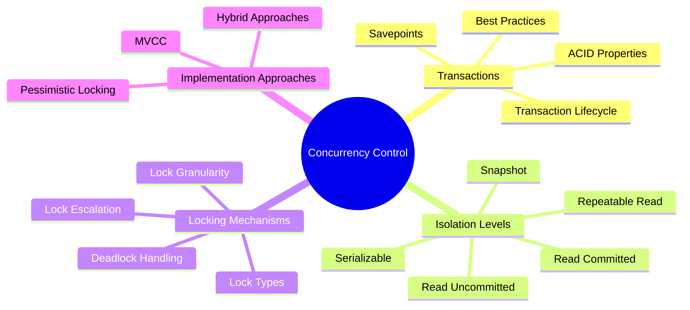

---

# Part I: Transactions

## 1.1 Understanding ACID Properties

The ACID properties define the fundamental guarantees that database transactions must provide. Think of these as a contract between the database and your application.

### 1.1.1 Atomicity: All or Nothing

Atomicity ensures that a transaction is treated as a single, indivisible unit of work. Either all operations within the transaction succeed, or none of them do.

**Analogy:** Imagine transferring money between bank accounts. You withdraw $100 from Account A and deposit $100 into Account B. Atomicity guarantees that if the deposit fails (perhaps due to a system crash), the withdrawal is also rolled back. You never end up in a state where money has vanished.

```sql
-- SQL Server: Demonstrating atomicity
BEGIN TRANSACTION;
    UPDATE Accounts SET Balance = Balance - 100 WHERE AccountID = 1;
    UPDATE Accounts SET Balance = Balance + 100 WHERE AccountID = 2;
    -- If either UPDATE fails, both are rolled back
COMMIT TRANSACTION;

-- PostgreSQL: Same concept
BEGIN;
    UPDATE accounts SET balance = balance - 100 WHERE account_id = 1;
    UPDATE accounts SET balance = balance + 100 WHERE account_id = 2;
COMMIT;
```

### 1.1.2 Consistency: Valid State to Valid State

Consistency ensures that a transaction brings the database from one valid state to another valid state, respecting all defined rules (constraints, triggers, cascades).

**Important Distinction:** The database enforces *declared* constraints (primary keys, foreign keys, check constraints). Your application is responsible for *business rule* consistency that cannot be expressed as database constraints.

```sql
-- The database enforces this constraint
ALTER TABLE Orders ADD CONSTRAINT CK_Orders_Positive 
    CHECK (TotalAmount >= 0);

-- This transaction will fail if it violates the constraint
BEGIN TRANSACTION;
    UPDATE Orders SET TotalAmount = -50 WHERE OrderID = 1;
    -- Error: CHECK constraint violation
    -- Transaction cannot commit with invalid data
COMMIT TRANSACTION;
```

### 1.1.3 Isolation: Concurrent Transactions Appear Sequential

Isolation determines how transaction integrity is visible to other concurrent transactions. This is the most complex ACID property and the primary focus of this guide.

**Analogy:** Think of isolation like library study rooms. At one extreme (serializable), each person gets exclusive access to the entire library—no one else can even browse while you're there. At the other extreme (read uncommitted), everyone wanders freely, potentially reading pages from books others are still writing.

The isolation level you choose represents a trade-off between data consistency and concurrency.

### 1.1.4 Durability: Committed Data Survives Failures

Durability guarantees that once a transaction is committed, it remains committed even if the system crashes, loses power, or encounters other failures.

Databases achieve durability through:
- **Write-Ahead Logging (WAL):** Changes are written to a transaction log before being applied to data files
- **Checkpointing:** Periodic flushing of changes from memory to disk
- **Recovery mechanisms:** Replaying the log after a crash to restore committed transactions

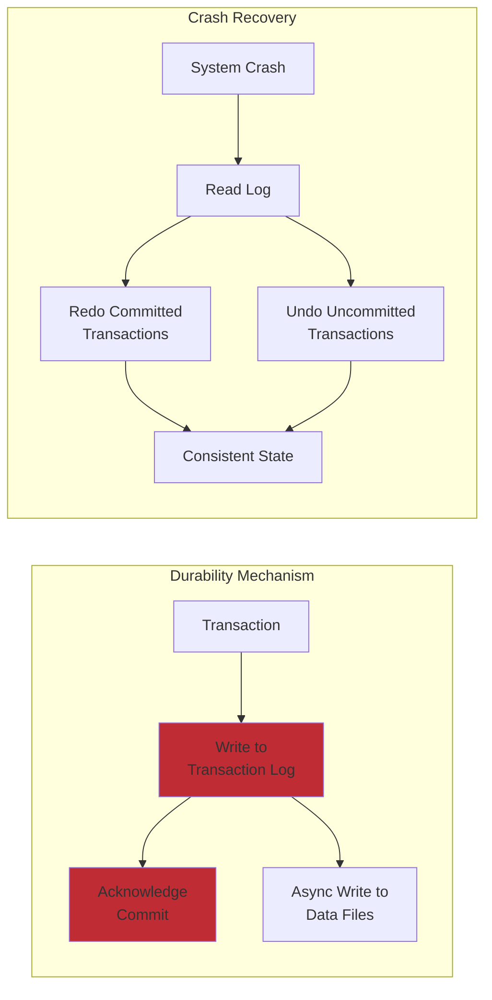

## 1.2 Transaction Lifecycle

Understanding the states a transaction passes through helps in debugging issues and designing robust error handling.

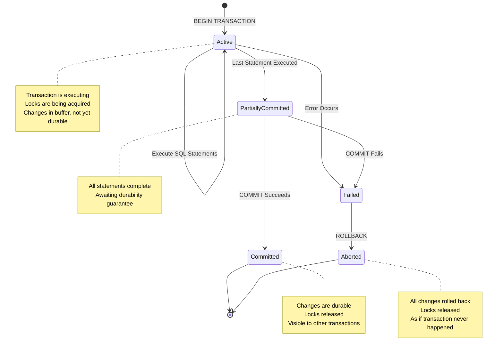

### 1.2.1 Transaction States Explained

| State | Description | Locks Held? | Changes Visible? |
|-------|-------------|-------------|------------------|
| **Active** | Transaction is executing statements | Yes, accumulating | No (except with READ UNCOMMITTED) |
| **Partially Committed** | All statements executed, awaiting commit | Yes | No |
| **Committed** | Transaction completed successfully | Released | Yes |
| **Failed** | Error occurred, awaiting rollback | Yes (until rollback) | No |
| **Aborted** | Rollback complete | Released | N/A (changes undone) |

## 1.3 Implicit vs. Explicit Transactions

### 1.3.1 Explicit Transactions

Explicit transactions are deliberately started and ended by the developer, providing full control over transaction boundaries.

**SQL Server:**

```sql
-- Explicit transaction with full error handling
BEGIN TRY
    BEGIN TRANSACTION;
    
    UPDATE Inventory SET Quantity = Quantity - 10 
    WHERE ProductID = 101;
    
    INSERT INTO OrderItems (OrderID, ProductID, Quantity)
    VALUES (5001, 101, 10);
    
    UPDATE Orders SET TotalItems = TotalItems + 10 
    WHERE OrderID = 5001;
    
    COMMIT TRANSACTION;
    PRINT 'Transaction committed successfully';
END TRY
BEGIN CATCH
    IF @@TRANCOUNT > 0
        ROLLBACK TRANSACTION;
    
    PRINT 'Error: ' + ERROR_MESSAGE();
    THROW;  -- Re-raise the error
END CATCH;
```

**PostgreSQL:**

```sql
-- Explicit transaction with exception handling
DO $$
BEGIN
    UPDATE inventory SET quantity = quantity - 10 
    WHERE product_id = 101;
    
    INSERT INTO order_items (order_id, product_id, quantity)
    VALUES (5001, 101, 10);
    
    UPDATE orders SET total_items = total_items + 10 
    WHERE order_id = 5001;
    
    RAISE NOTICE 'Transaction committed successfully';
EXCEPTION
    WHEN OTHERS THEN
        RAISE NOTICE 'Error: %', SQLERRM;
        RAISE;  -- Re-raise the exception
END $$;
```

### 1.3.2 Implicit Transactions

Implicit (or auto-commit) transactions wrap each individual statement in its own transaction automatically.

**SQL Server:**

```sql
-- Default behavior: each statement is auto-committed
UPDATE Orders SET Status = 'Shipped' WHERE OrderID = 100;
-- Immediately committed

-- Enable implicit transaction mode (not recommended)
SET IMPLICIT_TRANSACTIONS ON;
-- Now you must explicitly COMMIT or ROLLBACK

UPDATE Orders SET Status = 'Shipped' WHERE OrderID = 101;
-- NOT committed until you issue COMMIT
COMMIT;

SET IMPLICIT_TRANSACTIONS OFF;  -- Return to auto-commit
```

**PostgreSQL:**

```sql
-- Default behavior: auto-commit is on
UPDATE orders SET status = 'Shipped' WHERE order_id = 100;
-- Immediately committed

-- PostgreSQL always requires explicit BEGIN for multi-statement transactions
BEGIN;
UPDATE orders SET status = 'Shipped' WHERE order_id = 101;
-- NOT committed until COMMIT
COMMIT;
```

### 1.3.3 Platform Comparison: Default Transaction Behavior

| Aspect | SQL Server | PostgreSQL | MySQL/InnoDB | Oracle |
|--------|------------|------------|--------------|--------|
| Default mode | Auto-commit | Auto-commit | Auto-commit | Auto-commit OFF (implicit transactions) |
| Start transaction | `BEGIN TRANSACTION` or `BEGIN TRAN` | `BEGIN` or `START TRANSACTION` | `START TRANSACTION` or `BEGIN` | Transaction starts implicitly with first DML |
| Commit | `COMMIT TRANSACTION` or `COMMIT` | `COMMIT` | `COMMIT` | `COMMIT` |
| DDL behavior | Can be in transaction, can rollback | Can be in transaction, can rollback | Causes implicit commit | Causes implicit commit |

**Oracle Note:** Oracle is unique in that it does not auto-commit by default. Every session starts in an implicit transaction, and you must explicitly COMMIT. This catches many developers off guard when transitioning from other platforms.

## 1.4 Savepoints: Partial Rollback

Savepoints allow you to mark a point within a transaction and roll back to that point without aborting the entire transaction.

**Analogy:** Think of savepoints like checkpoints in a video game. If you fail after a checkpoint, you restart from there, not from the beginning of the level.

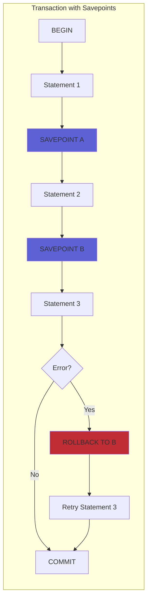

**SQL Server:**

```sql
BEGIN TRANSACTION;

INSERT INTO Orders (CustomerID, OrderDate) VALUES (100, GETDATE());
DECLARE @OrderID INT = SCOPE_IDENTITY();

SAVE TRANSACTION BeforeItems;  -- Savepoint

BEGIN TRY
    INSERT INTO OrderItems (OrderID, ProductID, Quantity) 
    VALUES (@OrderID, 501, 10);
    
    -- Simulate an error
    INSERT INTO OrderItems (OrderID, ProductID, Quantity) 
    VALUES (@OrderID, 999, 5);  -- Invalid ProductID
END TRY
BEGIN CATCH
    -- Roll back only the items, keep the order
    ROLLBACK TRANSACTION BeforeItems;
    
    PRINT 'Items failed, but order preserved: ' + CAST(@OrderID AS VARCHAR);
END CATCH;

COMMIT TRANSACTION;  -- Order is committed without items
```

**PostgreSQL:**

```sql
BEGIN;

INSERT INTO orders (customer_id, order_date) VALUES (100, CURRENT_DATE)
RETURNING order_id INTO v_order_id;

SAVEPOINT before_items;

BEGIN
    INSERT INTO order_items (order_id, product_id, quantity) 
    VALUES (v_order_id, 501, 10);
    
    INSERT INTO order_items (order_id, product_id, quantity) 
    VALUES (v_order_id, 999, 5);  -- May fail
EXCEPTION
    WHEN OTHERS THEN
        ROLLBACK TO SAVEPOINT before_items;
        RAISE NOTICE 'Items failed, order preserved: %', v_order_id;
END;

COMMIT;
```

## 1.5 Transaction Best Practices

### 1.5.1 Keep Transactions Short

**The Golden Rule:** Hold locks for the minimum time necessary.

```sql
-- ❌ BAD: Long transaction with user interaction
BEGIN TRANSACTION;
SELECT * FROM Products WHERE ProductID = 101;  -- Lock acquired
-- Application waits for user input... (seconds? minutes?)
UPDATE Products SET Price = @NewPrice WHERE ProductID = 101;
COMMIT TRANSACTION;

-- ✅ GOOD: Optimistic concurrency, minimal lock time
-- Step 1: Read data (no transaction needed)
SELECT ProductID, Price, RowVersion FROM Products WHERE ProductID = 101;
-- User reviews and modifies...

-- Step 2: Short transaction for update
BEGIN TRANSACTION;
UPDATE Products 
SET Price = @NewPrice
WHERE ProductID = 101 AND RowVersion = @OriginalRowVersion;

IF @@ROWCOUNT = 0
BEGIN
    ROLLBACK;
    RAISERROR('Product was modified by another user', 16, 1);
END
ELSE
    COMMIT TRANSACTION;
```

### 1.5.2 Access Objects in Consistent Order

Accessing tables in the same order across all transactions prevents deadlocks.

```sql
-- ✅ GOOD: All procedures access tables in same order
-- Procedure A
BEGIN TRANSACTION;
UPDATE Customers SET ... WHERE CustomerID = @ID;
UPDATE Orders SET ... WHERE CustomerID = @ID;
UPDATE OrderItems SET ... WHERE OrderID = @OrderID;
COMMIT;

-- Procedure B (same order)
BEGIN TRANSACTION;
UPDATE Customers SET ... WHERE CustomerID = @ID;
UPDATE Orders SET ... WHERE CustomerID = @ID;
COMMIT;

-- ❌ BAD: Procedure C accesses in different order
BEGIN TRANSACTION;
UPDATE OrderItems SET ... WHERE OrderID = @OrderID;  -- Different order!
UPDATE Orders SET ... WHERE CustomerID = @ID;
UPDATE Customers SET ... WHERE CustomerID = @ID;
COMMIT;
-- This creates deadlock potential with Procedures A and B
```

### 1.5.3 Handle Errors Properly

Always include error handling that properly rolls back and releases resources.

```sql
-- SQL Server: Comprehensive error handling template
SET XACT_ABORT ON;  -- Ensures automatic rollback on error

BEGIN TRY
    BEGIN TRANSACTION;
    
    -- Your transactional work here
    
    COMMIT TRANSACTION;
END TRY
BEGIN CATCH
    IF @@TRANCOUNT > 0
        ROLLBACK TRANSACTION;
    
    -- Log the error
    INSERT INTO ErrorLog (ErrorMessage, ErrorNumber, ErrorLine, ErrorTime)
    VALUES (ERROR_MESSAGE(), ERROR_NUMBER(), ERROR_LINE(), SYSDATETIME());
    
    -- Re-raise or handle appropriately
    THROW;
END CATCH;
```

### 1.5.4 Transaction Best Practices Summary


| Practice | Why It Matters | How to Implement |
|----------|----------------|------------------|
| **Keep transactions short** | Reduces lock contention, improves concurrency | Move non-database work outside transactions; use optimistic concurrency |
| **Access objects consistently** | Prevents deadlocks | Document and enforce table access order in coding standards |
| **Handle errors explicitly** | Prevents orphaned transactions holding locks | Always use TRY/CATCH (SQL Server) or EXCEPTION (PostgreSQL) |
| **Avoid user interaction mid-transaction** | Users are slow; locks held for seconds/minutes | Collect all input before starting transaction |
| **Use appropriate isolation level** | Balances consistency vs. concurrency | Analyze requirements; don't default to highest level |
| **Set XACT_ABORT ON (SQL Server)** | Ensures automatic rollback on runtime errors | Add at beginning of stored procedures |

---

# Part II: Isolation Levels

## 2.1 The Concurrency Problem

When multiple transactions execute concurrently, they can interfere with each other in ways that produce incorrect results. These interference patterns are called **read phenomena**.

### 2.1.1 Read Phenomena Explained

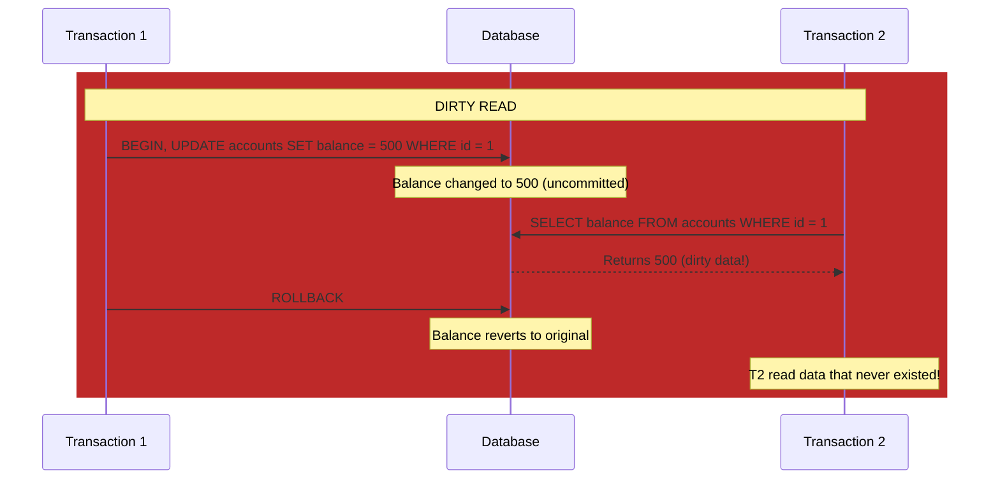

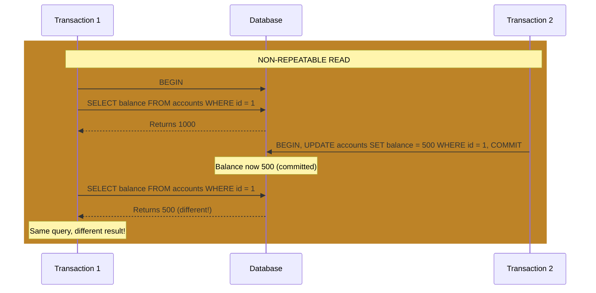

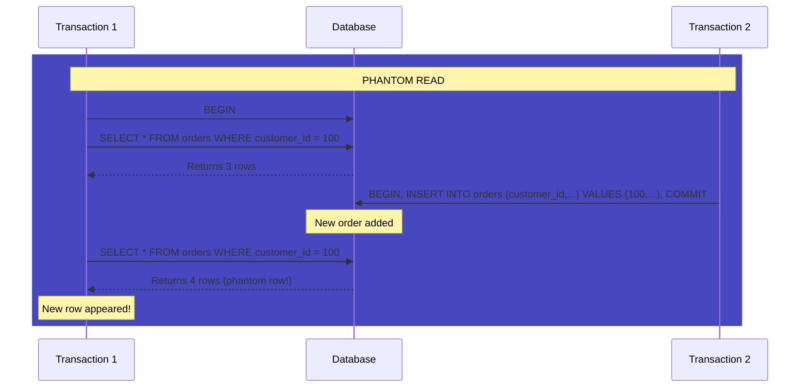

### 2.1.2 Summary of Read Phenomena

| Phenomenon | Description | Example Impact |
|------------|-------------|----------------|
| **Dirty Read** | Reading uncommitted data from another transaction | Making decisions based on data that gets rolled back |
| **Non-Repeatable Read** | Same row returns different values in same transaction | Balance check shows $1000, subsequent logic uses $500 |
| **Phantom Read** | New rows appear in repeated queries within same transaction | Report shows 100 orders, detail loop processes 105 |

## 2.2 The Four Standard Isolation Levels

The SQL standard defines four isolation levels, each preventing different combinations of read phenomena.

### 2.2.1 Isolation Level Comparison

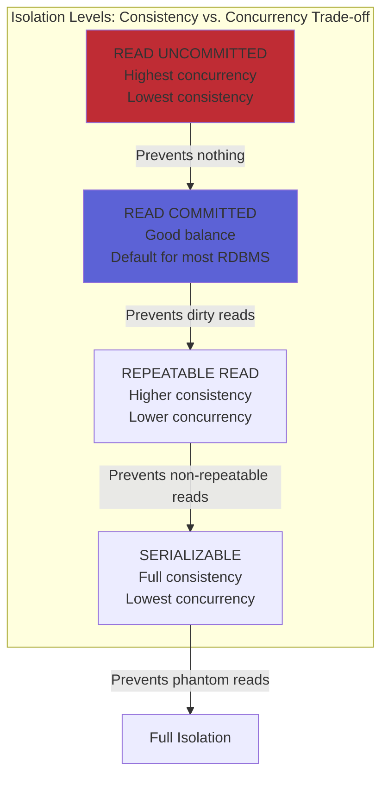

| Isolation Level | Dirty Read | Non-Repeatable Read | Phantom Read | Typical Use Case |
|-----------------|------------|---------------------|--------------|------------------|
| **READ UNCOMMITTED** | Possible | Possible | Possible | Approximate counts, monitoring |
| **READ COMMITTED** | Prevented | Possible | Possible | Most OLTP workloads |
| **REPEATABLE READ** | Prevented | Prevented | Possible | Financial reporting, statements |
| **SERIALIZABLE** | Prevented | Prevented | Prevented | Critical financial transactions |

### 2.2.2 READ UNCOMMITTED

The lowest isolation level. Transactions can read data that has been modified but not yet committed by other transactions.

**When to Use:** Almost never in production. Acceptable only for:
- Approximate row counts on large tables
- Monitoring dashboards where slight inaccuracy is acceptable
- Debugging to see uncommitted changes

**SQL Server:**

```sql
-- Session-level setting
SET TRANSACTION ISOLATION LEVEL READ UNCOMMITTED;
SELECT COUNT(*) FROM LargeTable;

-- Query-level hint (preferred for one-off queries)
SELECT COUNT(*) FROM LargeTable WITH (NOLOCK);

-- Equivalent to NOLOCK
SELECT COUNT(*) FROM LargeTable WITH (READUNCOMMITTED);
```

**PostgreSQL:**

```sql
-- PostgreSQL treats READ UNCOMMITTED as READ COMMITTED
-- This is by design - PostgreSQL never allows dirty reads
SET TRANSACTION ISOLATION LEVEL READ UNCOMMITTED;
-- Actually runs as READ COMMITTED!
```

**Critical Warning:**

```sql
-- ❌ DANGEROUS: Using NOLOCK on critical business logic
SELECT Balance FROM Accounts WITH (NOLOCK) WHERE AccountID = @ID;
IF @Balance >= @WithdrawalAmount
BEGIN
    -- The balance we read might have been an uncommitted change that gets rolled back!
    UPDATE Accounts SET Balance = Balance - @WithdrawalAmount WHERE AccountID = @ID;
END
```

### 2.2.3 READ COMMITTED

The default isolation level for SQL Server, PostgreSQL, and Oracle. Transactions only read committed data, but data can change between reads.

**SQL Server - Locking Behavior (Default):**

```sql
SET TRANSACTION ISOLATION LEVEL READ COMMITTED;

BEGIN TRANSACTION;
-- Acquires shared lock, reads data, releases lock immediately
SELECT * FROM Orders WHERE OrderID = 100;

-- Another transaction can modify the row now

-- Same query might return different data
SELECT * FROM Orders WHERE OrderID = 100;
COMMIT;
```

**SQL Server - Read Committed Snapshot Isolation (RCSI):**

```sql
-- Enable at database level (one-time setting)
ALTER DATABASE YourDatabase SET READ_COMMITTED_SNAPSHOT ON;

-- Now READ COMMITTED uses row versioning instead of locking
-- Readers don't block writers, writers don't block readers
SET TRANSACTION ISOLATION LEVEL READ COMMITTED;

BEGIN TRANSACTION;
-- Reads version as of statement start, no locks held
SELECT * FROM Orders WHERE OrderID = 100;
-- Other transactions can modify freely
COMMIT;
```

**PostgreSQL - MVCC Behavior:**

```sql
-- PostgreSQL uses MVCC by default
-- READ COMMITTED sees each statement's snapshot
BEGIN;
-- Sees committed data as of this statement's start
SELECT * FROM orders WHERE order_id = 100;

-- If another transaction commits changes here...

-- This statement sees the NEW committed data
SELECT * FROM orders WHERE order_id = 100;
COMMIT;
```

### 2.2.4 REPEATABLE READ

Guarantees that if you read a row once, you'll get the same values if you read it again within the same transaction.

**SQL Server (Locking):**

```sql
SET TRANSACTION ISOLATION LEVEL REPEATABLE READ;

BEGIN TRANSACTION;
-- Acquires and HOLDS shared locks until transaction ends
SELECT * FROM Products WHERE ProductID = 101;

-- Other transactions CANNOT modify this row until we commit/rollback

-- Guaranteed to return same values
SELECT * FROM Products WHERE ProductID = 101;
COMMIT;
-- Locks released
```

**PostgreSQL (MVCC):**

```sql
SET TRANSACTION ISOLATION LEVEL REPEATABLE READ;

BEGIN;
-- Snapshot taken at first query in transaction
SELECT * FROM products WHERE product_id = 101;

-- Other transactions CAN modify and commit
-- But this transaction sees its original snapshot

-- Returns same values (from snapshot)
SELECT * FROM products WHERE product_id = 101;
COMMIT;
```

**MySQL/InnoDB Note:** REPEATABLE READ is the default isolation level for MySQL/InnoDB. It also prevents phantom reads through "gap locking" (more on this later), making it stronger than the SQL standard requires.

### 2.2.5 SERIALIZABLE

The highest isolation level. Transactions execute as if they were running one after another (serially), even though they may actually run concurrently.

**SQL Server (Locking):**

```sql
SET TRANSACTION ISOLATION LEVEL SERIALIZABLE;

BEGIN TRANSACTION;
-- Acquires range locks that prevent inserts matching the predicate
SELECT * FROM Orders WHERE CustomerID = 100;

-- Other transactions CANNOT:
-- - Modify existing rows matching CustomerID = 100
-- - Insert new rows with CustomerID = 100
-- - Delete rows matching CustomerID = 100

SELECT * FROM Orders WHERE CustomerID = 100;
-- Guaranteed same results (no phantoms)
COMMIT;
```

**PostgreSQL (Serializable Snapshot Isolation - SSI):**

```sql
SET TRANSACTION ISOLATION LEVEL SERIALIZABLE;

BEGIN;
SELECT * FROM orders WHERE customer_id = 100;

-- PostgreSQL uses SSI - doesn't hold locks like SQL Server
-- Instead, it tracks read/write dependencies
-- If a conflict is detected at commit, transaction aborts

-- This might fail with serialization_failure error
COMMIT;
```

**PostgreSQL Serialization Failure Handling:**

```sql
-- Application must retry on serialization failure
DO $$
DECLARE
    retry_count INT := 0;
    max_retries INT := 3;
BEGIN
    LOOP
        BEGIN
            -- Your transaction logic here
            PERFORM some_function();
            RETURN;  -- Success, exit loop
        EXCEPTION
            WHEN serialization_failure OR deadlock_detected THEN
                retry_count := retry_count + 1;
                IF retry_count >= max_retries THEN
                    RAISE;  -- Max retries exceeded
                END IF;
                -- Optional: add small random delay
                PERFORM pg_sleep(random() * 0.1);
        END;
    END LOOP;
END $$;
```

### 2.2.6 Snapshot Isolation (SQL Server Specific)

SQL Server offers a fifth isolation level not in the SQL standard: **SNAPSHOT**. It provides point-in-time consistency using row versioning.

```sql
-- Enable at database level (one-time)
ALTER DATABASE YourDatabase SET ALLOW_SNAPSHOT_ISOLATION ON;

-- Use in transaction
SET TRANSACTION ISOLATION LEVEL SNAPSHOT;

BEGIN TRANSACTION;
-- Snapshot taken at transaction start (not statement start like RCSI)
SELECT * FROM Orders WHERE CustomerID = 100;

-- Other transactions can modify and commit
-- But this transaction sees its original snapshot

-- Returns data as of transaction start
SELECT * FROM Orders WHERE CustomerID = 100;
COMMIT;
```

**Snapshot vs. Repeatable Read (SQL Server):**

| Aspect | REPEATABLE READ | SNAPSHOT |
|--------|-----------------|----------|
| Implementation | Shared locks held | Row versioning |
| Blocking | Readers block writers | No blocking |
| Conflict detection | Lock wait/timeout | Update conflict error |
| tempdb usage | Minimal | Higher (version store) |
| Sees own changes | Yes | Yes |

## 2.3 MVCC vs. Pessimistic Locking

Understanding the fundamental difference between these two concurrency control mechanisms is crucial.

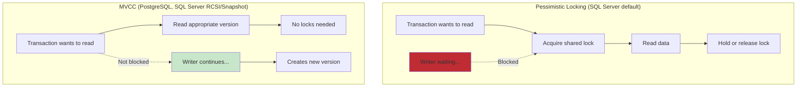

### 2.3.1 Detailed Comparison

| Aspect | Pessimistic Locking | MVCC |
|--------|---------------------|------|
| **Philosophy** | Prevent conflicts by blocking | Allow conflicts, resolve at commit |
| **Readers vs. Writers** | Block each other | Don't block each other |
| **Storage overhead** | Lock memory structures | Version storage (tempdb/heap) |
| **Conflict handling** | Wait, timeout, or deadlock | Serialization failure at commit |
| **Best for** | Short transactions, high contention | Read-heavy workloads, long reads |
| **Complexity** | Simpler to reason about | Must handle versioning edge cases |

### 2.3.2 Platform Default Behaviors

| Platform | Default Isolation | Default Mechanism | MVCC Available? |
|----------|-------------------|-------------------|-----------------|
| SQL Server | READ COMMITTED | Pessimistic locking | Yes (RCSI, Snapshot) |
| PostgreSQL | READ COMMITTED | MVCC | Always MVCC |
| MySQL/InnoDB | REPEATABLE READ | MVCC + Gap locking | Always MVCC |
| Oracle | READ COMMITTED | MVCC | Always MVCC |

## 2.4 Isolation Level Decision Framework

Use this framework to choose the appropriate isolation level:

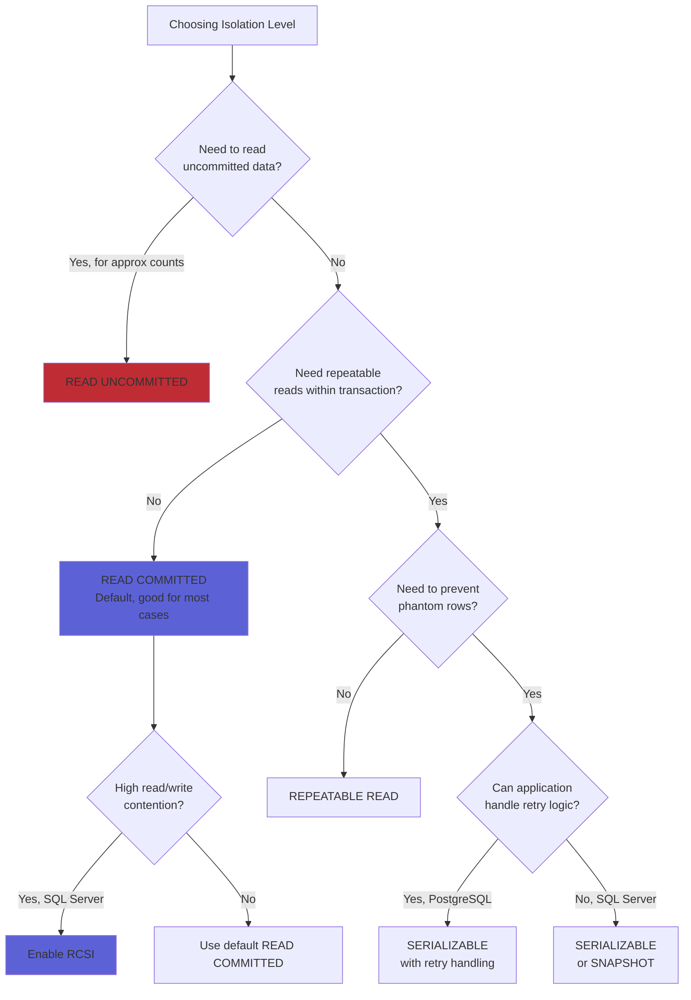

### 2.4.1 Common Scenarios and Recommendations

| Scenario | Recommended Level | Rationale |
|----------|-------------------|-----------|
| **Standard OLTP operations** | READ COMMITTED (with RCSI if contention) | Balance of consistency and concurrency |
| **Standard OLTP operations** | READ COMMITTED (with RCSI if contention) | Balance of consistency and concurrency |
| **Financial balance checks + updates** | REPEATABLE READ or SNAPSHOT | Must see consistent balance throughout transaction |
| **Report generation during business hours** | SNAPSHOT or RCSI | Long reads shouldn't block OLTP operations |
| **End-of-day reconciliation** | SERIALIZABLE | Complete accuracy required, low concurrency acceptable |
| **Approximate dashboard metrics** | READ UNCOMMITTED | Speed over precision; stale data acceptable |
| **Inventory reservation** | REPEATABLE READ | Must ensure quantity doesn't change between check and update |
| **Audit log reads** | READ COMMITTED | Audit data is append-only; consistency less critical |

---

# Part III: Locking and Deadlocks

## 3.1 Understanding Lock Types

Locks are the mechanism by which databases enforce isolation when using pessimistic concurrency control. Understanding lock types is essential for diagnosing contention issues.

### 3.1.1 Basic Lock Types

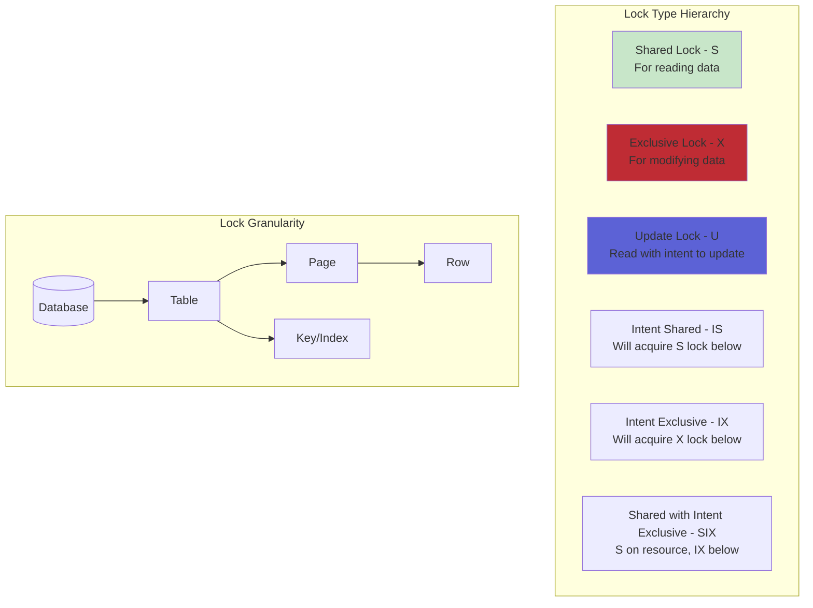

### 3.1.2 Lock Type Details

| Lock Type | Symbol | Purpose | Compatibility |
|-----------|--------|---------|---------------|
| **Shared (S)** | S | Reading data | Compatible with other S locks |
| **Exclusive (X)** | X | Modifying data | Not compatible with any lock |
| **Update (U)** | U | Read with intent to modify | Compatible with S, not with U or X |
| **Intent Shared (IS)** | IS | Signals S lock at lower level | Compatible with IS, IX, S |
| **Intent Exclusive (IX)** | IX | Signals X lock at lower level | Compatible with IS, IX |
| **Schema Modification (Sch-M)** | Sch-M | DDL operations | Not compatible with anything |
| **Schema Stability (Sch-S)** | Sch-S | Query compilation | Compatible with all except Sch-M |

### 3.1.3 Lock Compatibility Matrix

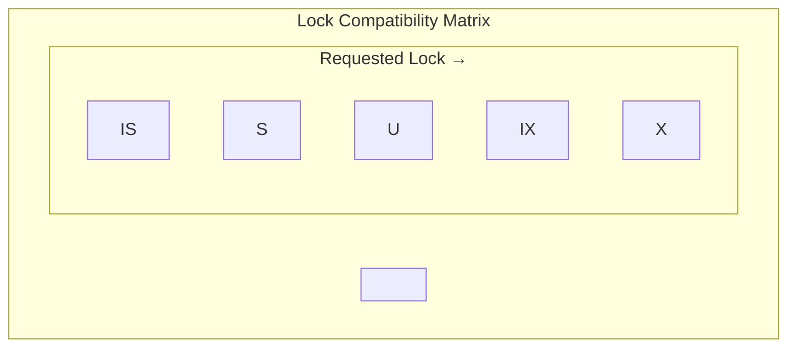

| Existing ↓ / Requested → | IS | S | U | IX | X |
|--------------------------|:--:|:-:|:-:|:--:|:-:|
| **Intent Shared (IS)** | ✅ | ✅ | ✅ | ✅ | ❌ |
| **Shared (S)** | ✅ | ✅ | ✅ | ❌ | ❌ |
| **Update (U)** | ✅ | ✅ | ❌ | ❌ | ❌ |
| **Intent Exclusive (IX)** | ✅ | ❌ | ❌ | ✅ | ❌ |
| **Exclusive (X)** | ❌ | ❌ | ❌ | ❌ | ❌ |

**Key Insight:** The Update (U) lock exists specifically to prevent a common deadlock pattern. When multiple transactions read a row intending to update it, without U locks they would all acquire S locks, then all try to convert to X locks—causing a deadlock. With U locks, only one transaction can hold the U lock while others wait.

### 3.1.4 SQL Server: Viewing Current Locks

```sql
-- View all current locks in the database
SELECT 
    l.request_session_id AS SessionID,
    DB_NAME(l.resource_database_id) AS DatabaseName,
    OBJECT_NAME(p.object_id) AS ObjectName,
    l.resource_type AS ResourceType,
    l.resource_description AS ResourceDescription,
    l.request_mode AS LockMode,
    l.request_status AS LockStatus,
    t.text AS QueryText
FROM sys.dm_tran_locks l
LEFT JOIN sys.partitions p ON l.resource_associated_entity_id = p.hobt_id
OUTER APPLY sys.dm_exec_sql_text(
    (SELECT most_recent_sql_handle 
     FROM sys.dm_exec_connections 
     WHERE session_id = l.request_session_id)
) t
WHERE l.resource_database_id = DB_ID()
ORDER BY l.request_session_id, l.resource_type;

-- View blocked sessions with details
SELECT 
    blocked.session_id AS BlockedSessionID,
    blocked.wait_type,
    blocked.wait_time / 1000.0 AS WaitTimeSeconds,
    blocked.wait_resource,
    blocker.session_id AS BlockingSessionID,
    blocked_text.text AS BlockedQuery,
    blocker_text.text AS BlockingQuery
FROM sys.dm_exec_requests blocked
JOIN sys.dm_exec_sessions blocker ON blocked.blocking_session_id = blocker.session_id
OUTER APPLY sys.dm_exec_sql_text(blocked.sql_handle) blocked_text
OUTER APPLY sys.dm_exec_sql_text(blocker.most_recent_sql_handle) blocker_text
WHERE blocked.blocking_session_id > 0;
```

### 3.1.5 PostgreSQL: Viewing Current Locks

```sql
-- View all current locks with details
SELECT 
    pg_stat_activity.pid,
    pg_stat_activity.usename,
    pg_locks.locktype,
    pg_locks.relation::regclass AS table_name,
    pg_locks.mode,
    pg_locks.granted,
    pg_stat_activity.query,
    pg_stat_activity.state,
    age(now(), pg_stat_activity.query_start) AS query_duration
FROM pg_locks
JOIN pg_stat_activity ON pg_locks.pid = pg_stat_activity.pid
WHERE pg_stat_activity.pid != pg_backend_pid()
ORDER BY pg_stat_activity.pid;

-- View blocked queries and what's blocking them
SELECT
    blocked_locks.pid AS blocked_pid,
    blocked_activity.usename AS blocked_user,
    blocked_activity.query AS blocked_query,
    blocking_locks.pid AS blocking_pid,
    blocking_activity.usename AS blocking_user,
    blocking_activity.query AS blocking_query,
    blocked_activity.state AS blocked_state,
    age(now(), blocked_activity.query_start) AS blocked_duration
FROM pg_locks blocked_locks
JOIN pg_stat_activity blocked_activity ON blocked_activity.pid = blocked_locks.pid
JOIN pg_locks blocking_locks 
    ON blocking_locks.locktype = blocked_locks.locktype
    AND blocking_locks.database IS NOT DISTINCT FROM blocked_locks.database
    AND blocking_locks.relation IS NOT DISTINCT FROM blocked_locks.relation
    AND blocking_locks.page IS NOT DISTINCT FROM blocked_locks.page
    AND blocking_locks.tuple IS NOT DISTINCT FROM blocked_locks.tuple
    AND blocking_locks.virtualxid IS NOT DISTINCT FROM blocked_locks.virtualxid
    AND blocking_locks.transactionid IS NOT DISTINCT FROM blocked_locks.transactionid
    AND blocking_locks.classid IS NOT DISTINCT FROM blocked_locks.classid
    AND blocking_locks.objid IS NOT DISTINCT FROM blocked_locks.objid
    AND blocking_locks.objsubid IS NOT DISTINCT FROM blocked_locks.objsubid
    AND blocking_locks.pid != blocked_locks.pid
JOIN pg_stat_activity blocking_activity ON blocking_activity.pid = blocking_locks.pid
WHERE NOT blocked_locks.granted;
```

## 3.2 Lock Granularity and Escalation

### 3.2.1 Lock Granularity Levels

Databases can lock resources at different levels of granularity:

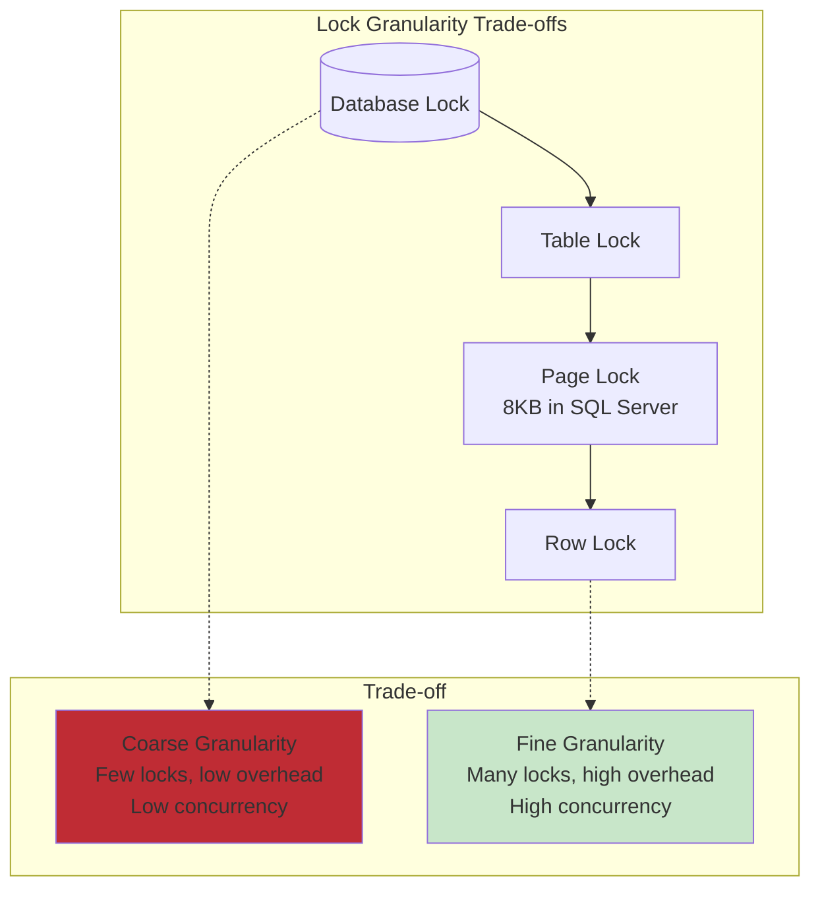

| Granularity | Lock Count | Memory Overhead | Concurrency | Use Case |
|-------------|------------|-----------------|-------------|----------|
| **Database** | 1 | Minimal | None | Restore, offline operations |
| **Table** | 1 per table | Low | Very low | Bulk operations, DDL |
| **Page** | 1 per 8KB page | Medium | Medium | Balance for mixed workloads |
| **Row** | 1 per row | High | High | OLTP, many concurrent users |

### 3.2.2 Lock Escalation (SQL Server)

SQL Server automatically escalates from row/page locks to table locks when a transaction acquires too many fine-grained locks. This reduces memory overhead but can hurt concurrency.

**Escalation Thresholds:**
- ~5,000 locks on a single object, OR
- Memory pressure on lock manager

```sql
-- View lock escalation events
SELECT 
    object_name(object_id) AS TableName,
    escalation_cause,
    mode,
    COUNT(*) AS EscalationCount
FROM sys.dm_db_index_operational_stats(DB_ID(), NULL, NULL, NULL)
WHERE index_lock_promotion_count > 0
GROUP BY object_id, escalation_cause, mode;

-- Disable lock escalation for a specific table (use carefully!)
ALTER TABLE Orders SET (LOCK_ESCALATION = DISABLE);

-- Set to escalate to partition level (for partitioned tables)
ALTER TABLE Orders SET (LOCK_ESCALATION = AUTO);

-- Default behavior (escalate to table)
ALTER TABLE Orders SET (LOCK_ESCALATION = TABLE);
```

**Lock Escalation Prevention Strategies:**

```sql
-- Strategy 1: Process in smaller batches
-- ❌ BAD: Updates 1 million rows, likely escalates
UPDATE Orders SET Status = 'Archived' WHERE OrderDate < '2020-01-01';

-- ✅ GOOD: Process in batches of 5000
WHILE 1 = 1
BEGIN
    UPDATE TOP (5000) Orders 
    SET Status = 'Archived' 
    WHERE OrderDate < '2020-01-01' AND Status != 'Archived';
    
    IF @@ROWCOUNT = 0 BREAK;
    
    -- Optional: small delay to let other transactions through
    WAITFOR DELAY '00:00:00.100';
END

-- Strategy 2: Use query hints to control locking
SELECT * FROM Orders WITH (ROWLOCK)  -- Force row locks
WHERE CustomerID = 100;

SELECT * FROM Orders WITH (PAGLOCK)  -- Force page locks
WHERE CustomerID = 100;

SELECT * FROM Orders WITH (TABLOCK)  -- Request table lock
WHERE CustomerID = 100;
```

### 3.2.3 PostgreSQL Lock Behavior

PostgreSQL doesn't have the same escalation mechanism. It uses row-level locks primarily, with table-level locks for DDL operations.

```sql
-- PostgreSQL lock modes for tables
-- ACCESS SHARE: SELECT
-- ROW SHARE: SELECT FOR UPDATE, SELECT FOR SHARE
-- ROW EXCLUSIVE: UPDATE, DELETE, INSERT
-- SHARE UPDATE EXCLUSIVE: VACUUM, ANALYZE, some ALTER TABLE
-- SHARE: CREATE INDEX (non-concurrent)
-- SHARE ROW EXCLUSIVE: some ALTER TABLE forms
-- EXCLUSIVE: some ALTER TABLE, REFRESH MATERIALIZED VIEW
-- ACCESS EXCLUSIVE: DROP, TRUNCATE, some ALTER TABLE

-- Explicitly lock a table
BEGIN;
LOCK TABLE orders IN SHARE MODE;  -- Allow reads, block writes
-- Perform operations
COMMIT;

-- Lock table for exclusive access
BEGIN;
LOCK TABLE orders IN ACCESS EXCLUSIVE MODE;  -- Block everything
-- Perform maintenance
COMMIT;
```

## 3.3 Deadlocks

### 3.3.1 What Is a Deadlock?

A deadlock occurs when two or more transactions permanently block each other by each holding a lock that the other needs.

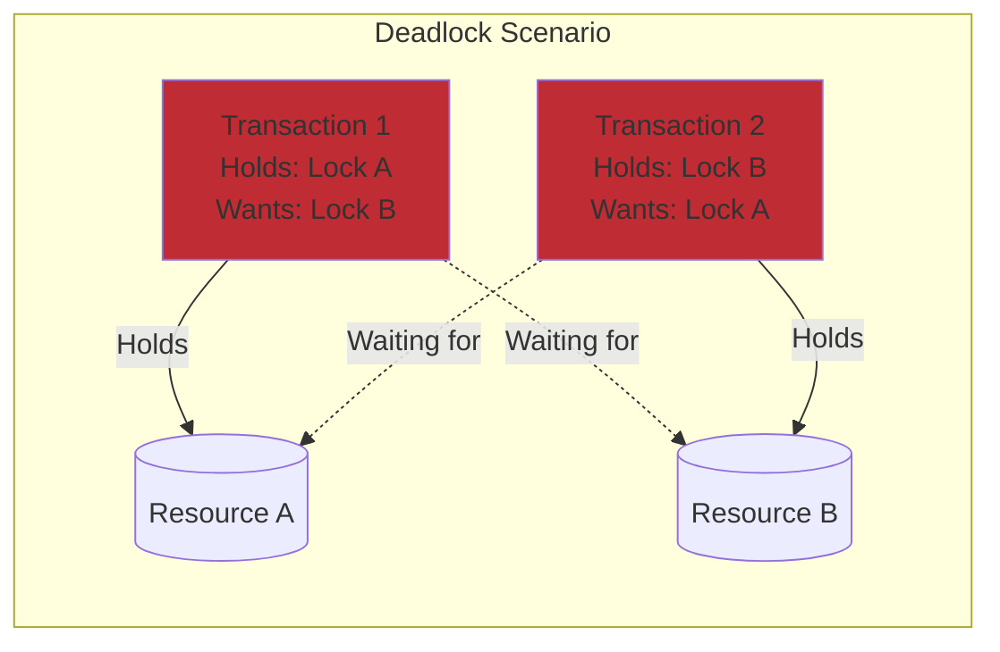

**Deadlock Example:**

```sql
-- Session 1
BEGIN TRANSACTION;
UPDATE Accounts SET Balance = Balance - 100 WHERE AccountID = 1;
-- Holds X lock on AccountID = 1
WAITFOR DELAY '00:00:05';  -- Simulating delay
UPDATE Accounts SET Balance = Balance + 100 WHERE AccountID = 2;
-- BLOCKED: Waiting for AccountID = 2
COMMIT;

-- Session 2 (running simultaneously)
BEGIN TRANSACTION;
UPDATE Accounts SET Balance = Balance - 50 WHERE AccountID = 2;
-- Holds X lock on AccountID = 2
WAITFOR DELAY '00:00:05';  -- Simulating delay
UPDATE Accounts SET Balance = Balance + 50 WHERE AccountID = 1;
-- BLOCKED: Waiting for AccountID = 1
-- DEADLOCK! One transaction will be chosen as victim
COMMIT;
```

### 3.3.2 Deadlock Detection and Resolution

**SQL Server Deadlock Handling:**

```sql
-- SQL Server automatically detects deadlocks (within ~5 seconds)
-- Chooses a victim based on transaction cost and DEADLOCK_PRIORITY

-- Set deadlock priority (LOW makes this session more likely to be victim)
SET DEADLOCK_PRIORITY LOW;  -- -5 to 5, or LOW/NORMAL/HIGH

-- Application should catch and retry
BEGIN TRY
    BEGIN TRANSACTION;
    -- Transaction logic
    COMMIT;
END TRY
BEGIN CATCH
    IF ERROR_NUMBER() = 1205  -- Deadlock victim error
    BEGIN
        ROLLBACK;
        -- Implement retry logic
        WAITFOR DELAY '00:00:00.100';  -- Small delay before retry
        -- Retry the transaction
    END
    ELSE
    BEGIN
        ROLLBACK;
        THROW;
    END
END CATCH;
```

**PostgreSQL Deadlock Handling:**

```sql
-- PostgreSQL detects deadlocks (configurable via deadlock_timeout, default 1s)
-- Check current setting
SHOW deadlock_timeout;

-- Adjust in postgresql.conf or per-session
SET deadlock_timeout = '2s';

-- Handle in application code
DO $$
DECLARE
    max_retries CONSTANT

INT := 3;
    retry_count INT := 0;
BEGIN
    LOOP
        BEGIN
            -- Your transaction logic here
            UPDATE accounts SET balance = balance - 100 WHERE account_id = 1;
            UPDATE accounts SET balance = balance + 100 WHERE account_id = 2;
            
            EXIT;  -- Success, exit loop
            
        EXCEPTION
            WHEN deadlock_detected THEN
                retry_count := retry_count + 1;
                IF retry_count >= max_retries THEN
                    RAISE EXCEPTION 'Transaction failed after % retries due to deadlock', max_retries;
                END IF;
                RAISE NOTICE 'Deadlock detected, retry attempt %', retry_count;
                PERFORM pg_sleep(0.1 * random());  -- Random backoff
        END;
    END LOOP;
END $$;
```

### 3.3.3 Capturing Deadlock Information

**SQL Server - Extended Events (Recommended):**

```sql
-- Create Extended Events session to capture deadlocks
CREATE EVENT SESSION [DeadlockCapture] ON SERVER 
ADD EVENT sqlserver.xml_deadlock_report
ADD TARGET package0.event_file(
    SET filename = N'C:\Logs\Deadlocks.xel',
    max_file_size = 50,
    max_rollover_files = 5
)
WITH (
    MAX_MEMORY = 4096 KB,
    EVENT_RETENTION_MODE = ALLOW_SINGLE_EVENT_LOSS,
    MAX_DISPATCH_LATENCY = 30 SECONDS,
    STARTUP_STATE = ON
);
GO

ALTER EVENT SESSION [DeadlockCapture] ON SERVER STATE = START;
GO

-- Query deadlock events
SELECT 
    XEvent.query('.') AS DeadlockGraph,
    XEvent.value('(event/@timestamp)[1]', 'datetime2') AS DeadlockTime
FROM (
    SELECT CAST(event_data AS XML) AS XmlData
    FROM sys.fn_xe_file_target_read_file('C:\Logs\Deadlocks*.xel', NULL, NULL, NULL)
) AS EventData
CROSS APPLY XmlData.nodes('//event') AS XEventData(XEvent)
ORDER BY DeadlockTime DESC;

-- Alternative: Enable trace flag for system_health (captures deadlocks by default)
-- Query from system_health session
SELECT 
    XEvent.query('.') AS DeadlockGraph
FROM (
    SELECT CAST(target_data AS XML) AS TargetData
    FROM sys.dm_xe_session_targets st
    JOIN sys.dm_xe_sessions s ON s.address = st.event_session_address
    WHERE s.name = 'system_health' AND st.target_name = 'ring_buffer'
) AS Data
CROSS APPLY TargetData.nodes('//RingBufferTarget/event[@name="xml_deadlock_report"]') AS XEventData(XEvent);
```

**PostgreSQL - Deadlock Logging:**

```sql
-- Enable deadlock logging in postgresql.conf
-- log_lock_waits = on
-- deadlock_timeout = 1s

-- Check PostgreSQL logs for entries like:
-- ERROR: deadlock detected
-- DETAIL: Process 1234 waits for ShareLock on transaction 5678; blocked by process 9012
--         Process 9012 waits for ShareLock on transaction 1234; blocked by process 1234

-- Query pg_stat_activity during deadlock investigation
SELECT 
    pid,
    state,
    wait_event_type,
    wait_event,
    query,
    query_start,
    xact_start
FROM pg_stat_activity
WHERE state != 'idle'
ORDER BY xact_start;
```

### 3.3.4 Deadlock Prevention Strategies

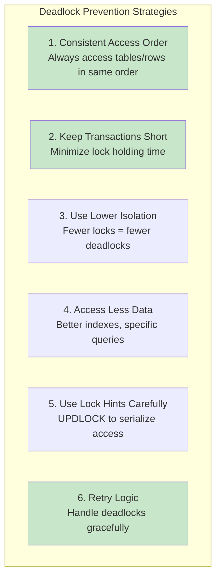

**Strategy 1: Consistent Access Order**

```sql
-- ✅ GOOD: Both procedures access in same order (Accounts → Transactions)
-- Procedure A: Transfer funds
BEGIN TRANSACTION;
UPDATE Accounts SET Balance = Balance - @Amount WHERE AccountID = @FromAccount;
UPDATE Accounts SET Balance = Balance + @Amount WHERE AccountID = @ToAccount;
INSERT INTO Transactions (FromAccount, ToAccount, Amount) VALUES (@FromAccount, @ToAccount, @Amount);
COMMIT;

-- Procedure B: Account closure
BEGIN TRANSACTION;
UPDATE Accounts SET Status = 'Closed' WHERE AccountID = @AccountID;
INSERT INTO Transactions (FromAccount, ToAccount, Amount, Type) VALUES (@AccountID, NULL, 0, 'Closure');
COMMIT;

-- ❌ BAD: Different access order creates deadlock potential
-- Procedure C: Transaction reconciliation (BAD ORDER!)
BEGIN TRANSACTION;
UPDATE Transactions SET Reconciled = 1 WHERE TransactionID = @TxnID;  -- Transactions first!
UPDATE Accounts SET LastReconciled = GETDATE() WHERE AccountID = @AccountID;  -- Accounts second!
COMMIT;
```

**Strategy 2: Use UPDLOCK to Serialize Access**

```sql
-- Without UPDLOCK: Two sessions read same row with S locks, then both try to get X lock = deadlock
-- Session 1                              -- Session 2
BEGIN TRAN;                               BEGIN TRAN;
SELECT * FROM Products WHERE ID=1; (S)    SELECT * FROM Products WHERE ID=1; (S)
UPDATE Products SET Qty=Qty-1... (X wait) UPDATE Products SET Qty=Qty-1... (X wait)
-- DEADLOCK!

-- With UPDLOCK: First session gets U lock, second must wait
-- Session 1                                           -- Session 2
BEGIN TRAN;                                            BEGIN TRAN;
SELECT * FROM Products WITH (UPDLOCK) WHERE ID=1; (U)  SELECT * FROM Products WITH (UPDLOCK) WHERE ID=1; -- WAITS
UPDATE Products SET Qty=Qty-1 WHERE ID=1; (X)          -- Still waiting...
COMMIT;                                                -- Now gets U lock
                                                       UPDATE Products SET Qty=Qty-1 WHERE ID=1;
                                                       COMMIT;
```

**Strategy 3: Batch Processing with Proper Ordering**

```sql
-- When updating multiple rows, always process in consistent order
-- ✅ GOOD: Order by primary key ensures consistent access
DECLARE @BatchSize INT = 1000;
DECLARE @LastID INT = 0;

WHILE 1 = 1
BEGIN
    BEGIN TRANSACTION;
    
    UPDATE TOP (@BatchSize) Orders
    SET Status = 'Processed'
    OUTPUT inserted.OrderID INTO @ProcessedIDs
    WHERE Status = 'Pending'
        AND OrderID > @LastID
    ORDER BY OrderID;  -- Consistent ordering
    
    IF @@ROWCOUNT = 0
    BEGIN
        COMMIT;
        BREAK;
    END
    
    SELECT @LastID = MAX(OrderID) FROM @ProcessedIDs;
    DELETE FROM @ProcessedIDs;
    
    COMMIT;
END
```

## 3.4 MySQL/InnoDB: Gap Locking

MySQL/InnoDB uses a unique locking mechanism called **gap locking** that's important to understand when working with MySQL systems.

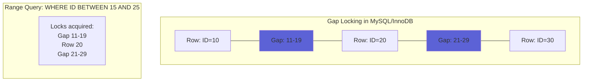

**Gap Lock Behavior:**

```sql
-- MySQL/InnoDB: REPEATABLE READ with gap locking
-- Session 1
START TRANSACTION;
SELECT * FROM orders WHERE order_date BETWEEN '2024-01-01' AND '2024-01-31' FOR UPDATE;
-- Locks all rows in range PLUS the gaps between them
-- Prevents phantom reads by blocking inserts into the range

-- Session 2
START TRANSACTION;
INSERT INTO orders (order_date, ...) VALUES ('2024-01-15', ...);
-- BLOCKED! Even though this specific row doesn't exist yet
-- The gap is locked

-- This is why MySQL's REPEATABLE READ prevents phantom reads
-- (unlike standard SQL REPEATABLE READ)
```

## 3.5 Oracle: Multi-Version Concurrency Specifics

Oracle's approach to concurrency has unique characteristics:

**Key Oracle Differences:**

| Aspect | Oracle Behavior |
|--------|-----------------|
| **Default Isolation** | READ COMMITTED |
| **Readers Block Writers?** | Never (always MVCC) |
| **Writers Block Readers?** | Never (always MVCC) |
| **Lock Escalation** | Does not occur |
| **Deadlock Detection** | Immediate (no timeout) |
| **Undo Storage** | Undo tablespace (not inline) |

```sql
-- Oracle: Setting isolation level
SET TRANSACTION ISOLATION LEVEL SERIALIZABLE;

-- Oracle: Explicit row locking
SELECT * FROM orders WHERE order_id = 100 FOR UPDATE;

-- Oracle: Skip locked rows (useful for queue processing)
SELECT * FROM orders WHERE status = 'PENDING' 
FOR UPDATE SKIP LOCKED
FETCH FIRST 10 ROWS ONLY;

-- Oracle: Wait with timeout
SELECT * FROM orders WHERE order_id = 100 
FOR UPDATE WAIT 5;  -- Wait max 5 seconds
```

---

# Part IV: Case Studies

## Case Study 1: The Mystery of the Disappearing Inventory

### Symptoms
- E-commerce platform receiving customer complaints about overselling
- Orders placed for products showing "In Stock" but no inventory available
- Sporadic issue, hard to reproduce

### Investigation

```sql
-- The problematic code pattern
-- Multiple concurrent sessions executing this:
BEGIN TRANSACTION;

-- Step 1: Check inventory
SELECT @AvailableQty = QuantityOnHand 
FROM Inventory 
WHERE ProductID = @ProductID;

-- Step 2: Validate (in application code)
IF @AvailableQty >= @OrderQuantity
BEGIN
    -- Step 3: Create order
    INSERT INTO Orders (...) VALUES (...);
    
    -- Step 4: Reduce inventory
    UPDATE Inventory 
    SET QuantityOnHand = QuantityOnHand - @OrderQuantity 
    WHERE ProductID = @ProductID;
END

COMMIT;
```

### Root Cause Analysis

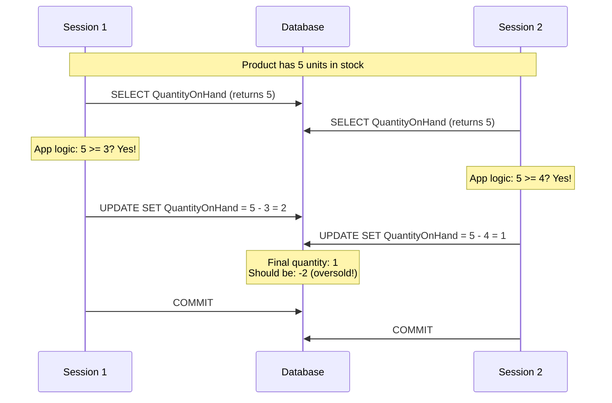

The issue: **READ COMMITTED isolation** allowed both sessions to see the same initial quantity. The check-then-update pattern created a race condition.

### Solution Implemented

**Option A: Pessimistic Locking with UPDLOCK**

```sql
BEGIN TRANSACTION;

-- Lock the row immediately, preventing concurrent reads
SELECT @AvailableQty = QuantityOnHand 
FROM Inventory WITH (UPDLOCK, HOLDLOCK)
WHERE ProductID = @ProductID;

IF @AvailableQty >= @OrderQuantity
BEGIN
    INSERT INTO Orders (...) VALUES (...);
    
    UPDATE Inventory 
    SET QuantityOnHand = QuantityOnHand - @OrderQuantity 
    WHERE ProductID = @ProductID;
END

COMMIT;
```

**Option B: Optimistic Concurrency with Row Versioning**

```sql
-- Add rowversion column to Inventory table
ALTER TABLE Inventory ADD RowVer ROWVERSION;

-- Application code
BEGIN TRANSACTION;

SELECT @AvailableQty = QuantityOnHand, @RowVer = RowVer
FROM Inventory 
WHERE ProductID = @ProductID;

IF @AvailableQty >= @OrderQuantity
BEGIN
    UPDATE Inventory 
    SET QuantityOnHand = QuantityOnHand - @OrderQuantity 
    WHERE ProductID = @ProductID 
        AND RowVer = @RowVer;  -- Only succeeds if unchanged
    
    IF @@ROWCOUNT = 0
    BEGIN
        ROLLBACK;
        RAISERROR('Inventory changed, please retry', 16, 1);
        RETURN;
    END
    
    INSERT INTO Orders (...) VALUES (...);
END

COMMIT;
```

**Option C: Atomic UPDATE with Output (Recommended)**

```sql
BEGIN TRANSACTION;

-- Single atomic operation - no race condition possible
UPDATE Inventory 
SET QuantityOnHand = QuantityOnHand - @OrderQuantity
OUTPUT inserted.QuantityOnHand INTO @NewQuantity
WHERE ProductID = @ProductID 
    AND QuantityOnHand >= @OrderQuantity;

IF @@ROWCOUNT = 1
BEGIN
    INSERT INTO Orders (...) VALUES (...);
    COMMIT;
END
ELSE
BEGIN
    ROLLBACK;
    RAISERROR('Insufficient inventory', 16, 1);
END
```

### Measurable Outcomes
- Overselling incidents: **Reduced from ~50/day to 0**
- Transaction throughput: **Maintained (Option C had no performance impact)**
- Customer complaints: **Eliminated for this issue**

---

## Case Study 2: The Nightly Batch Job Blocking Production

### Symptoms
- Application timeouts every night between 2 AM and 4 AM
- User-facing queries timing out with lock wait errors
- Batch job completing successfully but taking 3x longer than expected

### Investigation

```sql
-- Check for blocking during the incident window
SELECT 
    r.session_id AS blocked_session,
    r.blocking_session_id,
    r.wait_type,
    r.wait_time / 1000.0 AS wait_seconds,
    t.text AS blocked_query,
    s.login_name,
    s.program_name
FROM sys.dm_exec_requests r
JOIN sys.dm_exec_sessions s ON r.session_id = s.session_id
CROSS APPLY sys.dm_exec_sql_text(r.sql_handle) t
WHERE r.blocking_session_id > 0
ORDER BY r.wait_time DESC;
```

**Findings:**
- Blocking session was running a large UPDATE statement
- Batch job was using SERIALIZABLE isolation level
- Lock escalation had occurred, blocking entire table

```sql
-- The problematic batch job
SET TRANSACTION ISOLATION LEVEL SERIALIZABLE;

BEGIN TRANSACTION;

-- Update millions of rows in single transaction
UPDATE Orders
SET ArchiveFlag = 1,
    LastModified = GETDATE()
WHERE OrderDate < DATEADD(YEAR, -2, GETDATE())
    AND ArchiveFlag = 0;

-- This single statement:
-- 1. Acquired millions of row locks
-- 2. Escalated to table lock
-- 3. Held SERIALIZABLE locks blocking all access

COMMIT;
```

### Root Cause Analysis

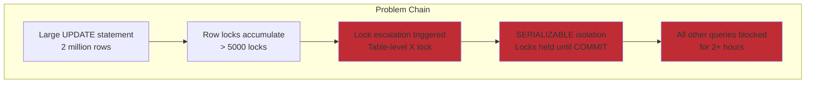

**Issues Identified:**
1. **Unnecessary isolation level:** SERIALIZABLE not needed for archiving
2. **Lock escalation:** Single large transaction triggered table lock
3. **Long transaction duration:** Held locks for hours
4. **No batching:** Attempted to process all rows at once

### Solution Implemented

```sql
-- Solution: Batched processing with appropriate isolation level
SET TRANSACTION ISOLATION LEVEL READ COMMITTED;

DECLARE @BatchSize INT = 5000;
DECLARE @RowsAffected INT = 1;
DECLARE @TotalProcessed INT = 0;

WHILE @RowsAffected > 0
BEGIN
    BEGIN TRANSACTION;
    
    -- Process in small batches to avoid lock escalation
    UPDATE TOP (@BatchSize) Orders
    SET ArchiveFlag = 1,
        LastModified = GETDATE()
    WHERE OrderDate < DATEADD(YEAR, -2, GETDATE())
        AND ArchiveFlag = 0;
    
    SET @RowsAffected = @@ROWCOUNT;
    SET @TotalProcessed = @TotalProcessed + @RowsAffected;
    
    COMMIT;
    
    -- Brief pause to allow other transactions through
    IF @RowsAffected > 0
        WAITFOR DELAY '00:00:00.100';  -- 100ms pause
    
    -- Log progress
    RAISERROR('Processed %d rows (total: %d)', 0, 1, @RowsAffected, @TotalProcessed) WITH NOWAIT;
END

-- Additionally: Disable lock escalation for this table during batch window
-- ALTER TABLE Orders SET (LOCK_ESCALATION = DISABLE);
-- Remember to re-enable after batch completes
```

**PostgreSQL Equivalent:**

```sql
-- PostgreSQL batched archiving
DO $$
DECLARE
    batch_size INT := 5000;
    rows_affected INT;
    total_processed INT := 0;
BEGIN
    LOOP
        WITH batch AS (
            SELECT order_id 
            FROM orders 
            WHERE order_date < CURRENT_DATE - INTERVAL '2 years'
                AND archive_flag = false
            LIMIT batch_size
            FOR UPDATE SKIP LOCKED  -- Skip locked rows, process available ones
        )
        UPDATE orders o
        SET archive_flag = true,
            last_modified = CURRENT_TIMESTAMP
        FROM batch b
        WHERE o.order_id = b.order_id;
        
        GET DIAGNOSTICS rows_affected = ROW_COUNT;
        total_processed := total_processed + rows_affected;
        
        EXIT WHEN rows_affected = 0;
        
        RAISE NOTICE 'Processed % rows (total: %)', rows_affected, total_processed;
        
        -- Commit each batch (in real implementation, use separate transactions)
        PERFORM pg_sleep(0.1);
    END LOOP;
    
    RAISE NOTICE 'Archive complete. Total rows: %', total_processed;
END $$;
```

### Measurable Outcomes

| Metric | Before | After |
|--------|--------|-------|
| Batch job duration | 2-3 hours | 45 minutes |
| Max lock wait time | 120+ seconds | < 1 second |
| Application timeouts during batch | ~500 | 0 |
| Lock escalations | Multiple table locks | None |

---

## Case Study 3: Deadlock Storm During Flash Sale

### Symptoms
- Flash sale event at 12:00 PM triggered application errors
- Error logs showed hundreds of deadlock victim errors (SQL Server 1205)
- Order completion rate dropped from 95% to 40%
- Customer complaints about failed checkout

### Investigation

```sql
-- Capture deadlock graph from Extended Events
SELECT 
    XEvent.query('.') AS DeadlockGraph,
    XEvent.value('(event/@timestamp)[1]', 'datetime2') AS DeadlockTime,
    XEvent.value('(//process/@spid)[1]', 'int') AS SPID1,
    XEvent.value('(//process/@spid)[2]', 'int') AS SPID2
FROM (
    SELECT CAST(target_data AS XML) AS TargetData
    FROM sys.dm_xe_session_targets st
    JOIN sys.dm_xe_sessions s ON s.address = st.event_session_address
    WHERE s.name = 'system_health'
) AS Data
CROSS APPLY TargetData.nodes('//event[@name="xml_deadlock_report"]') AS XEventData(XEvent)
WHERE XEvent.value('(event/@timestamp)[1]', 'datetime2') > DATEADD(HOUR, -1, GETDATE());
```

**Deadlock Analysis Revealed:**

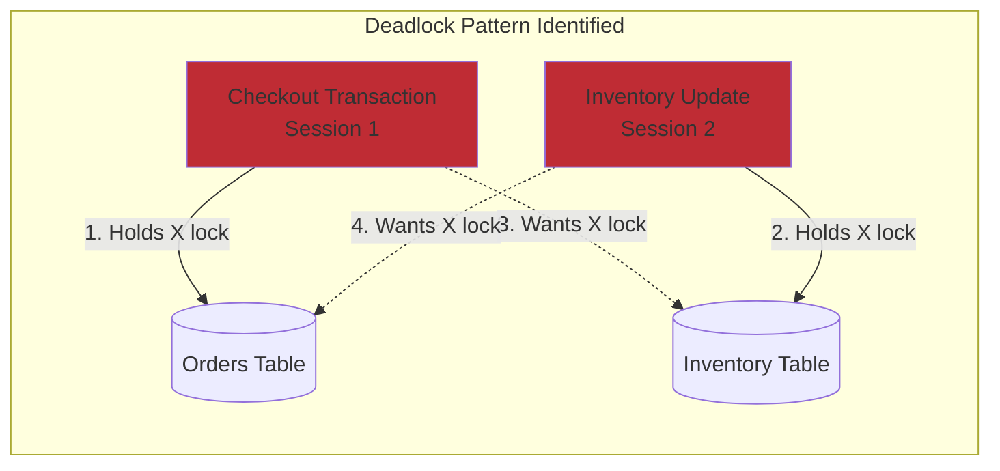

**The Conflicting Code Patterns:**

```sql
-- Checkout Procedure (Pattern A)
BEGIN TRANSACTION;
-- Step 1: Create order first
INSERT INTO Orders (CustomerID, OrderDate, Total) VALUES (...);
SET @OrderID = SCOPE_IDENTITY();

INSERT INTO OrderItems (OrderID, ProductID, Quantity, Price) VALUES (...);

-- Step 2: Then update inventory
UPDATE Inventory SET QuantityOnHand = QuantityOnHand - @Qty WHERE ProductID = @ProductID;
COMMIT;

-- Inventory Sync Procedure (Pattern B) - Different order!
BEGIN TRANSACTION;
-- Step 1: Update inventory first
UPDATE Inventory SET QuantityOnHand = @NewQty WHERE ProductID = @ProductID;

-- Step 2: Then log to orders audit
INSERT INTO OrderAudit (OrderID, Action, Timestamp) 
SELECT OrderID, 'InventorySync', GETDATE() FROM Orders WHERE ProductID = @ProductID;
COMMIT;
```

### Root Cause
- **Inconsistent table access order** between Checkout and Inventory Sync procedures
- Flash sale created high concurrency on same products
- Deadlock rate increased exponentially with concurrent users

### Solution Implemented

**Step 1: Standardize Access Order**

```sql
-- Document and enforce: Always access tables in this order:
-- 1. Inventory
-- 2. Orders
-- 3. OrderItems
-- 4. OrderAudit

-- Refactored Checkout Procedure
CREATE OR ALTER PROCEDURE usp_Checkout
    @CustomerID INT,
    @Items OrderItemType READONLY  -- Table-valued parameter
AS
BEGIN
    SET NOCOUNT ON;
    SET XACT_ABORT ON;
    
    BEGIN TRY
        BEGIN TRANSACTION;
        
        -- Step 1: Lock and update Inventory FIRST (consistent order)
        UPDATE inv
        SET inv.QuantityOnHand = inv.QuantityOnHand - i.Quantity
        FROM Inventory inv
        JOIN @Items i ON inv.ProductID = i.ProductID
        WHERE inv.QuantityOnHand >= i.Quantity;
        
        IF @@ROWCOUNT != (SELECT COUNT(*) FROM @Items)
        BEGIN
            ROLLBACK;
            THROW 50001, 'Insufficient inventory for one or more items', 1;
        END
        
        -- Step 2: Create order SECOND
        INSERT INTO Orders (CustomerID, OrderDate, Total)
        VALUES (@CustomerID, GETDATE(), (SELECT SUM(Quantity * Price) FROM @Items));
        
        DECLARE @OrderID INT = SCOPE_IDENTITY();
        
        -- Step 3: Create order items THIRD
        INSERT INTO OrderItems (OrderID, ProductID, Quantity, Price)
        SELECT @OrderID, ProductID, Quantity, Price FROM @Items;
        
        COMMIT;
        
        SELECT @OrderID AS OrderID, 'Success' AS Status;
        
    END TRY
    BEGIN CATCH
        IF @@TRANCOUNT > 0 ROLLBACK;
        THROW;
    END CATCH
END;
```

**Step 2: Add Retry Logic in Application**

```csharp
// C# application retry logic
public async Task<OrderResult> PlaceOrderWithRetry(OrderRequest request)
{
    int maxRetries = 3;
    int retryCount = 0;
    
    while (retryCount < maxRetries)
    {
        try
        {
            return await PlaceOrder(request);
        }
        catch (SqlException ex) when (ex.Number == 1205) // Deadlock
        {
            retryCount++;
            _logger.LogWarning($"Deadlock detected, retry {retryCount}/{maxRetries}");
            
            if (retryCount >= maxRetries)
                throw;
            
            // Exponential backoff with jitter
            await Task.Delay(TimeSpan.FromMilliseconds(
                Math.Pow(2, retryCount) * 100 + Random.Shared.Next(50)));
        }
    }
    
    throw new InvalidOperationException("Should not reach here");
}
```

**Step 3: Add Monitoring**

```sql
-- Create deadlock monitoring alert
CREATE EVENT NOTIFICATION DeadlockNotification
ON SERVER
FOR DEADLOCK_GRAPH
TO SERVICE 'DeadlockMonitorService', 'current database';

-- Query to track deadlock frequency
SELECT 
    CAST(XEvent.value('(event/@timestamp)[1]', 'datetime2') AS DATE) AS DeadlockDate,
    DATEPART(HOUR, XEvent.value('(event/@timestamp)[1]', 'datetime2')) AS DeadlockHour,
    COUNT(*) AS DeadlockCount
FROM (
    SELECT CAST(target_data AS XML) AS TargetData
    FROM sys.dm_xe_session_targets st
    JOIN sys.dm_xe_sessions s ON s.address = st.event_session_address
    WHERE s.name = 'system_health'
) AS Data
CROSS APPLY TargetData.nodes('//event[@name="xml_deadlock_report"]') AS XEventData(XEvent)
GROUP BY 
    CAST(XEvent.value('(event/@timestamp)[1]', 'datetime2') AS DATE),
    DATEPART(HOUR, XEvent.value('(event/@timestamp)[1]', 'datetime2'))
ORDER BY DeadlockDate DESC, DeadlockHour DESC;
```

### Measurable Outcomes

| Metric | Before | After |
|--------|--------|-------|
| Deadlocks per hour (peak) | 200+ | 0-2 |
| Order completion rate | 40% | 99.5% |
| Average checkout time | 8.5 seconds | 1.2 seconds |
| Customer complaints | 150+ | < 5 |

---

## Case Study 4: PostgreSQL Serialization Failures in Financial System

### Symptoms
- Financial reconciliation process failing intermittently
- Errors: `ERROR: could not serialize access due to concurrent update`
- Process required manual restart multiple times per day
- Increasing failure rate as transaction volume grew

### Investigation

```sql
-- Check for serialization failures in pg_stat_statements
SELECT 
    query,
    calls,
    total_exec_time,
    rows,
    shared_blks_hit + shared_blks_read AS total_blocks
FROM pg_stat_statements
WHERE query LIKE '%reconciliation%'
ORDER BY total_exec_time DESC;

-- Monitor active transactions during reconciliation
SELECT 
    pid,
    usename,
    application_name,
    state,
    xact_start,
    query_start,
    now() - xact_start AS transaction_duration,
    query
FROM pg_stat_activity
WHERE state != 'idle'
    AND xact_start IS NOT NULL
ORDER BY xact_start;
```

**The Problematic Pattern:**

```sql
-- Reconciliation procedure using SERIALIZABLE
BEGIN TRANSACTION ISOLATION LEVEL SERIALIZABLE;

-- Read all pending transactions
SELECT * FROM pending_transactions 
WHERE status = 'unreconciled' 
    AND transaction_date = CURRENT_DATE;

-- Complex business logic in application...
-- Takes 5-10 seconds

-- Update each transaction
UPDATE pending_transactions 
SET status = 'reconciled',
    reconciled_at = CURRENT_TIMESTAMP,
    reconciled_by = 'SYSTEM'
WHERE transaction_id = $1;

-- Multiple updates in loop...

COMMIT;  -- FAILS with serialization_failure
```

### Root Cause Analysis

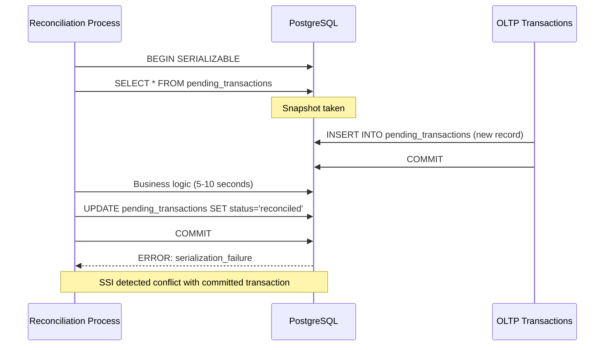

**Key Insight:** PostgreSQL's Serializable Snapshot Isolation (SSI) detected that the reconciliation process made decisions based on a snapshot that was later invalidated by concurrent OLTP transactions.

### Solution Implemented

**Approach 1: Use REPEATABLE READ with Explicit Locking**

```sql
-- More appropriate isolation level with targeted locking
BEGIN TRANSACTION ISOLATION LEVEL REPEATABLE READ;

-- Lock specific rows we're going to reconcile
SELECT * FROM pending_transactions 
WHERE status = 'unreconciled' 
    AND transaction_date = CURRENT_DATE
FOR UPDATE SKIP LOCKED;  -- Skip rows being processed by other sessions

-- Now we have exclusive locks on specific rows
-- Other OLTP can continue with different rows

-- Update the locked rows
UPDATE pending_transactions 
SET status = 'reconciled',
    reconciled_at = CURRENT_TIMESTAMP
WHERE transaction_id = ANY($1::int[]);  -- Array of IDs from previous select

COMMIT;
```

**Approach 2: Batch Processing with Retry Logic**

```sql
-- Function with built-in retry logic
CREATE OR REPLACE FUNCTION reconcile_batch(batch_size INT DEFAULT 100)
RETURNS TABLE (processed INT, failed INT) AS $$
DECLARE
    max_retries CONSTANT INT := 5;
    retry_count INT;
    rows_processed INT := 0;
    rows_failed INT := 0;
    batch_ids INT[];
BEGIN
    -- Get a batch of IDs to process
    SELECT array_agg(transaction_id) INTO batch_ids
    FROM (
        SELECT transaction_id 
        FROM pending_transactions
        WHERE status = 'unreconciled'
            AND transaction_date = CURRENT_DATE
        ORDER BY transaction_id
        LIMIT batch_size
    ) sub;
    
    -- Process each transaction individually with retry
    FOR i IN 1..coalesce(array_length
(batch_ids, 1), 0) LOOP
        retry_count := 0;
        
        LOOP
            BEGIN
                -- Start a subtransaction for each item
                UPDATE pending_transactions
                SET status = 'reconciled',
                    reconciled_at = CURRENT_TIMESTAMP,
                    reconciled_by = 'SYSTEM'
                WHERE transaction_id = batch_ids[i]
                    AND status = 'unreconciled';  -- Optimistic check
                
                IF FOUND THEN
                    rows_processed := rows_processed + 1;
                END IF;
                
                EXIT;  -- Success, exit retry loop
                
            EXCEPTION
                WHEN serialization_failure OR deadlock_detected THEN
                    retry_count := retry_count + 1;
                    
                    IF retry_count >= max_retries THEN
                        rows_failed := rows_failed + 1;
                        RAISE NOTICE 'Failed to process transaction % after % retries', 
                            batch_ids[i], max_retries;
                        EXIT;  -- Move to next item
                    END IF;
                    
                    -- Exponential backoff
                    PERFORM pg_sleep(power(2, retry_count) * 0.01 * random());
            END;
        END LOOP;
    END LOOP;
    
    RETURN QUERY SELECT rows_processed, rows_failed;
END;
$$ LANGUAGE plpgsql;

-- Call the function
SELECT * FROM reconcile_batch(100);
```

**Approach 3: Use Advisory Locks for Coordination**

```sql
-- Use advisory locks to coordinate reconciliation processes
CREATE OR REPLACE FUNCTION reconcile_with_advisory_lock()
RETURNS INT AS $$
DECLARE
    lock_id CONSTANT BIGINT := 12345;  -- Unique ID for this process type
    rows_processed INT := 0;
BEGIN
    -- Try to acquire advisory lock (non-blocking)
    IF NOT pg_try_advisory_lock(lock_id) THEN
        RAISE NOTICE 'Another reconciliation process is running';
        RETURN 0;
    END IF;
    
    BEGIN
        -- Now we have exclusive access to reconciliation
        UPDATE pending_transactions
        SET status = 'reconciled',
            reconciled_at = CURRENT_TIMESTAMP
        WHERE status = 'unreconciled'
            AND transaction_date = CURRENT_DATE;
        
        GET DIAGNOSTICS rows_processed = ROW_COUNT;
        
        -- Release the advisory lock
        PERFORM pg_advisory_unlock(lock_id);
        
        RETURN rows_processed;
        
    EXCEPTION WHEN OTHERS THEN
        -- Ensure lock is released on error
        PERFORM pg_advisory_unlock(lock_id);
        RAISE;
    END;
END;
$$ LANGUAGE plpgsql;
```

### Measurable Outcomes

| Metric | Before | After |
|--------|--------|-------|
| Serialization failures per day | 50-100 | 0-2 |
| Manual restarts required | 3-5 per day | 0 |
| Reconciliation completion time | 45 min (with failures) | 12 min |
| Process reliability | ~60% | 99.9% |

---

## Case Study 5: Read Committed Snapshot Isolation Migration

### Symptoms
- SQL Server OLTP application experiencing reader/writer blocking
- Users reporting slow query response during batch data imports
- Lock wait statistics showing high contention during business hours

### Investigation

```sql
-- Check current blocking and lock waits
SELECT 
    wait_type,
    waiting_tasks_count,
    wait_time_ms,
    max_wait_time_ms,
    signal_wait_time_ms
FROM sys.dm_os_wait_stats
WHERE wait_type LIKE 'LCK%'
ORDER BY wait_time_ms DESC;

-- Check page latch waits as well
SELECT 
    wait_type,
    wait_time_ms,
    waiting_tasks_count
FROM sys.dm_os_wait_stats
WHERE wait_type LIKE 'PAGELATCH%' OR wait_type LIKE 'PAGEIOLATCH%'
ORDER BY wait_time_ms DESC;

-- Identify blocking chains
WITH BlockingTree AS (
    SELECT 
        session_id,
        blocking_session_id,
        wait_type,
        wait_time,
        0 AS Level
    FROM sys.dm_exec_requests
    WHERE blocking_session_id = 0 AND session_id IN (
        SELECT blocking_session_id FROM sys.dm_exec_requests WHERE blocking_session_id > 0
    )
    
    UNION ALL
    
    SELECT 
        r.session_id,
        r.blocking_session_id,
        r.wait_type,
        r.wait_time,
        bt.Level + 1
    FROM sys.dm_exec_requests r
    JOIN BlockingTree bt ON r.blocking_session_id = bt.session_id
)
SELECT * FROM BlockingTree ORDER BY Level, session_id;
```

### Root Cause

The default READ COMMITTED isolation in SQL Server uses shared locks for reads, which block writers. During data import operations, readers were waiting for exclusive locks to be released.

### Solution: Enable Read Committed Snapshot Isolation (RCSI)

**Step 1: Assessment and Planning**

```sql
-- Check current tempdb usage (RCSI uses tempdb for version store)
SELECT 
    SUM(user_object_reserved_page_count) * 8 / 1024 AS user_objects_mb,
    SUM(internal_object_reserved_page_count) * 8 / 1024 AS internal_objects_mb,
    SUM(version_store_reserved_page_count) * 8 / 1024 AS version_store_mb
FROM sys.dm_db_file_space_usage;

-- Estimate version store requirements based on transaction rate
SELECT 
    cntr_value AS version_store_kb
FROM sys.dm_os_performance_counters
WHERE counter_name = 'Version Store Size (KB)';

-- Check for long-running transactions (will increase version store)
SELECT 
    session_id,
    transaction_id,
    elapsed_time_seconds
FROM sys.dm_tran_active_snapshot_database_transactions
ORDER BY elapsed_time_seconds DESC;
```

**Step 2: Enable RCSI (Requires Exclusive Access)**

```sql
-- Option A: During maintenance window (brief exclusive access needed)
USE master;
GO

-- Terminate existing connections (CAREFUL IN PRODUCTION!)
ALTER DATABASE YourDatabase SET SINGLE_USER WITH ROLLBACK IMMEDIATE;
GO

-- Enable RCSI
ALTER DATABASE YourDatabase SET READ_COMMITTED_SNAPSHOT ON;
GO

-- Return to multi-user mode
ALTER DATABASE YourDatabase SET MULTI_USER;
GO

-- Option B: Wait for connections to drain naturally
-- This may take longer but is less disruptive
ALTER DATABASE YourDatabase SET READ_COMMITTED_SNAPSHOT ON WITH NO_WAIT;
-- If fails, connections exist. Retry during low-activity period.
```

**Step 3: Verify and Monitor**

```sql
-- Verify RCSI is enabled
SELECT 
    name,
    is_read_committed_snapshot_on,
    snapshot_isolation_state_desc
FROM sys.databases
WHERE name = 'YourDatabase';

-- Monitor version store after enabling
CREATE TABLE #VersionStoreHistory (
    CaptureTime DATETIME,
    VersionStoreKB BIGINT
);

-- Run periodically to track version store growth
INSERT INTO #VersionStoreHistory
SELECT 
    GETDATE(),
    SUM(version_store_reserved_page_count) * 8
FROM sys.dm_db_file_space_usage;

-- Check for long-running snapshot transactions
SELECT 
    session_id,
    transaction_id,
    elapsed_time_seconds,
    is_snapshot,
    first_snapshot_sequence_num
FROM sys.dm_tran_active_snapshot_database_transactions
WHERE elapsed_time_seconds > 300  -- Over 5 minutes
ORDER BY elapsed_time_seconds DESC;
```

**Step 4: Code Review for RCSI Compatibility**

```sql
-- ❌ BAD: Code that assumes locking behavior
BEGIN TRANSACTION;
SELECT * FROM Orders WHERE Status = 'Pending';  -- In old model, held S locks
-- Expected to block other updates until commit
-- With RCSI: No blocking, but also no lock protection!
COMMIT;

-- ✅ GOOD: Explicit locking when needed
BEGIN TRANSACTION;
SELECT * FROM Orders WITH (UPDLOCK, HOLDLOCK) WHERE Status = 'Pending';
-- Explicitly requests locks when protection is needed
COMMIT;

-- ✅ GOOD: Use SNAPSHOT isolation for point-in-time consistency
SET TRANSACTION ISOLATION LEVEL SNAPSHOT;
BEGIN TRANSACTION;
SELECT * FROM Orders WHERE Status = 'Pending';
-- Will see consistent snapshot even if data changes
COMMIT;
```

### Measurable Outcomes

| Metric | Before RCSI | After RCSI |
|--------|-------------|------------|
| Average lock wait time | 2,500 ms | 45 ms |
| Lock wait events per hour | 5,000+ | < 100 |
| User-reported "slow queries" | 20+ per day | 1-2 per day |
| Batch import impact | 40% query slowdown | < 5% impact |
| tempdb version store usage | N/A | 2-4 GB (acceptable) |

---

# Part V: Common Mistakes and How to Fix Them

## 5.1 Mistake: Long-Running Transactions Holding Locks

### The Problem

```sql
-- ❌ BAD: Transaction open during user think time
BEGIN TRANSACTION;
SELECT * FROM Products WHERE ProductID = 101;  -- Lock acquired

-- Application displays data to user...
-- User goes to lunch... (30 minutes)
-- Lock STILL held!

UPDATE Products SET Price = @NewPrice WHERE ProductID = 101;
COMMIT;  -- Finally releases lock
```

### Detection

```sql
-- SQL Server: Find long-running open transactions
SELECT 
    s.session_id,
    s.login_name,
    s.host_name,
    s.program_name,
    t.transaction_begin_time,
    DATEDIFF(MINUTE, t.transaction_begin_time, GETDATE()) AS open_minutes,
    (SELECT text FROM sys.dm_exec_sql_text(c.most_recent_sql_handle)) AS last_sql
FROM sys.dm_tran_session_transactions st
JOIN sys.dm_tran_active_transactions t ON st.transaction_id = t.transaction_id
JOIN sys.dm_exec_sessions s ON st.session_id = s.session_id
JOIN sys.dm_exec_connections c ON s.session_id = c.session_id
WHERE DATEDIFF(MINUTE, t.transaction_begin_time, GETDATE()) > 5
ORDER BY t.transaction_begin_time;

-- PostgreSQL: Find long-running transactions
SELECT 
    pid,
    usename,
    application_name,
    client_addr,
    xact_start,
    now() - xact_start AS transaction_duration,
    state,
    query
FROM pg_stat_activity
WHERE xact_start IS NOT NULL
    AND now() - xact_start > interval '5 minutes'
ORDER BY xact_start;
```

### Prevention

```sql
-- ✅ GOOD: Optimistic concurrency pattern
-- Step 1: Read without transaction
SELECT ProductID, Price, RowVersion FROM Products WHERE ProductID = 101;

-- User thinks... (no locks held)

-- Step 2: Quick transaction for update only
BEGIN TRANSACTION;
UPDATE Products 
SET Price = @NewPrice 
WHERE ProductID = 101 AND RowVersion = @OriginalRowVersion;

IF @@ROWCOUNT = 0
BEGIN
    ROLLBACK;
    RAISERROR('Record was modified by another user', 16, 1);
    RETURN;
END
COMMIT;
```

---

## 5.2 Mistake: Using Higher Isolation Than Necessary

### The Problem

```sql
-- ❌ BAD: SERIALIZABLE for a simple lookup
SET TRANSACTION ISOLATION LEVEL SERIALIZABLE;
BEGIN TRANSACTION;
SELECT * FROM Products WHERE ProductID = 101;
COMMIT;
-- Acquired range locks, blocked concurrent inserts unnecessarily!
```

### Detection

```sql
-- SQL Server: Check isolation levels of current sessions
SELECT 
    session_id,
    login_name,
    CASE transaction_isolation_level
        WHEN 0 THEN 'Unspecified'
        WHEN 1 THEN 'ReadUncommitted'
        WHEN 2 THEN 'ReadCommitted'
        WHEN 3 THEN 'RepeatableRead'
        WHEN 4 THEN 'Serializable'
        WHEN 5 THEN 'Snapshot'
    END AS isolation_level
FROM sys.dm_exec_sessions
WHERE is_user_process = 1;

-- Check for excessive range locks (sign of SERIALIZABLE overuse)
SELECT 
    resource_type,
    request_mode,
    COUNT(*) AS lock_count
FROM sys.dm_tran_locks
WHERE request_mode LIKE 'Range%'
GROUP BY resource_type, request_mode;
```

### Fix

```sql
-- ✅ Use appropriate isolation level for each operation

-- Simple reads: READ COMMITTED (default)
SET TRANSACTION ISOLATION LEVEL READ COMMITTED;
SELECT * FROM Products WHERE ProductID = 101;

-- Need to re-read same data: REPEATABLE READ
SET TRANSACTION ISOLATION LEVEL REPEATABLE READ;
BEGIN TRANSACTION;
SELECT Balance FROM Accounts WHERE AccountID = 1;
-- ... logic ...
SELECT Balance FROM Accounts WHERE AccountID = 1;  -- Same value guaranteed
COMMIT;

-- Need full consistency: SNAPSHOT (SQL Server) or SERIALIZABLE
SET TRANSACTION ISOLATION LEVEL SNAPSHOT;
BEGIN TRANSACTION;
-- All reads see consistent point-in-time view
SELECT * FROM Orders WHERE CustomerID = 100;
SELECT * FROM OrderItems WHERE OrderID IN (...);
COMMIT;
```

---

## 5.3 Mistake: Inconsistent Access Order Leading to Deadlocks

### The Problem

```sql
-- Procedure A: Order tables as Customers → Orders
BEGIN TRANSACTION;
UPDATE Customers SET TotalOrders = TotalOrders + 1 WHERE CustomerID = @ID;
UPDATE Orders SET Status = 'Confirmed' WHERE OrderID = @OrderID;
COMMIT;

-- Procedure B: Order tables as Orders → Customers (DIFFERENT ORDER!)
BEGIN TRANSACTION;
UPDATE Orders SET ShippedDate = GETDATE() WHERE OrderID = @OrderID;
UPDATE Customers SET LastOrderDate = GETDATE() WHERE CustomerID = @ID;
COMMIT;

-- These two procedures can deadlock!
```

### Detection

```sql
-- Analyze deadlock graphs to find patterns
-- SQL Server: Extract object names from deadlock graph
;WITH DeadlockData AS (
    SELECT 
        CAST(target_data AS XML) AS TargetData
    FROM sys.dm_xe_session_targets st
    JOIN sys.dm_xe_sessions s ON s.address = st.event_session_address
    WHERE s.name = 'system_health'
)
SELECT 
    XEvent.value('(//resource/@objectname)[1]', 'varchar(100)') AS Object1,
    XEvent.value('(//resource/@objectname)[2]', 'varchar(100)') AS Object2,
    COUNT(*) AS DeadlockCount
FROM DeadlockData
CROSS APPLY TargetData.nodes('//event[@name="xml_deadlock_report"]') AS XEventData(XEvent)
GROUP BY 
    XEvent.value('(//resource/@objectname)[1]', 'varchar(100)'),
    XEvent.value('(//resource/@objectname)[2]', 'varchar(100)')
ORDER BY DeadlockCount DESC;
```

### Prevention

```sql
-- ✅ Document and enforce standard access order
-- All procedures MUST access tables in this order:
-- 1. Customers
-- 2. Orders
-- 3. OrderItems
-- 4. Inventory
-- 5. Audit tables

-- Procedure A (corrected)
BEGIN TRANSACTION;
UPDATE Customers SET TotalOrders = TotalOrders + 1 WHERE CustomerID = @ID;
UPDATE Orders SET Status = 'Confirmed' WHERE OrderID = @OrderID;
COMMIT;

-- Procedure B (corrected to match order)
BEGIN TRANSACTION;
UPDATE Customers SET LastOrderDate = GETDATE() WHERE CustomerID = @ID;
UPDATE Orders SET ShippedDate = GETDATE() WHERE OrderID = @OrderID;
COMMIT;
```

---

## 5.4 Mistake: Misunderstanding MVCC Behavior

### The Problem

Developers coming from SQL Server's locking model often expect blocking behavior in PostgreSQL:

```sql
-- PostgreSQL: This does NOT block!
-- Session 1
BEGIN;
SELECT * FROM products WHERE product_id = 101;  -- No lock acquired
-- Developer expects this to block Session 2's update... it doesn't!

-- Session 2 (concurrent)
BEGIN;
UPDATE products SET price = 999 WHERE product_id = 101;
COMMIT;  -- Succeeds immediately!

-- Session 1 continues
SELECT * FROM products WHERE product_id = 101;  
-- In READ COMMITTED: sees new price (999)
-- Developer expected to still see old price!
COMMIT;
```

### Detection

Look for code patterns that assume locking semantics:

```sql
-- Code review: Find potential MVCC misunderstanding patterns
-- Look for SELECT followed by UPDATE on same rows without FOR UPDATE

-- ❌ Pattern that doesn't work as expected in MVCC
BEGIN;
SELECT balance FROM accounts WHERE account_id = 1;  -- Gets 1000
-- Check: is balance >= 500?  Yes!
UPDATE accounts SET balance = balance - 500 WHERE account_id = 1;
-- Problem: balance might have changed to 200 between SELECT and UPDATE!
COMMIT;
```

### Fix

```sql
-- ✅ PostgreSQL: Use FOR UPDATE to lock rows you intend to modify
BEGIN;
SELECT balance FROM accounts WHERE account_id = 1 FOR UPDATE;  -- Locks row
-- Now this row is locked until transaction ends
-- Other transactions must wait
UPDATE accounts SET balance = balance - 500 WHERE account_id = 1;
COMMIT;

-- ✅ Alternative: Atomic single statement
UPDATE accounts 
SET balance = balance - 500 
WHERE account_id = 1 AND balance >= 500
RETURNING balance;
-- If RETURNING returns nothing, balance was insufficient

-- ✅ PostgreSQL: Use SELECT ... FOR UPDATE with SKIP LOCKED for queue processing
BEGIN;
SELECT * FROM job_queue 
WHERE status = 'pending' 
ORDER BY created_at 
LIMIT 1 
FOR UPDATE SKIP LOCKED;  -- Skip rows locked by other sessions
-- Process the job
UPDATE job_queue SET status = 'processing' WHERE job_id = ...;
COMMIT;
```

---

## 5.5 Mistake: Ignoring Lock Escalation in SQL Server

### The Problem

```sql
-- ❌ BAD: Large update triggers lock escalation
BEGIN TRANSACTION;
UPDATE Orders 
SET Status = 'Archived' 
WHERE OrderDate < '2020-01-01';  -- Updates 2 million rows
-- SQL Server: Row locks → Page locks → TABLE LOCK
-- Entire table now locked!
COMMIT;
```

### Detection

```sql
-- SQL Server: Monitor lock escalation
SELECT 
    OBJECT_NAME(object_id) AS TableName,
    index_lock_promotion_attempt_count AS EscalationAttempts,
    index_lock_promotion_count AS SuccessfulEscalations,
    page_lock_count,
    row_lock_count
FROM sys.dm_db_index_operational_stats(DB_ID(), NULL, NULL, NULL)
WHERE index_lock_promotion_count > 0
ORDER BY index_lock_promotion_count DESC;

-- Check for current table locks
SELECT 
    OBJECT_NAME(resource_associated_entity_id) AS TableName,
    request_mode,
    request_status,
    COUNT(*) AS LockCount
FROM sys.dm_tran_locks
WHERE resource_type = 'OBJECT'
    AND request_mode IN ('X', 'IX', 'S', 'IS')
GROUP BY resource_associated_entity_id, request_mode, request_status;
```

### Prevention

```sql
-- ✅ GOOD: Process in batches to avoid escalation
DECLARE @BatchSize INT = 5000;
DECLARE @RowsAffected INT = 1;

WHILE @RowsAffected > 0
BEGIN
    BEGIN TRANSACTION;
    
    UPDATE TOP (@BatchSize) Orders 
    SET Status = 'Archived' 
    WHERE OrderDate < '2020-01-01' AND Status != 'Archived';
    
    SET @RowsAffected = @@ROWCOUNT;
    
    COMMIT;
    
    -- Allow other transactions through
    WAITFOR DELAY '00:00:00.050';
END

-- ✅ Alternative: Disable escalation for specific table (use carefully!)
ALTER TABLE Orders SET (LOCK_ESCALATION = DISABLE);

-- Process your large update

-- Re-enable escalation
ALTER TABLE Orders SET (LOCK_ESCALATION = TABLE);
```

---

## 5.6 Mistake: Not Handling Transaction Errors Properly

### The Problem

```sql
-- ❌ BAD: SQL Server - No error handling, transaction left open
BEGIN TRANSACTION;
INSERT INTO Orders (CustomerID, OrderDate) VALUES (999, GETDATE());
-- Error: Foreign key violation!
UPDATE Inventory SET Quantity = Quantity - 10 WHERE ProductID = 101;
-- Never executes, but transaction is still open!
COMMIT;
-- Error: Cannot commit, transaction is doomed
-- Transaction STILL OPEN, locks STILL HELD!
```

### Detection

```sql
-- SQL Server: Find sessions with open transactions in error state
SELECT 
    s.session_id,
    s.login_name,
    s.open_transaction_count,
    t.transaction_state,
    CASE t.transaction_state
        WHEN 0 THEN 'Not started'
        WHEN 1 THEN 'Active'
        WHEN 2 THEN 'Prepared (2PC)'
        WHEN 3 THEN 'Committed'
        WHEN 4 THEN 'Aborted'
        WHEN 5 THEN 'In doubt (2PC)'
    END AS state_description,
    c.most_recent_sql_handle
FROM sys.dm_exec_sessions s
JOIN sys.dm_tran_session_transactions st ON s.session_id = st.session_id
JOIN sys.dm_tran_active_transactions t ON st.transaction_id = t.transaction_id
LEFT JOIN sys.dm_exec_connections c ON s.session_id = c.session_id
WHERE s.open_transaction_count > 0;
```

### Fix

```sql
-- ✅ GOOD: SQL Server - Proper error handling
SET XACT_ABORT ON;  -- Automatically rollback on error

BEGIN TRY
    BEGIN TRANSACTION;
    
    INSERT INTO Orders (CustomerID, OrderDate) VALUES (999, GETDATE());
    UPDATE Inventory SET Quantity = Quantity - 10 WHERE ProductID = 101;
    
    COMMIT TRANSACTION;
END TRY
BEGIN CATCH
    IF @@TRANCOUNT > 0
        ROLLBACK TRANSACTION;
    
    -- Log and re-throw
    DECLARE @ErrorMessage NVARCHAR(4000) = ERROR_MESSAGE();
    DECLARE @ErrorSeverity INT = ERROR_SEVERITY();
    DECLARE @ErrorState INT = ERROR_STATE();
    
    INSERT INTO ErrorLog (ErrorMessage, ErrorTime)
    VALUES (@ErrorMessage, SYSDATETIME());
    
    RAISERROR(@ErrorMessage, @ErrorSeverity, @ErrorState);
END CATCH;

-- ✅ GOOD: PostgreSQL - Exception handling
DO $$
BEGIN
    INSERT INTO orders (customer_id, order_date) VALUES (999, CURRENT_DATE);
    UPDATE inventory SET quantity = quantity - 10 WHERE product_id = 101;
EXCEPTION
    WHEN foreign_key_violation THEN
        RAISE NOTICE 'Invalid customer ID';
        RAISE;  -- Re-raise the exception
    WHEN OTHERS THEN
        RAISE NOTICE 'Error: %', SQLERRM;
        RAISE;
END $$;
```

---

# Part VI: Quick Reference Guide

## 6.1 Isolation Level Decision Matrix

```mermaid
flowchart TD
    START[Choose Isolation Level] --> Q1{Does the operation<br/>modify data?}
    
    Q1 -->|No, read-only| Q2{Need consistent<br/>view across statements?}
    Q1 -->|Yes| Q3{Need to prevent<br/>concurrent modifications?}
    
    Q2 -->|No| RC1[READ COMMITTED]
    Q2 -->|Yes| SNAP[SNAPSHOT]
    
    Q3 -->|No| RC2[READ COMMITTED]
    Q3 -->|Yes, same rows| Q4{High contention<br/>expected?}
    Q3 -->|Yes, range of rows| SER[SERIALIZABLE<br/>with retry logic]
    
    Q4 -->|No| RR[REPEATABLE READ]
    Q4 -->|Yes| SNAP2[SNAPSHOT with<br/>optimistic concurrency]
    
    style RC1 fill:#c8e6c9
    style RC2 fill:#c8e6c9
    style SNAP fill:#e3f2fd
    style SNAP2 fill:#e3f2fd
    style SER fill:#5c62d6
```

## 6.2 Lock Type Quick Reference

| Scenario | SQL Server Syntax | PostgreSQL Syntax |
|----------|-------------------|-------------------|
| Read with intent to update | `SELECT ... WITH (UPDLOCK)` | `SELECT ... FOR UPDATE` |
| Read, skip locked rows | `SELECT ... WITH (READPAST)` | `SELECT ... FOR UPDATE SKIP LOCKED` |
| Read, don't wait if locked | `SELECT ... WITH (NOWAIT)` | `SELECT ... FOR UPDATE NOWAIT` |
| Lock table for exclusive access | `SELECT ... WITH (TABLOCKX)` | `LOCK TABLE ... IN ACCESS EXCLUSIVE MODE` |
| Share lock (prevent modifications) | `SELECT ... WITH (HOLDLOCK)` | `SELECT ... FOR SHARE` |

## 6.3 Transaction Syntax Comparison

| Operation | SQL Server | PostgreSQL |
|-----------|------------|------------|
| Start transaction | `BEGIN TRANSACTION` or `BEGIN TRAN` | `BEGIN` or `START TRANSACTION` |
| Commit | `COMMIT TRANSACTION` or `COMMIT` | `COMMIT` |
| Rollback | `ROLLBACK TRANSACTION` or `ROLLBACK` | `ROLLBACK` |
| Create savepoint | `SAVE TRANSACTION savepoint_name` | `SAVEPOINT savepoint_name` |
| Rollback to savepoint | `ROLLBACK TRANSACTION savepoint_name` | `ROLLBACK TO SAVEPOINT savepoint_name` |
| Release savepoint | N/A (auto-released at commit) | `RELEASE SAVEPOINT savepoint_name` |
| Set isolation level | `SET TRANSACTION ISOLATION LEVEL ...` | `SET TRANSACTION ISOLATION LEVEL ...` |
| Check open transactions | `SELECT @@TRANCOUNT` | `SELECT txid_current_if_assigned()` |

## 6.4 Diagnostic Queries Quick Reference

### SQL Server

```sql
-- Currently blocked sessions
SELECT blocking_session_id, session_id, wait_type, wait_time 
FROM sys.dm_exec_requests WHERE blocking_session_id > 0;

-- All current locks
SELECT * FROM sys.dm_tran_locks WHERE resource_database_id = DB_ID();

-- Open transactions
SELECT * FROM sys.dm_tran_active_transactions;

-- Lock wait statistics
SELECT * FROM sys.dm_os_wait_stats WHERE wait_type LIKE 'LCK%';

-- Deadlock history (from system_health)
SELECT XEvent.query('.') FROM (
    SELECT CAST(target_data AS XML) AS TargetData
    FROM sys.dm_xe_session_targets st
    JOIN sys.dm_xe_sessions s ON s.address = st.event_session_address
    WHERE s.name = 'system_health'
) AS Data
CROSS APPLY TargetData.nodes('//event[@name="xml_deadlock_report"]') AS XEventData(XEvent);
```

### PostgreSQL

```sql
-- Currently blocked sessions
SELECT * FROM pg_stat_activity WHERE wait_event_type = 'Lock';

-- All current locks
SELECT * FROM pg_locks;

-- Blocking relationships
SELECT blocked.pid AS blocked_pid, blocking.pid AS blocking_pid
FROM pg_locks blocked
JOIN pg_locks blocking ON blocking.locktype = blocked.locktype
    AND blocking.relation = blocked.relation AND blocking.pid != blocked.pid
WHERE NOT blocked.granted;

-- Lock statistics (requires pg_stat_statements)
SELECT * FROM pg_stat_statements ORDER BY total_exec_time DESC LIMIT 10;
```

## 6.5 Production Incident Response Checklist

### Deadlock Incident Response

```
□ 1. Capture deadlock information
    - SQL Server: Query system_health Extended Events session
    - PostgreSQL: Check PostgreSQL logs for deadlock details

□ 2. Identify the conflicting transactions
    - What tables/rows are involved?
    - What are the session IDs/PIDs?
    - What applications are involved?

□ 3. Analyze access patterns
    - Are tables accessed in different orders?
    - Is lock escalation occurring?
    - Are transactions longer than necessary?

□ 4. Implement immediate mitigation
    - Kill blocking sessions if business-critical
    - Reduce concurrency if possible
    - Switch to lower isolation level temporarily

□ 5. Develop permanent fix
    - Standardize table access order
    - Add retry logic for deadlock victims
    - Consider batch processing for large updates
    - Review isolation level requirements

□ 6. Monitor and verify
    - Track deadlock frequency post-fix
    - Verify no regression in functionality
```

### Blocking Incident Response

```
□ 1. Identify blocking chains
    - Who is the head blocker?
    - How many sessions are blocked?
    - How long have they been waiting?

□ 2. Analyze the blocking query
    - What statement is running?
    - Why is it holding locks?
    - Is it still making progress?

□ 3. Decision: Wait or intervene?
    - Will it complete soon?
    - Is business impact critical?
    - Can blocked sessions retry?

□ 4. If intervention needed
    - KILL blocking session (last resort)
    - Or adjust its priority
    - Notify application team

□ 5. Post-incident analysis
    - Why did blocking occur?
    - Can queries be optimized?
    - Is isolation level appropriate?
    - Should RCSI be enabled?
```

---

# Conclusion

Mastering transactions, isolation levels, and locking is fundamental to building robust, high-performance database applications. The key takeaways from this guide are:

1. **Transactions should be short and focused** - The longer a transaction runs, the more contention it creates.

2. **Choose the right isolation level** - Don't default to the highest level. Match isolation to actual requirements.

3. **Understand your platform's concurrency model** - SQL Server's default locking behavior differs significantly from PostgreSQL's MVCC approach.

4. **Prevent deadlocks through design** - Consistent access order and proper transaction design prevent most deadlocks.

5. **Always implement retry logic** - Deadlocks and serialization failures are facts of life in concurrent systems.

6. **Monitor proactively** - Set up alerts for long-running transactions, excessive lock waits, and deadlock frequency.

7. **Test under realistic concurrency** - Performance testing with single users reveals nothing about concurrency issues.

By applying these principles and using the diagnostic techniques outlined in this guide, you'll be well-equipped to design, troubleshoot, and optimize concurrent database applications.

---

## Further Reading and Resources

### Books
- "Transaction Processing: Concepts and Techniques" by Jim Gray and Andreas Reuter
- "SQL Server Concurrency" by Kalen Delaney
- "PostgreSQL 14 Internals" by Egor Rogov (free online)

### Documentation
- SQL Server: [Transaction Locking and Row Versioning Guide](https://docs.microsoft.com/en-us/sql/relational-databases/sql-server-transaction-locking-and-row-versioning-guide)
- PostgreSQL: [Concurrency Control](https://www.postgresql.org/docs/current/mvcc.html)

### Tools
- SQL Server: Extended Events, Query Store, sp_WhoIs


