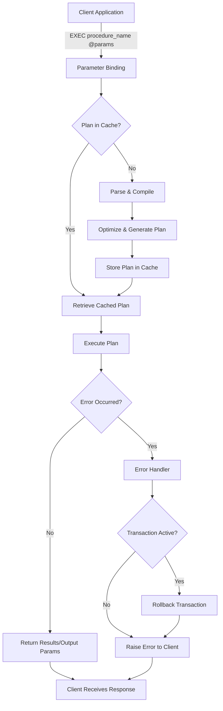
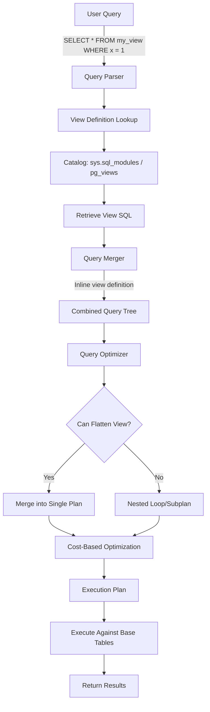
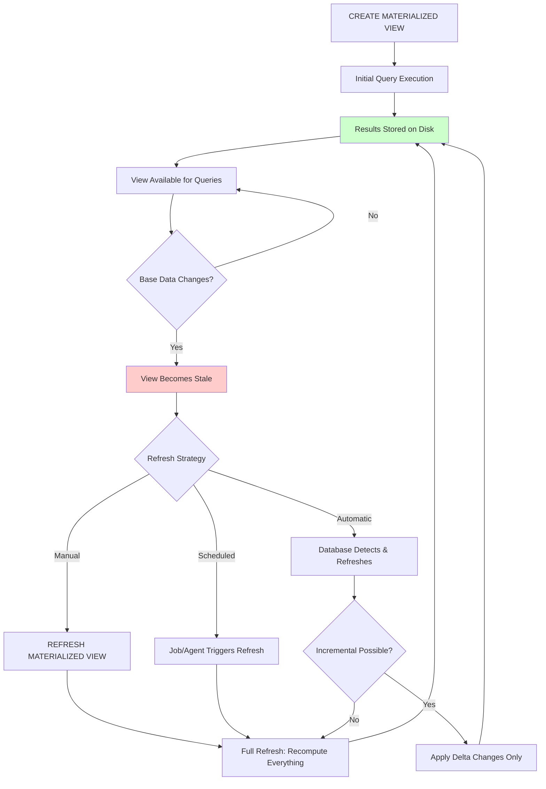
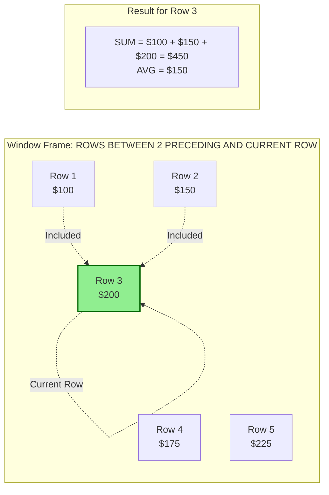
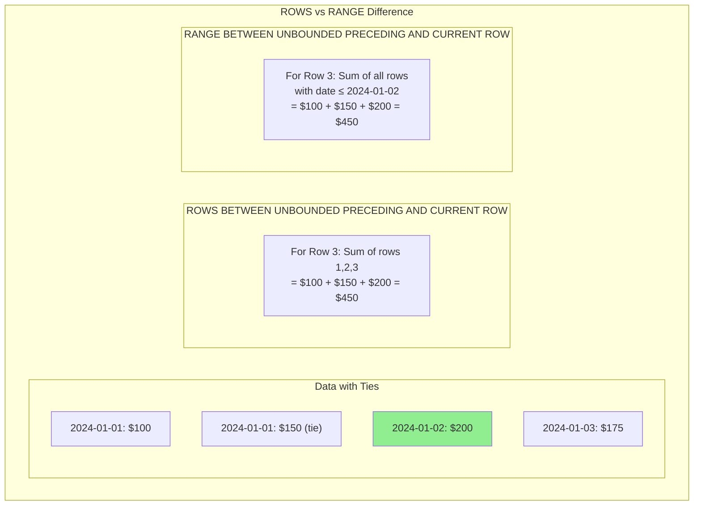
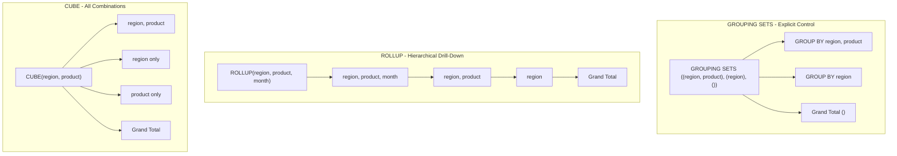
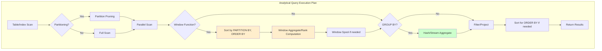

## Executive Summary

This guide provides a complete reference for data engineers transitioning from intermediate SQL skills to production-grade database development. We cover three interconnected domains that form the backbone of enterprise data platforms:

**Stored Procedures** encapsulate business logic within the database layer, providing security boundaries, reducing network round-trips, and centralizing complex operations. However, they require careful design to avoid performance pitfalls and maintainability challenges.

**Views and Materialized Views** create abstraction layers over complex schemas. Standard views act as saved queries that simplify access patterns and enforce security, while materialized views trade storage and maintenance overhead for dramatically improved query performance on expensive aggregations.

**Analytics-Heavy SQL** leverages window functions, advanced grouping operations, and recursive patterns to solve complex analytical problems in single, efficient queries—replacing error-prone procedural approaches with declarative, set-based solutions.

The guide progresses from foundational concepts through advanced optimization techniques, with extensive code examples for SQL Server and PostgreSQL, cross-platform comparisons, and real-world case studies demonstrating measurable improvements.

---

# Part 1: Stored Procedures

## 1.1 Foundational Concepts

A stored procedure is a named, precompiled collection of SQL statements and control-flow logic stored within the database. Think of it as a function that lives inside your database server—you call it by name, optionally pass parameters, and it executes its logic where the data resides.

### Why Stored Procedures Exist

Stored procedures address several practical challenges:

1. **Network Efficiency**: Instead of sending 50 SQL statements across the network, send one procedure call
2. **Security Encapsulation**: Grant users permission to execute a procedure without granting access to underlying tables
3. **Centralized Logic**: Business rules live in one place rather than duplicated across applications
4. **Plan Caching**: The database compiles and caches execution plans, avoiding repeated optimization overhead

### Execution Flow



## 1.2 Creation Syntax and Parameter Handling

### SQL Server Procedure Creation

```sql
-- Basic procedure with input, output, and default parameters
CREATE OR ALTER PROCEDURE sales.usp_GetCustomerOrderSummary
    @CustomerId INT,                          -- Required input
    @StartDate DATE = NULL,                   -- Optional with default
    @EndDate DATE = NULL,
    @TotalOrders INT OUTPUT,                  -- Output parameter
    @TotalRevenue DECIMAL(18,2) OUTPUT
AS
BEGIN
    SET NOCOUNT ON;  -- Suppress "rows affected" messages
    
    -- Default date range to last 12 months if not specified
    SET @StartDate = ISNULL(@StartDate, DATEADD(MONTH, -12, GETDATE()));
    SET @EndDate = ISNULL(@EndDate, GETDATE());
    
    -- Calculate summary metrics
    SELECT 
        @TotalOrders = COUNT(*),
        @TotalRevenue = ISNULL(SUM(TotalAmount), 0)
    FROM sales.Orders
    WHERE CustomerId = @CustomerId
      AND OrderDate BETWEEN @StartDate AND @EndDate;
    
    -- Return detailed order list
    SELECT 
        OrderId,
        OrderDate,
        TotalAmount,
        Status
    FROM sales.Orders
    WHERE CustomerId = @CustomerId
      AND OrderDate BETWEEN @StartDate AND @EndDate
    ORDER BY OrderDate DESC;
END;
GO

-- Calling the procedure
DECLARE @Orders INT, @Revenue DECIMAL(18,2);

EXEC sales.usp_GetCustomerOrderSummary 
    @CustomerId = 12345,
    @StartDate = '2024-01-01',
    @TotalOrders = @Orders OUTPUT,
    @TotalRevenue = @Revenue OUTPUT;

SELECT @Orders AS TotalOrders, @Revenue AS TotalRevenue;
```

### PostgreSQL Function/Procedure Creation

PostgreSQL distinguishes between **functions** (which return values) and **procedures** (introduced in version 11, which can manage transactions):

```sql
-- PostgreSQL function returning a table
CREATE OR REPLACE FUNCTION sales.get_customer_order_summary(
    p_customer_id INTEGER,
    p_start_date DATE DEFAULT NULL,
    p_end_date DATE DEFAULT NULL
)
RETURNS TABLE (
    order_id INTEGER,
    order_date DATE,
    total_amount NUMERIC(18,2),
    status VARCHAR(50),
    running_total NUMERIC(18,2)
)
LANGUAGE plpgsql
AS $$
DECLARE
    v_start_date DATE;
    v_end_date DATE;
BEGIN
    -- Default date range
    v_start_date := COALESCE(p_start_date, CURRENT_DATE - INTERVAL '12 months');
    v_end_date := COALESCE(p_end_date, CURRENT_DATE);
    
    RETURN QUERY
    SELECT 
        o.order_id,
        o.order_date,
        o.total_amount,
        o.status,
        SUM(o.total_amount) OVER (ORDER BY o.order_date) AS running_total
    FROM sales.orders o
    WHERE o.customer_id = p_customer_id
      AND o.order_date BETWEEN v_start_date AND v_end_date
    ORDER BY o.order_date DESC;
END;
$$;

-- Calling the function
SELECT * FROM sales.get_customer_order_summary(12345, '2024-01-01', NULL);

-- PostgreSQL procedure with transaction control (v11+)
CREATE OR REPLACE PROCEDURE sales.process_batch_orders(
    p_batch_id INTEGER,
    INOUT p_processed_count INTEGER DEFAULT 0
)
LANGUAGE plpgsql
AS $$
DECLARE
    v_order RECORD;
BEGIN
    FOR v_order IN 
        SELECT order_id FROM sales.pending_orders WHERE batch_id = p_batch_id
    LOOP
        -- Process each order
        UPDATE sales.orders SET status = 'PROCESSED' WHERE order_id = v_order.order_id;
        p_processed_count := p_processed_count + 1;
        
        -- Commit every 1000 records to avoid long transactions
        IF p_processed_count % 1000 = 0 THEN
            COMMIT;
        END IF;
    END LOOP;
    
    COMMIT;
END;
$$;

-- Calling the procedure
CALL sales.process_batch_orders(101, NULL);
```

## 1.3 Control Flow Structures

### SQL Server Control Flow

```sql
CREATE OR ALTER PROCEDURE inventory.usp_AdjustStock
    @ProductId INT,
    @Adjustment INT,
    @AdjustmentType VARCHAR(20),  -- 'RECEIPT', 'SALE', 'ADJUSTMENT', 'RETURN'
    @ResultMessage NVARCHAR(500) OUTPUT
AS
BEGIN
    SET NOCOUNT ON;
    
    DECLARE @CurrentStock INT;
    DECLARE @NewStock INT;
    DECLARE @MinStock INT;
    
    -- Get current inventory
    SELECT @CurrentStock = QuantityOnHand, @MinStock = MinimumStock
    FROM inventory.Products
    WHERE ProductId = @ProductId;
    
    -- Validate product exists
    IF @CurrentStock IS NULL
    BEGIN
        SET @ResultMessage = 'Product not found: ' + CAST(@ProductId AS VARCHAR);
        RETURN -1;
    END
    
    -- Apply adjustment based on type
    SET @NewStock = CASE @AdjustmentType
        WHEN 'RECEIPT' THEN @CurrentStock + ABS(@Adjustment)
        WHEN 'SALE' THEN @CurrentStock - ABS(@Adjustment)
        WHEN 'RETURN' THEN @CurrentStock + ABS(@Adjustment)
        WHEN 'ADJUSTMENT' THEN @CurrentStock + @Adjustment
        ELSE @CurrentStock  -- Unknown type, no change
    END;
    
    -- Validate stock won't go negative
    IF @NewStock < 0
    BEGIN
        SET @ResultMessage = 'Insufficient stock. Current: ' + CAST(@CurrentStock AS VARCHAR) 
                           + ', Requested: ' + CAST(@Adjustment AS VARCHAR);
        RETURN -2;
    END
    
    -- Update stock
    UPDATE inventory.Products
    SET QuantityOnHand = @NewStock,
        LastModified = GETDATE()
    WHERE ProductId = @ProductId;
    
    -- Check for low stock alert
    IF @NewStock <= @MinStock
    BEGIN
        -- Log alert (simplified)
        INSERT INTO inventory.StockAlerts (ProductId, AlertType, CurrentStock, Threshold, AlertDate)
        VALUES (@ProductId, 'LOW_STOCK', @NewStock, @MinStock, GETDATE());
        
        SET @ResultMessage = 'Stock updated. LOW STOCK ALERT: ' + CAST(@NewStock AS VARCHAR) 
                           + ' units remaining';
    END
    ELSE
    BEGIN
        SET @ResultMessage = 'Stock updated successfully. New quantity: ' + CAST(@NewStock AS VARCHAR);
    END
    
    RETURN 0;
END;
```

### PostgreSQL Control Flow

```sql
CREATE OR REPLACE FUNCTION inventory.adjust_stock(
    p_product_id INTEGER,
    p_adjustment INTEGER,
    p_adjustment_type VARCHAR(20)
)
RETURNS JSON
LANGUAGE plpgsql
AS $$
DECLARE
    v_current_stock INTEGER;
    v_new_stock INTEGER;
    v_min_stock INTEGER;
    v_result JSON;
BEGIN
    -- Get current inventory
    SELECT quantity_on_hand, minimum_stock
    INTO v_current_stock, v_min_stock
    FROM inventory.products
    WHERE product_id = p_product_id;
    
    -- Validate product exists
    IF NOT FOUND THEN
        RETURN json_build_object(
            'success', false,
            'error_code', 'PRODUCT_NOT_FOUND',
            'message', format('Product %s not found', p_product_id)
        );
    END IF;
    
    -- Calculate new stock using CASE
    v_new_stock := CASE p_adjustment_type
        WHEN 'RECEIPT' THEN v_current_stock + ABS(p_adjustment)
        WHEN 'SALE' THEN v_current_stock - ABS(p_adjustment)
        WHEN 'RETURN' THEN v_current_stock + ABS(p_adjustment)
        WHEN 'ADJUSTMENT' THEN v_current_stock + p_adjustment
        ELSE v_current_stock
    END;
    
    -- Validate stock
    IF v_new_stock < 0 THEN
        RETURN json_build_object(
            'success', false,
            'error_code', 'INSUFFICIENT_STOCK',
            'message', format('Insufficient stock. Current: %s, Requested: %s', 
                            v_current_stock, p_adjustment)
        );
    END IF;
    
    -- Update and return result
    UPDATE inventory.products
    SET quantity_on_hand = v_new_stock,
        last_modified = NOW()
    WHERE product_id = p_product_id;
    
    -- Build response with optional alert
    IF v_new_stock <= v_min_stock THEN
        INSERT INTO inventory.stock_alerts (product_id, alert_type, current_stock, threshold)
        VALUES (p_product_id, 'LOW_STOCK', v_new_stock, v_min_stock);
        
        RETURN json_build_object(
            'success', true,
            'new_stock', v_new_stock,
            'alert', 'LOW_STOCK'
        );
    ELSE
        RETURN json_build_object(
            'success', true,
            'new_stock', v_new_stock
        );
    END IF;
END;
$$;
```

## 1.4 Error Handling and Transaction Management

### SQL Server TRY-CATCH Pattern

```sql
CREATE OR ALTER PROCEDURE orders.usp_CreateOrderWithItems
    @CustomerId INT,
    @Items orders.OrderItemTableType READONLY,  -- Table-valued parameter
    @OrderId INT OUTPUT
AS
BEGIN
    SET NOCOUNT ON;
    SET XACT_ABORT ON;  -- Ensures transaction is aborted on any error
    
    DECLARE @ErrorMessage NVARCHAR(4000);
    DECLARE @ErrorSeverity INT;
    DECLARE @ErrorState INT;
    
    BEGIN TRY
        BEGIN TRANSACTION;
        
        -- Create order header
        INSERT INTO orders.Orders (CustomerId, OrderDate, Status)
        VALUES (@CustomerId, GETDATE(), 'PENDING');
        
        SET @OrderId = SCOPE_IDENTITY();
        
        -- Insert order items
        INSERT INTO orders.OrderItems (OrderId, ProductId, Quantity, UnitPrice)
        SELECT @OrderId, ProductId, Quantity, UnitPrice
        FROM @Items;
        
        -- Update inventory (this could fail due to constraints)
        UPDATE p
        SET p.QuantityOnHand = p.QuantityOnHand - i.Quantity
        FROM inventory.Products p
        INNER JOIN @Items i ON p.ProductId = i.ProductId;
        
        -- Validate no negative inventory
        IF EXISTS (SELECT 1 FROM inventory.Products WHERE QuantityOnHand < 0)
        BEGIN
            RAISERROR('Insufficient inventory for one or more products', 16, 1);
        END
        
        -- Calculate order total
        UPDATE orders.Orders
        SET TotalAmount = (
            SELECT SUM(Quantity * UnitPrice) 
            FROM orders.OrderItems 
            WHERE OrderId = @OrderId
        )
        WHERE OrderId = @OrderId;
        
        COMMIT TRANSACTION;
        
    END TRY
    BEGIN CATCH
        IF @@TRANCOUNT > 0
            ROLLBACK TRANSACTION;
        
        SET @ErrorMessage = ERROR_MESSAGE();
        SET @ErrorSeverity = ERROR_SEVERITY();
        SET @ErrorState = ERROR_STATE();
        
        -- Log the error
        INSERT INTO logs.ErrorLog (ErrorMessage, ErrorSeverity, ErrorState, ErrorProcedure, ErrorLine, ErrorTime)
        VALUES (@ErrorMessage, @ErrorSeverity, @ErrorState, ERROR_PROCEDURE(), ERROR_LINE(), GETDATE());
        
        -- Re-throw with context
        RAISERROR('Order creation failed: %s', @ErrorSeverity, @ErrorState, @ErrorMessage);
    END CATCH
END;
```

### PostgreSQL Exception Handling

```sql
CREATE OR REPLACE FUNCTION orders.create_order_with_items(
    p_customer_id INTEGER,
    p_items JSONB  -- Array of {product_id, quantity, unit_price}
)
RETURNS JSON
LANGUAGE plpgsql
AS $$
DECLARE
    v_order_id INTEGER;
    v_item JSONB;
    v_total NUMERIC(18,2) := 0;
BEGIN
    -- Create order header
    INSERT INTO orders.orders (customer_id, order_date, status)
    VALUES (p_customer_id, NOW(), 'PENDING')
    RETURNING order_id INTO v_order_id;
    
    -- Insert items and update inventory
    FOR v_item IN SELECT * FROM jsonb_array_elements(p_items)
    LOOP
        -- Insert order item
        INSERT INTO orders.order_items (order_id, product_id, quantity, unit_price)
        VALUES (
            v_order_id,
            (v_item->>'product_id')::INTEGER,
            (v_item->>'quantity')::INTEGER,
            (v_item->>'unit_price')::NUMERIC
        );
        
        -- Update inventory
        UPDATE inventory.products
        SET quantity_on_hand = quantity_on_hand - (v_item->>'quantity')::INTEGER
        WHERE product_id = (v_item->>'product_id')::INTEGER;
        
        -- Accumulate total
        v_total := v_total + ((v_item->>'quantity')::INTEGER * (v_item->>'unit_price')::NUMERIC);
    END LOOP;
    
    -- Check for negative inventory (constraint would catch this, but explicit check is clearer)
    IF EXISTS (SELECT 1 FROM inventory.products WHERE quantity_on_hand < 0) THEN
        RAISE EXCEPTION 'Insufficient inventory for one or more products'
            USING ERRCODE = 'P0001';
    END IF;
    
    -- Update order total
    UPDATE orders.orders
    SET total_amount = v_total
    WHERE order_id = v_order_id;
    
    RETURN json_build_object(
        'success', true,
        'order_id', v_order_id,
        'total_amount', v_total
    );
    
EXCEPTION
    WHEN unique_violation THEN
        RETURN json_build_object(
            'success', false,
            'error_code', 'DUPLICATE_ENTRY',
            'message', SQLERRM
        );
    WHEN foreign_key_violation THEN
        RETURN json_build_object(
            'success', false,
            'error_code', 'INVALID_REFERENCE',
            'message', 'Invalid customer or product reference'
        );
    WHEN SQLSTATE 'P0001' THEN  -- Our custom insufficient inventory error
        RETURN json_build_object(
            'success', false,
            'error_code', 'INSUFFICIENT_INVENTORY',
            'message', SQLERRM
        );
    WHEN OTHERS THEN
        -- Log the error
        INSERT INTO logs.error_log (error_message, error_code, error_context, error_time)
        VALUES (SQLERRM, SQLSTATE, PG_EXCEPTION_CONTEXT, NOW());
        
        RETURN json_build_object(
            'success', false,
            'error_code', 'UNEXPECTED_ERROR',
            'message', SQLERRM
        );
END;
$$;
```

## 1.5 Security Considerations

### Ownership Chaining and EXECUTE AS (SQL Server)

```sql
-- Create procedure that accesses sensitive data
CREATE OR ALTER PROCEDURE hr.usp_GetEmployeeSalaryInfo
    @EmployeeId INT
WITH EXECUTE AS OWNER  -- Executes with procedure owner's permissions
AS
BEGIN
    SET NOCOUNT ON;
    
    -- Users can execute this procedure without direct SELECT on salary table
    SELECT 
        e.EmployeeId,
        e.FirstName,
        e.LastName,
        s.BaseSalary,
        s.Bonus,
        s.EffectiveDate
    FROM hr.Employees e
    INNER JOIN hr.Salaries s ON e.EmployeeId = s.EmployeeId
    WHERE e.EmployeeId = @EmployeeId
      AND s.EffectiveDate = (
          SELECT MAX(EffectiveDate) 
          FROM hr.Salaries 
          WHERE EmployeeId = @EmployeeId
      );
END;
GO

-- Grant execute to role, not underlying table access
GRANT EXECUTE ON hr.usp_GetEmployeeSalaryInfo TO HRReportingRole;
```

### Dynamic SQL with Parameterization (Preventing SQL Injection)

```sql
-- ❌ BAD: Vulnerable to SQL injection
CREATE PROCEDURE search.usp_SearchProducts_UNSAFE
    @SearchColumn NVARCHAR(50),
    @SearchValue NVARCHAR(100)
AS
BEGIN
    DECLARE @SQL NVARCHAR(MAX);
    -- NEVER DO THIS - direct string concatenation with user input
    SET @SQL = 'SELECT * FROM products WHERE ' + @SearchColumn + ' = ''' + @SearchValue + '''';
    EXEC(@SQL);
END;

-- ✅ GOOD: Parameterized dynamic SQL
CREATE OR ALTER PROCEDURE search.usp_SearchProducts_SAFE
    @SearchColumn NVARCHAR(50),
    @SearchValue NVARCHAR(100)
AS
BEGIN
    SET NOCOUNT ON;
    
    DECLARE @SQL NVARCHAR(MAX);
    DECLARE @ValidColumns TABLE (ColumnName NVARCHAR(50));
    
    -- Whitelist valid columns
    INSERT INTO @ValidColumns VALUES ('ProductName'), ('Category'), ('Brand'), ('SKU');
    
    -- Validate column name against whitelist
    IF NOT EXISTS (SELECT 1 FROM @ValidColumns WHERE ColumnName = @SearchColumn)
    BEGIN
        RAISERROR('Invalid search column specified', 16, 1);
        RETURN;
    END
    
    -- Build query with validated column name, parameterized value
    SET @SQL = N'SELECT ProductId, ProductName, Category, Brand, Price 
                 FROM inventory.Products 
                 WHERE ' + QUOTENAME(@SearchColumn) + ' = @Value';
    
    -- Execute with sp_executesql for parameter safety
    EXEC sp_executesql @SQL, N'@Value NVARCHAR(100)', @Value = @SearchValue;
END;
```

## 1.6 Performance Implications and Parameter Sniffing

Parameter sniffing occurs when SQL Server creates an execution plan optimized for the first parameter values used, which may perform poorly for different values.

```sql
-- Procedure vulnerable to parameter sniffing
CREATE OR ALTER PROCEDURE sales.usp_GetOrdersByDate
    @StartDate DATE,
    @EndDate DATE
AS
BEGIN
    SET NOCOUNT ON;
    
    SELECT o.OrderId, o.CustomerId, o.OrderDate, o.TotalAmount
    FROM sales.Orders o
    WHERE o.OrderDate BETWEEN @StartDate AND @EndDate;
END;
GO

-- Solutions for parameter sniffing:

-- Option 1: OPTIMIZE FOR UNKNOWN (uses average statistics)
CREATE OR ALTER PROCEDURE sales.usp_GetOrdersByDate_OptUnknown
    @StartDate DATE,
    @EndDate DATE
AS
BEGIN
    SET NOCOUNT ON;
    
    SELECT o.OrderId, o.CustomerId, o.OrderDate, o.TotalAmount
    FROM sales.Orders o
    WHERE o.OrderDate BETWEEN @StartDate AND @EndDate
    OPTION (OPTIMIZE FOR UNKNOWN);
END;

-- Option 2: RECOMPILE hint (fresh plan each execution - use sparingly)
CREATE OR ALTER PROCEDURE sales.usp_GetOrdersByDate_Recompile
    @StartDate DATE,
    @EndDate DATE
AS
BEGIN
    SET NOCOUNT ON;
    
    SELECT o.OrderId, o.CustomerId, o.OrderDate, o.TotalAmount
    FROM sales.Orders o
    WHERE o.OrderDate BETWEEN @StartDate AND @EndDate
    OPTION (RECOMPILE);
END;

-- Option 3: Local variables (masks parameter values from optimizer)
CREATE OR ALTER PROCEDURE sales.usp_GetOrdersByDate_LocalVars
    @StartDate DATE,
    @EndDate DATE
AS
BEGIN
    SET NOCOUNT ON;
    
    DECLARE @LocalStart DATE = @StartDate;
    DECLARE @LocalEnd DATE = @EndDate;
    
    SELECT o.OrderId, o.CustomerId, o.OrderDate, o.TotalAmount
    FROM sales.Orders o
    WHERE o.OrderDate BETWEEN @LocalStart AND @LocalEnd;
END;
```

## 1.7 When to Use vs. Avoid Stored Procedures

### Decision Framework

| Factor | Favor Procedures | Favor Application Code |
|--------|------------------|------------------------|
| **Security** | Sensitive data access, need to hide table structure | Open data access patterns |
| **Performance** | High-frequency operations, complex multi-statement logic | Simple CRUD, ORMs work well |
| **Portability** | Single database platform commitment | Multi-database support needed |
| **Team Skills** | Strong DBA team, SQL expertise | Application developer focus |
| **Debugging** | Mature database tooling available | Application debugging preferred |
| **Version Control** | Database-native migration tools | Git-based workflow preference |
| **Network** | High latency, many round-trips | Low latency, modern connection pooling |

---

# Part 2: Views and Materialized Views

## 2.1 Standard View Fundamentals

A view is a stored query definition that acts as a virtual table. When you query a view, the database substitutes the view's definition into your query and optimizes the combined result. Think of it as a saved query that you can reference by name.

### View Resolution Process



### Basic View Creation

```sql
-- SQL Server: Simple view
CREATE VIEW sales.vw_ActiveCustomerOrders
AS
SELECT 
    c.CustomerId,
    c.CustomerName,
    c.Email,
    o.OrderId,
    o.OrderDate,
    o.TotalAmount,
    o.Status
FROM sales.Customers c
INNER JOIN sales.Orders o ON c.CustomerId = o.CustomerId
WHERE c.IsActive = 1
  AND o.Status NOT IN ('CANCELLED', 'REFUNDED');
GO

-- PostgreSQL equivalent
CREATE OR REPLACE VIEW sales.vw_active_customer_orders AS
SELECT 
    c.customer_id,
    c.customer_name,
    c.email,
    o.order_id,
    o.order_date,
    o.total_amount,
    o.status
FROM sales.customers c
INNER JOIN sales.orders o ON c.customer_id = o.customer_id
WHERE c.is_active = true
  AND o.status NOT IN ('CANCELLED', 'REFUNDED');
```

### Schema Binding and Dependencies

```sql
-- SQL Server: SCHEMABINDING prevents underlying table changes
CREATE VIEW sales.vw_OrderSummaryByMonth
WITH SCHEMABINDING  -- Locks schema dependencies
AS
SELECT 
    YEAR(o.OrderDate) AS OrderYear,
    MONTH(o.OrderDate) AS OrderMonth,
    COUNT_BIG(*) AS OrderCount,  -- Required for indexed views
    SUM(o.TotalAmount) AS TotalRevenue
FROM dbo.Orders o  -- Must use two-part names with SCHEMABINDING
GROUP BY YEAR(o.OrderDate), MONTH(o.OrderDate);
GO

-- Check view dependencies (SQL Server)
SELECT 
    OBJECT_NAME(referencing_id) AS ViewName,
    referenced_entity_name AS ReferencedTable
FROM sys.sql_expression_dependencies
WHERE referencing_id = OBJECT_ID('sales.vw_OrderSummaryByMonth');

-- PostgreSQL: Check view dependencies
SELECT 
    dependent_view.relname AS view_name,
    source_table.relname AS table_name
FROM pg_depend
JOIN pg_rewrite ON pg_depend.objid = pg_rewrite.oid
JOIN pg_class AS dependent_view ON pg_rewrite.ev_class = dependent_view.oid
JOIN pg_class AS source_table ON pg_depend.refobjid = source_table.oid
WHERE source_table.relname = 'orders'
  AND dependent_view.relkind = 'v';
```

### Updatable Views

```sql
-- SQL Server: Updatable view with CHECK OPTION
CREATE VIEW hr.vw_ActiveEmployees
AS
SELECT EmployeeId, FirstName, LastName, Department, HireDate, IsActive
FROM hr.Employees
WHERE IsActive = 1
WITH CHECK OPTION;  -- Prevents INSERT/UPDATE that would make row invisible
GO

-- This INSERT succeeds
INSERT INTO hr.vw_ActiveEmployees (FirstName, LastName, Department, HireDate, IsActive)
VALUES ('John', 'Doe', 'Engineering', GETDATE(), 1);

-- This INSERT fails due to CHECK OPTION
INSERT INTO hr.vw_ActiveEmployees (FirstName, LastName, Department, HireDate, IsActive)
VALUES ('Jane', 'Smith', 'Sales', GETDATE(), 0);  -- Error: violates CHECK OPTION

-- PostgreSQL: Updatable view with check option
CREATE OR REPLACE VIEW hr.vw_active_employees AS
SELECT employee_id, first_name, last_name, department, hire_date, is_active
FROM hr.employees
WHERE is_active = true
WITH CHECK OPTION;
```

## 2.2 Materialized Views

Unlike standard views (which are query definitions), materialized views store the actual query results. Think of it as a cached report pinned to a bulletin board—you don't need to run to the filing cabinet for every request, but the bulletin board might show stale information.

### Materialized View Lifecycle



### PostgreSQL Materialized Views

```sql
-- Create materialized view for dashboard aggregations
CREATE MATERIALIZED VIEW analytics.mv_daily_sales_summary AS
SELECT 
    DATE(order_date) AS sale_date,
    product_category,
    region,
    COUNT(*) AS order_count,
    COUNT(DISTINCT customer_id) AS unique_customers,
    SUM(total_amount) AS total_revenue,
    AVG(total_amount) AS avg_order_value,
    PERCENTILE_CONT(0.5) WITHIN GROUP (ORDER BY total_amount) AS median_order_value
FROM sales.orders o
JOIN sales.customers c ON o.customer_id = c.customer_id
JOIN inventory.products p ON o.product_id = p.product_id
WHERE order_date >= CURRENT_DATE - INTERVAL '2 years'
GROUP BY DATE(order_date), product_category, region
WITH DATA;  -- Populate immediately (vs. WITH NO DATA for deferred)

-- Create index on materialized view for fast filtering
CREATE INDEX idx_mv_daily_sales_date ON analytics.mv_daily_sales_summary(sale_date);
CREATE INDEX idx_mv_daily_sales_category ON analytics.mv_daily_sales_summary(product_category);

-- Standard refresh (blocks reads during refresh)
REFRESH MATERIALIZED VIEW analytics.mv_daily_sales_summary;

-- Concurrent refresh (allows reads during refresh, requires unique index)
CREATE UNIQUE INDEX idx_mv_daily_sales_pk 
ON analytics.mv_daily_sales_summary(sale_date, product_category, region);

REFRESH MATERIALIZED VIEW CONCURRENTLY analytics.mv_daily_sales_summary;

-- Check materialized view freshness
SELECT 
    schemaname,
    matviewname,
    hasindexes,
    ispopulated,
    pg_size_pretty(pg_relation_size(schemaname || '.' || matviewname)) AS size
FROM pg_matviews
WHERE matviewname = 'mv_daily_sales_summary';
```
### SQL Server Indexed Views

SQL Server doesn't have "materialized views" by name, but **indexed views** serve the same purpose. When you create a clustered index on a view with SCHEMABINDING, the results are physically stored.

```sql
-- SQL Server indexed view (materialized view equivalent)
-- Must follow strict rules: SCHEMABINDING, no outer joins, no subqueries, etc.
CREATE VIEW analytics.vw_DailySalesSummary
WITH SCHEMABINDING
AS
SELECT 
    CAST(o.OrderDate AS DATE) AS SaleDate,
    p.Category AS ProductCategory,
    c.Region,
    COUNT_BIG(*) AS OrderCount,  -- Must use COUNT_BIG, not COUNT
    SUM(o.TotalAmount) AS TotalRevenue,
    SUM(ISNULL(o.TotalAmount, 0)) AS TotalRevenueNotNull  -- For AVG calculation
FROM dbo.Orders o
INNER JOIN dbo.Customers c ON o.CustomerId = c.CustomerId
INNER JOIN dbo.Products p ON o.ProductId = p.ProductId
GROUP BY CAST(o.OrderDate AS DATE), p.Category, c.Region;
GO

-- Create clustered index to materialize the view
CREATE UNIQUE CLUSTERED INDEX IX_vw_DailySalesSummary
ON analytics.vw_DailySalesSummary (SaleDate, ProductCategory, Region);

-- Additional indexes for common query patterns
CREATE NONCLUSTERED INDEX IX_vw_DailySalesSummary_Category
ON analytics.vw_DailySalesSummary (ProductCategory)
INCLUDE (OrderCount, TotalRevenue);
GO

-- SQL Server automatically maintains indexed views on data changes
-- No manual refresh needed, but maintenance has overhead on write operations

-- Check indexed view size and usage
SELECT 
    i.name AS IndexName,
    p.rows AS RowCount,
    SUM(a.total_pages) * 8 / 1024 AS TotalSpaceMB,
    SUM(a.used_pages) * 8 / 1024 AS UsedSpaceMB
FROM sys.indexes i
JOIN sys.partitions p ON i.object_id = p.object_id AND i.index_id = p.index_id
JOIN sys.allocation_units a ON p.partition_id = a.container_id
WHERE i.object_id = OBJECT_ID('analytics.vw_DailySalesSummary')
GROUP BY i.name, p.rows;
```

### Materialized View Refresh Strategies

```sql
-- PostgreSQL: Scheduled refresh using pg_cron extension
CREATE EXTENSION IF NOT EXISTS pg_cron;

-- Refresh every hour
SELECT cron.schedule('refresh-sales-mv', '0 * * * *', 
    'REFRESH MATERIALIZED VIEW CONCURRENTLY analytics.mv_daily_sales_summary');

-- Refresh at 2 AM daily during low-traffic window
SELECT cron.schedule('refresh-sales-mv-nightly', '0 2 * * *', 
    'REFRESH MATERIALIZED VIEW analytics.mv_daily_sales_summary');

-- SQL Server: Scheduled refresh using SQL Agent Job
-- (Typically configured through SSMS, but can be scripted)
EXEC msdb.dbo.sp_add_job 
    @job_name = N'Refresh Analytics Staging Tables';

EXEC msdb.dbo.sp_add_jobstep 
    @job_name = N'Refresh Analytics Staging Tables',
    @step_name = N'Rebuild staging aggregates',
    @subsystem = N'TSQL',
    @command = N'
        TRUNCATE TABLE analytics.StagedDailySummary;
        INSERT INTO analytics.StagedDailySummary
        SELECT * FROM analytics.vw_DailySalesSummary;
    ';

EXEC msdb.dbo.sp_add_schedule 
    @schedule_name = N'Hourly',
    @freq_type = 4,  -- Daily
    @freq_interval = 1,
    @freq_subday_type = 8,  -- Hours
    @freq_subday_interval = 1;  -- Every 1 hour
```

### Refresh Strategy Decision Matrix

| Factor | Full Refresh | Concurrent Refresh | Incremental | Real-time (Indexed View) |
|--------|-------------|-------------------|-------------|--------------------------|
| **Data Volume** | Small-Medium | Medium-Large | Large | Any |
| **Acceptable Staleness** | Minutes-Hours | Minutes-Hours | Minutes | None (always current) |
| **Read Availability** | Blocked during refresh | Always available | Always available | Always available |
| **Write Overhead** | None | None | Log processing | Per-DML maintenance |
| **Complexity** | Low | Low | High | Medium |
| **PostgreSQL** | ✅ | ✅ (needs unique index) | ❌ Native | ❌ |
| **SQL Server** | Via table swap | ❌ | ❌ Native | ✅ Indexed Views |
| **Oracle** | ✅ | ✅ | ✅ (FAST refresh) | ✅ (ON COMMIT) |

## 2.3 View Performance Considerations

### Nested View Anti-Pattern

```sql
-- ❌ BAD: Deeply nested views that confuse the optimizer
CREATE VIEW level1 AS 
SELECT * FROM large_table WHERE status = 'ACTIVE';

CREATE VIEW level2 AS 
SELECT *, DATEDIFF(day, created_date, GETDATE()) AS age_days FROM level1;

CREATE VIEW level3 AS 
SELECT * FROM level2 WHERE age_days > 30;

CREATE VIEW level4 AS 
SELECT l3.*, c.customer_name 
FROM level3 l3 
JOIN customers c ON l3.customer_id = c.customer_id;

CREATE VIEW level5 AS 
SELECT * FROM level4 WHERE region = 'NORTH';

-- Query against level5 - optimizer may fail to flatten, 
-- resulting in poor plan with unnecessary intermediate results

-- ✅ GOOD: Flatten to single view or use CTEs for clarity
CREATE VIEW analytics.vw_NorthRegionAgedActiveOrders AS
SELECT 
    lt.order_id,
    lt.customer_id,
    c.customer_name,
    lt.created_date,
    DATEDIFF(day, lt.created_date, GETDATE()) AS age_days,
    lt.status,
    lt.region
FROM large_table lt
INNER JOIN customers c ON lt.customer_id = c.customer_id
WHERE lt.status = 'ACTIVE'
  AND lt.region = 'NORTH'
  AND lt.created_date < DATEADD(day, -30, GETDATE());
```

### Inspecting View Definition and Dependencies

```sql
-- SQL Server: View definition and dependencies
SELECT 
    v.name AS ViewName,
    m.definition AS ViewDefinition,
    OBJECT_NAME(d.referenced_id) AS DependsOnTable
FROM sys.views v
JOIN sys.sql_modules m ON v.object_id = m.object_id
LEFT JOIN sys.sql_expression_dependencies d ON v.object_id = d.referencing_id
WHERE v.schema_id = SCHEMA_ID('analytics');

-- PostgreSQL: View definition and dependencies
SELECT 
    viewname,
    definition
FROM pg_views
WHERE schemaname = 'analytics';

-- Detailed dependency tree
WITH RECURSIVE view_deps AS (
    SELECT 
        cl.oid,
        cl.relname AS view_name,
        cl.relkind,
        1 AS depth,
        ARRAY[cl.relname::text] AS path
    FROM pg_class cl
    WHERE cl.relname = 'mv_daily_sales_summary'
      AND cl.relkind IN ('v', 'm')
    
    UNION ALL
    
    SELECT 
        dep_cl.oid,
        dep_cl.relname,
        dep_cl.relkind,
        vd.depth + 1,
        vd.path || dep_cl.relname::text
    FROM view_deps vd
    JOIN pg_depend d ON d.refobjid = vd.oid
    JOIN pg_rewrite rw ON d.objid = rw.oid
    JOIN pg_class dep_cl ON rw.ev_class = dep_cl.oid
    WHERE vd.depth < 10
      AND NOT dep_cl.relname = ANY(vd.path)  -- Prevent cycles
)
SELECT DISTINCT view_name, depth, relkind, path
FROM view_deps
ORDER BY depth, view_name;
```

---

# Part 3: Analytics-Heavy SQL

## 3.1 Window Functions Fundamentals

Window functions perform calculations across a set of rows related to the current row—without collapsing rows like GROUP BY does. Think of it like a spreadsheet formula that can reference other cells in a sorted range while keeping each row separate.

### Window Function Frame Visualization





### Window Function Syntax Reference

```sql
-- Complete window function syntax
function_name(expression) OVER (
    [PARTITION BY partition_expression, ...]
    [ORDER BY sort_expression [ASC|DESC] [NULLS {FIRST|LAST}], ...]
    [frame_clause]
)

-- Frame clause options:
-- ROWS BETWEEN frame_start AND frame_end
-- RANGE BETWEEN frame_start AND frame_end  
-- GROUPS BETWEEN frame_start AND frame_end  (PostgreSQL 11+)

-- Frame boundaries:
-- UNBOUNDED PRECEDING  (first row of partition)
-- n PRECEDING          (n rows/values before current)
-- CURRENT ROW
-- n FOLLOWING          (n rows/values after current)
-- UNBOUNDED FOLLOWING  (last row of partition)
```

## 3.2 Ranking Functions

```sql
-- Sample data for examples
CREATE TABLE sales.monthly_performance (
    salesperson_id INT,
    salesperson_name VARCHAR(100),
    region VARCHAR(50),
    sale_month DATE,
    revenue DECIMAL(12,2)
);

-- All ranking functions compared
SELECT 
    salesperson_name,
    region,
    revenue,
    
    -- ROW_NUMBER: Unique sequential integer, arbitrary tiebreaker
    ROW_NUMBER() OVER (
        PARTITION BY region 
        ORDER BY revenue DESC
    ) AS row_num,
    
    -- RANK: Same rank for ties, gaps after ties (1,2,2,4)
    RANK() OVER (
        PARTITION BY region 
        ORDER BY revenue DESC
    ) AS rank_with_gaps,
    
    -- DENSE_RANK: Same rank for ties, no gaps (1,2,2,3)
    DENSE_RANK() OVER (
        PARTITION BY region 
        ORDER BY revenue DESC
    ) AS dense_rank_no_gaps,
    
    -- NTILE: Divide into n roughly equal buckets
    NTILE(4) OVER (
        PARTITION BY region 
        ORDER BY revenue DESC
    ) AS quartile,
    
    -- PERCENT_RANK: Relative rank as percentage (0 to 1)
    PERCENT_RANK() OVER (
        PARTITION BY region 
        ORDER BY revenue DESC
    ) AS percent_rank,
    
    -- CUME_DIST: Cumulative distribution (fraction of rows ≤ current)
    CUME_DIST() OVER (
        PARTITION BY region 
        ORDER BY revenue DESC
    ) AS cumulative_distribution
    
FROM sales.monthly_performance
WHERE sale_month = '2024-01-01';

-- Practical example: Top 3 performers per region
WITH ranked_sales AS (
    SELECT 
        salesperson_name,
        region,
        revenue,
        DENSE_RANK() OVER (
            PARTITION BY region 
            ORDER BY revenue DESC
        ) AS performance_rank
    FROM sales.monthly_performance
    WHERE sale_month >= DATEADD(MONTH, -3, GETDATE())
)
SELECT *
FROM ranked_sales
WHERE performance_rank <= 3
ORDER BY region, performance_rank;
```

## 3.3 Aggregate Window Functions

```sql
-- Running totals, moving averages, and cumulative metrics
SELECT 
    order_date,
    order_id,
    total_amount,
    
    -- Running total (cumulative sum)
    SUM(total_amount) OVER (
        ORDER BY order_date, order_id
        ROWS BETWEEN UNBOUNDED PRECEDING AND CURRENT ROW
    ) AS running_total,
    
    -- 7-day moving average
    AVG(total_amount) OVER (
        ORDER BY order_date
        ROWS BETWEEN 6 PRECEDING AND CURRENT ROW
    ) AS moving_avg_7day,
    
    -- Moving sum (last 30 days)
    SUM(total_amount) OVER (
        ORDER BY order_date
        RANGE BETWEEN INTERVAL '30 days' PRECEDING AND CURRENT ROW  -- PostgreSQL
        -- ROWS BETWEEN 29 PRECEDING AND CURRENT ROW  -- SQL Server approximation
    ) AS rolling_30day_sum,
    
    -- Percent of total (within partition)
    total_amount / SUM(total_amount) OVER (
        PARTITION BY DATE_TRUNC('month', order_date)
    ) * 100 AS pct_of_monthly_total,
    
    -- Cumulative count
    COUNT(*) OVER (
        ORDER BY order_date, order_id
        ROWS UNBOUNDED PRECEDING
    ) AS cumulative_order_count,
    
    -- Partition-level aggregates (no ORDER BY = entire partition)
    SUM(total_amount) OVER (
        PARTITION BY DATE_TRUNC('month', order_date)
    ) AS monthly_total,
    AVG(total_amount) OVER (
        PARTITION BY DATE_TRUNC('month', order_date)
    ) AS monthly_avg
    
FROM sales.orders
WHERE order_date >= '2024-01-01'
ORDER BY order_date, order_id;
```

## 3.4 Offset Functions (LAG, LEAD, FIRST_VALUE, LAST_VALUE)

```sql
-- Period-over-period comparisons and boundary values
SELECT 
    product_id,
    sale_month,
    revenue,
    
    -- Previous month's revenue
    LAG(revenue, 1) OVER (
        PARTITION BY product_id 
        ORDER BY sale_month
    ) AS prev_month_revenue,
    
    -- Revenue from same month last year
    LAG(revenue, 12) OVER (
        PARTITION BY product_id 
        ORDER BY sale_month
    ) AS same_month_last_year,
    
    -- Next month's revenue (forecasting comparisons)
    LEAD(revenue, 1) OVER (
        PARTITION BY product_id 
        ORDER BY sale_month
    ) AS next_month_revenue,
    
    -- Month-over-month change
    revenue - LAG(revenue, 1) OVER (
        PARTITION BY product_id 
        ORDER BY sale_month
    ) AS mom_change,
    
    -- Month-over-month percentage change
    ROUND(
        (revenue - LAG(revenue, 1) OVER (
            PARTITION BY product_id 
            ORDER BY sale_month
        )) / NULLIF(LAG(revenue, 1) OVER (
            PARTITION BY product_id 
            ORDER BY sale_month
        ), 0) * 100, 
        2
    ) AS mom_pct_change,
    
    -- Year-over-year percentage change
    ROUND(
        (revenue - LAG(revenue, 12) OVER (
            PARTITION BY product_id 
            ORDER BY sale_month
        )) / NULLIF(LAG(revenue, 12) OVER (
            PARTITION BY product_id 
            ORDER BY sale_month
        ), 0) * 100,
        2
    ) AS yoy_pct_change,
    
    -- First value in partition (baseline for comparison)
    FIRST_VALUE(revenue) OVER (
        PARTITION BY product_id 
        ORDER BY sale_month
        ROWS BETWEEN UNBOUNDED PRECEDING AND UNBOUNDED FOLLOWING
    ) AS first_month_revenue,
    
    -- Last value in partition (requires explicit frame!)
    LAST_VALUE(revenue) OVER (
        PARTITION BY product_id 
        ORDER BY sale_month
        ROWS BETWEEN UNBOUNDED PRECEDING AND UNBOUNDED FOLLOWING
    ) AS last_month_revenue,
    
    -- NTH_VALUE: Get specific position (PostgreSQL, SQL Server 2022+)
    NTH_VALUE(revenue, 3) OVER (
        PARTITION BY product_id 
        ORDER BY sale_month
        ROWS BETWEEN UNBOUNDED PRECEDING AND UNBOUNDED FOLLOWING
    ) AS third_month_revenue
    
FROM sales.monthly_product_revenue
WHERE sale_month >= '2023-01-01'
ORDER BY product_id, sale_month;

-- Practical example: Identify consecutive growth months
WITH monthly_changes AS (
    SELECT 
        product_id,
        sale_month,
        revenue,
        LAG(revenue) OVER (PARTITION BY product_id ORDER BY sale_month) AS prev_revenue,
        CASE 
            WHEN revenue > LAG(revenue) OVER (PARTITION BY product_id ORDER BY sale_month) 
            THEN 1 
            ELSE 0 
        END AS is_growth_month
    FROM sales.monthly_product_revenue
),
growth_streaks AS (
    SELECT 
        *,
        SUM(CASE WHEN is_growth_month = 0 THEN 1 ELSE 0 END) 
            OVER (PARTITION BY product_id ORDER BY sale_month) AS streak_group
    FROM monthly_changes
)
SELECT 
    product_id,
    MIN(sale_month) AS streak_start,
    MAX(sale_month) AS streak_end,
    COUNT(*) AS consecutive_growth_months
FROM growth_streaks
WHERE is_growth_month = 1
GROUP BY product_id, streak_group
HAVING COUNT(*) >= 3
ORDER BY consecutive_growth_months DESC;
```

## 3.5 Advanced GROUP BY Extensions

### ROLLUP, CUBE, and GROUPING SETS Hierarchy



```sql
-- ROLLUP: Hierarchical subtotals (n+1 grouping levels)
-- Perfect for drill-down reports: Year → Quarter → Month
SELECT 
    COALESCE(region, 'ALL REGIONS') AS region,
    COALESCE(product_category, 'ALL CATEGORIES') AS category,
    COALESCE(CAST(sale_month AS VARCHAR), 'ALL MONTHS') AS month,
    SUM(revenue) AS total_revenue,
    COUNT(*) AS transaction_count,
    
    -- GROUPING() returns 1 if column is aggregated (NULL due to rollup)
    GROUPING(region) AS is_region_total,
    GROUPING(product_category) AS is_category_total,
    GROUPING(sale_month) AS is_month_total
    
FROM sales.transactions
WHERE sale_year = 2024
GROUP BY ROLLUP(region, product_category, sale_month)
ORDER BY 
    GROUPING(region),
    region,
    GROUPING(product_category),
    product_category,
    GROUPING(sale_month),
    sale_month;

-- CUBE: All possible combinations (2^n grouping levels)
-- Useful for OLAP-style analysis across all dimensions
SELECT 
    COALESCE(region, 'ALL') AS region,
    COALESCE(product_category, 'ALL') AS category,
    SUM(revenue) AS total_revenue,
    
    -- GROUPING_ID creates bitmask for easier filtering
    -- SQL Server / PostgreSQL syntax
    GROUPING(region) * 2 + GROUPING(product_category) AS grouping_id
    
FROM sales.transactions
WHERE sale_year = 2024
GROUP BY CUBE(region, product_category)
ORDER BY 
    GROUPING(region), 
    GROUPING(product_category),
    region,
    product_category;

-- GROUPING SETS: Explicit control over which combinations
-- Most flexible, avoids unwanted combinations from CUBE
SELECT 
    region,
    product_category,
    sale_quarter,
    SUM(revenue) AS total_revenue,
    AVG(revenue) AS avg_revenue
FROM sales.transactions
WHERE sale_year = 2024
GROUP BY GROUPING SETS (
    (region, product_category, sale_quarter),  -- Detail level
    (region, product_category),                 -- Category within region
    (region, sale_quarter),                     -- Time trend by region
    (product_category),                         -- Category totals only
    ()                                          -- Grand total
)
ORDER BY 
    COALESCE(region, 'ZZZ'),
    COALESCE(product_category, 'ZZZ'),
    sale_quarter;

-- Practical example: Sales report with subtotals
WITH sales_cube AS (
    SELECT 
        COALESCE(region, '** TOTAL **') AS region,
        COALESCE(salesperson, '** SUBTOTAL **') AS salesperson,
        SUM(revenue) AS revenue,
        COUNT(DISTINCT customer_id) AS customers,
        GROUPING(region) AS is_grand_total,
        GROUPING(salesperson) AS is_region_subtotal
    FROM sales.transactions
    WHERE sale_date >= '2024-01-01'
    GROUP BY ROLLUP(region, salesperson)
)
SELECT 
    region,
    salesperson,
    revenue,
    customers,
    -- Calculate percentage of parent level
    CASE 
        WHEN is_grand_total = 1 THEN 100.0
        WHEN is_region_subtotal = 1 THEN 
            revenue * 100.0 / SUM(CASE WHEN is_grand_total = 1 THEN revenue END) OVER()
        ELSE 
            revenue * 100.0 / SUM(CASE WHEN is_region_subtotal = 1 AND region = sc.region THEN revenue END) OVER()
    END AS pct_of_parent
FROM sales_cube sc
ORDER BY 
    is_grand_total DESC,
    region,
    is_region_subtotal DESC,
    revenue DESC;
```

### GROUP BY Extension Equivalencies

| Extension | Equivalent UNION ALL |
|-----------|---------------------|
| `GROUP BY ROLLUP(a, b, c)` | `GROUP BY (a,b,c) UNION ALL GROUP BY (a,b) UNION ALL GROUP BY (a) UNION ALL GROUP BY ()` |
| `GROUP BY CUBE(a, b)` | `GROUP BY (a,b) UNION ALL GROUP BY (a) UNION ALL GROUP BY (b) UNION ALL GROUP BY ()` |
| `GROUP BY GROUPING SETS ((a,b), (c), ())` | `GROUP BY (a,b) UNION ALL GROUP BY (c) UNION ALL GROUP BY ()` |

## 3.6 Recursive CTEs for Hierarchical Data

```sql
-- Employee organizational hierarchy
WITH RECURSIVE org_hierarchy AS (
    -- Anchor: Start with top-level employees (no manager)
    SELECT 
        employee_id,
        employee_name,
        manager_id,
        title,
        1 AS level,
        CAST(employee_name AS VARCHAR(1000)) AS hierarchy_path,
        CAST(LPAD(employee_id::TEXT, 5, '0') AS VARCHAR(1000)) AS sort_path
    FROM hr.employees
    WHERE manager_id IS NULL
    
    UNION ALL
    
    -- Recursive: Join employees to their managers
    SELECT 
        e.employee_id,
        e.employee_name,
        e.manager_id,
        e.title,
        h.level + 1,
        CAST(h.hierarchy_path || ' → ' || e.employee_name AS VARCHAR(1000)),
        CAST(h.sort_path || '/' || LPAD(e.employee_id::TEXT, 5, '0') AS VARCHAR(1000))
    FROM hr.employees e
    INNER JOIN org_hierarchy h ON e.manager_id = h.employee_id
    WHERE h.level < 10  -- Safety limit to prevent infinite loops
)
SELECT 
    REPEAT('    ', level - 1) || employee_name AS org_chart,
    title,
    level,
    hierarchy_path
FROM org_hierarchy
ORDER BY sort_path;

-- Bill of Materials explosion (manufacturing)
WITH RECURSIVE bom_explosion AS (
    -- Anchor: Top-level assembly
    SELECT 
        component_id,
        component_name,
        parent_id,
        quantity_required,
        unit_cost,
        1 AS level,
        quantity_required AS total_quantity,
        quantity_required * unit_cost AS extended_cost
    FROM manufacturing.bill_of_materials
    WHERE parent_id IS NULL
      AND assembly_id = 1001  -- Specific product
    
    UNION ALL
    
    -- Recursive: Explode sub-components
    SELECT 
        bom.component_id,
        bom.component_name,
        bom.parent_id,
        bom.quantity_required,
        bom.unit_cost,
        be.level + 1,
        be.total_quantity * bom.quantity_required,
        be.total_quantity * bom.quantity_required * bom.unit_cost
    FROM manufacturing.bill_of_materials bom
    INNER JOIN bom_explosion be ON bom.parent_id = be.component_id
    WHERE be.level < 15
)
SELECT 
    REPEAT('  ', level - 1) || component_name AS component_tree,
    quantity_required AS qty_per_parent,
    total_quantity AS total_qty_needed,
    unit_cost,
    extended_cost
FROM bom_explosion
ORDER BY level, component_name;

-- SQL Server syntax differences
WITH org_hierarchy AS (
    SELECT 
        employee_id,
        employee_name,
        manager_id,
        1 AS level,
        CAST(employee_name AS VARCHAR(1000)) AS hierarchy_path
    FROM hr.Employees
    WHERE manager_id IS NULL
    
    UNION ALL
    
    SELECT 
        e.employee_id,
        e.employee_name,
        e.manager_id,
        h.level + 1,
        CAST(h.hierarchy_path + ' -> ' + e.employee_name AS VARCHAR(1000))
    FROM hr.Employees e
    INNER JOIN org_hierarchy h ON e.manager_id = h.employee_id
    WHERE h.level < 10
)
SELECT * FROM org_hierarchy
OPTION (MAXRECURSION 100);  -- SQL Server safety limit
```

## 3.7 PIVOT and UNPIVOT Operations

```sql
-- SQL Server PIVOT (native syntax)
SELECT 
    product_category,
    [1] AS Q1_Revenue,
    [2] AS Q2_Revenue,
    [3] AS Q3_Revenue,
    [4] AS Q4_Revenue
FROM (
    SELECT 
        product_category,
        DATEPART(QUARTER, sale_date) AS sale_quarter,
        revenue
    FROM sales.transactions
    WHERE YEAR(sale_date) = 2024
) AS source_data
PIVOT (
    SUM(revenue)
    FOR sale_quarter IN ([1], [2], [3], [4])
) AS pivot_table
ORDER BY product_category;

-- PostgreSQL PIVOT using conditional aggregation (no native PIVOT)
SELECT 
    product_category,
    SUM(CASE WHEN EXTRACT(QUARTER FROM sale_date) = 1 THEN revenue ELSE 0 END) AS q1_revenue,
    SUM(CASE WHEN EXTRACT(QUARTER FROM sale_date) = 2 THEN revenue ELSE 0 END) AS q2_revenue,
    SUM(CASE WHEN EXTRACT(QUARTER FROM sale_date) = 3 THEN revenue ELSE 0 END) AS q3_revenue,
    SUM(CASE WHEN EXTRACT(QUARTER FROM sale_date) = 4 THEN revenue ELSE 0 END) AS q4_revenue
FROM sales.transactions
WHERE EXTRACT(YEAR FROM sale_date) = 2024
GROUP BY product_category
ORDER BY product_category;

-- PostgreSQL PIVOT using crosstab (requires tablefunc extension)
CREATE EXTENSION IF NOT EXISTS tablefunc;

SELECT * FROM crosstab(
    $$
    SELECT 
        product_category,
        EXTRACT(QUARTER FROM sale_date)::TEXT AS quarter,
        SUM(revenue) AS revenue
    FROM sales.transactions
    WHERE EXTRACT(YEAR FROM sale_date) = 2024
    GROUP BY product_category, EXTRACT(QUARTER FROM sale_date)
    ORDER BY product_category, quarter
    $$,
    $$ VALUES ('1'), ('2'), ('3'), ('4') $$
) AS ct(product_category TEXT, q1 NUMERIC, q2 NUMERIC, q3 NUMERIC, q4 NUMERIC);

-- SQL Server UNPIVOT (convert columns to rows)
SELECT 
    product_category,
    quarter,
    revenue
FROM (
    SELECT product_category, Q1_Revenue, Q2_Revenue, Q3_Revenue, Q4_Revenue
    FROM sales.quarterly_revenue_report
) AS source_data
UNPIVOT (
    revenue FOR quarter IN (Q1_Revenue, Q2_Revenue, Q3_Revenue, Q4_Revenue)
) AS unpivot_table;

-- PostgreSQL UNPIVOT using LATERAL join with VALUES
SELECT 
    product_category,
    quarter,
    revenue
FROM sales.quarterly_revenue_report
CROSS JOIN LATERAL (
    VALUES 
        ('Q1', q1_revenue),
        ('Q2', q2_revenue),
        ('Q3', q3_revenue),
        ('Q4', q4_revenue)
) AS unpivoted(quarter, revenue)
WHERE revenue IS NOT NULL;

-- Dynamic PIVOT in SQL Server (when column values are unknown)
DECLARE @columns NVARCHAR(MAX), @sql NVARCHAR(MAX);

-- Build column list dynamically
SELECT @columns = STRING_AGG(QUOTENAME(region), ', ')
FROM (SELECT DISTINCT region FROM sales.transactions WHERE region IS NOT NULL) AS regions;

-- Build and execute dynamic PIVOT
SET @sql = N'
SELECT product_category, ' + @columns + '
FROM (
    SELECT product_category, region, revenue
    FROM sales.transactions
    WHERE YEAR(sale_date) = 2024
) AS source_data
PIVOT (
    SUM(revenue)
    FOR region IN (' + @columns + ')
) AS pivot_table
ORDER BY product_category;';

EXEC sp_executesql @sql;
```

## 3.8 Percentile and Distribution Functions

```sql
-- Percentile calculations
SELECT 
    department,
    
    -- Median salary (50th percentile) - continuous interpolation
    PERCENTILE_CONT(0.5) WITHIN GROUP (ORDER BY salary) AS median_salary_cont,
    
    -- Median salary - discrete (actual value from dataset)
    PERCENTILE_DISC(0.5) WITHIN GROUP (ORDER BY salary) AS median_salary_disc,
    
    -- 25th percentile (Q1)
    PERCENTILE_CONT(0.25) WITHIN GROUP (ORDER BY salary) AS p25_salary,
    
    -- 75th percentile (Q3)
    PERCENTILE_CONT(0.75) WITHIN GROUP (ORDER BY salary) AS p75_salary,
    
    -- 90th percentile
    PERCENTILE_CONT(0.90) WITHIN GROUP (ORDER BY salary) AS p90_salary,
    
    -- Interquartile range
    PERCENTILE_CONT(0.75) WITHIN GROUP (ORDER BY salary) - 
    PERCENTILE_CONT(0.25) WITHIN GROUP (ORDER BY salary) AS iqr,
    
    -- For comparison
    AVG(salary) AS mean_salary,
    MIN(salary) AS min_salary,
    MAX(salary) AS max_salary
    
FROM hr.employees
GROUP BY department
ORDER BY department;

-- Row-level percentile ranking
SELECT 
    employee_id,
    employee_name,
    department,
    salary,
    
    -- Percent rank (0 to 1, relative position)
    ROUND(PERCENT_RANK() OVER (
        PARTITION BY department 
        ORDER BY salary
    ) * 100, 1) AS percentile_rank,
    
    -- Cumulative distribution (what % of employees earn <= this salary)
    ROUND(CUME_DIST() OVER (
        PARTITION BY department 
        ORDER BY salary
    ) * 100, 1) AS cumulative_pct,
    
    -- Salary quartile
    NTILE(4) OVER (
        PARTITION BY department 
        ORDER BY salary
    ) AS salary_quartile,
    
    -- Decile (top 10%, etc.)
    NTILE(10) OVER (
        PARTITION BY department 
        ORDER BY salary DESC
    ) AS salary_decile
    
FROM hr.employees
ORDER BY department, salary DESC;

-- Practical example: Identify outliers using IQR method
WITH salary_stats AS (
    SELECT 
        department,
        PERCENTILE_CONT(0.25) WITHIN GROUP (ORDER BY salary) AS q1,
        PERCENTILE_CONT(0.75) WITHIN GROUP (ORDER BY salary) AS q3
    FROM hr.employees
    GROUP BY department
),
salary_bounds AS (
    SELECT 
        department,
        q1,
        q3,
        q3 - q1 AS iqr,
        q1 - 1.5 * (q3 - q1) AS lower_bound,
        q3 + 1.5 * (q3 - q1) AS upper_bound
    FROM salary_stats
)
SELECT 
    e.employee_id,
    e.employee_name,
    e.department,
    e.salary,
    CASE 
        WHEN e.salary < sb.lower_bound THEN 'LOW_OUTLIER'
        WHEN e.salary > sb.upper_bound THEN 'HIGH_OUTLIER'
        ELSE 'NORMAL'
    END AS outlier_status,
    sb.lower_bound,
    sb.upper_bound
FROM hr.employees e
JOIN salary_bounds sb ON e.department = sb.department
WHERE e.salary < sb.lower_bound OR e.salary > sb.upper_bound
ORDER BY e.department, e.salary;
```

## 3.9 Analytical Query Execution Patterns



```sql
-- Checking execution plans for window function queries

-- SQL Server: Examine plan for window function overhead
SET STATISTICS IO ON;
SET STATISTICS TIME ON;

SELECT 
    customer_id,
    order_date,
    total_amount,
    SUM(total_amount) OVER (
        PARTITION BY customer_id 
        ORDER BY order_date 
        ROWS UNBOUNDED PRECEDING
    ) AS running_total
FROM sales.orders
WHERE order_date >= '2024-01-01'
ORDER BY customer_id, order_date;

-- Look for these operators in the plan:
-- - Sort (expensive for large datasets)
-- - Window Spool (temporary storage for frame data)
-- - Segment (partition boundary detection)
-- - Sequence Project (window function computation)

-- PostgreSQL: Analyze window function execution
EXPLAIN (ANALYZE, BUFFERS, FORMAT TEXT)
SELECT 
    customer_id,
    order_date,
    total_amount,
    SUM(total_amount) OVER (
        PARTITION BY customer_id 
        ORDER BY order_date 
        ROWS UNBOUNDED PRECEDING
    ) AS running_total
FROM sales.orders
WHERE order_date >= '2024-01-01'
ORDER BY customer_id, order_date;

-- Optimization: Pre-sorted index to avoid sort operation
CREATE INDEX idx_orders_customer_date 
ON sales.orders (customer_id, order_date)
INCLUDE (total_amount);  -- Covering index
```

---

# Part 4: Case Studies

## Case Study 1: Eliminating Logic Duplication Across Applications

### The Problem
A financial services company had 12 different applications querying customer risk scores. Each application contained its own implementation of the scoring logic—a complex calculation involving credit history, account balances, payment patterns, and external data. Over time, implementations diverged: one application used a 90-day lookback for payment history, another used 120 days. Bug fixes were applied inconsistently, leading to customers seeing different scores in different systems.

### Root Cause Analysis
Business logic had leaked into the application layer without a single source of truth. No centralized data service or database-layer abstraction existed. Each development team interpreted requirements independently.

### Solution Implemented

```sql
-- Centralized scoring procedure in SQL Server
CREATE OR ALTER PROCEDURE risk.usp_CalculateCustomerRiskScore
    @CustomerId INT,
    @AsOfDate DATE = NULL,
    @RiskScore DECIMAL(5,2) OUTPUT,
    @RiskCategory VARCHAR(20) OUTPUT,
    @CalculationDetails NVARCHAR(MAX) OUTPUT
WITH EXECUTE AS OWNER
AS
BEGIN
    SET NOCOUNT ON;
    SET @AsOfDate = ISNULL(@AsOfDate, CAST(GETDATE() AS DATE));
    
    DECLARE @CreditScore INT;
    DECLARE @PaymentScore DECIMAL(5,2);
    DECLARE @BalanceScore DECIMAL(5,2);
    DECLARE @TenureScore DECIMAL(5,2);
    
    BEGIN TRY
        -- Credit history component (30% weight)
        SELECT @CreditScore = 
            CASE 
                WHEN credit_score >= 750 THEN 100
                WHEN credit_score >= 700 THEN 80
                WHEN credit_score >= 650 THEN 60
                WHEN credit_score >= 600 THEN 40
                ELSE 20
            END
        FROM risk.customer_credit
        WHERE customer_id = @CustomerId
          AND effective_date <= @AsOfDate
        ORDER BY effective_date DESC
        OFFSET 0 ROWS FETCH FIRST 1 ROW ONLY;
        
        -- Payment history component (40% weight) - standardized 90-day lookback
        SELECT @PaymentScore = 
            CAST(SUM(CASE WHEN paid_on_time = 1 THEN 1 ELSE 0 END) AS DECIMAL) / 
            NULLIF(COUNT(*), 0) * 100
        FROM risk.payment_history
        WHERE customer_id = @CustomerId
          AND payment_date BETWEEN DATEADD(DAY, -90, @AsOfDate) AND @AsOfDate;
        
        -- Balance utilization component (20% weight)
        SELECT @BalanceScore = 
            CASE 
                WHEN SUM(current_balance) / NULLIF(SUM(credit_limit), 0) < 0.3 THEN 100
                WHEN SUM(current_balance) / NULLIF(SUM(credit_limit), 0) < 0.5 THEN 75
                WHEN SUM(current_balance) / NULLIF(SUM(credit_limit), 0) < 0.7 THEN 50
                ELSE 25
            END
        FROM risk.account_balances
        WHERE customer_id = @CustomerId
          AND snapshot_date = @AsOfDate;
        
        -- Tenure component (10% weight)
        SELECT @TenureScore = 
            CASE 
                WHEN DATEDIFF(YEAR, first_account_date, @AsOfDate) >= 10 THEN 100
                WHEN DATEDIFF(YEAR, first_account_date, @AsOfDate) >= 5 THEN 80
                WHEN DATEDIFF(YEAR, first_account_date, @AsOfDate) >= 2 THEN 60
                ELSE 40
            END
        FROM risk.customer_profile
        WHERE customer_id = @CustomerId;
        
        -- Calculate weighted score
        SET @RiskScore = (
            ISNULL(@CreditScore, 50) * 0.30 +
            ISNULL(@PaymentScore, 50) * 0.40 +
            ISNULL(@BalanceScore, 50) * 0.20 +
            ISNULL(@TenureScore, 50) * 0.10
        );
        
        -- Assign category
        SET @RiskCategory = 
            CASE 
                WHEN @RiskScore >= 80 THEN 'LOW_RISK'
                WHEN @RiskScore >= 60 THEN 'MODERATE_RISK'
                WHEN @RiskScore >= 40 THEN 'ELEVATED_RISK'
                ELSE 'HIGH_RISK'
            END;
        
        -- Audit trail
        SET @CalculationDetails = (
            SELECT 
                @CreditScore AS credit_component,
                @PaymentScore AS payment_component,
                @BalanceScore AS balance_component,
                @TenureScore AS tenure_component,
                @AsOfDate AS calculation_date,
                SUSER_SNAME() AS calculated_by
            FOR JSON PATH, WITHOUT_ARRAY_WRAPPER
        );
        
        -- Log calculation
        INSERT INTO risk.score_audit_log 
            (customer_id, risk_score, risk_category, calculation_details, calculated_at)
        VALUES 
            (@CustomerId, @RiskScore, @RiskCategory, @CalculationDetails, GETDATE());
            
    END TRY
    BEGIN CATCH
        SET @RiskScore = NULL;
        SET @RiskCategory = 'CALCULATION_ERROR';
        SET @CalculationDetails = ERROR_MESSAGE();
        THROW;
    END CATCH
END;
```

### Measurable Outcomes
- **Consistency**: 100% alignment across all 12 applications
- **Maintenance**: Bug fixes applied once, effective everywhere
- **Audit**: Complete calculation audit trail for regulatory compliance
- **Development velocity**: New applications integrate in hours instead of weeks

---

## Case Study 2: Dashboard Performance with Materialized Views

### The Problem
An e-commerce company's executive dashboard took 47 seconds to load. The dashboard displayed daily sales totals, category breakdowns, regional performance, and week-over-week trends. Each widget queried the 2.3 billion row `transactions` table directly, computing aggregations on-the-fly.

### Root Cause Analysis
Real-time aggregation against the full transaction table was unnecessary—executives needed data refreshed hourly, not by the second. No pre-aggregation layer existed between raw transactions and dashboard queries.

### Solution Implemented

```sql
-- PostgreSQL: Tiered materialized view architecture

-- Layer 1: Daily aggregates (refreshed hourly)
CREATE MATERIALIZED VIEW analytics.mv_daily_sales AS
SELECT 
    DATE(transaction_time) AS sale_date,
    region_id,
    category_id,
    payment_method,
    COUNT(*) AS transaction_count,
    COUNT(DISTINCT customer_id) AS unique_customers,
    SUM(amount) AS total_revenue,
    SUM(discount_amount) AS total_discounts,
    SUM(amount - discount_amount) AS net_revenue,
    AVG(amount) AS avg_transaction_value,
    PERCENTILE_CONT(0.5) WITHIN GROUP (ORDER BY amount) AS median_transaction
FROM sales.transactions
WHERE transaction_time >= CURRENT_DATE - INTERVAL '2 years'
GROUP BY 
    DATE(transaction_time),
    region_id,
    category_id,
    payment_method
WITH DATA;

-- Indexes for common dashboard queries
CREATE INDEX idx_mv_daily_sales_date ON analytics.mv_daily_sales(sale_date);
CREATE INDEX idx_mv_daily_sales_region_date ON analytics.mv_daily_sales(region_id, sale_date);
CREATE INDEX idx_mv_daily_sales_category_date ON analytics.mv_daily_sales(category_id, sale_date);
CREATE UNIQUE INDEX idx_mv_daily_sales_pk 
    ON analytics.mv_daily_sales(sale_date, region_id, category_id, payment_method);

-- Layer 2: Weekly rollups with WoW calculations (refreshed daily)
CREATE MATERIALIZED VIEW analytics.mv_weekly_trends AS
WITH weekly_data AS (
    SELECT 
        DATE_TRUNC('week', sale_date) AS week_start,
        region_id,
        category_id,
        SUM(transaction_count) AS weekly_transactions,
        SUM(unique_customers) AS weekly_customers,
        SUM(net_revenue) AS weekly_revenue

    FROM analytics.mv_daily_sales
    GROUP BY DATE_TRUNC('week', sale_date), region_id, category_id
)
SELECT 
    w.*,
    LAG(w.weekly_revenue) OVER (
        PARTITION BY w.region_id, w.category_id 
        ORDER BY w.week_start
    ) AS prev_week_revenue,
    w.weekly_revenue - LAG(w.weekly_revenue) OVER (
        PARTITION BY w.region_id, w.category_id 
        ORDER BY w.week_start
    ) AS wow_revenue_change,
    ROUND(
        (w.weekly_revenue - LAG(w.weekly_revenue) OVER (
            PARTITION BY w.region_id, w.category_id 
            ORDER BY w.week_start
        )) / NULLIF(LAG(w.weekly_revenue) OVER (
            PARTITION BY w.region_id, w.category_id 
            ORDER BY w.week_start
        ), 0) * 100,
        2
    ) AS wow_pct_change
FROM weekly_data w
WITH DATA;

CREATE UNIQUE INDEX idx_mv_weekly_trends_pk 
    ON analytics.mv_weekly_trends(week_start, region_id, category_id);

-- Refresh procedure with logging
CREATE OR REPLACE PROCEDURE analytics.refresh_dashboard_views()
LANGUAGE plpgsql
AS $$
DECLARE
    v_start_time TIMESTAMP;
    v_duration INTERVAL;
BEGIN
    v_start_time := clock_timestamp();
    
    -- Refresh daily view first (dependency)
    REFRESH MATERIALIZED VIEW CONCURRENTLY analytics.mv_daily_sales;
    
    INSERT INTO analytics.refresh_log (view_name, refresh_type, started_at, duration)
    VALUES ('mv_daily_sales', 'CONCURRENT', v_start_time, clock_timestamp() - v_start_time);
    
    v_start_time := clock_timestamp();
    
    -- Then refresh weekly trends
    REFRESH MATERIALIZED VIEW CONCURRENTLY analytics.mv_weekly_trends;
    
    INSERT INTO analytics.refresh_log (view_name, refresh_type, started_at, duration)
    VALUES ('mv_weekly_trends', 'CONCURRENT', v_start_time, clock_timestamp() - v_start_time);
    
    COMMIT;
END;
$$;

-- Schedule hourly refresh
SELECT cron.schedule('refresh-dashboard', '5 * * * *', 'CALL analytics.refresh_dashboard_views()');
```

### Dashboard Query (Before vs After)

```sql
-- ❌ BEFORE: Direct query against 2.3B row table (47 seconds)
SELECT 
    DATE(transaction_time) AS sale_date,
    r.region_name,
    c.category_name,
    COUNT(*) AS transactions,
    SUM(amount - discount_amount) AS net_revenue
FROM sales.transactions t
JOIN dim.regions r ON t.region_id = r.region_id
JOIN dim.categories c ON t.category_id = c.category_id
WHERE transaction_time >= CURRENT_DATE - INTERVAL '30 days'
GROUP BY DATE(transaction_time), r.region_name, c.category_name
ORDER BY sale_date DESC, net_revenue DESC;

-- ✅ AFTER: Query against materialized view (180 milliseconds)
SELECT 
    mv.sale_date,
    r.region_name,
    c.category_name,
    mv.transaction_count AS transactions,
    mv.net_revenue
FROM analytics.mv_daily_sales mv
JOIN dim.regions r ON mv.region_id = r.region_id
JOIN dim.categories c ON mv.category_id = c.category_id
WHERE mv.sale_date >= CURRENT_DATE - INTERVAL '30 days'
ORDER BY mv.sale_date DESC, mv.net_revenue DESC;
```

### Measurable Outcomes
- **Query time**: 47 seconds → 180 milliseconds (260x improvement)
- **Database load**: Reduced CPU usage on primary by 73%
- **User experience**: Dashboard became interactive; users stopped abandoning reports
- **Data freshness**: Hourly refresh acceptable for executive reporting
- **Storage cost**: ~2GB for materialized views vs. compute cost savings

---

## Case Study 3: Stored Procedure Blocking Under Production Concurrency

### The Problem
An inventory management procedure worked perfectly in development with single-user testing, but caused severe blocking and timeouts in production. Warehouse workers scanning items would experience 30+ second delays, and occasionally the system would timeout completely, requiring transaction rollback and rescan.

### Root Cause Analysis
The procedure used a transaction spanning the entire operation: lookup, validation, update, logging, and notification queuing. Each execution held locks for 2-3 seconds, and with 50 concurrent warehouse workers, lock contention cascaded into blocking chains 10+ levels deep.

### Solution Implemented

```sql
-- ❌ BEFORE: Monolithic transaction holding locks too long
CREATE PROCEDURE inventory.usp_ProcessItemScan_SLOW
    @BarCode VARCHAR(50),
    @LocationId INT,
    @WorkerId INT
AS
BEGIN
    BEGIN TRANSACTION;  -- Transaction starts here
    
    DECLARE @ItemId INT, @CurrentQty INT, @ReorderPoint INT;
    
    -- Lookup with lock held
    SELECT @ItemId = item_id, @CurrentQty = quantity_on_hand, @ReorderPoint = reorder_point
    FROM inventory.items WITH (UPDLOCK)  -- Escalates locking
    WHERE barcode = @BarCode;
    
    -- Validation (still holding lock)
    IF @ItemId IS NULL
    BEGIN
        ROLLBACK;
        RAISERROR('Item not found', 16, 1);
        RETURN;
    END
    
    -- Update quantity
    UPDATE inventory.items
    SET quantity_on_hand = quantity_on_hand - 1,
        last_scanned = GETDATE(),
        last_scanned_by = @WorkerId
    WHERE item_id = @ItemId;
    
    -- Detailed logging (slow I/O, still holding lock on items)
    INSERT INTO inventory.scan_history 
        (item_id, location_id, worker_id, scan_time, quantity_before, quantity_after)
    VALUES 
        (@ItemId, @LocationId, @WorkerId, GETDATE(), @CurrentQty, @CurrentQty - 1);
    
    -- Check reorder and queue notification (external dependency, lock still held!)
    IF @CurrentQty - 1 <= @ReorderPoint
    BEGIN
        INSERT INTO notifications.reorder_queue (item_id, current_qty, reorder_point, queued_at)
        VALUES (@ItemId, @CurrentQty - 1, @ReorderPoint, GETDATE());
    END
    
    COMMIT TRANSACTION;  -- Lock held for entire duration
END;

-- ✅ AFTER: Minimized lock duration, separated concerns
CREATE OR ALTER PROCEDURE inventory.usp_ProcessItemScan_FAST
    @BarCode VARCHAR(50),
    @LocationId INT,
    @WorkerId INT
AS
BEGIN
    SET NOCOUNT ON;
    SET XACT_ABORT ON;
    
    DECLARE @ItemId INT, @CurrentQty INT, @NewQty INT, @ReorderPoint INT;
    DECLARE @ScanTime DATETIME2 = SYSUTCDATETIME();
    
    -- Phase 1: Quick lookup (no update lock, snapshot read)
    SELECT @ItemId = item_id, @CurrentQty = quantity_on_hand, @ReorderPoint = reorder_point
    FROM inventory.items WITH (NOLOCK)  -- Acceptable for initial read
    WHERE barcode = @BarCode;
    
    IF @ItemId IS NULL
    BEGIN
        RAISERROR('Item not found: %s', 16, 1, @BarCode);
        RETURN;
    END
    
    -- Phase 2: Minimal critical section - only the essential UPDATE
    BEGIN TRANSACTION;
    
    UPDATE inventory.items
    SET quantity_on_hand = quantity_on_hand - 1,
        last_scanned = @ScanTime,
        last_scanned_by = @WorkerId,
        @NewQty = quantity_on_hand - 1  -- Capture new value in same statement
    WHERE item_id = @ItemId
      AND quantity_on_hand > 0;  -- Prevent negative inventory
    
    IF @@ROWCOUNT = 0
    BEGIN
        ROLLBACK TRANSACTION;
        RAISERROR('Insufficient inventory or concurrent modification', 16, 1);
        RETURN;
    END
    
    COMMIT TRANSACTION;
    -- Lock released immediately after COMMIT
    
    -- Phase 3: Async logging (outside critical transaction)
    BEGIN TRY
        INSERT INTO inventory.scan_history 
            (item_id, location_id, worker_id, scan_time, quantity_before, quantity_after)
        VALUES 
            (@ItemId, @LocationId, @WorkerId, @ScanTime, @CurrentQty, @NewQty);
    END TRY
    BEGIN CATCH
        -- Log failure but don't block the main operation
        INSERT INTO inventory.logging_errors (error_message, error_time, context)
        VALUES (ERROR_MESSAGE(), GETDATE(), 'scan_history insert failed');
    END CATCH
    
    -- Phase 4: Reorder check (separate, non-blocking)
    IF @NewQty <= @ReorderPoint
    BEGIN
        BEGIN TRY
            INSERT INTO notifications.reorder_queue (item_id, current_qty, reorder_point, queued_at)
            VALUES (@ItemId, @NewQty, @ReorderPoint, @ScanTime);
        END TRY
        BEGIN CATCH
            -- Queue to retry table if notification fails
            INSERT INTO notifications.failed_notifications (item_id, notification_type, error_message)
            VALUES (@ItemId, 'REORDER', ERROR_MESSAGE());
        END CATCH
    END
END;
```

### Additional Optimization: Index for Hot Path

```sql
-- Covering index for the barcode lookup
CREATE UNIQUE NONCLUSTERED INDEX IX_items_barcode 
ON inventory.items (barcode) 
INCLUDE (item_id, quantity_on_hand, reorder_point);
```

### Measurable Outcomes
- **Lock duration**: 2-3 seconds → 15-50 milliseconds
- **Blocking chains**: 10+ levels → effectively eliminated
- **P99 response time**: 32 seconds → 180 milliseconds
- **Timeout rate**: 3.2% → 0.01%
- **Worker productivity**: 40% more scans per shift

---

## Case Study 4: Deeply Nested View Architecture

### The Problem
A healthcare analytics platform had evolved over 5 years with views built upon views, reaching 7 levels deep. A simple patient cohort query that should return in seconds was taking 4+ minutes. The query optimizer produced plans exceeding 200 operators, and developers couldn't understand what the queries actually did.

### Root Cause Analysis
Each "improvement" added a new view layer instead of refactoring the base views. The optimizer couldn't flatten the nested predicates effectively, resulting in:
- Redundant table scans (same table accessed multiple times through different view paths)
- Ineffective predicate pushdown
- Massive memory grants for sorting intermediate results
- Inability to use optimal indexes

```sql
-- The problematic view chain (simplified)
-- Level 1
CREATE VIEW v_patient_base AS SELECT * FROM patients WHERE is_active = 1;

-- Level 2
CREATE VIEW v_patient_demographics AS 
SELECT p.*, d.ethnicity, d.language FROM v_patient_base p 
JOIN demographics d ON p.patient_id = d.patient_id;

-- Level 3
CREATE VIEW v_patient_with_insurance AS
SELECT pd.*, i.plan_name, i.coverage_type FROM v_patient_demographics pd
LEFT JOIN insurance i ON pd.patient_id = i.patient_id AND i.is_primary = 1;

-- Level 4
CREATE VIEW v_patient_encounters AS
SELECT pwi.*, e.encounter_date, e.provider_id FROM v_patient_with_insurance pwi
JOIN encounters e ON pwi.patient_id = e.patient_id;

-- Level 5
CREATE VIEW v_patient_diagnoses AS
SELECT pe.*, dx.icd_code, dx.diagnosis_name FROM v_patient_encounters pe
JOIN diagnoses dx ON pe.encounter_id = dx.encounter_id;

-- Level 6
CREATE VIEW v_patient_with_diabetes AS
SELECT * FROM v_patient_diagnoses WHERE icd_code LIKE 'E11%';

-- Level 7 (the query target)
CREATE VIEW v_diabetes_cohort_analysis AS
SELECT 
    vd.*,
    labs.a1c_value,
    labs.lab_date,
    meds.medication_name,
    meds.start_date AS med_start
FROM v_patient_with_diabetes vd
LEFT JOIN lab_results labs ON vd.patient_id = labs.patient_id
LEFT JOIN medications meds ON vd.patient_id = meds.patient_id;
```

### Solution: Flattened View with Clear Purpose

```sql
-- ✅ AFTER: Single-purpose, flattened analytical view
CREATE OR ALTER VIEW analytics.v_diabetes_cohort_analysis
WITH SCHEMABINDING  -- Prevents accidental base table changes
AS
SELECT 
    -- Patient core
    p.patient_id,
    p.first_name,
    p.last_name,
    p.date_of_birth,
    p.gender,
    
    -- Demographics
    d.ethnicity,
    d.preferred_language,
    
    -- Insurance
    i.plan_name AS primary_insurance,
    i.coverage_type,
    
    -- Encounter (most recent diabetes-related)
    e.encounter_id,
    e.encounter_date,
    e.provider_id,
    
    -- Diagnosis
    dx.icd_code,
    dx.diagnosis_name,
    dx.diagnosis_date,
    
    -- Labs (most recent A1C)
    labs.a1c_value,
    labs.lab_date AS a1c_date,
    
    -- Medications (active diabetes meds)
    meds.medication_name,
    meds.start_date AS medication_start,
    
    -- Computed: Days since last A1C
    DATEDIFF(DAY, labs.lab_date, GETDATE()) AS days_since_a1c,
    
    -- Computed: A1C control category
    CASE 
        WHEN labs.a1c_value < 7.0 THEN 'Controlled'
        WHEN labs.a1c_value < 8.0 THEN 'Moderate'
        WHEN labs.a1c_value < 9.0 THEN 'Poor'
        ELSE 'Very Poor'
    END AS a1c_control_category
    
FROM dbo.patients p
INNER JOIN dbo.demographics d ON p.patient_id = d.patient_id
LEFT JOIN dbo.insurance i ON p.patient_id = i.patient_id AND i.is_primary = 1
INNER JOIN dbo.encounters e ON p.patient_id = e.patient_id
INNER JOIN dbo.diagnoses dx ON e.encounter_id = dx.encounter_id
LEFT JOIN (
    -- Subquery to get most recent A1C per patient
    SELECT patient_id, a1c_value, lab_date,
           ROW_NUMBER() OVER (PARTITION BY patient_id ORDER BY lab_date DESC) AS rn
    FROM dbo.lab_results
    WHERE test_code = 'A1C'
) labs ON p.patient_id = labs.patient_id AND labs.rn = 1
LEFT JOIN dbo.medications meds ON p.patient_id = meds.patient_id 
    AND meds.medication_class = 'DIABETES'
    AND meds.is_active = 1
WHERE p.is_active = 1
  AND dx.icd_code LIKE 'E11%';  -- Type 2 diabetes
GO

-- Supporting index for the view's primary access pattern
CREATE NONCLUSTERED INDEX IX_diagnoses_icd_encounter
ON dbo.diagnoses (icd_code, encounter_id)
INCLUDE (diagnosis_name, diagnosis_date);

CREATE NONCLUSTERED INDEX IX_lab_results_patient_test
ON dbo.lab_results (patient_id, test_code, lab_date DESC)
INCLUDE (a1c_value);

CREATE NONCLUSTERED INDEX IX_medications_patient_class
ON dbo.medications (patient_id, medication_class, is_active)
INCLUDE (medication_name, start_date);
```

### Measurable Outcomes
- **Query time**: 4+ minutes → 3.2 seconds
- **Execution plan operators**: 200+ → 24
- **Memory grant**: 4.2GB → 180MB
- **Developer comprehension**: View logic now readable in single location
- **Maintenance**: Single view to update vs. tracing through 7 levels

---

## Case Study 5: Financial Reporting Query Optimization

### The Problem
A quarterly financial close process required running a complex report showing:
- Running totals by account and cost center
- Period-over-period variance (current vs. prior quarter)
- Percentile rankings within account categories
- Subtotals at multiple hierarchy levels

The original query took 8+ minutes against 45 million journal entries, causing the close process to extend past deadline.

### Root Cause Analysis
The query used correlated subqueries for each calculation, resulting in N+1 pattern execution. Each of the 50,000 unique account/cost center combinations triggered separate subqueries for running totals and prior period lookups.

### Original Query (Problematic)

```sql
-- ❌ BEFORE: Correlated subqueries causing N+1 execution pattern
SELECT 
    je.account_id,
    je.cost_center,
    je.fiscal_period,
    je.amount,
    
    -- Running total via correlated subquery (executes once per row!)
    (SELECT SUM(je2.amount) 
     FROM journal_entries je2 
     WHERE je2.account_id = je.account_id 
       AND je2.cost_center = je.cost_center
       AND je2.fiscal_period <= je.fiscal_period) AS running_total,
    
    -- Prior period via correlated subquery
    (SELECT SUM(je3.amount) 
     FROM journal_entries je3 
     WHERE je3.account_id = je.account_id 
       AND je3.cost_center = je.cost_center
       AND je3.fiscal_period = je.fiscal_period - 1) AS prior_period_amount,
    
    -- Variance calculation
    je.amount - (SELECT SUM(je4.amount) 
                 FROM journal_entries je4 
                 WHERE je4.account_id = je.account_id 
                   AND je4.cost_center = je.cost_center
                   AND je4.fiscal_period = je.fiscal_period - 1) AS period_variance
                   
FROM journal_entries je
WHERE je.fiscal_year = 2024
ORDER BY je.account_id, je.cost_center, je.fiscal_period;
```

### Optimized Query Using Window Functions

```sql
-- ✅ AFTER: Window functions eliminate correlated subqueries
WITH base_data AS (
    SELECT 
        je.account_id,
        a.account_name,
        a.account_category,
        je.cost_center,
        cc.cost_center_name,
        cc.department,
        je.fiscal_period,
        je.fiscal_year,
        SUM(je.amount) AS period_amount
    FROM finance.journal_entries je
    INNER JOIN finance.accounts a ON je.account_id = a.account_id
    INNER JOIN finance.cost_centers cc ON je.cost_center = cc.cost_center_id
    WHERE je.fiscal_year IN (2023, 2024)  -- Current and prior year for YoY
    GROUP BY 
        je.account_id, a.account_name, a.account_category,
        je.cost_center, cc.cost_center_name, cc.department,
        je.fiscal_period, je.fiscal_year
),

period_calculations AS (
    SELECT 
        *,
        
        -- Running total using window function (single pass!)
        SUM(period_amount) OVER (
            PARTITION BY account_id, cost_center, fiscal_year
            ORDER BY fiscal_period
            ROWS UNBOUNDED PRECEDING
        ) AS ytd_amount,
        
        -- Prior period amount using LAG
        LAG(period_amount, 1) OVER (
            PARTITION BY account_id, cost_center, fiscal_year
            ORDER BY fiscal_period
        ) AS prior_period_amount,
        
        -- Same period last year
        LAG(period_amount, 4) OVER (
            PARTITION BY account_id, cost_center
            ORDER BY fiscal_year, fiscal_period
        ) AS same_period_prior_year,
        
        -- 3-period moving average
        AVG(period_amount) OVER (
            PARTITION BY account_id, cost_center, fiscal_year
            ORDER BY fiscal_period
            ROWS BETWEEN 2 PRECEDING AND CURRENT ROW
        ) AS moving_avg_3period
        
    FROM base_data
),

ranked_data AS (
    SELECT 
        pc.*,
        
        -- Period-over-period variance
        period_amount - COALESCE(prior_period_amount, 0) AS pop_variance,
        
        -- Period-over-period variance percentage
        ROUND(
            (period_amount - COALESCE(prior_period_amount, 0)) / 
            NULLIF(ABS(prior_period_amount), 0) * 100, 
            2
        ) AS pop_variance_pct,
        
        -- Year-over-year variance
        period_amount - COALESCE(same_period_prior_year, 0) AS yoy_variance,
        
        -- Percentile rank within account category
        PERCENT_RANK() OVER (
            PARTITION BY account_category, fiscal_period
            ORDER BY period_amount
        ) AS category_percentile,
        
        -- Quartile within department
        NTILE(4) OVER (
            PARTITION BY department, fiscal_period
            ORDER BY period_amount DESC
        ) AS department_quartile
        
    FROM period_calculations
)

-- Final output with ROLLUP for subtotals
SELECT 
    COALESCE(account_category, '*** GRAND TOTAL ***') AS account_category,
    COALESCE(department, '** CATEGORY TOTAL **') AS department,
    COALESCE(account_name, '* DEPT TOTAL *') AS account_name,
    COALESCE(cost_center_name, 'SUBTOTAL') AS cost_center,
    
    SUM(period_amount) AS current_period,
    SUM(ytd_amount) AS ytd_total,
    SUM(pop_variance) AS period_variance,
    
    -- Weighted average percentile for rollup levels
    CASE 
        WHEN GROUPING(account_name) = 0 THEN MAX(category_percentile)
        ELSE NULL 
    END AS percentile_rank,
    
    -- Grouping indicators
    GROUPING(account_category) AS is_grand_total,
    GROUPING(department) AS is_category_total,
    GROUPING(account_name) AS is_dept_total
    
FROM ranked_data
WHERE fiscal_year = 2024 
  AND fiscal_period = 4  -- Q4
GROUP BY ROLLUP(account_category, department, account_name, cost_center_name)
ORDER BY 
    GROUPING(account_category) DESC,
    account_category,
    GROUPING(department) DESC,
    department,
    GROUPING(account_name) DESC,
    account_name;
```

### Supporting Index Strategy

```sql
-- Covering index for the analytical query pattern
CREATE NONCLUSTERED INDEX IX_journal_entries_analytics
ON finance.journal_entries (fiscal_year, fiscal_period, account_id, cost_center)
INCLUDE (amount)
WITH (DATA_COMPRESSION = PAGE);

-- PostgreSQL: Equivalent index with covering columns
CREATE INDEX idx_journal_entries_analytics
ON finance.journal_entries (fiscal_year, fiscal_period, account_id, cost_center)
INCLUDE (amount);
```

### Measurable Outcomes
- **Query time**: 8+ minutes → 12 seconds (40x improvement)
- **Logical reads**: 45 million → 890,000
- **CPU time**: 7.5 minutes → 8 seconds
- **Close process**: Completed within deadline
- **Maintainability**: Single query vs. 4 correlated subqueries

---

# Part 5: Common Mistakes and Fixes

## 5.1 Stored Procedure Mistakes

### Mistake 1: Excessive Procedural Logic Instead of Set-Based Operations

```sql
-- ❌ BAD: Cursor-based row-by-row processing
CREATE PROCEDURE update_customer_tiers_SLOW
AS
BEGIN
    DECLARE @CustomerId INT, @TotalSpend DECIMAL(18,2);
    DECLARE customer_cursor CURSOR FOR
        SELECT customer_id FROM customers WHERE is_active = 1;
    
    OPEN customer_cursor;
    FETCH NEXT FROM customer_cursor INTO @CustomerId;
    
    WHILE @@FETCH_STATUS = 0
    BEGIN
        -- Calculate spend for each customer individually
        SELECT @TotalSpend = SUM(total_amount)
        FROM orders
        WHERE customer_id = @CustomerId
          AND order_date >= DATEADD(YEAR, -1, GETDATE());
        
        -- Update tier based on spend
        UPDATE customers
        SET tier = CASE 
            WHEN @TotalSpend >= 10000 THEN 'PLATINUM'
            WHEN @TotalSpend >= 5000 THEN 'GOLD'
            WHEN @TotalSpend >= 1000 THEN 'SILVER'
            ELSE 'BRONZE'
        END
        WHERE customer_id = @CustomerId;
        
        FETCH NEXT FROM customer_cursor INTO @CustomerId;
    END
    
    CLOSE customer_cursor;
    DEALLOCATE customer_cursor;
END;

-- ✅ GOOD: Set-based operation
CREATE OR ALTER PROCEDURE update_customer_tiers_FAST
AS
BEGIN
    SET NOCOUNT ON;
    
    WITH customer_spending AS (
        SELECT 
            c.customer_id,
            COALESCE(SUM(o.total_amount), 0) AS annual_spend
        FROM customers c
        LEFT JOIN orders o ON c.customer_id = o.customer_id
            AND o.order_date >= DATEADD(YEAR, -1, GETDATE())
        WHERE c.is_active = 1
        GROUP BY c.customer_id
    )
    UPDATE c
    SET tier = CASE 
        WHEN cs.annual_spend >= 10000 THEN 'PLATINUM'
        WHEN cs.annual_spend >= 5000 THEN 'GOLD'
        WHEN cs.annual_spend >= 1000 THEN 'SILVER'
        ELSE 'BRONZE'
    END,
    tier_updated_at = GETDATE()
    FROM customers c
    INNER JOIN customer_spending cs ON c.customer_id = cs.customer_id;
END;
```

**Detection**: Look for CURSOR, WHILE loops, or row-by-row FETCH in procedure code. In execution plans, watch for excessive "Nested Loops" with high row counts.

**Prevention**: Default to set-based thinking. Ask "Can this be expressed as UPDATE...FROM with a JOIN?"

### Mistake 2: Missing or Improper Error Handling

```sql
-- ❌ BAD: Errors lost, partial state left behind
CREATE PROCEDURE transfer_funds_UNSAFE
    @FromAccount INT,
    @ToAccount INT,
    @Amount DECIMAL(18,2)
AS
BEGIN
    BEGIN TRANSACTION;
    
    UPDATE accounts SET balance = balance - @Amount WHERE account_id = @FromAccount;
    UPDATE accounts SET balance = balance + @Amount WHERE account_id = @ToAccount;
    
    INSERT INTO transactions (from_account, to_account, amount, txn_date)
    VALUES (@FromAccount, @ToAccount, @Amount, GETDATE());
    
    COMMIT;
END;
-- If second UPDATE fails, first UPDATE is NOT rolled back!

-- ✅ GOOD: Proper error handling with complete rollback
CREATE OR ALTER PROCEDURE transfer_funds_SAFE
    @FromAccount INT,
    @ToAccount INT,
    @Amount DECIMAL(18,2),
    @TransactionId INT OUTPUT
AS
BEGIN
    SET NOCOUNT ON;
    SET XACT_ABORT ON;  -- Auto-rollback on any error
    
    DECLARE @FromBalance DECIMAL(18,2);
    
    BEGIN TRY
        BEGIN TRANSACTION;
        
        -- Check sufficient funds
        SELECT @FromBalance = balance 
        FROM accounts WITH (UPDLOCK, HOLDLOCK)  -- Prevent concurrent reads
        WHERE account_id = @FromAccount;
        
        IF @FromBalance IS NULL
        BEGIN
            RAISERROR('Source account not found', 16, 1);
        END
        
        IF @FromBalance < @Amount
        BEGIN
            RAISERROR('Insufficient funds. Balance: %s, Requested: %s', 16, 1, 
                      @FromBalance, @Amount);
        END
        
        -- Perform transfer
        UPDATE accounts SET balance = balance - @Amount WHERE account_id = @FromAccount;
        UPDATE accounts SET balance = balance + @Amount WHERE account_id = @ToAccount;
        
        INSERT INTO transactions (from_account, to_account, amount, txn_date, status)
        VALUES (@FromAccount, @ToAccount, @Amount, GETDATE(), 'COMPLETED');
        
        SET @TransactionId = SCOPE_IDENTITY();
        
        COMMIT TRANSACTION;
        
    END TRY
    BEGIN CATCH
        IF @@TRANCOUNT > 0 ROLLBACK TRANSACTION;
        
        -- Log the error
        INSERT INTO error_log (procedure_name, error_message, error_line, error_time)
        VALUES ('transfer_funds_SAFE', ERROR_MESSAGE(), ERROR_LINE(), GETDATE());
        
        -- Re-raise to caller
        THROW;
    END CATCH
END;
```

**Detection**: Search for procedures without TRY-CATCH (SQL Server) or EXCEPTION (PostgreSQL). Audit procedures with BEGIN TRANSACTION but no explicit ROLLBACK handling.

**Prevention**: Use templates with built-in error handling. Require code review for any procedure with transactions.

### Mistake 3: Dynamic SQL Without Parameterization

```sql
-- ❌ BAD: SQL injection vulnerability
CREATE PROCEDURE search_products_UNSAFE
    @Category VARCHAR(50),
    @MinPrice VARCHAR(20)  -- VARCHAR enables injection
AS
BEGIN
    DECLARE @SQL NVARCHAR(MAX);
    SET @SQL = 'SELECT * FROM products WHERE category = ''' + @Category + 
               ''' AND price >= ' + @MinPrice;
    EXEC(@SQL);
END;
-- Attacker input: @Category = "'; DROP TABLE products; --"

-- ✅ GOOD: Parameterized dynamic SQL
CREATE OR ALTER PROCEDURE search_products_SAFE
    @Category VARCHAR(50),
    @MinPrice DECIMAL(18,2),
    @SortColumn VARCHAR(50) = 'product_name',
    @SortDirection VARCHAR(4) = 'ASC'
AS
BEGIN
    SET NOCOUNT ON;
    
    DECLARE @SQL NVARCHAR(MAX);
    DECLARE @ValidSortColumns TABLE (col_name VARCHAR(50));
    INSERT INTO @ValidSortColumns VALUES ('product_name'), ('price'), ('created_date');
    
    -- Validate sort column against whitelist
    IF NOT EXISTS (SELECT 1 FROM @ValidSortColumns WHERE col_name = @SortColumn)
        SET @SortColumn = 'product_name';
    
    IF @SortDirection NOT IN ('ASC', 'DESC')
        SET @SortDirection = 'ASC';
    
    SET @SQL = N'
        SELECT product_id, product_name, category, price, created_date
        FROM products
        WHERE category = @pCategory
          AND price >= @pMinPrice
        ORDER BY ' + QUOTENAME(@SortColumn) + ' ' + @SortDirection;
    
    EXEC sp_executesql @SQL,
        N'@pCategory VARCHAR(50), @pMinPrice DECIMAL(18,2)',
        @pCategory = @Category,
        @pMinPrice = @MinPrice;
END;
```

**Detection**: Search code for `EXEC(@variable)` or `EXECUTE IMMEDIATE` without `sp_executesql`. Run static analysis tools like SQL Prompt or SQLFluff with security rules enabled.

**Prevention**: Always use `sp_executesql` with parameters. Whitelist any column/table names that must be dynamic. Never concatenate user input directly into SQL strings.

---

## 5.2 View Mistakes

### Mistake 1: Assuming Views Provide Performance Benefits

```sql
-- ❌ MISCONCEPTION: "Creating a view will make this faster"
CREATE VIEW v_fast_order_summary AS
SELECT 
    customer_id,
    COUNT(*) AS order_count,
    SUM(total_amount) AS total_spent
FROM orders
GROUP BY customer_id;

-- This view provides NO performance benefit over running the same query directly!
-- Each query against v_fast_order_summary recomputes the aggregation.
```

**Reality**: Standard views are query macros, not cached results. The underlying query executes every time the view is queried.

**Fix**: Use materialized views or indexed views when you need persistent, pre-computed results:

```sql
-- SQL Server: Indexed view for actual performance benefit
CREATE VIEW v_order_summary_indexed
WITH SCHEMABINDING
AS
SELECT 
    customer_id,
    COUNT_BIG(*) AS order_count,
    SUM(ISNULL(total_amount, 0)) AS total_spent
FROM dbo.orders
GROUP BY customer_id;
GO

CREATE UNIQUE CLUSTERED INDEX IX_v_order_summary 
ON v_order_summary_indexed (customer_id);
-- NOW results are persisted and automatically maintained
```

### Mistake 2: Using SELECT * in View Definitions

```sql
-- ❌ BAD: SELECT * causes problems when base table changes
CREATE VIEW v_customer_details AS
SELECT * FROM customers;

-- Later, someone adds a column to customers table:
ALTER TABLE customers ADD internal_credit_score INT;

-- Now the view silently includes sensitive data!
-- Also, column order may shift causing application breakage.

-- ✅ GOOD: Explicit column list
CREATE OR ALTER VIEW v_customer_details AS
SELECT 
    customer_id,
    first_name,
    last_name,
    email,
    phone,
    created_date,
    is_active
FROM customers;
-- Column changes require explicit view updates (intentional gate)
```

**Detection**: Query system catalogs for views containing SELECT *:

```sql
-- SQL Server
SELECT 
    OBJECT_SCHEMA_NAME(object_id) AS schema_name,
    OBJECT_NAME(object_id) AS view_name
FROM sys.sql_modules
WHERE definition LIKE '%SELECT *%'
  AND OBJECTPROPERTY(object_id, 'IsView') = 1;

-- PostgreSQL
SELECT schemaname, viewname, definition
FROM pg_views
WHERE definition LIKE '%SELECT *%';
```

**Prevention**: Code review checklist item. Enforce via linting rules in CI/CD pipeline.

### Mistake 3: Ignoring Materialized View Staleness

```sql
-- ❌ BAD: No staleness monitoring or alerting
CREATE MATERIALIZED VIEW mv_dashboard_metrics AS
SELECT /* complex aggregation */ ...
WITH DATA;

-- Refresh scheduled weekly, but nobody notices when job fails
-- Dashboards show month-old data without warning

-- ✅ GOOD: Track freshness and expose to applications
-- PostgreSQL: Create freshness tracking table
CREATE TABLE mv_refresh_status (
    view_name TEXT PRIMARY KEY,
    last_refresh TIMESTAMP NOT NULL,
    refresh_duration INTERVAL,
    row_count BIGINT,
    status TEXT DEFAULT 'OK'
);

-- Refresh procedure with tracking
CREATE OR REPLACE PROCEDURE refresh_mv_with_tracking(p_view_name TEXT)
LANGUAGE plpgsql
AS $$
DECLARE
    v_start TIMESTAMP;
    v_count BIGINT;
BEGIN
    v_start := clock_timestamp();
    
    -- Perform refresh
    EXECUTE format('REFRESH MATERIALIZED VIEW CONCURRENTLY %I', p_view_name);
    
    -- Get row count
    EXECUTE format('SELECT COUNT(*) FROM %I', p_view_name) INTO v_count;
    
    -- Update tracking
    INSERT INTO mv_refresh_status (view_name, last_refresh, refresh_duration, row_count, status)
    VALUES (p_view_name, v_start, clock_timestamp() - v_start, v_count, 'OK')
    ON CONFLICT (view_name) DO UPDATE SET
        last_refresh = EXCLUDED.last_refresh,
        refresh_duration = EXCLUDED.refresh_duration,
        row_count = EXCLUDED.row_count,
        status = EXCLUDED.status;
        
EXCEPTION WHEN OTHERS THEN
    UPDATE mv_refresh_status 
    SET status = 'FAILED: ' || SQLERRM,
        last_refresh = v_start
    WHERE view_name = p_view_name;
    RAISE;
END;
$$;

-- Application query includes freshness check
SELECT 
    m.*,
    rs.last_refresh,
    EXTRACT(EPOCH FROM (NOW() - rs.last_refresh))/3600 AS hours_since_refresh,
    CASE 
        WHEN rs.last_refresh < NOW() - INTERVAL '2 hours' THEN 'STALE'
        ELSE 'FRESH'
    END AS freshness_status
FROM mv_dashboard_metrics m
CROSS JOIN mv_refresh_status rs
WHERE rs.view_name = 'mv_dashboard_metrics';
```

---

## 5.3 Analytics SQL Mistakes

### Mistake 1: Correlated Subqueries Instead of Window Functions

```sql
-- ❌ BAD: Correlated subquery (N+1 pattern)
SELECT 
    o.order_id,
    o.customer_id,
    o.order_date,
    o.total_amount,
    (SELECT SUM(o2.total_amount) 
     FROM orders o2 
     WHERE o2.customer_id = o.customer_id 
       AND o2.order_date <= o.order_date) AS running_total,
    (SELECT COUNT(*) 
     FROM orders o3 
     WHERE o3.customer_id = o.customer_id 
       AND o3.order_date < o.order_date) + 1 AS order_sequence
FROM orders o
ORDER BY o.customer_id, o.order_date;
-- Each row triggers 2 subqueries = 2N additional query executions!

-- ✅ GOOD: Window functions (single pass)
SELECT 
    order_id,
    customer_id,
    order_date,
    total_amount,
    SUM(total_amount) OVER (
        PARTITION BY customer_id 
        ORDER BY order_date 
        ROWS UNBOUNDED PRECEDING
    ) AS running_total,
    ROW_NUMBER() OVER (
        PARTITION BY customer_id 
        ORDER BY order_date
    ) AS order_sequence
FROM orders
ORDER BY customer_id, order_date;
```

**Detection**: Look for subqueries in SELECT clause that reference outer query columns. Execution plans show "Nested Loops" with inner side executing once per outer row.

```sql
-- SQL Server: Find correlated subqueries in execution plan
SET STATISTICS XML ON;
-- Run query, then examine plan for Nested Loops with high execution counts
```

### Mistake 2: Incorrect Window Frame Specifications

```sql
-- ❌ BAD: Wrong frame for LAST_VALUE (common mistake)
SELECT 
    order_id,
    order_date,
    total_amount,
    LAST_VALUE(total_amount) OVER (
        PARTITION BY customer_id 
        ORDER BY order_date
    ) AS last_order_amount  -- Returns current row, NOT last in partition!
FROM orders;
-- Default frame is RANGE BETWEEN UNBOUNDED PRECEDING AND CURRENT ROW
-- LAST_VALUE with this frame just returns the current row's value

-- ✅ GOOD: Explicit frame to include entire partition
SELECT 
    order_id,
    order_date,
    total_amount,
    LAST_VALUE(total_amount) OVER (
        PARTITION BY customer_id 
        ORDER BY order_date
        ROWS BETWEEN UNBOUNDED PRECEDING AND UNBOUNDED FOLLOWING
    ) AS last_order_amount,  -- Actually returns last value in partition
    
    FIRST_VALUE(total_amount) OVER (
        PARTITION BY customer_id 
        ORDER BY order_date
        ROWS BETWEEN UNBOUNDED PRECEDING AND UNBOUNDED FOLLOWING
    ) AS first_order_amount
FROM orders;
```

**Detection**: When LAST_VALUE seems to return unexpected values, check the frame specification. Write unit tests with known data to validate window function results.

### Mistake 3: Not Leveraging GROUPING SETS for Multi-Level Aggregations

```sql
-- ❌ BAD: Multiple queries with UNION ALL
SELECT region, product_category, SUM(revenue) AS total_revenue, 'Detail' AS level
FROM sales GROUP BY region, product_category
UNION ALL
SELECT region, NULL, SUM(revenue), 'Region Subtotal'
FROM sales GROUP BY region
UNION ALL
SELECT NULL, product_category, SUM(revenue), 'Category Subtotal'
FROM sales GROUP BY product_category
UNION ALL
SELECT NULL, NULL, SUM(revenue), 'Grand Total'
FROM sales;
-- Table scanned 4 times!

-- ✅ GOOD: GROUPING SETS with single table scan
SELECT 
    region,
    product_category,
    SUM(revenue) AS total_revenue,
    CASE 
        WHEN GROUPING(region) = 1 AND GROUPING(product_category) = 1 THEN 'Grand Total'
        WHEN GROUPING(product_category) = 1 THEN 'Region Subtotal'
        WHEN GROUPING(region) = 1 THEN 'Category Subtotal'
        ELSE 'Detail'
    END AS level
FROM sales
GROUP BY GROUPING SETS (
    (region, product_category),
    (region),
    (product_category),
    ()
)
ORDER BY 
    GROUPING(region),
    region,
    GROUPING(product_category),
    product_category;
```

**Detection**: Search for patterns of UNION ALL with similar GROUP BY queries. Compare logical reads between approaches.

---

# Part 6: Cross-Platform Reference Tables

## 6.1 Window Function Syntax Comparison

| Feature | SQL Server | PostgreSQL | MySQL 8.0+ | Oracle |
|---------|-----------|------------|------------|--------|
| Basic Syntax | ✅ Full support | ✅ Full support | ✅ Full support | ✅ Full support |
| ROW_NUMBER | `ROW_NUMBER() OVER(...)` | `ROW_NUMBER() OVER(...)` | `ROW_NUMBER() OVER(...)` | `ROW_NUMBER() OVER(...)` |
| RANK/DENSE_RANK | ✅ | ✅ | ✅ | ✅ |
| NTILE | ✅ | ✅ | ✅ | ✅ |
| LAG/LEAD | ✅ | ✅ | ✅ | ✅ |
| FIRST_VALUE/LAST_VALUE | ✅ | ✅ | ✅ | ✅ |
| NTH_VALUE | ✅ (2022+) | ✅ | ✅ | ✅ |
| PERCENT_RANK | ✅ | ✅ | ✅ | ✅ |
| CUME_DIST | ✅ | ✅ | ✅ | ✅ |
| PERCENTILE_CONT | ✅ (2012+) | ✅ | ❌ | ✅ |
| PERCENTILE_DISC | ✅ (2012+) | ✅ | ❌ | ✅ |
| ROWS frame | ✅ | ✅ | ✅ | ✅ |
| RANGE frame | ✅ | ✅ | ✅ | ✅ |
| GROUPS frame | ❌ | ✅ (11+) | ❌ | ✅ (21c) |
| EXCLUDE clause | ❌ | ✅ (11+) | ❌ | ❌ |
| FILTER clause | ❌ | ✅ | ❌ | ❌ |
| RESPECT/IGNORE NULLS | ✅ (2022+) | ❌ | ❌ | ✅ |

### PostgreSQL FILTER Clause Example

```sql
-- PostgreSQL exclusive: FILTER clause for conditional window aggregates
SELECT 
    order_date,
    total_amount,
    status,
    -- Count of completed orders up to this point
    COUNT(*) FILTER (WHERE status = 'COMPLETED') OVER (
        ORDER BY order_date
    ) AS completed_running_count,
    -- Sum excluding cancelled orders
    SUM(total_amount) FILTER (WHERE status != 'CANCELLED') OVER (
        ORDER BY order_date
    ) AS valid_running_total
FROM orders;
```

## 6.2 Materialized View Capabilities by Platform

| Capability | SQL Server (Indexed Views) | PostgreSQL | MySQL | Oracle |
|-----------|---------------------------|------------|-------|--------|
| Basic Materialization | ✅ | ✅ | ❌ Native (workaround with tables) | ✅ |
| Automatic Maintenance | ✅ (synchronous) | ❌ (manual refresh) | N/A | ✅ (optional) |
| Concurrent Refresh | N/A (always current) | ✅ (requires unique index) | N/A | ✅ |
| Incremental Refresh | ❌ | ❌ Native | N/A | ✅ (FAST refresh) |
| Query Rewrite | ✅ (Enterprise only) | ❌ | N/A | ✅ |
| REFRESH ON COMMIT | N/A | ❌ | N/A | ✅ |
| Refresh Scheduling | External (SQL Agent) | External (pg_cron) | N/A | ✅ (DBMS_SCHEDULER) |
| Joins Allowed | ❌ (inner only, strict rules) | ✅ | N/A | ✅ |
| Aggregations Allowed | ✅ (limited: SUM, COUNT, etc.) | ✅ | N/A | ✅ |
| Subqueries Allowed | ❌ | ✅ | N/A | ✅ (with restrictions) |

## 6.3 Stored Procedure Feature Matrix

| Feature | SQL Server | PostgreSQL | MySQL | Oracle |
|---------|-----------|------------|-------|--------|
| Basic Procedures | `CREATE PROCEDURE` | `CREATE PROCEDURE` (11+) | `CREATE PROCEDURE` | `CREATE PROCEDURE` |
| Functions with Side Effects | ❌ (use procedures) | ❌ (functions are read-only in txn) | ✅ | ❌ |
| Output Parameters | ✅ `OUTPUT` | ✅ `INOUT` / `OUT` | ✅ `OUT` / `INOUT` | ✅ `OUT` / `IN OUT` |
| Table-Valued Parameters | ✅ (user-defined table types) | ❌ (use arrays/JSON) | ❌ | ✅ (nested tables) |
| Return Result Sets | ✅ (multiple) | ✅ (RETURNS TABLE) | ✅ (multiple) | ✅ (REF CURSOR) |
| Autonomous Transactions | ❌ | ❌ | ❌ | ✅ (`PRAGMA AUTONOMOUS_TRANSACTION`) |
| Transaction Control in Proc | ✅ | ✅ (PROCEDURE only, not FUNCTION) | ✅ | ✅ |
| Exception Handling | `TRY...CATCH` | `EXCEPTION WHEN` | `DECLARE HANDLER` | `EXCEPTION WHEN` |
| Dynamic SQL | `sp_executesql` | `EXECUTE` | `


| Feature | SQL Server | PostgreSQL | MySQL | Oracle |
|---------|-----------|------------|-------|--------|
| Dynamic SQL | `sp_executesql` | `EXECUTE` / `EXECUTE format()` | `PREPARE` / `EXECUTE` | `EXECUTE IMMEDIATE` |
| Debugging | ✅ SSMS Debugger | ✅ pgAdmin/IDE plugins | Limited | ✅ SQL Developer |
| Plan Caching | ✅ Automatic | ✅ (prepared statements) | ✅ | ✅ |
| Plan Hints | ✅ Query hints | ✅ `pg_hint_plan` extension | ✅ Optimizer hints | ✅ Hints |
| Native Compilation | ✅ (In-Memory OLTP) | ❌ | ❌ | ✅ (Native Compilation) |
| Package Grouping | ❌ (use schemas) | ❌ (use schemas) | ❌ | ✅ Packages |

## 6.4 GROUP BY Extension Equivalencies

| Pattern | GROUPING SETS Equivalent | Rows Produced |
|---------|-------------------------|---------------|
| `GROUP BY a, b, c` | `GROUPING SETS ((a, b, c))` | 1 grouping level |
| `GROUP BY ROLLUP(a, b, c)` | `GROUPING SETS ((a,b,c), (a,b), (a), ())` | n+1 levels (4) |
| `GROUP BY CUBE(a, b)` | `GROUPING SETS ((a,b), (a), (b), ())` | 2^n levels (4) |
| `GROUP BY CUBE(a, b, c)` | `GROUPING SETS ((a,b,c), (a,b), (a,c), (b,c), (a), (b), (c), ())` | 2^n levels (8) |
| `GROUP BY a, ROLLUP(b, c)` | `GROUPING SETS ((a,b,c), (a,b), (a))` | Partial rollup |
| `GROUP BY ROLLUP(a), ROLLUP(b)` | `GROUPING SETS ((a,b), (a), (b), ())` | Cross-product of rollups |

---

# Part 7: Practical Decision Frameworks

## 7.1 When to Use Stored Procedures vs. Application Code

```
┌─────────────────────────────────────────────────────────────────┐
│              SHOULD THIS LOGIC BE IN A STORED PROCEDURE?        │
└─────────────────────────────────────────────────────────────────┘
                              │
                              ▼
                ┌─────────────────────────┐
                │ Does it require data    │
                │ from multiple tables    │───── No ────▶ Consider app code
                │ with complex joins?     │               (simpler ORM mapping)
                └───────────┬─────────────┘
                            │ Yes
                            ▼
                ┌─────────────────────────┐
                │ Is it called >1000x     │
                │ per second with         │───── Yes ───▶ Strong candidate
                │ latency sensitivity?    │               for procedure
                └───────────┬─────────────┘
                            │ No
                            ▼
                ┌─────────────────────────┐
                │ Must multiple apps      │
                │ share identical logic   │───── Yes ───▶ Procedure (single
                │ (no divergence allowed)?│               source of truth)
                └───────────┬─────────────┘
                            │ No
                            ▼
                ┌─────────────────────────┐
                │ Does it need to hide    │
                │ table structure for     │───── Yes ───▶ Procedure with
                │ security/compliance?    │               EXECUTE AS
                └───────────┬─────────────┘
                            │ No
                            ▼
                ┌─────────────────────────┐
                │ Will DBA team maintain  │
                │ this long-term (vs app  │───── Yes ───▶ Procedure (matches
                │ developer team)?        │               team skills)
                └───────────┬─────────────┘
                            │ No
                            ▼
                ┌─────────────────────────┐
                │ Is cross-database       │
                │ portability required?   │───── Yes ───▶ App code (procedures
                │                         │               are platform-specific)
                └───────────┬─────────────┘
                            │ No
                            ▼
                Consider either approach based on team preference
```

## 7.2 Choosing Between Views, Materialized Views, and Tables

```
┌──────────────────────────────────────────────────────────────────┐
│         WHAT ABSTRACTION LAYER SHOULD I CREATE?                  │
└──────────────────────────────────────────────────────────────────┘
                              │
                              ▼
                ┌─────────────────────────┐
                │ Is the underlying query │
                │ expensive (>1 second    │───── No ────▶ Standard VIEW
                │ or heavy aggregation)?  │               (no persistence needed)
                └───────────┬─────────────┘
                            │ Yes
                            ▼
                ┌─────────────────────────┐
                │ Can you tolerate ANY    │
                │ staleness (even         │───── No ────▶ SQL Server Indexed View
                │ minutes)?               │               (synchronous maintenance)
                └───────────┬─────────────┘               OR cache in app layer
                            │ Yes
                            ▼
                ┌─────────────────────────┐
                │ How often does source   │
                │ data change?            │
                └───────────┬─────────────┘
                   ┌────────┴────────┐
                   ▼                 ▼
            Frequently          Infrequently
            (hourly+)           (daily or less)
                   │                 │
                   ▼                 ▼
        ┌───────────────────┐  ┌───────────────────┐
        │ Materialized View │  │ Materialized View │
        │ + frequent refresh│  │ OR staging table  │
        │ (concurrent if    │  │ (ETL controlled)  │
        │ available)        │  │                   │
        └───────────────────┘  └───────────────────┘
                   │                 │
                   ▼                 ▼
        ┌───────────────────────────────────────────┐
        │ Can the refresh job complete within       │
        │ your staleness tolerance?                 │
        │                                           │
        │ If not: Consider incremental patterns,    │
        │ pre-aggregation at write time, or         │
        │ real-time streaming architecture          │
        └───────────────────────────────────────────┘
```

### Quick Reference: View Type Selection

| Scenario | Recommendation |
|----------|---------------|
| Simple column/row filtering for security | Standard view |
| Hiding complex joins from application | Standard view |
| Dashboard with 30-second load time | Materialized view |
| Financial report needing up-to-second data | Indexed view (SQL Server) or cache at app layer |
| ETL staging area | Staging table (not view) |
| Data warehouse dimension | Standard view over SCD table |
| Data warehouse fact aggregations | Materialized view or aggregate table |

## 7.3 Selecting the Right Analytical SQL Approach

```
┌───────────────────────────────────────────────────────────────────┐
│   I NEED TO COMPUTE X - WHAT SQL PATTERN SHOULD I USE?            │
└───────────────────────────────────────────────────────────────────┘

NEED: Access to other rows while keeping row-level detail
  └──▶ WINDOW FUNCTION
       Examples: running totals, rankings, LAG/LEAD comparisons

NEED: Collapse rows into summary groups
  └──▶ GROUP BY
       Add ROLLUP/CUBE/GROUPING SETS for subtotals

NEED: Multiple aggregation levels in one query
  └──▶ GROUPING SETS
       More efficient than UNION ALL of GROUP BY queries

NEED: Transform rows to columns (categories become column headers)
  └──▶ PIVOT / Conditional aggregation

NEED: Transform columns to rows (column headers become values)
  └──▶ UNPIVOT / LATERAL join with VALUES

NEED: Traverse parent-child hierarchy
  └──▶ Recursive CTE

NEED: Calculate percentiles/medians
  └──▶ PERCENTILE_CONT/DISC (or NTILE for buckets)

NEED: Compare current row to previous/next
  └──▶ LAG / LEAD

NEED: Running total that resets on condition
  └──▶ Window function with custom PARTITION BY

NEED: Filter aggregations differently than row filter
  └──▶ FILTER clause (PostgreSQL) or CASE inside aggregate
```

## 7.4 Analytical Query Optimization Checklist

```
┌────────────────────────────────────────────────────────────────┐
│        ANALYTICAL QUERY OPTIMIZATION CHECKLIST                 │
└────────────────────────────────────────────────────────────────┘

□ INDEXES FOR WINDOW FUNCTIONS
  ├── Create index on (PARTITION BY columns, ORDER BY columns)
  ├── Include columns referenced in SELECT for covering index
  └── Verify index is being used (check execution plan)

□ PRE-AGGREGATION STRATEGY
  ├── Identify if base granularity matches query needs
  ├── Consider materialized views for common aggregations
  └── Evaluate trade-off: storage vs. query time vs. freshness

□ PARTITION PRUNING (for partitioned tables)
  ├── Ensure WHERE clause filters on partition key
  ├── Avoid functions on partition key that prevent pruning
  └── Verify pruning in execution plan

□ PARALLEL EXECUTION
  ├── Confirm MAXDOP/parallel workers settings appropriate
  ├── Check for operations forcing serial execution
  └── Ensure statistics are current for cost estimation

□ SORT OPERATIONS
  ├── Multiple window functions with different ORDER BY = multiple sorts
  ├── Consider aligning PARTITION BY/ORDER BY across window functions
  └── Index can eliminate sort if order matches

□ MEMORY GRANTS (SQL Server)
  ├── Check for excessive memory grants in plan
  ├── Watch for spills to tempdb (sort/hash)
  └── Consider query hints if estimates are wrong

□ STATISTICS FRESHNESS
  ├── Verify statistics are current on large tables
  ├── Consider filtered statistics for skewed data
  └── Update after large data loads

□ QUERY STRUCTURE
  ├── Avoid correlated subqueries - use window functions
  ├── Filter early (push predicates to base tables)
  └── Consider CTEs for readability but verify they don't prevent optimization
```

### Window Function Index Strategy

```sql
-- Example: Optimize common window function patterns

-- Query pattern:
SELECT 
    customer_id,
    order_date,
    total_amount,
    SUM(total_amount) OVER (
        PARTITION BY customer_id 
        ORDER BY order_date
    ) AS running_total,
    ROW_NUMBER() OVER (
        PARTITION BY customer_id 
        ORDER BY order_date DESC
    ) AS recency_rank
FROM orders
WHERE order_date >= '2024-01-01';

-- Optimal index: matches PARTITION BY + ORDER BY + covers needed columns
-- Note: Different ORDER BY directions may require two indexes or compromise

-- Primary covering index (ascending date for running total)
CREATE INDEX IX_orders_customer_date_asc
ON orders (customer_id, order_date ASC)
INCLUDE (total_amount)
WHERE order_date >= '2024-01-01';  -- Filtered index if pattern is consistent

-- If descending order is also critical:
CREATE INDEX IX_orders_customer_date_desc
ON orders (customer_id, order_date DESC)
INCLUDE (total_amount);
```

## 7.5 Materialized View Refresh Strategy Decision Matrix

| Data Volume | Change Frequency | Staleness Tolerance | Recommended Strategy |
|-------------|-----------------|---------------------|---------------------|
| Small (<1M rows) | High | Low (minutes) | Indexed view (SQL Server) or frequent full refresh |
| Small (<1M rows) | Low | High (hours) | Scheduled full refresh (simple, reliable) |
| Medium (1-100M rows) | High | Low (minutes) | Real-time sync or application caching |
| Medium (1-100M rows) | Moderate | Moderate (1 hour) | Concurrent refresh every 15-30 min |
| Medium (1-100M rows) | Low | High (daily) | Nightly full refresh during maintenance window |
| Large (100M+ rows) | High | Low | Stream processing / Change Data Capture |
| Large (100M+ rows) | Moderate | Moderate | Incremental refresh (Oracle) or delta pattern |
| Large (100M+ rows) | Low | High | Weekly full refresh + daily delta table |

### Implementing Delta/Incremental Pattern (PostgreSQL)

```sql
-- When native incremental refresh isn't available, implement delta pattern

-- 1. Full materialized view (refreshed weekly)
CREATE MATERIALIZED VIEW mv_order_summary_base AS
SELECT 
    DATE(order_date) AS order_day,
    product_category,
    SUM(total_amount) AS daily_revenue,
    COUNT(*) AS order_count
FROM orders
WHERE order_date < DATE_TRUNC('day', NOW())  -- Completed days only
GROUP BY DATE(order_date), product_category
WITH DATA;

-- 2. Delta table capturing today's activity (refreshed frequently)
CREATE TABLE order_summary_delta (
    order_day DATE,
    product_category VARCHAR(50),
    daily_revenue NUMERIC(18,2),
    order_count INTEGER,
    refreshed_at TIMESTAMP DEFAULT NOW(),
    PRIMARY KEY (order_day, product_category)
);

-- 3. Delta refresh procedure (runs every 5 minutes)
CREATE OR REPLACE PROCEDURE refresh_order_summary_delta()
LANGUAGE plpgsql
AS $$
BEGIN
    -- Truncate and reload only recent data
    TRUNCATE order_summary_delta;
    
    INSERT INTO order_summary_delta (order_day, product_category, daily_revenue, order_count)
    SELECT 
        DATE(order_date) AS order_day,
        product_category,
        SUM(total_amount) AS daily_revenue,
        COUNT(*) AS order_count
    FROM orders
    WHERE order_date >= DATE_TRUNC('day', NOW())
    GROUP BY DATE(order_date), product_category;
    
    COMMIT;
END;
$$;

-- 4. Unified view combining base + delta
CREATE OR REPLACE VIEW v_order_summary_combined AS
SELECT order_day, product_category, daily_revenue, order_count
FROM mv_order_summary_base
UNION ALL
SELECT order_day, product_category, daily_revenue, order_count
FROM order_summary_delta;

-- 5. Application queries against the combined view
SELECT * FROM v_order_summary_combined WHERE order_day >= CURRENT_DATE - 30;
```

---

# Part 8: Analytics on Modern Data Platforms

## 8.1 Snowflake Considerations

```sql
-- Snowflake: Window functions work similarly but with some enhancements

-- QUALIFY clause: Filter on window function results directly
SELECT 
    customer_id,
    order_date,
    total_amount,
    ROW_NUMBER() OVER (PARTITION BY customer_id ORDER BY total_amount DESC) AS rank
FROM orders
QUALIFY rank <= 3;  -- No subquery needed!

-- Equivalent in SQL Server/PostgreSQL requires CTE or subquery:
WITH ranked AS (
    SELECT *, ROW_NUMBER() OVER (PARTITION BY customer_id ORDER BY total_amount DESC) AS rank
    FROM orders
)

SELECT * FROM ranked WHERE rank <= 3;

-- Snowflake: Materialized views with automatic refresh
CREATE MATERIALIZED VIEW mv_daily_sales
AUTO REFRESH = TRUE  -- Automatic incremental refresh
AS
SELECT 
    DATE(order_date) AS sale_date,
    product_category,
    SUM(total_amount) AS revenue,
    COUNT(*) AS order_count
FROM orders
GROUP BY DATE(order_date), product_category;

-- Snowflake: Clustering for analytical query performance
-- Instead of indexes, Snowflake uses clustering keys
ALTER TABLE orders CLUSTER BY (order_date, customer_id);

-- Snowflake: PIVOT with dynamic columns
SELECT *
FROM monthly_sales
PIVOT (
    SUM(revenue) FOR month IN ('JAN', 'FEB', 'MAR', 'APR', 'MAY', 'JUN',
                                'JUL', 'AUG', 'SEP', 'OCT', 'NOV', 'DEC')
) AS pivoted;
```

## 8.2 BigQuery Considerations

```sql
-- BigQuery: Window functions with QUALIFY (like Snowflake)
SELECT 
    customer_id,
    order_date,
    total_amount
FROM orders
QUALIFY ROW_NUMBER() OVER (PARTITION BY customer_id ORDER BY order_date DESC) = 1;

-- BigQuery: Materialized views with smart refresh
CREATE MATERIALIZED VIEW project.dataset.mv_daily_sales
OPTIONS (
    enable_refresh = true,
    refresh_interval_minutes = 30
)
AS
SELECT 
    DATE(order_timestamp) AS sale_date,
    product_category,
    SUM(total_amount) AS revenue,
    COUNT(*) AS order_count
FROM project.dataset.orders
GROUP BY sale_date, product_category;

-- BigQuery: UNNEST for array operations (common pattern)
SELECT 
    order_id,
    item.product_id,
    item.quantity,
    item.unit_price
FROM orders,
UNNEST(line_items) AS item;

-- BigQuery: Approximate aggregations for massive datasets
SELECT 
    customer_segment,
    APPROX_COUNT_DISTINCT(customer_id) AS approx_unique_customers,
    APPROX_QUANTILES(order_value, 100)[OFFSET(50)] AS approx_median
FROM orders
GROUP BY customer_segment;

-- BigQuery: Scripting with procedures (different syntax)
CREATE OR REPLACE PROCEDURE dataset.refresh_analytics()
BEGIN
    -- BigQuery procedures use different transaction model
    CREATE OR REPLACE TABLE dataset.daily_summary AS
    SELECT 
        DATE(order_date) AS sale_date,
        SUM(total_amount) AS revenue
    FROM dataset.orders
    WHERE order_date >= DATE_SUB(CURRENT_DATE(), INTERVAL 90 DAY)
    GROUP BY sale_date;
END;
```

## 8.3 Amazon Redshift Considerations

```sql
-- Redshift: Window functions (mostly standard, some limitations)
SELECT 
    customer_id,
    order_date,
    total_amount,
    -- Standard window functions work
    SUM(total_amount) OVER (
        PARTITION BY customer_id 
        ORDER BY order_date 
        ROWS UNBOUNDED PRECEDING
    ) AS running_total,
    -- RATIO_TO_REPORT is Redshift-specific (similar to percent of total)
    RATIO_TO_REPORT(total_amount) OVER (PARTITION BY customer_id) AS pct_of_customer
FROM orders;

-- Redshift: Materialized views with auto-refresh
CREATE MATERIALIZED VIEW mv_daily_sales
AUTO REFRESH YES  -- Redshift manages refresh automatically
AS
SELECT 
    DATE(order_date) AS sale_date,
    product_category,
    SUM(total_amount) AS revenue,
    COUNT(*) AS order_count
FROM orders
GROUP BY DATE(order_date), product_category;

-- Redshift: Distribution and sort keys (critical for performance)
CREATE TABLE orders (
    order_id BIGINT,
    customer_id BIGINT,
    order_date DATE,
    total_amount DECIMAL(18,2),
    product_category VARCHAR(50)
)
DISTSTYLE KEY
DISTKEY(customer_id)  -- Co-locate customer data on same node
SORTKEY(order_date);  -- Optimize range scans by date

-- Redshift: Stored procedures (PostgreSQL-like syntax with limitations)
CREATE OR REPLACE PROCEDURE sp_refresh_summary()
AS $$
BEGIN
    -- Redshift procedures support transactions
    TRUNCATE TABLE daily_summary;
    
    INSERT INTO daily_summary
    SELECT 
        DATE(order_date) AS sale_date,
        SUM(total_amount) AS revenue
    FROM orders
    GROUP BY DATE(order_date);
    
    -- COMMIT is implicit at procedure end
END;
$$ LANGUAGE plpgsql;
```

## 8.4 Platform Feature Comparison for Analytics

| Feature | SQL Server | PostgreSQL | Snowflake | BigQuery | Redshift |
|---------|-----------|------------|-----------|----------|----------|
| QUALIFY clause | ❌ | ❌ | ✅ | ✅ | ❌ |
| Approximate COUNT | ❌ Native | ✅ (HyperLogLog ext) | ✅ APPROX_COUNT_DISTINCT | ✅ | ✅ |
| Approximate percentiles | ❌ | ✅ (percentile_disc) | ✅ APPROX_PERCENTILE | ✅ APPROX_QUANTILES | ✅ APPROXIMATE PERCENTILE_DISC |
| Automatic MV refresh | Indexed views (sync) | ❌ (manual/cron) | ✅ | ✅ | ✅ |
| Incremental MV refresh | ❌ | ❌ | ✅ | ✅ | ✅ |
| Dynamic PIVOT | ❌ (dynamic SQL) | ❌ (crosstab) | ✅ | ❌ | ❌ |
| Stored procedures | ✅ Full | ✅ Full | ✅ (JavaScript/SQL) | ✅ (SQL/JS) | ✅ (PL/pgSQL subset) |
| Recursive CTEs | ✅ | ✅ | ✅ | ✅ | ✅ (with limits) |
| Lateral joins | ✅ CROSS/OUTER APPLY | ✅ LATERAL | ✅ LATERAL | ✅ | ✅ |
| Array/JSON aggregation | ✅ (FOR JSON) | ✅ (array_agg, jsonb_agg) | ✅ (ARRAY_AGG) | ✅ | ✅ (LISTAGG) |

---

# Part 9: Putting It All Together - Architecture Recommendations

## 9.1 Layered View Architecture Pattern

A well-designed view layer separates concerns and enables maintainability:

```
┌─────────────────────────────────────────────────────────────────────────┐
│                         PRESENTATION LAYER                              │
│   Views optimized for specific consumer needs (dashboards, reports)     │
│   Example: v_executive_dashboard, v_sales_report_weekly                 │
└───────────────────────────────────┬─────────────────────────────────────┘
                                    │
┌───────────────────────────────────▼─────────────────────────────────────┐
│                        BUSINESS LOGIC LAYER                             │
│   Calculated fields, business rules, derived metrics                    │
│   Example: v_customer_lifetime_value, v_product_margin_analysis         │
└───────────────────────────────────┬─────────────────────────────────────┘
                                    │
┌───────────────────────────────────▼─────────────────────────────────────┐
│                        INTEGRATION LAYER                                │
│   Joins across domains, entity relationships                            │
│   Example: v_order_with_customer_product, v_complete_transaction        │
└───────────────────────────────────┬─────────────────────────────────────┘
                                    │
┌───────────────────────────────────▼─────────────────────────────────────┐
│                         BASE/STAGING LAYER                              │
│   Light transformations on source tables, data quality filters          │
│   Example: v_customers_active, v_orders_valid                           │
└───────────────────────────────────┬─────────────────────────────────────┘
                                    │
┌───────────────────────────────────▼─────────────────────────────────────┐
│                          SOURCE TABLES                                  │
│   Raw operational or loaded data                                        │
└─────────────────────────────────────────────────────────────────────────┘
```

**Key Principles:**
- Maximum 2-3 view layers (avoid 5+ nested views)
- Each layer has a clear purpose
- Materialized views at integration or business logic layer for expensive joins/aggregations
- Presentation layer views can change frequently without affecting lower layers

## 9.2 Stored Procedure Organization Pattern

```sql
-- Naming convention: schema.usp_Domain_Action_Specifics

-- Data access procedures (read operations)
CREATE PROCEDURE sales.usp_Customer_Get_ById @CustomerId INT
CREATE PROCEDURE sales.usp_Customer_Search_ByName @SearchTerm NVARCHAR(100)
CREATE PROCEDURE sales.usp_Orders_List_ByCustomer @CustomerId INT, @StartDate DATE

-- Transaction procedures (write operations)
CREATE PROCEDURE sales.usp_Order_Create @CustomerId INT, @Items OrderItemType READONLY
CREATE PROCEDURE sales.usp_Order_Cancel @OrderId INT, @Reason NVARCHAR(500)
CREATE PROCEDURE inventory.usp_Stock_Adjust @ProductId INT, @Quantity INT

-- Batch/ETL procedures
CREATE PROCEDURE etl.usp_Daily_LoadCustomerSummary
CREATE PROCEDURE etl.usp_Monthly_ArchiveOldOrders

-- Utility procedures
CREATE PROCEDURE admin.usp_RefreshMaterializedViews
CREATE PROCEDURE admin.usp_RebuildIndexesSelective @FragmentationThreshold INT
```

## 9.3 Complete Example: Sales Analytics System

This comprehensive example ties together stored procedures, views, materialized views, and window functions:

```sql
-- ============================================================
-- PART 1: BASE VIEWS (Data Quality & Filtering)
-- ============================================================

CREATE OR REPLACE VIEW sales.v_orders_valid AS
SELECT 
    o.order_id,
    o.customer_id,
    o.order_date,
    o.total_amount,
    o.discount_amount,
    o.total_amount - COALESCE(o.discount_amount, 0) AS net_amount,
    o.status,
    o.region_id,
    o.channel
FROM sales.orders o
WHERE o.status NOT IN ('CANCELLED', 'FRAUDULENT', 'TEST')
  AND o.total_amount > 0
  AND o.order_date >= '2020-01-01';  -- Active data window

-- ============================================================
-- PART 2: INTEGRATION VIEWS (Joins)
-- ============================================================

CREATE OR REPLACE VIEW sales.v_orders_enriched AS
SELECT 
    o.order_id,
    o.order_date,
    o.net_amount,
    o.status,
    o.channel,
    
    -- Customer dimensions
    c.customer_id,
    c.customer_name,
    c.customer_segment,
    c.acquisition_date,
    
    -- Geography
    r.region_name,
    r.country,
    r.sales_territory,
    
    -- Time dimensions
    DATE_TRUNC('month', o.order_date)::DATE AS order_month,
    DATE_TRUNC('quarter', o.order_date)::DATE AS order_quarter,
    EXTRACT(DOW FROM o.order_date) AS day_of_week,
    CASE WHEN EXTRACT(DOW FROM o.order_date) IN (0, 6) THEN TRUE ELSE FALSE END AS is_weekend
    
FROM sales.v_orders_valid o
INNER JOIN sales.customers c ON o.customer_id = c.customer_id
INNER JOIN sales.regions r ON o.region_id = r.region_id;

-- ============================================================
-- PART 3: MATERIALIZED VIEW (Pre-aggregated metrics)
-- ============================================================

CREATE MATERIALIZED VIEW sales.mv_daily_sales_summary AS
WITH daily_metrics AS (
    SELECT 
        order_date,
        region_name,
        customer_segment,
        channel,
        COUNT(*) AS order_count,
        COUNT(DISTINCT customer_id) AS unique_customers,
        SUM(net_amount) AS revenue,
        AVG(net_amount) AS avg_order_value
    FROM sales.v_orders_enriched
    GROUP BY order_date, region_name, customer_segment, channel
)
SELECT 
    dm.*,
    
    -- 7-day moving average
    AVG(dm.revenue) OVER (
        PARTITION BY dm.region_name, dm.customer_segment, dm.channel
        ORDER BY dm.order_date
        ROWS BETWEEN 6 PRECEDING AND CURRENT ROW
    ) AS revenue_7day_ma,
    
    -- Prior week same day
    LAG(dm.revenue, 7) OVER (
        PARTITION BY dm.region_name, dm.customer_segment, dm.channel
        ORDER BY dm.order_date
    ) AS revenue_prior_week,
    
    -- Week-over-week change
    dm.revenue - LAG(dm.revenue, 7) OVER (
        PARTITION BY dm.region_name, dm.customer_segment, dm.channel
        ORDER BY dm.order_date
    ) AS wow_change
    
FROM daily_metrics dm
WITH DATA;

CREATE UNIQUE INDEX idx_mv_daily_sales_pk 
ON sales.mv_daily_sales_summary(order_date, region_name, customer_segment, channel);

CREATE INDEX idx_mv_daily_sales_date 
ON sales.mv_daily_sales_summary(order_date);

-- ============================================================
-- PART 4: BUSINESS LOGIC VIEWS (Derived Metrics)
-- ============================================================

CREATE OR REPLACE VIEW sales.v_customer_rfm_analysis AS
WITH customer_metrics AS (
    SELECT 
        customer_id,
        customer_name,
        customer_segment,
        COUNT(*) AS total_orders,
        SUM(net_amount) AS lifetime_value,
        MAX(order_date) AS last_order_date,
        MIN(order_date) AS first_order_date,
        AVG(net_amount) AS avg_order_value
    FROM sales.v_orders_enriched
    GROUP BY customer_id, customer_name, customer_segment
),
rfm_scores AS (
    SELECT 
        cm.*,
        CURRENT_DATE - last_order_date AS days_since_last_order,
        
        -- Recency score (1-5, higher = more recent)
        NTILE(5) OVER (ORDER BY last_order_date) AS recency_score,
        
        -- Frequency score (1-5, higher = more orders)
        NTILE(5) OVER (ORDER BY total_orders) AS frequency_score,
        
        -- Monetary score (1-5, higher = more valuable)
        NTILE(5) OVER (ORDER BY lifetime_value) AS monetary_score
        
    FROM customer_metrics cm
)
SELECT 
    rs.*,
    recency_score + frequency_score + monetary_score AS rfm_total,
    CASE 
        WHEN recency_score >= 4 AND frequency_score >= 4 AND monetary_score >= 4 THEN 'Champions'
        WHEN recency_score >= 3 AND frequency_score >= 3 THEN 'Loyal Customers'
        WHEN recency_score >= 4 AND frequency_score <= 2 THEN 'New Customers'
        WHEN recency_score <= 2 AND frequency_score >= 3 AND monetary_score >= 3 THEN 'At Risk'
        WHEN recency_score <= 2 AND frequency_score <= 2 THEN 'Hibernating'
        ELSE 'Needs Attention'
    END AS customer_segment_rfm,
    
    -- Percentile ranking within original segment
    PERCENT_RANK() OVER (
        PARTITION BY customer_segment 
        ORDER BY lifetime_value
    ) AS ltv_percentile_in_segment
    
FROM rfm_scores rs;

-- ============================================================
-- PART 5: PRESENTATION VIEWS (Consumer-Ready)
-- ============================================================

CREATE OR REPLACE VIEW sales.v_executive_dashboard AS
SELECT 
    order_date,
    region_name,
    SUM(revenue) AS total_revenue,
    SUM(order_count) AS total_orders,
    SUM(unique_customers) AS total_customers,
    ROUND(SUM(revenue) / NULLIF(SUM(order_count), 0), 2) AS avg_order_value,
    SUM(revenue_7day_ma) AS smoothed_revenue,
    SUM(wow_change) AS week_over_week_change,
    ROUND(
        SUM(wow_change) / NULLIF(SUM(revenue_prior_week), 0) * 100, 
        1
    ) AS wow_pct_change
FROM sales.mv_daily_sales_summary
WHERE order_date >= CURRENT_DATE - INTERVAL '90 days'
GROUP BY order_date, region_name
ORDER BY order_date DESC, region_name;

-- ============================================================
-- PART 6: STORED PROCEDURES (Operations & Maintenance)
-- ============================================================

-- Procedure: Generate comprehensive sales report with ROLLUP
CREATE OR REPLACE FUNCTION sales.fn_generate_sales_report(
    p_start_date DATE,
    p_end_date DATE,
    p_group_by_level VARCHAR(20) DEFAULT 'DETAIL'  -- DETAIL, REGION, SEGMENT, SUMMARY
)
RETURNS TABLE (
    region_name VARCHAR(100),
    customer_segment VARCHAR(50),
    channel VARCHAR(50),
    total_revenue NUMERIC(18,2),
    total_orders BIGINT,
    avg_order_value NUMERIC(18,2),
    unique_customers BIGINT,
    grouping_level VARCHAR(20)
)
LANGUAGE plpgsql
AS $$
BEGIN
    IF p_group_by_level = 'SUMMARY' THEN
        -- Grand total only
        RETURN QUERY
        SELECT 
            'ALL REGIONS'::VARCHAR(100),
            'ALL SEGMENTS'::VARCHAR(50),
            'ALL CHANNELS'::VARCHAR(50),
            SUM(mv.revenue)::NUMERIC(18,2),
            SUM(mv.order_count)::BIGINT,
            ROUND(SUM(mv.revenue) / NULLIF(SUM(mv.order_count), 0), 2)::NUMERIC(18,2),
            SUM(mv.unique_customers)::BIGINT,
            'GRAND_TOTAL'::VARCHAR(20)
        FROM sales.mv_daily_sales_summary mv
        WHERE mv.order_date BETWEEN p_start_date AND p_end_date;
        
    ELSIF p_group_by_level = 'REGION' THEN
        -- By region with grand total
        RETURN QUERY
        SELECT 
            COALESCE(mv.region_name, 'ALL REGIONS')::VARCHAR(100),
            'ALL SEGMENTS'::VARCHAR(50),
            'ALL CHANNELS'::VARCHAR(50),
            SUM(mv.revenue)::NUMERIC(18,2),
            SUM(mv.order_count)::BIGINT,
            ROUND(SUM(mv.revenue) / NULLIF(SUM(mv.order_count), 0), 2)::NUMERIC(18,2),
            SUM(mv.unique_customers)::BIGINT,
            CASE WHEN mv.region_name IS NULL THEN 'GRAND_TOTAL' ELSE 'REGION' END::VARCHAR(20)
        FROM sales.mv_daily_sales_summary mv
        WHERE mv.order_date BETWEEN p_start_date AND p_end_date
        GROUP BY ROLLUP(mv.region_name)
        ORDER BY GROUPING(mv.region_name), mv.region_name;
        
    ELSE
        -- Full detail with all rollup levels
        RETURN QUERY
        SELECT 
            COALESCE(mv.region_name, 'ALL REGIONS')::VARCHAR(100),
            COALESCE(mv.customer_segment, 'ALL SEGMENTS')::VARCHAR(50),
            COALESCE(mv.channel, 'ALL CHANNELS')::VARCHAR(50),
            SUM(mv.revenue)::NUMERIC(18,2),
            SUM(mv.order_count)::BIGINT,
            ROUND(SUM(mv.revenue) / NULLIF(SUM(mv.order_count), 0), 2)::NUMERIC(18,2),
            SUM(mv.unique_customers)::BIGINT,
            CASE 
                WHEN GROUPING(mv.region_name) = 1 AND GROUPING(mv.customer_segment) = 1 
                     AND GROUPING(mv.channel) = 1 THEN 'GRAND_TOTAL'
                WHEN GROUPING(mv.customer_segment) = 1 AND GROUPING(mv.channel) = 1 THEN 'REGION_TOTAL'
                WHEN GROUPING(mv.channel) = 1 THEN 'SEGMENT_TOTAL'
                ELSE 'DETAIL'
            END::VARCHAR(20)
        FROM sales.mv_daily_sales_summary mv
        WHERE mv.order_date BETWEEN p_start_date AND p_end_date
        GROUP BY ROLLUP(mv.region_name, mv.customer_segment, mv.channel)
        ORDER BY 
            GROUPING(mv.region_name), mv.region_name,
            GROUPING(mv.customer_segment), mv.customer_segment,
            GROUPING(mv.channel), mv.channel;
    END IF;
END;
$$;

-- Usage examples:
-- SELECT * FROM sales.fn_generate_sales_report('2024-01-01', '2024-03-31', 'DETAIL');
-- SELECT * FROM sales.fn_generate_sales_report('2024-01-01', '2024-03-31', 'REGION');

-- ============================================================
-- PART 7: MAINTENANCE PROCEDURES
-- ============================================================

CREATE OR REPLACE PROCEDURE sales.sp_refresh_analytics_layer()
LANGUAGE plpgsql
AS $$
DECLARE
    v_start_time TIMESTAMP;
    v_view_name TEXT;
    v_status TEXT;
BEGIN
    -- Refresh materialized views in dependency order
    FOR v_view_name IN 
        SELECT unnest(ARRAY[
            'sales.mv_daily_sales_summary'
            -- Add other MVs here in dependency order
        ])
    LOOP
        v_start_time := clock_timestamp();
        
        BEGIN
            EXECUTE format('REFRESH MATERIALIZED VIEW CONCURRENTLY %s', v_view_name);
            v_status := 'SUCCESS';
        EXCEPTION WHEN OTHERS THEN
            v_status := 'FAILED: ' || SQLERRM;
        END;
        
        -- Log refresh
        INSERT INTO admin.mv_refresh_log (
            view_name, 
            refresh_started, 
            refresh_duration, 
            status
        )
        VALUES (
            v_view_name, 
            v_start_time, 
            clock_timestamp() - v_start_time, 
            v_status
        );
        
        -- If failed, raise warning but continue with other views
        IF v_status != 'SUCCESS' THEN
            RAISE WARNING 'Failed to refresh %: %', v_view_name, v_status;
        END IF;
        
        COMMIT;  -- Commit after each view to release locks
    END LOOP;
END;
$$;

-- ============================================================
-- PART 8: ANALYTICAL QUERY EXAMPLES
-- ============================================================

-- Example 1: Cohort Analysis with Window Functions
WITH customer_cohorts AS (
    SELECT 
        customer_id,
        DATE_TRUNC('month', MIN(order_date)) AS cohort_month
    FROM sales.v_orders_enriched
    GROUP BY customer_id
),
cohort_activity AS (
    SELECT 
        cc.cohort_month,
        DATE_TRUNC('month', o.order_date) AS activity_month,
        COUNT(DISTINCT o.customer_id) AS active_customers,
        SUM(o.net_amount) AS cohort_revenue
    FROM sales.v_orders_enriched o
    INNER JOIN customer_cohorts cc ON o.customer_id = cc.customer_id
    GROUP BY cc.cohort_month, DATE_TRUNC('month', o.order_date)
),
cohort_sizes AS (
    SELECT 
        cohort_month,
        COUNT(DISTINCT customer_id) AS cohort_size
    FROM customer_cohorts
    GROUP BY cohort_month
)
SELECT 
    ca.cohort_month,
    ca.activity_month,
    (EXTRACT(YEAR FROM ca.activity_month) - EXTRACT(YEAR FROM ca.cohort_month)) * 12 +
    (EXTRACT(MONTH FROM ca.activity_month) - EXTRACT(MONTH FROM ca.cohort_month)) AS months_since_acquisition,
    cs.cohort_size,
    ca.active_customers,
    ROUND(ca.active_customers::NUMERIC / cs.cohort_size * 100, 1) AS retention_pct,
    ca.cohort_revenue,
    ROUND(ca.cohort_revenue / cs.cohort_size, 2) AS revenue_per_cohort_customer
FROM cohort_activity ca
INNER JOIN cohort_sizes cs ON ca.cohort_month = cs.cohort_month
WHERE ca.cohort_month >= '2023-01-01'
ORDER BY ca.cohort_month, ca.activity_month;

-- Example 2: Product Affinity Analysis with Self-Join
WITH order_products AS (
    SELECT DISTINCT
        oi.order_id,
        oi.product_id,
        p.product_name,
        p.category
    FROM sales.order_items oi
    INNER JOIN sales.products p ON oi.product_id = p.product_id
),
product_pairs AS (
    SELECT 
        op1.product_name AS product_a,
        op2.product_name AS product_b,
        COUNT(DISTINCT op1.order_id) AS co_occurrence_count
    FROM order_products op1
    INNER JOIN order_products op2 
        ON op1.order_id = op2.order_id 
        AND op1.product_id < op2.product_id  -- Avoid duplicates and self-pairs
    GROUP BY op1.product_name, op2.product_name
    HAVING COUNT(DISTINCT op1.order_id) >= 10  -- Minimum support threshold
)
SELECT 
    product_a,
    product_b,
    co_occurrence_count,
    DENSE_RANK() OVER (
        PARTITION BY product_a 
        ORDER BY co_occurrence_count DESC
    ) AS affinity_rank
FROM product_pairs
QUALIFY affinity_rank <= 5  -- Top 5 associated products for each product
ORDER BY product_a, affinity_rank;

-- Example 3: Time-Series Anomaly Detection
WITH daily_stats AS (
    SELECT 
        order_date,
        SUM(revenue) AS daily_revenue,
        AVG(SUM(revenue)) OVER (
            ORDER BY order_date 
            ROWS BETWEEN 28 PRECEDING AND 1 PRECEDING
        ) AS rolling_avg_28d,
        STDDEV(SUM(revenue)) OVER (
            ORDER BY order_date 
            ROWS BETWEEN 28 PRECEDING AND 1 PRECEDING
        ) AS rolling_stddev_28d
    FROM sales.mv_daily_sales_summary
    GROUP BY order_date
)
SELECT 
    order_date,
    daily_revenue,
    rolling_avg_28d,
    rolling_stddev_28d,
    (daily_revenue - rolling_avg_28d) / NULLIF(rolling_stddev_28d, 0) AS z_score,
    CASE 
        WHEN (daily_revenue - rolling_avg_28d) / NULLIF(rolling_stddev_28d, 0) > 2 THEN 'HIGH_ANOMALY'
        WHEN (daily_revenue - rolling_avg_28d) / NULLIF(rolling_stddev_28d, 0) < -2 THEN 'LOW_ANOMALY'
        ELSE 'NORMAL'
    END AS anomaly_status
FROM daily_stats
WHERE order_date >= CURRENT_DATE - INTERVAL '90 days'
  AND rolling_avg_28d IS NOT NULL
ORDER BY order_date DESC;
```

---

# Conclusion

This guide has covered the three pillars of production-grade database development: **stored procedures** for encapsulating business logic, **views and materialized views** for creating abstraction layers, and **analytics-heavy SQL** for extracting insights from data.

## Key Takeaways

### Stored Procedures
- Use for security encapsulation, high-frequency operations, and shared business logic
- Always implement proper error handling with TRY-CATCH or EXCEPTION blocks
- Keep transactions short to minimize blocking
- Parameterize all dynamic SQL to prevent injection attacks
- Be aware of parameter sniffing and plan cache implications

### Views
- Standard views are query macros, not performance optimizations
- Limit nesting to 2-3 layers maximum for optimizer effectiveness
- Use explicit column lists, never SELECT *
- Materialized views trade storage and maintenance for query performance
- Monitor staleness and implement appropriate refresh strategies

### Analytics SQL
- Window functions eliminate N+1 correlated subquery patterns
- Always specify explicit frame boundaries for LAST_VALUE and running calculations
- Use GROUPING SETS instead of UNION ALL for multi-level aggregations
- Recursive CTEs handle hierarchical data elegantly
- Create indexes that match PARTITION BY and ORDER BY clauses

### Cross-Cutting Concerns
- Design for maintainability: clear naming, layered architecture, documentation
- Monitor execution plans to detect regressions
- Test with production-like data volumes
- Implement observability: logging, staleness tracking, error capture

The patterns and techniques presented here form a foundation that scales from departmental databases to enterprise data platforms. As you apply them, remember that the best solution balances performance, maintainability, and fit with your team's skills and your organization's operational capabilities.


