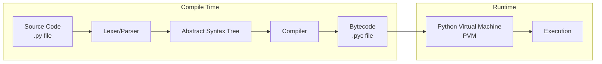
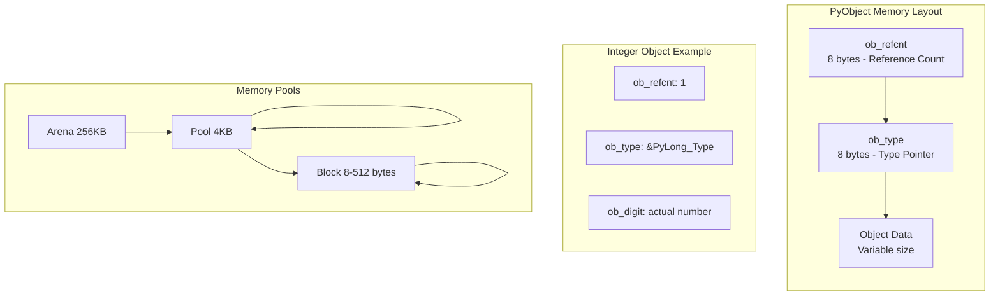
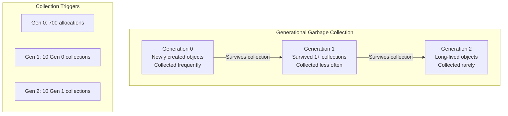
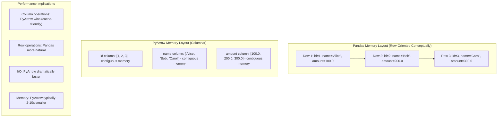
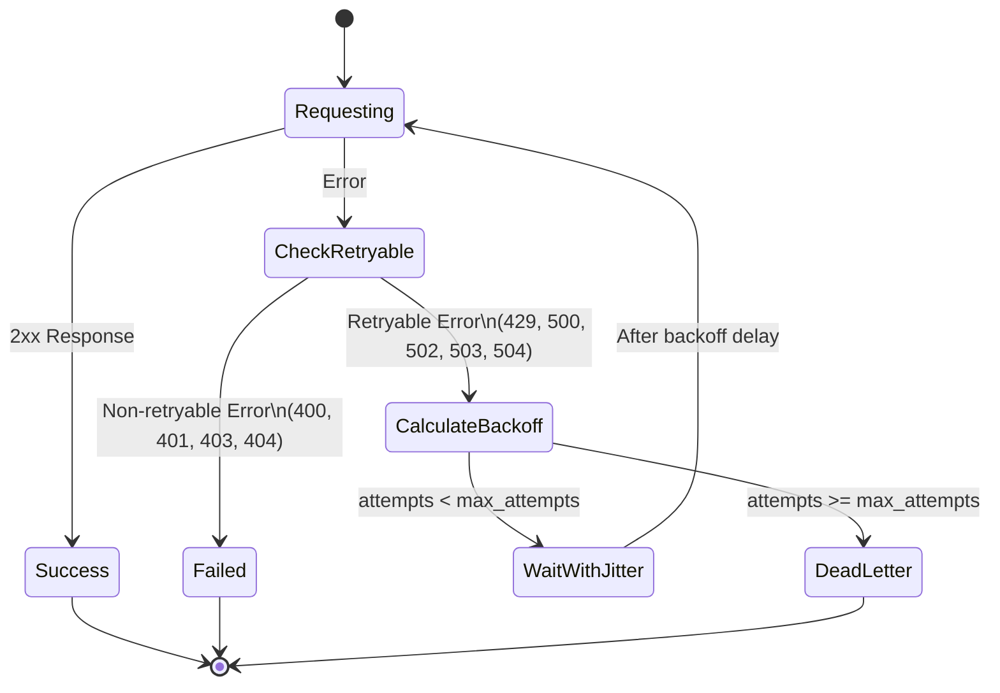
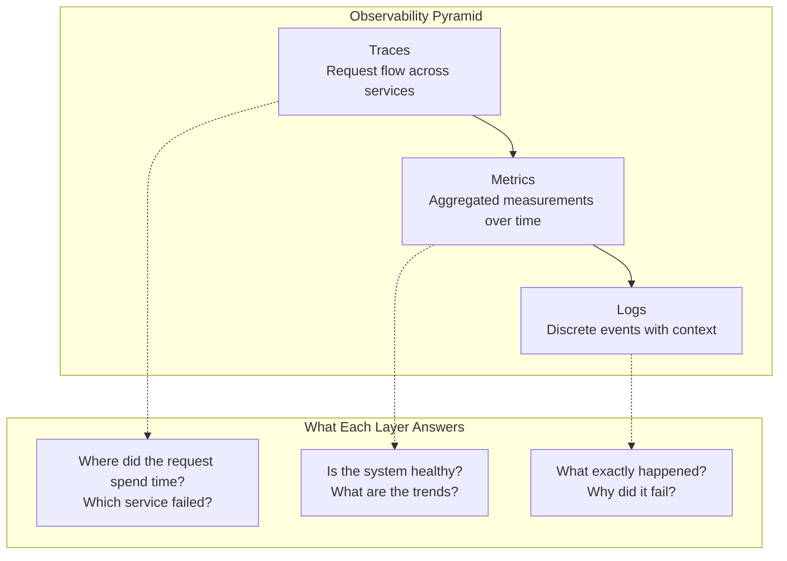
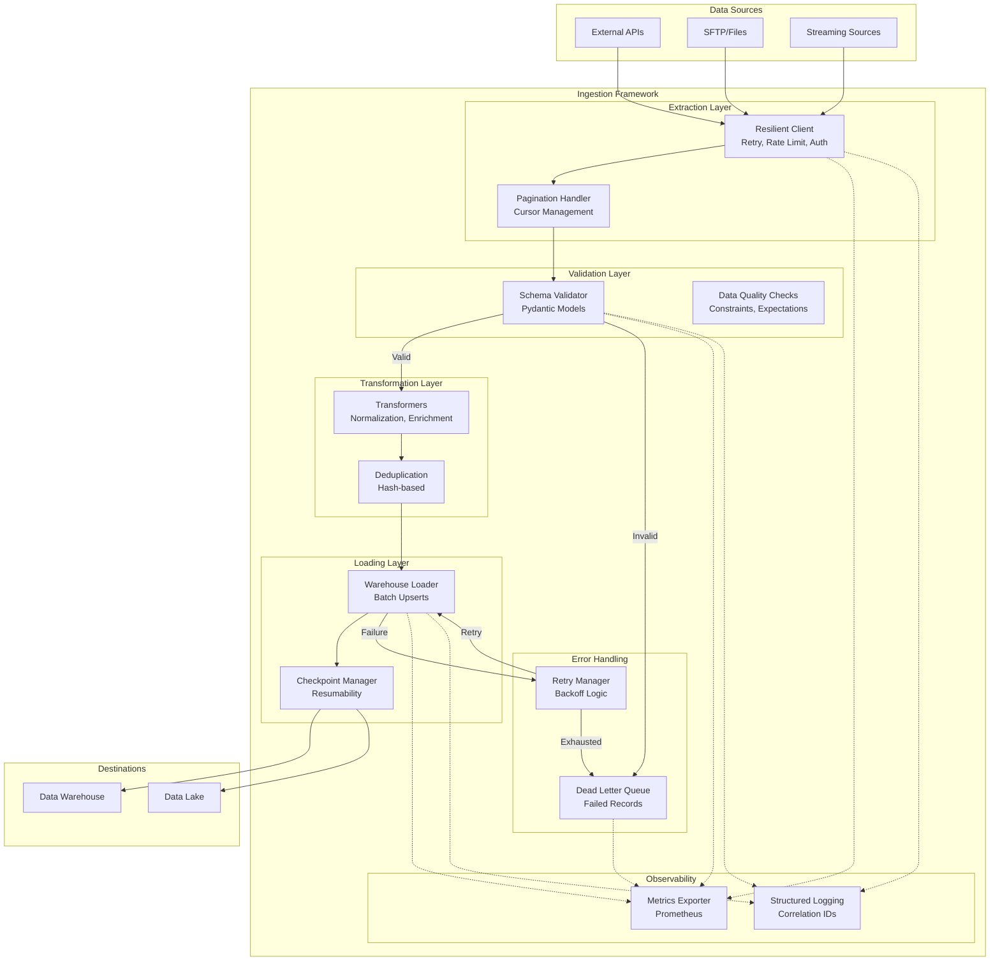
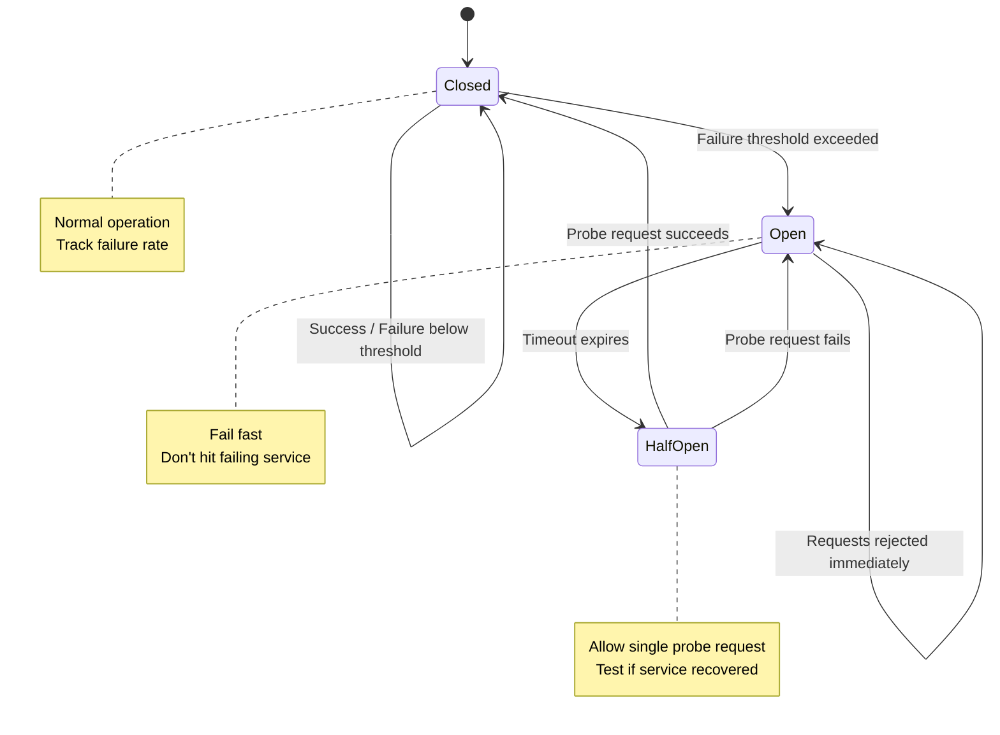

## Executive Summary

There's a moment in every data engineer's career when the script that worked perfectly on your laptop brings down a production server at 3 AM. The CSV that loaded fine yesterday now causes an out-of-memory crash. The API that "never fails" has been silently dropping records for a week. These moments mark the transition from writing code that *can* work to building systems that *must* work.

This guide bridges that gap. We'll journey from Python's internal machinery—understanding *why* your code behaves as it does—through professional practices that prevent entire categories of failures, to architectural patterns that make your pipelines resilient by design rather than by accident.

The mindset shift is fundamental: **you are not writing scripts; you are building infrastructure.** Infrastructure runs unattended. Infrastructure fails gracefully. Infrastructure tells you when something is wrong before customers notice. Infrastructure is maintained, documented, and tested. By the end of this guide, you'll have the knowledge and patterns to build data systems that earn trust through reliability.

---

# Part 1: Foundations — Understanding Python's Machinery

## Chapter 1: CPython Architecture

Before optimizing Python code, you must understand what Python *actually does* with your code. The CPython interpreter (the standard Python implementation) executes your programs through a multi-stage process that has profound implications for performance.



### From Source to Bytecode

Python is not interpreted line-by-line as many believe. Your source code is first compiled to *bytecode*—a lower-level, platform-independent representation that the Python Virtual Machine (PVM) executes. This compilation happens automatically and is cached in `__pycache__` directories.

Understanding bytecode reveals why certain patterns are faster than others:

```python
import dis

def list_comprehension():
    return [x * 2 for x in range(1000)]

def explicit_loop():
    result = []
    for x in range(1000):
        result.append(x * 2)
    return result

# Inspect the bytecode
print("=== List Comprehension Bytecode ===")
dis.dis(list_comprehension)
print("\n=== Explicit Loop Bytecode ===")
dis.dis(explicit_loop)
```

**Output Analysis:**
```
=== List Comprehension Bytecode ===
  2           0 LOAD_CONST               1 (<code object <listcomp>...)
              2 MAKE_FUNCTION            0
              4 LOAD_GLOBAL              0 (range)
              6 LOAD_CONST               2 (1000)
              8 CALL_FUNCTION            1
             10 GET_ITER
             12 CALL_FUNCTION            1
             14 RETURN_VALUE

=== Explicit Loop Bytecode ===
  2           0 BUILD_LIST               0
              2 STORE_FAST               0 (result)
  3           4 LOAD_GLOBAL              0 (range)
              ...
             16 LOAD_FAST                0 (result)
             18 LOAD_METHOD              1 (append)  # Method lookup every iteration!
             20 LOAD_FAST                1 (x)
             ...
```

The list comprehension compiles to a specialized, optimized code object. The explicit loop performs a method lookup (`LOAD_METHOD`) on every iteration—this is why comprehensions are typically 20-30% faster.

### The Python Virtual Machine

The PVM is a *stack-based* virtual machine. Operations push values onto a stack, manipulate them, and pop results. Understanding this explains why local variables are faster than global ones:

```python
# Global lookup: LOAD_GLOBAL (hash table lookup)
MULTIPLIER = 2

def slow_global():
    return [x * MULTIPLIER for x in range(10000)]

# Local lookup: LOAD_FAST (array index)
def fast_local():
    multiplier = 2  # Cached locally
    return [x * multiplier for x in range(10000)]

# Benchmark shows ~15% difference on hot paths
```

**Key Insight:** `LOAD_FAST` uses an array index (O(1) with tiny constant). `LOAD_GLOBAL` uses dictionary lookup (O(1) average but higher constant factor due to hashing).

---

## Chapter 2: Python's Memory Model

Memory issues are the #1 cause of data pipeline failures in production. Understanding Python's memory model transforms you from someone who reacts to OOM errors into someone who prevents them.



### Object Overhead: The Hidden Cost

Every Python object carries overhead. A simple integer isn't 4 bytes—it's 28 bytes:

```python
import sys

# The shocking truth about Python object sizes
print(f"int(1): {sys.getsizeof(1)} bytes")           # 28 bytes
print(f"float(1.0): {sys.getsizeof(1.0)} bytes")     # 24 bytes
print(f"str(''): {sys.getsizeof('')} bytes")         # 49 bytes
print(f"list([]): {sys.getsizeof([])} bytes")        # 56 bytes
print(f"dict({{}}): {sys.getsizeof({})} bytes")       # 64 bytes

# A list of 1 million integers
numbers = list(range(1_000_000))
# Naive expectation: 1M * 4 bytes = 4 MB
# Reality: ~8 MB for list structure + 28 MB for integer objects = ~36 MB
```

This overhead is why a 1GB CSV can explode to 10GB+ when loaded naively into Python objects.

### Reference Counting and Garbage Collection

Python uses *reference counting* as its primary memory management strategy, supplemented by a *cyclic garbage collector* for handling reference cycles:

```python
import gc
import sys

# Reference counting in action
a = [1, 2, 3]
print(f"Refcount: {sys.getrefcount(a)}")  # 2 (a + getrefcount's reference)

b = a  # Another reference
print(f"Refcount: {sys.getrefcount(a)}")  # 3

del b  # Reference removed
print(f"Refcount: {sys.getrefcount(a)}")  # 2

# When refcount hits 0, memory is freed immediately (no GC pause!)

# But cycles require the garbage collector:
class Node:
    def __init__(self):
        self.parent = None
        self.children = []

parent = Node()
child = Node()
parent.children.append(child)
child.parent = parent  # Cycle! Neither can reach refcount 0

del parent
del child
# Memory not freed until GC runs
gc.collect()  # Now freed
```



**Production Implication:** Long-running data pipelines accumulate objects in Generation 2. If you're seeing memory grow unboundedly, objects may be surviving to Generation 2 and rarely getting collected. Use `gc.get_stats()` to diagnose.

---

## Chapter 3: The Global Interpreter Lock (GIL)

The GIL is Python's most misunderstood feature. Think of it as a **single-bathroom apartment with many roommates**—only one person can use the bathroom at a time, no matter how many people live there.

### What the GIL Is

The GIL is a mutex (lock) that protects access to Python objects, preventing multiple native threads from executing Python bytecode simultaneously. Only one thread can execute Python code at any moment, even on a 64-core machine.

```python
import threading
import time

counter = 0

def increment():
    global counter
    for _ in range(1_000_000):
        counter += 1  # Not atomic! Read-modify-write

# Without GIL, this would be a race condition disaster
# With GIL, it's still wrong but for different reasons
threads = [threading.Thread(target=increment) for _ in range(4)]
for t in threads:
    t.start()
for t in threads:
    t.join()

print(f"Expected: 4,000,000, Got: {counter}")  # Often less!
# The GIL doesn't make your code thread-safe—just memory-safe
```

### Why the GIL Exists

1. **Simplifies CPython's implementation:** Reference counting isn't thread-safe. The GIL makes it safe without per-object locks.
2. **Makes C extensions simpler:** Extension authors don't need to worry about thread safety.
3. **Single-threaded performance:** No locking overhead for single-threaded code.

### Implications for Data Workloads

| Workload Type | GIL Impact | Solution |
|---------------|------------|----------|
| CPU-bound (parsing, transforming) | Severe—threads provide no speedup | `multiprocessing`, subprocess, or PyArrow/Polars |
| I/O-bound (API calls, file reads) | Minimal—GIL released during I/O | Threading or asyncio |
| NumPy/Pandas operations | Often none—GIL released in C code | Use vectorized operations |
| Mixed workloads | Variable | Profile first, then choose |

### GIL Workarounds

```python
# BAD: CPU-bound work with threads (no speedup, possibly slower)
from concurrent.futures import ThreadPoolExecutor
import math

def cpu_heavy(n):
    return sum(math.sqrt(i) for i in range(n))

# This won't parallelize!
with ThreadPoolExecutor(max_workers=4) as executor:
    results = list(executor.map(cpu_heavy, [10_000_000] * 4))

# GOOD: CPU-bound work with processes
from concurrent.futures import ProcessPoolExecutor

with ProcessPoolExecutor(max_workers=4) as executor:
    results = list(executor.map(cpu_heavy, [10_000_000] * 4))
# Actually uses 4 cores

# BETTER: Use libraries that release the GIL
import numpy as np

# NumPy releases GIL during computation
arr = np.random.rand(10_000_000)
result = np.sqrt(arr).sum()  # Runs in C, GIL-free
```

---

## Chapter 4: Memory-Efficient Patterns

### The Power of `__slots__`

When you know exactly what attributes an object will have, `__slots__` eliminates the per-instance `__dict__`:

```python
import sys

class RegularRecord:
    def __init__(self, id, name, value):
        self.id = id
        self.name = name
        self.value = value

class SlottedRecord:
    __slots__ = ('id', 'name', 'value')
    
    def __init__(self, id, name, value):
        self.id = id
        self.name = name
        self.value = value

regular = RegularRecord(1, "test", 42.0)
slotted = SlottedRecord(1, "test", 42.0)

print(f"Regular: {sys.getsizeof(regular)} + {sys.getsizeof(regular.__dict__)} bytes")
# Regular: 48 + 104 bytes = 152 bytes
print(f"Slotted: {sys.getsizeof(slotted)} bytes")
# Slotted: 64 bytes

# For 1 million records: 152 MB vs 64 MB
```

### Generators: Processing Without Loading

Generators are the antidote to memory exhaustion. They produce values lazily, one at a time:

```python
from typing import Iterator, Generator
import csv

# BAD: Loads entire file into memory
def load_all_records(filepath: str) -> list[dict]:
    with open(filepath) as f:
        return list(csv.DictReader(f))  # 10GB file = 10GB+ memory

# GOOD: Streams records one at a time
def stream_records(filepath: str) -> Generator[dict, None, None]:
    with open(filepath) as f:
        reader = csv.DictReader(f)
        for row in reader:
            yield row  # Only one row in memory at a time

# Process 10GB file with constant memory
def process_large_file(filepath: str) -> dict:
    total = 0
    count = 0
    for record in stream_records(filepath):
        total += float(record['amount'])
        count += 1
    return {'sum': total, 'count': count}
```

### Generator Expressions vs List Comprehensions

```python
# Memory-hungry: Creates full list in memory
sum([x ** 2 for x in range(10_000_000)])  # ~800 MB

# Memory-efficient: Generates values on demand
sum(x ** 2 for x in range(10_000_000))  # ~0 MB (constant)
```

---

## Chapter 5: Performance Profiling

You cannot optimize what you cannot measure. Here's your profiling toolkit:

### CPU Profiling with cProfile

```python
import cProfile
import pstats
from io import StringIO

def analyze_data():
    # Your code here
    data = [x ** 2 for x in range(100000)]
    return sum(data)

# Profile and analyze
profiler = cProfile.Profile()
profiler.enable()
result = analyze_data()
profiler.disable()

# Format results
stream = StringIO()
stats = pstats.Stats(profiler, stream=stream)
stats.sort_stats('cumulative')
stats.print_stats(10)  # Top 10 functions
print(stream.getvalue())
```

### Memory Profiling

```python
# Install: pip install memory_profiler
from memory_profiler import profile

@profile
def memory_heavy_function():
    # Each line shows memory delta
    a = [1] * (10 ** 6)      # +7.6 MiB
    b = [2] * (2 * 10 ** 7)  # +152.6 MiB
    del b                     # -152.6 MiB
    return a

# Run with: python -m memory_profiler script.py
```

### Production Profiling with py-spy

For profiling running production processes without code changes:

```bash
# Attach to running process
py-spy record -o profile.svg --pid 12345

# Generate flame graph (visual representation of where time is spent)
py-spy top --pid 12345  # Live view like 'top'
```

---

# Part 2: Professional Practices

## Chapter 6: Production-Grade Project Structure

A well-structured project prevents entire categories of bugs and makes onboarding new engineers painless:

```

data-ingestion-framework/
├── pyproject.toml              # Project metadata, dependencies, build config
├── README.md                   # Quick start, architecture overview
├── CHANGELOG.md                # Version history
├── Makefile                    # Common commands (test, lint, build)
├── docker/
│   ├── Dockerfile              # Production image
│   └── Dockerfile.dev          # Development image with tools
├── src/
│   └── ingestion/              # Main package (src layout prevents import confusion)
│       ├── __init__.py
│       ├── py.typed            # Marker for type checkers
│       ├── config/
│       │   ├── __init__.py
│       │   ├── settings.py     # Pydantic settings with validation
│       │   └── logging.py      # Logging configuration
│       ├── clients/
│       │   ├── __init__.py
│       │   ├── base.py         # Abstract base client with retry logic
│       │   ├── http.py         # HTTP client wrapper
│       │   └── api_specific.py # Specific API implementations
│       ├── models/
│       │   ├── __init__.py
│       │   ├── source.py       # Source data models (Pydantic)
│       │   └── canonical.py    # Internal canonical models
│       ├── processors/
│       │   ├── __init__.py
│       │   ├── base.py         # Abstract processor interface
│       │   ├── validators.py   # Schema validation
│       │   └── transformers.py # Data transformation logic
│       ├── loaders/
│       │   ├── __init__.py
│       │   ├── base.py         # Abstract loader interface
│       │   └── warehouse.py    # Data warehouse loader
│       ├── observability/
│       │   ├── __init__.py
│       │   ├── metrics.py      # Prometheus metrics definitions
│       │   ├── logging.py      # Structured logging utilities
│       │   └── tracing.py      # OpenTelemetry setup
│       └── pipelines/
│           ├── __init__.py
│           └── main.py         # Pipeline orchestration
├── tests/
│   ├── conftest.py             # Shared fixtures
│   ├── unit/
│   │   ├── test_validators.py
│   │   └── test_transformers.py
│   ├── integration/
│   │   ├── test_api_client.py
│   │   └── test_warehouse_loader.py
│   └── fixtures/
│       └── sample_responses.json
├── scripts/
│   ├── run_pipeline.py         # CLI entry point
│   └── backfill.py             # Historical data loading
└── docs/
    ├── architecture.md         # System design documentation
    ├── runbooks/               # Operational procedures
    │   ├── incident_response.md
    │   └── common_issues.md
    └── api/                    # Generated API docs
```

### The `pyproject.toml` Foundation

```toml
[project]
name = "data-ingestion-framework"
version = "1.2.0"
description = "Production-grade data ingestion framework"
requires-python = ">=3.10"
dependencies = [
    "pydantic>=2.0,<3.0",
    "httpx>=0.24.0",
    "pyarrow>=14.0.0",
    "pandas>=2.0.0",
    "structlog>=23.1.0",
    "prometheus-client>=0.17.0",
]

[project.optional-dependencies]
dev = [
    "pytest>=7.0.0",
    "pytest-cov>=4.0.0",
    "pytest-asyncio>=0.21.0",
    "hypothesis>=6.0.0",
    "mypy>=1.5.0",
    "ruff>=0.1.0",
    "memory-profiler>=0.61.0",
]

[project.scripts]
ingest = "ingestion.pipelines.main:cli"

[tool.mypy]
python_version = "3.11"
strict = true
warn_return_any = true
warn_unused_ignores = true
plugins = ["pydantic.mypy"]

[tool.pytest.ini_options]
testpaths = ["tests"]
asyncio_mode = "auto"
addopts = "-v --cov=src/ingestion --cov-report=term-missing"

[tool.ruff]
line-length = 100
select = ["E", "F", "I", "N", "W", "UP", "B", "C4", "SIM"]

[build-system]
requires = ["hatchling"]
build-backend = "hatchling.build"
```

---

## Chapter 7: Type Hints and Runtime Validation

Type hints catch bugs before runtime. Pydantic catches them at runtime when external data enters your system.

### Static Type Checking with mypy

```python
# src/ingestion/models/source.py
from datetime import datetime
from typing import Literal, TypeAlias
from pydantic import BaseModel, Field, field_validator

# Type aliases for clarity
RecordId: TypeAlias = str
ISOTimestamp: TypeAlias = str

class SourceRecord(BaseModel):
    """Raw record from upstream API with validation."""
    
    model_config = {"strict": True, "frozen": True}  # Immutable after creation
    
    id: RecordId = Field(..., min_length=1, max_length=64)
    timestamp: datetime
    event_type: Literal["click", "view", "purchase"]
    user_id: str | None = None
    amount: float = Field(default=0.0, ge=0)
    metadata: dict[str, str] = Field(default_factory=dict)
    
    @field_validator('id')
    @classmethod
    def validate_id_format(cls, v: str) -> str:
        if not v.replace('-', '').isalnum():
            raise ValueError('ID must be alphanumeric with optional hyphens')
        return v
    
    @field_validator('timestamp', mode='before')
    @classmethod
    def parse_timestamp(cls, v: str | datetime) -> datetime:
        if isinstance(v, str):
            return datetime.fromisoformat(v.replace('Z', '+00:00'))
        return v


# Usage with automatic validation
def process_api_response(data: dict) -> SourceRecord:
    """Parse and validate API response. Raises ValidationError on bad data."""
    return SourceRecord.model_validate(data)


# Type checker catches this at development time:
# record = SourceRecord(id=123, ...)  # Error: int is not str
```

### Configuration with Pydantic Settings

```python
# src/ingestion/config/settings.py
from functools import lru_cache
from pydantic import Field, SecretStr, field_validator
from pydantic_settings import BaseSettings, SettingsConfigDict


class DatabaseSettings(BaseSettings):
    host: str = "localhost"
    port: int = 5432
    name: str = "ingestion"
    user: str = "app"
    password: SecretStr  # Never logged or serialized
    
    @property
    def connection_string(self) -> str:
        return f"postgresql://{self.user}:{self.password.get_secret_value()}@{self.host}:{self.port}/{self.name}"


class APISettings(BaseSettings):
    base_url: str
    api_key: SecretStr
    timeout_seconds: float = 30.0
    max_retries: int = 3
    retry_base_delay: float = 1.0
    
    @field_validator('base_url')
    @classmethod
    def validate_url(cls, v: str) -> str:
        if not v.startswith(('http://', 'https://')):
            raise ValueError('base_url must be a valid HTTP(S) URL')
        return v.rstrip('/')


class Settings(BaseSettings):
    """Application settings loaded from environment variables."""
    
    model_config = SettingsConfigDict(
        env_file=".env",
        env_nested_delimiter="__",  # Allows DB__HOST=localhost
        case_sensitive=False,
    )
    
    environment: str = Field(default="development", pattern="^(development|staging|production)$")
    debug: bool = False
    log_level: str = "INFO"
    
    db: DatabaseSettings = Field(default_factory=DatabaseSettings)
    api: APISettings
    
    # Feature flags
    enable_metrics: bool = True
    enable_tracing: bool = False
    
    @property
    def is_production(self) -> bool:
        return self.environment == "production"


@lru_cache
def get_settings() -> Settings:
    """Cached settings instance. Call once at startup."""
    return Settings()
```

---

## Chapter 8: Testing Strategies for Data Code

Data code requires special testing approaches because data itself is a source of bugs.

### Fixture-Based Testing

```python
# tests/conftest.py
import pytest
from datetime import datetime, timezone
from pathlib import Path
import json

from ingestion.models.source import SourceRecord
from ingestion.clients.http import HTTPClient


@pytest.fixture
def sample_record() -> SourceRecord:
    """Valid record for happy path tests."""
    return SourceRecord(
        id="rec-12345",
        timestamp=datetime.now(timezone.utc),
        event_type="purchase",
        user_id="user-789",
        amount=99.99,
        metadata={"source": "web"}
    )


@pytest.fixture
def sample_records(sample_record) -> list[SourceRecord]:
    """Multiple records for batch processing tests."""
    return [sample_record] * 100


@pytest.fixture
def malformed_records() -> list[dict]:
    """Invalid records for error handling tests."""
    return [
        {},  # Missing required fields
        {"id": "", "timestamp": "now", "event_type": "invalid"},  # Invalid values
        {"id": "x" * 1000, "timestamp": "2024-01-01", "event_type": "click"},  # Too long
    ]


@pytest.fixture
def api_responses_fixture() -> dict:
    """Load canned API responses from file."""
    fixture_path = Path(__file__).parent / "fixtures" / "sample_responses.json"
    return json.loads(fixture_path.read_text())


# Mock HTTP client for integration tests
@pytest.fixture
def mock_http_client(mocker, api_responses_fixture):
    """HTTP client that returns canned responses."""
    client = mocker.Mock(spec=HTTPClient)
    client.get.return_value = api_responses_fixture["success_response"]
    return client
```

### Testing Failure Modes

```python
# tests/unit/test_validators.py
import pytest
from pydantic import ValidationError
from ingestion.models.source import SourceRecord


class TestSourceRecordValidation:
    """Test validation catches bad data."""
    
    def test_valid_record_parses(self, sample_record):
        """Happy path: valid data creates valid record."""
        assert sample_record.id == "rec-12345"
        assert sample_record.event_type == "purchase"
    
    def test_missing_required_field_raises(self):
        """Missing required fields raise ValidationError."""
        with pytest.raises(ValidationError) as exc_info:
            SourceRecord(
                # Missing 'id' and 'timestamp'
                event_type="click"
            )
        errors = exc_info.value.errors()
        assert len(errors) >= 2
        assert any(e["loc"] == ("id",) for e in errors)
    
    def test_invalid_event_type_raises(self):
        """Invalid enum value raises ValidationError."""
        with pytest.raises(ValidationError) as exc_info:
            SourceRecord(
                id="test",
                timestamp="2024-01-01T00:00:00Z",
                event_type="invalid_type"  # Not in Literal
            )
        assert "event_type" in str(exc_info.value)
    
    def test_negative_amount_raises(self):
        """Negative amounts are rejected."""
        with pytest.raises(ValidationError):
            SourceRecord(
                id="test",
                timestamp="2024-01-01T00:00:00Z",
                event_type="purchase",
                amount=-10.0
            )
    
    @pytest.mark.parametrize("bad_id", [
        "",           # Empty
        " ",          # Whitespace
        "a" * 100,    # Too long
        "has spaces", # Invalid characters (if enforced)
    ])
    def test_invalid_ids_rejected(self, bad_id):
        """Various invalid ID formats are rejected."""
        with pytest.raises(ValidationError):
            SourceRecord(
                id=bad_id,
                timestamp="2024-01-01T00:00:00Z",
                event_type="click"
            )
```

### Property-Based Testing with Hypothesis

Property-based testing generates random inputs to find edge cases you didn't think of:

```python
# tests/unit/test_transformers_hypothesis.py
from hypothesis import given, strategies as st, assume, settings
from datetime import datetime, timezone

from ingestion.processors.transformers import normalize_amount, deduplicate_records


class TestTransformersProperties:
    """Property-based tests for data transformers."""
    
    @given(st.floats(min_value=0, max_value=1e12, allow_nan=False, allow_infinity=False))
    def test_normalize_amount_preserves_value(self, amount: float):
        """Normalization should not change the numeric value significantly."""
        result = normalize_amount(amount)
        assert abs(result - round(amount, 2)) < 0.01
    
    @given(st.lists(
        st.fixed_dictionaries({
            'id': st.text(min_size=1, max_size=10, alphabet='abcdef0123456789'),
            'value': st.integers(min_value=0, max_value=1000)
        }),
        min_size=0,
        max_size=100
    ))
    def test_deduplicate_preserves_unique_ids(self, records: list[dict]):
        """Deduplication should keep exactly one record per unique ID."""
        result = deduplicate_records(records, key='id')
        
        # Property: result has no duplicate IDs
        result_ids = [r['id'] for r in result]
        assert len(result_ids) == len(set(result_ids))
        
        # Property: all original unique IDs are represented
        original_unique_ids = set(r['id'] for r in records)
        assert set(result_ids) == original_unique_ids
    
    @given(st.lists(st.integers(), min_size=1))
    @settings(max_examples=500)  # More thorough testing
    def test_chunked_processing_preserves_all_items(self, items: list[int]):
        """Chunked processing should yield all original items."""
        from ingestion.processors.transformers import process_in_chunks
        
        chunk_size = max(1, len(items) // 3)
        result = list(process_in_chunks(items, chunk_size))
        flattened = [item for chunk in result for item in chunk]
        
        assert flattened == items
```

---

# Part 3: Data Processing Choices

## Chapter 9: Pandas vs. PyArrow — Choosing the Right Tool

This is perhaps the most consequential technical decision in data pipeline design. Understanding the fundamental differences prevents both performance disasters and over-engineering.



### Memory Layout Deep Dive

```python
import pandas as pd
import pyarrow as pa
import pyarrow.parquet as pq
import sys
from memory_profiler import memory_usage

def measure_memory(func):
    """Measure peak memory usage of a function."""
    mem_usage = memory_usage((func,), interval=0.1, max_usage=True)
    return mem_usage

# Create test data: 10 million rows
n_rows = 10_000_000

# === Pandas with default dtypes ===
def create_pandas_default():
    return pd.DataFrame({
        'id': range(n_rows),
        'category': ['A', 'B', 'C', 'D'] * (n_rows // 4),
        'value': [float(i) for i in range(n_rows)],
        'flag': [True, False] * (n_rows // 2)
    })

# === Pandas with optimized dtypes ===
def create_pandas_optimized():
    df = pd.DataFrame({
        'id': pd.array(range(n_rows), dtype='int32'),  # Not int64
        'category': pd.Categorical(['A', 'B', 'C', 'D'] * (n_rows // 4)),
        'value': pd.array([float(i) for i in range(n_rows)], dtype='float32'),
        'flag': pd.array([True, False] * (n_rows // 2), dtype='bool')
    })
    return df

# === PyArrow Table ===
def create_pyarrow():
    return pa.table({
        'id': pa.array(range(n_rows), type=pa.int32()),
        'category': pa.dictionary_encode(
            pa.array(['A', 'B', 'C', 'D'] * (n_rows // 4))
        ),
        'value': pa.array([float(i) for i in range(n_rows)], type=pa.float32()),
        'flag': pa.array([True, False] * (n_rows // 2))
    })

# Memory comparison results (approximate):
# Pandas default:    ~1.2 GB
# Pandas optimized:  ~250 MB
# PyArrow:           ~180 MB
```

### When Pandas Excels

Pandas remains the right choice for:

1. **Exploratory Data Analysis (EDA):** Rich indexing, intuitive row/column access, excellent Jupyter integration
2. **Complex row-wise operations:** When you need to access multiple columns per row
3. **Time series analysis:** Powerful datetime handling, resampling, rolling windows
4. **Small-to-medium datasets (<1GB):** Overhead doesn't matter; developer productivity does
5. **Ecosystem compatibility:** Scikit-learn, statsmodels, and visualization libraries expect DataFrames

```python
# Pandas shines here: complex, stateful row operations
def calculate_running_metrics(df: pd.DataFrame) -> pd.DataFrame:
    """Calculate complex running metrics - awkward in columnar systems."""
    df = df.sort_values('timestamp')
    
    # Rolling calculations with variable windows
    df['rolling_avg'] = df.groupby('user_id')['amount'].transform(
        lambda x: x.rolling(window='7D', min_periods=1).mean()
    )
    
    # Cumulative with reset on condition
    df['cumsum_reset'] = df.groupby(
        (df['event_type'] == 'reset').cumsum()
    )['amount'].cumsum()
    
    # Complex conditional logic
    df['tier'] = pd.cut(
        df['rolling_avg'],
        bins=[0, 100, 500, float('inf')],
        labels=['bronze', 'silver', 'gold']
    )
    
    return df
```

### When PyArrow Excels

PyArrow is superior for:

1. **I/O Performance:** Reading/writing Parquet, especially with predicate pushdown
2. **Memory Efficiency:** 2-10x smaller memory footprint for typical data
3. **Interoperability:** Zero-copy sharing with Spark, DuckDB, Polars, R
4. **Batch Processing:** Columnar operations on large datasets
5. **Streaming:** Chunked reads that never load full files

```python
import pyarrow.parquet as pq
import pyarrow.compute as pc
import pyarrow.dataset as ds

# PyArrow shines here: efficient I/O with predicate pushdown
def efficient_parquet_query(path: str, min_date: str, max_amount: float) -> pa.Table:
    """Read only the data we need, never loading irrelevant rows."""
    
    # Predicate pushdown: filter applied at read time
    # Only matching row groups are read from disk
    dataset = ds.dataset(path, format="parquet")
    
    table = dataset.to_table(
        columns=['id', 'timestamp', 'amount', 'category'],  # Column pruning
        filter=(
            (ds.field('timestamp') >= min_date) &
            (ds.field('amount') <= max_amount)
        )
    )
    
    return table

# Zero-copy conversion when you need Pandas
def arrow_to_pandas_efficient(table: pa.Table) -> pd.DataFrame:
    """Convert to Pandas with zero-copy where possible."""
    return table.to_pandas(
        # Use Arrow-backed extension types (Pandas 2.0+)
        types_mapper=pd.ArrowDtype,
        # Self-destruct Arrow buffers to free memory immediately
        self_destruct=True
    )

# Chunked reading for memory-constrained environments
def process_large_parquet(path: str, chunk_size: int = 100_000):
    """Process arbitrarily large Parquet files in fixed memory."""
    parquet_file = pq.ParquetFile(path)
    
    for batch in parquet_file.iter_batches(batch_size=chunk_size):
        # Each batch is a RecordBatch, not full table
        table = pa.Table.from_batches([batch])
        
        # Process chunk
        result = pc.sum(table.column('amount'))
        yield result.as_py()
```

### Pandas 2.0+: Arrow-Backed DataFrames

Pandas 2.0 introduced Arrow-backed extension types, giving you Pandas' API with Arrow's memory efficiency:

```python
import pandas as pd
import pyarrow as pa

# Read Parquet directly into Arrow-backed DataFrame
df = pd.read_parquet(
    'large_file.parquet',
    dtype_backend='pyarrow'  # Key setting!
)

# Check the dtypes
print(df.dtypes)
# id          int64[pyarrow]
# name        string[pyarrow]      # Not 'object'!
# amount      double[pyarrow]
# timestamp   timestamp[us][pyarrow]

# Benefits:
# 1. Lower memory usage (Arrow's efficient representation)
# 2. Native missing value support (no more NaN vs None confusion)
# 3. String type is actually string, not object
# 4. Zero-copy interop with other Arrow-based tools

# Memory comparison
df_legacy = pd.read_parquet('large_file.parquet')  # NumPy backend
df_arrow = pd.read_parquet('large_file.parquet', dtype_backend='pyarrow')

print(f"Legacy memory: {df_legacy.memory_usage(deep=True).sum() / 1e6:.1f} MB")
print(f"Arrow memory:  {df_arrow.memory_usage(deep=True).sum() / 1e6:.1f} MB")
# Typical result: Arrow is 30-50% smaller
```

### Polars: The Emerging Alternative

Polars deserves mention as it combines the best of both worlds:

```python
import polars as pl

# Polars: Lazy evaluation with Arrow memory
df = (
    pl.scan_parquet('large_file.parquet')  # Lazy: no data loaded yet
    .filter(pl.col('amount') > 100)
    .group_by('category')
    .agg([
        pl.col('amount').sum().alias('total'),
        pl.col('amount').mean().alias('average'),
        pl.count().alias('count')
    ])
    .collect()  # Execute the query plan
)

# Benefits over Pandas:
# 1. Lazy evaluation: optimizer can push down predicates, reorder operations
# 2. Parallel by default: uses all cores without multiprocessing complexity
# 3. No index: simpler mental model
# 4. Stricter type system: catches errors earlier

# Benefit over pure PyArrow:
# 1. Full DataFrame API: groupby, joins, window functions
# 2. More ergonomic than PyArrow compute functions
```

### Decision Framework: Choosing the Right Tool

| Criterion | Choose Pandas | Choose PyArrow | Choose Polars |
|-----------|--------------|----------------|---------------|
| **Data size** | < 1GB | Any size | Any size |
| **Operation type** | Row-wise, complex logic | Columnar, I/O-heavy | Columnar, complex queries |
| **Memory constraints** | Relaxed | Tight | Tight |
| **Existing codebase** | Heavy Pandas usage | Greenfield | Greenfield |
| **Team experience** | Pandas experts | Arrow/Spark background | Willing to learn |
| **Downstream systems** | Scikit-learn, visualization | Spark, DuckDB | Standalone |
| **Performance priority** | Developer productivity | I/O throughput | Query performance |

---

## Chapter 10: Memory Optimization Techniques

### Case Study 1: The 50GB CSV That Crashed Production

**The Problem:**
A daily pipeline ingesting a 50GB CSV file from an SFTP server consistently OOMed on a 64GB machine. The engineering team had already upgraded twice—from 16GB to 32GB to 64GB.

**Root Cause Analysis:**
```python
# The problematic code
import pandas as pd

def ingest_daily_file(path: str):
    df = pd.read_csv(path)  # Attempts to load entire 50GB file
    df = df[df['status'] == 'active']  # Filter happens AFTER full load
    df.to_parquet('output.parquet')
```

A 50GB CSV with mixed types easily expands to 150GB+ in memory due to:
- Object dtype overhead for strings
- Python object wrapping for each cell
- Peak memory = file size + parsed objects + intermediate copies

**The Solution:**
```python
import pyarrow as pa
import pyarrow.csv as pa_csv
import pyarrow.parquet as pq
from pyarrow import compute as pc

def ingest_daily_file_optimized(path: str, output_path: str):
    """Memory-efficient ingestion using PyArrow streaming."""
    
    # Define schema upfront for efficiency
    schema = pa.schema([
        ('id', pa.int64()),
        ('name', pa.string()),
        ('status', pa.string()),
        ('amount', pa.float64()),
        ('created_at', pa.timestamp('us')),
    ])
    
    # Configure chunked reading
    read_options = pa_csv.ReadOptions(
        block_size=64 * 1024 * 1024,  # 64MB chunks
    )
    parse_options = pa_csv.ParseOptions(delimiter=',')
    convert_options = pa_csv.ConvertOptions(column_types=schema)
    
    # Open streaming reader
    reader = pa_csv.open_csv(
        path,
        read_options=read_options,
        parse_options=parse_options,
        convert_options=convert_options,
    )
    
    # Process and write in chunks
    writer = None
    records_processed = 0
    
    try:
        for batch in reader:
            # Filter in Arrow (columnar, efficient)
            mask = pc.equal(batch.column('status'), 'active')
            filtered = batch.filter(mask)
            
            # Initialize writer with schema from first batch
            if writer is None:
                writer = pq.ParquetWriter(output_path, filtered.schema)
            
            writer.write_batch(filtered)
            records_processed += len(filtered)
            
    finally:
        if writer:
            writer.close()
    
    return records_processed

# Memory usage: ~200MB constant, regardless of file size
```

**Measurable Outcome:**
- Peak memory: 150GB → 200MB (750x reduction)
- Processing time: 45 minutes → 8 minutes (streaming + columnar filtering)
- No more OOM incidents
- Enabled running on smaller, cheaper instances

### Categorical Dtypes: Massive Savings for Repeated Values

```python
import pandas as pd
import numpy as np

# Simulating a common scenario: 10 million rows, 100 unique categories
n_rows = 10_000_000
categories = [f'category_{i:03d}' for i in range(100)]

# BAD: Object dtype (default for strings)
df_object = pd.DataFrame({
    'category': np.random.choice(categories, n_rows)
})
print(f"Object dtype:      {df_object.memory_usage(deep=True).sum() / 1e6:.1f} MB")
# ~650 MB - each string stored separately

# GOOD: Categorical dtype
df_categorical = pd.DataFrame({
    'category': pd.Categorical(np.random.choice(categories, n_rows))
})
print(f"Categorical dtype: {df_categorical.memory_usage(deep=True).sum() / 1e6:.1f} MB")
# ~10 MB - integer codes + small dictionary

# When to use Categorical:
# 1. Low cardinality (< 50% unique values)
# 2. Column is used for groupby operations (faster!)
# 3. Column is used for filtering (faster!)

# Automatic optimization function
def optimize_dataframe_memory(df: pd.DataFrame) -> pd.DataFrame:
    """Automatically convert appropriate columns to memory-efficient types."""
    df = df.copy()
    
    for col in df.columns:
        col_type = df[col].dtype
        
        # Convert object columns with low cardinality to categorical
        if col_type == 'object':
            num_unique = df[col].nunique()
            num_total = len(df[col])
            if num_unique / num_total < 0.5:  # Less than 50% unique
                df[col] = df[col].astype('category')
        
        # Downcast integers
        elif col_type in ['int64', 'int32']:
            df[col] = pd.to_numeric(df[col], downcast='integer')
        
        # Downcast floats
        elif col_type in ['float64']:
            df[col] = pd.to_numeric(df[col], downcast='float')
    
    return df
```

### Memory-Mapped Files for Out-of-Core Processing

```python
import numpy as np
import pyarrow as pa
import pyarrow.parquet as pq

def process_with_memory_mapping(parquet_path: str):
    """Process large Parquet files with memory mapping."""
    
    # Memory-mapped read: OS manages paging, not Python
    table = pq.read_table(
        parquet_path,
        memory_map=True,  # Key setting!
    )
    
    # Data is not loaded until accessed
    # OS pages in/out as needed based on access patterns
    
    # Efficient column access - only pages containing this column are loaded
    amounts = table.column('amount')
    total = pc.sum(amounts).as_py()
    
    return total


# For NumPy arrays: memory-mapped array files
def create_memory_mapped_array(data: np.ndarray, path: str):
    """Create a memory-mapped NumPy array file."""
    # Write array to disk
    mmap_array = np.memmap(path, dtype=data.dtype, mode='w+', shape=data.shape)
    mmap_array[:] = data[:]
    mmap_array.flush()
    return mmap_array


def load_memory_mapped_array(path: str, dtype: np.dtype, shape: tuple):
    """Load existing memory-mapped array."""
    return np.memmap(path, dtype=dtype, mode='r', shape=shape)


# Use case: Processing array larger than RAM
def process_large_array_out_of_core():
    """Process a 100GB array on a 16GB machine."""
    # Array lives on disk, accessed via memory mapping
    huge_array = np.memmap(
        'huge_data.npy',
        dtype='float64',
        mode='r',
        shape=(10_000_000_000,)  # 80GB as float64
    )
    
    # Process in chunks - OS handles memory management
    chunk_size = 10_000_000
    total = 0.0
    
    for i in range(0, len(huge_array), chunk_size):
        chunk = huge_array[i:i + chunk_size]
        total += chunk.sum()
        # Chunk automatically paged out when not accessed
    
    return total
```

---

# Part 4: External Integration

## Chapter 11: Resilient API Consumption

APIs are the primary data source for modern pipelines, and they *will* fail. Building resilient API consumption is not optional—it's a core competency.

### Common Pagination Patterns

```python
from abc import ABC, abstractmethod
from dataclasses import dataclass
from typing import Iterator, TypeVar, Generic
import httpx

T = TypeVar('T')


@dataclass
class Page(Generic[T]):
    """A single page of results with metadata."""
    items: list[T]
    has_more: bool
    next_cursor: str | None = None
    total_count: int | None = None


class PaginatedClient(ABC, Generic[T]):
    """Abstract base for paginated API clients."""
    
    @abstractmethod
    def fetch_page(self, cursor: str | None = None) -> Page[T]:
        """Fetch a single page of results."""
        pass
    
    def iter_all(self) -> Iterator[T]:
        """Iterate through all items across all pages."""
        cursor = None
        while True:
            page = self.fetch_page(cursor)
            yield from page.items
            
            if not page.has_more:
                break
            cursor = page.next_cursor


# Offset-based pagination (simple but problematic)
class OffsetPaginatedClient(PaginatedClient[dict]):
    """
    Offset pagination: page=1, page=2 or offset=0, offset=100
    
    Problems:
    - Data can shift between requests (duplicates or gaps)
    - Performance degrades for high offsets (OFFSET 1000000 is slow)
    
    Use when: API doesn't offer alternatives, data changes slowly
    """
    
    def __init__(self, client: httpx.Client, base_url: str, page_size: int = 100):
        self.client = client
        self.base_url = base_url
        self.page_size = page_size
        self._offset = 0
    
    def fetch_page(self, cursor: str | None = None) -> Page[dict]:
        offset = int(cursor) if cursor else 0
        
        response = self.client.get(
            self.base_url,
            params={'offset': offset, 'limit': self.page_size}
        )
        response.raise_for_status()
        data = response.json()
        
        items = data['results']
        has_more = len(items) == self.page_size
        next_cursor = str(offset + self.page_size) if has_more else None
        
        return Page(items=items, has_more=has_more, next_cursor=next_cursor)


# Cursor-based pagination (recommended)
class CursorPaginatedClient(PaginatedClient[dict]):
    """
    Cursor pagination: uses opaque token for next page
    
    Benefits:
    - Stable iteration (no duplicates or gaps)
    - Consistent performance regardless of position
    - Server controls cursor format (can change implementation)
    
    Use when: Available and data consistency matters
    """
    
    def __init__(self, client: httpx.Client, base_url: str, page_size: int = 100):
        self.client = client
        self.base_url = base_url
        self.page_size = page_size
    
    def fetch_page(self, cursor: str | None = None) -> Page[dict]:
        params = {'limit': self.page_size}
        if cursor:
            params['cursor'] = cursor
        
        response = self.client.get(self.base_url, params=params)
        response.raise_for_status()
        data = response.json()
        
        return Page(
            items=data['results'],
            has_more=data.get('has_more', False),
            next_cursor=data.get('next_cursor')
        )


# Keyset pagination (most efficient for sorted data)
class KeysetPaginatedClient(PaginatedClient[dict]):
    """
    Keyset pagination: WHERE id > last_id ORDER BY id LIMIT 100
    
    Benefits:
    - Most efficient for databases (uses indexes)
    - Stable iteration
    - Works with any unique, sortable column
    
    Use when: Paginating large database tables
    """
    
    def __init__(self, client: httpx.Client, base_url: str, page_size: int = 100):
        self.client = client
        self.base_url = base_url
        self.page_size = page_size
    
    def fetch_page(self, cursor: str | None = None) -> Page[dict]:
        params = {'limit': self.page_size}
        if cursor:
            params['after_id'] = cursor
        
        response = self.client.get(self.base_url, params=params)
        response.raise_for_status()
        data = response.json()
        
        items = data['results']
        has_more = len(items) == self.page_size
        next_cursor = items[-1]['id'] if items and has_more else None
        
        return Page(items=items, has_more=has_more, next_cursor=next_cursor)
```

### Retry Logic with Exponential Backoff



```python
import random
import time
from dataclasses import dataclass, field
from typing import Callable, TypeVar
from functools import wraps
import httpx
import structlog

T = TypeVar('T')
logger = structlog.get_logger()


@dataclass
class RetryConfig:
    """Configuration for retry behavior."""
    max_attempts: int = 3
    base_delay: float = 1.0
    max_delay: float = 60.0
    exponential_base: float = 2.0
    jitter_factor: float = 0.5  # 0 = no jitter, 1 = full jitter
    
    # HTTP status codes that should trigger retry
    retryable_status_codes: frozenset[int] = field(
        default_factory=lambda: frozenset({429, 500, 502, 503, 504})
    )
    
    # Exception types that should trigger retry
    retryable_exceptions: tuple = (
        httpx.ConnectTimeout,
        httpx.ReadTimeout,
        httpx.ConnectError,
    )


def calculate_backoff_with_jitter(
    attempt: int,
    config: RetryConfig
) -> float:
    """
    Calculate delay with exponential backoff and jitter.
    
    Jitter prevents thundering herd when multiple clients retry simultaneously.
    Full jitter: delay = random(0, min(cap, base * 2^attempt))
    """
    # Exponential backoff: 1, 2, 4, 8, 16...
    exponential_delay = config.base_delay * (config.exponential_base ** attempt)
    
    # Cap the delay
    capped_delay = min(exponential_delay, config.max_delay)
    
    # Add jitter: random value between (1-jitter_factor)*delay and delay
    jitter_range = capped_delay * config.jitter_factor
    jittered_delay = capped_delay - jitter_range + (random.random() * jitter_range * 2)
    
    return max(0, jittered_delay)


class RetryableHTTPClient:
    """HTTP client with built-in retry logic."""
    
    def __init__(
        self,
        base_url: str,
        retry_config: RetryConfig | None = None,
        timeout: float = 30.0
    ):
        self.base_url = base_url.rstrip('/')
        self.config = retry_config or RetryConfig()
        self.client = httpx.Client(timeout=timeout)
        self.logger = logger.bind(component="http_client", base_url=base_url)
    
    def request(
        self,
        method: str,
        path: str,
        **kwargs
    ) -> httpx.Response:
        """Make an HTTP request with automatic retry."""
        url = f"{self.base_url}/{path.lstrip('/')}"
        
        last_exception: Exception | None = None
        
        for attempt in range(self.config.max_attempts):
            try:
                response = self.client.request(method, url, **kwargs)
                
                # Check for retryable status codes
                if response.status_code in self.config.retryable_status_codes:
                    self._handle_retryable_response(response, attempt)
                    continue
                
                # Success or non-retryable error
                response.raise_for_status()
                return response
                
            except self.config.retryable_exceptions as e:
                last_exception = e
                self._handle_retryable_exception(e, attempt)
                continue
            
            except httpx.HTTPStatusError as e:
                # Non-retryable HTTP error (4xx except 429)
                self.logger.error(
                    "non_retryable_http_error",
                    status_code=e.response.status_code,
                    url=url
                )
                raise
        
        # All retries exhausted
        self.logger.error(
            "all_retries_exhausted",
            url=url,
            attempts=self.config.max_attempts
        )
        raise RetryExhaustedError(
            f"Failed after {self.config.max_attempts} attempts",
            last_exception=last_exception
        )
    
    def _handle_retryable_response(self, response: httpx.Response, attempt: int):
        """Handle a retryable HTTP response."""
        delay = self._get_retry_delay(response, attempt)
        
        self.logger.warning(
            "retryable_response",
            status_code=response.status_code,
            attempt=attempt + 1,
            max_attempts=self.config.max_attempts,
            delay_seconds=delay
        )
        
        time.sleep(delay)
    
    def _handle_retryable_exception(self, exception: Exception, attempt: int):
        """Handle a retryable exception."""
        delay = calculate_backoff_with_jitter(attempt, self.config)
        
        self.logger.warning(
            "retryable_exception",
            exception_type=type(exception).__name__,
            exception_message=str(exception),
            attempt=attempt + 1,
            max_attempts=self.config.max_attempts,
            delay_seconds=delay
        )
        
        time.sleep(delay)
    
    def _get_retry_delay(self, response: httpx.Response, attempt: int) -> float:
        """Get retry delay, respecting Retry-After header if present."""
        # Check for Retry-After header (rate limiting)
        if 'Retry-After' in response.headers:
            try:
                return float(response.headers['Retry-After'])
            except ValueError:
                pass  # Header might be a date, fall back to backoff
        
        return calculate_backoff_with_jitter(attempt, self.config)
    
    def get(self, path: str, **kwargs) -> httpx.Response:
        return self.request('GET', path, **kwargs)
    
    def post(self, path: str, **kwargs) -> httpx.Response:
        return self.request('POST', path, **kwargs)


class RetryExhaustedError(Exception):
    """Raised when all retry attempts are exhausted."""
    def __init__(self, message: str, last_exception: Exception | None = None):
        super().__init__(message)
        self.last_exception = last_exception
```

### Reference: HTTP Status Codes and Retry Behavior

| Status Code | Meaning | Retry? | Notes |
|-------------|---------|--------|-------|
| 200-299 | Success | No | Request succeeded |
| 400 | Bad Request | No | Fix the request |
| 401 | Unauthorized | No | Check credentials |
| 403 | Forbidden | No | Permission issue |
| 404 | Not Found | No | Resource doesn't exist |
| 408 | Request Timeout | Yes | Client was too slow |
| 429 | Too Many Requests | Yes | Respect Retry-After header |
| 500 | Internal Server Error | Yes | Server issue, may be transient |
| 502 | Bad Gateway | Yes | Proxy/load balancer issue |
| 503 | Service Unavailable | Yes | Server overloaded/maintenance |
| 504 | Gateway Timeout | Yes | Upstream timeout |

### Retry Strategy Parameters by Use Case

| Use Case | Max Attempts | Base Delay | Max Delay | Jitter |
|----------|--------------|------------|-----------|--------|
| Idempotent API (GET) | 5 | 1s | 60s | 0.5 |
| Non-idempotent API (POST) | 3 | 2s | 30s | 0.3 |
| Database write | 3 | 0.5s | 10s | 0.5 |
| File upload (S3) | 5 | 1s | 120s | 0.5 |
| Webhook delivery | 5 | 60s | 3600s | 0.3 |

---

### Case Study 2: Data Duplication from Non-Idempotent Retries


**The Problem:**
A payment reconciliation pipeline was retrying failed API calls, but duplicate records appeared in the database. Finance reported that some transactions were counted twice, causing $47,000 in reconciliation discrepancies over a month.

**Root Cause Analysis:**

```python
# The problematic code
def fetch_and_store_transactions(date: str):
    """Fetch transactions and store them. BUGGY VERSION."""
    page = 1
    while True:
        try:
            response = api_client.get(f'/transactions?date={date}&page={page}')
            transactions = response.json()['data']
            
            if not transactions:
                break
            
            # Insert without checking for duplicates!
            for txn in transactions:
                db.execute(
                    "INSERT INTO transactions VALUES (%s, %s, %s)",
                    (txn['id'], txn['amount'], txn['timestamp'])
                )
            
            page += 1
            
        except Exception:
            # Retry the same page... but some records already inserted!
            time.sleep(5)
            continue
```

The bug: When fetching page 5 succeeded but the database insert failed mid-batch, the retry would re-fetch page 5 and attempt to insert all records again—including those already inserted.

**The Solution:**

```python
from dataclasses import dataclass
from datetime import datetime
import hashlib
import json
import structlog

logger = structlog.get_logger()


@dataclass
class Checkpoint:
    """Tracks ingestion progress for resumability."""
    source: str
    last_cursor: str | None
    last_record_id: str | None
    records_processed: int
    updated_at: datetime


class IdempotentIngestionPipeline:
    """Pipeline with checkpoint-based idempotency."""
    
    def __init__(self, db, api_client, source_name: str):
        self.db = db
        self.api_client = api_client
        self.source_name = source_name
        self.logger = logger.bind(source=source_name)
    
    def get_checkpoint(self) -> Checkpoint | None:
        """Retrieve last checkpoint for this source."""
        row = self.db.fetch_one(
            "SELECT * FROM ingestion_checkpoints WHERE source = %s",
            (self.source_name,)
        )
        if row:
            return Checkpoint(**row)
        return None
    
    def save_checkpoint(self, checkpoint: Checkpoint):
        """Save checkpoint atomically."""
        self.db.execute("""
            INSERT INTO ingestion_checkpoints 
                (source, last_cursor, last_record_id, records_processed, updated_at)
            VALUES (%s, %s, %s, %s, %s)
            ON CONFLICT (source) DO UPDATE SET
                last_cursor = EXCLUDED.last_cursor,
                last_record_id = EXCLUDED.last_record_id,
                records_processed = EXCLUDED.records_processed,
                updated_at = EXCLUDED.updated_at
        """, (
            checkpoint.source,
            checkpoint.last_cursor,
            checkpoint.last_record_id,
            checkpoint.records_processed,
            checkpoint.updated_at
        ))
    
    def compute_record_hash(self, record: dict) -> str:
        """Compute deterministic hash for deduplication."""
        # Use only immutable fields for the hash
        canonical = json.dumps({
            'id': record['id'],
            'amount': record['amount'],
            'timestamp': record['timestamp']
        }, sort_keys=True)
        return hashlib.sha256(canonical.encode()).hexdigest()
    
    def record_exists(self, record_hash: str) -> bool:
        """Check if record was already processed."""
        result = self.db.fetch_one(
            "SELECT 1 FROM transactions WHERE record_hash = %s",
            (record_hash,)
        )
        return result is not None
    
    def ingest_transactions(self, date: str):
        """Idempotent transaction ingestion with checkpointing."""
        
        # Resume from checkpoint if exists
        checkpoint = self.get_checkpoint()
        cursor = checkpoint.last_cursor if checkpoint else None
        total_processed = checkpoint.records_processed if checkpoint else 0
        
        self.logger.info(
            "starting_ingestion",
            date=date,
            resuming_from=cursor,
            previously_processed=total_processed
        )
        
        while True:
            # Fetch page
            params = {'date': date}
            if cursor:
                params['cursor'] = cursor
            
            response = self.api_client.get('/transactions', params=params)
            data = response.json()
            transactions = data['data']
            
            if not transactions:
                break
            
            # Process each record with deduplication
            batch_processed = 0
            for txn in transactions:
                record_hash = self.compute_record_hash(txn)
                
                if self.record_exists(record_hash):
                    self.logger.debug("skipping_duplicate", record_id=txn['id'])
                    continue
                
                # Insert with hash for future deduplication
                self.db.execute("""
                    INSERT INTO transactions (id, amount, timestamp, record_hash)
                    VALUES (%s, %s, %s, %s)
                    ON CONFLICT (record_hash) DO NOTHING
                """, (txn['id'], txn['amount'], txn['timestamp'], record_hash))
                
                batch_processed += 1
            
            total_processed += batch_processed
            
            # Save checkpoint after each successful page
            cursor = data.get('next_cursor')
            checkpoint = Checkpoint(
                source=self.source_name,
                last_cursor=cursor,
                last_record_id=transactions[-1]['id'],
                records_processed=total_processed,
                updated_at=datetime.utcnow()
            )
            self.save_checkpoint(checkpoint)
            
            self.logger.info(
                "page_processed",
                records_in_page=len(transactions),
                new_records=batch_processed,
                total_processed=total_processed
            )
            
            if not cursor:
                break
        
        self.logger.info(
            "ingestion_complete",
            total_processed=total_processed
        )
```

**Measurable Outcome:**
- Duplicate records: 1,247 → 0
- Reconciliation discrepancies: $47,000 → $0
- Pipeline can now be safely restarted at any point
- Added visibility into ingestion progress via checkpoints

---

# Part 5: Operational Maturity

## Chapter 12: Logging & Observability

The difference between debugging a production issue for 10 minutes versus 10 hours often comes down to observability.



### Structured Logging Done Right

```python
# src/ingestion/observability/logging.py
import sys
import uuid
from contextvars import ContextVar
from typing import Any
import structlog
from structlog.types import Processor

# Context variable for request/pipeline correlation
correlation_id_var: ContextVar[str] = ContextVar('correlation_id', default='')


def get_correlation_id() -> str:
    """Get current correlation ID or generate new one."""
    cid = correlation_id_var.get()
    if not cid:
        cid = str(uuid.uuid4())[:8]
        correlation_id_var.set(cid)
    return cid


def set_correlation_id(cid: str) -> None:
    """Set correlation ID for current context."""
    correlation_id_var.set(cid)


def add_correlation_id(
    logger: structlog.types.WrappedLogger,
    method_name: str,
    event_dict: dict[str, Any]
) -> dict[str, Any]:
    """Processor that adds correlation ID to all log entries."""
    event_dict['correlation_id'] = get_correlation_id()
    return event_dict


def add_service_context(
    logger: structlog.types.WrappedLogger,
    method_name: str,
    event_dict: dict[str, Any]
) -> dict[str, Any]:
    """Processor that adds service-level context."""
    event_dict['service'] = 'data-ingestion'
    event_dict['version'] = '1.2.0'  # From config in production
    return event_dict


def configure_logging(
    log_level: str = "INFO",
    json_format: bool = True,
    environment: str = "development"
) -> None:
    """Configure structured logging for the application."""
    
    # Shared processors for all environments
    shared_processors: list[Processor] = [
        structlog.contextvars.merge_contextvars,
        structlog.stdlib.add_log_level,
        structlog.stdlib.add_logger_name,
        structlog.processors.TimeStamper(fmt="iso"),
        structlog.processors.StackInfoRenderer(),
        add_correlation_id,
        add_service_context,
    ]
    
    if json_format:
        # Production: JSON for log aggregation (ELK, Datadog, etc.)
        processors = shared_processors + [
            structlog.processors.format_exc_info,
            structlog.processors.JSONRenderer()
        ]
    else:
        # Development: Human-readable console output
        processors = shared_processors + [
            structlog.dev.ConsoleRenderer(colors=True)
        ]
    
    structlog.configure(
        processors=processors,
        wrapper_class=structlog.make_filtering_bound_logger(
            getattr(structlog, log_level.upper(), structlog.INFO)
        ),
        context_class=dict,
        logger_factory=structlog.PrintLoggerFactory(),
        cache_logger_on_first_use=True,
    )


# Usage example
logger = structlog.get_logger()

def process_record(record: dict) -> None:
    """Example function with good logging practices."""
    log = logger.bind(record_id=record['id'])  # Add context for all logs in this function
    
    log.debug("processing_started", record_type=record.get('type'))
    
    try:
        # Processing logic...
        result = transform_record(record)
        log.info(
            "record_processed",
            output_size=len(result),
            duration_ms=42.5  # Would be measured
        )
    except ValidationError as e:
        log.warning(
            "validation_failed",
            error_type=type(e).__name__,
            error_fields=e.errors(),  # Structured error details
        )
        raise
    except Exception as e:
        log.error(
            "processing_failed",
            error_type=type(e).__name__,
            error_message=str(e),
            exc_info=True  # Includes full traceback
        )
        raise
```

### Log Levels: When to Use Each

| Level | Use Case | Data Engineering Examples |
|-------|----------|--------------------------|
| DEBUG | Detailed diagnostic info | Record contents, SQL queries, API payloads |
| INFO | Normal operation milestones | Pipeline started, batch completed, checkpoint saved |
| WARNING | Recoverable issues | Retry triggered, fallback used, deprecated API called |
| ERROR | Failures requiring attention | Record validation failed, API error after retries |
| CRITICAL | System-level failures | Database connection lost, out of memory, data corruption |

### Common Logging Mistakes

```python
# BAD: Logging sensitive data
logger.info("API call", headers=request.headers)  # May contain auth tokens!
logger.debug("User data", user=user_dict)  # May contain PII!

# GOOD: Redact sensitive fields
def redact_sensitive(data: dict, sensitive_keys: set[str]) -> dict:
    """Redact sensitive fields from dictionary."""
    return {
        k: "[REDACTED]" if k.lower() in sensitive_keys else v
        for k, v in data.items()
    }

SENSITIVE_KEYS = {'password', 'api_key', 'token', 'secret', 'authorization', 'ssn', 'email'}
logger.info("API call", headers=redact_sensitive(request.headers, SENSITIVE_KEYS))


# BAD: Wrong log level for the situation
logger.error("Starting pipeline")  # Not an error!
logger.debug("Payment processing failed")  # Should be error!

# BAD: Logging in hot loops
for record in million_records:
    logger.info("Processing record", id=record['id'])  # 1 million log lines!

# GOOD: Log aggregates, not individual items
processed = 0
for record in million_records:
    process(record)
    processed += 1
    if processed % 10000 == 0:
        logger.info("processing_progress", processed=processed, total=1_000_000)
logger.info("processing_complete", total_processed=processed)


# BAD: Swallowing exceptions silently
try:
    risky_operation()
except Exception:
    pass  # Silent failure - debugging nightmare!

# ALSO BAD: Logging but still swallowing
try:
    risky_operation()
except Exception as e:
    logger.error("Something went wrong", error=str(e))
    # No re-raise - error is hidden from callers!

# GOOD: Log AND propagate (or handle appropriately)
try:
    risky_operation()
except SpecificError as e:
    logger.warning("Retrying after specific error", error=str(e))
    # Handle specifically...
except Exception as e:
    logger.error("Unexpected error", exc_info=True)
    raise  # Let caller handle it
```

### Metrics Instrumentation

```python
# src/ingestion/observability/metrics.py
from prometheus_client import Counter, Histogram, Gauge, Info
from prometheus_client import start_http_server, REGISTRY
from functools import wraps
import time
from typing import Callable, TypeVar
from contextlib import contextmanager

T = TypeVar('T')

# === Metric Definitions ===

# Counters: Things that only go up
RECORDS_PROCESSED = Counter(
    'ingestion_records_processed_total',
    'Total records processed',
    ['source', 'status']  # Labels for slicing
)

API_REQUESTS = Counter(
    'ingestion_api_requests_total',
    'Total API requests made',
    ['endpoint', 'method', 'status_code']
)

ERRORS = Counter(
    'ingestion_errors_total',
    'Total errors encountered',
    ['error_type', 'component']
)

# Histograms: Distribution of values
PROCESSING_DURATION = Histogram(
    'ingestion_processing_duration_seconds',
    'Time spent processing records',
    ['source'],
    buckets=[.01, .05, .1, .25, .5, 1, 2.5, 5, 10, 30, 60]  # Buckets in seconds
)

BATCH_SIZE = Histogram(
    'ingestion_batch_size',
    'Number of records per batch',
    ['source'],
    buckets=[10, 50, 100, 500, 1000, 5000, 10000]
)

API_LATENCY = Histogram(
    'ingestion_api_latency_seconds',
    'API request latency',
    ['endpoint'],
    buckets=[.05, .1, .25, .5, 1, 2.5, 5, 10, 30]
)

# Gauges: Values that can go up or down
RECORDS_IN_QUEUE = Gauge(
    'ingestion_queue_depth',
    'Current number of records waiting to be processed',
    ['source']
)

LAST_SUCCESSFUL_RUN = Gauge(
    'ingestion_last_successful_run_timestamp',
    'Timestamp of last successful pipeline run',
    ['source']
)

CHECKPOINT_LAG = Gauge(
    'ingestion_checkpoint_lag_seconds',
    'Seconds since last checkpoint update',
    ['source']
)

# Info: Static metadata (rarely changes)
BUILD_INFO = Info(
    'ingestion_build',
    'Build information'
)


# === Instrumentation Helpers ===

@contextmanager
def track_duration(histogram: Histogram, labels: dict[str, str]):
    """Context manager to track operation duration."""
    start = time.perf_counter()
    try:
        yield
    finally:
        duration = time.perf_counter() - start
        histogram.labels(**labels).observe(duration)


def timed(histogram: Histogram, label_func: Callable[..., dict[str, str]] | None = None):
    """Decorator to track function duration."""
    def decorator(func: Callable[..., T]) -> Callable[..., T]:
        @wraps(func)
        def wrapper(*args, **kwargs) -> T:
            labels = label_func(*args, **kwargs) if label_func else {}
            with track_duration(histogram, labels):
                return func(*args, **kwargs)
        return wrapper
    return decorator


def counted(counter: Counter, label_func: Callable[..., dict[str, str]] | None = None):
    """Decorator to count function calls."""
    def decorator(func: Callable[..., T]) -> Callable[..., T]:
        @wraps(func)
        def wrapper(*args, **kwargs) -> T:
            labels = label_func(*args, **kwargs) if label_func else {}
            try:
                result = func(*args, **kwargs)
                counter.labels(**labels, status='success').inc()
                return result
            except Exception:
                counter.labels(**labels, status='error').inc()
                raise
        return wrapper
    return decorator


# === Usage Examples ===

class InstrumentedPipeline:
    """Pipeline with comprehensive metrics."""
    
    def __init__(self, source_name: str):
        self.source = source_name
        BUILD_INFO.info({
            'version': '1.2.0',
            'python_version': '3.11',
            'commit_sha': 'abc123'
        })
    
    def process_batch(self, records: list[dict]) -> int:
        """Process a batch of records with full instrumentation."""
        
        # Track batch size distribution
        BATCH_SIZE.labels(source=self.source).observe(len(records))
        
        processed = 0
        with track_duration(PROCESSING_DURATION, {'source': self.source}):
            for record in records:
                try:
                    self._process_single(record)
                    RECORDS_PROCESSED.labels(
                        source=self.source,
                        status='success'
                    ).inc()
                    processed += 1
                except ValidationError as e:
                    RECORDS_PROCESSED.labels(
                        source=self.source,
                        status='validation_error'
                    ).inc()
                    ERRORS.labels(
                        error_type='validation',
                        component='processor'
                    ).inc()
                except Exception as e:
                    RECORDS_PROCESSED.labels(
                        source=self.source,
                        status='error'
                    ).inc()
                    ERRORS.labels(
                        error_type=type(e).__name__,
                        component='processor'
                    ).inc()
                    raise
        
        # Update last successful run timestamp
        LAST_SUCCESSFUL_RUN.labels(source=self.source).set_to_current_time()
        
        return processed
    
    @timed(API_LATENCY, lambda self, endpoint: {'endpoint': endpoint})
    def fetch_from_api(self, endpoint: str) -> dict:
        """Fetch data from API with latency tracking."""
        response = self.client.get(endpoint)
        API_REQUESTS.labels(
            endpoint=endpoint,
            method='GET',
            status_code=response.status_code
        ).inc()
        return response.json()


def start_metrics_server(port: int = 8000):
    """Start Prometheus metrics endpoint."""
    start_http_server(port)
    print(f"Metrics available at http://localhost:{port}/metrics")
```

### Case Study 3: The Quiet Failure

**The Problem:**
A critical data pipeline had been silently failing for 6 days before anyone noticed. The pipeline ran daily, appeared to complete successfully (exit code 0), but was writing empty files due to an upstream API change.

**Root Cause Analysis:**

```python
# The problematic code
def ingest_daily_data():
    try:
        response = api.get('/data')
        data = response.json()
        
        # New API format: {'results': [...]} instead of [...]
        # This silently became empty list!
        records = data if isinstance(data, list) else []
        
        save_to_parquet(records)  # Saved empty file
        print("Pipeline completed")  # Looked successful!
        
    except Exception as e:
        print(f"Error: {e}")  # No alerting, no metrics
```

**The Solution:**

```python
import structlog
from prometheus_client import Counter, Gauge
from datetime import datetime, timedelta

logger = structlog.get_logger()

RECORDS_INGESTED = Counter('records_ingested_total', 'Total records ingested', ['source'])
EMPTY_RUNS = Counter('empty_pipeline_runs_total', 'Pipeline runs with zero records', ['source'])
LAST_RECORD_TIMESTAMP = Gauge('last_record_timestamp', 'Timestamp of most recent record', ['source'])
DATA_FRESHNESS_SECONDS = Gauge('data_freshness_seconds', 'Age of most recent data', ['source'])


class ObservableIngestionPipeline:
    """Pipeline with comprehensive observability."""
    
    def __init__(self, source: str, min_expected_records: int = 100):
        self.source = source
        self.min_expected_records = min_expected_records
        self.logger = logger.bind(source=source)
    
    def ingest_daily_data(self) -> int:
        """Ingest data with validation and observability."""
        
        self.logger.info("pipeline_started")
        
        try:
            response = self.api.get('/data')
            response.raise_for_status()
            data = response.json()
            
            # Explicit schema validation
            if not isinstance(data, dict) or 'results' not in data:
                self.logger.error(
                    "unexpected_response_schema",
                    received_type=type(data).__name__,
                    received_keys=list(data.keys()) if isinstance(data, dict) else None
                )
                raise SchemaValidationError(
                    f"Expected dict with 'results', got {type(data).__name__}"
                )
            
            records = data['results']
            record_count = len(records)
            
            # Record metrics
            RECORDS_INGESTED.labels(source=self.source).inc(record_count)
            
            # Validate we got expected amount of data
            if record_count == 0:
                EMPTY_RUNS.labels(source=self.source).inc()
                self.logger.warning(
                    "zero_records_received",
                    expected_minimum=self.min_expected_records
                )
                # This will trigger an alert!
            
            elif record_count < self.min_expected_records:
                self.logger.warning(
                    "below_expected_records",
                    received=record_count,
                    expected_minimum=self.min_expected_records
                )
            
            # Track data freshness
            if records:
                latest_timestamp = max(r['timestamp'] for r in records)
                LAST_RECORD_TIMESTAMP.labels(source=self.source).set(
                    datetime.fromisoformat(latest_timestamp).timestamp()
                )
                
                freshness = datetime.utcnow() - datetime.fromisoformat(latest_timestamp)
                DATA_FRESHNESS_SECONDS.labels(source=self.source).set(
                    freshness.total_seconds()
                )
                
                # Alert if data is stale
                if freshness > timedelta(hours=25):
                    self.logger.error(
                        "stale_data_detected",
                        latest_record=latest_timestamp,
                        age_hours=freshness.total_seconds() / 3600
                    )
            
            # Save data
            self.save_to_parquet(records)
            
            self.logger.info(
                "pipeline_completed",
                record_count=record_count,
                status="success"
            )
            
            return record_count
            
        except SchemaValidationError:
            raise  # Already logged
            
        except Exception as e:
            self.logger.error(
                "pipeline_failed",
                error_type=type(e).__name__,
                error_message=str(e),
                exc_info=True
            )
            raise
```

**Measurable Outcome:**
- Time to detect failure: 6 days → 15 minutes
- Added three alert conditions: zero records, below threshold, stale data
- Schema validation catches API changes immediately
- Dashboards show record counts over time, making anomalies visible

---

### Case Study 4: Alert Fatigue Obscuring Real Issues

**The Problem:**
The team received 200+ alerts per day from data pipelines. When a genuine schema drift issue occurred in a critical payment pipeline, the alert was buried in noise and went unnoticed for 4 hours.

**Root Cause Analysis:**
- Every retry triggered an alert (normal behavior treated as exceptional)
- Informational logs sent to alerting channel
- No alert prioritization or deduplication
- Thresholds set too sensitively during initial setup

**The Solution:**

```python
from dataclasses import dataclass
from enum import Enum
from typing import Callable
import structlog

logger = structlog.get_logger()


class AlertSeverity(Enum):
    """Alert severity levels with clear SLAs."""
    CRITICAL = "critical"   # Page on-call immediately, 15 min response
    HIGH = "high"           # Slack alert, 1 hour response
    MEDIUM = "medium"       # Daily review, next business day
    LOW = "low"             # Weekly review


@dataclass
class AlertDefinition:
    """Definition of an alertable condition."""
    name: str
    severity: AlertSeverity
    condition: Callable[[], bool]
    message_template: str
    runbook_url: str
    dedupe_window_minutes: int = 60  # Don't re-alert within this window


class AlertingPhilosophy:
    """
    Alert Design Principles:
    
    1. CRITICAL: Customer impact or data loss imminent
       - Pipeline down for > 30 minutes
       - Data corruption detected
       - Complete API failure after all retries
    
    2. HIGH: Significant issue requiring prompt attention
       - Pipeline SLA at risk
       - Elevated error rate (> 5%)
       - Schema validation failures
    
    3. MEDIUM: Degraded but functioning
       - Higher than normal latency
       - Approaching resource limits
       - Deprecated API version in use
    
    4. LOW: Informational, batch review
       - Minor configuration drift
       - Unusual but not problematic patterns
    
    Questions before adding an alert:
    - What action should the responder take?
    - Is this actionable at 3 AM? (If not, not CRITICAL)
    - Can this be aggregated/batched?
    - Is there a runbook?
    """
    pass


ALERT_DEFINITIONS = [
    AlertDefinition(
        name="pipeline_complete_failure",
        severity=AlertSeverity.CRITICAL,
        condition=lambda metrics: metrics['consecutive_failures'] >= 3,
        message_template="Pipeline {source} has failed {failures} consecutive times",
        runbook_url="https://wiki/runbooks/pipeline-failure",
        dedupe_window_minutes=30
    ),
    AlertDefinition(
        name="schema_validation_failure",
        severity=AlertSeverity.HIGH,  # Not critical - we can recover
        condition=lambda metrics: metrics['schema_errors_last_hour'] > 0,
        message_template="Schema validation errors detected in {source}: {error_details}",
        runbook_url="https://wiki/runbooks/schema-drift",
        dedupe_window_minutes=60
    ),
    AlertDefinition(
        name="elevated_error_rate",
        severity=AlertSeverity.HIGH,
        condition=lambda metrics: metrics['error_rate_percent'] > 5,
        message_template="Error rate {error_rate}% exceeds 5% threshold",
        runbook_url="https://wiki/runbooks/elevated-errors",
        dedupe_window_minutes=30
    ),
    AlertDefinition(
        name="high_latency",
        severity=AlertSeverity.MEDIUM,
        condition=lambda metrics: metrics['p99_latency_seconds'] > 30,
        message_template="P99 latency {latency}s exceeds 30s threshold",
        runbook_url="https://wiki/runbooks/latency-issues",
        dedupe_window_minutes=120
    ),
    # Retries are NOT alerts! They're expected behavior.
    # Only alert on retry exhaustion (which is captured by complete_failure)
]


# What NOT to alert on:
# - Individual retries (expected behavior)
# - Single record validation failures (log, don't alert)
# - Normal operational events (pipeline started, completed)
# - Transient issues that self-resolve (brief network blips)
```

**Measurable Outcome:**
- Alerts per day: 200+ → 8-12
- Mean time to acknowledge real issues: 4 hours → 12 minutes
- On-call engineer sleep quality: significantly improved
- Every alert now has a runbook

---

# Part 6: Synthesis

## Chapter 13: Resilient Data Ingestion Framework Design

This chapter synthesizes everything we've learned into a production-grade ingestion framework architecture.




### Circuit Breaker Pattern

When downstream systems fail, continuing to send requests wastes resources and can cascade failures. The circuit breaker pattern prevents this:



```python
# src/ingestion/resilience/circuit_breaker.py
from dataclasses import dataclass, field
from datetime import datetime, timedelta
from enum import Enum
from threading import Lock
from typing import Callable, TypeVar
from functools import wraps
import structlog

logger = structlog.get_logger()
T = TypeVar('T')


class CircuitState(Enum):
    CLOSED = "closed"      # Normal operation
    OPEN = "open"          # Failing fast
    HALF_OPEN = "half_open"  # Testing recovery


@dataclass
class CircuitBreakerConfig:
    """Configuration for circuit breaker behavior."""
    failure_threshold: int = 5          # Failures before opening
    success_threshold: int = 2          # Successes in half-open before closing
    timeout_seconds: float = 60.0       # Time in open state before half-open
    half_open_max_calls: int = 3        # Max concurrent calls in half-open


@dataclass
class CircuitBreakerState:
    """Mutable state for circuit breaker."""
    state: CircuitState = CircuitState.CLOSED
    failure_count: int = 0
    success_count: int = 0
    last_failure_time: datetime | None = None
    half_open_calls: int = 0


class CircuitBreaker:
    """
    Circuit breaker implementation for protecting against cascading failures.
    
    Usage:
        breaker = CircuitBreaker("payment-api")
        
        @breaker
        def call_payment_api():
            return requests.post(...)
    """
    
    def __init__(self, name: str, config: CircuitBreakerConfig | None = None):
        self.name = name
        self.config = config or CircuitBreakerConfig()
        self._state = CircuitBreakerState()
        self._lock = Lock()
        self.logger = logger.bind(circuit_breaker=name)
    
    @property
    def state(self) -> CircuitState:
        """Current circuit state, considering timeout for auto-recovery."""
        with self._lock:
            if self._state.state == CircuitState.OPEN:
                if self._should_attempt_recovery():
                    self._transition_to(CircuitState.HALF_OPEN)
            return self._state.state
    
    def _should_attempt_recovery(self) -> bool:
        """Check if enough time has passed to try recovery."""
        if self._state.last_failure_time is None:
            return True
        
        elapsed = datetime.utcnow() - self._state.last_failure_time
        return elapsed >= timedelta(seconds=self.config.timeout_seconds)
    
    def _transition_to(self, new_state: CircuitState):
        """Transition to a new state with logging."""
        old_state = self._state.state
        self._state.state = new_state
        
        if new_state == CircuitState.HALF_OPEN:
            self._state.success_count = 0
            self._state.half_open_calls = 0
        elif new_state == CircuitState.CLOSED:
            self._state.failure_count = 0
        
        self.logger.info(
            "circuit_state_transition",
            from_state=old_state.value,
            to_state=new_state.value
        )
    
    def _record_success(self):
        """Record a successful call."""
        with self._lock:
            if self._state.state == CircuitState.HALF_OPEN:
                self._state.success_count += 1
                if self._state.success_count >= self.config.success_threshold:
                    self._transition_to(CircuitState.CLOSED)
            else:
                # In closed state, reset failure count on success
                self._state.failure_count = 0
    
    def _record_failure(self):
        """Record a failed call."""
        with self._lock:
            self._state.failure_count += 1
            self._state.last_failure_time = datetime.utcnow()
            
            if self._state.state == CircuitState.HALF_OPEN:
                # Any failure in half-open goes back to open
                self._transition_to(CircuitState.OPEN)
            elif self._state.failure_count >= self.config.failure_threshold:
                self._transition_to(CircuitState.OPEN)
    
    def _can_execute(self) -> bool:
        """Check if a call should be allowed."""
        current_state = self.state  # This may trigger recovery check
        
        if current_state == CircuitState.CLOSED:
            return True
        
        if current_state == CircuitState.OPEN:
            return False
        
        # Half-open: allow limited calls
        with self._lock:
            if self._state.half_open_calls < self.config.half_open_max_calls:
                self._state.half_open_calls += 1
                return True
            return False
    
    def __call__(self, func: Callable[..., T]) -> Callable[..., T]:
        """Decorator to protect a function with circuit breaker."""
        @wraps(func)
        def wrapper(*args, **kwargs) -> T:
            if not self._can_execute():
                self.logger.warning("circuit_open_rejection", function=func.__name__)
                raise CircuitOpenError(
                    f"Circuit breaker '{self.name}' is open"
                )
            
            try:
                result = func(*args, **kwargs)
                self._record_success()
                return result
            except Exception as e:
                self._record_failure()
                raise
        
        return wrapper


class CircuitOpenError(Exception):
    """Raised when circuit breaker rejects a call."""
    pass


# Usage example
payment_circuit = CircuitBreaker(
    "payment-api",
    CircuitBreakerConfig(
        failure_threshold=5,
        success_threshold=2,
        timeout_seconds=30.0
    )
)


@payment_circuit
def process_payment(payment_id: str, amount: float) -> dict:
    """Process a payment through external API."""
    response = httpx.post(
        "https://payments.example.com/process",
        json={"id": payment_id, "amount": amount}
    )
    response.raise_for_status()
    return response.json()


# In pipeline code:
def process_payments_batch(payments: list[dict]):
    """Process batch with circuit breaker protection."""
    results = []
    
    for payment in payments:
        try:
            result = process_payment(payment['id'], payment['amount'])
            results.append(('success', result))
        
        except CircuitOpenError:
            # Fast failure - circuit is open
            # Queue for later retry instead of hammering failing service
            dead_letter_queue.push(payment)
            results.append(('circuit_open', payment))
        
        except Exception as e:
            # Other failures are recorded by circuit breaker
            results.append(('error', str(e)))
    
    return results
```

### Complete Pipeline Implementation

```python
# src/ingestion/pipelines/main.py
from dataclasses import dataclass
from datetime import datetime
from typing import Generator, TypeVar, Generic
from contextlib import contextmanager
import structlog

from ingestion.clients.http import RetryableHTTPClient
from ingestion.models.source import SourceRecord
from ingestion.processors.validators import RecordValidator
from ingestion.processors.transformers import RecordTransformer
from ingestion.loaders.warehouse import WarehouseLoader
from ingestion.resilience.circuit_breaker import CircuitBreaker
from ingestion.observability.metrics import (
    RECORDS_PROCESSED, PROCESSING_DURATION, ERRORS,
    track_duration
)

logger = structlog.get_logger()
T = TypeVar('T')


@dataclass
class PipelineConfig:
    """Configuration for ingestion pipeline."""
    source_name: str
    api_base_url: str
    batch_size: int = 1000
    max_failures_before_abort: int = 100
    enable_dead_letter: bool = True


@dataclass
class PipelineResult:
    """Result of a pipeline run."""
    records_processed: int
    records_failed: int
    records_dead_lettered: int
    duration_seconds: float
    checkpoint: str | None
    success: bool
    error_message: str | None = None


class DataIngestionPipeline:
    """
    Production-grade data ingestion pipeline.
    
    Features:
    - Checkpoint-based resumability
    - Automatic retry with backoff
    - Circuit breaker for downstream protection
    - Dead letter queue for failed records
    - Comprehensive observability
    """
    
    def __init__(
        self,
        config: PipelineConfig,
        api_client: RetryableHTTPClient,
        validator: RecordValidator,
        transformer: RecordTransformer,
        loader: WarehouseLoader,
        checkpoint_store: CheckpointStore,
        dead_letter_queue: DeadLetterQueue,
    ):
        self.config = config
        self.api_client = api_client
        self.validator = validator
        self.transformer = transformer
        self.loader = loader
        self.checkpoint_store = checkpoint_store
        self.dlq = dead_letter_queue
        
        self.logger = logger.bind(
            pipeline=config.source_name,
            component="pipeline"
        )
        
        # Circuit breaker for warehouse
        self.warehouse_circuit = CircuitBreaker(
            f"{config.source_name}-warehouse",
            CircuitBreakerConfig(failure_threshold=3, timeout_seconds=60)
        )
    
    def run(self) -> PipelineResult:
        """Execute the pipeline with full error handling and observability."""
        start_time = datetime.utcnow()
        
        # Load checkpoint for resumability
        checkpoint = self.checkpoint_store.get(self.config.source_name)
        cursor = checkpoint.last_cursor if checkpoint else None
        
        self.logger.info(
            "pipeline_started",
            resuming_from=cursor,
            batch_size=self.config.batch_size
        )
        
        records_processed = 0
        records_failed = 0
        records_dead_lettered = 0
        last_cursor = cursor
        
        try:
            with track_duration(PROCESSING_DURATION, {'source': self.config.source_name}):
                for batch in self._fetch_batches(cursor):
                    batch_result = self._process_batch(batch)
                    
                    records_processed += batch_result.processed
                    records_failed += batch_result.failed
                    records_dead_lettered += batch_result.dead_lettered
                    last_cursor = batch_result.cursor
                    
                    # Save checkpoint after each batch
                    self._save_checkpoint(last_cursor, records_processed)
                    
                    # Abort if too many failures
                    if records_failed >= self.config.max_failures_before_abort:
                        raise PipelineAbortError(
                            f"Aborting: {records_failed} failures exceeded threshold"
                        )
            
            duration = (datetime.utcnow() - start_time).total_seconds()
            
            self.logger.info(
                "pipeline_completed",
                records_processed=records_processed,
                records_failed=records_failed,
                records_dead_lettered=records_dead_lettered,
                duration_seconds=duration
            )
            
            return PipelineResult(
                records_processed=records_processed,
                records_failed=records_failed,
                records_dead_lettered=records_dead_lettered,
                duration_seconds=duration,
                checkpoint=last_cursor,
                success=True
            )
        
        except PipelineAbortError as e:
            duration = (datetime.utcnow() - start_time).total_seconds()
            self.logger.error("pipeline_aborted", reason=str(e))
            
            return PipelineResult(
                records_processed=records_processed,
                records_failed=records_failed,
                records_dead_lettered=records_dead_lettered,
                duration_seconds=duration,
                checkpoint=last_cursor,
                success=False,
                error_message=str(e)
            )
        
        except Exception as e:
            duration = (datetime.utcnow() - start_time).total_seconds()
            self.logger.error(
                "pipeline_failed",
                error_type=type(e).__name__,
                error_message=str(e),
                exc_info=True
            )
            
            ERRORS.labels(
                error_type=type(e).__name__,
                component="pipeline"
            ).inc()
            
            return PipelineResult(
                records_processed=records_processed,
                records_failed=records_failed,
                records_dead_lettered=records_dead_lettered,
                duration_seconds=duration,
                checkpoint=last_cursor,
                success=False,
                error_message=str(e)
            )
    

    def _fetch_batches(
        self,
        cursor: str | None
    ) -> Generator[list[dict], None, None]:
        """Fetch data in batches with pagination."""
        while True:
            params = {'limit': self.config.batch_size}
            if cursor:
                params['cursor'] = cursor
            
            self.logger.debug("fetching_batch", cursor=cursor)
            
            response = self.api_client.get('/data', params=params)
            data = response.json()
            
            records = data.get('results', [])
            if not records:
                break
            
            yield records
            
            cursor = data.get('next_cursor')
            if not cursor:
                break
    
    def _process_batch(self, batch: list[dict]) -> BatchResult:
        """Process a single batch of records."""
        processed = 0
        failed = 0
        dead_lettered = 0
        cursor = None
        
        validated_records = []
        
        # Phase 1: Validation
        for raw_record in batch:
            try:
                record = self.validator.validate(raw_record)
                validated_records.append(record)
                cursor = raw_record.get('id')  # Track for checkpoint
            
            except ValidationError as e:
                failed += 1
                RECORDS_PROCESSED.labels(
                    source=self.config.source_name,
                    status='validation_error'
                ).inc()
                
                self.logger.warning(
                    "validation_failed",
                    record_id=raw_record.get('id'),
                    errors=str(e)
                )
                
                if self.config.enable_dead_letter:
                    self.dlq.push(
                        record=raw_record,
                        error_type='validation',
                        error_message=str(e)
                    )
                    dead_lettered += 1
        
        # Phase 2: Transformation
        transformed_records = []
        for record in validated_records:
            try:
                transformed = self.transformer.transform(record)
                transformed_records.append(transformed)
            
            except TransformationError as e:
                failed += 1
                RECORDS_PROCESSED.labels(
                    source=self.config.source_name,
                    status='transform_error'
                ).inc()
                
                self.logger.warning(
                    "transformation_failed",
                    record_id=record.id,
                    error=str(e)
                )
                
                if self.config.enable_dead_letter:
                    self.dlq.push(
                        record=record.model_dump(),
                        error_type='transformation',
                        error_message=str(e)
                    )
                    dead_lettered += 1
        
        # Phase 3: Loading (with circuit breaker)
        if transformed_records:
            try:
                self._load_with_circuit_breaker(transformed_records)
                processed = len(transformed_records)
                
                RECORDS_PROCESSED.labels(
                    source=self.config.source_name,
                    status='success'
                ).inc(processed)
            
            except CircuitOpenError:
                self.logger.error(
                    "warehouse_circuit_open",
                    records_affected=len(transformed_records)
                )
                # All records go to DLQ when circuit is open
                for record in transformed_records:
                    self.dlq.push(
                        record=record.model_dump(),
                        error_type='circuit_open',
                        error_message='Warehouse circuit breaker open'
                    )
                dead_lettered += len(transformed_records)
            
            except Exception as e:
                self.logger.error(
                    "loading_failed",
                    error=str(e),
                    records_affected=len(transformed_records)
                )
                failed += len(transformed_records)
                raise
        
        return BatchResult(
            processed=processed,
            failed=failed,
            dead_lettered=dead_lettered,
            cursor=cursor
        )
    
    @warehouse_circuit
    def _load_with_circuit_breaker(self, records: list) -> None:
        """Load records with circuit breaker protection."""
        self.loader.load_batch(records)
    
    def _save_checkpoint(self, cursor: str | None, records_processed: int) -> None:
        """Save checkpoint for resumability."""
        checkpoint = Checkpoint(
            source=self.config.source_name,
            last_cursor=cursor,
            records_processed=records_processed,
            updated_at=datetime.utcnow()
        )
        self.checkpoint_store.save(checkpoint)
        
        self.logger.debug(
            "checkpoint_saved",
            cursor=cursor,
            total_processed=records_processed
        )


@dataclass
class BatchResult:
    """Result of processing a single batch."""
    processed: int
    failed: int
    dead_lettered: int
    cursor: str | None


class PipelineAbortError(Exception):
    """Raised when pipeline should abort due to excessive failures."""
    pass
```

### Dead Letter Queue Implementation

```python
# src/ingestion/resilience/dead_letter.py
from dataclasses import dataclass, asdict
from datetime import datetime
from typing import Any
import json
import structlog

logger = structlog.get_logger()


@dataclass
class DeadLetterRecord:
    """A record that failed processing."""
    id: str
    original_record: dict
    error_type: str
    error_message: str
    source: str
    failed_at: datetime
    retry_count: int = 0
    last_retry_at: datetime | None = None
    
    def to_json(self) -> str:
        """Serialize for storage."""
        data = asdict(self)
        data['failed_at'] = self.failed_at.isoformat()
        if self.last_retry_at:
            data['last_retry_at'] = self.last_retry_at.isoformat()
        return json.dumps(data)
    
    @classmethod
    def from_json(cls, json_str: str) -> 'DeadLetterRecord':
        """Deserialize from storage."""
        data = json.loads(json_str)
        data['failed_at'] = datetime.fromisoformat(data['failed_at'])
        if data.get('last_retry_at'):
            data['last_retry_at'] = datetime.fromisoformat(data['last_retry_at'])
        return cls(**data)


class DeadLetterQueue:
    """
    Dead letter queue for failed records.
    
    Records that fail processing are stored here for:
    - Later analysis and debugging
    - Manual or automated retry
    - Alerting on patterns (e.g., same error repeatedly)
    """
    
    def __init__(self, storage_backend, source_name: str, max_retries: int = 3):
        self.storage = storage_backend
        self.source_name = source_name
        self.max_retries = max_retries
        self.logger = logger.bind(component="dead_letter_queue", source=source_name)
    
    def push(
        self,
        record: dict,
        error_type: str,
        error_message: str
    ) -> str:
        """Add a failed record to the dead letter queue."""
        record_id = record.get('id', str(uuid.uuid4()))
        
        dlq_record = DeadLetterRecord(
            id=record_id,
            original_record=record,
            error_type=error_type,
            error_message=error_message,
            source=self.source_name,
            failed_at=datetime.utcnow()
        )
        
        self.storage.put(f"dlq:{self.source_name}:{record_id}", dlq_record.to_json())
        
        self.logger.info(
            "record_dead_lettered",
            record_id=record_id,
            error_type=error_type
        )
        
        # Update metrics
        DLQ_RECORDS.labels(source=self.source_name, error_type=error_type).inc()
        
        return record_id
    
    def pop_for_retry(self, batch_size: int = 100) -> list[DeadLetterRecord]:
        """Get records eligible for retry."""
        records = []
        
        for key, value in self.storage.scan(f"dlq:{self.source_name}:*", limit=batch_size):
            record = DeadLetterRecord.from_json(value)
            
            if record.retry_count < self.max_retries:
                records.append(record)
        
        return records
    
    def mark_retry_attempted(self, record_id: str) -> None:
        """Mark that a retry was attempted."""
        key = f"dlq:{self.source_name}:{record_id}"
        value = self.storage.get(key)
        
        if value:
            record = DeadLetterRecord.from_json(value)
            record.retry_count += 1
            record.last_retry_at = datetime.utcnow()
            self.storage.put(key, record.to_json())
    
    def remove(self, record_id: str) -> None:
        """Remove record after successful retry."""
        key = f"dlq:{self.source_name}:{record_id}"
        self.storage.delete(key)
        
        self.logger.info("record_recovered", record_id=record_id)
        DLQ_RECORDS_RECOVERED.labels(source=self.source_name).inc()
    
    def get_stats(self) -> dict:
        """Get statistics about the dead letter queue."""
        records = list(self.storage.scan(f"dlq:{self.source_name}:*"))
        
        if not records:
            return {'total': 0, 'by_error_type': {}, 'by_retry_count': {}}
        
        by_error_type = {}
        by_retry_count = {}
        
        for _, value in records:
            record = DeadLetterRecord.from_json(value)
            
            by_error_type[record.error_type] = by_error_type.get(record.error_type, 0) + 1
            by_retry_count[record.retry_count] = by_retry_count.get(record.retry_count, 0) + 1
        
        return {
            'total': len(records),
            'by_error_type': by_error_type,
            'by_retry_count': by_retry_count
        }
```

---

## Chapter 14: Case Study 5 — Generator-Based Memory Optimization

**The Problem:**
A pipeline processing event data was caught in a deadlock between memory and speed. Processing records one at a time was too slow (4 hours), but loading all records for batch processing caused OOM crashes. The team had tried various batch sizes but couldn't find a sweet spot.

**Root Cause Analysis:**

```python
# Approach 1: One at a time (too slow)
def process_slowly():
    for record in fetch_all_records():  # Generator is fine here
        transformed = expensive_transform(record)  # CPU-bound
        load_single(transformed)  # Network round trip per record!
# Result: 4 hours runtime due to per-record network overhead

# Approach 2: Load all (OOM)
def process_oom():
    records = list(fetch_all_records())  # 50M records in memory
    transformed = [expensive_transform(r) for r in records]  # Another 50M objects
    load_batch(transformed)
# Result: OOM at 32GB

# Approach 3: Fixed batch size (unstable)
def process_unstable():
    batch = []
    for record in fetch_all_records():
        batch.append(record)
        if len(batch) >= 10000:
            process_and_load(batch)
            batch = []
    # Problem: batch memory varies wildly based on record sizes
# Result: Sometimes works, sometimes OOM
```

**The Solution:**

```python
from typing import Generator, TypeVar, Callable
import sys

T = TypeVar('T')


def memory_aware_batcher(
    source: Generator[T, None, None],
    max_memory_bytes: int = 100 * 1024 * 1024,  # 100MB default
    max_records: int = 10000,
    size_estimator: Callable[[T], int] | None = None
) -> Generator[list[T], None, None]:
    """
    Batch records based on memory usage, not just count.
    
    Yields batches that stay under the memory limit while maximizing
    throughput by batching as many records as safely possible.
    """
    if size_estimator is None:
        size_estimator = lambda x: sys.getsizeof(x)
    
    batch: list[T] = []
    batch_memory = 0
    
    for record in source:
        record_size = size_estimator(record)
        
        # Check if adding this record would exceed limits
        would_exceed_memory = (batch_memory + record_size) > max_memory_bytes
        would_exceed_count = len(batch) >= max_records
        
        if batch and (would_exceed_memory or would_exceed_count):
            yield batch
            batch = []
            batch_memory = 0
        
        batch.append(record)
        batch_memory += record_size
    
    # Don't forget the last batch
    if batch:
        yield batch


def streaming_pipeline_with_memory_control():
    """Complete streaming pipeline with memory-aware batching."""
    
    # Configure based on available memory
    available_memory = get_available_memory_bytes()
    batch_memory_limit = int(available_memory * 0.3)  # Use 30% for batching
    
    logger.info(
        "pipeline_configured",
        available_memory_mb=available_memory / 1e6,
        batch_limit_mb=batch_memory_limit / 1e6
    )
    
    def estimate_record_size(record: dict) -> int:
        """Estimate memory size of a record."""
        # Quick estimation: JSON size * 2 (overhead for Python objects)
        return len(json.dumps(record)) * 2
    
    # Stream from source
    source_records = fetch_all_records()  # Generator, not list
    
    # Transform with generator (no memory accumulation)
    def transform_stream(records):
        for record in records:
            yield expensive_transform(record)
    
    transformed = transform_stream(source_records)
    
    # Batch with memory awareness
    batches = memory_aware_batcher(
        transformed,
        max_memory_bytes=batch_memory_limit,
        max_records=50000,
        size_estimator=estimate_record_size
    )
    
    # Process batches
    total_processed = 0
    for batch_num, batch in enumerate(batches):
        load_batch(batch)
        total_processed += len(batch)
        
        logger.info(
            "batch_processed",
            batch_num=batch_num,
            batch_size=len(batch),
            total_processed=total_processed
        )
        
        # Explicit cleanup
        del batch
    
    return total_processed


# Using PyArrow for maximum efficiency
def arrow_streaming_pipeline(source_path: str, dest_path: str):
    """
    Process large datasets with constant memory using PyArrow.
    
    This approach:
    1. Never loads full dataset into memory
    2. Uses columnar processing for efficiency
    3. Maintains constant memory regardless of file size
    """
    import pyarrow.parquet as pq
    import pyarrow.compute as pc
    
    # Open for streaming read
    parquet_file = pq.ParquetFile(source_path)
    
    # Prepare writer (will write chunks)
    writer = None
    
    total_rows = 0
    for batch in parquet_file.iter_batches(batch_size=100_000):
        # Apply transformations in Arrow (vectorized, fast)
        table = pa.Table.from_batches([batch])
        
        # Example transformations
        table = table.append_column(
        # Example transformations
        table = table.append_column(
            'amount_normalized',
            pc.multiply(table.column('amount'), 100)  # Convert to cents
        )
        
        table = table.append_column(
            'processed_at',
            pa.array([datetime.utcnow()] * len(table))
        )
        
        # Filter in Arrow (efficient, columnar)
        mask = pc.greater(table.column('amount'), 0)
        table = table.filter(mask)
        
        # Initialize writer with schema from first batch
        if writer is None:
            writer = pq.ParquetWriter(dest_path, table.schema)
        
        writer.write_table(table)
        total_rows += len(table)
        
        logger.info(
            "chunk_processed",
            rows_in_chunk=len(table),
            total_rows=total_rows
        )
    
    if writer:
        writer.close()
    
    return total_rows
```

**Measurable Outcome:**
- Runtime: 4 hours → 18 minutes
- Memory usage: Unpredictable (OOM crashes) → Constant 800MB
- Pipeline stability: ~60% success rate → 100% success rate
- Enabled processing 10x larger datasets without infrastructure changes

---

## Production Readiness Checklist

Before deploying any data pipeline to production, verify these categories:

### Error Handling
- [ ] All external calls wrapped in try/except with specific exception handling
- [ ] No bare `except:` clauses that swallow errors
- [ ] Retry logic for transient failures
- [ ] Circuit breaker for downstream dependencies
- [ ] Dead letter queue for unprocessable records
- [ ] Graceful shutdown handling (SIGTERM, SIGINT)

### Observability
- [ ] Structured logging with correlation IDs
- [ ] Key metrics instrumented (records processed, errors, latency)
- [ ] Alerts defined with clear severity and runbooks
- [ ] Dashboard showing pipeline health at a glance
- [ ] Log levels appropriate (not too verbose, not too quiet)

### Data Quality
- [ ] Schema validation on ingress
- [ ] Null/empty handling defined
- [ ] Deduplication strategy implemented
- [ ] Data freshness monitoring
- [ ] Reconciliation checks (counts, sums match source)

### Resilience
- [ ] Idempotent operations (safe to retry/rerun)
- [ ] Checkpoint-based resumability
- [ ] Backfill capability without duplicates
- [ ] Tested failure scenarios (API down, DB slow, OOM)

### Configuration
- [ ] No hardcoded values (URLs, credentials, thresholds)
- [ ] Secrets in secure storage (not environment variables in logs)
- [ ] Environment-specific configs (dev/staging/prod)
- [ ] Feature flags for risky changes

### Documentation
- [ ] Architecture diagram
- [ ] Data flow documentation
- [ ] Runbook for common issues
- [ ] On-call escalation path
- [ ] SLA/SLO definitions

### Testing
- [ ] Unit tests for business logic
- [ ] Integration tests for external dependencies
- [ ] Failure mode tests (what happens when X fails?)
- [ ] Performance tests for expected data volumes
- [ ] Data validation tests with realistic samples

---

## Comparison Matrix: Pandas vs. PyArrow vs. Polars

| Criterion | Pandas | PyArrow | Polars |
|-----------|--------|---------|--------|
| **Memory Model** | Row-oriented (conceptually), NumPy arrays | Columnar, Arrow format | Columnar, Arrow-compatible |
| **Evaluation** | Eager | Eager | Lazy (with eager option) |
| **Memory Efficiency** | Low-Medium | High | High |
| **String Handling** | Object dtype (inefficient) | Native strings | Native strings |
| **Null Handling** | NaN/None confusion | Native nulls | Native nulls |
| **Parallelism** | Single-threaded (mostly) | Limited | Multi-threaded by default |
| **I/O Performance** | Good | Excellent | Excellent |
| **API Richness** | Very rich | Limited (compute functions) | Rich (DataFrame API) |
| **Ecosystem** | Massive | Growing | Growing |
| **Learning Curve** | Low (most know it) | Medium | Medium |
| **Best For** | EDA, complex transforms, <1GB | I/O, interop, streaming | Large datasets, performance |
| **Avoid When** | Memory-constrained, >10GB | Need full DataFrame API | Team unfamiliar, legacy code |

---

## Incident Response Checklist

When a data pipeline fails in production:

### Immediate (0-15 minutes)
1. [ ] Acknowledge alert
2. [ ] Check if pipeline is still running or has stopped
3. [ ] Review error logs for obvious cause
4. [ ] Check if downstream systems are impacted
5. [ ] Communicate status to stakeholders if customer-impacting

### Investigation (15-60 minutes)
1. [ ] Identify when the issue started (metrics/logs timeline)
2. [ ] Check for upstream changes (API, schema, volume)
3. [ ] Check for infrastructure changes (deploys, config changes)
4. [ ] Verify credentials and connectivity
5. [ ] Review recent code changes
6. [ ] Check resource usage (memory, CPU, disk, connections)

### Remediation
1. [ ] If safe, restart pipeline (for transient issues)
2. [ ] If data issue, pause pipeline and assess scope
3. [ ] If code bug, hotfix or rollback
4. [ ] If upstream issue, contact data provider
5. [ ] Document timeline and actions taken

### Follow-up (within 48 hours)
1. [ ] Write incident postmortem
2. [ ] Identify prevention measures
3. [ ] Create tickets for improvements
4. [ ] Update runbooks if needed
5. [ ] Share learnings with team

---

## Practice Project: Building a Resilient Weather Data Ingestion Pipeline

To practice the concepts from this guide, build a complete ingestion pipeline using freely available data:

### Project Overview

Build a pipeline that ingests weather data from the Open-Meteo API (free, no API key required) and stores it in a local SQLite database or Parquet files.

### Requirements

**Core Features:**
1. Fetch historical weather data for multiple cities
2. Validate and transform the data
3. Store with deduplication (safe to rerun)
4. Implement checkpointing for resumability
5. Add comprehensive logging and metrics

**Stretch Goals:**
- Add a dead letter queue for failed records
- Implement a circuit breaker for the API
- Create a simple dashboard with Prometheus/Grafana
- Add property-based tests with Hypothesis

### API Documentation

Open-Meteo API (https://open-meteo.com/):
```
GET https://api.open-meteo.com/v1/forecast
  ?latitude=52.52
  &longitude=13.41
  &hourly=temperature_2m,precipitation
  &start_date=2024-01-01
  &end_date=2024-01-07
```

### Suggested Structure

```
weather-ingestion/
├── pyproject.toml
├── src/
│   └── weather/
│       ├── __init__.py
│       ├── config.py           # Pydantic settings
│       ├── models.py           # Data models
│       ├── client.py           # API client with retry
│       ├── processor.py        # Validation and transformation
│       ├── loader.py           # SQLite/Parquet writer
│       ├── checkpoint.py       # Checkpoint management
│       ├── observability.py    # Logging and metrics
│       └── pipeline.py         # Main orchestration
├── tests/
│   ├── test_models.py
│   ├── test_processor.py
│   └── test_pipeline.py
└── scripts/
    └── run_pipeline.py
```

### Success Criteria

- [ ] Pipeline completes successfully for 10 cities over 30 days
- [ ] Rerunning pipeline doesn't create duplicates
- [ ] Pipeline resumes from checkpoint after interruption
- [ ] Logs include correlation IDs and structured data
- [ ] Metrics show records processed, errors, latency
- [ ] Tests cover happy path and failure modes
- [ ] Memory usage stays constant regardless of date range

---

## Conclusion: The Mindset Shift

The journey from writing scripts to building infrastructure is ultimately about changing how you think about code:

| Script Mindset | Infrastructure Mindset |
|----------------|------------------------|
| "It works on my laptop" | "It works unattended at 3 AM" |
| "I'll fix it if it breaks" | "I'll know before users notice" |
| "The data looks right" | "Validation proves it's right" |
| "Just rerun it" | "It's safe to rerun automatically" |
| "I remember how this works" | "The runbook explains it" |
| "This is temporary" | "This will run for years" |

**The engineer who builds infrastructure thinks about failure first.** Every external call might fail. Every assumption might be wrong. Every success today might be a failure tomorrow. This isn't pessimism—it's realism that leads to systems people can trust.

Your code will run thousands of times without you watching. It will encounter data you never imagined. It will be maintained by engineers who weren't there when you wrote it. Building for that reality—not just for today's happy path—is what separates professional data engineering from scripting.

The patterns in this guide aren't academic exercises. They're the accumulated lessons from countless production incidents, late-night pages, and "never again" postmortems. Apply them consistently, and you'll build systems that let you sleep soundly—even when the data is flowing.

---

*"The best time to add observability was when you wrote the code. The second best time is before the next incident."* — Every on-call engineer, eventually


