# Conversation
- conversationId: c1b9a29a-64d0-486a-a280-0dc60af6e356
- endpoint: Anthropic
- title: Enterprise Data Modeling Guide
- exportAt: 19:23:02 GMT+0100 (West Africa Standard Time)

## Options
- presetId: null
- conversationId: c1b9a29a-64d0-486a-a280-0dc60af6e356
- endpoint: Anthropic
- endpointType: custom
- isArchived: false
- title: Enterprise Data Modeling Guide
- user: 69022f50018861fd2b0b5923
- messages: 697b9ccae76d4f39fba317de,697b9d18e76d4f39fba31a22,697b9d25e76d4f39fba31a76,697b9d3be76d4f39fba31b17,697b9daae76d4f39fba31e42,697b9de9e76d4f39fba32058,697b9e0de76d4f39fba3215f,697b9e49e76d4f39fba3235e,697b9e78e76d4f39fba32510,697b9eb5e76d4f39fba32748,697b9eece76d4f39fba328ca,697b9f2de76d4f39fba32ae2,697b9f80e76d4f39fba32dab,697b9fbce76d4f39fba32f7c,697b9fe6e76d4f39fba330de,697ba02ae76d4f39fba332a8,697ba0afe76d4f39fba336c9,697ba0f5e76d4f39fba338ab,697ba126e76d4f39fba33a0e,697ba167e76d4f39fba33bc6,697ba1b1e76d4f39fba33dbe,697ba1dfe76d4f39fba33efc,697ba22ae76d4f39fba34103,697ba256e76d4f39fba34213,697ba25ee76d4f39fba34232,697ba294e76d4f39fba34362,697ba2b4e76d4f39fba34426,697ba2e2e76d4f39fba34523,697ba339e76d4f39fba34724,697ba385e76d4f39fba348e2,697ba3a8e76d4f39fba34984,697ba3efe76d4f39fba34b44
- tools: 
- model: vertex_ai.anthropic.claude-opus-4-5
- tags: 
- createdAt: 2026-01-29T17:45:46.653Z
- updatedAt: 2026-01-29T18:16:15.858Z
- resendFiles: true
- agent_id: ephemeral
- _id: 697b9ccae76d4f39fba317df
- __v: 0
- files: 

## History
**User**
Role: You are a principal data architect with 20+ years of experience designing enterprise data warehouses and operational databases for Fortune 500 companies across retail, finance, healthcare, and e-commerce sectors. You have led data modeling initiatives ranging from OLTP systems requiring strict normalization to large-scale analytical warehouses using dimensional modeling. You have hands-on expertise resolving data quality issues, redesigning poorly modeled schemas, and mentoring teams on modeling best practices.

Task: Write a comprehensive technical guide covering the following core topics:

**Normalization & Relational Foundations**
- Normal forms (1NF through BCNF, with brief coverage of 4NF and 5NF)
- Functional dependencies and how to identify them
- The normalization process: step-by-step decomposition with worked examples
- When to denormalize and the trade-offs involved
- Anomalies (insertion, update, deletion) and how normalization prevents them

**Constraints & Data Integrity**
- Constraint types: PRIMARY KEY, FOREIGN KEY, UNIQUE, CHECK, NOT NULL, DEFAULT
- Declarative vs. procedural integrity enforcement
- Cascading actions (CASCADE, SET NULL, SET DEFAULT, NO ACTION, RESTRICT)
- Deferrable constraints and when to use them
- Domain constraints and user-defined types
- Best practices for constraint naming conventions and documentation

**Keys in Depth**
- Natural keys vs. surrogate keys: trade-offs, performance implications, and when to use each
- Candidate keys, primary keys, and alternate keys
- Composite keys: design considerations and indexing implications
- Surrogate key generation strategies (IDENTITY, SEQUENCE, UUID/GUID) with database-specific syntax
- Foreign key design patterns and self-referencing relationships

**Dimensional Modeling Fundamentals**
- Star schema vs. snowflake schema: structure, use cases, and query performance implications
- Fact tables: transaction facts, periodic snapshots, accumulating snapshots
- Dimension tables: structure, descriptive attributes, and hierarchies
- The dimensional modeling process (Kimball methodology overview)
- Conformed dimensions and the enterprise data warehouse bus architecture
- Junk dimensions, degenerate dimensions, and role-playing dimensions

**Fact Table Grain Decisions**
- Defining grain: the most critical decision in dimensional modeling
- Grain declaration process and documentation
- Atomic vs. aggregated grain trade-offs
- Multi-grain fact tables and their pitfalls
- Factless fact tables: coverage/event tracking and "condition" factless facts
- Additive, semi-additive, and non-additive measures

**Advanced Dimensional Techniques**
- Slowly Changing Dimensions (SCD): Types 0, 1, 2, 3, 4, 6 (hybrid) with implementation patterns
- Late-arriving dimensions (early-arriving facts): detection and handling strategies
- Late-arriving facts: correction workflows
- Bridge tables for multi-valued dimensions
- Heterogeneous products and supertype/subtype patterns in dimensions

**Surrogate Key Management**
- Why surrogate keys are essential in dimensional models
- Surrogate key pipeline: assignment, lookup, and maintenance
- Handling unknown and not applicable members
- Surrogate key lookup strategies during ETL
- Audit columns and metadata in dimension tables

Audience: Junior-to-mid-level data engineers transitioning into analytics engineering or data warehouse development roles. Assume solid SQL proficiency, familiarity with relational database concepts, and basic understanding of what a data warehouse is—but limited hands-on experience with dimensional modeling, SCD implementation, or making grain decisions on real projects.

**RDBMS & Platform Focus:**
- Primary: SQL Server and PostgreSQL (provide DDL syntax, specific data types, sequence/identity implementations, and tooling for each)
- Secondary: Note significant differences in Snowflake and BigQuery where applicable (e.g., clustering keys instead of indexes, variant types for semi-structured data, Snowflake's transient tables)
- Briefly acknowledge how these patterns translate to cloud data warehouses and modern lakehouse architectures

**Required Elements:**

**Structure:** Use clear hierarchical headings (H1/H2/H3), begin with an executive summary, and follow a logical progression from foundational concepts (normalization, constraints, keys) through dimensional modeling fundamentals (star schema, grain) to advanced techniques (SCDs, late-arriving data, bridge tables). Conclude with the capstone project specification.

**Diagrams:** Include Mermaid diagrams to illustrate:
- Normalization process flowchart (unnormalized → 1NF → 2NF → 3NF → BCNF) with a worked example
- Entity-Relationship diagram notation guide (crow's foot and IE notation comparison)
- Star schema vs. snowflake schema structural comparison
- SCD Type 2 timeline visualization showing how dimension rows evolve with effective dates
- Fact table grain decision tree
- Late-arriving dimension handling workflow
- Bridge table pattern for multi-valued dimensions
- The complete Retail Data Warehouse schema (capstone project ER diagram)

**Case Studies:** Provide 4–5 realistic, illustrative scenarios showing:
- The initial problem (symptoms such as data anomalies from poor normalization, query performance issues from over-normalized OLTP designs, incorrect aggregations from grain mismatches, historical reporting failures from missing SCD implementation, orphaned records from late-arriving dimensions)
- Root cause analysis (what modeling decision, constraint gap, or key strategy caused the issue)
- The solution implemented (schema redesign, SCD implementation, grain redefinition, constraint addition, surrogate key introduction)
- Measurable outcomes (improved data quality, query performance gains, accurate historical reporting, reduced ETL failures)

**Mistakes & Fixes:** Explicitly call out common mistakes, including:
- Confusing normalization rules (e.g., thinking 3NF eliminates all redundancy)
- Over-normalizing OLTP systems or under-normalizing dimensions
- Using natural keys as primary keys in data warehouses
- Defining grain too loosely or at mixed levels within a single fact table
- Implementing SCD Type 2 without proper effective dating or current row flags
- Ignoring late-arriving dimensions until production failures occur
- Creating "monster dimensions" instead of proper junk dimensions
- Failing to handle unknown/not applicable dimension members
- Missing foreign key constraints in staging or allowing nulls in fact table foreign keys

For each mistake: how to detect it (data profiling queries, ERD review patterns, ETL failure signatures) and how to prevent or correct it

**Code Examples:** Include real SQL snippets demonstrating:
- DDL for all constraint types in SQL Server and PostgreSQL with proper naming conventions
- Creating and using sequences vs. identity columns for surrogate keys
- Complete SCD Type 2 dimension table DDL with effective_date, expiration_date, and is_current flag
- MERGE/UPSERT patterns for SCD Type 1 and Type 2 processing in both SQL Server and PostgreSQL
- Factless fact table implementation for event tracking
- Bridge table DDL and query patterns for multi-valued dimensions
- Late-arriving dimension handling: creating placeholder rows and subsequent updates
- Data quality queries to detect normalization violations and orphaned foreign keys
- Sample queries demonstrating star schema joins vs. snowflake schema joins

**Capstone Project Specification — Retail Data Warehouse:**

Provide a complete project specification including:

*Business Context:*
- A mid-sized retail chain with 200 stores, e-commerce channel, and 50,000 SKUs
- Need to track sales transactions, inventory movements, customer behavior, and promotions
- Requirements for historical customer tracking, promotion effectiveness analysis, and inventory management

*Required Schema Elements:*
- **Fact Tables:**
  - `fact_sales` (transaction grain: one row per line item per transaction)
  - `fact_inventory_snapshot` (daily periodic snapshot)
  - `fact_promotion_coverage` (factless fact tracking which products were on promotion in which stores on which days)
  
- **Dimension Tables:**
  - `dim_customer` (SCD Type 2 with address changes, loyalty tier changes)
  - `dim_product` (SCD Type 1 for corrections, with product hierarchy)
  - `dim_store` (SCD Type 2 for store manager changes, remodels)
  - `dim_date` (standard date dimension with fiscal calendar)
  - `dim_time` (time-of-day dimension for transaction timestamp analysis)
  - `dim_promotion` (causal dimension)
  - `dim_junk_transaction_flags` (junk dimension for transaction boolean flags)

- **Advanced Patterns to Implement:**
  - SCD Type 2 for customers with proper surrogate keys, effective dating, and current flags
  - Late-arriving dimension handling for e-commerce orders where customer data arrives after the transaction
  - Factless fact table for promotion coverage analysis
  - Bridge table for products with multiple categories
  - Unknown/Not Applicable member handling in all dimensions

*Deliverables Specification:*
- Complete ER diagram with all tables, relationships, cardinality notation
- DDL scripts for all tables (SQL Server and PostgreSQL versions)
- Modeling justification document explaining:
  - Grain decisions for each fact table with business rationale
  - SCD type choices for each dimension attribute with justification
  - Trade-off decisions made (e.g., why certain attributes were not historized)
  - How late-arriving dimensions are detected and processed
  - Surrogate key generation strategy and sequence/identity configuration
- Sample ETL pseudocode or SQL for SCD Type 2 customer dimension loading
- Data quality check queries to validate referential integrity and SCD correctness

**Practical Guidance:** Include decision frameworks or checklists for:
- Determining the appropriate normal form for a given table/use case
- Choosing between natural and surrogate keys
- Defining and documenting fact table grain
- Selecting the right SCD type for each dimension attribute
- Designing dimensions to balance query performance and historical tracking needs
- Reviewing an ER diagram for common modeling anti-patterns

**Appendix Materials:**
- Quick reference card: Normal forms at a glance
- Quick reference card: SCD types comparison table
- Constraint syntax cheat sheet (SQL Server vs. PostgreSQL)
- Sample modeling justification document template
- Common interview questions on data modeling with model answers

Tone: Technically rigorous but approachable. Emphasize the "why" behind modeling decisions, not just the "how." Use analogies where helpful (e.g., comparing grain to the "resolution" of a photograph, or SCDs to a "version history" in document management). Balance theoretical foundations with practical, real-world applicability. Acknowledge that modeling involves judgment calls and trade-offs, not just rules.

Length: Aim for a thorough, reference-quality document (approximately 6,000–8,000 words or equivalent depth), with the capstone project specification adding an additional 1,500–2,000 words of detailed requirements and deliverable templates.


**Anthropic.claude Opus 4 5**
# Enterprise Data Modeling: From Relational Foundations to Dimensional Excellence

## A Comprehensive Technical Guide for Data Engineers

---

# Executive Summary

Data modeling remains the cornerstone of successful data engineering, yet it's often treated as an afterthought—a documentation exercise performed after systems are built rather than the critical design discipline that determines whether your data platform succeeds or fails. In my twenty years designing data systems for Fortune 500 companies, I've witnessed the same pattern repeatedly: organizations invest millions in infrastructure and tooling while underinvesting in the modeling discipline that determines whether that infrastructure delivers value.

This guide bridges the gap between theoretical knowledge and practical implementation. We'll journey from relational foundations—normalization, constraints, and key design—through dimensional modeling fundamentals, and into advanced techniques like slowly changing dimensions and late-arriving data handling. Throughout, we'll ground every concept in real-world scenarios, provide executable code for SQL Server and PostgreSQL, and explicitly call out the mistakes I've seen derail projects.

**What You'll Learn:**
- How to recognize and resolve data anomalies through proper normalization
- When to denormalize and how to manage the trade-offs
- The critical role of constraints in maintaining data integrity
- Why surrogate keys are essential in dimensional models (and when natural keys still matter)
- How to define fact table grain—the single most important dimensional modeling decision
- Implementation patterns for slowly changing dimensions, late-arriving data, and multi-valued dimensions
- How to design, document, and defend your modeling decisions

**How to Use This Guide:**
Read the foundational sections (Normalization, Constraints, Keys) sequentially—they build upon each other. The dimensional modeling sections can be read more selectively based on your immediate needs, though I recommend at least skimming the grain section before diving into advanced techniques. The capstone project ties everything together and serves as a template for your own implementations.

Let's begin with the foundations that make everything else possible.

---

# Part I: Relational Foundations

## Chapter 1: Normalization & Relational Foundations

### 1.1 Why Normalization Matters

Imagine you're maintaining a spreadsheet where customer addresses appear in every row of their orders. When a customer moves, you need to update dozens—or thousands—of rows. Miss one, and your data contradicts itself. This is the essence of the update anomaly, and normalization exists to prevent it.

Normalization is the process of organizing data to reduce redundancy and dependency. It's not about following rules for their own sake—it's about designing structures that remain consistent as data changes over time.

### 1.2 Functional Dependencies: The Foundation

Before we can normalize, we must understand functional dependencies—the relationships that determine which attributes depend on which keys.

**Definition:** A functional dependency X → Y means that for any two rows with the same value of X, the value of Y must also be the same. We say "X determines Y" or "Y is functionally dependent on X."

**Example:** In an order line item:
- `{OrderID, ProductID}` → `Quantity` (the combination of order and product determines quantity)
- `ProductID` → `ProductName` (product ID alone determines product name)
- `OrderID` → `CustomerID` (order ID determines the customer)

**Identifying Functional Dependencies:**
1. Examine business rules and constraints
2. Analyze sample data (but remember: data shows what IS, not what MUST BE)
3. Interview domain experts
4. Look for natural identifiers and their dependent attributes

### 1.3 The Normal Forms

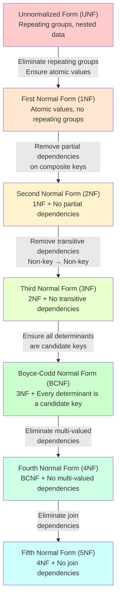

#### First Normal Form (1NF)

**Requirements:**
- All attributes contain only atomic (indivisible) values
- No repeating groups or arrays
- Each row is uniquely identifiable

**Violation Example:**
```
OrderID | CustomerName | Products
1001    | John Smith   | Widget, Gadget, Gizmo
1002    | Jane Doe     | Gadget
```

The `Products` column contains multiple values—a repeating group.

**Corrected to 1NF:**
```
OrderID | CustomerName | Product
1001    | John Smith   | Widget
1001    | John Smith   | Gadget
1001    | John Smith   | Gizmo
1002    | Jane Doe     | Gadget
```

#### Second Normal Form (2NF)

**Requirements:**
- Must be in 1NF
- Every non-key attribute must depend on the *entire* primary key, not just part of it

This only applies when you have a composite primary key. If your primary key is a single column, you're automatically in 2NF once you achieve 1NF.

**Violation Example:**
Consider a table with composite key `{OrderID, ProductID}`:
```
OrderID | ProductID | Quantity | ProductName | ProductPrice
1001    | P100      | 5        | Widget      | 9.99
1001    | P200      | 3        | Gadget      | 14.99
1002    | P100      | 2        | Widget      | 9.99
```

Here, `ProductName` and `ProductPrice` depend only on `ProductID`, not on the full key `{OrderID, ProductID}`. This is a **partial dependency**.

**Corrected to 2NF:**
```
-- Order_Items table (composite key: OrderID, ProductID)
OrderID | ProductID | Quantity

-- Products table (key: ProductID)
ProductID | ProductName | ProductPrice
```

#### Third Normal Form (3NF)

**Requirements:**
- Must be in 2NF
- No transitive dependencies: non-key attributes cannot depend on other non-key attributes

**Violation Example:**
```
EmployeeID | DepartmentID | DepartmentName | DepartmentBudget
E001       | D10          | Engineering    | 500000
E002       | D10          | Engineering    | 500000
E003       | D20          | Marketing      | 300000
```

Here, `DepartmentName` and `DepartmentBudget` depend on `DepartmentID`, which is not the primary key. The dependency chain is: `EmployeeID` → `DepartmentID` → `DepartmentName`. This transitive dependency causes redundancy.

**Corrected to 3NF:**
```
-- Employees table
EmployeeID | DepartmentID

-- Departments table  
DepartmentID | DepartmentName | DepartmentBudget
```

#### Boyce-Codd Normal Form (BCNF)

**Requirements:**
- Must be in 3NF
- For every functional dependency X → Y, X must be a superkey (a candidate key or superset thereof)

BCNF is stricter than 3NF. Most tables in 3NF are also in BCNF, but edge cases exist.

**Violation Example:**
Consider a tutoring schedule where:
- Each student has one tutor per subject
- Each tutor teaches only one subject

```
StudentID | Subject | TutorID
S1        | Math    | T1
S2        | Math    | T1
S1        | Physics | T2
S3        | Physics | T3
```

Functional dependencies:
- `{StudentID, Subject}` → `TutorID` (a student's subject determines the tutor)
- `TutorID` → `Subject` (each tutor teaches one subject)

The second dependency violates BCNF because `TutorID` is not a superkey—it determines `Subject`, but it cannot uniquely identify a row.

**Corrected to BCNF:**
```
-- Student_Tutors table
StudentID | TutorID

-- Tutors table
TutorID | Subject
```

#### Fourth and Fifth Normal Forms (Brief Coverage)

**4NF** addresses multi-valued dependencies—situations where one attribute independently determines multiple values of another attribute, creating combinatorial explosion.

**5NF** addresses join dependencies—rare cases where a table can only be reconstructed by joining three or more tables.

In practice, achieving 3NF or BCNF handles the vast majority of normalization needs. 4NF and 5NF issues are uncommon in well-designed schemas.

### 1.4 Worked Example: Complete Normalization Process

Let's normalize a real-world scenario: an order management system.

**Unnormalized Starting Point:**
```
OrderID | OrderDate | CustomerID | CustomerName | CustomerAddress | Items
1001    | 2024-01-15| C100       | Acme Corp    | 123 Main St     | P1:Widget:5:9.99, P2:Gadget:3:14.99
1002    | 2024-01-16| C100       | Acme Corp    | 123 Main St     | P3:Gizmo:10:4.99
```

**Step 1: Achieve 1NF (Eliminate Repeating Groups)**
```
OrderID | OrderDate  | CustomerID | CustomerName | CustomerAddress | ProductID | ProductName | Quantity | UnitPrice
1001    | 2024-01-15 | C100       | Acme Corp    | 123 Main St     | P1        | Widget      | 5        | 9.99
1001    | 2024-01-15 | C100       | Acme Corp    | 123 Main St     | P2        | Gadget      | 3        | 14.99
1002    | 2024-01-16 | C100       | Acme Corp    | 123 Main St     | P3        | Gizmo       | 10       | 4.99
```
Composite key: `{OrderID, ProductID}`

**Step 2: Achieve 2NF (Remove Partial Dependencies)**

Identifying dependencies:
- `OrderID` → `OrderDate, CustomerID, CustomerName, CustomerAddress` (partial dependency)
- `ProductID` → `ProductName, UnitPrice` (partial dependency)
- `{OrderID, ProductID}` → `Quantity` (full dependency)

Decompose:
```
-- Orders
OrderID | OrderDate  | CustomerID | CustomerName | CustomerAddress

-- Products  
ProductID | ProductName | UnitPrice

-- Order_Items
OrderID | ProductID | Quantity
```

**Step 3: Achieve 3NF (Remove Transitive Dependencies)**

In the Orders table: `OrderID` → `CustomerID` → `CustomerName, CustomerAddress`

This is a transitive dependency. Decompose:
```
-- Orders
OrderID | OrderDate | CustomerID

-- Customers
CustomerID | CustomerName | CustomerAddress

-- Products
ProductID | ProductName | UnitPrice

-- Order_Items
OrderID | ProductID | Quantity
```

This is now in 3NF (and BCNF). Each table has a clear purpose, and updates to customer information or product details only require changing one row.

### 1.5 Data Anomalies and How Normalization Prevents Them

| Anomaly Type | Description | Example | Prevention |
|--------------|-------------|---------|------------|
| **Insertion Anomaly** | Cannot insert data without unrelated data | Cannot add a new product without an order | Separate Products table |
| **Update Anomaly** | Must update multiple rows for one logical change | Customer moves, update every order row | Separate Customers table |
| **Deletion Anomaly** | Deleting data removes unrelated data | Deleting last order loses customer info | Separate Customers table |

### 1.6 When to Denormalize

Normalization optimizes for data integrity and write efficiency. But sometimes read performance matters more. Denormalization intentionally reintroduces redundancy to improve query performance.

**Legitimate Reasons to Denormalize:**
1. **Reporting tables** that are read-heavy and rarely updated
2. **Calculated aggregates** that would require expensive joins
3. **Archive tables** that are never modified
4. **Dimensional models** (covered extensively later)

**The Trade-offs:**
| Aspect | Normalized | Denormalized |
|--------|-----------|--------------|
| Storage | Minimal redundancy | Increased storage |
| Insert/Update | Fast, single location | Slower, multiple updates |
| Select (complex) | Many joins, slower | Fewer joins, faster |
| Data integrity | Guaranteed by structure | Requires procedural enforcement |
| Flexibility | High | Lower |

**Rule of Thumb:** Normalize your OLTP systems. Denormalize your analytical/reporting systems. When in doubt, normalize first—you can always denormalize later, but un-denormalizing is painful.

---

## Chapter 2: Constraints & Data Integrity

Constraints are your last line of defense against bad data. They're not optional—they're essential. I've seen organizations lose millions because someone decided constraints were "too restrictive" or "hurt performance." The performance impact is negligible; the data quality impact of removing them is catastrophic.

### 2.1 Constraint Types

#### PRIMARY KEY

Uniquely identifies each row. Automatically creates a unique index. Cannot be NULL.

**SQL Server:**
```sql
-- Inline definition
CREATE TABLE sales.customers (
    customer_id INT NOT NULL,
    customer_name VARCHAR(100) NOT NULL,
    CONSTRAINT pk_customers PRIMARY KEY (customer_id)
);

-- With clustered index control
CREATE TABLE sales.customers (
    customer_id INT NOT NULL,
    customer_name VARCHAR(100) NOT NULL,
    CONSTRAINT pk_customers PRIMARY KEY NONCLUSTERED (customer_id)
);
```

**PostgreSQL:**
```sql
CREATE TABLE sales.customers (
    customer_id INTEGER NOT NULL,
    customer_name VARCHAR(100) NOT NULL,
    CONSTRAINT pk_customers PRIMARY KEY (customer_id)
);
```

#### FOREIGN KEY

Enforces referential integrity between tables.

**SQL Server:**
```sql
CREATE TABLE sales.orders (
    order_id INT NOT NULL,
    customer_id INT NOT NULL,
    order_date DATE NOT NULL,
    CONSTRAINT pk_orders PRIMARY KEY (order_id),
    CONSTRAINT fk_orders_customer 
        FOREIGN KEY (customer_id) 
        REFERENCES sales.customers (customer_id)
        ON DELETE NO ACTION
        ON UPDATE CASCADE
);
```

**PostgreSQL:**
```sql
CREATE TABLE sales.orders (
    order_id INTEGER NOT NULL,
    customer_id INTEGER NOT NULL,
    order_date DATE NOT NULL,
    CONSTRAINT pk_orders PRIMARY KEY (order_id),
    CONSTRAINT fk_orders_customer 
        FOREIGN KEY (customer_id) 
        REFERENCES sales.customers (customer_id)
        ON DELETE RESTRICT
        ON UPDATE CASCADE
);
```

#### UNIQUE

Ensures uniqueness but allows one NULL (behavior varies by RDBMS).

```sql
-- SQL Server & PostgreSQL (similar syntax)
CREATE TABLE hr.employees (
    employee_id INT NOT NULL,
    email VARCHAR(255) NOT NULL,
    ssn CHAR(11) NULL,
    CONSTRAINT pk_employees PRIMARY KEY (employee_id),
    CONSTRAINT uq_employees_email UNIQUE (email),
    CONSTRAINT uq_employees_ssn UNIQUE (ssn)
);
```

#### CHECK

Enforces domain rules at the column or table level.

**SQL Server:**
```sql
CREATE TABLE sales.order_items (
    order_id INT NOT NULL,
    product_id INT NOT NULL,
    quantity INT NOT NULL,
    unit_price DECIMAL(10,2) NOT NULL,
    discount_percent DECIMAL(5,2) NOT NULL DEFAULT 0,
    CONSTRAINT pk_order_items PRIMARY KEY (order_id, product_id),
    CONSTRAINT chk_order_items_quantity CHECK (quantity > 0),
    CONSTRAINT chk_order_items_unit_price CHECK (unit_price >= 0),
    CONSTRAINT chk_order_items_discount CHECK (discount_percent BETWEEN 0 AND 100)
);
```

**PostgreSQL:**
```sql
CREATE TABLE sales.order_items (
    order_id INTEGER NOT NULL,
    product_id INTEGER NOT NULL,
    quantity INTEGER NOT NULL,
    unit_price NUMERIC(10,2) NOT NULL,
    discount_percent NUMERIC(5,2) NOT NULL DEFAULT 0,
    CONSTRAINT pk_order_items PRIMARY KEY (order_id, product_id),
    CONSTRAINT chk_order_items_quantity CHECK (quantity > 0),
    CONSTRAINT chk_order_items_unit_price CHECK (unit_price >= 0),
    CONSTRAINT chk_order_items_discount CHECK (discount_percent BETWEEN 0 AND 100)
);
```

#### NOT NULL

The simplest yet most frequently overlooked constraint.

```sql
-- Both SQL Server and PostgreSQL
CREATE TABLE inventory.products (
    product_id INT NOT NULL,
    product_name VARCHAR(200) NOT NULL,
    description VARCHAR(MAX) NULL,  -- Explicitly nullable
    unit_cost DECIMAL(10,2) NOT NULL,
    created_date DATETIME NOT NULL DEFAULT GETDATE()  -- SQL Server
    -- created_date TIMESTAMP NOT NULL DEFAULT CURRENT_TIMESTAMP  -- PostgreSQL
);
```

#### DEFAULT

Provides a value when none is specified during insert.

**SQL Server:**
```sql
ALTER TABLE sales.orders 
ADD CONSTRAINT df_orders_status DEFAULT 'Pending' FOR order_status;

ALTER TABLE sales.orders
ADD CONSTRAINT df_orders_created DEFAULT GETDATE() FOR created_date;
```

**PostgreSQL:**
```sql
ALTER TABLE sales.orders 
ALTER COLUMN order_status SET DEFAULT 'Pending';

ALTER TABLE sales.orders
ALTER COLUMN created_date SET DEFAULT CURRENT_TIMESTAMP;
```

### 2.2 Cascading Actions

When a referenced row changes, what happens to dependent rows?

| Action | On DELETE | On UPDATE |
|--------|-----------|-----------|
| **CASCADE** | Delete child rows | Update child FK values |
| **SET NULL** | Set FK to NULL | Set FK to NULL |
| **SET DEFAULT** | Set FK to default | Set FK to default |
| **NO ACTION** | Reject if children exist (checked at statement end) | Reject if children exist |
| **RESTRICT** | Reject if children exist (checked immediately) | Reject if children exist |

**Guidance:**
- Use `CASCADE` sparingly—it can cause unexpected data loss
- `SET NULL` is appropriate for optional relationships
- `NO ACTION` or `RESTRICT` is safest for critical relationships
- In SQL Server, `NO ACTION` is the default; in PostgreSQL, `NO ACTION` and `RESTRICT` differ only in timing

**Example with cascading:**
```sql
-- SQL Server
CREATE TABLE sales.order_items (
    order_item_id INT IDENTITY(1,1) NOT NULL,
    order_id INT NOT NULL,
    product_id INT NOT NULL,
    CONSTRAINT pk_order_items PRIMARY KEY (order_item_id),
    CONSTRAINT fk_order_items_order FOREIGN KEY (order_id)
        REFERENCES sales.orders (order_id)
        ON DELETE CASCADE    -- Delete items when order is deleted
        ON UPDATE NO ACTION,
    CONSTRAINT fk_order_items_product FOREIGN KEY (product_id)
        REFERENCES inventory.products (product_id)
        ON DELETE NO ACTION  -- Prevent deletion of products with order history
        ON UPDATE CASCADE    -- Update FK if product_id changes
);
```

### 2.3 Deferrable Constraints

PostgreSQL supports deferring constraint checking until transaction commit, which is invaluable for certain data loading scenarios.

```sql
-- PostgreSQL only
CREATE TABLE hr.employees (
    employee_id INTEGER NOT NULL,
    manager_id INTEGER NULL,
    CONSTRAINT pk_employees PRIMARY KEY (employee_id),
    CONSTRAINT fk_employees_manager FOREIGN KEY (manager_id)
        REFERENCES hr.employees (employee_id)
        DEFERRABLE INITIALLY DEFERRED
);

-- Now you can insert an employee and their manager in any order
BEGIN;
INSERT INTO hr.employees (employee_id, manager_id) VALUES (2, 1);  -- Manager doesn't exist yet!
INSERT INTO hr.employees (employee_id, manager_id) VALUES (1, NULL);  -- Now add the manager
COMMIT;  -- Constraint checked here, passes because manager now exists
```

SQL Server does not support deferrable constraints. Workarounds include:
- Disable/enable constraints (dangerous, avoid in production)
- Insert in correct dependency order
- Use staging tables without constraints

### 2.4 Domain Constraints and User-Defined Types

Create reusable domain definitions for consistent data types across your schema.

**PostgreSQL:**
```sql
-- Create domains for common patterns
CREATE DOMAIN email_address AS VARCHAR(255)
    CHECK (VALUE ~ '^[A-Za-z0-9._%+-]+@[A-Za-z0-9.-]+\.[A-Za-z]{2,}$');

CREATE DOMAIN positive_integer AS INTEGER
    CHECK (VALUE > 0);

CREATE DOMAIN currency_amount AS NUMERIC(15,2)
    CHECK (VALUE >= 0);

CREATE DOMAIN phone_number AS VARCHAR(20)
    CHECK (VALUE ~ '^\+?[0-9\-\(\)\s]+$');

-- Use domains in table definitions
CREATE TABLE sales.customers (
    customer_id INTEGER NOT NULL,
    email email_address NOT NULL,
    phone phone_number NULL,
    credit_limit currency_amount NOT NULL DEFAULT 0,
    CONSTRAINT pk_customers PRIMARY KEY (customer_id)
);
```

**SQL Server (User-Defined Types):**
```sql
-- Create user-defined types
CREATE TYPE dbo.EmailAddress FROM VARCHAR(255) NOT NULL;
CREATE TYPE dbo.CurrencyAmount FROM DECIMAL(15,2) NOT NULL;
CREATE TYPE dbo.PhoneNumber FROM VARCHAR(20) NULL;

-- Use in table definitions
CREATE TABLE sales.customers (
    customer_id INT NOT NULL,
    email dbo.EmailAddress,
    phone dbo.PhoneNumber,
    credit_limit dbo.CurrencyAmount DEFAULT 0,
    CONSTRAINT pk_customers PRIMARY KEY (customer_id)
);

-- Note: SQL Server UDTs don't support CHECK constraints directly
-- Use table-level CHECK or rules instead
```

### 2.5 Declarative vs. Procedural Integrity

| Approach | Declarative (Constraints) | Procedural (Triggers/Application) |
|----------|---------------------------|-----------------------------------|
| **Where enforced** | Database engine | Trigger code or application code |
| **Performance** | Highly optimized | Variable, often slower |
| **Reliability** | Always enforced | Can be bypassed |
| **Complexity** | Limited to standard rules | Unlimited flexibility |
| **Maintenance** | Self-documenting | Requires code review |
| **Cross-platform** | Standard SQL | Database-specific |

**Best Practice:** Use declarative constraints for everything they can handle. Reserve procedural enforcement for complex business rules that constraints cannot express.

```sql
-- Declarative: Simple, reliable, fast
ALTER TABLE sales.orders
ADD CONSTRAINT chk_orders_ship_after_order 
    CHECK (ship_date IS NULL OR ship_date >= order_date);

-- Procedural: For complex rules (example: order total cannot exceed customer credit limit)
-- SQL Server trigger
CREATE TRIGGER tr_orders_check_credit
ON sales.orders
AFTER INSERT, UPDATE
AS
BEGIN
    IF EXISTS (
        SELECT 1 
        FROM inserted i
        JOIN sales.customers c ON i.customer_id = c.customer_id
        WHERE i.order_total > c.credit_limit
    )
    BEGIN
        RAISERROR('Order total exceeds customer credit limit', 16, 1);
        ROLLBACK TRANSACTION;
    END
END;
```

### 2.6 Constraint Naming Conventions

Consistent naming makes schemas self-documenting and simplifies maintenance.

**Recommended Pattern:**
```
{constraint_type}_{table_name}_{column_name(s)}
```

| Constraint Type | Prefix | Example |
|-----------------|--------|---------|
| Primary Key | `pk_` | `pk_customers` |
| Foreign Key | `fk_` | `fk_orders_customer` |
| Unique | `uq_` | `uq_employees_email` |
| Check | `chk_` | `chk_order_items_quantity` |
| Default | `df_` | `df_orders_created_date` |
| Index | `ix_` | `ix_orders_customer_date` |

**Documentation Practice:**
```sql
-- Add extended properties in SQL Server
EXEC sp_addextendedproperty 
    @name = N'MS_Description',
    @value = N'Ensures orders can only ship on or after order date',
    @level0type = N'SCHEMA', @level0name = 'sales',
    @level1type = N'TABLE', @level1name = 'orders',
    @level2type = N'CONSTRAINT', @level2name = 'chk_orders_ship_after_order';

-- Add comments in PostgreSQL
COMMENT ON CONSTRAINT chk_orders_ship_after_order ON sales.orders IS 
    'Ensures orders can only ship on or after order date';
```

---

## Chapter 3: Keys in Depth

Keys are the backbone of relational design. Choosing the right key strategy affects everything from performance to maintainability to historical tracking capabilities.

### 3.1 Key Terminology

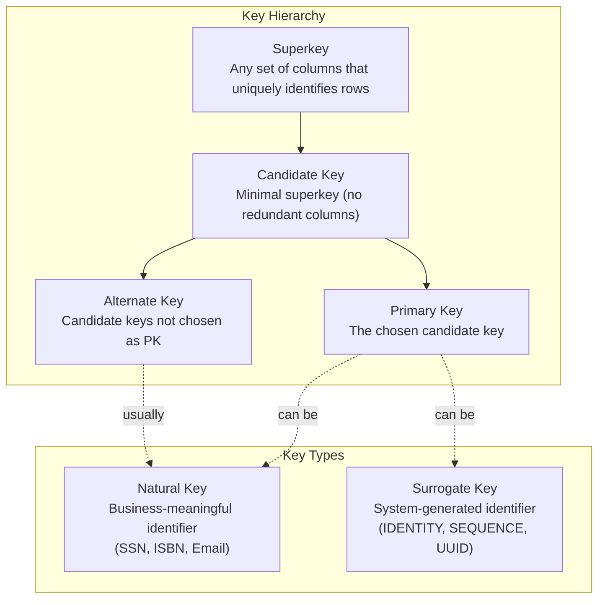

### 3.2 Natural Keys vs. Surrogate Keys

This is one of the most debated topics in data modeling. Both have their place.

**Natural Keys** are derived from business data:
- Social Security Number
- ISBN for books
- Email address
- Product SKU

**Surrogate Keys** are system-generated with no business meaning:
- Auto-incrementing integers
- UUIDs/GUIDs
- Sequence-generated values

| Factor | Natural Key | Surrogate Key |
|--------|-------------|---------------|
| **Size** | Variable, often larger | Fixed, typically 4-8 bytes |
| **Stability** | May change (email, SSN corrections) | Never changes |
| **Meaningfulness** | Self-describing | Requires joins to interpret |
| **Uniqueness** | Depends on business rules | Guaranteed by system |
| **Performance** | Larger keys = larger indexes | Compact, fast joins |
| **Data warehouse suitability** | Poor (changes break history) | Excellent |
| **Cross-system integration** | May not match across systems | Requires mapping tables |

**Decision Framework:**

```
Use NATURAL KEYS when:
├── The value is truly immutable (rare!)
├── The value is universally standardized (ISO country codes)
├── You need human-readable identifiers in queries
└── You're building a small, stable reference table

Use SURROGATE KEYS when:
├── The natural key might change
├── The natural key is composite or large
├── You're building a data warehouse
├── You need to track history (SCD Type 2)
├── You're integrating data from multiple sources
└── Performance is critical (which is almost always)
```

### 3.3 Surrogate Key Generation Strategies

#### IDENTITY (SQL Server) / SERIAL (PostgreSQL)

Auto-incrementing integer, tightly coupled to the table.

**SQL Server:**
```sql
CREATE TABLE dim.customers (
    customer_key INT IDENTITY(1,1) NOT NULL,
    customer_id VARCHAR(20) NOT NULL,  -- Natural key
    customer_name VARCHAR(100) NOT NULL,
    CONSTRAINT pk_dim_customers PRIMARY KEY (customer_key),
    CONSTRAINT uq_dim_customers_id UNIQUE (customer_id)
);

-- Get the last inserted identity
DECLARE @new_key INT = SCOPE_IDENTITY();

-- Reseed if needed (use with caution)
DBCC CHECKIDENT ('dim.customers', RESEED, 1000);
```

**PostgreSQL:**
```sql
-- Modern approach (PostgreSQL 10+)
CREATE TABLE dim.customers (
    customer_key INTEGER GENERATED ALWAYS AS IDENTITY,
    customer_id VARCHAR(20) NOT NULL,
    customer_name VARCHAR(100) NOT NULL,
    CONSTRAINT pk_dim_customers PRIMARY KEY (customer_key),
    CONSTRAINT uq_dim_customers_id UNIQUE (customer_id)
);

-- Legacy approach (still widely used)
CREATE TABLE dim.customers (
    customer_key SERIAL PRIMARY KEY,
    customer_id VARCHAR(20) NOT NULL UNIQUE,
    customer_name VARCHAR(100) NOT NULL
);

-- Get last inserted value
-- Use RETURNING clause instead
INSERT INTO dim.customers (customer_id, customer_name)
VALUES ('C001', 'Acme Corp')
RETURNING customer_key;
```

#### SEQUENCE

Database object that generates unique numbers, decoupled from tables.

**SQL Server (2012+):**
```sql
CREATE SEQUENCE dbo.seq_customer_key
    AS INT
    START WITH 1
    INCREMENT BY 1
    MINVALUE 1
    NO MAXVALUE
    NO CYCLE
    CACHE 100;  -- Performance optimization

-- Use in insert
INSERT INTO dim.customers (customer_key, customer_id, customer_name)
VALUES (NEXT VALUE FOR dbo.seq_customer_key, 'C001', 'Acme Corp');

-- Use as default
ALTER TABLE dim.customers
ADD CONSTRAINT df_customers_key 
    DEFAULT NEXT VALUE FOR dbo.seq_customer_key FOR customer_key;
```

**PostgreSQL:**
```sql
CREATE SEQUENCE dim.seq_customer_key
    AS INTEGER
    START WITH 1
    INCREMENT BY 1
    NO MINVALUE
    NO MAXVALUE
    CACHE 100;

-- Use in insert
INSERT INTO dim.customers (customer_key, customer_id, customer_name)
VALUES (nextval('dim.seq_customer_key'), 'C001', 'Acme Corp');

-- Set as column default
ALTER TABLE dim.customers 
ALTER COLUMN customer_key SET DEFAULT nextval('dim.seq_customer_key');
```

#### UUID/GUID

Globally unique identifiers, excellent for distributed systems.

**SQL Server:**
```sql
CREATE TABLE distributed.events (
    event_id UNIQUEIDENTIFIER NOT NULL DEFAULT NEWID(),
    -- or use NEWSEQUENTIALID() for better index performance
    event_id UNIQUEIDENTIFIER NOT NULL DEFAULT NEWSEQUENTIALID(),
    event_type VARCHAR(50) NOT NULL,
    event_data NVARCHAR(MAX) NULL,
    CONSTRAINT pk_events PRIMARY KEY (event_id)
);
```

**PostgreSQL:**
```sql
-- Requires uuid-ossp or pgcrypto extension
CREATE EXTENSION IF NOT EXISTS "uuid-ossp";

CREATE TABLE distributed.events (
    event_id UUID NOT NULL DEFAULT uuid_generate_v4(),
    event_type VARCHAR(50) NOT NULL,
    event_data JSONB NULL,
    CONSTRAINT pk_events PRIMARY KEY (event_id)
);

-- Or using gen_random_uuid() in PostgreSQL 13+
CREATE TABLE distributed.events (
    event_id UUID NOT NULL DEFAULT gen_random_uuid(),
    event_type VARCHAR(50) NOT NULL,
    event_data JSONB NULL,
    CONSTRAINT pk_events PRIMARY KEY (event_id)
);
```

**UUID Considerations:**
- 16 bytes vs. 4 bytes for INT—larger indexes, more I/O
- Random distribution can fragment indexes (mitigated by sequential UUIDs)
- Essential for distributed systems and data integration
- Human-unreadable

**Cloud Platform Notes:**

*Snowflake:*
```sql
-- Snowflake uses AUTOINCREMENT or IDENTITY
CREATE TABLE dim_customers (
    customer_key INTEGER AUTOINCREMENT START 1 INCREMENT 1,
    customer_id VARCHAR(20) NOT NULL,
    customer_name VARCHAR(100) NOT NULL
);

-- UUID generation
SELECT UUID_STRING();
```

*BigQuery:*
```sql
-- BigQuery doesn't have auto-increment; generate in application or use GENERATE_UUID()
CREATE TABLE dataset.dim_customers (
    customer_key STRING NOT NULL,  -- Store UUID as string
    customer_id STRING NOT NULL,
    customer_name STRING NOT NULL
);

-- Generate UUID in query
INSERT INTO dataset.dim_customers
SELECT GENERATE_UUID(), 'C001', 'Acme Corp';
```

### 3.4 Composite Keys

Keys consisting of multiple columns.

**Design Considerations:**
```sql
-- Composite primary key for junction/bridge tables
CREATE TABLE sales.order_items (
    order_id INT NOT NULL,
    line_number INT NOT NULL,  -- Line number within the order
    product_id INT NOT NULL,
    quantity INT NOT NULL,
    unit_price DECIMAL(10,2) NOT NULL,
    CONSTRAINT pk_order_items PRIMARY KEY (order_id, line_number),
    CONSTRAINT fk_order_items_order FOREIGN KEY (order_id)
        REFERENCES sales.orders (order_id),
    CONSTRAINT fk_order_items_product FOREIGN KEY (product_id)
        REFERENCES inventory.products (product_id)
);

-- Alternative: Surrogate key with unique constraint on natural composite
CREATE TABLE sales.order_items (
    order_item_id INT IDENTITY(1,1) NOT NULL,
    order_id INT NOT NULL,
    line_number INT NOT NULL,
    product_id INT NOT NULL,
    quantity INT NOT NULL,
    unit_price DECIMAL(10,2) NOT NULL,
    CONSTRAINT pk_order_items PRIMARY KEY (order_item_id),
    CONSTRAINT uq_order_items_natural UNIQUE (order_id, line_number),
    CONSTRAINT fk_order_items_order FOREIGN KEY (order_id)
        REFERENCES sales.orders (order_id),
    CONSTRAINT fk_order_items_product FOREIGN KEY (product_id)
        REFERENCES inventory.products (product_id)
);
```

**Indexing Implications:**
- Column order matters: `(A, B)` supports queries on `A` and `(A, B)`, but not `B` alone
- Consider additional indexes for common query patterns
- Composite keys as foreign keys require multi-column references

### 3.5 Self-Referencing Relationships

Tables that reference themselves, common for hierarchies.

```sql
-- Employee hierarchy
CREATE TABLE hr.employees (
    employee_id INT NOT NULL,
    employee_name VARCHAR(100) NOT NULL,
    manager_id INT NULL,  -- NULL for top-level (CEO)
    hire_date DATE NOT NULL,
    CONSTRAINT pk_employees PRIMARY KEY (employee_id),
    CONSTRAINT fk_employees_manager FOREIGN KEY (manager_id)
        REFERENCES hr.employees (employee_id)
);

-- Query the hierarchy (SQL Server - recursive CTE)
WITH employee_hierarchy AS (
    -- Anchor: top-level employees
    SELECT employee_id, employee_name, manager_id, 0 AS level,
           CAST(employee_name AS VARCHAR(MAX)) AS hierarchy_path
    FROM hr.employees
    WHERE manager_id IS NULL
    
    UNION ALL
    
    -- Recursive: employees with managers
    SELECT e.employee_id, e.employee_name, e.manager_id, eh.level + 1,
           eh.hierarchy_path + ' > ' + e.employee_name
    FROM hr.employees e
    JOIN employee_hierarchy eh ON e.manager_id = eh.employee_id
)
SELECT * FROM employee_hierarchy
ORDER BY hierarchy_path;
```

---

# Part II: Dimensional Modeling Fundamentals

## Chapter 4: Star Schema and Snowflake Schema

Dimensional modeling is a different discipline from OLTP normalization. While normalization optimizes for data integrity and transactional efficiency, dimensional modeling optimizes for query simplicity and analytical performance.

### 4.1 The Dimensional Modeling Philosophy

Ralph Kimball, the father of dimensional modeling, established two primary goals:
1. **Understandability:** Business users should be able to understand and navigate the model
2. **Performance:** Queries should run fast, even on large datasets

These goals lead to a deliberately denormalized structure that would make an OLTP purist cringe—and that's perfectly appropriate.

### 4.2 Star Schema Structure

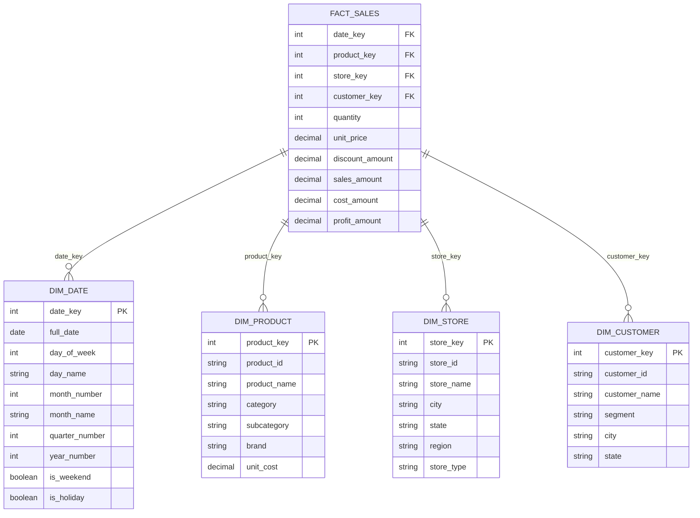

**Key Characteristics:**
- Central fact table surrounded by dimension tables
- Single join between fact and each dimension
- Dimension tables are denormalized (flattened hierarchies)
- Simple, intuitive structure that business users can understand

### 4.3 Snowflake Schema Structure

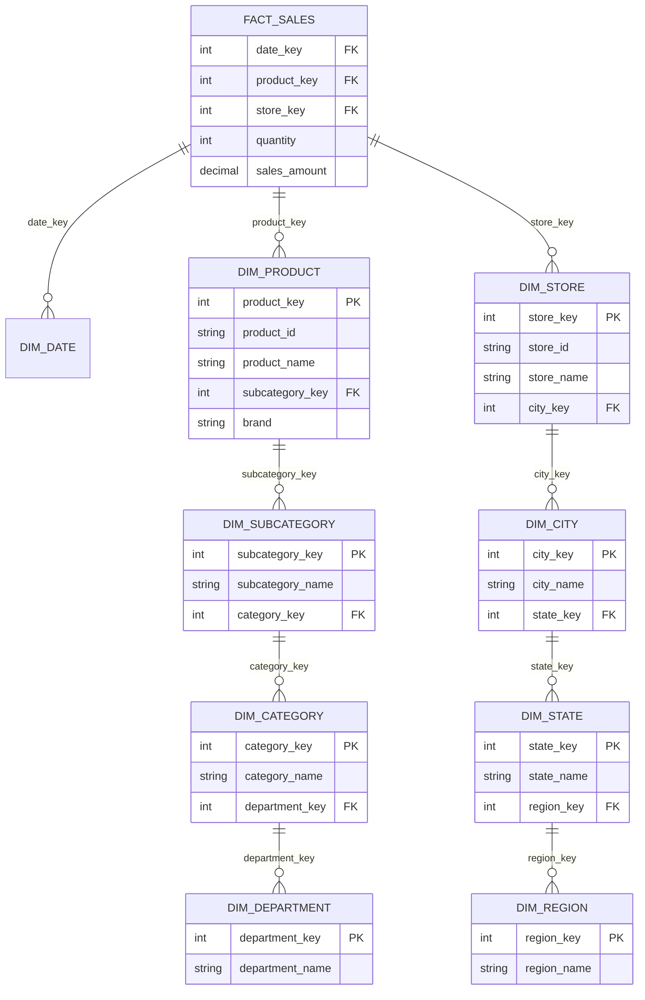

**Key Characteristics:**
- Dimension tables are normalized into sub-dimensions
- Reduces storage through elimination of redundancy
- More complex queries requiring multiple joins
- Can improve update efficiency for large dimensions

### 4.4 Star vs. Snowflake: Decision Matrix

| Factor | Star Schema | Snowflake Schema |
|--------|-------------|------------------|
| **Query Simplicity** | Simple, fewer joins | Complex, many joins |
| **Query Performance** | Generally faster | More joins = potential overhead |
| **Storage** | More redundancy | Less redundancy |
| **ETL Complexity** | Simpler dimension loads | More complex dependency management |
| **User Understanding** | Highly intuitive | Harder to navigate |
| **Dimension Updates** | Update many rows | Update one row |
| **BI Tool Compatibility** | Excellent | Variable |
| **Modern Cloud DW** | Preferred (storage is cheap) | Less common |

**My Recommendation:** Default to star schema. Use snowflake only when:
- Dimension tables are extremely large (millions of rows) AND
- Storage costs are a genuine concern AND
- The normalized attributes change frequently

In modern cloud warehouses (Snowflake, BigQuery, Redshift), storage is inexpensive and query optimizers handle wide tables efficiently. The simplicity advantage of star schema almost always wins.

### 4.5 Query Comparison

**Star Schema Query:**
```sql
-- Total sales by product category and region
SELECT 
    d.year_number,
    p.category,
    s.region,
    SUM(f.sales_amount) AS total_sales,
    SUM(f.quantity) AS total_units
FROM fact_sales f
JOIN dim_date d ON f.date_key = d.date_key
JOIN dim_product p ON f.product_key = p.product_key
JOIN dim_store s ON f.store_key = s.store_key
WHERE d.year_number = 2024
GROUP BY d.year_number, p.category, s.region
ORDER BY total_sales DESC;
```

**Snowflake Schema Query (same analysis):**
```sql
-- Same analysis requires more joins
SELECT 
    d.year_number,
    cat.category_name,
    r.region_name,
    SUM(f.sales_amount) AS total_sales,
    SUM(f.quantity) AS total_units
FROM fact_sales f
JOIN dim_date d ON f.date_key = d.date_key
JOIN dim_product p ON f.product_key = p.product_key
JOIN dim_subcategory sub ON p.subcategory_key = sub.subcategory_key
JOIN dim_category cat ON sub.category_key = cat.category_key
JOIN dim_store s ON f.store_key = s.store_key
JOIN dim_city c ON s.city_key = c.city_key
JOIN dim_state st ON c.state_key = st.state_key
JOIN dim_region r ON st.region_key = r.region_key
WHERE d.year_number = 2024
GROUP BY d.year_number, cat.category_name, r.region_name
ORDER BY total_sales DESC;
```

The star schema query is simpler to write, easier to understand, and typically performs better due to fewer joins.

---

## Chapter 5: Fact Tables

Fact tables are the heart of dimensional models—they store the measurements of business processes.

### 5.1 Fact Table Characteristics

- **Grain:** Each row represents one measurement event at a specific level of detail
- **Foreign Keys:** Links to dimension tables that provide context
- **Measures:** Numeric values that can be aggregated (summed, averaged, counted)
- **Typically large:** Most of the data volume in a data warehouse

### 5.2 Types of Fact Tables

#### Transaction Fact Tables

Record individual business events at atomic grain.

```sql
-- SQL Server
CREATE TABLE dw.fact_sales (
    -- Dimension keys (foreign keys)
    date_key INT NOT NULL,
    time_key INT NOT NULL,
    product_key INT NOT NULL,
    store_key INT NOT NULL,
    customer_key INT NOT NULL,
    promotion_key INT NOT NULL,
    
    -- Degenerate dimensions (no separate dimension table)
    transaction_id VARCHAR(20) NOT NULL,
    line_number INT NOT NULL,
    
    -- Measures
    quantity INT NOT NULL,
    unit_price DECIMAL(10,2) NOT NULL,
    unit_cost DECIMAL(10,2) NOT NULL,
    discount_amount DECIMAL(10,2) NOT NULL,
    sales_amount DECIMAL(12,2) NOT NULL,
    cost_amount DECIMAL(12,2) NOT NULL,
    profit_amount DECIMAL(12,2) NOT NULL,
    
    -- Audit columns
    load_date DATETIME NOT NULL DEFAULT GETDATE(),
    source_system VARCHAR(50) NOT NULL,
    
    -- Primary key (often composite for transaction facts)
    CONSTRAINT pk_fact_sales PRIMARY KEY (date_key, transaction_id, line_number),
    
    -- Foreign keys
    CONSTRAINT fk_fact_sales_date FOREIGN KEY (date_key) 
        REFERENCES dw.dim_date (date_key),
    CONSTRAINT fk_fact_sales_product FOREIGN KEY (product_key) 
        REFERENCES dw.dim_product (product_key),
    CONSTRAINT fk_fact_sales_store FOREIGN KEY (store_key) 
        REFERENCES dw.dim_store (store_key),
    CONSTRAINT fk_fact_sales_customer FOREIGN KEY (customer_key) 
        REFERENCES dw.dim_customer (customer_key),
    CONSTRAINT fk_fact_sales_promotion FOREIGN KEY (promotion_key) 
        REFERENCES dw.dim_promotion (promotion_key)
);

-- Create index on commonly filtered/joined columns
CREATE NONCLUSTERED INDEX ix_fact_sales_product ON dw.fact_sales (product_key);
CREATE NONCLUSTERED INDEX ix_fact_sales_customer ON dw.fact_sales (customer_key);
CREATE NONCLUSTERED INDEX ix_fact_sales_store ON dw.fact_sales (store_key);
```

#### Periodic Snapshot Fact Tables

Capture state at regular intervals (daily, weekly, monthly).

```sql
-- Daily inventory snapshot
CREATE TABLE dw.fact_inventory_snapshot (
    -- Grain: one row per product per store per day
    date_key INT NOT NULL,
    product_key INT NOT NULL,
    store_key INT NOT NULL,
    
    -- Measures: state at end of day
    quantity_on_hand INT NOT NULL,
    quantity_on_order INT NOT NULL,
    quantity_reserved INT NOT NULL,
    quantity_available INT NOT NULL,  -- Calculated: on_hand - reserved
    reorder_point INT NOT NULL,
    days_of_supply DECIMAL(5,2) NULL,
    inventory_value DECIMAL(12,2) NOT NULL,
    
    -- Audit
    load_date DATETIME NOT NULL DEFAULT GETDATE(),
    
    CONSTRAINT pk_fact_inventory PRIMARY KEY (date_key, product_key, store_key),
    
    CONSTRAINT fk_fact_inventory_date FOREIGN KEY (date_key) 
        REFERENCES dw.dim_date (date_key),
    CONSTRAINT fk_fact_inventory_product FOREIGN KEY (product_key) 
        REFERENCES dw.dim_product (product_key),
    CONSTRAINT fk_fact_inventory_store FOREIGN KEY (store_key) 
        REFERENCES dw.dim_store (store_key)
);
```

**Key Insight:** Periodic snapshots are semi-additive across time—you cannot sum inventory across days (that's meaningless), but you can sum across products or stores for a single day, or average across time.

#### Accumulating Snapshot Fact Tables

Track the lifecycle of a process with multiple milestones.

```sql
-- Order fulfillment lifecycle
CREATE TABLE dw.fact_order_fulfillment (
    -- Grain: one row per order
    order_key INT NOT NULL,
    
    -- Multiple date keys for milestones
    order_date_key INT NOT NULL,
    payment_date_key INT NULL,
    ship_date_key INT NULL,
    delivery_date_key INT NULL,
    return_date_key INT NULL,
    
    -- Other dimension keys
    customer_key INT NOT NULL,
    ship_method_key INT NOT NULL,
    
    -- Milestone lag measures (days between events)
    days_to_payment INT NULL,
    days_to_ship INT NULL,
    days_to_deliver INT NULL,
    days_order_to_delivery INT NULL,
    
    -- Amount measures
    order_amount DECIMAL(12,2) NOT NULL,
    shipping_amount DECIMAL(10,2) NULL,
    return_amount DECIMAL(12,2) NULL,
    
    -- Status
    current_status VARCHAR(20) NOT NULL,
    
    -- Audit
    load_date DATETIME NOT NULL,
    update_date DATETIME NOT NULL,
    
    CONSTRAINT pk_fact_order_fulfillment PRIMARY KEY (order_key)
);
```

**Key Insight:** Accumulating snapshots are updated as milestones occur—they require UPDATE statements during ETL, unlike transaction facts which are INSERT-only.

### 5.3 Measure Additivity

| Type | Description | Example | Aggregation Rules |
|------|-------------|---------|-------------------|
| **Additive** | Can be summed across all dimensions | Sales Amount, Quantity | SUM across any dimension |
| **Semi-Additive** | Can be summed across some dimensions | Account Balance, Inventory | SUM across non-time; AVG or snapshot across time |
| **Non-Additive** | Cannot be summed meaningfully | Unit Price, Ratio, Percentage | AVG, or recalculate from components |

```sql
-- Example: Calculating average unit price correctly
-- WRONG: Simple average ignores quantity
SELECT AVG(unit_price) AS avg_price FROM fact_sales;  -- Misleading!

-- RIGHT: Weighted average
SELECT 
    SUM(sales_amount) / NULLIF(SUM(quantity), 0) AS weighted_avg_price
FROM fact_sales;

-- Or for ratios, recalculate from components
SELECT
    SUM(profit_amount) / NULLIF(SUM(sales_amount), 0) AS profit_margin
FROM fact_sales;
```

---

## Chapter 6: Fact Table Grain Decisions

**Grain is the single most important decision in dimensional modeling.** Get it wrong, and everything built on top will be flawed. Get it right, and the rest of the model falls into place naturally.

### 6.1 What is Grain?

Grain defines exactly what one row in a fact table represents. Think of it as the "resolution" of your data—just as a photograph's resolution determines how much detail you can see, a fact table's grain determines what questions you can answer.

**Grain Declaration Examples:**
- "One row per line item per sales transaction"
- "One row per product per store per day"
- "One row per customer account per month-end"
- "One row per order (tracking lifecycle milestones)"

### 6.2 The Grain Declaration Process

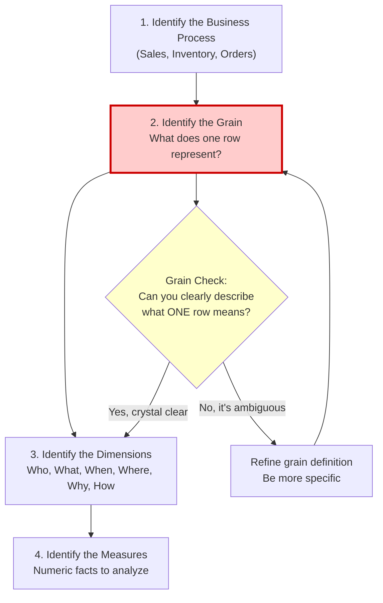

### 6.3 Grain Decision Tree

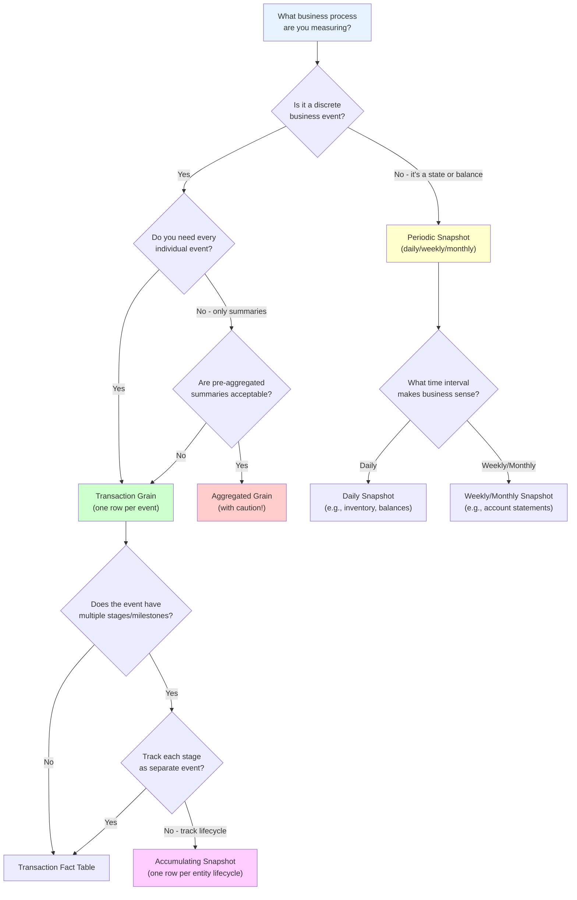

### 6.4 Atomic vs. Aggregated Grain

**Atomic grain** captures data at its lowest, most detailed level. **Aggregated grain** pre-summarizes data to a higher level.

| Aspect | Atomic Grain | Aggregated Grain |
|--------|--------------|------------------|
| **Example** | One row per line item | One row per product per day |
| **Flexibility** | Maximum—can answer any question | Limited—can only answer questions at that level or higher |
| **Storage** | Larger | Smaller |
| **Query Performance** | May require more aggregation | Pre-aggregated, potentially faster |
| **Drill-down** | Full drill-down capability | Cannot drill below aggregation level |

**Strong Recommendation:** Always start with atomic grain. You can always aggregate atomic data upward; you cannot disaggregate summarized data downward.

```sql
-- Atomic grain: maximum flexibility
SELECT 
    p.category,
    SUM(f.sales_amount) AS total_sales
FROM fact_sales f
JOIN dim_product p ON f.product_key = p.product_key
JOIN dim_date d ON f.date_key = d.date_key
WHERE d.year_number = 2024
GROUP BY p.category;

-- If you started with aggregated grain (product/day), 
-- you CANNOT drill down to see individual transactions
```

### 6.5 Multi-Grain Fact Tables: A Common Pitfall

**Never mix grains in a single fact table.** This is one of the most common and damaging mistakes in dimensional modeling.

**The Problem:**
```sql
-- WRONG: Mixed grain - DO NOT DO THIS
CREATE TABLE fact_sales_mixed (
    date_key INT NOT NULL,
    product_key INT NOT NULL,
    store_key INT NOT NULL,
    customer_key INT NULL,  -- NULL for store totals!
    transaction_id VARCHAR(20) NULL,  -- NULL for store totals!
    sales_amount DECIMAL(12,2) NOT NULL,
    record_type VARCHAR(20) NOT NULL  -- 'TRANSACTION' or 'STORE_DAILY_TOTAL'
);
```

**Why It's Wrong:**
- Simple SUM queries double-count (transaction + total)
- Users must always filter by record_type
- Different rows have different meanings—violates grain principle
- Null foreign keys create join complications

**The Solution:** Create separate fact tables for different grains.

```sql
-- CORRECT: Separate tables for different grains
CREATE TABLE fact_sales (
    date_key INT NOT NULL,
    product_key INT NOT NULL,
    store_key INT NOT NULL,
    customer_key INT NOT NULL,
    transaction_id VARCHAR(20) NOT NULL,
    line_number INT NOT NULL,
    sales_amount DECIMAL(12,2) NOT NULL
    -- Grain: one row per line item per transaction
);

CREATE TABLE fact_sales_daily_store (
    date_key INT NOT NULL,
    store_key INT NOT NULL,
    total_sales_amount DECIMAL(14,2) NOT NULL,
    transaction_count INT NOT NULL,
    customer_count INT NOT NULL
    -- Grain: one row per store per day
);
```

### 6.6 Factless Fact Tables

Sometimes you need to track events or coverage without numeric measures.

#### Event Tracking Factless Facts

Track that something happened, even without measures.

```sql
-- Student attendance (factless fact)
CREATE TABLE dw.fact_student_attendance (
    date_key INT NOT NULL,
    student_key INT NOT NULL,
    class_key INT NOT NULL,
    teacher_key INT NOT NULL,
    attendance_status_key INT NOT NULL,  -- Present, Absent, Tardy
    
    CONSTRAINT pk_fact_attendance PRIMARY KEY 
        (date_key, student_key, class_key),
    
    CONSTRAINT fk_attendance_date FOREIGN KEY (date_key)
        REFERENCES dw.dim_date (date_key),
    CONSTRAINT fk_attendance_student FOREIGN KEY (student_key)
        REFERENCES dw.dim_student (student_key),
    CONSTRAINT fk_attendance_class FOREIGN KEY (class_key)
        REFERENCES dw.dim_class (class_key)
);

-- Query: Count of absences by student by month
SELECT 
    s.student_name,
    d.month_name,
    d.year_number,
    COUNT(*) AS absence_count
FROM dw.fact_student_attendance f
JOIN dw.dim_student s ON f.student_key = s.student_key
JOIN dw.dim_date d ON f.date_key = d.date_key
JOIN dw.dim_attendance_status a ON f.attendance_status_key = a.attendance_status_key
WHERE a.status_name = 'Absent'
GROUP BY s.student_name, d.month_name, d.year_number;
```

#### Coverage Factless Facts

Track eligibility, availability, or conditions—what COULD happen, not what DID happen.

```sql
-- Promotion coverage: which products are on promotion in which stores
CREATE TABLE dw.fact_promotion_coverage (
    date_key INT NOT NULL,
    product_key INT NOT NULL,
    store_key INT NOT NULL,
    promotion_key INT NOT NULL,
    
    CONSTRAINT pk_fact_promo_coverage PRIMARY KEY 
        (date_key, product_key, store_key, promotion_key),
    
    CONSTRAINT fk_promo_coverage_date FOREIGN KEY (date_key)
        REFERENCES dw.dim_date (date_key),
    CONSTRAINT fk_promo_coverage_product FOREIGN KEY (product_key)
        REFERENCES dw.dim_product (product_key),
    CONSTRAINT fk_promo_coverage_store FOREIGN KEY (store_key)
        REFERENCES dw.dim_store (store_key),
    CONSTRAINT fk_promo_coverage_promotion FOREIGN KEY (promotion_key)
        REFERENCES dw.dim_promotion (promotion_key)
);

-- Query: Products on promotion that had NO sales (promotional failure analysis)
SELECT 
    p.product_name,
    pr.promotion_name,
    s.store_name,
    d.full_date
FROM dw.fact_promotion_coverage fc
JOIN dw.dim_product p ON fc.product_key = p.product_key
JOIN dw.dim_promotion pr ON fc.promotion_key = pr.promotion_key
JOIN dw.dim_store s ON fc.store_key = s.store_key
JOIN dw.dim_date d ON fc.date_key = d.date_key
LEFT JOIN dw.fact_sales fs 
    ON fc.date_key = fs.date_key 
    AND fc.product_key = fs.product_key 
    AND fc.store_key = fs.store_key
WHERE fs.date_key IS NULL  -- No matching sales
  AND d.full_date BETWEEN '2024-01-01' AND '2024-01-31';
```

---

## Chapter 7: Dimension Tables

Dimensions provide the context for facts—the "who, what, when, where, why, and how" of business events.

### 7.1 Dimension Table Characteristics

- **Descriptive attributes:** Text, categories, hierarchies
- **Typically wide:** Many columns providing rich context
- **Typically shallow:** Fewer rows than fact tables
- **Surrogate keys:** System-generated primary keys
- **Natural keys:** Business identifiers preserved for reference
- **Denormalized:** Flattened hierarchies for query simplicity

### 7.2 The Date Dimension

Every data warehouse needs a robust date dimension. This is one dimension where you should build it correctly once and reuse it everywhere.

```sql
-- SQL Server Date Dimension
CREATE TABLE dw.dim_date (
    date_key INT NOT NULL,  -- YYYYMMDD format
    full_date DATE NOT NULL,
    
    -- Day attributes
    day_of_week TINYINT NOT NULL,  -- 1=Sunday, 7=Saturday
    day_name VARCHAR(10) NOT NULL,
    day_name_short CHAR(3) NOT NULL,
    day_of_month TINYINT NOT NULL,
    day_of_year SMALLINT NOT NULL,
    is_weekday BIT NOT NULL,
    is_weekend BIT NOT NULL,
    
    -- Week attributes
    week_of_year TINYINT NOT NULL,
    week_start_date DATE NOT NULL,
    week_end_date DATE NOT NULL,
    
    -- Month attributes
    month_number TINYINT NOT NULL,
    month_name VARCHAR(10) NOT NULL,
    month_name_short CHAR(3) NOT NULL,
    month_start_date DATE NOT NULL,
    month_end_date DATE NOT NULL,
    days_in_month TINYINT NOT NULL,
    
    -- Quarter attributes
    quarter_number TINYINT NOT NULL,
    quarter_name CHAR(2) NOT NULL,  -- Q1, Q2, Q3, Q4
    quarter_start_date DATE NOT NULL,
    quarter_end_date DATE NOT NULL,
    
    -- Year attributes
    year_number SMALLINT NOT NULL,
    year_start_date DATE NOT NULL,
    year_end_date DATE NOT NULL,
    
    -- Fiscal calendar (example: July fiscal year start)
    fiscal_month_number TINYINT NOT NULL,
    fiscal_quarter_number TINYINT NOT NULL,
    fiscal_year_number SMALLINT NOT NULL,
    
    -- Relative flags (updated daily or computed in queries)
    is_current_day BIT NOT NULL DEFAULT 0,
    is_current_month BIT NOT NULL DEFAULT 0,
    is_current_year BIT NOT NULL DEFAULT 0,
    
    -- Holiday tracking
    is_holiday BIT NOT NULL DEFAULT 0,
    holiday_name VARCHAR(50) NULL,
    
    CONSTRAINT pk_dim_date PRIMARY KEY (date_key),
    CONSTRAINT uq_dim_date_full_date UNIQUE (full_date)
);

-- Populate date dimension (SQL Server example for 20 years)
DECLARE @StartDate DATE = '2020-01-01';
DECLARE @EndDate DATE = '2039-12-31';
DECLARE @CurrentDate DATE = @StartDate;

WHILE @CurrentDate <= @EndDate
BEGIN
    INSERT INTO dw.dim_date (
        date_key, full_date, day_of_week, day_name, day_name_short,
        day_of_month, day_of_year, is_weekday, is_weekend,
        week_of_year, week_start_date, week_end_date,
        month_number, month_name, month_name_short,
        month_start_date, month_end_date, days_in_month,
        quarter_number, quarter_name, quarter_start_date, quarter_end_date,
        year_number, year_start_date, year_end_date,
        fiscal_month_number, fiscal_quarter_number, fiscal_year_number
    )
    SELECT 
        CONVERT(INT, FORMAT(@CurrentDate, 'yyyyMMdd')),
        @CurrentDate,
        DATEPART(WEEKDAY, @CurrentDate),
        DATENAME(WEEKDAY, @CurrentDate),
        LEFT(DATENAME(WEEKDAY, @CurrentDate), 3),
        DAY(@CurrentDate),
        DATEPART(DAYOFYEAR, @CurrentDate),
        CASE WHEN DATEPART(WEEKDAY, @CurrentDate) BETWEEN 2 AND 6 THEN 1 ELSE 0 END,
        CASE WHEN DATEPART(WEEKDAY, @CurrentDate) IN (1, 7) THEN 1 ELSE 0 END,
        DATEPART(WEEK, @CurrentDate),
        DATEADD(DAY, 1 - DATEPART(WEEKDAY, @CurrentDate), @CurrentDate),
        DATEADD(DAY, 7 - DATEPART(WEEKDAY, @CurrentDate), @CurrentDate),
        MONTH(@CurrentDate),
        DATENAME(MONTH, @CurrentDate),
        LEFT(DATENAME(MONTH, @CurrentDate), 3),
        DATEFROMPARTS(YEAR(@CurrentDate), MONTH(@CurrentDate), 1),
        EOMONTH(@CurrentDate),
        DAY(EOMONTH(@CurrentDate)),
        DATEPART(QUARTER, @CurrentDate),
        'Q' + CAST(DATEPART(QUARTER, @CurrentDate) AS CHAR(1)),
        DATEFROMPARTS(YEAR(@CurrentDate), (DATEPART(QUARTER, @CurrentDate) - 1) * 3 + 1, 1),
        EOMONTH(DATEFROMPARTS(YEAR(@CurrentDate), DATEPART(QUARTER, @CurrentDate) * 3, 1)),
        YEAR(@CurrentDate),
        DATEFROMPARTS(YEAR(@CurrentDate), 1, 1),
        DATEFROMPARTS(YEAR(@CurrentDate), 12, 31),
        -- Fiscal year starting July (adjust for your organization)
        CASE WHEN MONTH(@CurrentDate) >= 7 
             THEN MONTH(@CurrentDate) - 6 
             ELSE MONTH(@CurrentDate) + 6 END,
        CASE WHEN MONTH(@CurrentDate) >= 7 
             THEN (MONTH(@CurrentDate) - 7) / 3 + 1 
             ELSE (MONTH(@CurrentDate) + 5) / 3 + 1 END,
        CASE WHEN MONTH(@CurrentDate) >= 7 
             THEN YEAR(@CurrentDate) + 1 
             ELSE YEAR(@CurrentDate) END;
    
    SET @CurrentDate = DATEADD(DAY, 1, @CurrentDate);
END;
```

### 7.3 Special Dimension Patterns

#### Role-Playing Dimensions

The same physical dimension used multiple times with different meanings.

```sql
-- The dim_date table is used for multiple date roles in fact_orders
CREATE TABLE dw.fact_orders (
    order_key INT NOT NULL,
    order_date_key INT NOT NULL,      -- When order was placed
    ship_date_key INT NULL,            -- When order shipped
    delivery_date_key INT NULL,        -- When order was delivered
    customer_key INT NOT NULL,
    -- ... measures ...
    
    CONSTRAINT fk_orders_order_date FOREIGN KEY (order_date_key)
        REFERENCES dw.dim_date (date_key),
    CONSTRAINT fk_orders_ship_date FOREIGN KEY (ship_date_key)
        REFERENCES dw.dim_date (date_key),
    CONSTRAINT fk_orders_delivery_date FOREIGN KEY (delivery_date_key)
        REFERENCES dw.dim_date (date_key)
);

-- Query using role-playing dimension
SELECT 
    od.month_name AS order_month,
    sd.month_name AS ship_month,
    COUNT(*) AS order_count,
    AVG(DATEDIFF(DAY, od.full_date, sd.full_date)) AS avg_days_to_ship
FROM dw.fact_orders f
JOIN dw.dim_date od ON f.order_date_key = od.date_key
JOIN dw.dim_date sd ON f.ship_date_key = sd.date_key
WHERE od.year_number = 2024
GROUP BY od.month_name, sd.month_name;
```

#### Junk Dimensions

Combine low-cardinality flags and indicators into a single dimension.

```sql
-- Instead of cluttering the fact table with multiple flag columns:
-- is_gift, is_rush, is_online, payment_type, etc.

-- Create a junk dimension with all combinations
CREATE TABLE dw.dim_transaction_flags (
    transaction_flag_key INT IDENTITY(1,1) NOT NULL,
    is_gift BIT NOT NULL,
    is_rush BIT NOT NULL,
    is_online BIT NOT NULL,
    is_return BIT NOT NULL,
    payment_type VARCHAR(20) NOT NULL,
    gift_wrap_type VARCHAR(20) NOT NULL,
    
    CONSTRAINT pk_dim_transaction_flags PRIMARY KEY (transaction_flag_key)
);

-- Pre-populate all valid combinations
INSERT INTO dw.dim_transaction_flags (is_gift, is_rush, is_online, is_return, payment_type, gift_wrap_type)
SELECT 
    g.is_gift,
    r.is_rush,
    o.is_online,
    rt.is_return,
    p.payment_type,
    gw.gift_wrap_type
FROM (VALUES (0), (1)) AS g(is_gift)
CROSS JOIN (VALUES (0), (1)) AS r(is_rush)
CROSS JOIN (VALUES (0), (1)) AS o(is_online)
CROSS JOIN (VALUES (0), (1)) AS rt(is_return)
CROSS JOIN (VALUES ('Cash'), ('Credit'), ('Debit'), ('Gift Card')) AS p(payment_type)
CROSS JOIN (VALUES ('None'), ('Standard'), ('Premium')) AS gw(gift_wrap_type);

-- Now the fact table has a single FK instead of 6 columns
CREATE TABLE dw.fact_sales (
    date_key INT NOT NULL,
    product_key INT NOT NULL,
    store_key INT NOT NULL,
    customer_key INT NOT NULL,
    transaction_flag_key INT NOT NULL,  -- Single key to junk dimension
    sales_amount DECIMAL(12,2) NOT NULL,
    -- ...
    CONSTRAINT fk_sales_trans_flags FOREIGN KEY (transaction_flag_key)
        REFERENCES dw.dim_transaction_flags (transaction_flag_key)
);
```

**When to Use Junk Dimensions:**
- Multiple low-cardinality attributes (flags, codes, types)
- Attributes that don't belong in any other dimension
- Reduces fact table width and improves compression

#### Degenerate Dimensions

Dimension values stored directly in the fact table without a separate dimension table.

```sql
-- Transaction number, invoice number, order number
-- These are just identifiers with no additional attributes
CREATE TABLE dw.fact_sales (
    date_key INT NOT NULL,
    product_key INT NOT NULL,
    store_key INT NOT NULL,
    customer_key INT NOT NULL,
    
    -- Degenerate dimensions (no FK, stored directly)
    transaction_id VARCHAR(20) NOT NULL,
    pos_terminal_id VARCHAR(10) NOT NULL,
    receipt_number VARCHAR(20) NOT NULL,
    
    -- Measures
    quantity INT NOT NULL,
    sales_amount DECIMAL(12,2) NOT NULL,
    
    CONSTRAINT pk_fact_sales PRIMARY KEY (date_key, transaction_id, product_key)
);

-- Degenerate dimensions are useful for:
-- 1. Drilling through to source system details
-- 2. Grouping line items into their parent transaction
-- 3. Audit trail back to operational systems
```

---

# Part III: Advanced Dimensional Techniques

## Chapter 8: Slowly Changing Dimensions (SCD)

Slowly Changing Dimensions address the fundamental question: **What happens when dimension data changes?** The answer depends on your analytical requirements.

### 8.1 SCD Types Overview

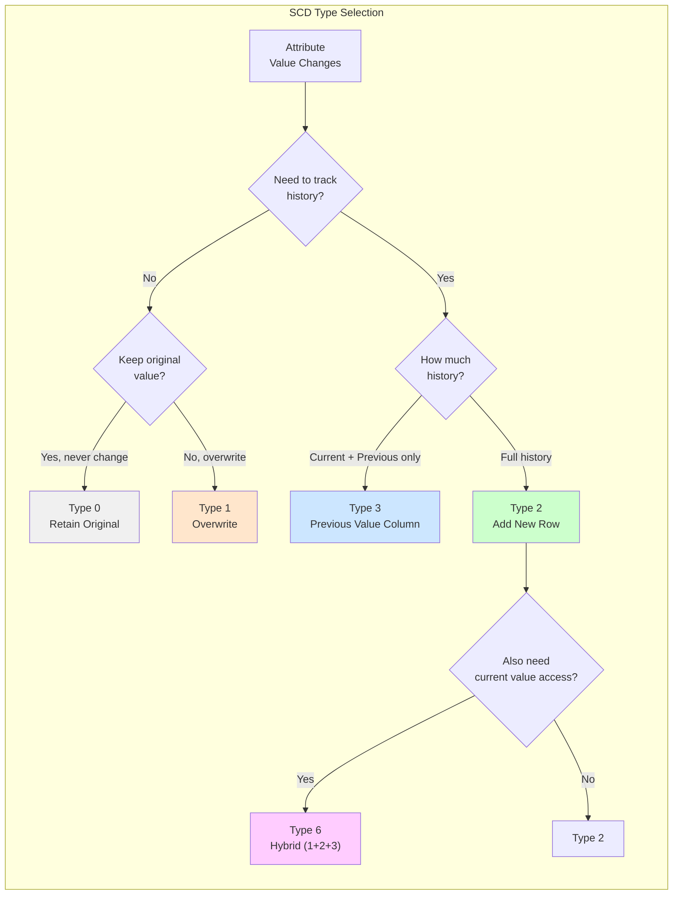

### 8.2 SCD Type Comparison

| Type | Behavior | History Preserved | Storage Impact | Use Case |
|------|----------|-------------------|----------------|----------|
| **Type 0** | Never change | Original value only | None | Fixed attributes (birth date, original signup date) |
| **Type 1** | Overwrite | None | None | Error corrections, attributes where history doesn't matter |
| **Type 2** | Add new row | Full history | Grows with changes | Attributes where historical context matters (address, status) |
| **Type 3** | Add column | Current + one previous | Fixed (extra columns) | Need quick access to previous value |
| **Type 4** | Separate history table | Full history | Separate table grows | Rapidly changing attributes (mini-dimension pattern) |
| **Type 6** | Hybrid 1+2+3 | Full + current value column | Type 2 + extra column | Need both history and easy current value access |

### 8.3 SCD Type 2 Implementation

Type 2 is the most common approach for tracking meaningful history. Each change creates a new row with effective dating.

```sql
-- SQL Server: SCD Type 2 Customer Dimension
CREATE TABLE dw.dim_customer (
    -- Surrogate key (system-generated, never changes)
    customer_key INT IDENTITY(1,1) NOT NULL,
    
    -- Natural key (business identifier)
    customer_id VARCHAR(20) NOT NULL,
    
    -- Type 1 attributes (overwritten, no history)
    customer_name VARCHAR(100) NOT NULL,
    email VARCHAR(255) NULL,
    phone VARCHAR(20) NULL,
    
    -- Type 2 attributes (full history tracked)
    address_line1 VARCHAR(200) NULL,
    address_line2 VARCHAR(200) NULL,
    city VARCHAR(100) NULL,
    state VARCHAR(50) NULL,
    postal_code VARCHAR(20) NULL,
    country VARCHAR(50) NULL,
    loyalty_tier VARCHAR(20) NOT NULL,
    customer_segment VARCHAR(50) NULL,
    
    -- Type 0 attributes (never change)
    original_signup_date DATE NOT NULL,
    
    -- SCD Type 2 tracking columns
    effective_date DATE NOT NULL,
    expiration_date DATE NOT NULL,
    is_current BIT NOT NULL,
    
    -- Audit columns
    created_date DATETIME NOT NULL DEFAULT GETDATE(),
    updated_date DATETIME NOT NULL DEFAULT GETDATE(),
    source_system VARCHAR(50) NOT NULL,
    
    -- Constraints
    CONSTRAINT pk_dim_customer PRIMARY KEY (customer_key),
    CONSTRAINT chk_dim_customer_dates CHECK (expiration_date >= effective_date)
);

-- Index for efficient lookups
CREATE NONCLUSTERED INDEX ix_dim_customer_natural 
    ON dw.dim_customer (customer_id, is_current) 
    INCLUDE (customer_key);

CREATE NONCLUSTERED INDEX ix_dim_customer_effective 
    ON dw.dim_customer (customer_id, effective_date, expiration_date)
    INCLUDE (customer_key);

-- Unknown member (key = -1 or 0)
SET IDENTITY_INSERT dw.dim_customer ON;
INSERT INTO dw.dim_customer (
    customer_key, customer_id, customer_name, loyalty_tier,
    original_signup_date, effective_date, expiration_date, 
    is_current, source_system
)
VALUES (
    -1, 'UNKNOWN', 'Unknown Customer', 'Unknown',
    '1900-01-01', '1900-01-01', '9999-12-31',
    1, 'SYSTEM'
);
SET IDENTITY_INSERT dw.dim_customer OFF;
```

**PostgreSQL Equivalent:**
```sql
CREATE TABLE dw.dim_customer (
    customer_key INTEGER GENERATED ALWAYS AS IDENTITY,
    customer_id VARCHAR(20) NOT NULL,
    customer_name VARCHAR(100) NOT NULL,
    email VARCHAR(255) NULL,
    phone VARCHAR(20) NULL,
    address_line1 VARCHAR(200) NULL,
    address_line2 VARCHAR(200) NULL,
    city VARCHAR(100) NULL,
    state VARCHAR(50) NULL,
    postal_code VARCHAR(20) NULL,
    country VARCHAR(50) NULL,
    loyalty_tier VARCHAR(20) NOT NULL,
    customer_segment VARCHAR(50) NULL,
    original_signup_date DATE NOT NULL,
    effective_date DATE NOT NULL,
    expiration_date DATE NOT NULL,
    is_current BOOLEAN NOT NULL,
    created_date TIMESTAMP NOT NULL DEFAULT CURRENT_TIMESTAMP,
    updated_date TIMESTAMP NOT NULL DEFAULT CURRENT_TIMESTAMP,
    source_system VARCHAR(50) NOT NULL,
    
    CONSTRAINT pk_dim_customer PRIMARY KEY (customer_key),
    CONSTRAINT chk_dim_customer_dates CHECK (expiration_date >= effective_date)
);
```

### 8.4 SCD Type 2 Timeline Visualization

```mermaid
gantt
    title Customer Dimension History (SCD Type 2)
    dateFormat  YYYY-MM-DD
    axisFormat  %Y-%m
    
    section customer_id: C001
    Key=1: Chicago, Standard : 2022-01-15, 2023-03-31
    Key=2: Chicago, Gold : 2023-04-01, 2023-09-30
    Key=3: Denver, Gold : 2023-10-01, 2024-12-31
    
    section Record Details
    Row 1 - effective: 2022-01-15, expiration: 2023-03-31, is_current: FALSE : milestone, m1, 2022-01-15, 0d
    Row 2 - effective: 2023-04-01, expiration: 2023-09-30, is_current: FALSE : milestone, m2, 2023-04-01, 0d
    Row 3 - effective: 2023-10-01, expiration: 9999-12-31, is_current: TRUE : milestone, m3, 2023-10-01, 0d
```

**Sample Data:**
| customer_key | customer_id | city | loyalty_tier | effective_date | expiration_date | is_current |
|--------------|-------------|------|--------------|----------------|-----------------|------------|
| 1 | C001 | Chicago | Standard | 2022-01-15 | 2023-03-31 | FALSE |
| 2 | C001 | Chicago | Gold | 2023-04-01 | 2023-09-30 | FALSE |
| 3 | C001 | Denver | Gold | 2023-10-01 | 9999-12-31 | TRUE |

### 8.5 SCD Type 2 ETL Processing

**SQL Server MERGE Pattern:**
```sql
-- SCD Type 2 MERGE for customer dimension
-- Assumes staging table stg_customer with incoming data

-- Step 1: Expire changed rows
UPDATE dim
SET 
    expiration_date = DATEADD(DAY, -1, CAST(GETDATE() AS DATE)),
    is_current = 0,
    updated_date = GETDATE()
FROM dw.dim_customer dim
INNER JOIN staging.stg_customer stg ON dim.customer_id = stg.customer_id
WHERE dim.is_current = 1
  AND (
      -- Check Type 2 attributes for changes
      ISNULL(dim.address_line1, '') <> ISNULL(stg.address_line1, '')
      OR ISNULL(dim.city, '') <> ISNULL(stg.city, '')
      OR ISNULL(dim.state, '') <> ISNULL(stg.state, '')
      OR ISNULL(dim.postal_code, '') <> ISNULL(stg.postal_code, '')
      OR ISNULL(dim.loyalty_tier, '') <> ISNULL(stg.loyalty_tier, '')
  );

-- Step 2: Insert new rows for changed records
INSERT INTO dw.dim_customer (
    customer_id, customer_name, email, phone,
    address_line1, address_line2, city, state, postal_code, country,
    loyalty_tier, customer_segment, original_signup_date,
    effective_date, expiration_date, is_current, source_system
)
SELECT 
    stg.customer_id,
    stg.customer_name,
    stg.email,
    stg.phone,
    stg.address_line1,
    stg.address_line2,
    stg.city,
    stg.state,
    stg.postal_code,
    stg.country,
    stg.loyalty_tier,
    stg.customer_segment,
    COALESCE(existing.original_signup_date, CAST(GETDATE() AS DATE)),
    CAST(GETDATE() AS DATE),  -- effective_date
    '9999-12-31',              -- expiration_date
    1,                         -- is_current
    stg.source_system
FROM staging.stg_customer stg
LEFT JOIN dw.dim_customer existing 
    ON stg.customer_id = existing.customer_id 
    AND existing.is_current = 0  -- Just expired
    AND existing.expiration_date = DATEADD(DAY, -1, CAST(GETDATE() AS DATE))
WHERE NOT EXISTS (
    -- Don't insert if already current with same values
    SELECT 1 FROM dw.dim_customer curr
    WHERE curr.customer_id = stg.customer_id
      AND curr.is_current = 1
);

-- Step 3: Update Type 1 attributes on current rows (no new row created)
UPDATE dim
SET 
    customer_name = stg.customer_name,
    email = stg.email,
    phone = stg.phone,
    updated_date = GETDATE()
FROM dw.dim_customer dim
INNER JOIN staging.stg_customer stg ON dim.customer_id = stg.customer_id
WHERE dim.is_current = 1;

-- Step 4: Insert brand new customers
INSERT INTO dw.dim_customer (
    customer_id, customer_name, email, phone,
    address_line1, address_line2, city, state, postal_code, country,
    loyalty_tier, customer_segment, original_signup_date,
    effective_date, expiration_date, is_current, source_system
)
SELECT 
    stg.customer_id,
    stg.customer_name,
    stg.email,
    stg.phone,
    stg.address_line1,
    stg.address_line2,
    stg.city,
    stg.state,
    stg.postal_code,
    stg.country,
    stg.loyalty_tier,
    stg.customer_segment,
    CAST(GETDATE() AS DATE),  -- original_signup_date
    CAST(GETDATE() AS DATE),  -- effective_date
    '9999-12-31',              -- expiration_date
    1,                         -- is_current
    stg.source_system
FROM staging.stg_customer stg
WHERE NOT EXISTS (
    SELECT 1 FROM dw.dim_customer dim
    WHERE dim.customer_id = stg.customer_id
);
```

**PostgreSQL Approach (using CTE and INSERT ON CONFLICT):**
```sql
-- PostgreSQL SCD Type 2 processing
-- Step 1: Identify changes and expire old rows
WITH changed_customers AS (
    SELECT dim.customer_key, dim.customer_id
    FROM dw.dim_customer dim
    INNER JOIN staging.stg_customer stg ON dim.customer_id = stg.customer_id
    WHERE dim.is_current = TRUE
      AND (
          COALESCE(dim.address_line1, ''),
          COALESCE(dim.address_line1, '') <> COALESCE(stg.address_line1, '')
          OR COALESCE(dim.city, '') <> COALESCE(stg.city, '')
          OR COALESCE(dim.state, '') <> COALESCE(stg.state, '')
          OR COALESCE(dim.postal_code, '') <> COALESCE(stg.postal_code, '')
          OR COALESCE(dim.loyalty_tier, '') <> COALESCE(stg.loyalty_tier, '')
      )
)
UPDATE dw.dim_customer dim
SET 
    expiration_date = CURRENT_DATE - INTERVAL '1 day',
    is_current = FALSE,
    updated_date = CURRENT_TIMESTAMP
FROM changed_customers cc
WHERE dim.customer_key = cc.customer_key;

-- Step 2: Insert new current rows for changed customers
INSERT INTO dw.dim_customer (
    customer_id, customer_name, email, phone,
    address_line1, address_line2, city, state, postal_code, country,
    loyalty_tier, customer_segment, original_signup_date,
    effective_date, expiration_date, is_current, source_system
)
SELECT 
    stg.customer_id,
    stg.customer_name,
    stg.email,
    stg.phone,
    stg.address_line1,
    stg.address_line2,
    stg.city,
    stg.state,
    stg.postal_code,
    stg.country,
    stg.loyalty_tier,
    stg.customer_segment,
    COALESCE(
        (SELECT original_signup_date FROM dw.dim_customer 
         WHERE customer_id = stg.customer_id LIMIT 1),
        CURRENT_DATE
    ),
    CURRENT_DATE,
    '9999-12-31'::DATE,
    TRUE,
    stg.source_system
FROM staging.stg_customer stg
WHERE EXISTS (
    SELECT 1 FROM dw.dim_customer dim
    WHERE dim.customer_id = stg.customer_id
      AND dim.is_current = FALSE
      AND dim.expiration_date = CURRENT_DATE - INTERVAL '1 day'
);

-- Step 3: Insert new customers (first-time)
INSERT INTO dw.dim_customer (
    customer_id, customer_name, email, phone,
    address_line1, address_line2, city, state, postal_code, country,
    loyalty_tier, customer_segment, original_signup_date,
    effective_date, expiration_date, is_current, source_system
)
SELECT 
    stg.customer_id,
    stg.customer_name,
    stg.email,
    stg.phone,
    stg.address_line1,
    stg.address_line2,
    stg.city,
    stg.state,
    stg.postal_code,
    stg.country,
    stg.loyalty_tier,
    stg.customer_segment,
    CURRENT_DATE,
    CURRENT_DATE,
    '9999-12-31'::DATE,
    TRUE,
    stg.source_system
FROM staging.stg_customer stg
WHERE NOT EXISTS (
    SELECT 1 FROM dw.dim_customer dim
    WHERE dim.customer_id = stg.customer_id
);
```

### 8.6 SCD Type 6 (Hybrid) Implementation

Type 6 combines Types 1, 2, and 3 for maximum flexibility—you get full history (Type 2), the current value on every row (Type 1 behavior via update), and optionally the previous value (Type 3).

```sql
-- SQL Server: SCD Type 6 dimension
CREATE TABLE dw.dim_customer_type6 (
    customer_key INT IDENTITY(1,1) NOT NULL,
    customer_id VARCHAR(20) NOT NULL,
    
    -- Attributes with Type 2 history
    city VARCHAR(100) NULL,
    loyalty_tier VARCHAR(20) NOT NULL,
    
    -- Current value columns (updated on ALL rows for this customer)
    current_city VARCHAR(100) NULL,
    current_loyalty_tier VARCHAR(20) NOT NULL,
    
    -- Type 2 tracking
    effective_date DATE NOT NULL,
    expiration_date DATE NOT NULL,
    is_current BIT NOT NULL,
    
    CONSTRAINT pk_dim_customer_type6 PRIMARY KEY (customer_key)
);

-- Sample data showing Type 6 behavior
-- Note: current_* columns show latest values on ALL rows
/*
customer_key | customer_id | city    | loyalty_tier | current_city | current_loyalty_tier | effective_date | expiration_date | is_current
1            | C001        | Chicago | Standard     | Denver       | Gold                 | 2022-01-15     | 2023-03-31      | 0
2            | C001        | Chicago | Gold         | Denver       | Gold                 | 2023-04-01     | 2023-09-30      | 0
3            | C001        | Denver  | Gold         | Denver       | Gold                 | 2023-10-01     | 9999-12-31      | 1
*/

-- When customer changes, update current_* on ALL rows
UPDATE dw.dim_customer_type6
SET current_city = 'Denver',
    current_loyalty_tier = 'Gold'
WHERE customer_id = 'C001';
```

**Advantage of Type 6:** You can join to any historical row and still access the current values without an additional join.

---

## Chapter 9: Late-Arriving Data

Real-world data doesn't arrive in perfect order. Dimensions may arrive after their facts, or facts may reference dimension states from the past. Handling this gracefully is essential for production systems.

### 9.1 Late-Arriving Dimensions

A fact record arrives, but the dimension record it references doesn't yet exist.

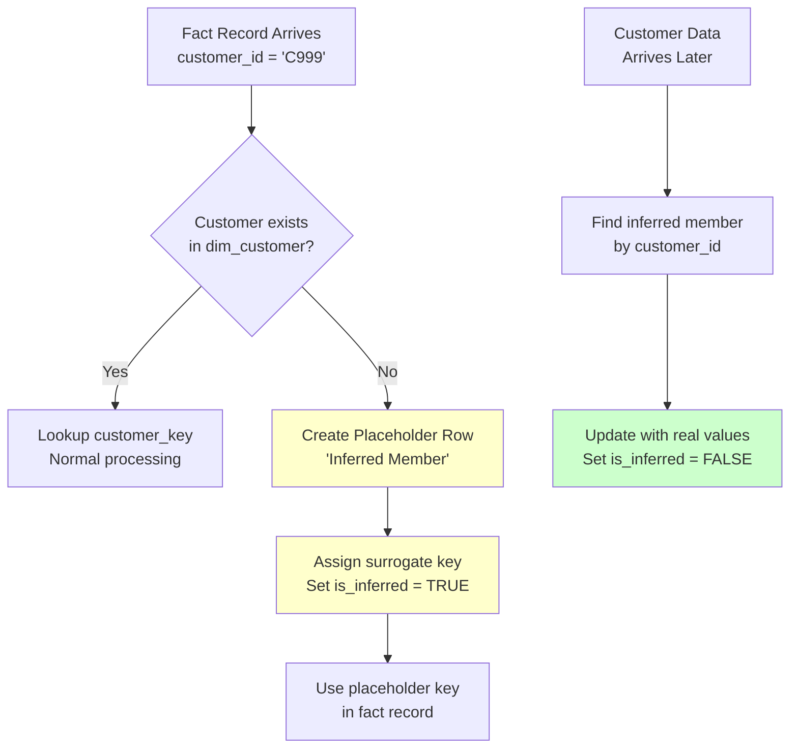

**Implementation:**
```sql
-- Add inferred member tracking to dimension
ALTER TABLE dw.dim_customer ADD is_inferred BIT NOT NULL DEFAULT 0;

-- Procedure to handle late-arriving dimension during fact load
CREATE PROCEDURE dw.usp_get_customer_key
    @customer_id VARCHAR(20),
    @transaction_date DATE,
    @customer_key INT OUTPUT
AS
BEGIN
    -- First, try to find existing current customer
    SELECT @customer_key = customer_key
    FROM dw.dim_customer
    WHERE customer_id = @customer_id
      AND is_current = 1;
    
    -- If not found, check for historical record matching transaction date
    IF @customer_key IS NULL
    BEGIN
        SELECT @customer_key = customer_key
        FROM dw.dim_customer
        WHERE customer_id = @customer_id
          AND @transaction_date BETWEEN effective_date AND expiration_date;
    END
    
    -- If still not found, create inferred member
    IF @customer_key IS NULL
    BEGIN
        INSERT INTO dw.dim_customer (
            customer_id, customer_name, loyalty_tier,
            original_signup_date, effective_date, expiration_date,
            is_current, is_inferred, source_system
        )
        VALUES (
            @customer_id,
            'Unknown - Inferred Member',
            'Unknown',
            @transaction_date,
            @transaction_date,
            '9999-12-31',
            1,
            1,  -- Mark as inferred
            'INFERRED'
        );
        
        SET @customer_key = SCOPE_IDENTITY();
        
        -- Log for monitoring
        INSERT INTO dw.etl_log (log_type, message, created_date)
        VALUES ('INFERRED_MEMBER', 
                'Created inferred customer: ' + @customer_id,
                GETDATE());
    END
END;

-- Procedure to update inferred members when real data arrives
CREATE PROCEDURE dw.usp_update_inferred_customer
    @customer_id VARCHAR(20),
    @customer_name VARCHAR(100),
    @email VARCHAR(255),
    @address_line1 VARCHAR(200),
    @city VARCHAR(100),
    @state VARCHAR(50),
    @postal_code VARCHAR(20),
    @loyalty_tier VARCHAR(20),
    @source_system VARCHAR(50)
AS
BEGIN
    UPDATE dw.dim_customer
    SET 
        customer_name = @customer_name,
        email = @email,
        address_line1 = @address_line1,
        city = @city,
        state = @state,
        postal_code = @postal_code,
        loyalty_tier = @loyalty_tier,
        is_inferred = 0,
        source_system = @source_system,
        updated_date = GETDATE()
    WHERE customer_id = @customer_id
      AND is_inferred = 1;
    
    IF @@ROWCOUNT > 0
    BEGIN
        INSERT INTO dw.etl_log (log_type, message, created_date)
        VALUES ('INFERRED_RESOLVED', 
                'Updated inferred customer: ' + @customer_id,
                GETDATE());
    END
END;
```

### 9.2 Late-Arriving Facts

A fact record arrives that should have been recorded in the past, potentially referencing historical dimension states.

```sql
-- Late-arriving fact handling
-- Scenario: Order placed on 2024-01-15 arrives in ETL on 2024-02-01
-- Customer moved from Chicago to Denver on 2024-01-20

DECLARE @customer_id VARCHAR(20) = 'C001';
DECLARE @transaction_date DATE = '2024-01-15';  -- Historical date
DECLARE @customer_key INT;

-- Find the customer_key that was effective on the transaction date
SELECT @customer_key = customer_key
FROM dw.dim_customer
WHERE customer_id = @customer_id
  AND @transaction_date BETWEEN effective_date AND expiration_date;

-- Use this historical key in the fact record
-- This preserves the correct historical context (Chicago, not Denver)
INSERT INTO dw.fact_sales (
    date_key, customer_key, product_key, store_key,
    transaction_id, quantity, sales_amount
)
VALUES (
    CONVERT(INT, FORMAT(@transaction_date, 'yyyyMMdd')),
    @customer_key,  -- Points to the Chicago row
    @product_key,
    @store_key,
    @transaction_id,
    @quantity,
    @sales_amount
);
```

### 9.3 Late-Arriving Dimension Workflow

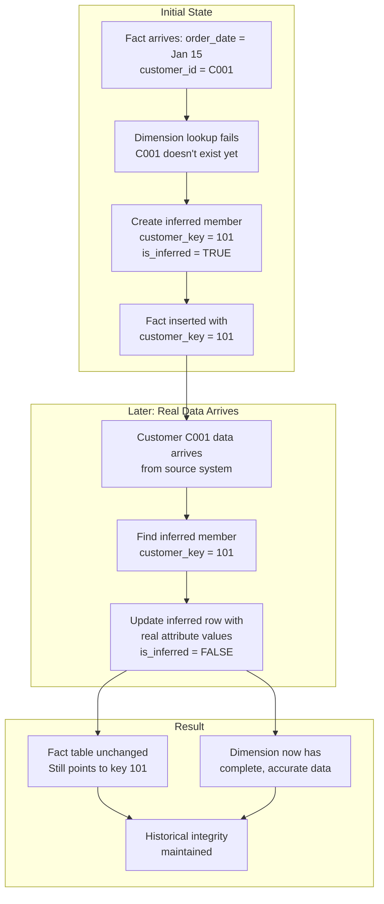

---

## Chapter 10: Bridge Tables for Multi-Valued Dimensions

When facts have many-to-many relationships with dimensions, bridge tables provide the solution.

### 10.1 The Problem

A single product can belong to multiple categories. A patient can have multiple diagnoses. A student can have multiple majors. How do we model this in a dimensional schema?

### 10.2 Bridge Table Pattern

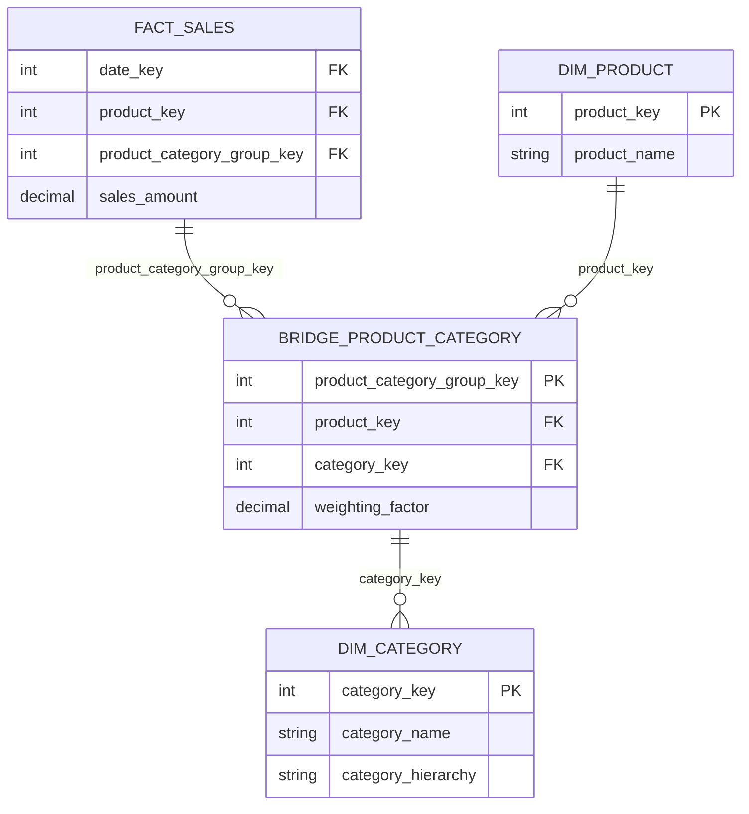

### 10.3 Bridge Table Implementation

```sql
-- SQL Server bridge table for products with multiple categories

-- Category dimension
CREATE TABLE dw.dim_category (
    category_key INT IDENTITY(1,1) NOT NULL,
    category_id VARCHAR(20) NOT NULL,
    category_name VARCHAR(100) NOT NULL,
    category_level1 VARCHAR(100) NULL,
    category_level2 VARCHAR(100) NULL,
    category_level3 VARCHAR(100) NULL,
    CONSTRAINT pk_dim_category PRIMARY KEY (category_key)
);

-- Bridge table
CREATE TABLE dw.bridge_product_category (
    product_category_group_key INT NOT NULL,
    product_key INT NOT NULL,
    category_key INT NOT NULL,
    weighting_factor DECIMAL(5,4) NOT NULL DEFAULT 1.0,
    
    CONSTRAINT pk_bridge_product_category 
        PRIMARY KEY (product_category_group_key, product_key, category_key),
    CONSTRAINT fk_bridge_pc_product FOREIGN KEY (product_key)
        REFERENCES dw.dim_product (product_key),
    CONSTRAINT fk_bridge_pc_category FOREIGN KEY (category_key)
        REFERENCES dw.dim_category (category_key),
    CONSTRAINT chk_bridge_pc_weight CHECK (weighting_factor BETWEEN 0 AND 1)
);

-- Create group key sequence
CREATE SEQUENCE dw.seq_product_category_group
    AS INT START WITH 1 INCREMENT BY 1;

-- Index for efficient joins
CREATE NONCLUSTERED INDEX ix_bridge_pc_product 
    ON dw.bridge_product_category (product_key);
CREATE NONCLUSTERED INDEX ix_bridge_pc_category 
    ON dw.bridge_product_category (category_key);

-- Sample data
/*
product_category_group_key | product_key | category_key | weighting_factor
1                          | 101         | 10           | 0.60  -- Electronics (primary)
1                          | 101         | 20           | 0.40  -- Home Office (secondary)
2                          | 102         | 10           | 1.00  -- Electronics only
3                          | 103         | 30           | 0.50  -- Sports
3                          | 103         | 40           | 0.50  --
3                          | 103         | 40           | 0.50  -- Outdoor
*/

-- Fact table references the group key
CREATE TABLE dw.fact_sales (
    date_key INT NOT NULL,
    product_key INT NOT NULL,
    product_category_group_key INT NOT NULL,
    store_key INT NOT NULL,
    customer_key INT NOT NULL,
    quantity INT NOT NULL,
    sales_amount DECIMAL(12,2) NOT NULL,
    
    CONSTRAINT pk_fact_sales PRIMARY KEY (date_key, product_key, store_key, customer_key),
    CONSTRAINT fk_fact_sales_product FOREIGN KEY (product_key)
        REFERENCES dw.dim_product (product_key)
);
```

### 10.4 Querying with Bridge Tables

```sql
-- Sales by category (with weighting to avoid double-counting)
SELECT 
    c.category_name,
    SUM(f.sales_amount * b.weighting_factor) AS weighted_sales,
    SUM(f.sales_amount) AS unweighted_sales  -- For comparison
FROM dw.fact_sales f
JOIN dw.bridge_product_category b 
    ON f.product_category_group_key = b.product_category_group_key
    AND f.product_key = b.product_key
JOIN dw.dim_category c ON b.category_key = c.category_key
JOIN dw.dim_date d ON f.date_key = d.date_key
WHERE d.year_number = 2024
GROUP BY c.category_name
ORDER BY weighted_sales DESC;

-- Count of products by category (no weighting needed for counts of distinct products)
SELECT 
    c.category_name,
    COUNT(DISTINCT b.product_key) AS product_count
FROM dw.bridge_product_category b
JOIN dw.dim_category c ON b.category_key = c.category_key
GROUP BY c.category_name;

-- Find products in multiple categories
SELECT 
    p.product_name,
    STRING_AGG(c.category_name, ', ') AS categories,
    COUNT(*) AS category_count
FROM dw.bridge_product_category b
JOIN dw.dim_product p ON b.product_key = p.product_key
JOIN dw.dim_category c ON b.category_key = c.category_key
GROUP BY p.product_key, p.product_name
HAVING COUNT(*) > 1
ORDER BY category_count DESC;
```

### 10.5 Weighting Strategies

| Strategy | When to Use | Example |
|----------|-------------|---------|
| **Equal weighting** | All categories equally important | 2 categories = 0.5 each |
| **Primary/secondary** | One category dominates | Primary = 0.7, Secondary = 0.3 |
| **Business-defined** | Complex allocation rules | Based on revenue attribution model |
| **No weighting (1.0)** | Accept double-counting | When analyzing reach/coverage |

---

## Chapter 11: Surrogate Key Management

Surrogate keys are the glue that holds dimensional models together. Proper management is essential for data integrity and ETL reliability.

### 11.1 Why Surrogate Keys Are Essential

1. **Insulation from source system changes:** Natural keys can change, be reused, or have different formats across systems
2. **Support for SCD Type 2:** Multiple rows per natural key require unique identifiers
3. **Performance:** Integer keys are smaller and faster to join than composite or string natural keys
4. **Integration:** Unified keys across source systems with conflicting natural keys
5. **Unknown handling:** Reserved keys (-1, 0) for missing or not applicable values

### 11.2 Surrogate Key Pipeline

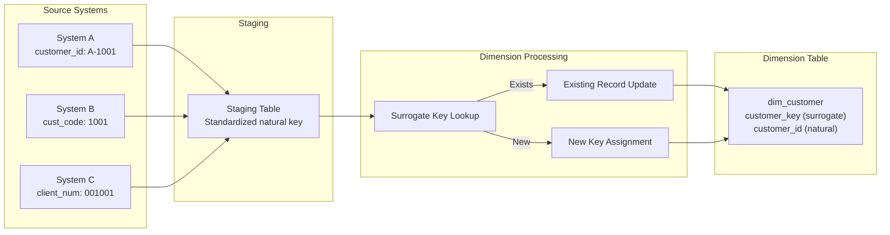

### 11.3 Surrogate Key Lookup Strategies

**Strategy 1: Hash-based lookup (for large dimensions)**
```sql
-- SQL Server: Create a lookup table with hash for fast matching
CREATE TABLE dw.dim_customer_lookup (
    customer_id VARCHAR(20) NOT NULL,
    customer_key INT NOT NULL,
    is_current BIT NOT NULL,
    effective_date DATE NOT NULL,
    expiration_date DATE NOT NULL,
    row_hash BINARY(32) NOT NULL,  -- SHA2_256 of Type 2 attributes
    
    CONSTRAINT pk_customer_lookup PRIMARY KEY (customer_id, effective_date),
    INDEX ix_customer_lookup_current (customer_id) WHERE is_current = 1
);

-- Generate hash for change detection
SELECT 
    customer_id,
    HASHBYTES('SHA2_256', 
        CONCAT(
            ISNULL(address_line1, ''), '|',
            ISNULL(city, ''), '|',
            ISNULL(state, ''), '|',
            ISNULL(postal_code, ''), '|',
            ISNULL(loyalty_tier, '')
        )
    ) AS row_hash
FROM staging.stg_customer;
```

**Strategy 2: Direct join lookup (for smaller dimensions)**
```sql
-- Simple but effective for dimensions under ~1M rows
SELECT 
    stg.*,
    COALESCE(dim.customer_key, -1) AS customer_key  -- -1 for unknown
FROM staging.stg_fact_sales stg
LEFT JOIN dw.dim_customer dim 
    ON stg.customer_id = dim.customer_id
    AND dim.is_current = 1;
```

**Strategy 3: Point-in-time lookup (for late-arriving facts)**
```sql
-- Find the correct historical surrogate key
SELECT 
    stg.*,
    COALESCE(dim.customer_key, -1) AS customer_key
FROM staging.stg_fact_sales stg
LEFT JOIN dw.dim_customer dim 
    ON stg.customer_id = dim.customer_id
    AND stg.transaction_date BETWEEN dim.effective_date AND dim.expiration_date;
```

### 11.4 Unknown and Not Applicable Members

Every dimension should have special rows for handling missing references.

```sql
-- Standard special members
-- Key -1: Unknown (we should know but don't)
-- Key 0: Not Applicable (not relevant to this fact)

-- SQL Server: Insert special members
SET IDENTITY_INSERT dw.dim_customer ON;

INSERT INTO dw.dim_customer (
    customer_key, customer_id, customer_name, email, loyalty_tier,
    address_line1, city, state, postal_code, country,
    original_signup_date, effective_date, expiration_date, 
    is_current, is_inferred, source_system
)
VALUES 
    (-1, 'UNKNOWN', 'Unknown Customer', NULL, 'Unknown',
     NULL, NULL, NULL, NULL, NULL,
     '1900-01-01', '1900-01-01', '9999-12-31', 1, 0, 'SYSTEM'),
    (0, 'N/A', 'Not Applicable', NULL, 'N/A',
     NULL, NULL, NULL, NULL, NULL,
     '1900-01-01', '1900-01-01', '9999-12-31', 1, 0, 'SYSTEM');

SET IDENTITY_INSERT dw.dim_customer OFF;

-- PostgreSQL: Insert special members
INSERT INTO dw.dim_customer (
    customer_key, customer_id, customer_name, email, loyalty_tier,
    address_line1, city, state, postal_code, country,
    original_signup_date, effective_date, expiration_date,
    is_current, is_inferred, source_system
)
OVERRIDING SYSTEM VALUE
VALUES 
    (-1, 'UNKNOWN', 'Unknown Customer', NULL, 'Unknown',
     NULL, NULL, NULL, NULL, NULL,
     '1900-01-01', '1900-01-01', '9999-12-31', TRUE, FALSE, 'SYSTEM'),
    (0, 'N/A', 'Not Applicable', NULL, 'N/A',
     NULL, NULL, NULL, NULL, NULL,
     '1900-01-01', '1900-01-01', '9999-12-31', TRUE, FALSE, 'SYSTEM');
```

### 11.5 Audit Columns

Track metadata about dimension records for debugging and lineage.

```sql
-- Recommended audit columns for dimension tables
CREATE TABLE dw.dim_customer (
    customer_key INT IDENTITY(1,1) NOT NULL,
    customer_id VARCHAR(20) NOT NULL,
    -- ... business attributes ...
    
    -- SCD tracking
    effective_date DATE NOT NULL,
    expiration_date DATE NOT NULL,
    is_current BIT NOT NULL,
    
    -- Audit columns
    created_date DATETIME NOT NULL DEFAULT GETDATE(),
    created_by VARCHAR(100) NOT NULL DEFAULT SYSTEM_USER,
    updated_date DATETIME NOT NULL DEFAULT GETDATE(),
    updated_by VARCHAR(100) NOT NULL DEFAULT SYSTEM_USER,
    source_system VARCHAR(50) NOT NULL,
    source_file VARCHAR(255) NULL,
    batch_id INT NULL,
    row_hash BINARY(32) NULL,  -- For change detection
    is_inferred BIT NOT NULL DEFAULT 0,
    
    CONSTRAINT pk_dim_customer PRIMARY KEY (customer_key)
);
```

---

# Part IV: Case Studies and Common Mistakes

## Chapter 12: Real-World Case Studies

### Case Study 1: Data Anomalies from Poor Normalization

**Industry:** Healthcare  
**Symptoms:** Patient address updates were inconsistent across visits; some visit records showed old addresses while others showed new ones.

**Root Cause Analysis:**
The original design stored patient demographics directly in the visit table:
```sql
-- Original problematic design
CREATE TABLE visits (
    visit_id INT PRIMARY KEY,
    patient_id INT,
    patient_name VARCHAR(100),
    patient_address VARCHAR(200),
    patient_phone VARCHAR(20),
    visit_date DATE,
    diagnosis_code VARCHAR(10)
);
```

When a patient's address changed, only new visits got the updated address. Historical visits retained the old address, but there was no way to distinguish between "this was the address at the time of visit" (correct) vs. "we failed to update this record" (incorrect).

**Solution:**
Normalized to 3NF with clear separation:
```sql
CREATE TABLE patients (
    patient_id INT PRIMARY KEY,
    patient_name VARCHAR(100) NOT NULL,
    current_address VARCHAR(200),
    current_phone VARCHAR(20)
);

CREATE TABLE patient_address_history (
    address_history_id INT PRIMARY KEY,
    patient_id INT FOREIGN KEY REFERENCES patients(patient_id),
    address VARCHAR(200) NOT NULL,
    effective_date DATE NOT NULL,
    end_date DATE
);

CREATE TABLE visits (
    visit_id INT PRIMARY KEY,
    patient_id INT FOREIGN KEY REFERENCES patients(patient_id),
    visit_date DATE NOT NULL,
    diagnosis_code VARCHAR(10)
);
```

**Outcome:**
- 100% address consistency for current patient data
- Clear historical tracking when needed for audits
- Reduced storage by 40% (no address duplication)
- Update operations reduced from O(n) to O(1)

---

### Case Study 2: Query Performance from Over-Normalized OLTP

**Industry:** E-commerce  
**Symptoms:** Product catalog page load times exceeded 3 seconds; database CPU consistently at 90%+.

**Root Cause Analysis:**
The product catalog was normalized to 5NF with 12 tables requiring joins for a single product display:
```sql
-- Over-normalized design (simplified)
SELECT p.name, p.sku, 
       b.brand_name, 
       sc.subcategory_name, c.category_name, d.department_name,
       pr.price, cur.currency_code,
       inv.quantity_available,
       img.image_url,
       -- ... 8 more joins
FROM products p
JOIN brands b ON p.brand_id = b.brand_id
JOIN subcategories sc ON p.subcategory_id = sc.subcategory_id
JOIN categories c ON sc.category_id = c.category_id
JOIN departments d ON c.department_id = d.department_id
JOIN prices pr ON p.product_id = pr.product_id
JOIN currencies cur ON pr.currency_id = cur.currency_id
-- ... 5 more joins
WHERE p.product_id = @product_id;
```

**Solution:**
Created a denormalized product view materialized for read operations:
```sql
-- Materialized product view (SQL Server indexed view)
CREATE VIEW dbo.vw_product_catalog
WITH SCHEMABINDING
AS
SELECT 
    p.product_id,
    p.sku,
    p.name AS product_name,
    b.brand_name,
    c.category_name,
    d.department_name,
    pr.price,
    pr.currency_code,
    inv.quantity_available,
    img.primary_image_url
FROM dbo.products p
JOIN dbo.brands b ON p.brand_id = b.brand_id
JOIN dbo.categories c ON p.category_id = c.category_id
JOIN dbo.departments d ON c.department_id = d.department_id
JOIN dbo.current_prices pr ON p.product_id = pr.product_id
JOIN dbo.inventory inv ON p.product_id = inv.product_id
JOIN dbo.product_images img ON p.product_id = img.product_id AND img.is_primary = 1;

CREATE UNIQUE CLUSTERED INDEX ix_vw_product_catalog 
ON dbo.vw_product_catalog (product_id);
```

**Outcome:**
- Page load time reduced from 3.2s to 180ms (94% improvement)
- Database CPU reduced to 35% average
- Normalized tables retained for write operations and data integrity
- Indexed view automatically maintained by SQL Server

---

### Case Study 3: Incorrect Aggregations from Grain Mismatch

**Industry:** Retail  
**Symptoms:** Weekly sales reports showed totals 3-4x higher than daily reports summed for the week.

**Root Cause Analysis:**
The fact table mixed transaction-level and daily-summary records:
```sql
-- Problematic mixed-grain fact table
SELECT record_type, COUNT(*), SUM(sales_amount)
FROM fact_sales
GROUP BY record_type;

-- Results:
-- TRANSACTION    1,234,567    $45,000,000
-- DAILY_SUMMARY     365        $45,000,000  -- Same total, duplicated!
```

Daily summary records were loaded for reconciliation but stored in the same table. Simple SUM queries double-counted everything.

**Solution:**
Separated into distinct fact tables with clear grain definitions:
```sql
-- Transaction-level fact (atomic grain)
CREATE TABLE dw.fact_sales_transaction (
    date_key INT NOT NULL,
    product_key INT NOT NULL,
    store_key INT NOT NULL,
    customer_key INT NOT NULL,
    transaction_id VARCHAR(20) NOT NULL,
    line_number INT NOT NULL,
    quantity INT NOT NULL,
    sales_amount DECIMAL(12,2) NOT NULL,
    CONSTRAINT pk_fact_sales_trans 
        PRIMARY KEY (date_key, transaction_id, line_number)
);
-- Grain: One row per line item per transaction

-- Daily aggregate fact (for reconciliation and fast daily queries)
CREATE TABLE dw.fact_sales_daily (
    date_key INT NOT NULL,
    store_key INT NOT NULL,
    transaction_count INT NOT NULL,
    line_item_count INT NOT NULL,
    total_quantity INT NOT NULL,
    total_sales_amount DECIMAL(14,2) NOT NULL,
    total_cost_amount DECIMAL(14,2) NOT NULL,
    total_profit_amount DECIMAL(14,2) NOT NULL,
    CONSTRAINT pk_fact_sales_daily PRIMARY KEY (date_key, store_key)
);
-- Grain: One row per store per day

-- Reconciliation query to verify consistency
SELECT 
    'Transaction Detail' AS source,
    SUM(sales_amount) AS total_sales
FROM dw.fact_sales_transaction
WHERE date_key BETWEEN 20240101 AND 20240107
UNION ALL
SELECT 
    'Daily Summary' AS source,
    SUM(total_sales_amount) AS total_sales
FROM dw.fact_sales_daily
WHERE date_key BETWEEN 20240101 AND 20240107;
```

**Outcome:**
- Report discrepancies eliminated immediately
- Clear documentation of grain for each fact table
- Users understood which table to query for which purpose
- ETL included automated reconciliation checks between tables

---

### Case Study 4: Historical Reporting Failures from Missing SCD

**Industry:** Financial Services  
**Symptoms:** Customer profitability reports for prior quarters showed customers in segments they weren't in at that time; compliance audits flagged historical inaccuracies.

**Root Cause Analysis:**
The customer dimension used Type 1 (overwrite) for all attributes, including customer segment and risk rating:
```sql
-- All historical facts now join to current customer attributes
SELECT 
    d.quarter_name,
    c.customer_segment,  -- Always shows CURRENT segment
    SUM(f.revenue) AS total_revenue
FROM fact_transactions f
JOIN dim_customer c ON f.customer_key = c.customer_key
JOIN dim_date d ON f.date_key = d.date_key
GROUP BY d.quarter_name, c.customer_segment;
```

A customer who was "Small Business" in Q1 but upgraded to "Enterprise" in Q3 would show as "Enterprise" for all historical quarters.

**Solution:**
Implemented SCD Type 2 for segment and risk rating:
```sql
-- Converted to Type 2 with historical tracking
ALTER TABLE dw.dim_customer ADD effective_date DATE NOT NULL DEFAULT '1900-01-01';
ALTER TABLE dw.dim_customer ADD expiration_date DATE NOT NULL DEFAULT '9999-12-31';
ALTER TABLE dw.dim_customer ADD is_current BIT NOT NULL DEFAULT 1;

-- Migrated existing data (simplified)
UPDATE dw.dim_customer
SET effective_date = created_date,
    expiration_date = '9999-12-31',
    is_current = 1;

-- Historical analysis now uses point-in-time joins
SELECT 
    d.quarter_name,
    c.customer_segment,  -- Shows segment AS OF transaction date
    SUM(f.revenue) AS total_revenue
FROM fact_transactions f
JOIN dim_customer c ON f.customer_key = c.customer_key
JOIN dim_date d ON f.date_key = d.date_key
GROUP BY d.quarter_name, c.customer_segment;
```

**Outcome:**
- Historical reports now accurately reflect point-in-time customer state
- Compliance audit passed with no findings
- Trend analysis correctly shows segment migration patterns
- Implemented SCD type documentation for all dimension attributes

---

### Case Study 5: ETL Failures from Late-Arriving Dimensions

**Industry:** E-commerce  
**Symptoms:** Nightly ETL jobs failed 2-3 times per week with foreign key violations; orders from new marketplace channel couldn't be loaded.

**Root Cause Analysis:**
Orders from a new marketplace integration arrived before the product master data sync completed. The ETL enforced referential integrity but had no strategy for missing products:
```sql
-- ETL would fail on this insert
INSERT INTO fact_orders (date_key, product_key, customer_key, order_amount)
SELECT 
    date_key,
    p.product_key,  -- NULL when product not found!
    c.customer_key,
    order_amount
FROM staging.orders o
JOIN dim_product p ON o.product_id = p.product_id  -- INNER JOIN fails silently
JOIN dim_customer c ON o.customer_id = c.customer_id;
-- Products from marketplace not yet in dim_product are silently dropped
```

When the team added NOT NULL constraints, the ETL started failing loudly—which was actually better because it revealed the underlying issue.

**Solution:**
Implemented comprehensive late-arriving dimension handling:
```sql
-- 1. Added inferred member support
ALTER TABLE dw.dim_product ADD is_inferred BIT NOT NULL DEFAULT 0;

-- 2. Created "Unknown" product member
SET IDENTITY_INSERT dw.dim_product ON;
INSERT INTO dw.dim_product (product_key, product_id, product_name, category, is_inferred)
VALUES (-1, 'UNKNOWN', 'Unknown Product', 'Unknown', 0);
SET IDENTITY_INSERT dw.dim_product OFF;

-- 3. Modified ETL to handle missing products
INSERT INTO fact_orders (date_key, product_key, customer_key, order_amount)
SELECT 
    date_key,
    COALESCE(p.product_key, inferred.product_key, -1) AS product_key,
    COALESCE(c.customer_key, -1) AS customer_key,
    order_amount
FROM staging.orders o
LEFT JOIN dim_product p ON o.product_id = p.product_id AND p.is_current = 1
LEFT JOIN dim_product inferred ON o.product_id = inferred.product_id AND inferred.is_inferred = 1
LEFT JOIN dim_customer c ON o.customer_id = c.customer_id AND c.is_current = 1;

-- 4. Created process to generate inferred members for new product IDs
INSERT INTO dw.dim_product (product_id, product_name, category, is_inferred, created_date)
SELECT DISTINCT
    o.product_id,
    'Pending - ' + o.product_id,
    'Pending',
    1,
    GETDATE()
FROM staging.orders o
WHERE NOT EXISTS (
    SELECT 1 FROM dw.dim_product p WHERE p.product_id = o.product_id
);

-- 5. Created monitoring for inferred members
CREATE VIEW dw.vw_inferred_members_monitor AS
SELECT 
    'Product' AS dimension_name,
    product_id AS natural_key,
    created_date,
    DATEDIFF(DAY, created_date, GETDATE()) AS days_pending
FROM dw.dim_product
WHERE is_inferred = 1
UNION ALL
SELECT 
    'Customer' AS dimension_name,
    customer_id AS natural_key,
    created_date,
    DATEDIFF(DAY, created_date, GETDATE()) AS days_pending
FROM dw.dim_customer
WHERE is_inferred = 1;
```

**Outcome:**
- ETL failures reduced from 2-3 per week to zero
- All orders captured immediately, even with missing dimension data
- Dashboard for monitoring inferred members with alerts for items pending > 3 days
- Product team incentivized to improve master data sync timing

---

## Chapter 13: Common Mistakes and How to Fix Them

### Mistake 1: Confusing Normalization Rules

**The Mistake:** Thinking 3NF eliminates all redundancy, or that higher normal forms are always better.

**Detection:**
```sql
-- Check for remaining redundancy in "normalized" tables
SELECT 
    department_id, 
    COUNT(DISTINCT department_name) AS name_count,
    COUNT(DISTINCT department_manager) AS manager_count
FROM employees
GROUP BY department_id
HAVING COUNT(DISTINCT department_name) > 1 
    OR COUNT(DISTINCT department_manager) > 1;
-- If results returned, you have transitive dependencies
```

**Prevention:**
- Document functional dependencies before designing tables
- Verify each non-key column depends on the key, the whole key, and nothing but the key
- Remember: 3NF still allows redundancy in dimension tables (and that's often intentional)

---

### Mistake 2: Using Natural Keys in Data Warehouses

**The Mistake:** Using business identifiers (email, SSN, product SKU) as primary keys in dimension tables.

**Detection:**
```sql
-- Check for string or composite primary keys in dimensions
SELECT 
    t.TABLE_NAME,
    c.COLUMN_NAME,
    c.DATA_TYPE
FROM INFORMATION_SCHEMA.TABLE_CONSTRAINTS tc
JOIN INFORMATION_SCHEMA.KEY_COLUMN_USAGE c 
    ON tc.CONSTRAINT_NAME = c.CONSTRAINT_NAME
JOIN INFORMATION_SCHEMA.TABLES t 
    ON tc.TABLE_NAME = t.TABLE_NAME
WHERE tc.CONSTRAINT_TYPE = 'PRIMARY KEY'
  AND t.TABLE_NAME LIKE 'dim_%'
  AND c.DATA_TYPE NOT IN ('int', 'bigint');
```

**Why It's a Problem:**
- Natural keys can change (email address, product SKU restructure)
- Composite natural keys create large fact table foreign keys
- SCD Type 2 requires surrogate keys (same natural key, multiple rows)

**Fix:**
```sql
-- Add surrogate key and demote natural key to alternate key
ALTER TABLE dim_customer ADD customer_key INT IDENTITY(1,1);
ALTER TABLE dim_customer DROP CONSTRAINT pk_dim_customer;
ALTER TABLE dim_customer ADD CONSTRAINT pk_dim_customer PRIMARY KEY (customer_key);
ALTER TABLE dim_customer ADD CONSTRAINT uq_dim_customer_email UNIQUE (email);
```

---

### Mistake 3: Mixed Grain in Fact Tables

**The Mistake:** Storing rows at different levels of detail in the same fact table.

**Detection:**
```sql
-- Look for suspicious patterns
SELECT 
    CASE WHEN transaction_id IS NULL THEN 'Summary' ELSE 'Detail' END AS row_type,
    COUNT(*) AS row_count,
    SUM(sales_amount) AS total_sales
FROM fact_sales
GROUP BY CASE WHEN transaction_id IS NULL THEN 'Summary' ELSE 'Detail' END;

-- Check for NULL foreign keys that shouldn't be NULL
SELECT 
    COUNT(*) AS total_rows,
    SUM(CASE WHEN customer_key IS NULL THEN 1 ELSE 0 END) AS null_customer,
    SUM(CASE WHEN product_key IS NULL THEN 1 ELSE 0 END) AS null_product
FROM fact_sales;
```

**Prevention:**
- Document grain explicitly: "One row represents ___"
- Enforce NOT NULL on all dimension foreign keys
- Create separate fact tables for different grains

---

### Mistake 4: SCD Type 2 Without Proper Dating

**The Mistake:** Implementing SCD Type 2 without effective/expiration dates or current flags.

**Detection:**
```sql
-- Check for missing SCD columns
SELECT COLUMN_NAME
FROM INFORMATION_SCHEMA.COLUMNS
WHERE TABLE_NAME = 'dim_customer'
  AND COLUMN_NAME IN ('effective_date', 'expiration_date', 'is_current');
-- Should return 3 rows

-- Check for overlapping effective date ranges
SELECT 
    d1.customer_id,
    d1.customer_key AS key1,
    d2.customer_key AS key2,
    d1.effective_date AS eff1,
    d1.expiration_date AS exp1,
    d2.effective_date AS eff2
FROM dim_customer d1
JOIN dim_customer d2 
    ON d1.customer_id = d2.customer_id
    AND d1.customer_key < d2.customer_key
    AND d1.expiration_date >= d2.effective_date;
-- Should return no rows
```

**Fix:**
```sql
-- Add proper SCD columns
ALTER TABLE dim_customer ADD effective_date DATE NOT NULL DEFAULT '1900-01-01';
ALTER TABLE dim_customer ADD expiration_date DATE NOT NULL DEFAULT '9999-12-31';
ALTER TABLE dim_customer ADD is_current BIT NOT NULL DEFAULT 1;

-- Add constraint to prevent overlaps
-- (Complex - often enforced in ETL rather than constraints)

-- Create index for efficient lookups
CREATE INDEX ix_dim_customer_scd 
ON dim_customer (customer_id, effective_date, expiration_date);
```

---

### Mistake 5: Creating "Monster Dimensions"

**The Mistake:** Putting all possible attributes in one massive dimension instead of using junk dimensions, outriggers, or proper separation.

**Detection:**
```sql
-- Check for dimensions with excessive columns
SELECT 
    TABLE_NAME,
    COUNT(*) AS column_count
FROM INFORMATION_SCHEMA.COLUMNS
WHERE TABLE_SCHEMA = 'dw' AND TABLE_NAME LIKE 'dim_%'
GROUP BY TABLE_NAME
HAVING COUNT(*) > 50
ORDER BY column_count DESC;

-- Check for low-cardinality columns that should be junk dimensions
SELECT 
    'is_gift' AS column_name, COUNT(DISTINCT is_gift) AS distinct_values
FROM dim_order
UNION ALL
SELECT 'is_rush', COUNT(DISTINCT is_rush) FROM dim_order
UNION ALL
SELECT 'is_wrapped', COUNT(DISTINCT is_wrapped) FROM dim_order
UNION ALL
SELECT 'payment_type', COUNT(DISTINCT payment_type) FROM dim_order;
-- Columns with <10 distinct values are candidates for junk dimension
```

**Fix:** Extract low-cardinality attributes into a junk dimension (see Chapter 7.3).

---

### Mistake 6: Allowing NULLs in Fact Table Foreign Keys

**The Mistake:** Permitting NULL values in dimension key columns instead of using proper Unknown/NA members.

**Detection:**
```sql
-- Find NULL foreign keys in fact tables
SELECT 
    'fact_sales' AS table_name,
    SUM(CASE WHEN date_key IS NULL THEN 1 ELSE 0 END) AS null_date,
    SUM(CASE WHEN product_key IS NULL THEN 1 ELSE 0 END) AS null_product,
    SUM(CASE WHEN customer_key IS NULL THEN 1 ELSE 0 END) AS null_customer,
    SUM(CASE WHEN store_key IS NULL THEN 1 ELSE 0 END) AS null_store
FROM dw.fact_sales;
```

**Why It's a Problem:**
- NULL keys don't join to dimension tables, silently dropping facts from queries
- Inconsistent behavior across BI tools
- Harder to distinguish "unknown" from "not applicable"

**Fix:**
```sql
-- 1. Create Unknown members in each dimension (key = -1)
-- 2. Update existing NULLs
UPDATE dw.fact_sales SET customer_key = -1 WHERE customer_key IS NULL;

-- 3. Add NOT NULL constraints
ALTER TABLE dw.fact_sales ALTER COLUMN customer_key INT NOT NULL;

-- 4. Modify ETL to use COALESCE
INSERT INTO dw.fact_sales (customer_key, ...)
SELECT COALESCE(dim.customer_key, -1), ...
FROM staging.stg_sales stg
LEFT JOIN dw.dim_customer dim ON stg.customer_id = dim.customer_id;
```

---

### Mistake 7: Ignoring Inferred Members Until Production Failures

**The Mistake:** Not planning for late-arriving dimensions until ETL fails in production.

**Detection:** ETL failure logs showing foreign key violations or missing dimension lookups.

**Prevention Checklist:**
- [ ] Every dimension has Unknown (key = -1) and N/A (key = 0) members
- [ ] Every dimension has `is_inferred` flag column
- [ ] ETL uses LEFT JOIN with COALESCE to default missing keys
- [ ] Process exists to create inferred members for new natural keys
- [ ] Process exists to update inferred members when real data arrives
- [ ] Monitoring dashboard shows count and age of inferred members

---

# Part V: ER Diagram Notation Guide

## Entity-Relationship Notation Comparison

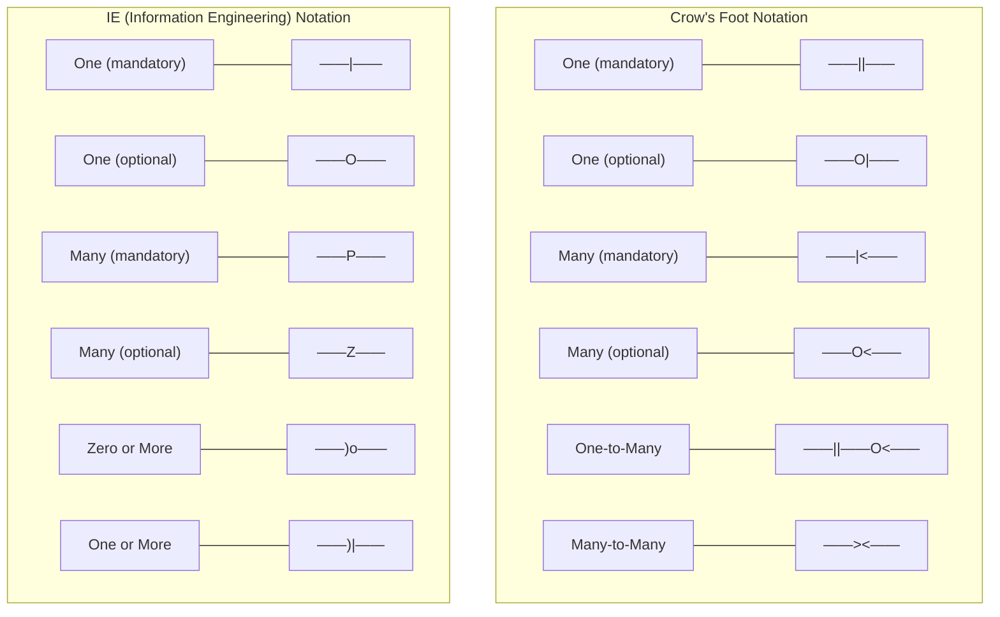

### Notation Symbol Reference

| Relationship | Crow's Foot | IE Notation | Meaning |
|--------------|-------------|-------------|---------|
| Exactly one (mandatory) | `\|\|` | `\|` | Must have exactly one |
| Zero or one (optional) | `O\|` | `O` | May have zero or one |
| One or many (mandatory) | `\|<` or `>` | `P` or `)\|` | Must have at least one |
| Zero or many (optional) | `O<` or `O>` | `Z` or `)O` | May have zero to many |

### Reading Relationships

Always read relationships from both directions:

```
CUSTOMER ||--o< ORDER
```
- One CUSTOMER **may place** zero or many ORDERs
- One ORDER **must belong to** exactly one CUSTOMER

```
STUDENT >o--o< COURSE (via enrollment bridge)
```
- One STUDENT **may enroll in** zero or many COURSEs
- One COURSE **may have** zero or many STUDENTs

---

# Part VI: Practical Decision Frameworks

## Framework 1: Determining Appropriate Normal Form

```
Step 1: Identify the system type
├── OLTP (transactional) → Target 3NF/BCNF
├── OLAP (analytical) → Dimensional model (denormalized)
├── Hybrid → Normalize source, denormalize for reporting
└── Reference data → 3NF with potential read optimization

Step 2: For OLTP systems, normalize progressively
├── Start: Identify all functional dependencies
├── 1NF: Eliminate repeating groups, ensure atomic values
├── 2NF: Remove partial dependencies (if composite keys)
├── 3NF: Remove transitive dependencies
├── BCNF: Ensure all determinants are candidate keys
└── Stop when further normalization creates unacceptable query complexity

Step 3: Consider controlled denormalization when
├── Read:write ratio exceeds 10:1
├── Specific queries are performance-critical
├── Calculated aggregates are frequently needed
└── Always document denormalization decisions!
```

## Framework 2: Natural vs. Surrogate Key Decision

```
Use SURROGATE KEY if ANY of these are true:
├── Building a data warehouse dimension
├── Implementing SCD Type 2
├── Natural key is composite (>2 columns)
├── Natural key is large (>20 bytes)
├── Natural key can change
├── Integrating multiple source systems
├── Natural key contains sensitive data (PII)
└── Natural key format varies across sources

Use NATURAL KEY if ALL of these are true:
├── Value is truly immutable forever
├── Value is universally standardized (ISO codes)
├── Value is compact (<=10 bytes)
├── System is standalone (no integration needs)
├── Human readability is essential
└── Table is small reference data (<10K rows)
```

## Framework 3: Grain Definition Checklist

```
□ Can you complete this sentence clearly?
  "One row in this fact table represents exactly one ___________"
  
□ Is the grain atomic (lowest meaningful level)?
  If not, document why aggregation is acceptable.
  
□ Are ALL dimension foreign keys NOT NULL at this grain?
  If some are NULL, you may have mixed grain.
  
□ Do all measures make sense at this grain?
  Semi-additive measures may indicate snapshot grain.
  
□ Is the grain documented in metadata?
  Include: table name, grain statement, example row interpretation
  
□ Does the ETL enforce grain integrity?
  Include: duplicate detection, grain violation alerting
```

## Framework 4: SCD Type Selection by Attribute

```
For each dimension attribute, ask:

1. Does history matter for this attribute?
   NO → Type 1 (overwrite)
   YES → Continue to question 2

2. Is this a correction of bad data or a true business change?
   Correction → Type 1 (overwrite)
   True change → Continue to question 3

3. How much history do you need?
   Current + immediately previous only → Type 3 (previous column)
   Full history → Type 2 (new row)

4. Do you need easy access to current value from historical rows?
   YES → Type 6 (hybrid: Type 2 + current value columns)
   NO → Type 2 is sufficient

5. Is this attribute high-frequency change (multiple times per day)?
   YES → Consider mini-dimension pattern (Type 4)
   NO → Standard Type 2

Special cases:
- Original/fixed values (birth date, signup date) → Type 0
- Values that should never exist historically → Type 1
```

## Framework 5: Reviewing ERD for Anti-Patterns

```
□ Check dimension tables:
  ├── Has surrogate key as primary key?
  ├── Has natural key preserved as alternate key?
  ├── Has SCD tracking columns (if needed)?
  ├── Has Unknown/NA special members?
  └── Column count reasonable (<75)?

□ Check fact tables:
  ├── Grain clearly defined?
  ├── All FK columns NOT NULL?
  ├── All FKs reference dimension PKs?
  ├── Measures are appropriate type (additive, semi, non)?
  └── No mixed grain indicators?

□ Check relationships:
  ├── All fact-to-dim relationships are many-to-one?
  ├── Any many-to-many resolved with bridge tables?
  ├── Self-referencing relationships have NULL FK for root?
  └── Role-playing dimensions clearly named?

□ Check naming conventions:
  ├── Consistent prefix (dim_, fact_, bridge_)?
  ├── Keys follow pattern (_key suffix)?
  ├── Constraints named systematically?
  └── No reserved words or special characters?
```

---

# Part VII: Capstone Project — Retail Data Warehouse

## Project Specification

### Business Context

**Company Profile:**
RetailCo is a mid-sized retail chain operating in the United States with:
- 200 physical store locations across 35 states
- Growing e-commerce channel (launched 2 years ago)
- 50,000 active SKUs across 12 product departments
- 2.5 million loyalty program members
- 15 million transactions per month (peak: holiday season at 25M)

**Current Challenges:**
1. Customer analytics rely on spreadsheets with inconsistent data
2. No historical tracking of customer attributes (loyalty tier, address)
3. Promotion effectiveness analysis takes 2 weeks to produce
4. Inventory reports don't reconcile between systems
5. E-commerce orders often arrive before customer records are synchronized

**Project Goals:**
1. Build an enterprise data warehouse supporting historical analysis
2. Enable customer behavior tracking with full address/tier history
3. Support promotion effectiveness analysis with coverage tracking
4. Provide daily inventory snapshots for supply chain planning
5. Handle late-arriving e-commerce data gracefully

---

### Complete ER Diagram

```mermaid
erDiagram
    FACT_SALES ||--o{ DIM_DATE : "date_key"
    FACT_SALES ||--o{ DIM_TIME : "time_key"
    FACT_SALES ||--o{ DIM_PRODUCT : "product_key"
    FACT_SALES ||--o{ DIM_STORE : "store_key"
    FACT_SALES ||--o{ DIM_CUSTOMER : "customer_key"
    FACT_SALES ||--o{ DIM_PROMOTION : "promotion_key"
    FACT_SALES ||--o{ DIM_JUNK_TRANSACTION : "transaction_flag_key"
    
    FACT_INVENTORY_SNAPSHOT ||--o{ DIM_DATE : "date_key"
    FACT_INVENTORY_SNAPSHOT ||--o{ DIM_PRODUCT : "product_key"
    FACT_INVENTORY_SNAPSHOT ||--o{ DIM_STORE : "store_key"
    
    FACT_PROMOTION_COVERAGE ||--o{ DIM_DATE : "date_key"
    FACT_PROMOTION_COVERAGE ||--o{ DIM_PRODUCT : "product_key"
    FACT_PROMOTION_COVERAGE ||--o{ DIM_STORE : "store_key"
    FACT_PROMOTION_COVERAGE ||--o{ DIM_PROMOTION : "promotion_key"
    
    BRIDGE_PRODUCT_CATEGORY ||--o{ DIM_PRODUCT : "product_key"
    BRIDGE_PRODUCT_CATEGORY ||--o{ DIM_CATEGORY : "category_key"
    
    FACT_SALES {
        int date_key FK
        int time_key FK
        int product_key FK
        int store_key FK
        int customer_key FK
        int promotion_key FK
        int transaction_flag_key FK
        varchar transaction_id DD
        int line_number DD
        int quantity
        decimal unit_price
        decimal unit_cost
        decimal discount_amount
        decimal net_sales_amount
        decimal gross_profit_amount
    }
    
    FACT_INVENTORY_SNAPSHOT {
        int date_key FK
        int product_key FK
        int store_key FK
        int quantity_on_hand
        int quantity_on_order
        int quantity_reserved
        int reorder_point
        decimal inventory_value_cost
        decimal inventory_value_retail
    }
    
    FACT_PROMOTION_COVERAGE {
        int date_key FK
        int product_key FK
        int store_key FK
        int promotion_key FK
    }
    
    DIM_DATE {
        int date_key PK
        date full_date
        int day_of_week
        string day_name
        int month_number
        string month_name
        int quarter_number
        int year_number
        int fiscal_month
        int fiscal_quarter
        int fiscal_year
        boolean is_weekend
        boolean is_holiday
    }
    
    DIM_TIME {
        int time_key PK
        time full_time
        int hour_24
        int hour_12
        string am_pm
        int minute
        string time_band
    }
    
    DIM_PRODUCT {
        int product_key PK
        string product_id NK
        string product_name
        string brand
        string department
        decimal unit_cost
        decimal unit_price
        date effective_date
        date expiration_date
        boolean is_current
        boolean is_inferred
    }
    
    DIM_STORE {
        int store_key PK
        string store_id NK
        string store_name
        string store_type
        string address
        string city
        string state
        string region
        string store_manager
        date effective_date
        date expiration_date
        boolean is_current
    }
    
    DIM_CUSTOMER {
        int customer_key PK
        string customer_id NK
        string customer_name
        string email
        string phone
        string address_line1
        string city
        string state
        string postal_code
        string loyalty_tier
        string customer_segment
        date original_signup_date
        date effective_date
        date expiration_date
        boolean is_current
        boolean is_inferred
    }
    
    DIM_PROMOTION {
        int promotion_key PK
        string promotion_id NK
        string promotion_name
        string promotion_type
        decimal discount_percent
        decimal discount_amount
        date start_date
        date end_date
    }
    
    DIM_JUNK_TRANSACTION {
        int transaction_flag_key PK
        boolean is_online
        boolean is_return
        boolean is_gift
        boolean is_employee_purchase
        string payment_type
        string fulfillment_type
    }
    
    DIM_CATEGORY {
        int category_key PK
        string category_id NK
        string category_name
        string category_level1
        string category_level2
        string category_level3
    }
    
    BRIDGE_PRODUCT_CATEGORY {
        int product_category_group_key
        int product_key FK
        int category_key FK
        decimal weighting_factor
    }
```

---

### DDL Scripts

#### SQL Server Implementation

```sql
-- =====================================================
-- RETAIL DATA WAREHOUSE - SQL SERVER DDL
-- =====================================================

-- Create schema
CREATE SCHEMA dw AUTHORIZATION dbo;
GO

-- =====================================================
-- DIMENSION TABLES
-- =====================================================

-- DIM_DATE (Role-playing dimension for all date references)
CREATE TABLE dw.dim_date (
    date_key INT NOT NULL,
    full_date DATE NOT NULL,
    day_of_week TINYINT NOT NULL,
    day_name VARCHAR(10) NOT NULL,
    day_name_short CHAR(3) NOT NULL,
    day_of_month TINYINT NOT NULL,
    day_of_year SMALLINT NOT NULL,
    week_of_year TINYINT NOT NULL,
    month_number TINYINT NOT NULL,
    month_name VARCHAR(10) NOT NULL,
    month_name_short CHAR(3) NOT NULL,
    quarter_number TINYINT NOT NULL,
    quarter_name CHAR(2) NOT NULL,
    year_number SMALLINT NOT NULL,
    fiscal_month TINYINT NOT NULL,
    fiscal_quarter TINYINT NOT NULL,
    fiscal_year SMALLINT NOT NULL,
    is_weekend BIT NOT NULL,
    is_holiday BIT NOT NULL,
    holiday_name VARCHAR(50) NULL,
    
    CONSTRAINT pk_dim_date PRIMARY KEY (date_key),
    CONSTRAINT uq_dim_date_full UNIQUE (full_date),
    CONSTRAINT chk_dim_date_key CHECK (date_key >= 19000101 AND date_key <= 99991231)
);

-- DIM_TIME (Time of day dimension)
CREATE TABLE dw.dim_time (
    time_key INT NOT NULL,  -- HHMMSS format
    full_time TIME NOT NULL,
    hour_24 TINYINT NOT NULL,
    hour_12 TINYINT NOT NULL,
    am_pm CHAR(2) NOT NULL,
    minute TINYINT NOT NULL,
    second TINYINT NOT NULL,
    time_band VARCHAR(20) NOT NULL,  -- Morning, Afternoon, Evening, Night
    
    CONSTRAINT pk_dim_time PRIMARY KEY (time_key),
    CONSTRAINT uq_dim_time_full UNIQUE (full_time),
    CONSTRAINT chk_dim_time_hour CHECK (hour_24 BETWEEN 0 AND 23),
    CONSTRAINT chk_dim_time_minute CHECK (minute BETWEEN 0 AND 59)
);

-- DIM_CUSTOMER (SCD Type 2 for address, loyalty_tier, segment)
CREATE TABLE dw.dim_customer (
    customer_key INT IDENTITY(1,1) NOT NULL,
    customer_id VARCHAR(20) NOT NULL,
    
    -- Type 1 attributes (overwrite on change)
    customer_name VARCHAR(100) NOT NULL,
    email VARCHAR(255) NULL,
    phone VARCHAR(20) NULL,
    
    -- Type 2 attributes (track full history)
    address_line1 VARCHAR(200) NULL,
    address_line2 VARCHAR(200) NULL,
    city VARCHAR(100) NULL,
    state VARCHAR(50) NULL,
    postal_code VARCHAR(20) NULL,
    country VARCHAR(50) NOT NULL DEFAULT 'USA',
    loyalty_tier VARCHAR(20) NOT NULL,
    customer_segment VARCHAR(50) NULL,
    
    -- Type 0 attribute (never changes)
    original_signup_date DATE NOT NULL,
    signup_channel VARCHAR(20) NOT NULL,
    
    -- SCD Type 2 tracking
    effective_date DATE NOT NULL,
    expiration_date DATE NOT NULL,
    is_current BIT NOT NULL,
    -- Audit and special handling
    is_inferred BIT NOT NULL DEFAULT 0,
    created_date DATETIME NOT NULL DEFAULT GETDATE(),
    updated_date DATETIME NOT NULL DEFAULT GETDATE(),
    source_system VARCHAR(50) NOT NULL,
    row_hash VARBINARY(32) NULL,
    
    CONSTRAINT pk_dim_customer PRIMARY KEY (customer_key),
    CONSTRAINT chk_dim_customer_dates CHECK (expiration_date >= effective_date),
    CONSTRAINT chk_dim_customer_loyalty CHECK (loyalty_tier IN ('Bronze', 'Silver', 'Gold', 'Platinum', 'Unknown', 'N/A'))
);

-- Indexes for dim_customer
CREATE NONCLUSTERED INDEX ix_dim_customer_natural 
    ON dw.dim_customer (customer_id, is_current) INCLUDE (customer_key);
CREATE NONCLUSTERED INDEX ix_dim_customer_lookup 
    ON dw.dim_customer (customer_id, effective_date, expiration_date) INCLUDE (customer_key);
CREATE NONCLUSTERED INDEX ix_dim_customer_inferred 
    ON dw.dim_customer (is_inferred) WHERE is_inferred = 1;

-- DIM_PRODUCT (SCD Type 1 for corrections, with hierarchy)
CREATE TABLE dw.dim_product (
    product_key INT IDENTITY(1,1) NOT NULL,
    product_id VARCHAR(20) NOT NULL,
    
    -- Descriptive attributes (Type 1 - corrections only)
    product_name VARCHAR(200) NOT NULL,
    product_description VARCHAR(1000) NULL,
    brand VARCHAR(100) NULL,
    
    -- Hierarchy (denormalized for star schema)
    department VARCHAR(50) NOT NULL,
    department_id VARCHAR(10) NOT NULL,
    subdepartment VARCHAR(50) NULL,
    
    -- Pricing (Type 1)
    unit_cost DECIMAL(10,2) NOT NULL,
    unit_price DECIMAL(10,2) NOT NULL,
    
    -- Product attributes
    size VARCHAR(20) NULL,
    color VARCHAR(30) NULL,
    weight_kg DECIMAL(8,3) NULL,
    is_active BIT NOT NULL DEFAULT 1,
    
    -- SCD tracking (minimal - mostly Type 1)
    effective_date DATE NOT NULL,
    expiration_date DATE NOT NULL DEFAULT '9999-12-31',
    is_current BIT NOT NULL DEFAULT 1,
    
    -- Audit
    is_inferred BIT NOT NULL DEFAULT 0,
    created_date DATETIME NOT NULL DEFAULT GETDATE(),
    updated_date DATETIME NOT NULL DEFAULT GETDATE(),
    source_system VARCHAR(50) NOT NULL,
    
    CONSTRAINT pk_dim_product PRIMARY KEY (product_key),
    CONSTRAINT chk_dim_product_price CHECK (unit_price >= 0 AND unit_cost >= 0)
);

CREATE NONCLUSTERED INDEX ix_dim_product_natural 
    ON dw.dim_product (product_id, is_current) INCLUDE (product_key);
CREATE NONCLUSTERED INDEX ix_dim_product_department 
    ON dw.dim_product (department) INCLUDE (product_key, product_name);

-- DIM_STORE (SCD Type 2 for manager, store_type changes)
CREATE TABLE dw.dim_store (
    store_key INT IDENTITY(1,1) NOT NULL,
    store_id VARCHAR(10) NOT NULL,
    
    -- Type 1 attributes
    store_name VARCHAR(100) NOT NULL,
    phone VARCHAR(20) NULL,
    
    -- Type 2 attributes
    store_type VARCHAR(30) NOT NULL,  -- Flagship, Standard, Express, Outlet
    store_manager VARCHAR(100) NULL,
    square_footage INT NULL,
    
    -- Location (Type 2 - tracks relocations)
    address_line1 VARCHAR(200) NOT NULL,
    address_line2 VARCHAR(200) NULL,
    city VARCHAR(100) NOT NULL,
    state CHAR(2) NOT NULL,
    postal_code VARCHAR(10) NOT NULL,
    country VARCHAR(50) NOT NULL DEFAULT 'USA',
    region VARCHAR(50) NOT NULL,
    district VARCHAR(50) NULL,
    latitude DECIMAL(9,6) NULL,
    longitude DECIMAL(9,6) NULL,
    timezone VARCHAR(50) NOT NULL,
    
    -- Store attributes
    open_date DATE NOT NULL,
    close_date DATE NULL,
    is_ecommerce BIT NOT NULL DEFAULT 0,
    
    -- SCD Type 2 tracking
    effective_date DATE NOT NULL,
    expiration_date DATE NOT NULL DEFAULT '9999-12-31',
    is_current BIT NOT NULL DEFAULT 1,
    
    -- Audit
    created_date DATETIME NOT NULL DEFAULT GETDATE(),
    updated_date DATETIME NOT NULL DEFAULT GETDATE(),
    source_system VARCHAR(50) NOT NULL,
    
    CONSTRAINT pk_dim_store PRIMARY KEY (store_key),
    CONSTRAINT chk_dim_store_dates CHECK (expiration_date >= effective_date),
    CONSTRAINT chk_dim_store_type CHECK (store_type IN ('Flagship', 'Standard', 'Express', 'Outlet', 'Ecommerce', 'Unknown'))
);

CREATE NONCLUSTERED INDEX ix_dim_store_natural 
    ON dw.dim_store (store_id, is_current) INCLUDE (store_key);
CREATE NONCLUSTERED INDEX ix_dim_store_region 
    ON dw.dim_store (region, state) INCLUDE (store_key, store_name);

-- DIM_PROMOTION (Type 1 - corrections only, no history needed)
CREATE TABLE dw.dim_promotion (
    promotion_key INT IDENTITY(1,1) NOT NULL,
    promotion_id VARCHAR(20) NOT NULL,
    
    promotion_name VARCHAR(200) NOT NULL,
    promotion_description VARCHAR(1000) NULL,
    promotion_type VARCHAR(50) NOT NULL,  -- Percentage, Fixed Amount, BOGO, Bundle
    
    -- Discount details
    discount_percent DECIMAL(5,2) NULL,
    discount_amount DECIMAL(10,2) NULL,
    minimum_purchase DECIMAL(10,2) NULL,
    
    -- Validity period
    start_date DATE NOT NULL,
    end_date DATE NOT NULL,
    
    -- Targeting
    is_storewide BIT NOT NULL DEFAULT 0,
    is_loyalty_exclusive BIT NOT NULL DEFAULT 0,
    required_loyalty_tier VARCHAR(20) NULL,
    
    -- Audit
    created_date DATETIME NOT NULL DEFAULT GETDATE(),
    updated_date DATETIME NOT NULL DEFAULT GETDATE(),
    source_system VARCHAR(50) NOT NULL,
    
    CONSTRAINT pk_dim_promotion PRIMARY KEY (promotion_key),
    CONSTRAINT uq_dim_promotion_natural UNIQUE (promotion_id),
    CONSTRAINT chk_dim_promotion_dates CHECK (end_date >= start_date),
    CONSTRAINT chk_dim_promotion_discount CHECK (discount_percent IS NULL OR discount_percent BETWEEN 0 AND 100)
);

-- DIM_CATEGORY (for bridge table - multi-valued product categories)
CREATE TABLE dw.dim_category (
    category_key INT IDENTITY(1,1) NOT NULL,
    category_id VARCHAR(20) NOT NULL,
    
    category_name VARCHAR(100) NOT NULL,
    category_level1 VARCHAR(100) NOT NULL,  -- Top level (e.g., "Apparel")
    category_level2 VARCHAR(100) NULL,      -- Mid level (e.g., "Men's")
    category_level3 VARCHAR(100) NULL,      -- Leaf level (e.g., "Shirts")
    
    category_manager VARCHAR(100) NULL,
    is_active BIT NOT NULL DEFAULT 1,
    
    created_date DATETIME NOT NULL DEFAULT GETDATE(),
    updated_date DATETIME NOT NULL DEFAULT GETDATE(),
    
    CONSTRAINT pk_dim_category PRIMARY KEY (category_key),
    CONSTRAINT uq_dim_category_natural UNIQUE (category_id)
);

-- DIM_JUNK_TRANSACTION (pre-populated with all valid combinations)
CREATE TABLE dw.dim_junk_transaction (
    transaction_flag_key INT IDENTITY(1,1) NOT NULL,
    
    is_online BIT NOT NULL,
    is_return BIT NOT NULL,
    is_gift BIT NOT NULL,
    is_employee_purchase BIT NOT NULL,
    payment_type VARCHAR(20) NOT NULL,
    fulfillment_type VARCHAR(20) NOT NULL,
    
    -- Derived description for easy filtering
    transaction_description VARCHAR(200) NULL,
    
    CONSTRAINT pk_dim_junk_transaction PRIMARY KEY (transaction_flag_key),
    CONSTRAINT uq_dim_junk_combination UNIQUE (is_online, is_return, is_gift, is_employee_purchase, payment_type, fulfillment_type),
    CONSTRAINT chk_junk_payment CHECK (payment_type IN ('Cash', 'Credit', 'Debit', 'Gift Card', 'Mobile Pay', 'Mixed', 'Unknown')),
    CONSTRAINT chk_junk_fulfillment CHECK (fulfillment_type IN ('In-Store', 'Ship to Home', 'Curbside', 'Locker', 'Unknown'))
);

-- =====================================================
-- BRIDGE TABLES
-- =====================================================

-- BRIDGE_PRODUCT_CATEGORY (handles products in multiple categories)
CREATE SEQUENCE dw.seq_product_category_group AS INT START WITH 1 INCREMENT BY 1;

CREATE TABLE dw.bridge_product_category (
    product_category_group_key INT NOT NULL,
    product_key INT NOT NULL,
    category_key INT NOT NULL,
    weighting_factor DECIMAL(5,4) NOT NULL DEFAULT 1.0000,
    is_primary_category BIT NOT NULL DEFAULT 0,
    
    CONSTRAINT pk_bridge_product_category PRIMARY KEY (product_category_group_key, product_key, category_key),
    CONSTRAINT fk_bridge_pc_product FOREIGN KEY (product_key) REFERENCES dw.dim_product (product_key),
    CONSTRAINT fk_bridge_pc_category FOREIGN KEY (category_key) REFERENCES dw.dim_category (category_key),
    CONSTRAINT chk_bridge_pc_weight CHECK (weighting_factor BETWEEN 0 AND 1)
);

CREATE NONCLUSTERED INDEX ix_bridge_pc_product ON dw.bridge_product_category (product_key);
CREATE NONCLUSTERED INDEX ix_bridge_pc_category ON dw.bridge_product_category (category_key);

-- =====================================================
-- FACT TABLES
-- =====================================================

-- FACT_SALES (Transaction grain: one row per line item per transaction)
CREATE TABLE dw.fact_sales (
    -- Dimension foreign keys
    date_key INT NOT NULL,
    time_key INT NOT NULL,
    product_key INT NOT NULL,
    store_key INT NOT NULL,
    customer_key INT NOT NULL,
    promotion_key INT NOT NULL,
    transaction_flag_key INT NOT NULL,
    
    -- Degenerate dimensions
    transaction_id VARCHAR(30) NOT NULL,
    line_number SMALLINT NOT NULL,
    pos_terminal_id VARCHAR(10) NULL,
    
    -- Measures (all additive)
    quantity INT NOT NULL,
    unit_price DECIMAL(10,2) NOT NULL,
    unit_cost DECIMAL(10,2) NOT NULL,
    discount_amount DECIMAL(10,2) NOT NULL DEFAULT 0,
    extended_price DECIMAL(12,2) NOT NULL,       -- quantity * unit_price
    extended_cost DECIMAL(12,2) NOT NULL,        -- quantity * unit_cost
    net_sales_amount DECIMAL(12,2) NOT NULL,     -- extended_price - discount_amount
    gross_profit_amount DECIMAL(12,2) NOT NULL,  -- net_sales_amount - extended_cost
    
    -- Audit
    load_date DATETIME NOT NULL DEFAULT GETDATE(),
    source_system VARCHAR(50) NOT NULL,
    batch_id INT NULL,
    
    -- Primary key (composite for transaction facts)
    CONSTRAINT pk_fact_sales PRIMARY KEY (date_key, transaction_id, line_number),
    
    -- Foreign keys
    CONSTRAINT fk_fact_sales_date FOREIGN KEY (date_key) REFERENCES dw.dim_date (date_key),
    CONSTRAINT fk_fact_sales_time FOREIGN KEY (time_key) REFERENCES dw.dim_time (time_key),
    CONSTRAINT fk_fact_sales_product FOREIGN KEY (product_key) REFERENCES dw.dim_product (product_key),
    CONSTRAINT fk_fact_sales_store FOREIGN KEY (store_key) REFERENCES dw.dim_store (store_key),
    CONSTRAINT fk_fact_sales_customer FOREIGN KEY (customer_key) REFERENCES dw.dim_customer (customer_key),
    CONSTRAINT fk_fact_sales_promotion FOREIGN KEY (promotion_key) REFERENCES dw.dim_promotion (promotion_key),
    CONSTRAINT fk_fact_sales_junk FOREIGN KEY (transaction_flag_key) REFERENCES dw.dim_junk_transaction (transaction_flag_key),
    
    -- Check constraints
    CONSTRAINT chk_fact_sales_quantity CHECK (quantity <> 0),  -- Can be negative for returns
    CONSTRAINT chk_fact_sales_amounts CHECK (unit_price >= 0 AND unit_cost >= 0)
);

-- Indexes for fact_sales
CREATE NONCLUSTERED INDEX ix_fact_sales_product ON dw.fact_sales (product_key) INCLUDE (quantity, net_sales_amount);
CREATE NONCLUSTERED INDEX ix_fact_sales_customer ON dw.fact_sales (customer_key) INCLUDE (net_sales_amount);
CREATE NONCLUSTERED INDEX ix_fact_sales_store ON dw.fact_sales (store_key) INCLUDE (net_sales_amount);
CREATE NONCLUSTERED INDEX ix_fact_sales_date_store ON dw.fact_sales (date_key, store_key) INCLUDE (net_sales_amount);

-- FACT_INVENTORY_SNAPSHOT (Periodic snapshot: one row per product per store per day)
CREATE TABLE dw.fact_inventory_snapshot (
    -- Dimension foreign keys (also form the primary key)
    date_key INT NOT NULL,
    product_key INT NOT NULL,
    store_key INT NOT NULL,
    
    -- Measures (semi-additive across time)
    quantity_on_hand INT NOT NULL,
    quantity_on_order INT NOT NULL,
    quantity_reserved INT NOT NULL,
    quantity_available INT NOT NULL,  -- Calculated: on_hand - reserved
    quantity_in_transit INT NOT NULL DEFAULT 0,
    reorder_point INT NOT NULL,
    
    -- Value measures
    inventory_value_cost DECIMAL(14,2) NOT NULL,
    inventory_value_retail DECIMAL(14,2) NOT NULL,
    
    -- Calculated metrics
    days_of_supply DECIMAL(6,1) NULL,
    is_below_reorder_point BIT NOT NULL,
    is_out_of_stock BIT NOT NULL,
    
    -- Audit
    load_date DATETIME NOT NULL DEFAULT GETDATE(),
    source_system VARCHAR(50) NOT NULL,
    snapshot_time DATETIME NOT NULL,  -- Exact time of snapshot
    
    CONSTRAINT pk_fact_inventory PRIMARY KEY (date_key, product_key, store_key),
    CONSTRAINT fk_fact_inv_date FOREIGN KEY (date_key) REFERENCES dw.dim_date (date_key),
    CONSTRAINT fk_fact_inv_product FOREIGN KEY (product_key) REFERENCES dw.dim_product (product_key),
    CONSTRAINT fk_fact_inv_store FOREIGN KEY (store_key) REFERENCES dw.dim_store (store_key),
    CONSTRAINT chk_fact_inv_quantities CHECK (quantity_on_hand >= 0 AND quantity_on_order >= 0)
);

CREATE NONCLUSTERED INDEX ix_fact_inventory_product ON dw.fact_inventory_snapshot (product_key, date_key);
CREATE NONCLUSTERED INDEX ix_fact_inventory_oos ON dw.fact_inventory_snapshot (date_key) WHERE is_out_of_stock = 1;

-- FACT_PROMOTION_COVERAGE (Factless fact: tracks which products were on promotion)
CREATE TABLE dw.fact_promotion_coverage (
    -- Dimension foreign keys (form composite primary key)
    date_key INT NOT NULL,
    product_key INT NOT NULL,
    store_key INT NOT NULL,
    promotion_key INT NOT NULL,
    
    -- No measures - factless fact
    
    -- Audit
    load_date DATETIME NOT NULL DEFAULT GETDATE(),
    source_system VARCHAR(50) NOT NULL,
    
    CONSTRAINT pk_fact_promo_coverage PRIMARY KEY (date_key, product_key, store_key, promotion_key),
    CONSTRAINT fk_fact_promo_date FOREIGN KEY (date_key) REFERENCES dw.dim_date (date_key),
    CONSTRAINT fk_fact_promo_product FOREIGN KEY (product_key) REFERENCES dw.dim_product (product_key),
    CONSTRAINT fk_fact_promo_store FOREIGN KEY (store_key) REFERENCES dw.dim_store (store_key),
    CONSTRAINT fk_fact_promo_promotion FOREIGN KEY (promotion_key) REFERENCES dw.dim_promotion (promotion_key)
);

CREATE NONCLUSTERED INDEX ix_fact_promo_promotion ON dw.fact_promotion_coverage (promotion_key);
CREATE NONCLUSTERED INDEX ix_fact_promo_product ON dw.fact_promotion_coverage (product_key);

-- =====================================================
-- SPECIAL MEMBERS (Unknown and N/A rows)
-- =====================================================

SET IDENTITY_INSERT dw.dim_customer ON;
INSERT INTO dw.dim_customer (
    customer_key, customer_id, customer_name, loyalty_tier, 
    original_signup_date, signup_channel, effective_date, expiration_date, 
    is_current, is_inferred, source_system
) VALUES 
    (-1, 'UNKNOWN', 'Unknown Customer', 'Unknown', 
     '1900-01-01', 'Unknown', '1900-01-01', '9999-12-31', 
     1, 0, 'SYSTEM'),
    (0, 'N/A', 'Not Applicable', 'N/A', 
     '1900-01-01', 'N/A', '1900-01-01', '9999-12-31', 
     1, 0, 'SYSTEM');
SET IDENTITY_INSERT dw.dim_customer OFF;

SET IDENTITY_INSERT dw.dim_product ON;
INSERT INTO dw.dim_product (
    product_key, product_id, product_name, department, department_id,
    unit_cost, unit_price, effective_date, is_current, is_inferred, source_system
) VALUES 
    (-1, 'UNKNOWN', 'Unknown Product', 'Unknown', 'UNK',
     0, 0, '1900-01-01', 1, 0, 'SYSTEM'),
    (0, 'N/A', 'Not Applicable', 'N/A', 'N/A',
     0, 0, '1900-01-01', 1, 0, 'SYSTEM');
SET IDENTITY_INSERT dw.dim_product OFF;

SET IDENTITY_INSERT dw.dim_store ON;
INSERT INTO dw.dim_store (
    store_key, store_id, store_name, store_type, address_line1, city, state, 
    postal_code, region, timezone, open_date, effective_date, is_current, source_system
) VALUES 
    (-1, 'UNKNOWN', 'Unknown Store', 'Unknown', 'Unknown', 'Unknown', 'XX',
     '00000', 'Unknown', 'UTC', '1900-01-01', '1900-01-01', 1, 'SYSTEM'),
    (0, 'N/A', 'Not Applicable', 'Unknown', 'N/A', 'N/A', 'XX',
     '00000', 'N/A', 'UTC', '1900-01-01', '1900-01-01', 1, 'SYSTEM');
SET IDENTITY_INSERT dw.dim_store OFF;

SET IDENTITY_INSERT dw.dim_promotion ON;
INSERT INTO dw.dim_promotion (
    promotion_key, promotion_id, promotion_name, promotion_type, 
    start_date, end_date, source_system
) VALUES 
    (-1, 'UNKNOWN', 'Unknown Promotion', 'Unknown', 
     '1900-01-01', '9999-12-31', 'SYSTEM'),
    (0, 'NO_PROMO', 'No Promotion', 'None', 
     '1900-01-01', '9999-12-31', 'SYSTEM');
SET IDENTITY_INSERT dw.dim_promotion OFF;

SET IDENTITY_INSERT dw.dim_junk_transaction ON;
INSERT INTO dw.dim_junk_transaction (
    transaction_flag_key, is_online, is_return, is_gift, is_employee_purchase,
    payment_type, fulfillment_type, transaction_description
) VALUES 
    (-1, 0, 0, 0, 0, 'Unknown', 'Unknown', 'Unknown Transaction Type'),
    (0, 0, 0, 0, 0, 'Unknown', 'Unknown', 'Not Applicable');
SET IDENTITY_INSERT dw.dim_junk_transaction OFF;

-- =====================================================
-- POPULATE JUNK DIMENSION WITH ALL VALID COMBINATIONS
-- =====================================================

INSERT INTO dw.dim_junk_transaction (
    is_online, is_return, is_gift, is_employee_purchase, 
    payment_type, fulfillment_type, transaction_description
)
SELECT 
    o.is_online,
    r.is_return,
    g.is_gift,
    e.is_employee_purchase,
    p.payment_type,
    f.fulfillment_type,
    CONCAT(
        CASE WHEN o.is_online = 1 THEN 'Online ' ELSE 'In-Store ' END,
        CASE WHEN r.is_return = 1 THEN 'Return ' ELSE 'Sale ' END,
        CASE WHEN g.is_gift = 1 THEN '(Gift) ' ELSE '' END,
        CASE WHEN e.is_employee_purchase = 1 THEN '(Employee) ' ELSE '' END,
        '- ', p.payment_type, ' - ', f.fulfillment_type
    )
FROM (VALUES (0), (1)) AS o(is_online)
CROSS JOIN (VALUES (0), (1)) AS r(is_return)
CROSS JOIN (VALUES (0), (1)) AS g(is_gift)
CROSS JOIN (VALUES (0), (1)) AS e(is_employee_purchase)
CROSS JOIN (VALUES ('Cash'), ('Credit'), ('Debit'), ('Gift Card'), ('Mobile Pay'), ('Mixed')) AS p(payment_type)
CROSS JOIN (VALUES ('In-Store'), ('Ship to Home'), ('Curbside'), ('Locker')) AS f(fulfillment_type)
WHERE NOT EXISTS (
    SELECT 1 FROM dw.dim_junk_transaction j
    WHERE j.transaction_flag_key IN (-1, 0)
);
GO
```

#### PostgreSQL Implementation

```sql
-- =====================================================
-- RETAIL DATA WAREHOUSE - POSTGRESQL DDL
-- =====================================================

-- Create schema
CREATE SCHEMA IF NOT EXISTS dw;

-- =====================================================
-- DIMENSION TABLES
-- =====================================================

-- DIM_DATE
CREATE TABLE dw.dim_date (
    date_key INTEGER NOT NULL,
    full_date DATE NOT NULL,
    day_of_week SMALLINT NOT NULL,
    day_name VARCHAR(10) NOT NULL,
    day_name_short CHAR(3) NOT NULL,
    day_of_month SMALLINT NOT NULL,
    day_of_year SMALLINT NOT NULL,
    week_of_year SMALLINT NOT NULL,
    month_number SMALLINT NOT NULL,
    month_name VARCHAR(10) NOT NULL,
    month_name_short CHAR(3) NOT NULL,
    quarter_number SMALLINT NOT NULL,
    quarter_name CHAR(2) NOT NULL,
    year_number SMALLINT NOT NULL,
    fiscal_month SMALLINT NOT NULL,
    fiscal_quarter SMALLINT NOT NULL,
    fiscal_year SMALLINT NOT NULL,
    is_weekend BOOLEAN NOT NULL,
    is_holiday BOOLEAN NOT NULL,
    holiday_name VARCHAR(50) NULL,
    
    CONSTRAINT pk_dim_date PRIMARY KEY (date_key),
    CONSTRAINT uq_dim_date_full UNIQUE (full_date),
    CONSTRAINT chk_dim_date_key CHECK (date_key >= 19000101 AND date_key <= 99991231)
);

-- DIM_TIME
CREATE TABLE dw.dim_time (
    time_key INTEGER NOT NULL,
    full_time TIME NOT NULL,
    hour_24 SMALLINT NOT NULL,
    hour_12 SMALLINT NOT NULL,
    am_pm CHAR(2) NOT NULL,
    minute SMALLINT NOT NULL,
    second SMALLINT NOT NULL,
    time_band VARCHAR(20) NOT NULL,
    
    CONSTRAINT pk_dim_time PRIMARY KEY (time_key),
    CONSTRAINT uq_dim_time_full UNIQUE (full_time),
    CONSTRAINT chk_dim_time_hour CHECK (hour_24 BETWEEN 0 AND 23),
    CONSTRAINT chk_dim_time_minute CHECK (minute BETWEEN 0 AND 59)
);

-- DIM_CUSTOMER (SCD Type 2)
CREATE TABLE dw.dim_customer (
    customer_key INTEGER GENERATED BY DEFAULT AS IDENTITY,
    customer_id VARCHAR(20) NOT NULL,
    customer_name VARCHAR(100) NOT NULL,
    email VARCHAR(255) NULL,
    phone VARCHAR(20) NULL,
    address_line1 VARCHAR(200) NULL,
    address_line2 VARCHAR(200) NULL,
    city VARCHAR(100) NULL,
    state VARCHAR(50) NULL,
    postal_code VARCHAR(20) NULL,
    country VARCHAR(50) NOT NULL DEFAULT 'USA',
    loyalty_tier VARCHAR(20) NOT NULL,
    customer_segment VARCHAR(50) NULL,
    original_signup_date DATE NOT NULL,
    signup_channel VARCHAR(20) NOT NULL,
    effective_date DATE NOT NULL,
    expiration_date DATE NOT NULL,
    is_current BOOLEAN NOT NULL,
    is_inferred BOOLEAN NOT NULL DEFAULT FALSE,
    created_date TIMESTAMP NOT NULL DEFAULT CURRENT_TIMESTAMP,
    updated_date TIMESTAMP NOT NULL DEFAULT CURRENT_TIMESTAMP,
    source_system VARCHAR(50) NOT NULL,
    row_hash BYTEA NULL,
    
    CONSTRAINT pk_dim_customer PRIMARY KEY (customer_key),
    CONSTRAINT chk_dim_customer_dates CHECK (expiration_date >= effective_date),
    CONSTRAINT chk_dim_customer_loyalty CHECK (loyalty_tier IN ('Bronze', 'Silver', 'Gold', 'Platinum', 'Unknown', 'N/A'))
);

CREATE INDEX ix_dim_customer_natural ON dw.dim_customer (customer_id, is_current);
CREATE INDEX ix_dim_customer_lookup ON dw.dim_customer (customer_id, effective_date, expiration_date);
CREATE INDEX ix_dim_customer_inferred ON dw.dim_customer (is_inferred) WHERE is_inferred = TRUE;

-- DIM_PRODUCT
CREATE TABLE dw.dim_product (
    product_key INTEGER GENERATED BY DEFAULT AS IDENTITY,
    product_id VARCHAR(20) NOT NULL,
    product_name VARCHAR(200) NOT NULL,
    product_description VARCHAR(1000) NULL,
    brand VARCHAR(100) NULL,
    department VARCHAR(50) NOT NULL,
    department_id VARCHAR(10) NOT NULL,
    subdepartment VARCHAR(50) NULL,
    unit_cost NUMERIC(10,2) NOT NULL,
    unit_price NUMERIC(10,2) NOT NULL,
    size VARCHAR(20) NULL,
    color VARCHAR(30) NULL,
    weight_kg NUMERIC(8,3) NULL,
    is_active BOOLEAN NOT NULL DEFAULT TRUE,
    effective_date DATE NOT NULL,
    expiration_date DATE NOT NULL DEFAULT '9999-12-31',
    is_current BOOLEAN NOT NULL DEFAULT TRUE,
    is_inferred BOOLEAN NOT NULL DEFAULT FALSE,
    created_date TIMESTAMP NOT NULL DEFAULT CURRENT_TIMESTAMP,
    updated_date TIMESTAMP NOT NULL DEFAULT CURRENT_TIMESTAMP,
    source_system VARCHAR(50) NOT NULL,
    
    CONSTRAINT pk_dim_product PRIMARY KEY (product_key),
    CONSTRAINT chk_dim_product_price CHECK (unit_price >= 0 AND unit_cost >= 0)
);

CREATE INDEX ix_dim_product_natural ON dw.dim_product (product_id, is_current);
CREATE INDEX ix_dim_product_department ON dw.dim_product (department);

-- DIM_STORE (SCD Type 2)
CREATE TABLE dw.dim_store (
    store_key INTEGER GENERATED BY DEFAULT AS IDENTITY,
    store_id VARCHAR(10) NOT NULL,
    store_name VARCHAR(100) NOT NULL,
    phone VARCHAR(20) NULL,
    store_type VARCHAR(30) NOT NULL,
    store_manager VARCHAR(100) NULL,
    square_footage INTEGER NULL,
    address_line1 VARCHAR(200) NOT NULL,
    address_line2 VARCHAR(200) NULL,
    city VARCHAR(100) NOT NULL,
    state CHAR(2) NOT NULL,
    postal_code VARCHAR(10) NOT NULL,
    country VARCHAR(50) NOT NULL DEFAULT 'USA',
    region VARCHAR(50) NOT NULL,
    district VARCHAR(50) NULL,
    latitude NUMERIC(9,6) NULL,
    longitude NUMERIC(9,6) NULL,
    timezone VARCHAR(50) NOT NULL,
    open_date DATE NOT NULL,
    close_date DATE NULL,
    is_ecommerce BOOLEAN NOT NULL DEFAULT FALSE,
    effective_date DATE NOT NULL,
    expiration_date DATE NOT NULL DEFAULT '9999-12-31',
    is_current BOOLEAN NOT NULL DEFAULT TRUE,
    created_date TIMESTAMP NOT NULL DEFAULT CURRENT_TIMESTAMP,
    updated_date TIMESTAMP NOT NULL DEFAULT CURRENT_TIMESTAMP,
    source_system VARCHAR(50) NOT NULL,
    
    CONSTRAINT pk_dim_store PRIMARY KEY (store_key),
    CONSTRAINT chk_dim_store_dates CHECK (expiration_date >= effective_date),
    CONSTRAINT chk_dim_store_type CHECK (store_type IN ('Flagship', 'Standard', 'Express', 'Outlet', 'Ecommerce', 'Unknown'))
);

CREATE INDEX ix_dim_store_natural ON dw.dim_store (store_id, is_current);
CREATE INDEX ix_dim_store_region ON dw.dim_store (region, state);

-- DIM_PROMOTION
CREATE TABLE dw.dim_promotion (
    promotion_key INTEGER GENERATED BY DEFAULT AS IDENTITY,
    promotion_id VARCHAR(20) NOT NULL,
    promotion_name VARCHAR(200) NOT NULL,
    promotion_description VARCHAR(1000) NULL,
    promotion_type VARCHAR(50) NOT NULL,
    discount_percent NUMERIC(5,2) NULL,
    discount_amount NUMERIC(10,2) NULL,
    minimum_purchase NUMERIC(10,2) NULL,
    start_date DATE NOT NULL,
    end_date DATE NOT NULL,
    is_storewide BOOLEAN NOT NULL DEFAULT FALSE,
    is_loyalty_exclusive BOOLEAN NOT NULL DEFAULT FALSE,
    required_loyalty_tier VARCHAR(20) NULL,
    created_date TIMESTAMP NOT NULL DEFAULT CURRENT_TIMESTAMP,
    updated_date TIMESTAMP NOT NULL DEFAULT CURRENT_TIMESTAMP,
    source_system VARCHAR(50) NOT NULL,
    
    CONSTRAINT pk_dim_promotion PRIMARY KEY (promotion_key),
    CONSTRAINT uq_dim_promotion_natural UNIQUE (promotion_id),
    CONSTRAINT chk_dim_promotion_dates CHECK (end_date >= start_date),
    CONSTRAINT chk_dim_promotion_discount CHECK (discount_percent IS NULL OR discount_percent BETWEEN 0 AND 100)
);

-- DIM_CATEGORY
CREATE TABLE dw.dim_category (
    category_key INTEGER GENERATED ALWAYS AS IDENTITY,
    category_id VARCHAR(20) NOT NULL,
    category_name VARCHAR(100) NOT NULL,
    category_level1 VARCHAR(100) NOT NULL,
    category_level2 VARCHAR(100) NULL,
    category_level3 VARCHAR(100) NULL,
    category_manager VARCHAR(100) NULL,
    is_active BOOLEAN NOT NULL DEFAULT TRUE,
    created_date TIMESTAMP NOT NULL DEFAULT CURRENT_TIMESTAMP,
    updated_date TIMESTAMP NOT NULL DEFAULT CURRENT_TIMESTAMP,
    
    CONSTRAINT pk_dim_category PRIMARY KEY (category_key),
    CONSTRAINT uq_dim_category_natural UNIQUE (category_id)
);

-- DIM_JUNK_TRANSACTION
CREATE TABLE dw.dim_junk_transaction (
    transaction_flag_key INTEGER GENERATED BY DEFAULT AS IDENTITY,
    is_online BOOLEAN NOT NULL,
    is_return BOOLEAN NOT NULL,
    is_gift BOOLEAN NOT NULL,
    is_employee_purchase BOOLEAN NOT NULL,
    payment_type VARCHAR(20) NOT NULL,
    fulfillment_type VARCHAR(20) NOT NULL,
    transaction_description VARCHAR(200) NULL,
    
    CONSTRAINT pk_dim_junk_transaction PRIMARY KEY (transaction_flag_key),
    CONSTRAINT uq_dim_junk_combination UNIQUE (is_online, is_return, is_gift, is_employee_purchase, payment_type, fulfillment_type),
    CONSTRAINT chk_junk_payment CHECK (payment_type IN ('Cash', 'Credit', 'Debit', 'Gift Card', 'Mobile Pay', 'Mixed', 'Unknown')),
    CONSTRAINT chk_junk_fulfillment CHECK (fulfillment_type IN ('In-Store', 'Ship to Home', 'Curbside', 'Locker', 'Unknown'))
);

-- =====================================================
-- BRIDGE TABLES
-- =====================================================

CREATE SEQUENCE dw.seq_product_category_group AS INTEGER START WITH 1 INCREMENT BY 1;

CREATE TABLE dw.bridge_product_category (
    product_category_group_key INTEGER NOT NULL,
    product_key INTEGER NOT NULL,
    category_key INTEGER NOT NULL,
    weighting_factor NUMERIC(5,4) NOT NULL DEFAULT 1.0000,
    is_primary_category BOOLEAN NOT NULL DEFAULT FALSE,
    
    CONSTRAINT pk_bridge_product_category PRIMARY KEY (product_category_group_key, product_key, category_key),
    CONSTRAINT fk_bridge_pc_product FOREIGN KEY (product_key) REFERENCES dw.dim_product (product_key),
    CONSTRAINT fk_bridge_pc_category FOREIGN KEY (category_key) REFERENCES dw.dim_category (category_key),
    CONSTRAINT chk_bridge_pc_weight CHECK (weighting_factor BETWEEN 0 AND 1)
);

CREATE INDEX ix_bridge_pc_product ON dw.bridge_product_category (product_key);
CREATE INDEX ix_bridge_pc_category ON dw.bridge_product_category (category_key);

-- =====================================================
-- FACT TABLES
-- =====================================================

-- FACT_SALES
CREATE TABLE dw.fact_sales (
    date_key INTEGER NOT NULL,
    time_key INTEGER NOT NULL,
    product_key INTEGER NOT NULL,
    store_key INTEGER NOT NULL,
    customer_key INTEGER NOT NULL,
    promotion_key INTEGER NOT NULL,
    transaction_flag_key INTEGER NOT NULL,
    transaction_id VARCHAR(30) NOT NULL,
    line_number SMALLINT NOT NULL,
    pos_terminal_id VARCHAR(10) NULL,
    quantity INTEGER NOT NULL,
    unit_price NUMERIC(10,2) NOT NULL,
    unit_cost NUMERIC(10,2) NOT NULL,
    discount_amount NUMERIC(10,2) NOT NULL DEFAULT 0,
    extended_price NUMERIC(12,2) NOT NULL,
    extended_cost NUMERIC(12,2) NOT NULL,
    net_sales_amount NUMERIC(12,2) NOT NULL,
    gross_profit_amount NUMERIC(12,2) NOT NULL,
    load_date TIMESTAMP NOT NULL DEFAULT CURRENT_TIMESTAMP,
    source_system VARCHAR(50) NOT NULL,
    batch_id INTEGER NULL,
    
    CONSTRAINT pk_fact_sales PRIMARY KEY (date_key, transaction_id, line_number),
    CONSTRAINT fk_fact_sales_date FOREIGN KEY (date_key) REFERENCES dw.dim_date (date_key),
    CONSTRAINT fk_fact_sales_time FOREIGN KEY (time_key) REFERENCES dw.dim_time (time_key),
    CONSTRAINT fk_fact_sales_product FOREIGN KEY (product_key) REFERENCES dw.dim_product (product_key),
    CONSTRAINT fk_fact_sales_store FOREIGN KEY (store_key) REFERENCES dw.dim_store (store_key),
    CONSTRAINT fk_fact_sales_customer FOREIGN KEY (customer_key) REFERENCES dw.dim_customer (customer_key),
    CONSTRAINT fk_fact_sales_promotion FOREIGN KEY (promotion_key) REFERENCES dw.dim_promotion (promotion_key),
    CONSTRAINT fk_fact_sales_junk FOREIGN KEY (transaction_flag_key) REFERENCES dw.dim_junk_transaction (transaction_flag_key),
    CONSTRAINT chk_fact_sales_quantity CHECK (quantity <> 0),
    CONSTRAINT chk_fact_sales_amounts CHECK (unit_price >= 0 AND unit_cost >= 0)
);

CREATE INDEX ix_fact_sales_product ON dw.fact_sales (product_key);
CREATE INDEX ix_fact_sales_customer ON dw.fact_sales (customer_key);
CREATE INDEX ix_fact_sales_store ON dw.fact_sales (store_key);
CREATE INDEX ix_fact_sales_date_store ON dw.fact_sales (date_key, store_key);

-- FACT_INVENTORY_SNAPSHOT
CREATE TABLE dw.fact_inventory_snapshot (
    date_key INTEGER NOT NULL,
    product_key INTEGER NOT NULL,
    store_key INTEGER NOT NULL,
    quantity_on_hand INTEGER NOT NULL,
    quantity_on_order INTEGER NOT NULL,
    quantity_reserved INTEGER NOT NULL,
    quantity_available INTEGER NOT NULL,
    quantity_in_transit INTEGER NOT NULL DEFAULT 0,
    reorder_point INTEGER NOT NULL,
    inventory_value_cost NUMERIC(14,2) NOT NULL,
    inventory_value_retail NUMERIC(14,2) NOT NULL,
    days_of_supply NUMERIC(6,1) NULL,
    is_below_reorder_point BOOLEAN NOT NULL,
    is_out_of_stock BOOLEAN NOT NULL,
    load_date TIMESTAMP NOT NULL DEFAULT CURRENT_TIMESTAMP,
    source_system VARCHAR(50) NOT NULL,
    snapshot_time TIMESTAMP NOT NULL,
    
    CONSTRAINT pk_fact_inventory PRIMARY KEY (date_key, product_key, store_key),
    CONSTRAINT fk_fact_inv_date FOREIGN KEY (date_key) REFERENCES dw.dim_date (date_key),
    CONSTRAINT fk_fact_inv_product FOREIGN KEY (product_key) REFERENCES dw.dim_product (product_key),
    CONSTRAINT fk_fact_inv_store FOREIGN KEY (store_key) REFERENCES dw.dim_store (store_key),
    CONSTRAINT chk_fact_inv_quantities CHECK (quantity_on_hand >= 0 AND quantity_on_order >= 0)
);

CREATE INDEX ix_fact_inventory_product ON dw.fact_inventory_snapshot (product_key, date_key);
CREATE INDEX ix_fact_inventory_oos ON dw.fact_inventory_snapshot (date_key) WHERE is_out_of_stock = TRUE;

-- FACT_PROMOTION_COVERAGE (Factless fact)
CREATE TABLE dw.fact_promotion_coverage (
    date_key INTEGER NOT NULL,
    product_key INTEGER NOT NULL,
    store_key INTEGER NOT NULL,
    promotion_key INTEGER NOT NULL,
    load_date TIMESTAMP NOT NULL DEFAULT CURRENT_TIMESTAMP,
    source_system VARCHAR(50) NOT NULL,
    
    CONSTRAINT pk_fact_promo_coverage PRIMARY KEY (date_key, product_key, store_key, promotion_key),
    CONSTRAINT fk_fact_promo_date FOREIGN KEY (date_key) REFERENCES dw.dim_date (date_key),
    CONSTRAINT fk_fact_promo_product FOREIGN KEY (product_key) REFERENCES dw.dim_product (product_key),
    CONSTRAINT fk_fact_promo_store FOREIGN KEY (store_key) REFERENCES dw.dim_store (store_key),
    CONSTRAINT fk_fact_promo_promotion FOREIGN KEY (promotion_key) REFERENCES dw.dim_promotion (promotion_key)
);

CREATE INDEX ix_fact_promo_promotion ON dw.fact_promotion_coverage (promotion_key);
CREATE INDEX ix_fact_promo_product ON dw.fact_promotion_coverage (product_key);

-- =====================================================
-- SPECIAL MEMBERS
-- =====================================================

-- Insert Unknown and N/A members for all dimensions
INSERT INTO dw.dim_customer (
    customer_key, customer_id, customer_name, loyalty_tier, 
    original_signup_date, signup_channel, effective_date, expiration_date, 
    is_current, is_inferred, source_system
) OVERRIDING SYSTEM VALUE VALUES 
    (-1, 'UNKNOWN', 'Unknown Customer', 'Unknown', 
     '1900-01-01', 'Unknown', '1900-01-01', '9999-12-31', TRUE, FALSE, 'SYSTEM'),
    (0, 'N/A', 'Not Applicable', 'N/A', 
     '1900-01-01', 'N/A', '1900-01-01', '9999-12-31', TRUE, FALSE, 'SYSTEM');

INSERT INTO dw.dim_product (
    product_key, product_id, product_name, department, department_id,
    unit_cost, unit_price, effective_date, is_current, is_inferred, source_system
) OVERRIDING SYSTEM VALUE VALUES 
    (-1, 'UNKNOWN', 'Unknown Product', 'Unknown', 'UNK',
     0, 0, '1900-01-01', TRUE, FALSE, 'SYSTEM'),
    (0, 'N/A', 'Not Applicable', 'N/A', 'N/A',
     0, 0, '1900-01-01', TRUE, FALSE, 'SYSTEM');

INSERT INTO dw.dim_store (
    store_key, store_id, store_name, store_type, address_line1, city, state, 
    postal_code, region, timezone, open_date, effective_date, is_current, source_system
) OVERRIDING SYSTEM VALUE VALUES 
    (-1, 'UNKNOWN', 'Unknown Store', 'Unknown', 'Unknown', 'Unknown', 'XX',
     '00000', 'Unknown', 'UTC', '1900-01-01', '1900-01-01', TRUE, 'SYSTEM'),
    (0, 'N/A', 'Not Applicable', 'Unknown', 'N/A', 'N/A', 'XX',
     '00000', 'N/A', 'UTC', '1900-01-01', '1900-01-01', TRUE, 'SYSTEM');

INSERT INTO dw.dim_promotion (
    promotion_key, promotion_id, promotion_name, promotion_type, 
    start_date, end_date, source_system
) OVERRIDING SYSTEM VALUE VALUES 
    (-1, 'UNKNOWN', 'Unknown Promotion', 'Unknown', '1900-01-01', '9999-12-31', 'SYSTEM'),
    (0, 'NO_PROMO', 'No Promotion', 'None', '1900-01-01', '9999-12-31', 'SYSTEM');

INSERT INTO dw.dim_junk_transaction (
    transaction_flag_key, is_online, is_return, is_gift, is_employee_purchase,
    payment_type, fulfillment_type, transaction_description
) OVERRIDING SYSTEM VALUE VALUES 
    (-1, FALSE, FALSE, FALSE, FALSE, 'Unknown', 'Unknown', 'Unknown Transaction Type'),
    (0, FALSE, FALSE, FALSE, FALSE, 'Unknown', 'Unknown', 'Not Applicable');
```

---

### Modeling Justification Document

#### Grain Decisions

| Fact Table | Grain Statement | Business Rationale |
|------------|-----------------|-------------------|
| **fact_sales** | One row per line item per transaction | Atomic grain enables analysis at any level: individual items, transactions, customers, products, time periods. Supports basket analysis. |
| **fact_inventory_snapshot** | One row per product per store per day | Daily snapshots capture end-of-day inventory state. Daily grain balances storage costs with analytical needs (hourly would be excessive, weekly insufficient for replenishment). |
| **fact_promotion_coverage** | One row per product per store per promotion per day | Tracks eligibility, not transactions. Enables "what didn't sell" analysis by comparing coverage to sales. |

#### SCD Type Decisions

| Dimension | Attribute | SCD Type | Justification |
|-----------|-----------|----------|---------------|
| **dim_customer** | customer_name, email, phone | Type 1 | Corrections only; historical name doesn't affect analysis |
| **dim_customer** | address, city, state, postal_code | Type 2 | Geographic analysis requires point-in-time accuracy |
| **dim_customer** | loyalty_tier, segment | Type 2 | Critical for analyzing customer journey and tier migration |
| **dim_customer** | original_signup_date | Type 0 | Never changes; foundational customer attribute |
| **dim_product** | All attributes | Type 1 | Product changes are corrections; historical product state rarely needed |
| **dim_store** | store_name, phone | Type 1 | Administrative changes; no analytical impact |
| **dim_store** | store_type, store_manager | Type 2 | Track performance by store type and manager tenure |
| **dim_store** | address, city, state | Type 2 | Track relocations (rare but analytically significant) |
| **dim_promotion** | All attributes | Type 1 | Promotions are defined once; changes are corrections |

#### Trade-off Decisions

1. **Why not Type 2 for dim_product?**
   - Product attribute changes are typically corrections, not business events
   - Historical product pricing is captured in fact_sales.unit_price
   - Type 2 would significantly increase dimension size with minimal analytical value

2. **Why daily grain for inventory instead of real-time?**
   - Source systems batch inventory updates overnight
   - Real-time inventory tracking would require CDC infrastructure
   - Daily snapshots sufficient for supply chain planning needs

3. **Why bridge table for categories instead of primary category only?**
   - Marketing frequently analyzes cross-category trends
   - E-commerce site navigation uses multiple category paths
   - Weighting factors enable accurate revenue attribution

#### Late-Arriving Dimension Strategy

**Detection:**
- ETL logs count of inferred members created per batch
- Daily monitoring query identifies inferred members > 3 days old
- Alert triggers for inferred member rate > 1% of new records

**Processing:**
1. During fact load: Create inferred member if natural key not found
2. Inferred members marked with `is_inferred = TRUE`
3. Dimension load process matches inferred members by natural key
4. On match: Update all attributes, set `is_inferred = FALSE`
5. Monitoring report tracks age and resolution rate of inferred members

**E-commerce Specific Handling:**
- Guest checkout creates customer with `customer_id = 'GUEST-' + order_id`
- If guest later creates account, new customer_id created (no merge attempted)
- Future enhancement: Customer matching service to link guest orders to registered accounts

---

### Sample ETL: SCD Type 2 Customer Dimension Load

```sql
-- =====================================================
-- SCD TYPE 2 CUSTOMER DIMENSION ETL (SQL Server)
-- =====================================================

CREATE PROCEDURE dw.usp_load_dim_customer
    @batch_id INT
AS
BEGIN
    SET NOCOUNT ON;
    
    DECLARE @load_date DATETIME = GETDATE();
    DECLARE @effective_date DATE = CAST(@load_date AS DATE);
    DECLARE @expiration_date DATE = DATEADD(DAY, -1, @effective_date);
    
    BEGIN TRY
        BEGIN TRANSACTION;
        
        -- =====================================================
        -- STEP 1: Identify customers with Type 2 attribute changes
        -- =====================================================
    
        DROP TABLE IF EXISTS #type2_changes;
        
        SELECT 
            stg.customer_id,
            dim.customer_key AS old_customer_key,
            -- Capture old values for audit
            dim.address_line1 AS old_address,
            dim.city AS old_city,
            dim.state AS old_state,
            dim.loyalty_tier AS old_loyalty_tier,
            -- New values from staging
            stg.address_line1 AS new_address,
            stg.city AS new_city,
            stg.state AS new_state,
            stg.loyalty_tier AS new_loyalty_tier
        INTO #type2_changes
        FROM staging.stg_customer stg
        INNER JOIN dw.dim_customer dim 
            ON stg.customer_id = dim.customer_id
            AND dim.is_current = 1
        WHERE 
            -- Check Type 2 attributes for changes (NULL-safe comparison)
            ISNULL(dim.address_line1, '~NULL~') <> ISNULL(stg.address_line1, '~NULL~')
            OR ISNULL(dim.city, '~NULL~') <> ISNULL(stg.city, '~NULL~')
            OR ISNULL(dim.state, '~NULL~') <> ISNULL(stg.state, '~NULL~')
            OR ISNULL(dim.postal_code, '~NULL~') <> ISNULL(stg.postal_code, '~NULL~')
            OR ISNULL(dim.loyalty_tier, '~NULL~') <> ISNULL(stg.loyalty_tier, '~NULL~')
            OR ISNULL(dim.customer_segment, '~NULL~') <> ISNULL(stg.customer_segment, '~NULL~');
        
        -- Log Type 2 changes for audit
        INSERT INTO dw.etl_audit_log (
            batch_id, table_name, operation, record_count, 
            details, created_date
        )
        SELECT 
            @batch_id, 
            'dim_customer', 
            'TYPE2_CHANGE_DETECTED',
            COUNT(*),
            'Type 2 attribute changes detected',
            @load_date
        FROM #type2_changes;
        
        -- =====================================================
        -- STEP 2: Expire current rows for changed customers
        -- =====================================================
        
        UPDATE dim
        SET 
            expiration_date = @expiration_date,
            is_current = 0,
            updated_date = @load_date
        FROM dw.dim_customer dim
        INNER JOIN #type2_changes chg 
            ON dim.customer_key = chg.old_customer_key;
        
        DECLARE @expired_count INT = @@ROWCOUNT;
        
        -- =====================================================
        -- STEP 3: Insert new current rows for Type 2 changes
        -- =====================================================
        
        INSERT INTO dw.dim_customer (
            customer_id,
            customer_name,
            email,
            phone,
            address_line1,
            address_line2,
            city,
            state,
            postal_code,
            country,
            loyalty_tier,
            customer_segment,
            original_signup_date,
            signup_channel,
            effective_date,
            expiration_date,
            is_current,
            is_inferred,
            created_date,
            updated_date,
            source_system,
            row_hash
        )
        SELECT 
            stg.customer_id,
            stg.customer_name,
            stg.email,
            stg.phone,
            stg.address_line1,
            stg.address_line2,
            stg.city,
            stg.state,
            stg.postal_code,
            ISNULL(stg.country, 'USA'),
            stg.loyalty_tier,
            stg.customer_segment,
            dim_old.original_signup_date,  -- Preserve from original record
            dim_old.signup_channel,         -- Preserve from original record
            @effective_date,
            '9999-12-31',
            1,  -- is_current
            0,  -- is_inferred
            @load_date,
            @load_date,
            stg.source_system,
            HASHBYTES('SHA2_256', CONCAT(
                ISNULL(stg.address_line1, ''), '|',
                ISNULL(stg.city, ''), '|',
                ISNULL(stg.state, ''), '|',
                ISNULL(stg.postal_code, ''), '|',
                ISNULL(stg.loyalty_tier, ''), '|',
                ISNULL(stg.customer_segment, '')
            ))
        FROM staging.stg_customer stg
        INNER JOIN #type2_changes chg ON stg.customer_id = chg.customer_id
        INNER JOIN dw.dim_customer dim_old 
            ON chg.old_customer_key = dim_old.customer_key;
        
        DECLARE @type2_insert_count INT = @@ROWCOUNT;
        
        -- =====================================================
        -- STEP 4: Apply Type 1 updates to current rows
        -- (For customers NOT in Type 2 change set)
        -- =====================================================
        
        UPDATE dim
        SET 
            customer_name = stg.customer_name,
            email = stg.email,
            phone = stg.phone,
            updated_date = @load_date
        FROM dw.dim_customer dim
        INNER JOIN staging.stg_customer stg 
            ON dim.customer_id = stg.customer_id
        WHERE dim.is_current = 1
          AND dim.is_inferred = 0
          AND NOT EXISTS (
              SELECT 1 FROM #type2_changes chg 
              WHERE chg.customer_id = stg.customer_id
          )
          AND (
              dim.customer_name <> stg.customer_name
              OR ISNULL(dim.email, '~NULL~') <> ISNULL(stg.email, '~NULL~')
              OR ISNULL(dim.phone, '~NULL~') <> ISNULL(stg.phone, '~NULL~')
          );
        
        DECLARE @type1_update_count INT = @@ROWCOUNT;
        
        -- =====================================================
        -- STEP 5: Insert brand new customers
        -- =====================================================
        
        INSERT INTO dw.dim_customer (
            customer_id,
            customer_name,
            email,
            phone,
            address_line1,
            address_line2,
            city,
            state,
            postal_code,
            country,
            loyalty_tier,
            customer_segment,
            original_signup_date,
            signup_channel,
            effective_date,
            expiration_date,
            is_current,
            is_inferred,
            created_date,
            updated_date,
            source_system,
            row_hash
        )
        SELECT 
            stg.customer_id,
            stg.customer_name,
            stg.email,
            stg.phone,
            stg.address_line1,
            stg.address_line2,
            stg.city,
            stg.state,
            stg.postal_code,
            ISNULL(stg.country, 'USA'),
            stg.loyalty_tier,
            stg.customer_segment,
            ISNULL(stg.signup_date, @effective_date),
            ISNULL(stg.signup_channel, 'Unknown'),
            @effective_date,
            '9999-12-31',
            1,
            0,
            @load_date,
            @load_date,
            stg.source_system,
            HASHBYTES('SHA2_256', CONCAT(
                ISNULL(stg.address_line1, ''), '|',
                ISNULL(stg.city, ''), '|',
                ISNULL(stg.state, ''), '|',
                ISNULL(stg.postal_code, ''), '|',
                ISNULL(stg.loyalty_tier, ''), '|',
                ISNULL(stg.customer_segment, '')
            ))
        FROM staging.stg_customer stg
        WHERE NOT EXISTS (
            SELECT 1 FROM dw.dim_customer dim 
            WHERE dim.customer_id = stg.customer_id
        );
        
        DECLARE @new_customer_count INT = @@ROWCOUNT;
        
        -- =====================================================
        -- STEP 6: Update inferred members with real data
        -- =====================================================
        
        UPDATE dim
        SET 
            customer_name = stg.customer_name,
            email = stg.email,
            phone = stg.phone,
            address_line1 = stg.address_line1,
            address_line2 = stg.address_line2,
            city = stg.city,
            state = stg.state,
            postal_code = stg.postal_code,
            country = ISNULL(stg.country, 'USA'),
            loyalty_tier = stg.loyalty_tier,
            customer_segment = stg.customer_segment,
            original_signup_date = ISNULL(stg.signup_date, dim.original_signup_date),
            signup_channel = ISNULL(stg.signup_channel, dim.signup_channel),
            is_inferred = 0,
            updated_date = @load_date,
            source_system = stg.source_system,
            row_hash = HASHBYTES('SHA2_256', CONCAT(
                ISNULL(stg.address_line1, ''), '|',
                ISNULL(stg.city, ''), '|',
                ISNULL(stg.state, ''), '|',
                ISNULL(stg.postal_code, ''), '|',
                ISNULL(stg.loyalty_tier, ''), '|',
                ISNULL(stg.customer_segment, '')
            ))
        FROM dw.dim_customer dim
        INNER JOIN staging.stg_customer stg 
            ON dim.customer_id = stg.customer_id
        WHERE dim.is_inferred = 1
          AND dim.is_current = 1;
        
        DECLARE @inferred_resolved_count INT = @@ROWCOUNT;
        
        -- =====================================================
        -- STEP 7: Log ETL metrics
        -- =====================================================
        
        INSERT INTO dw.etl_audit_log (
            batch_id, table_name, operation, record_count, 
            details, created_date
        )
        VALUES
            (@batch_id, 'dim_customer', 'TYPE2_EXPIRED', @expired_count, 
             'Rows expired due to Type 2 changes', @load_date),
            (@batch_id, 'dim_customer', 'TYPE2_INSERTED', @type2_insert_count, 
             'New current rows for Type 2 changes', @load_date),
            (@batch_id, 'dim_customer', 'TYPE1_UPDATED', @type1_update_count, 
             'Type 1 attribute updates', @load_date),
            (@batch_id, 'dim_customer', 'NEW_CUSTOMER', @new_customer_count, 
             'New customers inserted', @load_date),
            (@batch_id, 'dim_customer', 'INFERRED_RESOLVED', @inferred_resolved_count, 
             'Inferred members updated with real data', @load_date);
        
        COMMIT TRANSACTION;
        
        -- Return summary
        SELECT 
            @batch_id AS batch_id,
            @expired_count AS type2_expired,
            @type2_insert_count AS type2_inserted,
            @type1_update_count AS type1_updated,
            @new_customer_count AS new_customers,
            @inferred_resolved_count AS inferred_resolved,
            'SUCCESS' AS status;
            
    END TRY
    BEGIN CATCH
        IF @@TRANCOUNT > 0 ROLLBACK TRANSACTION;
        
        INSERT INTO dw.etl_audit_log (
            batch_id, table_name, operation, record_count, 
            details, created_date
        )
        VALUES (
            @batch_id, 'dim_customer', 'ERROR', 0,
            ERROR_MESSAGE(), @load_date
        );
        
        THROW;
    END CATCH;
END;
GO
```

---

### Data Quality Check Queries

```sql
-- =====================================================
-- DATA QUALITY VALIDATION QUERIES
-- =====================================================

-- 1. Check for orphaned fact records (referential integrity)
SELECT 
    'fact_sales' AS fact_table,
    'dim_customer' AS dimension,
    COUNT(*) AS orphan_count
FROM dw.fact_sales f
LEFT JOIN dw.dim_customer d ON f.customer_key = d.customer_key
WHERE d.customer_key IS NULL

UNION ALL

SELECT 
    'fact_sales', 
    'dim_product',
    COUNT(*)
FROM dw.fact_sales f
LEFT JOIN dw.dim_product d ON f.product_key = d.product_key
WHERE d.product_key IS NULL

UNION ALL

SELECT 
    'fact_sales', 
    'dim_store',
    COUNT(*)
FROM dw.fact_sales f
LEFT JOIN dw.dim_store d ON f.store_key = d.store_key
WHERE d.store_key IS NULL;

-- 2. Check for SCD Type 2 integrity issues
-- Multiple current rows for same natural key
SELECT 
    customer_id,
    COUNT(*) AS current_row_count
FROM dw.dim_customer
WHERE is_current = 1
GROUP BY customer_id
HAVING COUNT(*) > 1;

-- Overlapping effective date ranges
SELECT 
    d1.customer_id,
    d1.customer_key AS key1,
    d1.effective_date AS eff1,
    d1.expiration_date AS exp1,
    d2.customer_key AS key2,
    d2.effective_date AS eff2,
    d2.expiration_date AS exp2
FROM dw.dim_customer d1
INNER JOIN dw.dim_customer d2 
    ON d1.customer_id = d2.customer_id
    AND d1.customer_key < d2.customer_key
    AND d1.effective_date <= d2.expiration_date
    AND d1.expiration_date >= d2.effective_date;

-- Gaps in date coverage
WITH customer_dates AS (
    SELECT 
        customer_id,
        customer_key,
        effective_date,
        expiration_date,
        LEAD(effective_date) OVER (
            PARTITION BY customer_id 
            ORDER BY effective_date
        ) AS next_effective_date
    FROM dw.dim_customer
)
SELECT *
FROM customer_dates
WHERE next_effective_date IS NOT NULL
  AND DATEADD(DAY, 1, expiration_date) <> next_effective_date;

-- 3. Check for inferred members pending resolution
SELECT 
    'dim_customer' AS dimension_name,
    customer_id AS natural_key,
    created_date,
    DATEDIFF(DAY, created_date, GETDATE()) AS days_pending
FROM dw.dim_customer
WHERE is_inferred = 1
UNION ALL
SELECT 
    'dim_product',
    product_id,
    created_date,
    DATEDIFF(DAY, created_date, GETDATE())
FROM dw.dim_product
WHERE is_inferred = 1
ORDER BY days_pending DESC;

-- 4. Validate fact table grain (check for duplicates)
SELECT 
    date_key,
    transaction_id,
    line_number,
    COUNT(*) AS duplicate_count
FROM dw.fact_sales
GROUP BY date_key, transaction_id, line_number
HAVING COUNT(*) > 1;

-- 5. Validate measure calculations
SELECT TOP 100
    transaction_id,
    line_number,
    quantity,
    unit_price,
    extended_price,
    quantity * unit_price AS calculated_extended_price,
    ABS(extended_price - (quantity * unit_price)) AS price_variance,
    net_sales_amount,
    extended_price - discount_amount AS calculated_net_sales,
    ABS(net_sales_amount - (extended_price - discount_amount)) AS net_variance
FROM dw.fact_sales
WHERE ABS(extended_price - (quantity * unit_price)) > 0.01
   OR ABS(net_sales_amount - (extended_price - discount_amount)) > 0.01;

-- 6. Check for NULL foreign keys (should be 0 with proper Unknown handling)
SELECT 
    SUM(CASE WHEN customer_key IS NULL THEN 1 ELSE 0 END) AS null_customer_key,
    SUM(CASE WHEN product_key IS NULL THEN 1 ELSE 0 END) AS null_product_key,
    SUM(CASE WHEN store_key IS NULL THEN 1 ELSE 0 END) AS null_store_key,
    SUM(CASE WHEN promotion_key IS NULL THEN 1 ELSE 0 END) AS null_promotion_key,
    SUM(CASE WHEN date_key IS NULL THEN 1 ELSE 0 END) AS null_date_key,
    COUNT(*) AS total_rows
FROM dw.fact_sales;

-- 7. Check Unknown member usage (high counts may indicate data quality issues)
SELECT 
    'Customer' AS dimension,
    COUNT(*) AS unknown_count,
    CAST(COUNT(*) * 100.0 / (SELECT COUNT(*) FROM dw.fact_sales) AS DECIMAL(5,2)) AS pct_unknown
FROM dw.fact_sales
WHERE customer_key = -1
UNION ALL
SELECT 
    'Product',
    COUNT(*),
    CAST(COUNT(*) * 100.0 / (SELECT COUNT(*) FROM dw.fact_sales) AS DECIMAL(5,2))
FROM dw.fact_sales
WHERE product_key = -1
UNION ALL
SELECT 
    'Store',
    COUNT(*),
    CAST(COUNT(*) * 100.0 / (SELECT COUNT(*) FROM dw.fact_sales) AS DECIMAL(5,2))
FROM dw.fact_sales
WHERE store_key = -1;

-- 8. Validate date dimension coverage
SELECT 
    MIN(f.date_key) AS min_fact_date,
    MAX(f.date_key) AS max_fact_date,
    MIN(d.date_key) AS min_dim_date,
    MAX(d.date_key) AS max_dim_date,
    CASE 
        WHEN MIN(f.date_key) < MIN(d.date_key) THEN 'MISSING EARLY DATES'
        WHEN MAX(f.date_key) > MAX(d.date_key) THEN 'MISSING FUTURE DATES'
        ELSE 'OK'
    END AS date_coverage_status
FROM dw.fact_sales f
CROSS JOIN (SELECT MIN(date_key) AS date_key FROM dw.dim_date) d
CROSS JOIN (SELECT MAX(date_key) AS date_key FROM dw.dim_date) d2;

-- 9. Inventory snapshot completeness (every product/store should have daily records)
WITH expected_combinations AS (
    SELECT 
        d.date_key,
        p.product_key,
        s.store_key
    FROM dw.dim_date d
    CROSS JOIN dw.dim_product p
    CROSS JOIN dw.dim_store s
    WHERE d.full_date BETWEEN DATEADD(DAY, -7, GETDATE()) AND DATEADD(DAY, -1, GETDATE())
      AND p.is_current = 1
      AND p.is_active = 1
      AND p.product_key > 0
      AND s.is_current = 1
      AND s.store_key > 0
      AND s.is_ecommerce = 0  -- Physical stores only
)
SELECT 
    e.date_key,
    COUNT(*) AS missing_snapshots
FROM expected_combinations e
LEFT JOIN dw.fact_inventory_snapshot f
    ON e.date_key = f.date_key
    AND e.product_key = f.product_key
    AND e.store_key = f.store_key
WHERE f.date_key IS NULL
GROUP BY e.date_key
ORDER BY e.date_key;

-- 10. Promotion coverage vs. sales reconciliation
-- Find promoted products with no sales (potential data issues or true failures)
SELECT 
    pr.promotion_name,
    p.product_name,
    s.store_name,
    d.full_date,
    CASE WHEN fs.product_key IS NULL THEN 'No Sales' ELSE 'Has Sales' END AS sales_status
FROM dw.fact_promotion_coverage fc
JOIN dw.dim_promotion pr ON fc.promotion_key = pr.promotion_key
JOIN dw.dim_product p ON fc.product_key = p.product_key
JOIN dw.dim_store s ON fc.store_key = s.store_key
JOIN dw.dim_date d ON fc.date_key = d.date_key
LEFT JOIN dw.fact_sales fs 
    ON fc.date_key = fs.date_key
    AND fc.product_key = fs.product_key
    AND fc.store_key = fs.store_key
WHERE d.full_date >= DATEADD(DAY, -30, GETDATE())
  AND fs.product_key IS NULL
ORDER BY d.full_date DESC, pr.promotion_name;
```

---

# Appendices

## Appendix A: Quick Reference Card — Normal Forms at a Glance

| Normal Form | Requirement | Eliminates | Example Violation |
|-------------|-------------|------------|-------------------|
| **1NF** | Atomic values, no repeating groups | Multi-valued attributes | `Products: "Widget, Gadget"` |
| **2NF** | 1NF + No partial dependencies | Partial dependency on composite key | `{OrderID, ProductID}` → `ProductName` |
| **3NF** | 2NF + No transitive dependencies | Non-key → Non-key dependencies | `EmployeeID` → `DeptID` → `DeptName` |
| **BCNF** | Every determinant is a candidate key | Non-candidate key determinants | `TutorID` → `Subject` (Tutor not a key) |
| **4NF** | BCNF + No multi-valued dependencies | Independent multi-valued facts | Employee has multiple skills AND multiple languages |
| **5NF** | 4NF + No join dependencies | Lossy decomposition | Three-way relationship requiring all three tables to reconstruct |

**Memory Aid:** "The key, the whole key, and nothing but the key, so help me Codd."

---

## Appendix B: Quick Reference Card — SCD Types Comparison

| Type | Name | Behavior | History | Storage | Use When |
|------|------|----------|---------|---------|----------|
| **0** | Retain Original | Never update | Original only | None | Birth date, original signup date |
| **1** | Overwrite | Replace old value | None | None | Corrections, non-analytical attributes |
| **2** | Add Row | Insert new row, expire old | Full | High | Address, status, tier changes |
| **3** | Add Column | Store current + previous | Limited (1 prior) | Medium | Need quick previous value access |
| **4** | Mini-Dimension | Separate rapidly changing attrs | Full (separate table) | Medium | Frequently changing attributes |
| **6** | Hybrid | Type 2 + current value columns | Full + current | High | Need history AND easy current access |

**Implementation Columns for Type 2:**
- `effective_date DATE NOT NULL` — When this version became active
- `expiration_date DATE NOT NULL` — When this version expired (9999-12-31 for current)
- `is_current BIT NOT NULL` — Quick filter for current version

---

## Appendix C: Constraint Syntax Cheat Sheet

| Constraint | SQL Server | PostgreSQL |
|------------|------------|------------|
| **Primary Key** | `CONSTRAINT pk_name PRIMARY KEY (col)` | Same |
| **Foreign Key** | `CONSTRAINT fk_name FOREIGN KEY (col) REFERENCES table(col)` | Same |
| **Unique** | `CONSTRAINT uq_name UNIQUE (col)` | Same |
| **Check** | `CONSTRAINT chk_name CHECK (condition)` | Same |
| **Not Null** | `column_name TYPE NOT NULL` | Same |
| **Default** | `CONSTRAINT df_name DEFAULT value FOR column` | `ALTER COLUMN col SET DEFAULT value` |
| **Identity** | `column_name INT IDENTITY(1,1)` | `column_name INTEGER GENERATED ALWAYS AS IDENTITY` |
| **Sequence** | `CREATE SEQUENCE name AS INT START WITH 1` | `CREATE SEQUENCE name AS INTEGER START WITH 1` |
| **Cascade Delete** | `ON DELETE CASCADE` | Same |
| **Deferrable** | Not supported | `DEFERRABLE INITIALLY DEFERRED` |
| **Filtered Index** | `WHERE condition` | `WHERE condition` |
| **Add Comment** | `sp_addextendedproperty` | `COMMENT ON CONSTRAINT name IS 'text'` |

---

## Appendix D: Modeling Justification Document Template

```markdown
# Data Model Justification Document

## Document Information
- **Project:** [Project Name]
- **Version:** [Version Number]
- **Author:** [Name]
- **Date:** [Date]
- **Reviewers:** [Names]

## 1. Business Context
[Brief description of business domain and analytical requirements]

## 2. Source System Summary
| Source System | Description | Update Frequency | Key Entities |
|---------------|-------------|------------------|--------------|
| [System 1] | [Description] | [Real-time/Daily/etc.] | [Entities] |

## 3. Fact Table Specifications

### [Fact Table Name]
- **Grain Statement:** One row represents [exactly what one row means]
- **Business Process:** [What business process this measures]
- **Update Frequency:** [How often loaded]
- **Expected Volume:** [Rows per day/month/year]

| Measure | Data Type | Additivity | Calculation/Source |
|---------|-----------|------------|-------------------|
| [measure_name] | [type] | [Additive/Semi/Non] | [Formula or source] |

| Dimension | Cardinality | Role |
|-----------|-------------|------|
| [dim_name] | [1:M ratio] | [Purpose in context] |

## 4. Dimension Specifications

### [Dimension Name]
- **Description:** [Business description]
- **Expected Cardinality:** [Number of rows]
- **Update Frequency:** [How often new/changed records arrive]

| Attribute | Data Type | SCD Type | Justification |
|-----------|-----------|----------|---------------|
| [attr_name] | [type] | [0/1/2/3] | [Why this SCD type] |

## 5. Trade-off Decisions

### Decision 1: [Decision Title]
- **Options Considered:** [List alternatives]
- **Decision Made:** [What was chosen]
- **Rationale:** [Why this choice]
- **Implications:** [Consequences and mitigations]

## 6. Late-Arriving Data Strategy
- **Detection Method:** [How late-arriving data is identified]
- **Handling Approach:** [Inferred members, reprocessing, etc.]
- **Monitoring:** [How resolution is tracked]

## 7. Known Limitations
- [Limitation 1 and workaround]
- [Limitation 2 and workaround]

## 8. Approval Sign-off

| Role | Name | Date | Signature |
|------|------|------|-----------|
| Data Architect | | | |
| Business Analyst | | | |
| ETL Developer | | | |
| Project Manager | | | |
```

---

## Appendix E: Common Interview Questions with Model Answers

### Q1: What is the difference between a star schema and a snowflake schema?

**Model Answer:**
"A star schema has a central fact table surrounded by denormalized dimension tables, creating a star-like pattern. Each dimension is a single table with flattened hierarchies. A snowflake schema normalizes dimension tables into sub-dimensions, creating a snowflake pattern.

The key trade-offs are:
- **Star:** Simpler queries with fewer joins, better query performance, higher storage due to redundancy, easier for business users to understand
- **Snowflake:** More complex queries, reduced storage, more normalized updates, but harder to navigate

In practice, I recommend star schema for most data warehouses because storage is cheap, query simplicity improves user adoption, and modern columnar databases handle wide dimension tables efficiently."

### Q2: Explain SCD Type 2 and when you would use it.

**Model Answer:**
"SCD Type 2 tracks the full history of dimension attribute changes by creating a new row for each change while preserving the old row. Each row has effective and expiration dates to define when that version was valid.

I would use Type 2 when:
- Historical context matters for analysis (e.g., 'What was the customer's segment when they made this purchase?')
- Compliance requires historical tracking (e.g., financial services regulations)
- Trend analysis requires point-in-time accuracy (e.g., tracking customer tier migration)

Key implementation elements:
- Surrogate key that's unique per row
- Natural key preserved for business reference
- effective_date and expiration_date columns
- is_current flag for easy filtering
- ETL logic to expire old rows and insert new current rows

Type 2 increases dimension table size, so I'm selective—I apply it only to attributes where historical tracking adds business value."

### Q3: What is grain, and why is it the most important decision in dimensional modeling?

**Model Answer:**
"Grain defines exactly what one row in a fact table represents. For example: 'One row per line item per sales transaction' or 'One row per product per store per day.'

It's the most important decision because:
1. **It determines what questions you can answer.** You can aggregate up from atomic grain, but you can't drill down below your grain.
2. **It drives dimension relationships.** The grain determines which dimensions apply and at what cardinality.
3. **Grain mistakes are expensive to fix.** Changing grain often requires complete fact table rebuilds.
4. **Mixed grain causes incorrect calculations.** If different rows mean different things, simple SUM queries produce wrong results.

My approach is to always start with atomic grain—the lowest level of detail captured by the source system. I can always create aggregate fact tables later, but I can never disaggregate data I didn't capture."

### Q4: How do you handle late-arriving dimensions?

**Model Answer:**
"Late-arriving dimensions occur when fact records arrive before their corresponding dimension records—common with e-commerce orders where customer data syncs on a different schedule.

My approach has three components:

1. **Prevention:** Coordinate with source systems to sequence extracts appropriately, though this isn't always possible.

2. **Detection and Placeholder Creation:** During fact ETL, when a dimension lookup fails, I create an 'inferred member'—a placeholder row with the natural key and flag (`is_inferred = TRUE`). The fact record links to this placeholder's surrogate key.

3. **Resolution:** When the real dimension data arrives, I update the inferred member with actual attributes and set `is_inferred = FALSE`. The fact records don't need modification—they already point to the correct surrogate key.

4. **Monitoring:** I track inferred member age and resolution rate. Members pending more than 3 days trigger alerts for investigation."

### Q5: When would you use a natural key versus a surrogate key?

**Model Answer:**
"Surrogate keys—system-generated identifiers like auto-increment integers—are my default for data warehouse dimensions. Natural keys—business identifiers like email or product SKU—are appropriate in specific scenarios.

**Use surrogate keys when:**
- Building SCD Type 2 (same natural key, multiple rows)
- The natural key might change
- Integrating multiple source systems with conflicting identifiers
- The natural key is composite or large (performance impact)
- You need to handle unknown/not applicable with reserved values (-1, 0)

**Use natural keys when:**
- The value is truly immutable (rare!)
- The value is universally standardized (ISO country codes)
- The table is small reference data that never changes
- Human readability in queries is essential and performance impact is negligible

In practice, I use surrogate keys for all dimensions in my data warehouses, but preserve the natural key as an alternate key with a unique constraint. This gives me the best of both worlds: efficient integer joins for performance, and the business identifier for troubleshooting and user understanding."

### Q6: How do you decide which SCD type to use for each attribute?

**Model Answer:**
"I evaluate each attribute individually, not the entire dimension. My decision process:

**First question: Does history matter for this attribute?**
- If no → Type 1 (overwrite). Examples: name corrections, email updates, phone number changes.

**Second question: Is this a correction or a true business change?**
- Corrections → Type 1. The old value was wrong and shouldn't exist in history.
- True business change → Continue evaluation.

**Third question: How much history do you need?**
- Only current + previous → Type 3 (previous value column)
- Full history → Type 2 (new row per change)

**Fourth question: For Type 2, do you need easy current value access from historical rows?**
- Yes → Type 6 (hybrid with current value columns updated on all rows)
- No → Standard Type 2

**Special cases:**
- Original/founding values (signup date, birth date) → Type 0 (never change)
- High-frequency changes (multiple times daily) → Type 4 (mini-dimension)

I document my SCD type choices per attribute in the modeling justification document, explaining the business rationale for each decision."

### Q7: What are factless fact tables and when would you use them?

**Model Answer:**
"Factless fact tables record events or conditions without numeric measures. They answer 'what happened' or 'what was true' rather than 'how much.'

**Two main types:**

1. **Event Tracking:** Records that something occurred.
   - Example: Student attendance (student_key, date_key, class_key, attendance_status_key)
   - Analysis: Count absences, identify patterns, track participation

2. **Coverage/Eligibility:** Records conditions or possibilities.
   - Example: Promotion coverage (date_key, product_key, store_key, promotion_key)
   - Analysis: Which products were on promotion? What was the eligible population?

**Why they matter:** They enable critical business questions like:
- 'Which promoted products had zero sales?' (Join coverage to sales, filter for nulls)
- 'What's our store reach in each market?' (Count stores per region from coverage fact)
- 'Which students have perfect attendance?' (Students with no absence records)

The row itself is the fact—its existence is meaningful, even without numeric measures."

### Q8: Explain the concept of conformed dimensions and why they matter.

**Model Answer:**
"Conformed dimensions are dimension tables that are shared identically across multiple fact tables and business processes. When you filter or group by a conformed dimension, you get consistent results regardless of which fact table you query.

**Why they matter:**

1. **Consistency:** 'Customer' means the same thing everywhere. No more 'my report shows different numbers than yours.'

2. **Drill-across capability:** You can combine measures from different fact tables. 'Show me sales and returns by customer segment'—this only works if both fact tables use the same customer dimension.

3. **Reduced development effort:** Build once, use everywhere. One ETL process, one SCD implementation.

4. **Enterprise data warehouse bus architecture:** Kimball's approach where conformed dimensions are the 'columns' and business processes are the 'rows' of a matrix. Adding a new business process is easier when dimensions already exist.

**Implementation considerations:**
- Establish enterprise-wide dimension definitions before project-specific implementations
- Create a dimension governance process for changes
- Use surrogate keys consistently across all fact tables
- Handle grain differences carefully (a daily sales fact and monthly summary fact can share dim_customer but need different date dimension usage)"

### Q9: How do you handle multi-valued dimensions?

**Model Answer:**
"Multi-valued dimensions occur when a single fact can have multiple values for one dimension—for example, a product belonging to multiple categories, or a patient having multiple diagnoses.

**Solution: Bridge Tables**

A bridge table sits between the fact and dimension, containing all combinations:

```
fact_sales → bridge_product_category → dim_category
```

The bridge table contains:
- A group key (identifies all categories for one product)
- Product key
- Category key
- Weighting factor (for proportional attribution)
- Optionally, a primary category flag

**Key implementation considerations:**

1. **Weighting:** Assign weights that sum to 1.0 per product to avoid double-counting in aggregations. For example, if a product is 60% Electronics and 40% Home Office, allocate revenue proportionally.

2. **Query patterns:** Always join through the bridge and apply weighting for accurate aggregations.

3. **ETL complexity:** When product categories change, regenerate the bridge table entries and assign a new group key.

4. **Alternative approaches:**
   - Store only primary category in the dimension (loses secondary categorization)
   - Accept double-counting for coverage analysis (appropriate for 'reach' metrics)
   
I document the weighting methodology and train analysts on proper query patterns."

### Q10: Describe your approach to data quality in a dimensional model.

**Model Answer:**
"I implement data quality in layers, from prevention through detection to monitoring:

**Prevention (Design-Time):**
- NOT NULL constraints on all fact table foreign keys
- CHECK constraints for valid ranges and values
- Unknown/NA special members in every dimension (-1, 0 keys)
- Clear grain definitions preventing mixed-grain issues

**Detection (ETL-Time):**
- Referential integrity validation before loading facts
- Duplicate detection at declared grain
- Measure calculation validation (extended_price = quantity × unit_price)
- SCD Type 2 integrity checks (no overlapping date ranges, exactly one current row)
- Inferred member logging and tracking

**Monitoring (Operational):**
- Daily data quality scorecard with key metrics
- Unknown member usage rates (high rates indicate source data issues)
- Inferred member age tracking (members pending > 3 days trigger alerts)
- Fact/aggregate reconciliation (transaction totals should match daily summaries)
- Historical trend analysis for anomaly detection

**Specific queries I run regularly:**
- Orphaned foreign keys (should be zero with proper constraints)
- Multiple current rows per natural key (SCD violation)
- NULL foreign keys (should be zero with Unknown member strategy)
- Measure variance checks (calculated vs. stored values)

I automate these checks in the ETL pipeline and publish results to a data quality dashboard visible to both technical and business stakeholders."

---

## Appendix F: Cloud Data Warehouse Considerations

### Snowflake Adaptations

```sql
-- Snowflake-specific DDL patterns

-- Clustering keys instead of indexes (no traditional indexes in Snowflake)
CREATE TABLE dw.fact_sales (
    date_key INTEGER NOT NULL,
    product_key INTEGER NOT NULL,
    store_key INTEGER NOT NULL,
    customer_key INTEGER NOT NULL,
    sales_amount NUMBER(12,2) NOT NULL
    -- ... other columns
)
CLUSTER BY (date_key, store_key);

-- Transient tables for staging (no fail-safe, reduced storage cost)
CREATE TRANSIENT TABLE staging.stg_customer (
    customer_id VARCHAR(20),
    customer_name VARCHAR(100),
    -- ... other columns
);

-- Variant type for semi-structured data
CREATE TABLE staging.raw_events (
    event_id INTEGER AUTOINCREMENT,
    event_timestamp TIMESTAMP_NTZ,
    event_data VARIANT,  -- Stores JSON directly
    load_date TIMESTAMP_NTZ DEFAULT CURRENT_TIMESTAMP()
);

-- Query JSON data
SELECT 
    event_data:customer_id::VARCHAR AS customer_id,
    event_data:order_total::NUMBER(12,2) AS order_total
FROM staging.raw_events
WHERE event_data:event_type = 'purchase';

-- Time travel for point-in-time recovery
SELECT * FROM dw.dim_customer
AT(TIMESTAMP => '2024-01-15 10:00:00'::TIMESTAMP);

-- Zero-copy cloning for development/testing
CREATE TABLE dw_dev.dim_customer 
CLONE dw.dim_customer;
```

### BigQuery Adaptations

```sql
-- BigQuery-specific patterns

-- Partitioning and clustering (no traditional indexes)
CREATE TABLE dw.fact_sales (
    date_key INT64 NOT NULL,
    transaction_date DATE NOT NULL,
    product_key INT64 NOT NULL,
    store_key INT64 NOT NULL,
    customer_key INT64 NOT NULL,
    sales_amount NUMERIC NOT NULL
)
PARTITION BY transaction_date
CLUSTER BY store_key, product_key;

-- Nested and repeated fields (denormalization alternative)
CREATE TABLE dw.orders_nested (
    order_id STRING NOT NULL,
    order_date DATE NOT NULL,
    customer STRUCT<
        customer_id STRING,
        customer_name STRING,
        email STRING
    >,
    line_items ARRAY<STRUCT<
        product_id STRING,
        product_name STRING,
        quantity INT64,
        unit_price NUMERIC
    >>
);

-- Query nested structures
SELECT 
    order_id,
    customer.customer_name,
    li.product_name,
    li.quantity
FROM dw.orders_nested,
UNNEST(line_items) AS li
WHERE order_date = '2024-01-15';

-- No auto-increment; generate UUIDs or use sequence patterns
INSERT INTO dw.dim_customer (customer_key, customer_id, customer_name)
SELECT 
    GENERATE_UUID(),
    customer_id,
    customer_name
FROM staging.stg_customer;

-- Scripting for ETL logic
DECLARE load_date DATE DEFAULT CURRENT_DATE();

BEGIN TRANSACTION;
-- ETL logic here
COMMIT TRANSACTION;
```

### Modern Lakehouse Patterns (Delta Lake, Iceberg)

```sql
-- Delta Lake (Databricks) patterns

-- Create Delta table with history enabled by default
CREATE TABLE dw.dim_customer (
    customer_key BIGINT GENERATED ALWAYS AS IDENTITY,
    customer_id STRING NOT NULL,
    customer_name STRING NOT NULL,
    effective_date DATE NOT NULL,
    expiration_date DATE NOT NULL,
    is_current BOOLEAN NOT NULL
)
USING DELTA
PARTITIONED BY (is_current)
TBLPROPERTIES (
    'delta.autoOptimize.optimizeWrite' = 'true',
    'delta.autoOptimize.autoCompact' = 'true'
);

-- MERGE for SCD Type 2 (native support)
MERGE INTO dw.dim_customer AS target
USING staging.stg_customer AS source
ON target.customer_id = source.customer_id AND target.is_current = true
WHEN MATCHED AND (target.city <> source.city OR target.loyalty_tier <> source.loyalty_tier) THEN
    UPDATE SET 
        expiration_date = current_date() - 1,
        is_current = false
WHEN NOT MATCHED THEN
    INSERT (customer_id, customer_name, city, loyalty_tier, 
            effective_date, expiration_date, is_current)
    VALUES (source.customer_id, source.customer_name, source.city, source.loyalty_tier,
            current_date(), '9999-12-31', true);

-- Time travel queries
SELECT * FROM dw.dim_customer VERSION AS OF 5;  -- Specific version
SELECT * FROM dw.dim_customer TIMESTAMP AS OF '2024-01-15';  -- Point in time

-- Schema evolution
ALTER TABLE dw.dim_customer ADD COLUMN loyalty_points BIGINT;
```

---

## Closing Remarks

Data modeling is both an art and a science. The principles in this guide provide the foundation, but real-world success requires judgment, iteration, and continuous learning. Every organization has unique requirements, and the best data architects adapt these patterns to their specific context.

**Key Takeaways:**

1. **Normalize your OLTP systems; denormalize for analytics.** Each approach serves different goals.

2. **Grain is everything in dimensional modeling.** Invest time upfront to get it right.

3. **Surrogate keys are essential in data warehouses.** Natural keys have their place, but surrogate keys provide the flexibility dimensional models require.

4. **SCD decisions should be attribute-by-attribute.** Not every attribute needs the same historical treatment.

5. **Plan for data quality from the start.** Constraints, unknown members, and monitoring are not optional extras.

6. **Document your decisions.** Future maintainers (including future you) will thank you.

7. **Iterate based on feedback.** The best models evolve with changing business needs.

Remember: A perfect model that takes forever to deliver provides less value than a good model that enables business decisions today. Start with fundamentals, iterate based on real usage, and continuously refine.

Good luck with your data modeling journey.

---

*End of Document*
```


