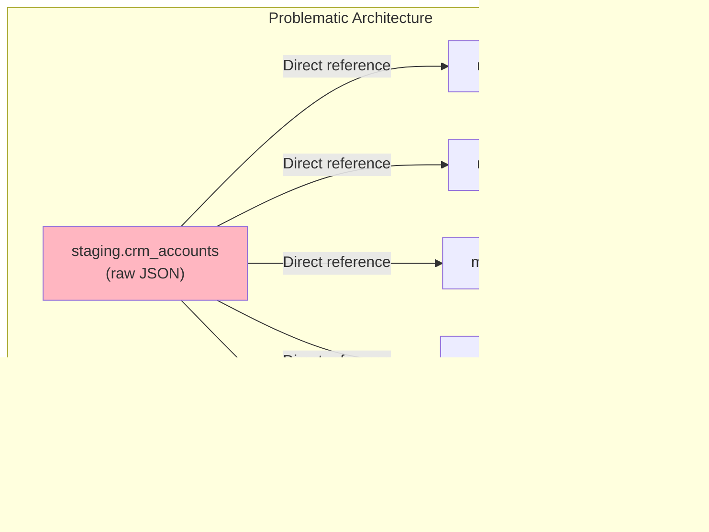

# Conversation
- conversationId: a0791a52-2988-449f-a71d-005635c4a67b
- endpoint: Anthropic
- title: Enterprise Data Warehouse Guide
- exportAt: 20:25:31 GMT+0100 (West Africa Standard Time)

## Options
- presetId: null
- conversationId: a0791a52-2988-449f-a71d-005635c4a67b
- endpoint: Anthropic
- endpointType: custom
- isArchived: false
- title: Enterprise Data Warehouse Guide
- user: 69022f50018861fd2b0b5923
- messages: 697bacb5e76d4f39fba38c34,697bad0be76d4f39fba38e02,697bad7ee76d4f39fba3906f,697badc6e76d4f39fba391e8,697bae58e76d4f39fba39503,697baea7e76d4f39fba396cd,697baeebe76d4f39fba39823,697baf34e76d4f39fba399b2,697baf40e76d4f39fba399e8,697baf7be76d4f39fba39af6,697baf8fe76d4f39fba39b5b,697bafe5e76d4f39fba39d04,697baff6e76d4f39fba39d4a,697bb056e76d4f39fba39f2d,697bb091e76d4f39fba3a07e,697bb0d7e76d4f39fba3a1fd,697bb0ebe76d4f39fba3a274,697bb11fe76d4f39fba3a396,697bb139e76d4f39fba3a422,697bb16ee76d4f39fba3a52d,697bb175e76d4f39fba3a55d,697bb1b7e76d4f39fba3a6a0,697bb1cde76d4f39fba3a6f6,697bb20be76d4f39fba3a81f,697bb211e76d4f39fba3a83a,697bb251e76d4f39fba3a98e,697bb259e76d4f39fba3a9b4,697bb29ae76d4f39fba3aaa3,697bb2a1e76d4f39fba3aaba,697bb333e76d4f39fba3ad63,697bb35ae76d4f39fba3ae71,697bb390e76d4f39fba3af9d,697bb393e76d4f39fba3afad,697bb3d4e76d4f39fba3b1b8,697bb3e5e76d4f39fba3b229,697bb415e76d4f39fba3b320
- tools: 
- model: vertex_ai.anthropic.claude-opus-4-5
- tags: 
- createdAt: 2026-01-29T18:53:41.064Z
- updatedAt: 2026-01-29T19:25:09.876Z
- resendFiles: true
- agent_id: ephemeral
- _id: 697bacb5e76d4f39fba38c35
- __v: 0
- files: 

## History
**User**
<prompt>
Role: You are a principal data warehouse architect with 18+ years of experience designing, building, and optimizing enterprise-scale analytical systems across on-premises and cloud platforms. Your expertise spans legacy data warehousing (Teradata, Netezza) through modern cloud-native architectures (Snowflake, BigQuery, Redshift, Databricks), with deep hands-on experience in storage optimization, query performance tuning, and managing multi-petabyte warehouses supporting thousands of concurrent analysts and BI tools.

Task: Write a comprehensive technical guide covering the following core topics:

**Columnar Storage Fundamentals**
- Row-oriented vs. column-oriented storage architecture and when each excels
- Compression techniques unique to columnar formats (RLE, dictionary encoding, delta encoding, bit-packing)
- How columnar storage enables predicate pushdown, late materialization, and vectorized execution
- File formats: Parquet, ORC, and proprietary formats (Snowflake micro-partitions, BigQuery Capacitor)
- Impact on read vs. write performance, and implications for workload patterns (OLAP vs. OLTP)

**Massively Parallel Processing (MPP) Engines**
- MPP architecture fundamentals: shared-nothing vs. shared-disk, coordinator/worker topology
- Data distribution strategies: hash, round-robin, replicated/broadcast
- Query execution in MPP: query planning, shuffle/redistribution, and parallel scan
- Compute-storage separation: benefits, trade-offs, and cost implications
- Comparative analysis of major platforms: Redshift, BigQuery, Snowflake, Databricks SQL, Synapse Analytics

**Partitioning Strategies**
- Partitioning vs. sharding: clarifying terminology across platforms
- Partition types: range, list, hash, and composite partitioning
- Partition pruning: how query predicates eliminate partition scans
- Time-based partitioning patterns and partition lifecycle management (retention, archival)
- Platform-specific implementations: BigQuery partitioned tables, Redshift sort keys + distribution, Snowflake automatic clustering vs. explicit partitioning, Databricks Delta Lake partitioning

**Clustering & Data Organization**
- Clustering vs. partitioning: complementary strategies for query optimization
- Clustering keys and sort keys: selection criteria based on query patterns
- Automatic vs. manual clustering and reclustering overhead
- Z-ordering and multi-dimensional clustering (Databricks, Snowflake)
- Impact on min/max pruning, zone maps, and data skipping

**Cost Optimization in Cloud Data Warehouses**
- Understanding cloud DW pricing models: compute, storage, data transfer, and concurrency
- On-demand vs. provisioned capacity: when each model wins
- Query optimization for cost: reducing bytes scanned, avoiding full table scans
- Workload management: resource governors, query queues, auto-suspend/resume
- Storage optimization: compression, lifecycle policies, separating hot/warm/cold data
- Monitoring and chargeback: tagging, cost attribution, and alerting on runaway queries

**Enterprise Data Warehouse Architecture (Capstone Integration)**
- Staging → Core → Mart layered architecture: purpose, contracts, and data flow
- Staging layer: raw ingestion, schema-on-read, handling late-arriving data
- Core/Integration layer: conformed dimensions, business keys, master data alignment
- Mart/Presentation layer: star schemas, wide tables, materialized views for BI consumption
- Slowly Changing Dimensions (SCDs): Type 0, 1, 2, 3, 4, and 6 with implementation patterns
- Cost/performance tradeoff analysis: when to materialize vs. virtualize, compression vs. query speed, clustering investment vs. query frequency

Audience: Mid-level data engineers transitioning into analytics engineering or data warehouse development roles. Assume strong SQL proficiency, familiarity with cloud platforms (at least one of AWS, GCP, Azure), understanding of dimensional modeling basics, but limited hands-on experience with MPP tuning, storage layer optimization, or managing warehouse costs at scale.

**Platform Focus:**

Primary: Snowflake and Google BigQuery (provide syntax, configuration options, system views, and behavioral specifics for each where relevant)

Secondary: Note significant architectural or behavioral differences in Amazon Redshift, Databricks SQL Warehouse, and Azure Synapse Analytics where applicable (e.g., Redshift's zone maps vs. Snowflake's micro-partition pruning, BigQuery's slot-based execution vs. Snowflake's virtual warehouse model)

**Required Elements:**

**Structure:** Use clear hierarchical headings (H1/H2/H3), begin with an executive summary, and follow a logical flow from foundational concepts (columnar storage, MPP basics) through intermediate topics (partitioning, clustering) to advanced architecture and optimization (cost management, enterprise DW patterns, capstone integration)

**Diagrams:** Include Mermaid diagrams to illustrate:

- Row vs. columnar storage: how data is physically organized and read during analytical queries
- MPP query execution flow: query parsing → distribution → parallel execution → result aggregation
- Partition pruning visualization: showing how a query with date filter skips irrelevant partitions
- Clustering and zone map interaction: how clustered data enables min/max filtering
- Staging → Core → Mart data flow: showing transformation, grain changes, and consumption patterns
- SCD Type 2 implementation: timeline visualization of dimension record versioning with effective dates
- Cost model comparison: visual breakdown of Snowflake credits vs. BigQuery slots vs. Redshift node-hours

**Case Studies:** Provide 4–5 realistic, illustrative scenarios showing:

- The initial problem (symptoms such as query timeouts, exploding cloud costs, stale dashboards, inconsistent dimension values, poor BI performance, or inefficient data refreshes)
- Root cause analysis (suboptimal partitioning, missing clustering, inappropriate distribution key, inefficient SCD implementation, over-provisioned compute, or anti-patterns in layer design)
- The solution implemented (re-partitioning strategy, clustering key selection, query refactoring, incremental refresh, SCD redesign, cost governance controls)
- Measurable outcomes (query time reduction, cost savings percentage, improved freshness SLAs, reduced maintenance burden)

**Mistakes & Fixes:** Explicitly call out common mistakes, including:

- Over-partitioning leading to small file problems and metadata overhead
- Choosing clustering keys based on cardinality alone without considering query patterns
- Using full table scans in BigQuery when partition filters would reduce costs 10x
- Implementing SCD Type 2 without considering query performance on large dimensions
- Ignoring data distribution skew in MPP engines causing worker hotspots
- Treating cloud DW like on-prem: over-provisioning, failing to auto-suspend, ignoring bytes-scanned billing
- Materializing everything vs. strategic materialization decisions
- Neglecting the Staging → Core → Mart contract, leading to tightly coupled pipelines

For each mistake: how to detect it (query profiles, execution plans, cost dashboards, monitoring tools like Snowflake's Query History, BigQuery's INFORMATION_SCHEMA views, Redshift's STL/SVL tables) and how to prevent or correct it

**Code Examples:** Include real SQL snippets demonstrating:

- Creating partitioned and clustered tables in BigQuery and Snowflake
- Querying partition metadata and validating partition pruning (INFORMATION_SCHEMA.PARTITIONS, Snowflake query profile)
- Setting and modifying clustering keys in Snowflake; clustering monitoring queries
- Distribution and sort key syntax in Redshift with EXPLAIN ANALYZE output interpretation
- SCD Type 2 implementation: MERGE statements for upserts with effective date handling in Snowflake and BigQuery
- Cost monitoring queries: bytes scanned, slot usage, credit consumption by warehouse/user/query
- Staging → Core → Mart transformation examples: incremental loading pattern, hash-based change detection
- Good and bad practices with annotations explaining the differences (e.g., partition column selection, clustering key order, materialized view refresh strategies)

**Practical Guidance:** Include decision frameworks or checklists for:

- Selecting partition columns based on query patterns, data volume, and retention requirements
- Choosing clustering keys: cardinality, query filter frequency, and join columns
- Designing data distribution strategy in MPP systems to minimize shuffle
- Evaluating materialized views vs. tables vs. virtual views for mart layer
- SCD type selection based on business requirements and query patterns
- Right-sizing cloud DW compute: virtual warehouse sizing (Snowflake), slot reservations (BigQuery), node selection (Redshift)
- Cost review checklist: weekly/monthly optimization review process

**Capstone Project Guidance (Enterprise Sales Warehouse):**

Provide a structured project outline for building an enterprise sales data warehouse including:

- Business context: multi-region sales organization with CRM, ERP, and web analytics sources
- Source system descriptions and sample schemas
- Target dimensional model: sales facts, customer/product/geography/time dimensions
- Layer-by-layer implementation guide:
  - Staging: ingestion patterns, raw zone design, handling schema drift
  - Core: integration logic, business key resolution, SCD implementation for customer and product dimensions
  - Mart: star schema for sales analysis, pre-aggregated summary tables, BI-ready views
- Incremental refresh strategy and orchestration considerations
- Cost and performance analysis template: comparing design alternatives with estimated costs and query performance benchmarks
- Testing and validation approach: data quality checks, reconciliation between layers

Tone: Technically rigorous but accessible. Use clear explanations for complex concepts, especially when contrasting how different platforms handle the same challenge. Avoid unnecessary jargon without sacrificing precision. Use analogies where helpful (e.g., comparing partitioning to organizing a library by genre and publication year, or MPP to a kitchen with multiple chefs each handling part of a large order).

Length: Aim for a thorough, reference-quality document (approximately 6,000–8,000 words or equivalent depth), with the capstone section providing sufficient detail to serve as a standalone project specification.
</prompt>


**Anthropic.claude Opus 4 5**
# Enterprise Data Warehouse Architecture: A Comprehensive Technical Guide

## Executive Summary

Modern data warehousing has evolved from monolithic on-premises systems to distributed cloud-native architectures that separate compute from storage, leverage columnar formats for analytical efficiency, and enable elastic scaling. This guide provides mid-level data engineers with the foundational knowledge and practical skills to design, optimize, and operate enterprise-scale analytical systems.

We begin with the physics of data—how columnar storage fundamentally changes the economics of analytical queries—then build upward through MPP execution engines, partitioning and clustering strategies, and cost optimization techniques. The capstone section synthesizes these concepts into a complete enterprise sales warehouse implementation.

**Key Themes Throughout:**
- **Trade-offs are everywhere**: Every architectural decision involves balancing competing concerns (read vs. write performance, cost vs. latency, flexibility vs. optimization)
- **Query patterns drive design**: The best partition key, clustering strategy, or materialization decision depends entirely on how data will be consumed
- **Cloud economics differ fundamentally**: Treating cloud warehouses like on-premises systems leads to either overspending or underperformance

---

# Part 1: Columnar Storage Fundamentals

## 1.1 Row-Oriented vs. Column-Oriented Storage

Understanding storage orientation is foundational—it determines everything from compression ratios to which queries run fast or slow.

### Row-Oriented Storage

In row-oriented systems (PostgreSQL, MySQL, traditional OLTP databases), data is stored contiguously by record:

```
Row 1: [CustomerID:1001, Name:"Acme Corp", Region:"West", Revenue:50000]
Row 2: [CustomerID:1002, Name:"Beta Inc", Region:"East", Revenue:75000]
Row 3: [CustomerID:1003, Name:"Gamma LLC", Region:"West", Revenue:30000]
```

**Strengths:**
- Excellent for transactional workloads: inserting, updating, or fetching entire records
- Single I/O operation retrieves complete entity
- Natural fit for OLTP patterns (point lookups, record-level updates)

### Column-Oriented Storage

Columnar systems store data by column, grouping all values for a single attribute together:

```
CustomerID Column: [1001, 1002, 1003, ...]
Name Column: ["Acme Corp", "Beta Inc", "Gamma LLC", ...]
Region Column: ["West", "East", "West", ...]
Revenue Column: [50000, 75000, 30000, ...]
```


**Strengths:**
- Dramatic I/O reduction: analytical queries typically touch 5-15% of columns
- Superior compression: similar values compress better together
- Vectorized processing: CPU-efficient batch operations on column chunks
- Enables sophisticated predicate pushdown and data skipping

### When Each Excels

| Workload Characteristic | Row-Oriented | Column-Oriented |
|------------------------|--------------|-----------------|
| Single-record lookups | ✅ Excellent | ❌ Poor |
| Full-record inserts | ✅ Excellent | ⚠️ Moderate (batch preferred) |
| Record updates | ✅ Excellent | ❌ Poor (often copy-on-write) |
| Aggregations over many rows | ❌ Poor | ✅ Excellent |
| Queries touching few columns | ⚠️ Wasteful I/O | ✅ Excellent |
| Wide tables (100+ columns) | ❌ Very wasteful | ✅ Only reads needed columns |

## 1.2 Compression Techniques in Columnar Formats

Columnar storage enables compression techniques that exploit the homogeneity within columns:

### Run-Length Encoding (RLE)
Replaces consecutive identical values with (value, count) pairs.

```
Original: ["West", "West", "West", "East", "East", "West"]
RLE:      [("West", 3), ("East", 2), ("West", 1)]
```

**Best for:** Low-cardinality columns that are sorted or clustered (status codes, regions, flags).

### Dictionary Encoding
Replaces repeated string values with integer codes referencing a dictionary.

```
Dictionary: {0: "North America", 1: "Europe", 2: "Asia Pacific"}
Encoded:    [0, 0, 1, 2, 0, 1, 2, 2, 0, ...]
```

**Best for:** String columns with moderate cardinality (< millions of distinct values). Enables integer comparisons instead of string comparisons.

### Delta Encoding
Stores differences between consecutive values rather than absolute values.

```
Original: [1000000, 1000005, 1000003, 1000010]
Delta:    [1000000, +5, -2, +7]  // Base value + deltas
```

**Best for:** Sorted numeric columns, timestamps, sequential IDs.

### Bit-Packing
Uses the minimum number of bits required to represent values in a column chunk.

```
Values 0-15 need only 4 bits instead of 32-bit integers
A column with max value 127 uses 7 bits per value
```

**Best for:** Integer columns with limited range within data blocks.

## 1.3 Columnar Query Execution Optimizations

### Predicate Pushdown
Filters are pushed down to the storage layer, eliminating data before it reaches the compute engine.

```sql
-- Without predicate pushdown: read all data, then filter
SELECT * FROM sales WHERE region = 'West' AND year = 2024

-- With predicate pushdown: storage layer returns only matching data
-- The engine reads only:
--   1. Region column → filter for 'West'
--   2. Year column → filter for 2024
--   3. Remaining columns only for matching rows
```

### Late Materialization
Delays assembling complete rows until absolutely necessary, working with column positions instead.

```
Step 1: Scan region column → positions [0, 2, 5, 8] match 'West'
Step 2: Scan year column at positions [0, 2, 5, 8] → positions [2, 8] match 2024
Step 3: Only now read other columns at positions [2, 8]
```

This avoids reading columns for rows that will be filtered out.

### Vectorized Execution
Processes data in batches (vectors) of 1,000-4,000 values, enabling:
- SIMD (Single Instruction, Multiple Data) CPU operations
- Better CPU cache utilization
- Reduced per-row interpretation overhead

## 1.4 File Formats Deep Dive

### Apache Parquet
The de facto standard for columnar storage in data lakes.

**Structure:**
- **Row Groups:** Horizontal partitions (typically 128MB-1GB)
- **Column Chunks:** Each column's data within a row group
- **Pages:** Smallest unit of encoding/compression (typically 1MB)
- **Footer:** Schema and metadata including column statistics (min/max/null count)

```python
# Parquet file structure visualization
parquet_file = {
    "row_group_1": {
        "customer_id": {"pages": [...], "stats": {"min": 1, "max": 1000}},
        "revenue": {"pages": [...], "stats": {"min": 100, "max": 99999}},
    },
    "row_group_2": {...},
    "footer": {"schema": ..., "row_group_metadata": [...]}
}
```

### Apache ORC (Optimized Row Columnar)
Originated in the Hive ecosystem, with similar concepts:
- **Stripes** (equivalent to row groups)
- **Index Data:** Includes bloom filters for efficient predicate evaluation
- Tighter integration with Hive ACID transactions

### Proprietary Formats

**Snowflake Micro-Partitions:**
- Automatically created columnar units (50-500MB compressed)
- Immutable—updates create new micro-partitions
- Rich metadata enabling aggressive pruning
- No user control over partition boundaries (unlike Parquet row groups)

**BigQuery Capacitor:**
- Google's proprietary columnar format
- Optimized for Dremel/BigQuery's execution model
- Supports nested/repeated fields natively (Protocol Buffer heritage)
- Automatic and transparent to users

## 1.5 Read vs. Write Performance Implications

| Operation | Columnar Impact | Mitigation |
|-----------|-----------------|------------|
| Bulk Insert | ✅ Efficient (batch-oriented) | Use large batches (10K+ rows) |
| Single-Row Insert | ❌ Expensive (must update all column files) | Buffer and batch |
| Update | ❌ Copy-on-write semantics | Batch updates, accept latency |
| Delete | ⚠️ Often marks as deleted, not physical removal | Periodic compaction |
| Analytical Read | ✅ Excellent | - |
| Point Lookup | ❌ Must read from multiple column files | Maintain row-oriented cache/index |

**Workload Pattern Guidance:**
- **OLAP (Analytical):** Columnar excels—design for it
- **OLTP (Transactional):** Use row-oriented systems; ETL to columnar for analytics
- **HTAP (Hybrid):** Consider systems with dual storage (row + columnar) or accept trade-offs

---

# Part 2: Massively Parallel Processing (MPP) Engines

## 2.1 MPP Architecture Fundamentals

MPP systems distribute data and computation across many nodes, enabling horizontal scaling for large datasets.

### Shared-Nothing Architecture
Each node has its own CPU, memory, and storage. No shared resources except network.

**Examples:** Traditional Redshift, Teradata, Netezza

**Characteristics:**
- Data must be explicitly distributed across nodes
- Queries requiring data from multiple nodes need network shuffles
- Scaling requires data redistribution
- Node failure can cause data unavailability (mitigated by replication)

### Shared-Disk (Compute-Storage Separation)
Compute nodes share access to a common storage layer (S3, GCS, ADLS).

**Examples:** Snowflake, BigQuery, Databricks SQL, modern Redshift RA3

**Characteristics:**
- Compute scales independently of storage
- No data redistribution when adding compute
- Storage layer must handle high concurrent throughput
- Caching becomes critical for performance


### Coordinator/Worker Topology

Most MPP systems follow this pattern:


**Coordinator responsibilities:**
- Parse and validate SQL
- Generate and optimize query plan
- Distribute work to workers
- Collect and merge results

**Worker responsibilities:**
- Scan assigned data partitions
- Apply local filters and aggregations
- Shuffle data for distributed joins
- Return partial results to coordinator

## 2.2 Data Distribution Strategies

How data is distributed across nodes dramatically impacts query performance.

### Hash Distribution
Rows are assigned to nodes based on a hash of one or more columns.

```sql
-- Redshift syntax
CREATE TABLE orders (
    order_id BIGINT,
    customer_id BIGINT,
    order_date DATE,
    amount DECIMAL(12,2)
)
DISTKEY(customer_id);
```

**Best for:** Large tables frequently joined on the distribution key. Rows with the same key value are co-located, enabling local joins.

### Round-Robin Distribution
Rows are distributed evenly across nodes without considering content.

```sql
-- Redshift syntax
CREATE TABLE staging_events (...)
DISTSTYLE EVEN;
```

**Best for:** Staging tables, tables not joined with others, ensuring even distribution regardless of data characteristics.

### Replicated/Broadcast (ALL) Distribution
The entire table is copied to every node.

```sql
-- Redshift syntax
CREATE TABLE dim_region (...)
DISTSTYLE ALL;
```

**Best for:** Small dimension tables (< 2-3 million rows) joined with large fact tables. Eliminates shuffle for joins.

## 2.3 Query Execution in MPP


### Shuffle/Redistribution
When joining tables on non-distribution keys or performing global aggregations, data must be reshuffled across the network.

**Shuffle is expensive because:**
- Network I/O is orders of magnitude slower than local disk
- All nodes must wait for the slowest node
- Memory pressure during shuffle buffers

**Minimizing shuffle:**
- Choose distribution keys that match join keys
- Use replicated tables for small dimensions
- Pre-aggregate before shuffling

## 2.4 Compute-Storage Separation: Trade-offs

| Aspect | Coupled (Shared-Nothing) | Separated (Shared-Disk) |
|--------|-------------------------|-------------------------|
| Scaling compute | Requires data redistribution | Instant, independent |
| Scaling storage | Tied to compute nodes | Independent, pay-per-GB |
| Cold start latency | Data already local | May need cache warming |
| Cost efficiency | Pay for both when either is idle | Pay for each independently |
| Data sharing | Requires ETL/copy | Native cross-cluster


**User**
continue


**Anthropic.claude Opus 4 5**
# Part 2: Massively Parallel Processing (MPP) Engines (Continued)

## 2.5 Comparative Analysis of Major Platforms

| Feature | Snowflake | BigQuery | Redshift | Databricks SQL | Synapse Analytics |
|---------|-----------|----------|----------|----------------|-------------------|
| **Architecture** | Shared-disk, multi-cluster | Serverless, slot-based | Shared-nothing (DC2) or shared-disk (RA3) | Shared-disk (Delta Lake on object storage) | Dedicated pools (shared-nothing) or serverless |
| **Compute Model** | Virtual Warehouses (T-shirt sizing) | Slots (flexible or reserved) | Node count × type | SQL Warehouses (T-shirt sizing) | DWUs or serverless |
| **Auto-scaling** | Multi-cluster warehouses | Automatic with flex slots | Concurrency scaling, RA3 managed storage | Auto-scaling clusters | Serverless auto-scales |
| **Storage Format** | Proprietary micro-partitions | Capacitor (proprietary) | Columnar blocks | Delta Lake (Parquet + transaction log) | Columnstore indexes |
| **Concurrency** | Near-unlimited with scaling | High (slot contention possible) | WLM queues, limited by leader node | Good with auto-scaling | Workload isolation |
| **Separation** | Full | Full | Partial (RA3) | Full | Partial |

### Snowflake Specifics
- **Virtual Warehouses:** Isolated compute clusters sized XS to 6XL (each size doubles resources and cost)
- **Micro-partitions:** 50-500MB immutable units with automatic metadata
- **Automatic Clustering:** Background service reorganizes data based on cluster keys
- **Time Travel & Fail-safe:** Built-in data versioning for recovery

### BigQuery Specifics
- **Slot-based execution:** Slots are units of compute capacity (CPU + memory)
- **On-demand pricing:** Pay per bytes scanned
- **Flat-rate/Editions:** Reserved slots for predictable workloads
- **Fully serverless:** No cluster management, automatic optimization
- **Native ML and GIS:** Built-in machine learning and geospatial functions

### Redshift Specifics
- **Node types:** DC2 (dense compute, local SSD) vs RA3 (managed storage on S3)
- **Zone maps:** Min/max metadata per 1MB block for data skipping
- **AQUA:** Hardware-accelerated cache for RA3 nodes
- **Materialized views:** Automatic refresh and query rewrite
- **Spectrum:** Query external data in S3 without loading

---

# Part 3: Partitioning Strategies

## 3.1 Partitioning vs. Sharding: Terminology Clarification

These terms are often confused across platforms:

| Term | Definition | Scope |
|------|------------|-------|
| **Partitioning** | Dividing a table into segments based on column values | Within a single database/warehouse |
| **Sharding** | Distributing data across multiple database instances | Across multiple servers/databases |
| **Distribution** | How rows are assigned to compute nodes in MPP | Within an MPP cluster |

In cloud warehouses:
- **BigQuery partitions** = logical divisions based on column values
- **Snowflake micro-partitions** = physical storage units (automatic)
- **Redshift distribution** = how data is spread across nodes
- **Databricks Delta partitioning** = directory-based organization in storage

## 3.2 Partition Types

### Range Partitioning
Divides data based on value ranges, most commonly dates.

```sql
-- BigQuery: Range partitioning on date
CREATE TABLE sales.transactions (
    transaction_id STRING,
    customer_id STRING,
    transaction_date DATE,
    amount NUMERIC
)
PARTITION BY transaction_date
OPTIONS (
    partition_expiration_days = 365,
    require_partition_filter = true
);

-- BigQuery: Range partitioning on integer
CREATE TABLE analytics.user_scores (
    user_id INT64,
    score INT64,
    calculated_at TIMESTAMP
)
PARTITION BY RANGE_BUCKET(score, GENERATE_ARRAY(0, 100, 10));
```

### List Partitioning
Assigns rows to partitions based on discrete values.

```sql
-- Conceptual (BigQuery doesn't support true list partitioning)
-- In Redshift, achieved via distribution key on categorical column
-- In most systems, use clustering for categorical columns
```

### Hash Partitioning
Distributes data based on hash function output—ensures even distribution.

```sql
-- Redshift: Hash distribution (conceptually similar to hash partitioning)
CREATE TABLE orders (
    order_id BIGINT,
    customer_id BIGINT
)
DISTKEY(customer_id);
```

### Time-Unit Column Partitioning (BigQuery)
Extracts date/time units from timestamp columns.

```sql
-- Partition by month extracted from timestamp
CREATE TABLE logs.events (
    event_id STRING,
    event_timestamp TIMESTAMP,
    event_type STRING,
    payload JSON
)
PARTITION BY TIMESTAMP_TRUNC(event_timestamp, MONTH);
```

### Ingestion-Time Partitioning (BigQuery)
Partitions based on when data was loaded, not data content.

```sql
CREATE TABLE logs.streaming_events (
    event_id STRING,
    payload STRING
)
PARTITION BY _PARTITIONDATE;  -- Automatic pseudo-column
```

## 3.3 Partition Pruning

Partition pruning eliminates entire partitions from query execution based on predicates.


### Validating Partition Pruning

**BigQuery:**
```sql
-- Check partition usage in execution details
SELECT
    creation_time,
    query,
    total_bytes_processed,
    total_bytes_billed,
    total_slot_ms
FROM `region-us`.INFORMATION_SCHEMA.JOBS_BY_PROJECT
WHERE creation_time > TIMESTAMP_SUB(CURRENT_TIMESTAMP(), INTERVAL 1 HOUR)
ORDER BY creation_time DESC;

-- Query with partition filter (good)
SELECT SUM(amount) 
FROM sales.transactions 
WHERE transaction_date BETWEEN '2024-01-01' AND '2024-01-31';

-- Query without partition filter (bad - scans all partitions)
SELECT SUM(amount) 
FROM sales.transactions 
WHERE EXTRACT(YEAR FROM transaction_date) = 2024;  -- Function prevents pruning!
```

**Snowflake:**
```sql
-- Use query profile to see partitions scanned vs. total
-- In Snowflake UI: Query History → Query Profile → TableScan operator

-- Also check via QUERY_HISTORY
SELECT 
    query_id,
    query_text,
    partitions_scanned,
    partitions_total,
    bytes_scanned
FROM TABLE(INFORMATION_SCHEMA.QUERY_HISTORY())
WHERE query_text ILIKE '%sales%'
ORDER BY start_time DESC
LIMIT 10;
```

## 3.4 Time-Based Partitioning Patterns

### Daily Partitioning
Best for: High-volume transactional data queried by specific dates

```sql
-- BigQuery
CREATE TABLE events.clickstream (...)
PARTITION BY DATE(event_timestamp);
```

### Monthly Partitioning
Best for: Lower volume or historical analysis spanning months

```sql
-- BigQuery
CREATE TABLE finance.monthly_summaries (...)
PARTITION BY DATE_TRUNC(report_date, MONTH);
```

### Partition Lifecycle Management

**BigQuery partition expiration:**
```sql
-- Set expiration at table creation
CREATE TABLE logs.temp_events (...)
PARTITION BY DATE(event_time)
OPTIONS (partition_expiration_days = 90);

-- Modify existing table
ALTER TABLE logs.temp_events
SET OPTIONS (partition_expiration_days = 30);
```

**Snowflake time travel and retention:**
```sql
-- Set data retention period
ALTER TABLE sales.transactions 
SET DATA_RETENTION_TIME_IN_DAYS = 90;

-- Transient tables for staging (no fail-safe, lower cost)
CREATE TRANSIENT TABLE staging.raw_events (...);
```

## 3.5 Platform-Specific Implementations

### BigQuery Partitioned Tables

```sql
-- Recommended: Require partition filter to prevent expensive full scans
CREATE TABLE sales.orders (
    order_id STRING,
    customer_id STRING,
    order_date DATE,
    region STRING,
    amount NUMERIC
)
PARTITION BY order_date
CLUSTER BY region, customer_id
OPTIONS (require_partition_filter = true);

-- Query partition metadata
SELECT 
    table_name,
    partition_id,
    total_rows,
    total_logical_bytes,
    last_modified_time
FROM `project.sales.INFORMATION_SCHEMA.PARTITIONS`
WHERE table_name = 'orders'
ORDER BY partition_id DESC
LIMIT 30;
```

### Snowflake Automatic Micro-Partitioning

Snowflake doesn't have user-defined partitions—it automatically creates micro-partitions:

```sql
-- Check micro-partition statistics
SELECT 
    TABLE_NAME,
    ACTIVE_BYTES,
    TIME_TRAVEL_BYTES,
    RETAINED_FOR_CLONE_BYTES,
    ROW_COUNT
FROM INFORMATION_SCHEMA.TABLE_STORAGE_METRICS
WHERE TABLE_CATALOG = 'MY_DATABASE'
  AND TABLE_SCHEMA = 'SALES';

-- Cluster keys provide partition-like pruning benefits
ALTER TABLE sales.transactions 
CLUSTER BY (transaction_date, region);
```

### Redshift Sort Keys and Distribution

```sql
-- Compound sort key: optimized for queries filtering on prefix columns
CREATE TABLE sales.fact_orders (
    order_id BIGINT,
    order_date DATE,
    customer_id BIGINT,
    product_id BIGINT,
    quantity INT,
    amount DECIMAL(12,2)
)
DISTSTYLE KEY
DISTKEY(customer_id)
COMPOUND SORTKEY(order_date, customer_id);

-- Interleaved sort key: equal weight to all columns (higher maintenance)
CREATE TABLE analytics.multi_filter_table (...)
INTERLEAVED SORTKEY(region, product_category, customer_segment);

-- Check zone maps and distribution
SELECT 
    "table", 
    diststyle, 
    sortkey1, 
    skew_rows
FROM svv_table_info
WHERE "table" = 'fact_orders';
```

### Databricks Delta Lake Partitioning

```sql
-- Delta Lake uses directory-based partitioning
CREATE TABLE sales.orders (
    order_id STRING,
    customer_id STRING,
    order_date DATE,
    amount DECIMAL(12,2)
)
USING DELTA
PARTITIONED BY (order_date)
LOCATION 's3://bucket/sales/orders';

-- Optimize partitions (compaction)
OPTIMIZE sales.orders WHERE order_date >= '2024-01-01';

-- Z-Order within partitions for multi-dimensional clustering
OPTIMIZE sales.orders 
WHERE order_date >= '2024-01-01'
ZORDER BY (customer_id, product_id);
```

---

# Part 4: Clustering & Data Organization

## 4.1 Clustering vs. Partitioning

Think of a library analogy:
- **Partitioning** = Organizing books by floor (Fiction on floor 1, Non-fiction on floor 2)
- **Clustering** = Within each floor, arranging books by author last name


| Aspect | Partitioning | Clustering |
|--------|--------------|------------|
| **Granularity** | Coarse (days, months, categories) | Fine (within partitions) |
| **Key cardinality** | Low to moderate | Moderate to high |
| **Maintenance** | Automatic (BigQuery) or implicit (Snowflake) | May require reclustering (Snowflake) |
| **Query benefit** | Eliminates large data segments | Reduces micro-partition/block scans |
| **Cost model** | Reduces bytes scanned | Reduces bytes scanned |

## 4.2 Clustering Keys and Sort Keys

### Selecting Clustering Keys

**Decision Framework:**

1. **Filter frequency:** Which columns appear most often in WHERE clauses?
2. **Cardinality:** Medium cardinality often works best (100s to millions of distinct values)
3. **Query patterns:** Do queries filter on single columns or combinations?
4. **Join columns:** Clustering on join keys can improve join performance
5. **Update patterns:** Frequently updated tables may suffer clustering degradation

### Snowflake Clustering

```sql
-- Define clustering key on frequently filtered columns
CREATE TABLE sales.transactions (
    transaction_id STRING,
    transaction_date DATE,
    customer_id STRING,
    region STRING,
    product_category STRING,
    amount DECIMAL(12,2)
)
CLUSTER BY (region, product_category);

-- Modify clustering key (re-clustering happens automatically over time)
ALTER TABLE sales.transactions CLUSTER BY (transaction_date, region);

-- Remove clustering
ALTER TABLE sales.transactions DROP CLUSTERING KEY;

-- Monitor clustering quality (0 = perfectly clustered, 1 = no clustering)
SELECT SYSTEM$CLUSTERING_INFORMATION('sales.transactions');

-- Detailed clustering info
SELECT SYSTEM$CLUSTERING_INFORMATION('sales.transactions', '(region, product_category)');
```

### BigQuery Clustering

```sql
-- Clustering is defined at table creation with partitioning
CREATE TABLE sales.transactions (
    transaction_id STRING,
    transaction_date DATE,
    customer_id STRING,
    region STRING,
    product_category STRING,
    amount NUMERIC
)
PARTITION BY transaction_date
CLUSTER BY region, product_category


**User**
continue


**Anthropic.claude Opus 4 5**
# Part 4: Clustering & Data Organization (Continued)

```sql
-- BigQuery clustering (continued)
CLUSTER BY region, product_category, customer_id;  -- Up to 4 columns

-- BigQuery automatically re-clusters data during writes
-- No manual maintenance required

-- Check clustering effectiveness via query stats
SELECT
    job_id,
    query,
    total_bytes_processed,
    total_bytes_billed,
    -- Lower ratio = better clustering benefit
    SAFE_DIVIDE(total_bytes_processed, total_bytes_billed) as scan_efficiency
FROM `region-us`.INFORMATION_SCHEMA.JOBS_BY_PROJECT
WHERE creation_time > TIMESTAMP_SUB(CURRENT_TIMESTAMP(), INTERVAL 24 HOUR)
  AND statement_type = 'SELECT'
ORDER BY total_bytes_processed DESC
LIMIT 20;
```

### Redshift Sort Keys

```sql
-- Compound sort key: most effective for queries filtering left-to-right
CREATE TABLE sales.fact_orders (
    order_id BIGINT ENCODE az64,
    order_date DATE ENCODE az64,
    customer_id BIGINT ENCODE az64,
    region VARCHAR(50) ENCODE lzo,
    amount DECIMAL(12,2) ENCODE az64
)
DISTSTYLE KEY
DISTKEY(customer_id)
COMPOUND SORTKEY(order_date, region);

-- Check sort key effectiveness
SELECT 
    "table",
    unsorted,  -- Percentage of rows not in sort order
    stats_off  -- Staleness of statistics
FROM svv_table_info
WHERE schema = 'sales';

-- Vacuum to restore sort order after updates
VACUUM SORT ONLY sales.fact_orders;
ANALYZE sales.fact_orders;
```

## 4.3 Automatic vs. Manual Clustering

### Snowflake Automatic Clustering

Snowflake's Automatic Clustering service runs in the background:

```sql
-- Check if automatic clustering is enabled and its status
SELECT 
    TABLE_NAME,
    CLUSTERING_KEY,
    AUTO_CLUSTERING_ON,
    BYTES,
    ROW_COUNT
FROM INFORMATION_SCHEMA.TABLES
WHERE TABLE_SCHEMA = 'SALES'
  AND TABLE_NAME = 'TRANSACTIONS';

-- View automatic clustering history and costs
SELECT 
    TABLE_NAME,
    START_TIME,
    END_TIME,
    CREDITS_USED,
    NUM_BYTES_RECLUSTERED,
    NUM_ROWS_RECLUSTERED
FROM TABLE(INFORMATION_SCHEMA.AUTOMATIC_CLUSTERING_HISTORY(
    DATE_RANGE_START => DATEADD('days', -7, CURRENT_DATE()),
    DATE_RANGE_END => CURRENT_DATE()
))
ORDER BY START_TIME DESC;

-- Suspend automatic clustering for cost control (not recommended for active tables)
ALTER TABLE sales.transactions SUSPEND RECLUSTER;

-- Resume automatic clustering
ALTER TABLE sales.transactions RESUME RECLUSTER;
```

**Reclustering Cost Considerations:**
- Automatic clustering consumes credits (separate from warehouse compute)
- High-churn tables may incur significant reclustering costs
- Consider clustering keys carefully—changing them triggers complete reclustering

### BigQuery Automatic Maintenance

BigQuery handles clustering maintenance transparently:
- No user intervention required
- No additional cost for reclustering
- Clustering is maintained during data modifications
- Effectiveness degrades less than Snowflake under high update volumes

## 4.4 Z-Ordering and Multi-Dimensional Clustering

Traditional clustering sorts data linearly (A, then B, then C). Z-ordering interleaves bits from multiple columns to cluster data effectively across multiple dimensions simultaneously.


### Databricks Z-Ordering

```sql
-- Apply Z-ordering during OPTIMIZE
OPTIMIZE sales.transactions
WHERE transaction_date >= '2024-01-01'
ZORDER BY (customer_id, product_id);

-- Z-Order is most effective with 2-4 columns
-- More columns dilute effectiveness

-- Check file statistics after Z-ordering
DESCRIBE DETAIL sales.transactions;

-- View optimization history
DESCRIBE HISTORY sales.transactions;
```

### Snowflake Multi-Dimensional Clustering

Snowflake's clustering supports multiple columns with automatic multi-dimensional organization:

```sql
-- Multi-column clustering key
ALTER TABLE sales.transactions 
CLUSTER BY (region, product_category, customer_segment);

-- Snowflake automatically manages multi-dimensional aspect
-- Query profile shows pruning effectiveness for any combination

-- Check clustering depth (how many columns benefit from clustering)
SELECT SYSTEM$CLUSTERING_DEPTH('sales.transactions');
```

## 4.5 Min/Max Pruning and Zone Maps

Zone maps (Redshift) and micro-partition metadata (Snowflake) store min/max values for each data block, enabling data skipping.


### Optimizing for Zone Map Effectiveness

**Key principles:**
1. **Sort/cluster by filter columns:** Narrows min/max ranges per block
2. **Avoid random distribution:** Randomized data has wide min/max ranges (no pruning)
3. **Consider data loading order:** Data loaded in order naturally clusters

```sql
-- Redshift: Check zone map ranges
SELECT 
    tbl,
    col,
    minvalue,
    maxvalue
FROM stv_blocklist bl
JOIN stv_tbl_perm tp ON bl.tbl = tp.id
WHERE tp.name = 'fact_orders'
  AND col = 0  -- First column
LIMIT 20;

-- Snowflake: Check micro-partition pruning in query profile
-- Query History → Query Profile → TableScan operator
-- Shows: Partitions scanned vs. Partitions total
```

---

# Part 5: Cost Optimization in Cloud Data Warehouses

## 5.1 Understanding Cloud DW Pricing Models


### Cost Comparison Framework

| Cost Driver | Snowflake | BigQuery | Redshift Provisioned |
|-------------|-----------|----------|---------------------|
| **Idle compute** | $0 (auto-suspend) | $0 (on-demand) or slot cost | Full node cost |
| **Query cost** | Time-based | Bytes-scanned or slot-time | Included in node cost |
| **Storage** | ~$23/TB/month | ~$20/TB (active), $10/TB (long-term) | Included (DC2) or ~$24/TB (RA3) |
| **Concurrency** | Scale warehouses | Add slots | WLM queues, concurrency scaling |
| **Minimum cost** | 1 credit minimum | 10MB minimum billing | 1 node minimum |

## 5.2 On-Demand vs. Provisioned Capacity

### When On-Demand Wins
- Unpredictable, bursty workloads
- Development and testing environments
- Ad-hoc analytical queries
- Low total monthly query volume

### When Provisioned/Reserved Wins
- Consistent, predictable workloads
- High query volume (>$10K/month in on-demand)
- SLA requirements for query latency
- BI dashboards with known refresh patterns

```sql
-- BigQuery: Estimate on-demand costs before running
SELECT 
    -- Dry run to estimate bytes
    total_bytes_processed
FROM `project.dataset.INFORMATION_SCHEMA.JOBS_BY_PROJECT`
WHERE job_id = 'your-dry-run-job-id';

-- BigQuery: Compare slot usage vs on-demand costs
SELECT
    DATE(creation_time) as query_date,
    SUM(total_bytes_billed) / POWER(1024, 4) as tb_scanned,
    SUM(total_bytes_billed) / POWER(1024, 4) * 6.25 as on_demand_cost_usd,
    SUM(total_slot_ms) / 1000 / 3600 as slot_hours
FROM `region-us`.INFORMATION_SCHEMA.JOBS_BY_PROJECT
WHERE creation_time > TIMESTAMP_SUB(CURRENT_TIMESTAMP(), INTERVAL 30 DAY)
GROUP BY 1
ORDER BY 1;
```

## 5.3 Query Optimization for Cost

### Reducing Bytes Scanned

```sql
-- ❌ BAD: Scans all columns
SELECT * FROM sales.transactions WHERE order_date = '2024-01-15';

-- ✅ GOOD: Select only needed columns
SELECT order_id, customer_id, amount 
FROM sales.transactions 
WHERE order_date = '2024-01-15';

-- ❌ BAD: Function on partition column prevents pruning
SELECT SUM(amount) 
FROM sales.transactions 
WHERE EXTRACT(YEAR FROM order_date) = 2024;

-- ✅ GOOD: Direct comparison enables partition pruning
SELECT SUM(amount) 
FROM sales.transactions 
WHERE order_date >= '2024-01-01' AND order_date < '2025-01-01';

-- ❌ BAD: Unnecessary DISTINCT on large dataset
SELECT DISTINCT customer_id, region FROM sales.transactions;

-- ✅ GOOD: Use GROUP BY or question if DISTINCT is needed
SELECT customer_id, region 
FROM sales.transactions 
GROUP BY customer_id, region;
```

### BigQuery Cost Controls

```sql
-- Set maximum bytes billed per query
-- Query fails if estimate exceeds limit
SELECT *
FROM sales.large_table
WHERE order_date = CURRENT_DATE()
OPTIONS (maximum_bytes_billed = 10737418240);  -- 10 GB

-- Set project-level or user-level quotas in BigQuery console
-- Quotas → Custom quotas → Query usage per day
```

### Snowflake Credit Monitoring

```sql
-- Credits used by warehouse over time
SELECT 
    WAREHOUSE_NAME,
    DATE_TRUNC('day', START_TIME) as usage_date,
    SUM(CREDITS_USED) as total_credits,
    SUM(CREDITS_USED) * 3 as estimated_cost_usd  -- Assuming $3/credit
FROM SNOWFLAKE.ACCOUNT_USAGE.WAREHOUSE_METERING_HISTORY
WHERE START_TIME > DATEADD('day', -30, CURRENT_DATE())
GROUP BY 1, 2
ORDER BY 1, 2;

-- Credits by query (requires ACCOUNTADMIN or appropriate privileges)
SELECT 
    USER_NAME,
    WAREHOUSE_NAME,
    QUERY_ID,
    QUERY_TEXT,
    TOTAL_ELAPSED_TIME / 1000 as seconds,
    CREDITS_USED_CLOUD_SERVICES
FROM SNOWFLAKE.ACCOUNT_USAGE.QUERY_HISTORY
WHERE START_TIME > DATEADD('day', -7, CURRENT_DATE())
ORDER BY TOTAL_ELAPSED_TIME DESC
LIMIT 50;
```

## 5.4 Workload Management

### Snowflake Resource Monitors

```sql
-- Create resource monitor to cap spending
CREATE RESOURCE MONITOR sales_team_budget
WITH 
    CREDIT_QUOTA = 1000
    FREQUENCY = MONTHLY
    START_TIMESTAMP = IMMEDIATELY
    TRIGGERS
        ON 75 PERCENT DO NOTIFY
        ON 90 PERCENT DO NOTIFY
        ON 100 PERCENT DO SUSPEND;

-- Assign monitor to warehouse
ALTER WAREHOUSE sales_warehouse 
SET RESOURCE_MONITOR = sales_team_budget;

-- Auto-suspend configuration
ALTER WAREHOUSE dev_warehouse
SET AUTO_SUSPEND = 60  -- Suspend after 60 seconds of inactivity
    AUTO_RESUME = TRUE;
```

### BigQuery Workload Management

```sql
-- Reservations for workload isolation (requires Editions/Enterprise)
-- Done via Console or bq CLI:
-- bq mk --reservation --project_id=project --location=US --slots=500 prod_analytics

-- Assignment of projects to reservations
-- bq mk --reservation_assignment 
--   --project_id=project 
--   --location=US 
--   --reservation_id=prod_analytics 
--   --job_type=QUERY 
--   --assignee_type=PROJECT 
--   --assignee_id=analytics-project

-- Query queues and concurrency limits via INFORMATION_SCHEMA
SELECT 
    job_id,
    state,
    creation_time,
    start_time,
    TIMESTAMP_DIFF(start_time, creation_time, SECOND) as queue_time_seconds
FROM `region-us`.INFORMATION_SCHEMA.JOBS_BY_PROJECT
WHERE creation_time > TIMESTAMP_SUB(CURRENT_TIMESTAMP(), INTERVAL 1 HOUR)
  AND state =


**User**
continue


**Anthropic.claude Opus 4 5**
# Part 5: Cost Optimization in Cloud Data Warehouses (Continued)

```sql
-- BigQuery queue analysis (continued)
SELECT 
    job_id,
    state,
    creation_time,
    start_time,
    TIMESTAMP_DIFF(start_time, creation_time, SECOND) as queue_time_seconds
FROM `region-us`.INFORMATION_SCHEMA.JOBS_BY_PROJECT
WHERE creation_time > TIMESTAMP_SUB(CURRENT_TIMESTAMP(), INTERVAL 1 HOUR)
  AND state = 'DONE'
  AND TIMESTAMP_DIFF(start_time, creation_time, SECOND) > 5
ORDER BY queue_time_seconds DESC;
```

## 5.5 Storage Optimization

### Compression Analysis

```sql
-- Snowflake: Check compression ratios
SELECT 
    TABLE_CATALOG,
    TABLE_SCHEMA,
    TABLE_NAME,
    ROW_COUNT,
    BYTES / (1024*1024*1024) as size_gb,
    BYTES / NULLIF(ROW_COUNT, 0) as bytes_per_row
FROM INFORMATION_SCHEMA.TABLES
WHERE TABLE_SCHEMA = 'SALES'
ORDER BY BYTES DESC;

-- Redshift: Check compression encodings
SELECT 
    "column",
    type,
    encoding,
    distkey,
    sortkey
FROM pg_table_def
WHERE schemaname = 'sales' 
  AND tablename = 'fact_orders';

-- Redshift: Analyze compression recommendations
ANALYZE COMPRESSION sales.fact_orders;
```

### Hot/Warm/Cold Data Tiering

```sql
-- BigQuery: Long-term storage pricing kicks in automatically after 90 days
-- Check storage breakdown
SELECT 
    table_id,
    ROUND(size_bytes / POW(1024, 3), 2) as total_gb,
    ROUND(long_term_logical_bytes / POW(1024, 3), 2) as long_term_gb,
    ROUND(active_logical_bytes / POW(1024, 3), 2) as active_gb
FROM `project.dataset.__TABLES__`
ORDER BY size_bytes DESC;

-- Snowflake: Transient tables for staging (no fail-safe = lower cost)
CREATE TRANSIENT TABLE staging.raw_events (
    event_id STRING,
    payload VARIANT,
    ingested_at TIMESTAMP
);

-- Snowflake: Move old data to cheaper storage via external tables
CREATE EXTERNAL TABLE archive.old_transactions
WITH LOCATION = @s3_archive_stage/transactions/
FILE_FORMAT = (TYPE = PARQUET);
```

### Lifecycle Policies

```sql
-- BigQuery: Partition expiration
ALTER TABLE logs.events
SET OPTIONS (partition_expiration_days = 365);

-- BigQuery: Table expiration for temporary tables
CREATE TABLE temp.analysis_results (...)
OPTIONS (expiration_timestamp = TIMESTAMP_ADD(CURRENT_TIMESTAMP(), INTERVAL 7 DAY));

-- Snowflake: Time travel reduction for cost savings
ALTER TABLE staging.raw_data 
SET DATA_RETENTION_TIME_IN_DAYS = 1;  -- Minimum for permanent tables

-- Snowflake: Drop old partitions via date-based DELETE (triggers reclustering)
DELETE FROM sales.transactions 
WHERE transaction_date < DATEADD('year', -3, CURRENT_DATE());
```

## 5.6 Monitoring and Chargeback

### Cost Attribution with Tags

```sql
-- Snowflake: Tag-based cost attribution
CREATE TAG cost_center ALLOWED_VALUES 'sales', 'marketing', 'engineering', 'finance';

ALTER WAREHOUSE sales_wh SET TAG cost_center = 'sales';
ALTER WAREHOUSE marketing_wh SET TAG cost_center = 'marketing';

-- Query costs by tag
SELECT 
    TAG_VALUE,
    SUM(CREDITS_USED) as total_credits,
    SUM(CREDITS_USED) * 3 as estimated_cost_usd
FROM SNOWFLAKE.ACCOUNT_USAGE.WAREHOUSE_METERING_HISTORY wmh
JOIN SNOWFLAKE.ACCOUNT_USAGE.TAG_REFERENCES tr 
    ON wmh.WAREHOUSE_ID = tr.OBJECT_ID
WHERE tr.TAG_NAME = 'COST_CENTER'
  AND wmh.START_TIME > DATEADD('month', -1, CURRENT_DATE())
GROUP BY TAG_VALUE;
```

### Runaway Query Detection

```sql
-- Snowflake: Find expensive queries
SELECT 
    QUERY_ID,
    USER_NAME,
    WAREHOUSE_NAME,
    EXECUTION_STATUS,
    TOTAL_ELAPSED_TIME / 1000 as seconds,
    BYTES_SCANNED / (1024*1024*1024) as gb_scanned,
    ROWS_PRODUCED,
    QUERY_TEXT
FROM SNOWFLAKE.ACCOUNT_USAGE.QUERY_HISTORY
WHERE START_TIME > DATEADD('day', -1, CURRENT_DATE())
  AND TOTAL_ELAPSED_TIME > 300000  -- Over 5 minutes
ORDER BY TOTAL_ELAPSED_TIME DESC
LIMIT 20;

-- BigQuery: Find expensive queries by bytes scanned
SELECT 
    user_email,
    job_id,
    query,
    total_bytes_billed / POW(1024, 4) as tb_billed,
    total_bytes_billed / POW(1024, 4) * 6.25 as estimated_cost_usd,
    total_slot_ms / 1000 as slot_seconds
FROM `region-us`.INFORMATION_SCHEMA.JOBS_BY_PROJECT
WHERE creation_time > TIMESTAMP_SUB(CURRENT_TIMESTAMP(), INTERVAL 24 HOUR)
  AND total_bytes_billed > 107374182400  -- Over 100 GB
ORDER BY total_bytes_billed DESC
LIMIT 20;

-- BigQuery: Set up alerting via Cloud Monitoring
-- Create alert policy when query bytes exceed threshold
```

### Weekly Cost Review Checklist

```markdown
## Weekly Data Warehouse Cost Review

### Compute Analysis
- [ ] Top 10 most expensive queries by credits/bytes
- [ ] Warehouse utilization rates (idle time vs active time)
- [ ] Auto-suspend configuration verification
- [ ] Concurrency patterns and queue times

### Storage Analysis
- [ ] Total storage growth week-over-week
- [ ] Tables without partition expiration policies
- [ ] Large tables not accessed in 30+ days
- [ ] Time travel/fail-safe storage costs

### Query Pattern Analysis
- [ ] Queries without partition filters
- [ ] Full table scans on large tables
- [ ] Repeated identical queries (caching opportunity)
- [ ] Failed queries consuming resources

### Action Items
- [ ] Queries to optimize (add filters, reduce columns)
- [ ] Tables to archive or delete
- [ ] Warehouses to resize or suspend
- [ ] Materialized views to create or refresh
```

---

# Part 6: Enterprise Data Warehouse Architecture

## 6.1 Staging → Core → Mart Layered Architecture


### Layer Contracts and Responsibilities

| Layer | Purpose | Data Quality | Schema | Refresh Pattern |
|-------|---------|--------------|--------|-----------------|
| **Staging** | Raw ingestion, preserve source fidelity | Minimal validation | Schema-on-read or source-mirrored | Real-time to hourly |
| **Core** | Integration, conformance, business logic | Full validation, deduplication | Conformed dimensions, normalized | Hourly to daily |
| **Mart** | Consumption-optimized, use-case specific | Pre-validated from Core | Star schema, wide tables | Daily to on-demand |

## 6.2 Staging Layer Design

### Raw Ingestion Patterns

```sql
-- Snowflake: Staging table with VARIANT for schema flexibility
CREATE TABLE staging.raw_crm_accounts (
    _source_file STRING,
    _ingested_at TIMESTAMP DEFAULT CURRENT_TIMESTAMP(),
    _row_hash STRING,  -- For change detection
    raw_data VARIANT
);

-- Load from S3 with automatic schema detection
COPY INTO staging.raw_crm_accounts (raw_data, _source_file, _ingested_at)
FROM @crm_stage/accounts/
FILE_FORMAT = (TYPE = JSON)
MATCH_BY_COLUMN_NAME = CASE_INSENSITIVE;

-- BigQuery: Staging with JSON column
CREATE TABLE staging.raw_crm_accounts (
    _source_file STRING,
    _ingested_at TIMESTAMP DEFAULT CURRENT_TIMESTAMP(),
    _row_hash STRING,
    raw_data JSON
)
PARTITION BY DATE(_ingested_at);

-- Load from GCS
LOAD DATA INTO staging.raw_crm_accounts
FROM FILES (
    format = 'JSON',
    uris = ['gs://bucket/crm/accounts/*.json']
);
```

### Handling Schema Drift

```sql
-- Snowflake: VARIANT columns accommodate schema changes automatically
-- Extract new fields as they appear
SELECT 
    raw_data:id::STRING as account_id,
    raw_data:name::STRING as account_name,
    raw_data:new_field::STRING as new_field,  -- New field, returns NULL if missing
    _ingested_at
FROM staging.raw_crm_accounts
WHERE _ingested_at > DATEADD('hour', -1, CURRENT_TIMESTAMP());

-- BigQuery: JSON functions for flexible extraction
SELECT 
    JSON_VALUE(raw_data, '$.id') as account_id,
    JSON_VALUE(raw_data, '$.name') as account_name,
    JSON_VALUE(raw_data, '$.new_field') as new_field,
    _ingested_at
FROM staging.raw_crm_accounts
WHERE _ingested_at > TIMESTAMP_SUB(CURRENT_TIMESTAMP(), INTERVAL 1 HOUR);
```

### Late-Arriving Data Handling

```sql
-- Design staging tables to capture arrival vs event time
CREATE TABLE staging.raw_orders (
    order_id STRING,
    order_date DATE,              -- Event time (when order occurred)
    _ingested_at TIMESTAMP,       -- Arrival time (when we received it)
    _source_file STRING,
    raw_data VARIANT
);

-- Core layer merge handles late arrivals
MERGE INTO core.fact_orders tgt
USING staging.transformed_orders src
ON tgt.order_id = src.order_id
WHEN MATCHED AND src._ingested_at > tgt._last_updated THEN
    UPDATE SET 
        amount = src.amount,
        status = src.status,
        _last_updated = src._ingested_at
WHEN NOT MATCHED THEN
    INSERT (order_id, order_date, amount, status, _last_updated)
    VALUES (src.order_id, src.order_date, src.amount, src.status, src._ingested_at);
```

## 6.3 Core/Integration Layer

### Conformed Dimensions

```sql
-- Customer dimension integrating multiple sources
CREATE TABLE core.dim_customer (
    customer_sk BIGINT AUTOINCREMENT,  -- Surrogate key
    customer_bk STRING,                 -- Business key (natural key)
    source_system STRING,               -- Origin system
    
    -- Attributes from CRM
    customer_name STRING,
    customer_email STRING,
    account_owner STRING,
    
    -- Attributes from ERP
    payment_terms STRING,
    credit_limit DECIMAL(12,2),
    
    -- Conformed attributes (standardized across sources)
    customer_segment STRING,  -- ENTERPRISE, MID-MARKET, SMB
    industry_code STRING,     -- Standardized industry classification
    geography_key STRING,     -- FK to geography dimension
    
    -- SCD2 metadata
    effective_from TIMESTAMP,
    effective_to TIMESTAMP,
    is_current BOOLEAN,
    
    -- Audit columns
    _source_crm_id STRING,
    _source_erp_id STRING,
    _created_at TIMESTAMP,
    _updated_at TIMESTAMP
)
CLUSTER BY (is_current, customer_segment);
```

### Business Key Resolution

```sql
-- Create mapping table for cross-system identity resolution
CREATE TABLE core.customer_identity_map (
    master_customer_bk STRING,
    source_system STRING,
    source_customer_id STRING,
    match_confidence DECIMAL(3,2),
    match_method STRING,  -- EXACT_EMAIL, FUZZY_NAME, MANUAL_OVERRIDE
    _created_at TIMESTAMP,
    PRIMARY KEY (source_system, source_customer_id)
);

-- Resolve identities when building dimension
WITH resolved_customers AS (
    SELECT 
        COALESCE(cim.master_customer_bk, crm.email) as customer_bk,
        crm.*
    FROM staging.stg_crm_accounts crm
    LEFT JOIN core.customer_identity_map cim 
        ON cim.source_system = 'CRM' 
        AND cim.source_customer_id = crm.account_id
)
SELECT * FROM resolved_customers;
```

## 6.4 Slowly Changing Dimensions (SCDs)

```mermaid
graph TB
    subgraph "SCD Type 2: Customer History"
        R1["SK=1, BK=C001<br/>Name=Acme Corp<br/>Segment=SMB<br/>Eff: 2023-01-01 to 2023-06-30<br/>Current=FALSE"]
        R2["SK=2, BK=C001<br/>Name=Acme Corp<br/>Segment=MID-MARKET<br/>Eff: 2023-07-01 to 2024-01-31<br/>Current=FALSE"]
        R3["SK=3, BK=C001<br/>Name=Acme Corporation<br/>Segment=ENTERPRISE<br/>Eff: 2024-02-01 to 9999-12-31<br/>Current=TRUE"]
        
        R1 -->|"Segment changed"| R2
        R2 -->|"Name + Segment changed"| R3
    end
    
    subgraph "Query Patterns"
        Q1["Current state:<br/>WHERE is_current = TRUE"]
        Q2["Point-in-time:<br/>WHERE order_date BETWEEN<br


**User**
continue


**Anthropic.claude Opus 4 5**
# Part 6: Enterprise Data Warehouse Architecture (Continued)

```mermaid
graph TB
    subgraph "SCD Type 2: Customer History"
        R1["SK=1, BK=C001<br/>Name=Acme Corp<br/>Segment=SMB<br/>Eff: 2023-01-01 to 2023-06-30<br/>Current=FALSE"]
        R2["SK=2, BK=C001<br/>Name=Acme Corp<br/>Segment=MID-MARKET<br/>Eff: 2023-07-01 to 2024-01-31<br/>Current=FALSE"]
        R3["SK=3, BK=C001<br/>Name=Acme Corporation<br/>Segment=ENTERPRISE<br/>Eff: 2024-02-01 to 9999-12-31<br/>Current=TRUE"]
        
        R1 -->|"Segment changed"| R2
        R2 -->|"Name + Segment changed"| R3
    end
    
    subgraph "Query Patterns"
        Q1["Current state query:<br/>WHERE is_current = TRUE"]
        Q2["Point-in-time query:<br/>WHERE effective_from <= order_date<br/>AND effective_to > order_date"]
    end
```

### SCD Type Comparison

| Type | Behavior | Use Case | Storage | Query Complexity |
|------|----------|----------|---------|------------------|
| **Type 0** | Never update | Static reference data | Minimal | Simple |
| **Type 1** | Overwrite | Corrections, no history needed | Minimal | Simple |
| **Type 2** | Add new row with date range | Full history tracking | High | Moderate |
| **Type 3** | Add column for previous value | Limited history (1 change) | Low | Simple |
| **Type 4** | Separate history table | Audit trail with current table | Moderate | Join required |
| **Type 6** | Hybrid (1+2+3) | Current + history + previous | High | Moderate |

### SCD Type 2 Implementation

```sql
-- Snowflake: SCD Type 2 MERGE pattern
MERGE INTO core.dim_customer tgt
USING (
    SELECT 
        customer_bk,
        customer_name,
        customer_segment,
        customer_email,
        MD5(CONCAT(customer_name, customer_segment, customer_email)) as row_hash
    FROM staging.stg_customers_transformed
) src
ON tgt.customer_bk = src.customer_bk AND tgt.is_current = TRUE

-- When attributes changed, expire old record
WHEN MATCHED AND tgt.row_hash != src.row_hash THEN
    UPDATE SET 
        effective_to = CURRENT_TIMESTAMP(),
        is_current = FALSE,
        _updated_at = CURRENT_TIMESTAMP()

-- New customers
WHEN NOT MATCHED THEN
    INSERT (customer_bk, customer_name, customer_segment, customer_email,
            row_hash, effective_from, effective_to, is_current, _created_at, _updated_at)
    VALUES (src.customer_bk, src.customer_name, src.customer_segment, src.customer_email,
            src.row_hash, CURRENT_TIMESTAMP(), '9999-12-31'::TIMESTAMP, TRUE, 
            CURRENT_TIMESTAMP(), CURRENT_TIMESTAMP());

-- Second statement: Insert new current records for changed customers
INSERT INTO core.dim_customer 
    (customer_bk, customer_name, customer_segment, customer_email,
     row_hash, effective_from, effective_to, is_current, _created_at, _updated_at)
SELECT 
    src.customer_bk, src.customer_name, src.customer_segment, src.customer_email,
    src.row_hash, CURRENT_TIMESTAMP(), '9999-12-31'::TIMESTAMP, TRUE,
    CURRENT_TIMESTAMP(), CURRENT_TIMESTAMP()
FROM staging.stg_customers_transformed src
INNER JOIN core.dim_customer tgt 
    ON tgt.customer_bk = src.customer_bk 
    AND tgt.is_current = FALSE
    AND tgt.effective_to = (SELECT MAX(effective_to) FROM core.dim_customer WHERE customer_bk = src.customer_bk)
    AND tgt.row_hash != src.row_hash;
```

```sql
-- BigQuery: SCD Type 2 with MERGE
MERGE INTO core.dim_customer tgt
USING (
    SELECT 
        customer_bk,
        customer_name,
        customer_segment,
        customer_email,
        TO_HEX(MD5(CONCAT(customer_name, customer_segment, customer_email))) as row_hash
    FROM staging.stg_customers_transformed
) src
ON tgt.customer_bk = src.customer_bk AND tgt.is_current = TRUE

WHEN MATCHED AND tgt.row_hash != src.row_hash THEN
    UPDATE SET 
        effective_to = CURRENT_TIMESTAMP(),
        is_current = FALSE,
        _updated_at = CURRENT_TIMESTAMP()

WHEN NOT MATCHED THEN
    INSERT (customer_bk, customer_name, customer_segment, customer_email,
            row_hash, effective_from, effective_to, is_current, _created_at, _updated_at)
    VALUES (src.customer_bk, src.customer_name, src.customer_segment, src.customer_email,
            src.row_hash, CURRENT_TIMESTAMP(), TIMESTAMP('9999-12-31'), TRUE,
            CURRENT_TIMESTAMP(), CURRENT_TIMESTAMP());
```

### SCD Type Selection Framework

```markdown
## SCD Type Selection Checklist

### Choose Type 1 (Overwrite) when:
- [ ] Historical values are not needed for analysis
- [ ] Changes are corrections, not legitimate business changes
- [ ] Storage cost is a primary concern
- [ ] Query simplicity is paramount

### Choose Type 2 (Versioning) when:
- [ ] Full audit trail is required (regulatory, compliance)
- [ ] Point-in-time analysis is a business requirement
- [ ] Facts must be associated with dimension state at transaction time
- [ ] Changes represent genuine business events

### Choose Type 3 (Previous Value Column) when:
- [ ] Only the immediately prior value matters
- [ ] Changes are infrequent (once per year or less)
- [ ] Query performance on large dimensions is critical

### Choose Type 6 (Hybrid) when:
- [ ] Current state queries must be fast (use current columns)
- [ ] Historical analysis is also required (use effective dates)
- [ ] Prior value comparison is common (use previous columns)
```

## 6.5 Mart/Presentation Layer

### Star Schema for BI Consumption

```sql
-- Fact table optimized for analysis
CREATE TABLE mart.fact_sales (
    -- Degenerate dimensions (high-cardinality identifiers)
    order_id STRING,
    order_line_id STRING,
    
    -- Foreign keys to dimensions
    order_date_key INT,         -- FK to dim_date
    customer_sk BIGINT,          -- FK to dim_customer (surrogate key)
    product_sk BIGINT,           -- FK to dim_product
    geography_sk BIGINT,         -- FK to dim_geography
    sales_rep_sk BIGINT,         -- FK to dim_sales_rep
    
    -- Measures
    quantity INT,
    unit_price DECIMAL(12,2),
    discount_amount DECIMAL(12,2),
    gross_amount DECIMAL(12,2),
    net_amount DECIMAL(12,2),
    cost_amount DECIMAL(12,2),
    margin_amount DECIMAL(12,2),
    
    -- Audit
    _loaded_at TIMESTAMP
)
PARTITION BY RANGE_BUCKET(order_date_key, GENERATE_ARRAY(20200101, 20301231, 100))
CLUSTER BY customer_sk, product_sk;
```

### Pre-Aggregated Summary Tables

```sql
-- Daily sales summary for dashboard performance
CREATE TABLE mart.sales_daily_summary AS
SELECT 
    order_date,
    d.calendar_year,
    d.calendar_month,
    d.calendar_week,
    c.customer_segment,
    g.region,
    g.country,
    p.product_category,
    p.product_subcategory,
    
    -- Aggregated measures
    COUNT(DISTINCT f.order_id) as order_count,
    COUNT(DISTINCT f.customer_sk) as customer_count,
    SUM(f.quantity) as total_quantity,
    SUM(f.gross_amount) as gross_revenue,
    SUM(f.net_amount) as net_revenue,
    SUM(f.margin_amount) as total_margin,
    AVG(f.net_amount) as avg_order_value
    
FROM mart.fact_sales f
JOIN mart.dim_date d ON f.order_date_key = d.date_key
JOIN mart.dim_customer c ON f.customer_sk = c.customer_sk AND c.is_current = TRUE
JOIN mart.dim_geography g ON f.geography_sk = g.geography_sk
JOIN mart.dim_product p ON f.product_sk = p.product_sk AND p.is_current = TRUE
GROUP BY 1,2,3,4,5,6,7,8,9;

-- Create materialized view for automatic refresh (Snowflake)
CREATE MATERIALIZED VIEW mart.mv_sales_daily_summary AS
SELECT ... -- Same query as above
;
```

### Materialized Views vs. Tables vs. Virtual Views

```sql
-- Virtual View: Always current, compute on query
CREATE VIEW mart.vw_customer_360 AS
SELECT 
    c.customer_bk,
    c.customer_name,
    c.customer_segment,
    COALESCE(s.total_orders, 0) as lifetime_orders,
    COALESCE(s.total_revenue, 0) as lifetime_revenue,
    s.first_order_date,
    s.last_order_date,
    COALESCE(e.email_opens_30d, 0) as recent_email_opens
FROM mart.dim_customer c
LEFT JOIN mart.agg_customer_sales s ON c.customer_sk = s.customer_sk
LEFT JOIN mart.agg_customer_email e ON c.customer_bk = e.customer_bk
WHERE c.is_current = TRUE;

-- Materialized View: Pre-computed, periodic refresh
-- Snowflake
CREATE MATERIALIZED VIEW mart.mv_customer_360 AS
SELECT ... -- Same query
;

-- BigQuery Materialized View
CREATE MATERIALIZED VIEW mart.mv_customer_360
OPTIONS (enable_refresh = true, refresh_interval_minutes = 60)
AS SELECT ... ;
```

### Materialization Decision Framework

| Factor | Virtual View | Materialized View | Physical Table |
|--------|--------------|-------------------|----------------|
| **Data freshness** | Real-time | Near real-time (refresh lag) | Batch (ETL schedule) |
| **Query performance** | Computed each time | Pre-computed, fast | Pre-computed, fast |
| **Storage cost** | None | Automatic (system managed) | Full control |
| **Maintenance** | None | Automatic refresh | Manual ETL |
| **Complex transforms** | Limited by query time | Some limitations | Full flexibility |
| **Best for** | Rarely queried, simple joins | Frequently queried aggregations | Complex multi-source integrations |

---

# Part 7: Common Mistakes and Fixes

## 7.1 Over-Partitioning (Small File Problem)

### Symptom
- Queries on partitioned tables are slower than expected
- Metadata operations (listing partitions) take excessive time
- High number of small files in object storage

### Root Cause
Partitioning on high-cardinality columns creates thousands of tiny partitions.

```sql
-- ❌ BAD: Partitioning by high-cardinality column
CREATE TABLE events (
    event_id STRING,
    user_id STRING,
    event_timestamp TIMESTAMP
)
PARTITION BY user_id;  -- Millions of users = millions of partitions!

-- Each partition may contain only a few KB of data
-- Query planning must evaluate all partition metadata
```

### Detection

```sql
-- BigQuery: Check partition sizes
SELECT 
    partition_id,
    total_rows,
    total_logical_bytes / (1024*1024) as size_mb
FROM `project.dataset.INFORMATION_SCHEMA.PARTITIONS`
WHERE table_name = 'events'
ORDER BY total_logical_bytes ASC
LIMIT 100;

-- If most partitions are < 100MB, you're over-partitioned

-- Snowflake: Check micro-partition count and sizes
SELECT 
    TABLE_NAME,
    ROW_COUNT,
    BYTES / (1024*1024*1024) as size_gb,
    BYTES / NULLIF(ROW_COUNT, 0) as bytes_per_row
FROM INFORMATION_SCHEMA.TABLES
WHERE TABLE_NAME = 'EVENTS';
```

### Fix

```sql
-- ✅ GOOD: Partition by date, cluster by user_id
CREATE TABLE events (
    event_id STRING,
    user_id STRING,
    event_timestamp TIMESTAMP,
    event_date DATE
)
PARTITION BY event_date
CLUSTER BY user_id;

-- Target: Partitions of 1-10GB each for optimal performance
```

## 7.2 Clustering Key Anti-Patterns

### Symptom
- Clustering costs are high but query performance hasn't improved
- Queries on clustered columns still scan many micro-partitions

### Root Cause
Clustering keys chosen based on cardinality alone, not query patterns.

```sql
-- ❌ BAD: Clustering on primary key (useless for range queries)
ALTER TABLE sales.orders CLUSTER BY (order_id);

-- ❌ BAD: Clustering on column never filtered on
ALTER TABLE sales.orders CLUSTER BY (internal_tracking_code);

-- ❌ BAD: Too many clustering columns
ALTER TABLE sales.orders CLUSTER BY (a, b, c, d, e, f);  -- Diminishing returns after 3-4
```

### Detection

```sql
-- Snowflake: Check if clustering is effective
SELECT SYSTEM$CLUSTERING_INFORMATION('sales.orders', '(order_date, region)');

-- Returns clustering depth and overlap statistics
-- High overlap = poor clustering effectiveness

-- Check query profile: Partitions Scanned vs Total Partitions
-- If ratio is close to 1:1, clustering isn't helping
```

### Fix

```sql
-- ✅ GOOD: Cluster by columns that appear in WHERE clauses
-- Analyze query history first
SELECT 
    query_text,
    COUNT(*) as frequency
FROM SNOWFLAKE.ACCOUNT_USAGE.QUERY_HISTORY
WHERE query_text ILIKE '%sales.orders%'
  AND query_text ILIKE '%WHERE%'
  AND start_time > DATEADD('day', -30, CURRENT_DATE())
GROUP BY 1
ORDER BY 2 DESC
LIMIT 20;

-- Then choose clustering keys based on most common filters
ALTER TABLE sales.orders CLUSTER BY (order_date, region);
```

## 7.3 Missing Partition Filters in BigQuery

### Symptom
- BigQuery costs are 10-100x higher than expected
- Queries on partitioned tables bill for full table scan

### Root Cause
Functions or expressions on partition column prevent pruning.

```sql
-- ❌ BAD: Function on partition column
SELECT * FROM sales.orders
WHERE EXTRACT(YEAR FROM order_date) = 2024;  -- Scans ALL partitions!

-- ❌ BAD: Implicit type conversion
SELECT * FROM sales.orders
WHERE order_date = '2024-01-15';  -- String literal, may not prune correctly

-- ❌ BAD: OR with non-partition column
SELECT * FROM sales.orders
WHERE order_date = DATE '2024-01-15' OR customer_id = 'C123';  -- Full scan
```

### Detection

```sql
-- Check if partition filter is being used
-- Method 1: Dry run in BigQuery console (shows bytes to be scanned)

-- Method 2: Query execution details
SELECT 
    job_id,
    query,
    total_bytes_processed,
    total_bytes_billed,
    -- Check referenced tables
    (SELECT COUNT(*) FROM UNNEST(referenced_tables


**User**
continue


**Anthropic.claude Opus 4 5**
# Part 7: Common Mistakes and Fixes (Continued)

## 7.3 Missing Partition Filters in BigQuery (Continued)

### Detection (Continued)

```sql
-- Check query execution details
SELECT 
    job_id,
    query,
    total_bytes_processed,
    total_bytes_billed,
    timeline
FROM `region-us`.INFORMATION_SCHEMA.JOBS_BY_PROJECT
WHERE creation_time > TIMESTAMP_SUB(CURRENT_TIMESTAMP(), INTERVAL 24 HOUR)
  AND total_bytes_billed > 10737418240  -- Over 10GB billed
ORDER BY total_bytes_billed DESC;

-- Enforce partition filters at table level to prevent mistakes
ALTER TABLE sales.orders
SET OPTIONS (require_partition_filter = true);

-- Now queries without partition filter will fail with helpful error
```

### Fix

```sql
-- ✅ GOOD: Direct comparison on partition column
SELECT * FROM sales.orders
WHERE order_date = DATE '2024-01-15';

-- ✅ GOOD: Range comparison
SELECT * FROM sales.orders
WHERE order_date BETWEEN DATE '2024-01-01' AND DATE '2024-01-31';

-- ✅ GOOD: Use DATE literal explicitly
SELECT * FROM sales.orders
WHERE order_date >= DATE '2024-01-01' 
  AND order_date < DATE '2025-01-01';

-- ✅ GOOD: If you need year extraction, use range instead
SELECT * FROM sales.orders
WHERE order_date >= DATE '2024-01-01' 
  AND order_date < DATE '2025-01-01';
```

## 7.4 SCD Type 2 Performance Issues

### Symptom
- Queries on dimension tables with SCD Type 2 are slow
- Point-in-time joins cause excessive shuffling
- Fact-to-dimension joins timeout or use excessive resources

### Root Cause
Large dimensions with millions of historical records, improper join patterns, or missing clustering on `is_current` flag.

```sql
-- ❌ BAD: Point-in-time join without optimization
SELECT 
    f.order_id,
    f.amount,
    c.customer_name,
    c.customer_segment
FROM mart.fact_sales f
JOIN core.dim_customer c 
    ON f.customer_bk = c.customer_bk
    AND f.order_date >= c.effective_from
    AND f.order_date < c.effective_to;  -- Scans entire dimension history!
```

### Detection

```sql
-- Check dimension size and version count
SELECT 
    customer_bk,
    COUNT(*) as version_count,
    MIN(effective_from) as first_version,
    MAX(effective_from) as latest_version
FROM core.dim_customer
GROUP BY customer_bk
HAVING COUNT(*) > 10  -- Customers with many versions
ORDER BY version_count DESC
LIMIT 100;

-- Check query profile for shuffle/redistribution on dimension joins
-- Snowflake: Query Profile → Look for "Bytes Sent Over Network"
-- BigQuery: Execution Details → Shuffle bytes
```

### Fix

```sql
-- Strategy 1: Cluster dimension by is_current for current-state queries
ALTER TABLE core.dim_customer CLUSTER BY (is_current, customer_segment);

-- Strategy 2: Create current-state view for most queries
CREATE VIEW core.dim_customer_current AS
SELECT * FROM core.dim_customer WHERE is_current = TRUE;

-- Strategy 3: Store surrogate key in fact table (snapshot at transaction time)
-- During fact table load, resolve to specific dimension version
INSERT INTO mart.fact_sales (order_id, customer_sk, amount, order_date)
SELECT 
    s.order_id,
    c.customer_sk,  -- Resolved surrogate key (not business key)
    s.amount,
    s.order_date
FROM staging.orders s
JOIN core.dim_customer c 
    ON s.customer_id = c.customer_bk
    AND s.order_date >= c.effective_from
    AND s.order_date < c.effective_to;

-- Now fact-to-dimension joins are simple PK-FK joins
SELECT f.*, c.customer_name, c.customer_segment
FROM mart.fact_sales f
JOIN core.dim_customer c ON f.customer_sk = c.customer_sk;

-- Strategy 4: For BigQuery, use clustering on effective dates
CREATE TABLE core.dim_customer (...)
PARTITION BY DATE(effective_from)
CLUSTER BY customer_bk, is_current;
```

## 7.5 Data Distribution Skew in MPP

### Symptom
- Some queries take much longer than expected
- Query profile shows uneven worker utilization
- One or few workers process most of the data while others idle

### Root Cause
Distribution key has skewed values (e.g., NULL, default values, or dominant customers).

```sql
-- ❌ BAD: Distribution on skewed column
-- If 40% of orders have customer_id = NULL (guest checkouts)
-- One node handles 40% of the data during joins
CREATE TABLE orders (...) DISTKEY(customer_id);
```

### Detection

```sql
-- Redshift: Check distribution skew
SELECT 
    "table",
    skew_rows,
    skew_sortkey1
FROM svv_table_info
WHERE skew_rows > 1.5;  -- Ratio > 1.5 indicates skew

-- Check value distribution
SELECT 
    customer_id,
    COUNT(*) as row_count,
    COUNT(*) * 100.0 / SUM(COUNT(*)) OVER() as pct
FROM orders
GROUP BY customer_id
ORDER BY row_count DESC
LIMIT 20;

-- Snowflake: Check micro-partition pruning in query profile
-- Look for uneven "Partitions Scanned" across parallel threads
```

### Fix

```sql
-- Strategy 1: Choose better distribution key
-- Use a more evenly distributed column
CREATE TABLE orders (...) DISTKEY(order_id);

-- Strategy 2: Handle NULL values explicitly
-- Replace NULLs with synthetic values for distribution
CREATE TABLE orders AS
SELECT 
    *,
    COALESCE(customer_id, 'GUEST_' || order_id) as distribution_customer_id
FROM source_orders;

-- Strategy 3: Use EVEN distribution for heavily skewed data
CREATE TABLE orders (...) DISTSTYLE EVEN;

-- Strategy 4: For small-to-medium dimension tables, replicate
CREATE TABLE dim_customer (...) DISTSTYLE ALL;
```

## 7.6 Cloud DW Anti-Patterns from On-Premises Thinking

### Symptom
- Cloud costs are far higher than expected
- Warehouses running 24/7 even with intermittent usage
- Over-provisioned compute for peak workloads that rarely occur

### Root Cause
Treating cloud resources like fixed infrastructure instead of elastic, pay-per-use services.

### Detection

```sql
-- Snowflake: Check warehouse idle time
SELECT 
    WAREHOUSE_NAME,
    DATE_TRUNC('day', START_TIME) as day,
    SUM(CREDITS_USED) as credits_used,
    COUNT(DISTINCT QUERY_ID) as query_count,
    SUM(TOTAL_ELAPSED_TIME) / 1000 / 60 as total_query_minutes,
    -- Compare to theoretical running time
    24 * 60 as available_minutes,
    SUM(TOTAL_ELAPSED_TIME) / 1000 / 60 / (24 * 60) * 100 as utilization_pct
FROM SNOWFLAKE.ACCOUNT_USAGE.QUERY_HISTORY qh
JOIN SNOWFLAKE.ACCOUNT_USAGE.WAREHOUSE_METERING_HISTORY wmh 
    ON qh.WAREHOUSE_NAME = wmh.WAREHOUSE_NAME
    AND DATE_TRUNC('hour', qh.START_TIME) = DATE_TRUNC('hour', wmh.START_TIME)
WHERE qh.START_TIME > DATEADD('day', -7, CURRENT_DATE())
GROUP BY 1, 2
ORDER BY utilization_pct ASC;

-- BigQuery: Check for flat-rate slots that are underutilized
SELECT 
    reservation_id,
    project_id,
    job_type,
    SUM(period_slot_ms) / 1000 / 3600 as slot_hours_used
FROM `region-us`.INFORMATION_SCHEMA.RESERVATIONS_BY_PROJECT
WHERE creation_time > TIMESTAMP_SUB(CURRENT_TIMESTAMP(), INTERVAL 7 DAY)
GROUP BY 1, 2, 3;
```

### Fix

```sql
-- Snowflake: Enable auto-suspend (minimum 60 seconds)
ALTER WAREHOUSE analytics_wh SET AUTO_SUSPEND = 60;
ALTER WAREHOUSE analytics_wh SET AUTO_RESUME = TRUE;

-- Snowflake: Right-size warehouses
-- Start small, scale up based on actual queue times
ALTER WAREHOUSE analytics_wh SET WAREHOUSE_SIZE = 'SMALL';

-- Snowflake: Use multi-cluster warehouses for concurrency, not size
ALTER WAREHOUSE analytics_wh SET 
    MIN_CLUSTER_COUNT = 1
    MAX_CLUSTER_COUNT = 3
    SCALING_POLICY = 'STANDARD';

-- BigQuery: Use on-demand for unpredictable workloads
-- Only commit to flat-rate when monthly spend exceeds ~$10K

-- BigQuery: Set maximum bytes billed to prevent runaway costs
ALTER PROJECT SET OPTIONS (
    default_query_job_timeout_ms = 300000,  -- 5 minute timeout
    maximum_bytes_billed = 10737418240      -- 10 GB max per query
);
```

## 7.7 Over-Materialization vs. Strategic Materialization

### Symptom
- Storage costs growing faster than data volume
- ETL pipelines take hours due to materializing everything
- Stale data in materialized tables due to complex refresh dependencies

### Root Cause
Materializing every intermediate result instead of strategically choosing what to persist.

### Detection

```sql
-- Check materialized view usage
-- Snowflake
SELECT 
    table_name,
    row_count,
    bytes / (1024*1024*1024) as size_gb,
    last_altered
FROM INFORMATION_SCHEMA.TABLES
WHERE table_type = 'MATERIALIZED VIEW'
ORDER BY bytes DESC;

-- Cross-reference with query history to see if MVs are being used
SELECT 
    qh.query_text,
    COUNT(*) as query_count
FROM SNOWFLAKE.ACCOUNT_USAGE.QUERY_HISTORY qh
WHERE qh.query_text ILIKE '%mv_sales_summary%'
  AND qh.start_time > DATEADD('day', -30, CURRENT_DATE())
GROUP BY 1;
```

### Fix

```markdown
## Materialization Decision Framework

### Materialize when:
- [ ] Query is run frequently (>10x/day)
- [ ] Aggregation is expensive (billions of rows → summary)
- [ ] Multiple consumers depend on same transformation
- [ ] Freshness requirement matches refresh frequency
- [ ] Cost of refresh < cost of repeated computation

### Use Virtual View when:
- [ ] Query is rarely run (<1x/day)
- [ ] Underlying data changes frequently
- [ ] Real-time freshness required
- [ ] Transformation is lightweight
- [ ] Storage cost is a concern

### Consider Caching when:
- [ ] Same query repeated within short time window
- [ ] Result set is small enough to cache
- [ ] Slight staleness acceptable
```

```sql
-- Strategic materialization example
-- Instead of materializing every intermediate step...

-- ❌ BAD: Materialize everything
CREATE TABLE intermediate.customer_orders AS SELECT ...;
CREATE TABLE intermediate.customer_orders_enriched AS SELECT ...;
CREATE TABLE intermediate.customer_orders_aggregated AS SELECT ...;
CREATE TABLE mart.customer_summary AS SELECT ...;

-- ✅ GOOD: Materialize only the final consumption layer
CREATE VIEW intermediate.customer_orders AS SELECT ...;
CREATE VIEW intermediate.customer_orders_enriched AS SELECT ...;
CREATE VIEW intermediate.customer_orders_aggregated AS SELECT ...;
CREATE MATERIALIZED VIEW mart.customer_summary AS SELECT ...;
```

## 7.8 Tightly Coupled Pipelines (Ignoring Layer Contracts)

### Symptom
- Breaking changes in one table cascade failures across many pipelines
- Difficult to debug data quality issues
- Teams afraid to modify upstream tables
- Circular dependencies in DAG

### Root Cause
Direct references between layers without abstraction, or mart tables reading directly from staging.

```sql
-- ❌ BAD: Mart table joining directly to staging
CREATE TABLE mart.sales_dashboard AS
SELECT 
    s.order_id,
    stg.raw_customer_name,  -- Directly from staging!
    s.amount
FROM mart.fact_sales s
JOIN staging.stg_crm_accounts stg ON s.customer_id = stg.id;

-- ❌ BAD: Multiple downstream tables referencing same staging table
-- staging.raw_orders → mart.sales_fact
-- staging.raw_orders → mart.fulfillment_fact
-- staging.raw_orders → mart.revenue_report
-- Any schema change breaks all three!
```

### Fix

```sql
-- ✅ GOOD: Clear layer contracts with intermediate core layer
-- Each layer only references the layer directly below it

-- STAGING: Raw ingestion
CREATE TABLE staging.stg_orders (...);

-- CORE: Validated, conformed
CREATE TABLE core.fact_orders AS
SELECT 
    order_id,
    validated_customer_id,  -- Cleaned and validated
    standardized_amount
FROM staging.stg_orders
WHERE is_valid = TRUE;

-- MART: Consumption-ready
CREATE TABLE mart.sales_summary AS
SELECT ...
FROM core.fact_orders f  -- Only references core, never staging
JOIN core.dim_customer c ON f.customer_id = c.customer_id;

-- Interface views for downstream consumers
CREATE VIEW mart.v_sales_summary AS
SELECT 
    -- Only expose columns that are part of the contract
    order_date,
    customer_segment,
    region,
    total_revenue
FROM mart.sales_summary;
-- Downstream consumers query the view, not the table
-- Internal implementation can change without breaking consumers
```

---

# Part 8: Case Studies

## Case Study 1: Runaway BigQuery Costs

### Problem
A retail company's BigQuery costs spiked from $3,000/month to $45,000/month after migrating a reporting workload from Redshift. Dashboards were timing out and analysts complained about slow query performance.

### Root Cause Analysis

```sql
-- Investigation query
SELECT 
    user_email,
    COUNT(*) as query_count,
    SUM(total_bytes_billed) / POW(1024, 4) as tb_scanned,
    SUM(total_bytes_billed) / POW(1024, 4) * 6.25 as cost_usd
FROM `region-us`.INFORMATION_SCHEMA.JOBS_BY_PROJECT
WHERE creation_time > TIMESTAMP_SUB(CURRENT_TIMESTAMP(), INTERVAL 30 DAY)
GROUP BY 1
ORDER BY cost_usd DESC;
```

**Findings:**
1. Single dashboard was refreshing every 5 minutes, querying 2TB per refresh
2. Tables were not partitioned—every query scanned full table history
3. `SELECT *` in source queries pulled 200+ columns when only 8 were needed
4. Date filters used `YEAR(order_date) = 2024` preventing partition pruning

### Solution Implemented

```sql
-- 1. Recreate tables with proper partitioning and clustering
CREATE TABLE sales.orders_optimized
PARTITION BY order_date
CLUSTER BY region, customer_segment
OPTIONS (require_partition_filter = true)
AS SELECT * FROM sales.orders_legacy;

-- 2. Create pre-aggregated materialized view for dashboard
CREATE MATERIALIZED VIEW mart.mv_daily_sales_dashboard
OPTIONS (enable_refresh = true, refresh_interval_minutes = 60)
AS
SELECT 
    order_date,
    region,
    customer_segment,
    COUNT(*) as order_count,
    SUM(amount) as total_revenue
FROM sales.orders_optimized
WHERE order_date >= DATE_SUB(CURRENT_DATE(), INTERVAL 90 DAY)
GROUP BY 1, 2, 3;

-- 3. Update dashboard to use MV and proper date filters
-- Changed refresh from 5 minutes to 60 minutes (business agree


**User**
continue


**Anthropic.claude Opus 4 5**
# Part 8: Case Studies (Continued)

## Case Study 1: Runaway BigQuery Costs (Continued)

### Solution Implemented (Continued)

```sql
-- 3. Update dashboard to use MV and proper date filters
-- Changed refresh from 5 minutes to 60 minutes (business agreed hourly was sufficient)

-- 4. Set project-level cost controls
-- Via Console: Set custom quota for query bytes per day

-- 5. Create monitoring alert
-- Cloud Monitoring alert when daily bytes scanned exceeds 5TB
```

### Measurable Outcomes

| Metric | Before | After | Improvement |
|--------|--------|-------|-------------|
| Monthly BigQuery cost | $45,000 | $2,800 | 94% reduction |
| Dashboard refresh time | 45 seconds | 3 seconds | 93% faster |
| Average bytes scanned per query | 2.1 TB | 85 GB | 96% reduction |
| Query timeout incidents | 15/week | 0/week | 100% reduction |

---

## Case Study 2: Snowflake Clustering Gone Wrong

### Problem
A SaaS company implemented clustering on their 5TB events table based on documentation recommendations, but saw automatic clustering costs of $800/day while query performance didn't improve. Some queries actually got slower.

### Root Cause Analysis

```sql
-- Check clustering configuration
SELECT SYSTEM$CLUSTERING_INFORMATION('analytics.events');

-- Result showed:
-- {
--   "cluster_by_keys": "(event_type, user_id)",
--   "total_partition_count": 45000,
--   "average_overlaps": 0.85,  -- Very high! Poor clustering
--   "average_depth": 12.5       -- Very high! Should be 1-2
-- }

-- Check actual query patterns
SELECT 
    REGEXP_SUBSTR(query_text, 'WHERE[^;]+', 1, 1, 'i') as where_clause,
    COUNT(*) as frequency
FROM SNOWFLAKE.ACCOUNT_USAGE.QUERY_HISTORY
WHERE query_text ILIKE '%analytics.events%'
  AND start_time > DATEADD('day', -30, CURRENT_DATE())
  AND where_clause IS NOT NULL
GROUP BY 1
ORDER BY 2 DESC
LIMIT 20;
```

**Findings:**
1. Clustering keys `(event_type, user_id)` were chosen based on cardinality, not query patterns
2. 95% of queries filtered by `event_timestamp` first, then `event_type`
3. `user_id` was rarely in WHERE clause—it was used in GROUP BY
4. High ingestion rate (500M rows/day) caused constant reclustering
5. Original clustering key order was backwards for query patterns

### Solution Implemented

```sql
-- 1. Suspend clustering to stop costs immediately
ALTER TABLE analytics.events SUSPEND RECLUSTER;

-- 2. Analyze and select proper clustering keys
-- Based on query analysis: event_timestamp is most filtered, then event_type
ALTER TABLE analytics.events CLUSTER BY (
    DATE_TRUNC('day', event_timestamp),  -- Coarser grain reduces reclustering
    event_type
);

-- 3. Resume with monitoring
ALTER TABLE analytics.events RESUME RECLUSTER;

-- 4. Set up cost monitoring for clustering
CREATE OR REPLACE VIEW admin.clustering_cost_monitor AS
SELECT 
    TABLE_NAME,
    DATE_TRUNC('day', START_TIME) as day,
    SUM(CREDITS_USED) as clustering_credits,
    SUM(NUM_BYTES_RECLUSTERED) / (1024*1024*1024) as gb_reclustered
FROM TABLE(INFORMATION_SCHEMA.AUTOMATIC_CLUSTERING_HISTORY(
    DATE_RANGE_START => DATEADD('day', -30, CURRENT_DATE()),
    DATE_RANGE_END => CURRENT_DATE()
))
GROUP BY 1, 2
ORDER BY 1, 2 DESC;

-- 5. Consider partitioning by date instead for this use case
-- (Snowflake doesn't have explicit partitions, but date-based clustering 
--  on high-volume tables may benefit from separating into multiple tables)
```

### Measurable Outcomes

| Metric | Before | After | Improvement |
|--------|--------|-------|-------------|
| Daily clustering cost | $800 | $45 | 94% reduction |
| Average query time (filtered by date) | 12 seconds | 2.5 seconds | 79% faster |
| Partitions scanned (typical query) | 8,500 | 450 | 95% reduction |
| Clustering depth | 12.5 | 1.8 | 86% improvement |

---

## Case Study 3: SCD Type 2 Dimension Causing Join Timeouts

### Problem
An insurance company's customer dimension with SCD Type 2 implementation grew to 45 million records (8 million unique customers with historical versions). Policy fact table joins started timing out after 30 minutes, and dashboard refresh took over 2 hours.

### Root Cause Analysis

```sql
-- Check dimension size and version distribution
SELECT 
    COUNT(*) as total_records,
    COUNT(DISTINCT customer_bk) as unique_customers,
    COUNT(*) / COUNT(DISTINCT customer_bk) as avg_versions_per_customer,
    SUM(CASE WHEN is_current THEN 1 ELSE 0 END) as current_records
FROM core.dim_customer;

-- Results:
-- total_records: 45,000,000
-- unique_customers: 8,000,000
-- avg_versions_per_customer: 5.6
-- current_records: 8,000,000

-- Check problematic query pattern
EXPLAIN
SELECT 
    p.policy_id,
    p.premium_amount,
    c.customer_name,
    c.customer_segment,
    c.risk_tier
FROM mart.fact_policies p
JOIN core.dim_customer c 
    ON p.customer_id = c.customer_bk
    AND p.policy_effective_date >= c.effective_from
    AND p.policy_effective_date < c.effective_to;
    
-- Query plan showed:
-- Full table scan on dim_customer (45M rows)
-- Cartesian-like join before date filtering
-- Massive shuffle/redistribution
```

**Findings:**
1. Point-in-time join caused range scan on every fact row against full dimension
2. No clustering on `effective_from`/`effective_to` columns
3. Fact table stored business key, requiring lookup each time
4. Most queries only needed current customer state (95%+ of use cases)

### Solution Implemented

```sql
-- 1. Create separate current-state dimension (Type 1 behavior)
CREATE TABLE mart.dim_customer_current AS
SELECT 
    customer_sk,
    customer_bk,
    customer_name,
    customer_segment,
    risk_tier,
    -- Include key historical facts as Type 3 columns
    previous_segment,
    segment_changed_date,
    _updated_at
FROM core.dim_customer
WHERE is_current = TRUE;

-- Cluster for common join patterns
ALTER TABLE mart.dim_customer_current 
CLUSTER BY (customer_segment, risk_tier);

-- 2. Modify fact table load to snapshot dimension SK at load time
-- Add customer_sk to fact table
ALTER TABLE mart.fact_policies ADD COLUMN customer_sk BIGINT;

-- Backfill with point-in-time resolution (one-time operation)
UPDATE mart.fact_policies p
SET customer_sk = (
    SELECT c.customer_sk 
    FROM core.dim_customer c
    WHERE c.customer_bk = p.customer_id
      AND p.policy_effective_date >= c.effective_from
      AND p.policy_effective_date < c.effective_to
    LIMIT 1
);

-- 3. Future fact loads resolve SK at ingestion time
INSERT INTO mart.fact_policies (policy_id, customer_id, customer_sk, ...)
SELECT 
    s.policy_id,
    s.customer_id,
    c.customer_sk,  -- Resolved at load time
    ...
FROM staging.new_policies s
JOIN core.dim_customer c 
    ON s.customer_id = c.customer_bk
    AND s.policy_effective_date >= c.effective_from
    AND s.policy_effective_date < c.effective_to;

-- 4. Create optimized view for historical analysis (rare use case)
CREATE VIEW mart.vw_policy_customer_history AS
SELECT 
    p.*,
    c.customer_name,
    c.customer_segment,
    c.risk_tier,
    c.effective_from as customer_version_from,
    c.effective_to as customer_version_to
FROM mart.fact_policies p
JOIN core.dim_customer c ON p.customer_sk = c.customer_sk;

-- Simple SK join is now a fast PK-FK lookup
```

### Measurable Outcomes

| Metric | Before | After | Improvement |
|--------|--------|-------|-------------|
| Fact-to-dimension join time | 32 minutes | 8 seconds | 99.6% faster |
| Dashboard refresh time | 2.1 hours | 4 minutes | 97% faster |
| Warehouse size needed | 2XL | Medium | 75% cost reduction |
| Query complexity | Complex range joins | Simple PK-FK | Significant simplification |

---

## Case Study 4: MPP Distribution Skew Hotspot

### Problem
A Redshift cluster processing advertising event data showed severely uneven worker utilization. Query times varied wildly—some completing in seconds, others taking 20+ minutes. The operations team noticed one node consistently at 100% CPU while others were nearly idle.

### Root Cause Analysis

```sql
-- Check table distribution skew
SELECT 
    "table",
    diststyle,
    skew_rows
FROM svv_table_info
WHERE schema = 'adtech'
ORDER BY skew_rows DESC;

-- Results:
-- fact_impressions | KEY | 42.5  (severe skew!)

-- Check distribution key value distribution
SELECT 
    advertiser_id,
    COUNT(*) as row_count,
    COUNT(*) * 100.0 / (SELECT COUNT(*) FROM adtech.fact_impressions) as pct
FROM adtech.fact_impressions
GROUP BY 1
ORDER BY 2 DESC
LIMIT 10;

-- Results:
-- advertiser_id | row_count | pct
-- ADV_DEFAULT   | 450M      | 38.2%  <-- Default/house ads
-- ADV_001       | 85M       | 7.2%
-- ADV_002       | 62M       | 5.3%
-- ...

-- The "ADV_DEFAULT" advertiser (house ads, remnant inventory)
-- was assigned to a single node, creating a massive hotspot
```

**Findings:**
1. Distribution key `advertiser_id` had severe skew
2. 38% of data went to a single node due to default advertiser value
3. This advertiser was rarely queried directly but always participated in shuffles
4. Table was co-located for advertiser joins, but most queries filtered by date/campaign

### Solution Implemented

```sql
-- 1. Analyze actual query patterns
-- Found: Most queries filter by event_date first, then campaign_id

-- 2. Create new table with better distribution
CREATE TABLE adtech.fact_impressions_v2 (
    impression_id BIGINT ENCODE az64,
    event_timestamp TIMESTAMP ENCODE az64,
    event_date DATE ENCODE az64,
    advertiser_id VARCHAR(50) ENCODE lzo,
    campaign_id VARCHAR(50) ENCODE lzo,
    placement_id VARCHAR(50) ENCODE lzo,
    user_id VARCHAR(100) ENCODE lzo,
    impression_cost DECIMAL(12,6) ENCODE az64
)
DISTSTYLE EVEN  -- Even distribution since no single key is ideal
COMPOUND SORTKEY(event_date, campaign_id, advertiser_id);

-- 3. Migrate data
INSERT INTO adtech.fact_impressions_v2
SELECT * FROM adtech.fact_impressions;

-- 4. For advertiser-centric queries, create optimized aggregate
CREATE TABLE adtech.advertiser_daily_summary (
    advertiser_id VARCHAR(50) ENCODE lzo,
    event_date DATE ENCODE az64,
    campaign_id VARCHAR(50) ENCODE lzo,
    impression_count BIGINT ENCODE az64,
    total_cost DECIMAL(18,6) ENCODE az64
)
DISTSTYLE KEY
DISTKEY(advertiser_id)  -- OK for aggregated data, less skew
COMPOUND SORTKEY(event_date, advertiser_id);

-- 5. Vacuum and analyze
VACUUM SORT ONLY adtech.fact_impressions_v2;
ANALYZE adtech.fact_impressions_v2;

-- 6. Verify improvement
SELECT 
    "table",
    diststyle,
    skew_rows
FROM svv_table_info
WHERE "table" = 'fact_impressions_v2';
-- skew_rows: 1.02 (nearly perfect distribution)
```

### Measurable Outcomes

| Metric | Before | After | Improvement |
|--------|--------|-------|-------------|
| Row distribution skew ratio | 42.5 | 1.02 | 98% improvement |
| Average query time | 8.5 minutes | 45 seconds | 91% faster |
| Query time variance | High (10s - 25min) | Low (30s - 90s) | Predictable performance |
| Node CPU utilization (max) | 100% (one node) | 65% (all nodes) | Balanced workload |

---

## Case Study 5: Staging-to-Mart Coupling Causing Pipeline Failures

### Problem
A financial services company experienced cascading pipeline failures whenever a source system changed. A small schema change in the CRM source caused 47 downstream jobs to fail across 3 teams. Mean time to recovery was 6 hours, and similar incidents occurred monthly.

### Root Cause Analysis



**Findings:**
1. No core/integration layer existed—marts read directly from staging
2. 47 objects directly referenced `staging.crm_accounts`
3. Schema changes in source immediately broke all downstream consumers
4. No data contracts or interface agreements between teams
5. Each mart implemented its own cleansing logic (inconsistently)

### Solution Implemented

```sql
-- 1. Create core layer as single source of truth
CREATE SCHEMA IF NOT EXISTS core;

-- 2. Build stable interface in core layer
CREATE TABLE core.dim_customer (
    -- Stable surrogate key
    customer_sk BIGINT AUTOINCREMENT,
    
    -- Business key (stable contract)
    customer_bk STRING NOT NULL,
    
    -- Conformed, cleansed attributes
    customer_name STRING,
    customer_email STRING,
    customer_segment STRING,  -- Standardized: ENTERPRISE|MID_MARKET|SMB
    industry_vertical STRING, -- Mapped to company standard codes
    
    -- SCD2 tracking
    effective_from TIMESTAMP,
    effective_to TIMESTAMP,
    is_current BOOLEAN,
    
    -- Lineage tracking
    _source_system STRING,
    _source_id STRING,
    _loaded_at TIMESTAMP
);

-- 3. Create interface view that protects against implementation changes
CREATE OR REPLACE VIEW core.v_customer_current AS
SELECT 
    customer_sk,
    customer_bk,
    customer_name,
    customer_email,
    customer_segment,
    industry_vertical
FROM core.dim_customer
WHERE is_current = TRUE;

-- This is the ONLY interface mart layer should use

-- 4. Staging-to-Core transformation handles all source complexity
CREATE OR REPLACE PROCEDURE core.load_dim_customer()
RETURNS STRING


**User**
continue


**Anthropic.claude Opus 4 5**
# Part 8: Case Studies (Continued)

## Case Study 5: Staging-to-Mart Coupling Causing Pipeline Failures (Continued)

### Solution Implemented (Continued)

```sql
-- 4. Staging-to-Core transformation handles all source complexity
CREATE OR REPLACE PROCEDURE core.load_dim_customer()
RETURNS STRING
LANGUAGE SQL
AS
$$
BEGIN
    -- All source-specific logic is encapsulated here
    -- Source schema changes only require updates to this procedure
    
    MERGE INTO core.dim_customer tgt
    USING (
        SELECT 
            -- Handle source-specific field names and transformations
            COALESCE(
                raw_data:Id::STRING, 
                raw_data:AccountId::STRING,  -- Handle field name changes
                raw_data:id::STRING
            ) as customer_bk,
            
            COALESCE(
                raw_data:Name::STRING,
                raw_data:AccountName::STRING,
                raw_data:company_name::STRING
            ) as customer_name,
            
            LOWER(TRIM(COALESCE(
                raw_data:Email::STRING,
                raw_data:email::STRING,
                raw_data:primary_email::STRING
            ))) as customer_email,
            
            -- Standardize segment values from various source formats
            CASE 
                WHEN UPPER(raw_data:Segment::STRING) IN ('ENT', 'ENTERPRISE', 'E') THEN 'ENTERPRISE'
                WHEN UPPER(raw_data:Segment::STRING) IN ('MM', 'MID-MARKET', 'MID_MARKET', 'M') THEN 'MID_MARKET'
                ELSE 'SMB'
            END as customer_segment,
            
            -- Map industry codes to standard
            im.standard_industry_code as industry_vertical,
            
            MD5(CONCAT_WS('|', customer_name, customer_email, customer_segment)) as row_hash
            
        FROM staging.raw_crm_accounts r
        LEFT JOIN core.ref_industry_mapping im 
            ON r.raw_data:Industry::STRING = im.source_industry_code
        WHERE r._ingested_at > DATEADD('day', -1, CURRENT_DATE())
    ) src
    ON tgt.customer_bk = src.customer_bk AND tgt.is_current = TRUE
    
    WHEN MATCHED AND tgt.row_hash != src.row_hash THEN
        UPDATE SET 
            effective_to = CURRENT_TIMESTAMP(),
            is_current = FALSE
            
    WHEN NOT MATCHED THEN
        INSERT (customer_bk, customer_name, customer_email, customer_segment, 
                industry_vertical, effective_from, effective_to, is_current,
                _source_system, _source_id, _loaded_at, row_hash)
        VALUES (src.customer_bk, src.customer_name, src.customer_email, src.customer_segment,
                src.industry_vertical, CURRENT_TIMESTAMP(), '9999-12-31'::TIMESTAMP, TRUE,
                'CRM', src.customer_bk, CURRENT_TIMESTAMP(), src.row_hash);
    
    -- Insert new versions for changed records
    INSERT INTO core.dim_customer 
        (customer_bk, customer_name, customer_email, customer_segment, 
         industry_vertical, effective_from, effective_to, is_current,
         _source_system, _source_id, _loaded_at, row_hash)
    SELECT 
        src.customer_bk, src.customer_name, src.customer_email, src.customer_segment,
        src.industry_vertical, CURRENT_TIMESTAMP(), '9999-12-31'::TIMESTAMP, TRUE,
        'CRM', src.customer_bk, CURRENT_TIMESTAMP(), src.row_hash
    FROM (...) src  -- Same source query
    JOIN core.dim_customer tgt 
        ON tgt.customer_bk = src.customer_bk 
        AND tgt.is_current = FALSE 
        AND tgt.effective_to > DATEADD('minute', -5, CURRENT_TIMESTAMP())
        AND tgt.row_hash != src.row_hash;
    
    RETURN 'SUCCESS: ' || SQLROWCOUNT || ' records processed';
END;
$$;

-- 5. Update all mart tables to use core interface view
-- Before (BAD):
-- SELECT raw_data:Name::STRING FROM staging.raw_crm_accounts

-- After (GOOD):
CREATE OR REPLACE VIEW mart.customer_360 AS
SELECT 
    c.customer_sk,
    c.customer_name,
    c.customer_segment,
    c.industry_vertical,
    s.total_orders,
    s.lifetime_revenue
FROM core.v_customer_current c  -- Uses stable interface
LEFT JOIN mart.agg_customer_sales s ON c.customer_sk = s.customer_sk;
```


### Measurable Outcomes

| Metric | Before | After | Improvement |
|--------|--------|-------|-------------|
| Objects affected by source schema change | 47 | 1 (procedure) | 98% reduction |
| Mean time to recovery | 6 hours | 25 minutes | 93% faster |
| Schema change incidents/month | 3-4 | 0 (handled gracefully) | 100% reduction |
| Cross-team data inconsistencies | Frequent | None | Eliminated |
| Time to onboard new mart | 2 weeks | 2 days | 85% faster |

---

# Part 9: Capstone Project - Enterprise Sales Data Warehouse

## 9.1 Business Context

**Organization:** GlobalTech Industries - a multi-region B2B technology company
**Annual Revenue:** $850M across 3 regions (Americas, EMEA, APAC)
**Sales Model:** Direct sales (enterprise), channel partners (mid-market), online (SMB)

### Business Requirements
1. Executive dashboards showing real-time sales performance by region and product line
2. Sales team performance tracking with quota attainment
3. Customer 360 view integrating CRM, ERP, and support interactions
4. Marketing attribution analysis connecting campaigns to closed revenue
5. Financial reporting with month-end close requirements
6. Historical trend analysis for forecasting

### Source Systems

| System | Type | Data Volume | Update Frequency | Key Entities |
|--------|------|-------------|------------------|--------------|
| Salesforce | CRM | 50GB | Real-time (CDC) | Accounts, Contacts, Opportunities, Activities |
| SAP S/4HANA | ERP | 200GB | Batch (hourly) | Orders, Invoices, Products, Customers |
| Google Analytics 4 | Web Analytics | 500GB/month | Streaming | Sessions, Events, Conversions |
| Marketo | Marketing Automation | 30GB | Batch (15 min) | Campaigns, Leads, Email Engagement |
| Zendesk | Support | 20GB | Batch (hourly) | Tickets, Customers, Satisfaction Scores |

## 9.2 Source System Schemas

### Salesforce CRM (Sample)

```sql
-- staging.sfdc_accounts
{
    "Id": "001ABC123",
    "Name": "Acme Corporation",
    "Type": "Customer",
    "Industry": "Technology",
    "BillingCountry": "United States",
    "BillingState": "California",
    "AnnualRevenue": 50000000,
    "NumberOfEmployees": 500,
    "OwnerId": "005XYZ789",
    "CreatedDate": "2020-03-15T10:30:00Z",
    "LastModifiedDate": "2024-01-20T14:22:00Z",
    "CustomerSegment__c": "Enterprise",
    "HealthScore__c": 85
}

-- staging.sfdc_opportunities
{
    "Id": "006OPP456",
    "AccountId": "001ABC123",
    "Name": "Acme - Platform Expansion 2024",
    "StageName": "Negotiation",
    "Amount": 250000,
    "CloseDate": "2024-03-31",
    "Probability": 70,
    "OwnerId": "005XYZ789",
    "CreatedDate": "2024-01-05T09:00:00Z",
    "LeadSource": "Marketing Campaign",
    "CampaignId": "701CAM789",
    "Product_Family__c": "Platform",
    "Contract_Term_Months__c": 36
}
```

### SAP ERP (Sample)

```sql
-- staging.sap_orders
{
    "VBELN": "0012345678",          -- Sales Order Number
    "KUNNR": "CUST001234",           -- Customer Number
    "AUDAT": "20240115",             -- Order Date
    "NETWR": 125000.00,              -- Net Value
    "WAERK": "USD",                  -- Currency
    "VKORG": "US01",                 -- Sales Organization
    "VTWEG": "10",                   -- Distribution Channel
    "AUART": "ZOR1",                 -- Order Type
    "ERDAT": "20240115",             -- Created Date
    "ERZET": "143022"                -- Created Time
}

-- staging.sap_order_items
{
    "VBELN": "0012345678",
    "POSNR": "000010",               -- Item Number
    "MATNR": "PROD-SKU-001",         -- Material Number
    "KWMENG": 50,                    -- Quantity
    "NETPR": 2500.00,                -- Net Price
    "NETWR": 125000.00               -- Net Value
}

-- staging.sap_products
{
    "MATNR": "PROD-SKU-001",
    "MAKTX": "Enterprise Platform License",
    "MTART": "ZLIC",                 -- Material Type
    "MATKL": "SOFTWARE",             -- Material Group
    "SPART": "10",                   -- Division
    "PRDHA": "PLAT/ENT/LIC"          -- Product Hierarchy
}
```

## 9.3 Target Dimensional Model


## 9.4 Layer-by-Layer Implementation Guide

### Staging Layer Implementation

```sql
-- ============================================
-- STAGING LAYER: Raw ingestion zone
-- ============================================

-- Create staging schema with appropriate permissions
CREATE SCHEMA IF NOT EXISTS staging;

-- Salesforce accounts - schema-flexible with VARIANT/JSON
-- Snowflake version
CREATE TABLE staging.raw_sfdc_accounts (
    _file_name STRING,
    _file_row_number INT,
    _ingested_at TIMESTAMP_NTZ DEFAULT CURRENT_TIMESTAMP(),
    _batch_id STRING,
    raw_data VARIANT
)
DATA_RETENTION_TIME_IN_DAYS = 7;  -- Short retention for staging

-- BigQuery version
CREATE TABLE staging.raw_sfdc_accounts (
    _file_name STRING,
    _file_row_number INT64,
    _ingested_at TIMESTAMP DEFAULT CURRENT_TIMESTAMP(),
    _batch_id STRING,
    raw_data JSON
)
PARTITION BY DATE(_ingested_at)
OPTIONS (
    partition_expiration_days = 7,
    require_partition_filter = true
);

-- SAP Orders - structured but still capturing raw
CREATE TABLE staging.raw_sap_orders (
    _file_name STRING,
    _ingested_at TIMESTAMP DEFAULT CURRENT_TIMESTAMP(),
    _batch_id STRING,
    VBELN STRING,           -- Keep source field names
    KUNNR STRING,
    AUDAT STRING,           -- Keep as string, parse in core
    NETWR STRING,           -- Keep as string to preserve precision
    WAERK STRING,
    VKORG STRING,
    VTWEG STRING,
    AUART STRING,
    ERDAT STRING,
    ERZET STRING,
    _raw_json VARIANT       -- Also store complete raw for debugging
);

-- Incremental loading pattern for CDC sources
CREATE OR REPLACE PROCEDURE staging.load_sfdc_accounts_incremental()
RETURNS STRING
LANGUAGE SQL
AS
$$
DECLARE
    last_load_ts TIMESTAMP;
    records_loaded INT;
BEGIN
    -- Get last successful load timestamp
    SELECT COALESCE(MAX(_ingested_at), '1900-01-01'::TIMESTAMP)
    INTO last_load_ts
    FROM staging.raw_sfdc_accounts;
    
    -- Load new/changed records from external stage
    COPY INTO staging.raw


**User**
continue


**Anthropic.claude Opus 4 5**
# Part 9: Capstone Project - Enterprise Sales Data Warehouse (Continued)

### Staging Layer Implementation (Continued)

```sql
-- Incremental loading pattern for CDC sources (continued)
CREATE OR REPLACE PROCEDURE staging.load_sfdc_accounts_incremental()
RETURNS STRING
LANGUAGE SQL
AS
$$
DECLARE
    last_load_ts TIMESTAMP;
    records_loaded INT;
BEGIN
    -- Get last successful load timestamp
    SELECT COALESCE(MAX(_ingested_at), '1900-01-01'::TIMESTAMP)
    INTO last_load_ts
    FROM staging.raw_sfdc_accounts;
    
    -- Load new/changed records from external stage
    COPY INTO staging.raw_sfdc_accounts (raw_data, _file_name, _ingested_at, _batch_id)
    FROM (
        SELECT 
            $1::VARIANT as raw_data,
            METADATA$FILENAME as _file_name,
            CURRENT_TIMESTAMP() as _ingested_at,
            :batch_id as _batch_id
        FROM @sfdc_stage/accounts/
    )
    FILE_FORMAT = (TYPE = JSON)
    PATTERN = '.*accounts.*[.]json'
    ON_ERROR = 'CONTINUE';
    
    GET_DML_ROW_COUNT(records_loaded);
    
    RETURN 'Loaded ' || records_loaded || ' records';
END;
$$;

-- Schema drift detection and alerting
CREATE OR REPLACE VIEW staging.vw_schema_drift_detection AS
WITH current_schema AS (
    SELECT DISTINCT
        OBJECT_KEYS(raw_data) as field_names
    FROM staging.raw_sfdc_accounts
    WHERE _ingested_at > DATEADD('hour', -24, CURRENT_TIMESTAMP())
),
baseline_schema AS (
    SELECT ARRAY_CONSTRUCT(
        'Id', 'Name', 'Type', 'Industry', 'BillingCountry', 
        'BillingState', 'AnnualRevenue', 'NumberOfEmployees',
        'OwnerId', 'CreatedDate', 'LastModifiedDate', 
        'CustomerSegment__c', 'HealthScore__c'
    ) as expected_fields
)
SELECT 
    cs.field_names,
    bs.expected_fields,
    ARRAY_EXCEPT(cs.field_names, bs.expected_fields) as new_fields,
    ARRAY_EXCEPT(bs.expected_fields, cs.field_names) as missing_fields
FROM current_schema cs
CROSS JOIN baseline_schema bs
WHERE ARRAY_SIZE(ARRAY_EXCEPT(cs.field_names, bs.expected_fields)) > 0
   OR ARRAY_SIZE(ARRAY_EXCEPT(bs.expected_fields, cs.field_names)) > 0;
```

### Core Layer Implementation

```sql
-- ============================================
-- CORE LAYER: Integration and conformance
-- ============================================

CREATE SCHEMA IF NOT EXISTS core;

-- Dimension: Customer (SCD Type 2)
CREATE TABLE core.dim_customer (
    customer_sk BIGINT AUTOINCREMENT PRIMARY KEY,
    customer_bk STRING NOT NULL,
    
    -- Conformed attributes
    customer_name STRING,
    customer_segment STRING,        -- ENTERPRISE | MID_MARKET | SMB
    industry_vertical STRING,       -- Standardized industry codes
    annual_revenue DECIMAL(18,2),
    employee_count INT,
    health_score INT,
    
    -- Geographic foreign key
    geography_bk STRING,
    
    -- Source tracking
    source_system STRING,           -- SFDC | SAP | MANUAL
    source_crm_id STRING,
    source_erp_id STRING,
    
    -- SCD Type 2 fields
    effective_from TIMESTAMP_NTZ NOT NULL,
    effective_to TIMESTAMP_NTZ NOT NULL DEFAULT '9999-12-31',
    is_current BOOLEAN NOT NULL DEFAULT TRUE,
    row_hash STRING,
    
    -- Audit fields
    _created_at TIMESTAMP_NTZ DEFAULT CURRENT_TIMESTAMP(),
    _updated_at TIMESTAMP_NTZ DEFAULT CURRENT_TIMESTAMP()
)
CLUSTER BY (is_current, customer_segment);

-- Dimension: Product (SCD Type 2)
CREATE TABLE core.dim_product (
    product_sk BIGINT AUTOINCREMENT PRIMARY KEY,
    product_bk STRING NOT NULL,
    
    -- Conformed attributes
    product_name STRING,
    product_family STRING,          -- Platform | Services | Support
    product_category STRING,        -- License | Subscription | Professional Services
    product_line STRING,            -- Enterprise | Mid-Market | SMB
    list_price DECIMAL(12,2),
    cost_price DECIMAL(12,2),
    is_active BOOLEAN,
    
    -- SCD Type 2 fields
    effective_from TIMESTAMP_NTZ NOT NULL,
    effective_to TIMESTAMP_NTZ NOT NULL DEFAULT '9999-12-31',
    is_current BOOLEAN NOT NULL DEFAULT TRUE,
    row_hash STRING,
    
    -- Audit fields
    _created_at TIMESTAMP_NTZ DEFAULT CURRENT_TIMESTAMP(),
    _updated_at TIMESTAMP_NTZ DEFAULT CURRENT_TIMESTAMP()
)
CLUSTER BY (is_current, product_family);

-- Dimension: Geography (SCD Type 1 - relatively static)
CREATE TABLE core.dim_geography (
    geography_sk BIGINT AUTOINCREMENT PRIMARY KEY,
    geography_bk STRING NOT NULL UNIQUE,
    
    country STRING NOT NULL,
    country_code STRING,
    region STRING,                  -- Americas | EMEA | APAC
    sub_region STRING,              -- North America | Western Europe | etc.
    state_province STRING,
    city STRING,
    
    -- Audit
    _created_at TIMESTAMP_NTZ DEFAULT CURRENT_TIMESTAMP(),
    _updated_at TIMESTAMP_NTZ DEFAULT CURRENT_TIMESTAMP()
);

-- Dimension: Sales Rep (SCD Type 2 for territory changes)
CREATE TABLE core.dim_sales_rep (
    sales_rep_sk BIGINT AUTOINCREMENT PRIMARY KEY,
    sales_rep_bk STRING NOT NULL,
    
    rep_name STRING,
    rep_email STRING,
    title STRING,
    team STRING,
    territory STRING,
    manager_name STRING,
    manager_bk STRING,
    hire_date DATE,
    is_active BOOLEAN,
    
    -- SCD Type 2 fields
    effective_from TIMESTAMP_NTZ NOT NULL,
    effective_to TIMESTAMP_NTZ NOT NULL DEFAULT '9999-12-31',
    is_current BOOLEAN NOT NULL DEFAULT TRUE,
    row_hash STRING,
    
    _created_at TIMESTAMP_NTZ DEFAULT CURRENT_TIMESTAMP(),
    _updated_at TIMESTAMP_NTZ DEFAULT CURRENT_TIMESTAMP()
);

-- Dimension: Campaign (SCD Type 1)
CREATE TABLE core.dim_campaign (
    campaign_sk BIGINT AUTOINCREMENT PRIMARY KEY,
    campaign_bk STRING NOT NULL UNIQUE,
    
    campaign_name STRING,
    campaign_type STRING,           -- Demand Gen | Brand | Product Launch
    channel STRING,                 -- Email | Paid Search | Social | Event
    start_date DATE,
    end_date DATE,
    budget DECIMAL(12,2),
    target_audience STRING,
    
    _created_at TIMESTAMP_NTZ DEFAULT CURRENT_TIMESTAMP(),
    _updated_at TIMESTAMP_NTZ DEFAULT CURRENT_TIMESTAMP()
);

-- Dimension: Date (static, generated)
CREATE TABLE core.dim_date (
    date_key INT PRIMARY KEY,       -- YYYYMMDD format
    full_date DATE NOT NULL,
    
    -- Calendar attributes
    year INT,
    quarter INT,
    month INT,
    week_of_year INT,
    day_of_month INT,
    day_of_week INT,
    day_of_year INT,
    
    -- Descriptive
    month_name STRING,
    day_name STRING,
    quarter_name STRING,
    
    -- Flags
    is_weekend BOOLEAN,
    is_holiday BOOLEAN,
    is_last_day_of_month BOOLEAN,
    is_last_day_of_quarter BOOLEAN,
    
    -- Fiscal calendar (assuming Feb fiscal year start)
    fiscal_year INT,
    fiscal_quarter INT,
    fiscal_month INT,
    fiscal_week INT,
    
    -- Relative flags (for filtering)
    is_current_day BOOLEAN,
    is_current_week BOOLEAN,
    is_current_month BOOLEAN,
    is_current_quarter BOOLEAN,
    is_current_year BOOLEAN
);

-- Populate date dimension (one-time)
INSERT INTO core.dim_date
SELECT 
    TO_NUMBER(TO_CHAR(d.date_value, 'YYYYMMDD')) as date_key,
    d.date_value as full_date,
    YEAR(d.date_value) as year,
    QUARTER(d.date_value) as quarter,
    MONTH(d.date_value) as month,
    WEEKOFYEAR(d.date_value) as week_of_year,
    DAY(d.date_value) as day_of_month,
    DAYOFWEEK(d.date_value) as day_of_week,
    DAYOFYEAR(d.date_value) as day_of_year,
    MONTHNAME(d.date_value) as month_name,
    DAYNAME(d.date_value) as day_name,
    'Q' || QUARTER(d.date_value) as quarter_name,
    DAYOFWEEK(d.date_value) IN (0, 6) as is_weekend,
    FALSE as is_holiday,  -- Populate from holiday calendar
    d.date_value = LAST_DAY(d.date_value) as is_last_day_of_month,
    d.date_value = LAST_DAY(d.date_value) AND MONTH(d.date_value) IN (3,6,9,12) as is_last_day_of_quarter,
    -- Fiscal year starting February
    CASE WHEN MONTH(d.date_value) >= 2 THEN YEAR(d.date_value) ELSE YEAR(d.date_value) - 1 END as fiscal_year,
    CEIL((MONTH(d.date_value) - 1) / 3.0) as fiscal_quarter,
    MOD(MONTH(d.date_value) + 10, 12) + 1 as fiscal_month,
    CEIL((DAYOFYEAR(d.date_value) + 31) / 7.0) as fiscal_week,
    d.date_value = CURRENT_DATE() as is_current_day,
    WEEKOFYEAR(d.date_value) = WEEKOFYEAR(CURRENT_DATE()) AND YEAR(d.date_value) = YEAR(CURRENT_DATE()) as is_current_week,
    MONTH(d.date_value) = MONTH(CURRENT_DATE()) AND YEAR(d.date_value) = YEAR(CURRENT_DATE()) as is_current_month,
    QUARTER(d.date_value) = QUARTER(CURRENT_DATE()) AND YEAR(d.date_value) = YEAR(CURRENT_DATE()) as is_current_quarter,
    YEAR(d.date_value) = YEAR(CURRENT_DATE()) as is_current_year
FROM (
    SELECT DATEADD('day', SEQ4(), '2020-01-01'::DATE) as date_value
    FROM TABLE(GENERATOR(ROWCOUNT => 5000))  -- ~13 years of dates
) d;
```

### Core Layer - Customer Dimension Load Procedure

```sql
-- Full SCD Type 2 implementation for customer dimension
CREATE OR REPLACE PROCEDURE core.load_dim_customer()
RETURNS STRING
LANGUAGE SQL
AS
$$
DECLARE
    records_inserted INT := 0;
    records_updated INT := 0;
BEGIN
    -- Step 1: Create staging view with transformed and cleansed data
    CREATE OR REPLACE TEMPORARY TABLE temp_customer_source AS
    WITH sfdc_customers AS (
        SELECT 
            raw_data:Id::STRING as source_crm_id,
            raw_data:Name::STRING as customer_name,
            CASE 
                WHEN UPPER(raw_data:CustomerSegment__c::STRING) IN ('ENT', 'ENTERPRISE') THEN 'ENTERPRISE'
                WHEN UPPER(raw_data:CustomerSegment__c::STRING) IN ('MM', 'MID-MARKET', 'MID_MARKET') THEN 'MID_MARKET'
                ELSE 'SMB'
            END as customer_segment,
            UPPER(COALESCE(raw_data:Industry::STRING, 'UNKNOWN')) as industry_vertical,
            TRY_CAST(raw_data:AnnualRevenue::STRING AS DECIMAL(18,2)) as annual_revenue,
            TRY_CAST(raw_data:NumberOfEmployees::STRING AS INT) as employee_count,
            TRY_CAST(raw_data:HealthScore__c::STRING AS INT) as health_score,
            CONCAT_WS('|', 
                COALESCE(raw_data:BillingCountry::STRING, ''),
                COALESCE(raw_data:BillingState::STRING, '')
            ) as geography_bk,
            _ingested_at
        FROM staging.raw_sfdc_accounts
        WHERE _ingested_at > (SELECT COALESCE(MAX(_updated_at), '1900-01-01') FROM core.dim_customer)
          AND raw_data:Type::STRING = 'Customer'
    ),
    sap_customers AS (
        SELECT 
            raw_data:KUNNR::STRING as source_erp_id,
            raw_data:NAME1::STRING as customer_name,
            'UNKNOWN' as customer_segment,  -- SAP doesn't have segment, use CRM
            UPPER(COALESCE(raw_data:BRSCH::STRING, 'UNKNOWN')) as industry_vertical,
            TRY_CAST(raw_data:UMSAT::STRING AS DECIMAL(18,2)) as annual_revenue,
            NULL as employee_count,
            NULL as health_score,
            CONCAT_WS('|',
                COALESCE(raw_data:LAND1::STRING, ''),
                COALESCE(raw_data:REGIO::STRING, '')
            ) as geography_bk,
            _ingested_at
        FROM staging.raw_sap_customers
        WHERE _ingested_at > (SELECT COALESCE(MAX(_updated_at), '1900-01-01') FROM core.dim_customer)
    ),
    -- Join CRM and ERP with CRM as master
    unified_customers AS (
        SELECT 
            COALESCE(s.source_crm_id, e.source_erp_id) as customer_bk,
            COALESCE(s.customer_name, e.customer_name) as customer_name,
            COALESCE(s.customer_segment, e.customer_segment) as customer_segment,
            COALESCE(s.industry_vertical, e.industry_vertical) as industry_vertical,
            COALESCE(s.annual_revenue, e.annual_revenue) as annual_revenue,
            s.employee_count,
            s.health_score,
            COALESCE(s.geography_bk, e.geography_bk) as geography_bk,
            'SFDC' as source_system,
            s.source_crm_id,
            e.source_erp_id
        FROM sfdc_customers s
        FULL OUTER JOIN sap_customers e 
            ON s.source_crm_id = e.source_erp_id  -- Assuming matched IDs
    )
    SELECT 
        *,
        MD5(CONCAT_WS('|',
            COALESCE(customer_name, ''),
            COALESCE(customer_segment, ''),
            COALESCE(industry_vertical, ''),
            COALESCE(annual_revenue::STRING, ''),
            COALESCE(employee_count::STRING, ''),
            COALESCE(health_score::STRING, '')
        )) as row_hash
    FROM unified_customers;


**User**
continue


**Anthropic.claude Opus 4 5**
# Part 9: Capstone Project - Enterprise Sales Data Warehouse (Continued)

### Core Layer - Customer Dimension Load Procedure (Continued)

```sql
    -- Step 2: Expire changed records (set is_current = FALSE)
    UPDATE core.dim_customer tgt
    SET 
        effective_to = CURRENT_TIMESTAMP(),
        is_current = FALSE,
        _updated_at = CURRENT_TIMESTAMP()
    FROM temp_customer_source src
    WHERE tgt.customer_bk = src.customer_bk
      AND tgt.is_current = TRUE
      AND tgt.row_hash != src.row_hash;
    
    records_updated := SQLROWCOUNT;

    -- Step 3: Insert new versions for changed records
    INSERT INTO core.dim_customer (
        customer_bk, customer_name, customer_segment, industry_vertical,
        annual_revenue, employee_count, health_score, geography_bk,
        source_system, source_crm_id, source_erp_id,
        effective_from, effective_to, is_current, row_hash,
        _created_at, _updated_at
    )
    SELECT 
        src.customer_bk,
        src.customer_name,
        src.customer_segment,
        src.industry_vertical,
        src.annual_revenue,
        src.employee_count,
        src.health_score,
        src.geography_bk,
        src.source_system,
        src.source_crm_id,
        src.source_erp_id,
        CURRENT_TIMESTAMP(),
        '9999-12-31'::TIMESTAMP,
        TRUE,
        src.row_hash,
        CURRENT_TIMESTAMP(),
        CURRENT_TIMESTAMP()
    FROM temp_customer_source src
    LEFT JOIN core.dim_customer tgt 
        ON src.customer_bk = tgt.customer_bk 
        AND tgt.is_current = TRUE
    WHERE tgt.customer_sk IS NULL  -- New records
       OR tgt.row_hash != src.row_hash;  -- Changed records (new version)
    
    records_inserted := SQLROWCOUNT;

    -- Step 4: Clean up
    DROP TABLE IF EXISTS temp_customer_source;

    RETURN 'Customer dimension load complete. Inserted: ' || records_inserted || ', Updated: ' || records_updated;
END;
$$;
```

### Core Layer - Fact Table Implementation

```sql
-- Core fact table for orders
CREATE TABLE core.fact_orders (
    -- Degenerate dimensions
    order_id STRING NOT NULL,
    order_line_id STRING NOT NULL,
    
    -- Foreign keys (surrogate keys resolved at load time)
    order_date_key INT NOT NULL,
    customer_sk BIGINT NOT NULL,
    product_sk BIGINT NOT NULL,
    geography_sk BIGINT,
    sales_rep_sk BIGINT,
    campaign_sk BIGINT,
    
    -- Business keys (for debugging/lineage)
    customer_bk STRING,
    product_bk STRING,
    
    -- Measures
    quantity INT,
    unit_price DECIMAL(12,2),
    list_price DECIMAL(12,2),
    discount_percent DECIMAL(5,2),
    discount_amount DECIMAL(12,2),
    gross_amount DECIMAL(12,2),
    net_amount DECIMAL(12,2),
    cost_amount DECIMAL(12,2),
    margin_amount DECIMAL(12,2),
    
    -- Order attributes
    order_source STRING,            -- DIRECT | CHANNEL | ONLINE
    order_status STRING,            -- OPEN | SHIPPED | INVOICED | CLOSED | CANCELLED
    order_type STRING,              -- NEW | RENEWAL | UPSELL | CROSS_SELL
    currency_code STRING,
    
    -- Audit
    _source_system STRING,
    _source_order_id STRING,
    _loaded_at TIMESTAMP_NTZ DEFAULT CURRENT_TIMESTAMP(),
    
    -- Primary key
    PRIMARY KEY (order_id, order_line_id)
)
CLUSTER BY (order_date_key, customer_sk);

-- Fact orders load procedure with dimension lookups
CREATE OR REPLACE PROCEDURE core.load_fact_orders()
RETURNS STRING
LANGUAGE SQL
AS
$$
DECLARE
    records_loaded INT := 0;
BEGIN
    -- Step 1: Transform staging data with dimension lookups
    CREATE OR REPLACE TEMPORARY TABLE temp_fact_orders AS
    SELECT 
        -- Degenerate dimensions
        sap.VBELN as order_id,
        sap.VBELN || '-' || itm.POSNR as order_line_id,
        
        -- Date key
        TO_NUMBER(TO_CHAR(TRY_TO_DATE(sap.AUDAT, 'YYYYMMDD'), 'YYYYMMDD')) as order_date_key,
        
        -- Dimension lookups (point-in-time for SCD2)
        cust.customer_sk,
        cust.customer_bk,
        prod.product_sk,
        prod.product_bk,
        geo.geography_sk,
        rep.sales_rep_sk,
        camp.campaign_sk,
        
        -- Measures
        TRY_CAST(itm.KWMENG AS INT) as quantity,
        TRY_CAST(itm.NETPR AS DECIMAL(12,2)) as unit_price,
        prod.list_price,
        CASE 
            WHEN prod.list_price > 0 
            THEN ROUND((1 - (itm.NETPR / prod.list_price)) * 100, 2)
            ELSE 0 
        END as discount_percent,
        ROUND(prod.list_price * itm.KWMENG - itm.NETWR, 2) as discount_amount,
        ROUND(prod.list_price * itm.KWMENG, 2) as gross_amount,
        TRY_CAST(itm.NETWR AS DECIMAL(12,2)) as net_amount,
        ROUND(prod.cost_price * itm.KWMENG, 2) as cost_amount,
        ROUND(itm.NETWR - (prod.cost_price * itm.KWMENG), 2) as margin_amount,
        
        -- Order attributes
        CASE sap.VTWEG
            WHEN '10' THEN 'DIRECT'
            WHEN '20' THEN 'CHANNEL'
            WHEN '30' THEN 'ONLINE'
            ELSE 'OTHER'
        END as order_source,
        'OPEN' as order_status,  -- Will be updated by subsequent loads
        'NEW' as order_type,      -- Will be enriched with renewal logic
        sap.WAERK as currency_code,
        
        -- Audit
        'SAP' as _source_system,
        sap.VBELN as _source_order_id
        
    FROM staging.raw_sap_orders sap
    INNER JOIN staging.raw_sap_order_items itm 
        ON sap.VBELN = itm.VBELN
    
    -- Customer dimension lookup (point-in-time)
    LEFT JOIN core.dim_customer cust 
        ON sap.KUNNR = cust.source_erp_id
        AND TRY_TO_DATE(sap.AUDAT, 'YYYYMMDD') >= DATE(cust.effective_from)
        AND TRY_TO_DATE(sap.AUDAT, 'YYYYMMDD') < DATE(cust.effective_to)
    
    -- Product dimension lookup (point-in-time)
    LEFT JOIN core.dim_product prod
        ON itm.MATNR = prod.product_bk
        AND TRY_TO_DATE(sap.AUDAT, 'YYYYMMDD') >= DATE(prod.effective_from)
        AND TRY_TO_DATE(sap.AUDAT, 'YYYYMMDD') < DATE(prod.effective_to)
    
    -- Geography (from customer's geography)
    LEFT JOIN core.dim_geography geo
        ON cust.geography_bk = geo.geography_bk
    
    -- Sales rep (from opportunity owner in CRM)
    LEFT JOIN staging.raw_sfdc_opportunities opp
        ON sap.VBELN = opp.raw_data:SAP_Order_Number__c::STRING
    LEFT JOIN core.dim_sales_rep rep
        ON opp.raw_data:OwnerId::STRING = rep.sales_rep_bk
        AND TRY_TO_DATE(sap.AUDAT, 'YYYYMMDD') >= DATE(rep.effective_from)
        AND TRY_TO_DATE(sap.AUDAT, 'YYYYMMDD') < DATE(rep.effective_to)
    
    -- Campaign attribution
    LEFT JOIN core.dim_campaign camp
        ON opp.raw_data:CampaignId::STRING = camp.campaign_bk
    
    WHERE sap._ingested_at > (SELECT COALESCE(MAX(_loaded_at), '1900-01-01') FROM core.fact_orders WHERE _source_system = 'SAP');

    -- Step 2: Merge into fact table (handle late-arriving updates)
    MERGE INTO core.fact_orders tgt
    USING temp_fact_orders src
    ON tgt.order_id = src.order_id AND tgt.order_line_id = src.order_line_id
    
    WHEN MATCHED THEN
        UPDATE SET
            order_status = src.order_status,
            _loaded_at = CURRENT_TIMESTAMP()
    
    WHEN NOT MATCHED THEN
        INSERT (
            order_id, order_line_id, order_date_key, customer_sk, product_sk,
            geography_sk, sales_rep_sk, campaign_sk, customer_bk, product_bk,
            quantity, unit_price, list_price, discount_percent, discount_amount,
            gross_amount, net_amount, cost_amount, margin_amount,
            order_source, order_status, order_type, currency_code,
            _source_system, _source_order_id, _loaded_at
        )
        VALUES (
            src.order_id, src.order_line_id, src.order_date_key, src.customer_sk, src.product_sk,
            src.geography_sk, src.sales_rep_sk, src.campaign_sk, src.customer_bk, src.product_bk,
            src.quantity, src.unit_price, src.list_price, src.discount_percent, src.discount_amount,
            src.gross_amount, src.net_amount, src.cost_amount, src.margin_amount,
            src.order_source, src.order_status, src.order_type, src.currency_code,
            src._source_system, src._source_order_id, CURRENT_TIMESTAMP()
        );
    
    records_loaded := SQLROWCOUNT;
    
    DROP TABLE IF EXISTS temp_fact_orders;
    
    RETURN 'Fact orders load complete. Records processed: ' || records_loaded;
END;
$$;
```

### Mart Layer Implementation

```sql
-- ============================================
-- MART LAYER: Consumption-ready models
-- ============================================

CREATE SCHEMA IF NOT EXISTS mart;

-- ============================================
-- Star Schema: Sales Analysis
-- ============================================

-- Materialized fact table for BI (pre-joined with current dimensions)
CREATE TABLE mart.fact_sales AS
SELECT 
    f.order_id,
    f.order_line_id,
    f.order_date_key,
    f.customer_sk,
    f.product_sk,
    f.geography_sk,
    f.sales_rep_sk,
    f.campaign_sk,
    
    -- Pre-joined customer attributes (current state for current analysis)
    c.customer_name,
    c.customer_segment,
    c.industry_vertical,
    c.health_score as customer_health_score,
    
    -- Pre-joined product attributes
    p.product_name,
    p.product_family,
    p.product_category,
    p.product_line,
    
    -- Pre-joined geography
    g.country,
    g.region,
    g.sub_region,
    
    -- Pre-joined sales rep
    r.rep_name,
    r.team as sales_team,
    r.territory,
    
    -- Pre-joined campaign
    camp.campaign_name,
    camp.campaign_type,
    camp.channel as campaign_channel,
    
    -- Measures
    f.quantity,
    f.unit_price,
    f.discount_amount,
    f.gross_amount,
    f.net_amount,
    f.cost_amount,
    f.margin_amount,
    f.order_source,
    f.order_status,
    f.order_type,
    
    -- Calculated measures
    CASE WHEN f.gross_amount > 0 THEN f.margin_amount / f.gross_amount ELSE 0 END as margin_percent,
    
    f._loaded_at

FROM core.fact_orders f
LEFT JOIN core.dim_customer c ON f.customer_sk = c.customer_sk
LEFT JOIN core.dim_product p ON f.product_sk = p.product_sk
LEFT JOIN core.dim_geography g ON f.geography_sk = g.geography_sk
LEFT JOIN core.dim_sales_rep r ON f.sales_rep_sk = r.sales_rep_sk
LEFT JOIN core.dim_campaign camp ON f.campaign_sk = camp.campaign_sk;

-- Cluster for common query patterns
ALTER TABLE mart.fact_sales CLUSTER BY (order_date_key, region, product_family);

-- ============================================
-- Pre-Aggregated Summary Tables
-- ============================================

-- Daily sales summary for executive dashboards
CREATE TABLE mart.sales_daily_summary AS
SELECT 
    d.full_date as order_date,
    d.year,
    d.quarter,
    d.month,
    d.week_of_year,
    d.fiscal_year,
    d.fiscal_quarter,
    
    f.region,
    f.sub_region,
    f.country,
    f.customer_segment,
    f.product_family,
    f.product_category,
    f.order_source,
    f.sales_team,
    
    -- Aggregated measures
    COUNT(DISTINCT f.order_id) as order_count,
    COUNT(DISTINCT f.customer_sk) as customer_count,
    SUM(f.quantity) as total_quantity,
    SUM(f.gross_amount) as gross_revenue,
    SUM(f.net_amount) as net_revenue,
    SUM(f.discount_amount) as total_discount,
    SUM(f.cost_amount) as total_cost,
    SUM(f.margin_amount) as total_margin,
    AVG(f.margin_percent) as avg_margin_percent,
    
    -- Order value metrics
    AVG(f.net_amount) as avg_order_value,
    MEDIAN(f.net_amount) as median_order_value,
    MAX(f.net_amount) as max_order_value

FROM mart.fact_sales f
JOIN core.dim_date d ON f.order_date_key = d.date_key
GROUP BY 1,2,3,4,5,6,7,8,9,10,11,12,13,14,15;

-- Cluster for dashboard query patterns
ALTER TABLE mart.sales_daily_summary CLUSTER BY (order_date, region);

-- ============================================
-- Customer 360 View
-- ============================================

CREATE TABLE mart.customer_360 AS
WITH customer_orders AS (
    SELECT 
        customer_sk,
        MIN(d.full_date) as first_order_date,
        MAX(d.full_date) as last_order_date,
        COUNT(DISTINCT order_id) as lifetime_orders,
        SUM(net_amount) as lifetime_revenue,
        SUM(margin_amount) as lifetime_margin,
        AVG(net_amount) as avg_order_value,
        COUNT(DISTINCT d.year || '-' || d.quarter) as active_quarters
    FROM mart.fact_sales f
    JOIN core


**User**
continue


**Anthropic.claude Opus 4 5**
# Part 9: Capstone Project - Enterprise Sales Data Warehouse (Continued)

### Mart Layer Implementation (Continued)

```sql
-- Customer 360 View (continued)
CREATE TABLE mart.customer_360 AS
WITH customer_orders AS (
    SELECT 
        customer_sk,
        MIN(d.full_date) as first_order_date,
        MAX(d.full_date) as last_order_date,
        COUNT(DISTINCT order_id) as lifetime_orders,
        SUM(net_amount) as lifetime_revenue,
        SUM(margin_amount) as lifetime_margin,
        AVG(net_amount) as avg_order_value,
        COUNT(DISTINCT d.year || '-' || d.quarter) as active_quarters
    FROM mart.fact_sales f
    JOIN core.dim_date d ON f.order_date_key = d.date_key
    GROUP BY customer_sk
),
customer_products AS (
    SELECT 
        customer_sk,
        LISTAGG(DISTINCT product_family, ', ') WITHIN GROUP (ORDER BY product_family) as product_families_purchased,
        COUNT(DISTINCT product_family) as product_family_count
    FROM mart.fact_sales
    GROUP BY customer_sk
),
customer_recency AS (
    SELECT 
        customer_sk,
        DATEDIFF('day', MAX(d.full_date), CURRENT_DATE()) as days_since_last_order,
        CASE 
            WHEN DATEDIFF('day', MAX(d.full_date), CURRENT_DATE()) <= 90 THEN 'ACTIVE'
            WHEN DATEDIFF('day', MAX(d.full_date), CURRENT_DATE()) <= 180 THEN 'AT_RISK'
            WHEN DATEDIFF('day', MAX(d.full_date), CURRENT_DATE()) <= 365 THEN 'DORMANT'
            ELSE 'CHURNED'
        END as lifecycle_status
    FROM mart.fact_sales f
    JOIN core.dim_date d ON f.order_date_key = d.date_key
    GROUP BY customer_sk
),
recent_orders AS (
    SELECT 
        customer_sk,
        SUM(CASE WHEN d.full_date >= DATEADD('day', -30, CURRENT_DATE()) THEN net_amount ELSE 0 END) as revenue_last_30d,
        SUM(CASE WHEN d.full_date >= DATEADD('day', -90, CURRENT_DATE()) THEN net_amount ELSE 0 END) as revenue_last_90d,
        SUM(CASE WHEN d.full_date >= DATEADD('day', -365, CURRENT_DATE()) THEN net_amount ELSE 0 END) as revenue_last_365d,
        COUNT(CASE WHEN d.full_date >= DATEADD('day', -90, CURRENT_DATE()) THEN order_id END) as orders_last_90d
    FROM mart.fact_sales f
    JOIN core.dim_date d ON f.order_date_key = d.date_key
    GROUP BY customer_sk
)
SELECT 
    -- Customer identifiers
    c.customer_sk,
    c.customer_bk,
    c.customer_name,
    c.customer_segment,
    c.industry_vertical,
    c.annual_revenue as stated_annual_revenue,
    c.employee_count,
    c.health_score,
    
    -- Geography
    g.country,
    g.region,
    g.sub_region,
    
    -- Lifetime metrics
    co.first_order_date,
    co.last_order_date,
    co.lifetime_orders,
    co.lifetime_revenue,
    co.lifetime_margin,
    co.avg_order_value,
    co.active_quarters,
    DATEDIFF('day', co.first_order_date, CURRENT_DATE()) as customer_tenure_days,
    
    -- Product engagement
    cp.product_families_purchased,
    cp.product_family_count,
    
    -- Recency and lifecycle
    cr.days_since_last_order,
    cr.lifecycle_status,
    
    -- Recent activity
    ro.revenue_last_30d,
    ro.revenue_last_90d,
    ro.revenue_last_365d,
    ro.orders_last_90d,
    
    -- Calculated scores
    CASE 
        WHEN co.lifetime_revenue >= 1000000 THEN 'PLATINUM'
        WHEN co.lifetime_revenue >= 250000 THEN 'GOLD'
        WHEN co.lifetime_revenue >= 50000 THEN 'SILVER'
        ELSE 'BRONZE'
    END as customer_tier,
    
    -- Growth indicators
    CASE 
        WHEN ro.revenue_last_90d > (co.lifetime_revenue / NULLIF(co.active_quarters, 0)) * 1.2 THEN 'GROWING'
        WHEN ro.revenue_last_90d < (co.lifetime_revenue / NULLIF(co.active_quarters, 0)) * 0.8 THEN 'DECLINING'
        ELSE 'STABLE'
    END as growth_trend,
    
    CURRENT_TIMESTAMP() as _refreshed_at

FROM core.dim_customer c
LEFT JOIN core.dim_geography g ON c.geography_bk = g.geography_bk
LEFT JOIN customer_orders co ON c.customer_sk = co.customer_sk
LEFT JOIN customer_products cp ON c.customer_sk = cp.customer_sk
LEFT JOIN customer_recency cr ON c.customer_sk = cr.customer_sk
LEFT JOIN recent_orders ro ON c.customer_sk = ro.customer_sk
WHERE c.is_current = TRUE;

-- Cluster for common access patterns
ALTER TABLE mart.customer_360 CLUSTER BY (customer_segment, lifecycle_status, region);

-- ============================================
-- Marketing Attribution Summary
-- ============================================

CREATE TABLE mart.marketing_attribution AS
SELECT 
    camp.campaign_sk,
    camp.campaign_bk,
    camp.campaign_name,
    camp.campaign_type,
    camp.channel as campaign_channel,
    camp.start_date as campaign_start,
    camp.end_date as campaign_end,
    camp.budget as campaign_budget,
    
    -- Attribution metrics
    COUNT(DISTINCT f.order_id) as attributed_orders,
    COUNT(DISTINCT f.customer_sk) as attributed_customers,
    COUNT(DISTINCT CASE WHEN co.lifetime_orders = 1 THEN f.customer_sk END) as new_customers,
    
    SUM(f.net_amount) as attributed_revenue,
    SUM(f.margin_amount) as attributed_margin,
    
    -- ROI calculations
    CASE 
        WHEN camp.budget > 0 THEN SUM(f.net_amount) / camp.budget 
        ELSE NULL 
    END as revenue_to_spend_ratio,
    
    CASE 
        WHEN camp.budget > 0 THEN SUM(f.margin_amount) / camp.budget 
        ELSE NULL 
    END as margin_to_spend_ratio,
    
    CASE 
        WHEN COUNT(DISTINCT f.customer_sk) > 0 
        THEN camp.budget / COUNT(DISTINCT f.customer_sk) 
        ELSE NULL 
    END as cost_per_customer,
    
    -- Time analysis
    AVG(DATEDIFF('day', camp.start_date, d.full_date)) as avg_days_to_conversion,
    
    CURRENT_TIMESTAMP() as _refreshed_at

FROM core.dim_campaign camp
LEFT JOIN mart.fact_sales f ON camp.campaign_sk = f.campaign_sk
LEFT JOIN core.dim_date d ON f.order_date_key = d.date_key
LEFT JOIN (
    SELECT customer_sk, COUNT(DISTINCT order_id) as lifetime_orders
    FROM mart.fact_sales
    GROUP BY customer_sk
) co ON f.customer_sk = co.customer_sk
GROUP BY 1,2,3,4,5,6,7,8;

-- ============================================
-- BI-Ready Interface Views
-- ============================================

-- Executive dashboard view (simple, fast, BI-tool friendly)
CREATE OR REPLACE VIEW mart.vw_executive_dashboard AS
SELECT 
    order_date,
    year,
    fiscal_year,
    fiscal_quarter,
    month,
    region,
    customer_segment,
    product_family,
    
    order_count,
    customer_count,
    net_revenue,
    total_margin,
    avg_margin_percent,
    avg_order_value,
    
    -- Period-over-period calculations
    LAG(net_revenue) OVER (
        PARTITION BY region, customer_segment, product_family 
        ORDER BY order_date
    ) as prior_day_revenue,
    
    SUM(net_revenue) OVER (
        PARTITION BY region, customer_segment, product_family, year, month
        ORDER BY order_date
        ROWS BETWEEN UNBOUNDED PRECEDING AND CURRENT ROW
    ) as mtd_revenue,
    
    SUM(net_revenue) OVER (
        PARTITION BY region, customer_segment, product_family, fiscal_year, fiscal_quarter
        ORDER BY order_date
        ROWS BETWEEN UNBOUNDED PRECEDING AND CURRENT ROW
    ) as qtd_revenue,
    
    SUM(net_revenue) OVER (
        PARTITION BY region, customer_segment, product_family, year
        ORDER BY order_date
        ROWS BETWEEN UNBOUNDED PRECEDING AND CURRENT ROW
    ) as ytd_revenue

FROM mart.sales_daily_summary
WHERE order_date >= DATEADD('year', -2, CURRENT_DATE());

-- Sales rep performance view
CREATE OR REPLACE VIEW mart.vw_sales_rep_performance AS
SELECT 
    r.sales_rep_sk,
    r.rep_name,
    r.team as sales_team,
    r.territory,
    r.manager_name,
    
    d.year,
    d.fiscal_year,
    d.fiscal_quarter,
    d.month,
    
    COUNT(DISTINCT f.order_id) as orders_closed,
    COUNT(DISTINCT f.customer_sk) as customers_sold,
    SUM(f.net_amount) as revenue_closed,
    SUM(f.margin_amount) as margin_generated,
    AVG(f.net_amount) as avg_deal_size,
    
    -- Win rate would require opportunity data
    -- Quota attainment would require quota table
    
    SUM(f.net_amount) / NULLIF(COUNT(DISTINCT d.full_date), 0) as revenue_per_day

FROM core.dim_sales_rep r
JOIN mart.fact_sales f ON r.sales_rep_sk = f.sales_rep_sk
JOIN core.dim_date d ON f.order_date_key = d.date_key
WHERE r.is_current = TRUE
GROUP BY 1,2,3,4,5,6,7,8,9;
```

## 9.5 Incremental Refresh Strategy

```sql
-- ============================================
-- INCREMENTAL REFRESH ORCHESTRATION
-- ============================================

-- Master control table for tracking load status
CREATE TABLE admin.pipeline_control (
    pipeline_name STRING PRIMARY KEY,
    last_successful_run TIMESTAMP_NTZ,
    last_run_status STRING,
    last_run_records INT,
    last_run_duration_seconds INT,
    next_scheduled_run TIMESTAMP_NTZ,
    is_enabled BOOLEAN DEFAULT TRUE,
    _updated_at TIMESTAMP_NTZ DEFAULT CURRENT_TIMESTAMP()
);

-- Initialize control records
INSERT INTO admin.pipeline_control (pipeline_name, last_successful_run, is_enabled) VALUES
    ('staging_sfdc_accounts', '1900-01-01', TRUE),
    ('staging_sap_orders', '1900-01-01', TRUE),
    ('core_dim_customer', '1900-01-01', TRUE),
    ('core_dim_product', '1900-01-01', TRUE),
    ('core_fact_orders', '1900-01-01', TRUE),
    ('mart_fact_sales', '1900-01-01', TRUE),
    ('mart_customer_360', '1900-01-01', TRUE),
    ('mart_sales_daily_summary', '1900-01-01', TRUE);

-- Master orchestration procedure
CREATE OR REPLACE PROCEDURE admin.run_daily_pipeline()
RETURNS STRING
LANGUAGE SQL
AS
$$
DECLARE
    start_time TIMESTAMP := CURRENT_TIMESTAMP();
    status_msg STRING := '';
BEGIN
    -- ============================================
    -- LAYER 1: STAGING (parallel execution possible)
    -- ============================================
    
    CALL staging.load_sfdc_accounts_incremental();
    CALL staging.load_sfdc_opportunities_incremental();
    CALL staging.load_sap_orders_incremental();
    CALL staging.load_sap_products_incremental();
    
    status_msg := status_msg || 'Staging complete. ';
    
    -- ============================================
    -- LAYER 2: CORE DIMENSIONS (must complete before facts)
    -- ============================================
    
    CALL core.load_dim_customer();
    CALL core.load_dim_product();
    CALL core.load_dim_sales_rep();
    CALL core.load_dim_campaign();
    
    status_msg := status_msg || 'Core dimensions complete. ';
    
    -- ============================================
    -- LAYER 3: CORE FACTS
    -- ============================================
    
    CALL core.load_fact_orders();
    
    status_msg := status_msg || 'Core facts complete. ';
    
    -- ============================================
    -- LAYER 4: MART LAYER (can be parallelized)
    -- ============================================
    
    -- Incremental refresh of mart.fact_sales
    INSERT INTO mart.fact_sales
    SELECT /* same transformation as initial load */
        *
    FROM core.fact_orders f
    LEFT JOIN core.dim_customer c ON f.customer_sk = c.customer_sk
    /* ... remaining joins ... */
    WHERE f._loaded_at > (SELECT MAX(_loaded_at) FROM mart.fact_sales);
    
    -- Full refresh of aggregated tables (typically fast enough)
    CREATE OR REPLACE TABLE mart.sales_daily_summary AS
    /* ... aggregation query ... */;
    
    -- Full refresh of customer 360 (depends on data size)
    CREATE OR REPLACE TABLE mart.customer_360 AS
    /* ... customer 360 query ... */;
    
    status_msg := status_msg || 'Mart layer complete. ';
    
    -- ============================================
    -- UPDATE CONTROL TABLE
    -- ============================================
    
    UPDATE admin.pipeline_control
    SET 
        last_successful_run = CURRENT_TIMESTAMP(),
        last_run_status = 'SUCCESS',
        last_run_duration_seconds = DATEDIFF('second', start_time, CURRENT_TIMESTAMP()),
        _updated_at = CURRENT_TIMESTAMP()
    WHERE pipeline_name = 'daily_full_pipeline';
    
    RETURN status_msg || 'Total duration: ' || DATEDIFF('second', start_time, CURRENT_TIMESTAMP()) || ' seconds.';
    
EXCEPTION
    WHEN OTHER THEN
        UPDATE admin.pipeline_control
        SET 
            last_run_status = 'FAILED: ' || SQLERRM,
            _updated_at = CURRENT_TIMESTAMP()
        WHERE pipeline_name = 'daily_full_pipeline';
        
        RAISE;
END;
$$;

-- Schedule using Snowflake Tasks
CREATE OR REPLACE TASK admin.daily_pipeline_task
    WAREHOUSE = etl_warehouse
    SCHEDULE = 'USING CRON 0 6 * * * America/New_York'  -- 6 AM ET daily
AS
    CALL admin.run_daily_pipeline();

-- Enable the task
ALTER TASK admin.daily_pipeline_task RESUME;
```

## 9.6 Cost and Performance Analysis Template

```sql
-- ============================================
-- COST MONITORING QUERIES
-- ============================================

-- Daily warehouse cost by pipeline component
CREATE OR REPLACE VIEW admin.vw_daily_pipeline_costs AS
SELECT 
    DATE


**User**
continue


**Anthropic.claude Opus 4 5**
# Part 9: Capstone Project - Enterprise Sales Data Warehouse (Continued)

## 9.6 Cost and Performance Analysis Template (Continued)

```sql
-- Daily warehouse cost by pipeline component
CREATE OR REPLACE VIEW admin.vw_daily_pipeline_costs AS
SELECT 
    DATE_TRUNC('day', qh.start_time) as run_date,
    qh.warehouse_name,
    CASE 
        WHEN qh.query_text ILIKE '%staging.%' THEN 'STAGING'
        WHEN qh.query_text ILIKE '%core.dim_%' THEN 'CORE_DIMENSIONS'
        WHEN qh.query_text ILIKE '%core.fact_%' THEN 'CORE_FACTS'
        WHEN qh.query_text ILIKE '%mart.%' THEN 'MART'
        ELSE 'OTHER'
    END as pipeline_layer,
    COUNT(*) as query_count,
    SUM(qh.total_elapsed_time) / 1000 as total_seconds,
    SUM(qh.bytes_scanned) / (1024*1024*1024) as total_gb_scanned,
    SUM(qh.credits_used_cloud_services) as cloud_service_credits,
    -- Estimate compute credits (approximate based on warehouse size and time)
    ROUND(SUM(qh.total_elapsed_time) / 1000 / 3600 * 
        CASE qh.warehouse_size
            WHEN 'X-Small' THEN 1
            WHEN 'Small' THEN 2
            WHEN 'Medium' THEN 4
            WHEN 'Large' THEN 8
            WHEN 'X-Large' THEN 16
            WHEN '2X-Large' THEN 32
            ELSE 1
        END, 2) as estimated_compute_credits
FROM SNOWFLAKE.ACCOUNT_USAGE.QUERY_HISTORY qh
WHERE qh.start_time >= DATEADD('day', -30, CURRENT_DATE())
  AND qh.execution_status = 'SUCCESS'
GROUP BY 1, 2, 3, qh.warehouse_size
ORDER BY run_date DESC, pipeline_layer;

-- Query performance tracking for SLA monitoring
CREATE OR REPLACE VIEW admin.vw_query_performance_sla AS
SELECT 
    DATE_TRUNC('day', start_time) as query_date,
    CASE 
        WHEN query_text ILIKE '%mart.vw_executive_dashboard%' THEN 'Executive Dashboard'
        WHEN query_text ILIKE '%mart.customer_360%' THEN 'Customer 360'
        WHEN query_text ILIKE '%mart.sales_daily_summary%' THEN 'Sales Summary'
        WHEN query_text ILIKE '%mart.fact_sales%' THEN 'Sales Detail'
        ELSE 'Other'
    END as report_category,
    COUNT(*) as query_count,
    AVG(total_elapsed_time) / 1000 as avg_seconds,
    PERCENTILE_CONT(0.50) WITHIN GROUP (ORDER BY total_elapsed_time) / 1000 as p50_seconds,
    PERCENTILE_CONT(0.95) WITHIN GROUP (ORDER BY total_elapsed_time) / 1000 as p95_seconds,
    PERCENTILE_CONT(0.99) WITHIN GROUP (ORDER BY total_elapsed_time) / 1000 as p99_seconds,
    MAX(total_elapsed_time) / 1000 as max_seconds,
    -- SLA tracking (assume 10 second SLA for dashboards)
    SUM(CASE WHEN total_elapsed_time / 1000 <= 10 THEN 1 ELSE 0 END) * 100.0 / COUNT(*) as sla_compliance_pct
FROM SNOWFLAKE.ACCOUNT_USAGE.QUERY_HISTORY
WHERE start_time >= DATEADD('day', -30, CURRENT_DATE())
  AND execution_status = 'SUCCESS'
  AND query_type = 'SELECT'
GROUP BY 1, 2
ORDER BY query_date DESC, report_category;

-- Storage cost breakdown
CREATE OR REPLACE VIEW admin.vw_storage_costs AS
SELECT 
    table_catalog as database_name,
    table_schema as schema_name,
    CASE 
        WHEN table_schema = 'STAGING' THEN 'STAGING'
        WHEN table_schema = 'CORE' THEN 'CORE'
        WHEN table_schema = 'MART' THEN 'MART'
        ELSE 'OTHER'
    END as layer,
    table_name,
    row_count,
    bytes / (1024*1024*1024) as size_gb,
    -- Snowflake storage cost approximately $23/TB/month = $0.023/GB/month
    bytes / (1024*1024*1024) * 0.023 as monthly_storage_cost_usd,
    -- Time travel storage
    (bytes + COALESCE(time_travel_bytes, 0)) / (1024*1024*1024) as total_size_with_tt_gb,
    last_altered
FROM INFORMATION_SCHEMA.TABLES
WHERE table_type = 'BASE TABLE'
ORDER BY bytes DESC;

-- Clustering cost analysis
CREATE OR REPLACE VIEW admin.vw_clustering_costs AS
SELECT 
    table_name,
    DATE_TRUNC('day', start_time) as cluster_date,
    SUM(credits_used) as clustering_credits,
    SUM(credits_used) * 3 as estimated_cost_usd,  -- Assuming $3/credit
    SUM(num_bytes_reclustered) / (1024*1024*1024) as gb_reclustered,
    SUM(num_rows_reclustered) as rows_reclustered
FROM TABLE(INFORMATION_SCHEMA.AUTOMATIC_CLUSTERING_HISTORY(
    DATE_RANGE_START => DATEADD('day', -30, CURRENT_DATE()),
    DATE_RANGE_END => CURRENT_DATE()
))
GROUP BY 1, 2
ORDER BY cluster_date DESC, clustering_credits DESC;
```

### Cost Comparison: Design Alternatives

```sql
-- ============================================
-- DESIGN ALTERNATIVE ANALYSIS
-- ============================================

-- Compare materialized vs virtual mart approaches
CREATE OR REPLACE VIEW admin.vw_materialization_analysis AS
WITH query_stats AS (
    SELECT 
        CASE 
            WHEN query_text ILIKE '%mart.fact_sales%' THEN 'Materialized Fact'
            WHEN query_text ILIKE '%mart.vw_sales_virtual%' THEN 'Virtual View'
        END as approach,
        COUNT(*) as query_count,
        AVG(total_elapsed_time) / 1000 as avg_query_seconds,
        AVG(bytes_scanned) / (1024*1024*1024) as avg_gb_scanned,
        SUM(bytes_scanned) / (1024*1024*1024) as total_gb_scanned
    FROM SNOWFLAKE.ACCOUNT_USAGE.QUERY_HISTORY
    WHERE start_time >= DATEADD('day', -30, CURRENT_DATE())
      AND (query_text ILIKE '%mart.fact_sales%' 
           OR query_text ILIKE '%mart.vw_sales_virtual%')
    GROUP BY 1
),
storage_stats AS (
    SELECT 
        'Materialized Fact' as approach,
        SUM(bytes) / (1024*1024*1024) as storage_gb,
        SUM(bytes) / (1024*1024*1024) * 0.023 as monthly_storage_cost
    FROM INFORMATION_SCHEMA.TABLES
    WHERE table_name = 'FACT_SALES' AND table_schema = 'MART'
)
SELECT 
    qs.approach,
    qs.query_count as monthly_query_count,
    qs.avg_query_seconds,
    qs.avg_gb_scanned,
    qs.total_gb_scanned,
    -- BigQuery on-demand equivalent cost ($6.25/TB)
    qs.total_gb_scanned / 1024 * 6.25 as equivalent_bq_scan_cost,
    COALESCE(ss.storage_gb, 0) as storage_gb,
    COALESCE(ss.monthly_storage_cost, 0) as monthly_storage_cost,
    -- Total cost estimate
    COALESCE(ss.monthly_storage_cost, 0) + (qs.total_gb_scanned / 1024 * 6.25) as total_monthly_cost
FROM query_stats qs
LEFT JOIN storage_stats ss ON qs.approach = ss.approach;
```

### Performance Benchmark Template

```sql
-- ============================================
-- PERFORMANCE BENCHMARK QUERIES
-- ============================================

-- Benchmark 1: Executive dashboard query
-- Target SLA: < 5 seconds
EXPLAIN USING JSON
SELECT 
    region,
    customer_segment,
    product_family,
    SUM(net_revenue) as total_revenue,
    SUM(order_count) as total_orders
FROM mart.sales_daily_summary
WHERE order_date >= DATEADD('day', -90, CURRENT_DATE())
GROUP BY 1, 2, 3
ORDER BY total_revenue DESC;

-- Benchmark 2: Customer 360 lookup
-- Target SLA: < 2 seconds
EXPLAIN USING JSON
SELECT *
FROM mart.customer_360
WHERE customer_bk = 'CUST-12345';

-- Benchmark 3: Large aggregation
-- Target SLA: < 30 seconds
EXPLAIN USING JSON
SELECT 
    d.fiscal_year,
    d.fiscal_quarter,
    c.customer_segment,
    c.industry_vertical,
    p.product_family,
    g.region,
    COUNT(DISTINCT f.order_id) as orders,
    COUNT(DISTINCT f.customer_sk) as customers,
    SUM(f.net_amount) as revenue,
    SUM(f.margin_amount) as margin
FROM mart.fact_sales f
JOIN core.dim_date d ON f.order_date_key = d.date_key
JOIN core.dim_customer c ON f.customer_sk = c.customer_sk
JOIN core.dim_product p ON f.product_sk = p.product_sk
JOIN core.dim_geography g ON f.geography_sk = g.geography_sk
WHERE d.fiscal_year >= 2023
GROUP BY 1, 2, 3, 4, 5, 6;

-- Create benchmark tracking table
CREATE TABLE admin.performance_benchmarks (
    benchmark_id INT AUTOINCREMENT PRIMARY KEY,
    benchmark_name STRING,
    run_timestamp TIMESTAMP_NTZ DEFAULT CURRENT_TIMESTAMP(),
    query_id STRING,
    execution_time_ms INT,
    bytes_scanned BIGINT,
    rows_produced BIGINT,
    partitions_scanned INT,
    partitions_total INT,
    warehouse_size STRING,
    meets_sla BOOLEAN
);

-- Procedure to run benchmarks
CREATE OR REPLACE PROCEDURE admin.run_performance_benchmarks()
RETURNS STRING
LANGUAGE SQL
AS
$$
DECLARE
    query_id STRING;
    exec_time INT;
BEGIN
    -- Benchmark 1: Executive Dashboard
    SELECT 
        region,
        customer_segment,
        SUM(net_revenue) as total_revenue
    FROM mart.sales_daily_summary
    WHERE order_date >= DATEADD('day', -90, CURRENT_DATE())
    GROUP BY 1, 2;
    
    SELECT LAST_QUERY_ID() INTO query_id;
    
    INSERT INTO admin.performance_benchmarks 
        (benchmark_name, query_id, execution_time_ms, bytes_scanned, 
         rows_produced, warehouse_size, meets_sla)
    SELECT 
        'Executive Dashboard',
        query_id,
        total_elapsed_time,
        bytes_scanned,
        rows_produced,
        warehouse_size,
        total_elapsed_time < 5000  -- 5 second SLA
    FROM TABLE(INFORMATION_SCHEMA.QUERY_HISTORY_BY_SESSION())
    WHERE query_id = :query_id;
    
    -- Additional benchmarks...
    
    RETURN 'Benchmarks complete';
END;
$$;
```

## 9.7 Testing and Validation Approach

```sql
-- ============================================
-- DATA QUALITY CHECKS
-- ============================================

-- Create data quality results table
CREATE TABLE admin.data_quality_results (
    check_id INT AUTOINCREMENT PRIMARY KEY,
    check_timestamp TIMESTAMP_NTZ DEFAULT CURRENT_TIMESTAMP(),
    check_category STRING,
    check_name STRING,
    table_name STRING,
    check_query STRING,
    expected_result STRING,
    actual_result STRING,
    status STRING,  -- PASS | FAIL | WARNING
    details STRING
);

-- Data quality check procedure
CREATE OR REPLACE PROCEDURE admin.run_data_quality_checks()
RETURNS STRING
LANGUAGE SQL
AS
$$
DECLARE
    check_result INT;
    check_status STRING;
BEGIN
    -- ============================================
    -- COMPLETENESS CHECKS
    -- ============================================
    
    -- Check 1: No orphan facts (all FKs resolve)
    SELECT COUNT(*) INTO check_result
    FROM core.fact_orders f
    LEFT JOIN core.dim_customer c ON f.customer_sk = c.customer_sk
    WHERE c.customer_sk IS NULL AND f.customer_sk IS NOT NULL;
    
    INSERT INTO admin.data_quality_results 
        (check_category, check_name, table_name, expected_result, actual_result, status)
    VALUES (
        'COMPLETENESS',
        'Orphan customer foreign keys',
        'core.fact_orders',
        '0',
        check_result::STRING,
        CASE WHEN check_result = 0 THEN 'PASS' ELSE 'FAIL' END
    );
    
    -- Check 2: No NULL required fields
    SELECT COUNT(*) INTO check_result
    FROM core.fact_orders
    WHERE order_id IS NULL OR order_date_key IS NULL OR net_amount IS NULL;
    
    INSERT INTO admin.data_quality_results 
        (check_category, check_name, table_name, expected_result, actual_result, status)
    VALUES (
        'COMPLETENESS',
        'NULL required fields in fact_orders',
        'core.fact_orders',
        '0',
        check_result::STRING,
        CASE WHEN check_result = 0 THEN 'PASS' ELSE 'FAIL' END
    );
    
    -- ============================================
    -- CONSISTENCY CHECKS
    -- ============================================
    
    -- Check 3: SCD2 integrity (exactly one current record per business key)
    SELECT COUNT(*) INTO check_result
    FROM (
        SELECT customer_bk, COUNT(*) as current_count
        FROM core.dim_customer
        WHERE is_current = TRUE
        GROUP BY customer_bk
        HAVING COUNT(*) != 1
    );
    
    INSERT INTO admin.data_quality_results 
        (check_category, check_name, table_name, expected_result, actual_result, status)
    VALUES (
        'CONSISTENCY',
        'SCD2 current record integrity',
        'core.dim_customer',
        '0',
        check_result::STRING,
        CASE WHEN check_result = 0 THEN 'PASS' ELSE 'FAIL' END
    );
    
    -- Check 4: Date ranges don't overlap in SCD2
    SELECT COUNT(*) INTO check_result
    FROM core.dim_customer a
    JOIN core.dim_customer b 
        ON a.customer_bk = b.customer_bk 
        AND a.customer_sk != b.customer_sk
        AND a.effective_from < b.effective_to
        AND a.effective_to > b.effective_from;
    
    INSERT INTO admin.data_quality_results 
        (check_category, check_name, table_name, expected_result, actual_result, status)
    VALUES (
        'CONSISTENCY',
        'SCD2 date range overlap check',
        'core.


**User**
continue


**Anthropic.claude Opus 4 5**
# Part 9: Capstone Project - Enterprise Sales Data Warehouse (Continued)

## 9.7 Testing and Validation Approach (Continued)

```sql
    INSERT INTO admin.data_quality_results 
        (check_category, check_name, table_name, expected_result, actual_result, status)
    VALUES (
        'CONSISTENCY',
        'SCD2 date range overlap check',
        'core.dim_customer',
        '0',
        check_result::STRING,
        CASE WHEN check_result = 0 THEN 'PASS' ELSE 'FAIL' END
    );
    
    -- ============================================
    -- ACCURACY CHECKS (Cross-layer reconciliation)
    -- ============================================
    
    -- Check 5: Staging to Core record count reconciliation
    DECLARE staging_count INT;
    DECLARE core_count INT;
    DECLARE variance_pct FLOAT;
    
    SELECT COUNT(DISTINCT raw_data:Id::STRING) INTO staging_count
    FROM staging.raw_sfdc_accounts
    WHERE raw_data:Type::STRING = 'Customer';
    
    SELECT COUNT(DISTINCT customer_bk) INTO core_count
    FROM core.dim_customer;
    
    variance_pct := ABS(staging_count - core_count) * 100.0 / NULLIF(staging_count, 0);
    
    INSERT INTO admin.data_quality_results 
        (check_category, check_name, table_name, expected_result, actual_result, status, details)
    VALUES (
        'ACCURACY',
        'Staging to Core customer count reconciliation',
        'core.dim_customer',
        '< 1% variance',
        variance_pct::STRING || '%',
        CASE WHEN variance_pct < 1 THEN 'PASS' WHEN variance_pct < 5 THEN 'WARNING' ELSE 'FAIL' END,
        'Staging: ' || staging_count || ', Core: ' || core_count
    );
    
    -- Check 6: Fact revenue reconciliation (Core vs Mart)
    DECLARE core_revenue DECIMAL(18,2);
    DECLARE mart_revenue DECIMAL(18,2);
    
    SELECT SUM(net_amount) INTO core_revenue
    FROM core.fact_orders
    WHERE order_date_key >= 20240101;
    
    SELECT SUM(net_amount) INTO mart_revenue
    FROM mart.fact_sales
    WHERE order_date_key >= 20240101;
    
    INSERT INTO admin.data_quality_results 
        (check_category, check_name, table_name, expected_result, actual_result, status, details)
    VALUES (
        'ACCURACY',
        'Core to Mart revenue reconciliation',
        'mart.fact_sales',
        'Exact match',
        CASE WHEN core_revenue = mart_revenue THEN 'Match' ELSE 'Mismatch' END,
        CASE WHEN core_revenue = mart_revenue THEN 'PASS' ELSE 'FAIL' END,
        'Core: $' || core_revenue || ', Mart: $' || mart_revenue
    );
    
    -- ============================================
    -- TIMELINESS CHECKS
    -- ============================================
    
    -- Check 7: Data freshness check
    DECLARE max_order_date DATE;
    DECLARE days_stale INT;
    
    SELECT MAX(d.full_date) INTO max_order_date
    FROM core.fact_orders f
    JOIN core.dim_date d ON f.order_date_key = d.date_key;
    
    days_stale := DATEDIFF('day', max_order_date, CURRENT_DATE());
    
    INSERT INTO admin.data_quality_results 
        (check_category, check_name, table_name, expected_result, actual_result, status, details)
    VALUES (
        'TIMELINESS',
        'Fact orders data freshness',
        'core.fact_orders',
        '< 2 days',
        days_stale::STRING || ' days',
        CASE WHEN days_stale < 2 THEN 'PASS' WHEN days_stale < 7 THEN 'WARNING' ELSE 'FAIL' END,
        'Most recent order date: ' || max_order_date
    );
    
    -- ============================================
    -- VALIDITY CHECKS
    -- ============================================
    
    -- Check 8: Valid segment values
    SELECT COUNT(*) INTO check_result
    FROM core.dim_customer
    WHERE customer_segment NOT IN ('ENTERPRISE', 'MID_MARKET', 'SMB');
    
    INSERT INTO admin.data_quality_results 
        (check_category, check_name, table_name, expected_result, actual_result, status)
    VALUES (
        'VALIDITY',
        'Valid customer segment values',
        'core.dim_customer',
        '0',
        check_result::STRING,
        CASE WHEN check_result = 0 THEN 'PASS' ELSE 'FAIL' END
    );
    
    -- Check 9: Valid amount ranges (no negative revenue, reasonable bounds)
    SELECT COUNT(*) INTO check_result
    FROM core.fact_orders
    WHERE net_amount < 0 
       OR net_amount > 10000000  -- $10M single order seems suspicious
       OR margin_amount > net_amount;
    
    INSERT INTO admin.data_quality_results 
        (check_category, check_name, table_name, expected_result, actual_result, status)
    VALUES (
        'VALIDITY',
        'Valid amount ranges in fact_orders',
        'core.fact_orders',
        '0',
        check_result::STRING,
        CASE WHEN check_result = 0 THEN 'PASS' ELSE 'FAIL' END
    );
    
    -- ============================================
    -- UNIQUENESS CHECKS
    -- ============================================
    
    -- Check 10: Primary key uniqueness
    SELECT COUNT(*) INTO check_result
    FROM (
        SELECT order_id, order_line_id, COUNT(*) as cnt
        FROM core.fact_orders
        GROUP BY order_id, order_line_id
        HAVING COUNT(*) > 1
    );
    
    INSERT INTO admin.data_quality_results 
        (check_category, check_name, table_name, expected_result, actual_result, status)
    VALUES (
        'UNIQUENESS',
        'Fact orders primary key uniqueness',
        'core.fact_orders',
        '0',
        check_result::STRING,
        CASE WHEN check_result = 0 THEN 'PASS' ELSE 'FAIL' END
    );
    
    RETURN 'Data quality checks complete. Check admin.data_quality_results for details.';
END;
$$;

-- View for data quality dashboard
CREATE OR REPLACE VIEW admin.vw_data_quality_summary AS
SELECT 
    DATE_TRUNC('day', check_timestamp) as check_date,
    check_category,
    COUNT(*) as total_checks,
    SUM(CASE WHEN status = 'PASS' THEN 1 ELSE 0 END) as passed,
    SUM(CASE WHEN status = 'WARNING' THEN 1 ELSE 0 END) as warnings,
    SUM(CASE WHEN status = 'FAIL' THEN 1 ELSE 0 END) as failed,
    ROUND(SUM(CASE WHEN status = 'PASS' THEN 1 ELSE 0 END) * 100.0 / COUNT(*), 2) as pass_rate
FROM admin.data_quality_results
GROUP BY 1, 2
ORDER BY check_date DESC, check_category;

-- Alert on failed checks
CREATE OR REPLACE VIEW admin.vw_data_quality_alerts AS
SELECT 
    check_timestamp,
    check_category,
    check_name,
    table_name,
    expected_result,
    actual_result,
    details
FROM admin.data_quality_results
WHERE status = 'FAIL'
  AND check_timestamp >= DATEADD('hour', -24, CURRENT_TIMESTAMP())
ORDER BY check_timestamp DESC;
```

### Cross-Layer Reconciliation Report

```sql
-- ============================================
-- RECONCILIATION REPORT
-- ============================================

CREATE OR REPLACE VIEW admin.vw_layer_reconciliation AS
WITH staging_metrics AS (
    SELECT 
        'CUSTOMERS' as entity,
        COUNT(DISTINCT raw_data:Id::STRING) as staging_count,
        NULL as staging_amount
    FROM staging.raw_sfdc_accounts
    WHERE raw_data:Type::STRING = 'Customer'
    
    UNION ALL
    
    SELECT 
        'ORDERS' as entity,
        COUNT(DISTINCT VBELN) as staging_count,
        SUM(TRY_CAST(NETWR AS DECIMAL(18,2))) as staging_amount
    FROM staging.raw_sap_orders
),
core_metrics AS (
    SELECT 
        'CUSTOMERS' as entity,
        COUNT(DISTINCT customer_bk) as core_count,
        NULL as core_amount
    FROM core.dim_customer
    
    UNION ALL
    
    SELECT 
        'ORDERS' as entity,
        COUNT(DISTINCT order_id) as core_count,
        SUM(net_amount) as core_amount
    FROM core.fact_orders
),
mart_metrics AS (
    SELECT 
        'CUSTOMERS' as entity,
        COUNT(DISTINCT customer_sk) as mart_count,
        NULL as mart_amount
    FROM mart.customer_360
    
    UNION ALL
    
    SELECT 
        'ORDERS' as entity,
        COUNT(DISTINCT order_id) as mart_count,
        SUM(net_amount) as mart_amount
    FROM mart.fact_sales
)
SELECT 
    s.entity,
    s.staging_count,
    c.core_count,
    m.mart_count,
    ROUND((c.core_count - s.staging_count) * 100.0 / NULLIF(s.staging_count, 0), 2) as staging_to_core_variance_pct,
    ROUND((m.mart_count - c.core_count) * 100.0 / NULLIF(c.core_count, 0), 2) as core_to_mart_variance_pct,
    s.staging_amount,
    c.core_amount,
    m.mart_amount,
    CASE 
        WHEN s.staging_amount IS NOT NULL 
        THEN ROUND((c.core_amount - s.staging_amount) * 100.0 / NULLIF(s.staging_amount, 0), 2)
    END as amount_staging_to_core_variance_pct,
    CASE 
        WHEN c.core_amount IS NOT NULL 
        THEN ROUND((m.mart_amount - c.core_amount) * 100.0 / NULLIF(c.core_amount, 0), 2)
    END as amount_core_to_mart_variance_pct
FROM staging_metrics s
LEFT JOIN core_metrics c ON s.entity = c.entity
LEFT JOIN mart_metrics m ON s.entity = m.entity;
```

## 9.8 Project Checklist and Deliverables

```markdown
# Enterprise Sales Data Warehouse - Implementation Checklist

## Phase 1: Foundation (Week 1-2)
- [ ] Cloud platform setup (Snowflake/BigQuery project)
- [ ] Schema creation (staging, core, mart, admin)
- [ ] Role-based access control configuration
- [ ] Warehouse/compute sizing initial configuration
- [ ] External stage/connection setup for source systems
- [ ] dim_date table creation and population

## Phase 2: Staging Layer (Week 2-3)
- [ ] Raw table creation for each source system
  - [ ] staging.raw_sfdc_accounts
  - [ ] staging.raw_sfdc_opportunities
  - [ ] staging.raw_sap_orders
  - [ ] staging.raw_sap_order_items
  - [ ] staging.raw_sap_products
  - [ ] staging.raw_sap_customers
- [ ] Incremental load procedures
- [ ] Schema drift detection views
- [ ] Data retention policies (7-day expiration)

## Phase 3: Core Layer - Dimensions (Week 3-4)
- [ ] Dimension table creation
  - [ ] core.dim_customer (SCD Type 2)
  - [ ] core.dim_product (SCD Type 2)
  - [ ] core.dim_geography (SCD Type 1)
  - [ ] core.dim_sales_rep (SCD Type 2)
  - [ ] core.dim_campaign (SCD Type 1)
- [ ] Dimension load procedures with SCD logic
- [ ] Business key resolution and identity mapping
- [ ] Reference data mapping tables

## Phase 4: Core Layer - Facts (Week 4-5)
- [ ] Fact table creation
  - [ ] core.fact_orders
- [ ] Fact load procedures with dimension lookups
- [ ] Point-in-time dimension resolution
- [ ] Clustering key configuration

## Phase 5: Mart Layer (Week 5-6)
- [ ] Consumption models
  - [ ] mart.fact_sales (denormalized)
  - [ ] mart.sales_daily_summary (pre-aggregated)
  - [ ] mart.customer_360
  - [ ] mart.marketing_attribution
- [ ] BI interface views
  - [ ] mart.vw_executive_dashboard
  - [ ] mart.vw_sales_rep_performance
- [ ] Materialized view configuration
- [ ] Clustering optimization for query patterns

## Phase 6: Orchestration (Week 6-7)
- [ ] Pipeline control table setup
- [ ] Master orchestration procedure
- [ ] Task/scheduler configuration
- [ ] Dependency management
- [ ] Error handling and alerting
- [ ] Retry logic implementation

## Phase 7: Data Quality (Week 7-8)
- [ ] Data quality check procedures
- [ ] Reconciliation reports
- [ ] Quality monitoring dashboard
- [ ] Alert configuration for failures
- [ ] Documentation of data contracts

## Phase 8: Cost & Performance (Week 8)
- [ ] Cost monitoring views
- [ ] Performance benchmark procedures
- [ ] Resource monitor/budget alerts
- [ ] Warehouse auto-suspend configuration
- [ ] Query optimization review
- [ ] Clustering cost analysis

## Phase 9: Documentation & Training (Week 8-9)
- [ ] Data dictionary
- [ ] ERD diagrams
- [ ] Lineage documentation
- [ ] Runbook for operations
- [ ] User training materials
- [ ] BI tool connection guides

## Phase 10: Go-Live (Week 9-10)
- [ ] Parallel run with legacy system
- [ ] Data validation sign-off
- [ ] Performance acceptance testing
- [ ] User acceptance testing
- [ ] Cutover plan execution
- [ ] Hypercare support period
```

### Final Architecture Diagram

```mermaid
graph TB
    subgraph "Source Systems"
        SFDC["Salesforce CRM"]
        SAP["SAP S/4HANA"]
        GA["Google Analytics"]
        MKTO["Marketo"]
    end
    
    subgraph "Ingestion"
        CDC["CDC/Streaming"]
        BATCH["Batch ETL"]
        API["API Pulls"]
    end
    
    subgraph "STAGING Layer"
        STG_SFDC["raw_sfdc_*"]
        STG_SAP["raw_sap_*"]
        STG_WEB["raw_ga_*"]
        STG_MKT["raw_marketo_*"]
    end
    
    subgraph "CORE Layer"
        DIM_CUST["dim_customer<br/>(SCD2)"]
        DIM_PROD["dim_product<br/>(SCD2)"]
        DIM_GEO["dim_geography"]
        DIM_REP["dim_sales_rep"]
        DIM_CAMP["dim_campaign"]
        DIM_DATE["dim_date"]
        FACT_ORD["fact_orders"]
    end
    
    subgraph "MART Layer"
        MART_SALES["fact_sales<br/>(denormalized)"]
        MART_SUMMARY["sales_daily_summary<br/>(pre-aggregated)"]
        MART_C360["customer


**User**
continue


**Anthropic.claude Opus 4 5**
# Part 9: Capstone Project - Enterprise Sales Data Warehouse (Continued)

### Final Architecture Diagram (Continued)

```mermaid
graph TB
    subgraph "Source Systems"
        SFDC["Salesforce CRM"]
        SAP["SAP S/4HANA"]
        GA["Google Analytics"]
        MKTO["Marketo"]
    end
    
    subgraph "Ingestion"
        CDC["CDC/Streaming"]
        BATCH["Batch ETL"]
        API["API Pulls"]
    end
    
    subgraph "STAGING Layer"
        STG_SFDC["raw_sfdc_*"]
        STG_SAP["raw_sap_*"]
        STG_WEB["raw_ga_*"]
        STG_MKT["raw_marketo_*"]
    end
    
    subgraph "CORE Layer"
        DIM_CUST["dim_customer<br/>(SCD2)"]
        DIM_PROD["dim_product<br/>(SCD2)"]
        DIM_GEO["dim_geography"]
        DIM_REP["dim_sales_rep"]
        DIM_CAMP["dim_campaign"]
        DIM_DATE["dim_date"]
        FACT_ORD["fact_orders"]
    end
    
    subgraph "MART Layer"
        MART_SALES["fact_sales<br/>(denormalized)"]
        MART_SUMMARY["sales_daily_summary<br/>(pre-aggregated)"]
        MART_C360["customer_360"]
        MART_ATTR["marketing_attribution"]
        VW_EXEC["vw_executive_dashboard"]
        VW_REP["vw_sales_rep_performance"]
    end
    
    subgraph "Consumption"
        TABLEAU["Tableau"]
        LOOKER["Looker"]
        JUPYTER["Jupyter Notebooks"]
        EXCEL["Excel/Sheets"]
    end
    
    subgraph "Operations"
        ORCH["Orchestration<br/>(Tasks/Airflow)"]
        DQ["Data Quality<br/>Checks"]
        MONITOR["Cost & Perf<br/>Monitoring"]
        ALERTS["Alerting"]
    end
    
    SFDC --> CDC --> STG_SFDC
    SAP --> BATCH --> STG_SAP
    GA --> API --> STG_WEB
    MKTO --> BATCH --> STG_MKT
    
    STG_SFDC --> DIM_CUST
    STG_SFDC --> DIM_REP
    STG_SFDC --> DIM_CAMP
    STG_SAP --> DIM_CUST
    STG_SAP --> DIM_PROD
    STG_SAP --> FACT_ORD
    
    DIM_CUST --> MART_SALES
    DIM_PROD --> MART_SALES
    DIM_GEO --> MART_SALES
    DIM_DATE --> MART_SALES
    FACT_ORD --> MART_SALES
    
    MART_SALES --> MART_SUMMARY
    MART_SALES --> MART_C360
    MART_SALES --> MART_ATTR
    
    MART_SUMMARY --> VW_EXEC
    MART_SALES --> VW_REP
    
    VW_EXEC --> TABLEAU
    VW_EXEC --> LOOKER
    MART_C360 --> TABLEAU
    MART_SALES --> JUPYTER
    MART_SUMMARY --> EXCEL
    
    ORCH --> STG_SFDC
    ORCH --> STG_SAP
    DQ --> FACT_ORD
    DQ --> MART_SALES
    MONITOR --> ORCH
    DQ --> ALERTS
    MONITOR --> ALERTS
```

## 9.9 BigQuery Implementation Variations

For teams using BigQuery instead of Snowflake, here are the key implementation differences:

### Table Creation Differences

```sql
-- ============================================
-- BIGQUERY-SPECIFIC IMPLEMENTATIONS
-- ============================================

-- Staging table with JSON and partitioning
CREATE TABLE staging.raw_sfdc_accounts (
    _file_name STRING,
    _file_row_number INT64,
    _ingested_at TIMESTAMP DEFAULT CURRENT_TIMESTAMP(),
    _batch_id STRING,
    raw_data JSON
)
PARTITION BY DATE(_ingested_at)
OPTIONS (
    partition_expiration_days = 7,
    require_partition_filter = true,
    description = 'Raw Salesforce accounts from CDC'
);

-- Core dimension with clustering (no auto-increment in BQ)
CREATE TABLE core.dim_customer (
    customer_sk INT64 NOT NULL,  -- Generate using ROW_NUMBER or sequence table
    customer_bk STRING NOT NULL,
    customer_name STRING,
    customer_segment STRING,
    industry_vertical STRING,
    annual_revenue NUMERIC,
    employee_count INT64,
    health_score INT64,
    geography_bk STRING,
    source_system STRING,
    source_crm_id STRING,
    source_erp_id STRING,
    effective_from TIMESTAMP NOT NULL,
    effective_to TIMESTAMP NOT NULL,
    is_current BOOL NOT NULL,
    row_hash STRING,
    _created_at TIMESTAMP DEFAULT CURRENT_TIMESTAMP(),
    _updated_at TIMESTAMP DEFAULT CURRENT_TIMESTAMP()
)
PARTITION BY DATE(effective_from)
CLUSTER BY is_current, customer_segment, customer_bk
OPTIONS (
    description = 'Customer dimension with SCD Type 2'
);

-- Fact table with appropriate partitioning and clustering
CREATE TABLE core.fact_orders (
    order_id STRING NOT NULL,
    order_line_id STRING NOT NULL,
    order_date DATE NOT NULL,
    order_date_key INT64 NOT NULL,
    customer_sk INT64 NOT NULL,
    product_sk INT64 NOT NULL,
    geography_sk INT64,
    sales_rep_sk INT64,
    campaign_sk INT64,
    customer_bk STRING,
    product_bk STRING,
    quantity INT64,
    unit_price NUMERIC,
    list_price NUMERIC,
    discount_percent NUMERIC,
    discount_amount NUMERIC,
    gross_amount NUMERIC,
    net_amount NUMERIC,
    cost_amount NUMERIC,
    margin_amount NUMERIC,
    order_source STRING,
    order_status STRING,
    order_type STRING,
    currency_code STRING,
    _source_system STRING,
    _source_order_id STRING,
    _loaded_at TIMESTAMP DEFAULT CURRENT_TIMESTAMP()
)
PARTITION BY order_date
CLUSTER BY customer_sk, product_sk, order_source
OPTIONS (
    require_partition_filter = true,
    description = 'Order fact table partitioned by order date'
);
```

### BigQuery SCD Type 2 Implementation

```sql
-- BigQuery MERGE for SCD Type 2 (using scripting)
DECLARE max_sk INT64;

-- Get next surrogate key value
SET max_sk = (SELECT COALESCE(MAX(customer_sk), 0) FROM core.dim_customer);

-- Create temp table with new/changed records
CREATE TEMP TABLE temp_customer_changes AS
WITH source_data AS (
    SELECT 
        JSON_VALUE(raw_data, '$.Id') as customer_bk,
        JSON_VALUE(raw_data, '$.Name') as customer_name,
        CASE 
            WHEN UPPER(JSON_VALUE(raw_data, '$.CustomerSegment__c')) IN ('ENT', 'ENTERPRISE') THEN 'ENTERPRISE'
            WHEN UPPER(JSON_VALUE(raw_data, '$.CustomerSegment__c')) IN ('MM', 'MID-MARKET', 'MID_MARKET') THEN 'MID_MARKET'
            ELSE 'SMB'
        END as customer_segment,
        UPPER(COALESCE(JSON_VALUE(raw_data, '$.Industry'), 'UNKNOWN')) as industry_vertical,
        SAFE_CAST(JSON_VALUE(raw_data, '$.AnnualRevenue') AS NUMERIC) as annual_revenue,
        SAFE_CAST(JSON_VALUE(raw_data, '$.NumberOfEmployees') AS INT64) as employee_count,
        SAFE_CAST(JSON_VALUE(raw_data, '$.HealthScore__c') AS INT64) as health_score,
        TO_HEX(MD5(CONCAT(
            COALESCE(JSON_VALUE(raw_data, '$.Name'), ''),
            COALESCE(JSON_VALUE(raw_data, '$.CustomerSegment__c'), ''),
            COALESCE(JSON_VALUE(raw_data, '$.Industry'), '')
        ))) as row_hash
    FROM staging.raw_sfdc_accounts
    WHERE DATE(_ingested_at) >= DATE_SUB(CURRENT_DATE(), INTERVAL 1 DAY)
      AND JSON_VALUE(raw_data, '$.Type') = 'Customer'
)
SELECT 
    s.*,
    CASE WHEN c.customer_sk IS NULL THEN 'INSERT' ELSE 'UPDATE' END as change_type
FROM source_data s
LEFT JOIN core.dim_customer c 
    ON s.customer_bk = c.customer_bk 
    AND c.is_current = TRUE
WHERE c.customer_sk IS NULL OR c.row_hash != s.row_hash;

-- Expire changed records
UPDATE core.dim_customer
SET 
    effective_to = CURRENT_TIMESTAMP(),
    is_current = FALSE,
    _updated_at = CURRENT_TIMESTAMP()
WHERE customer_bk IN (SELECT customer_bk FROM temp_customer_changes WHERE change_type = 'UPDATE')
  AND is_current = TRUE;

-- Insert new versions
INSERT INTO core.dim_customer (
    customer_sk, customer_bk, customer_name, customer_segment, industry_vertical,
    annual_revenue, employee_count, health_score, geography_bk,
    source_system, effective_from, effective_to, is_current, row_hash,
    _created_at, _updated_at
)
SELECT 
    max_sk + ROW_NUMBER() OVER (ORDER BY customer_bk) as customer_sk,
    customer_bk,
    customer_name,
    customer_segment,
    industry_vertical,
    annual_revenue,
    employee_count,
    health_score,
    NULL as geography_bk,
    'SFDC' as source_system,
    CURRENT_TIMESTAMP() as effective_from,
    TIMESTAMP('9999-12-31') as effective_to,
    TRUE as is_current,
    row_hash,
    CURRENT_TIMESTAMP() as _created_at,
    CURRENT_TIMESTAMP() as _updated_at
FROM temp_customer_changes;

DROP TABLE temp_customer_changes;
```

### BigQuery Cost Monitoring

```sql
-- BigQuery-specific cost monitoring
CREATE OR REPLACE VIEW admin.vw_bigquery_costs AS
SELECT 
    DATE(creation_time) as query_date,
    user_email,
    project_id,
    CASE 
        WHEN query LIKE '%staging.%' THEN 'STAGING'
        WHEN query LIKE '%core.dim_%' THEN 'CORE_DIMENSIONS'
        WHEN query LIKE '%core.fact_%' THEN 'CORE_FACTS'
        WHEN query LIKE '%mart.%' THEN 'MART'
        ELSE 'OTHER'
    END as pipeline_layer,
    COUNT(*) as query_count,
    SUM(total_bytes_processed) / POW(1024, 4) as tb_processed,
    SUM(total_bytes_billed) / POW(1024, 4) as tb_billed,
    SUM(total_bytes_billed) / POW(1024, 4) * 6.25 as estimated_cost_usd,  -- On-demand pricing
    SUM(total_slot_ms) / 1000 / 3600 as total_slot_hours,
    AVG(total_slot_ms) / 1000 as avg_slot_seconds_per_query
FROM `region-us`.INFORMATION_SCHEMA.JOBS_BY_PROJECT
WHERE creation_time >= TIMESTAMP_SUB(CURRENT_TIMESTAMP(), INTERVAL 30 DAY)
  AND job_type = 'QUERY'
  AND state = 'DONE'
GROUP BY 1, 2, 3, 4
ORDER BY estimated_cost_usd DESC;

-- Slot utilization analysis (for flat-rate customers)
CREATE OR REPLACE VIEW admin.vw_slot_utilization AS
SELECT 
    TIMESTAMP_TRUNC(period_start, HOUR) as hour,
    reservation_id,
    SUM(period_slot_ms) / 1000 / 3600 as slot_hours_used,
    -- Compare against reserved slots
    SUM(period_slot_ms) / 1000 / 3600 / 
        (SELECT slots FROM `region-us`.INFORMATION_SCHEMA.RESERVATIONS WHERE reservation_id = r.reservation_id) * 100 
        as utilization_pct
FROM `region-us`.INFORMATION_SCHEMA.JOBS_TIMELINE_BY_PROJECT r
WHERE period_start >= TIMESTAMP_SUB(CURRENT_TIMESTAMP(), INTERVAL 7 DAY)
GROUP BY 1, 2
ORDER BY 1 DESC;

-- Identify queries without partition filters
CREATE OR REPLACE VIEW admin.vw_missing_partition_filters AS
SELECT 
    job_id,
    user_email,
    creation_time,
    query,
    total_bytes_billed / POW(1024, 3) as gb_billed,
    total_bytes_billed / POW(1024, 4) * 6.25 as estimated_cost_usd,
    referenced_tables
FROM `region-us`.INFORMATION_SCHEMA.JOBS_BY_PROJECT,
UNNEST(referenced_tables) as ref_table
WHERE creation_time >= TIMESTAMP_SUB(CURRENT_TIMESTAMP(), INTERVAL 24 HOUR)
  AND total_bytes_billed > 10737418240  -- > 10GB
  AND ref_table.table_id IN ('fact_orders', 'fact_sales', 'raw_sfdc_accounts')
  -- Heuristic: large scan on partitioned table may indicate missing filter
ORDER BY total_bytes_billed DESC
LIMIT 50;
```

### BigQuery Scheduled Queries (Orchestration)

```sql
-- Create scheduled query for daily pipeline (via Console or Terraform)
-- This is conceptual - actual implementation uses BQ Scheduled Queries UI or API

/*
Scheduled Query Configuration:
- Name: daily_sales_pipeline
- Schedule: Every day 06:00 America/New_York
- Destination table: (various, configured per step)

Step 1: Load staging tables (separate scheduled queries)
Step 2: Refresh core dimensions
Step 3: Refresh core facts
Step 4: Refresh mart tables
*/

-- Example: Scheduled query for mart refresh
-- Save this as a scheduled query named "refresh_mart_sales_daily_summary"
CREATE OR REPLACE TABLE mart.sales_daily_summary
PARTITION BY order_date
CLUSTER BY region, customer_segment
AS
SELECT 
    DATE(d.full_date) as order_date,
    d.year,
    d.quarter,
    d.month,
    d.week_of_year,
    d.fiscal_year,
    d.fiscal_quarter,
    f.region,
    f.sub_region,
    f.country,
    f.customer_segment,
    f.product_family,
    f.product_category,
    f.order_source,
    f.sales_team,
    COUNT(DISTINCT f.order_id) as order_count,
    COUNT(DISTINCT f.customer_sk) as customer_count,
    SUM(f.quantity) as total_quantity,
    SUM(f.gross_amount) as gross_revenue,
    SUM(f.net_amount) as net_revenue,
    SUM(f.discount_amount) as total_discount,
    SUM(f.cost_amount) as total_cost,
    SUM(f.margin_amount) as total_margin,
    AVG(f.margin_percent) as avg_margin_percent,


**User**
continue


**Anthropic.claude Opus 4 5**
# Part 9: Capstone Project - Enterprise Sales Data Warehouse (Continued)

### BigQuery Scheduled Queries (Continued)

```sql
    -- Continued from mart.sales_daily_summary
    AVG(f.net_amount) as avg_order_value,
    APPROX_QUANTILES(f.net_amount, 2)[OFFSET(1)] as median_order_value,
    MAX(f.net_amount) as max_order_value
FROM mart.fact_sales f
JOIN core.dim_date d ON f.order_date_key = d.date_key
GROUP BY 1,2,3,4,5,6,7,8,9,10,11,12,13,14,15;
```

---

# Part 10: Quick Reference Guide

## 10.1 Decision Framework Checklists

### Partition Column Selection Checklist

```markdown
## Partition Column Selection

### Must-Have Criteria
- [ ] Column is used in WHERE clause in >80% of queries
- [ ] Column has moderate cardinality (100s to 1000s of distinct values ideal)
- [ ] Column values are relatively evenly distributed
- [ ] Column is immutable or rarely updated
- [ ] Column supports data lifecycle management (e.g., date for retention)

### Evaluation Questions
1. What is the primary time dimension for this data?
   → Usually partition by this date/timestamp
   
2. How will data be queried most frequently?
   → Partition by the most common filter column
   
3. What is the data retention policy?
   → Partition by date to enable partition expiration
   
4. What is the expected partition size?
   → Target 1-10GB per partition for optimal performance
   
5. Will the table need to support both recent and historical queries?
   → Consider date-based partitioning with appropriate granularity

### Anti-Patterns to Avoid
- [ ] DO NOT partition by high-cardinality columns (user_id, transaction_id)
- [ ] DO NOT partition by columns that aren't filtered on
- [ ] DO NOT create partitions smaller than 100MB average
- [ ] DO NOT partition by columns that are frequently updated
```

### Clustering Key Selection Checklist

```markdown
## Clustering Key Selection

### Selection Criteria (in priority order)
1. [ ] Columns frequently used in WHERE clauses (after partition filter)
2. [ ] Columns used in JOIN conditions
3. [ ] Columns with medium-high cardinality (1000s to millions)
4. [ ] Columns commonly used together in multi-column filters

### Column Ordering Rules
- First: Most frequently filtered column
- Second: Next most filtered OR join column
- Third/Fourth: Additional common filters (diminishing returns after 3-4)

### Platform-Specific Guidance

**Snowflake:**
- Maximum 4 columns recommended
- Put date column first if frequently filtered by date range
- Monitor SYSTEM$CLUSTERING_INFORMATION() for effectiveness
- Consider reclustering costs for high-churn tables

**BigQuery:**
- Maximum 4 columns allowed
- Order matters: queries filtering on first column(s) benefit most
- No reclustering costs (automatic)
- Works best with partition + cluster combination

**Redshift (Sort Keys):**
- Compound: Put most filtered column first (prefix-based)
- Interleaved: All columns equally weighted (higher maintenance)
- Run VACUUM SORT regularly for compound keys

### Anti-Patterns to Avoid
- [ ] DO NOT cluster by primary key alone (no pruning benefit)
- [ ] DO NOT cluster by rarely-filtered columns
- [ ] DO NOT cluster by very low cardinality (use partitioning instead)
- [ ] DO NOT change clustering keys frequently (expensive reorganization)
```

### MPP Distribution Strategy Checklist

```markdown
## Distribution Strategy Selection (Redshift/Synapse)

### Option 1: Hash Distribution (DISTKEY)
Use when:
- [ ] Table is large (>1M rows) AND frequently joined
- [ ] Join column has high cardinality and even distribution
- [ ] Join column is not NULL for most rows
- [ ] Co-location with other tables using same distribution key is beneficial

### Option 2: Even/Round-Robin Distribution
Use when:
- [ ] Table is not frequently joined
- [ ] No single column has good distribution characteristics
- [ ] Table is used primarily for aggregations
- [ ] Data has significant skew on potential distribution columns

### Option 3: Replicated/ALL Distribution
Use when:
- [ ] Table is small (<2-3 million rows)
- [ ] Table is dimension joined to large fact tables
- [ ] Table changes infrequently
- [ ] Query performance is more important than load performance

### Distribution Key Validation
Before selecting a distribution key, run:
```sql
SELECT 
    distribution_column,
    COUNT(*) as row_count,
    COUNT(*) * 100.0 / SUM(COUNT(*)) OVER() as pct
FROM table
GROUP BY distribution_column
ORDER BY row_count DESC
LIMIT 20;
```
- [ ] Top value should not exceed 5-10% of total rows
- [ ] NULL values should not exceed 1-2% of total rows
- [ ] Distribution should be relatively even across values
```

### Materialization Decision Checklist

```markdown
## Materialization Strategy

### Physical Table
Choose when:
- [ ] Complex transformations require >30 seconds to compute
- [ ] Data comes from multiple sources requiring heavy integration
- [ ] SCD Type 2 or other versioning is required
- [ ] Custom clustering/partitioning is needed
- [ ] Full control over refresh timing is required

### Materialized View
Choose when:
- [ ] Query is aggregation of a single source table
- [ ] Automatic refresh is acceptable
- [ ] Query is run frequently (>10x/day)
- [ ] Platform supports MV query rewrite (transparent acceleration)

### Virtual View
Choose when:
- [ ] Real-time data freshness is required
- [ ] Query is simple (no complex joins or aggregations)
- [ ] Query is run infrequently (<1x/day)
- [ ] Storage cost is a concern
- [ ] Source data changes frequently

### Cost/Benefit Analysis Template
| Factor | Table | Materialized View | Virtual View |
|--------|-------|-------------------|--------------|
| Storage Cost | $X/month | $Y/month | $0 |
| Refresh Cost | $Z/refresh | Auto | $0 |
| Query Cost | Low | Low | High |
| Freshness | Schedule-dependent | Near real-time | Real-time |
| Maintenance | High | Medium | Low |
```

### SCD Type Selection Checklist

```markdown
## SCD Type Selection

### Type 0 (Retain Original)
- [ ] Value should never change after initial load
- [ ] Original value has regulatory/audit significance
- [ ] Examples: Original account open date, SSN, birth date

### Type 1 (Overwrite)
- [ ] Historical values are not needed for analysis
- [ ] Change represents correction, not business event
- [ ] Storage/query simplicity is priority
- [ ] Examples: Typo corrections, data cleansing fixes

### Type 2 (Add Row with Date Range)
- [ ] Full history required for compliance/audit
- [ ] Point-in-time analysis is business requirement
- [ ] Fact records must reflect dimension state at transaction time
- [ ] Examples: Customer segment changes, employee role changes

### Type 3 (Previous Value Column)
- [ ] Only immediately prior value matters
- [ ] Changes are infrequent (annually or less)
- [ ] Simple comparison of current vs prior is common
- [ ] Examples: Current and previous territory, before/after reorganization

### Type 6 (Hybrid 1+2+3)
- [ ] Need both current snapshot AND full history
- [ ] Current-state queries must be very fast
- [ ] Prior value comparison is frequent
- [ ] Willing to accept storage overhead

### Decision Matrix
| Requirement | Type 0 | Type 1 | Type 2 | Type 3 | Type 6 |
|-------------|--------|--------|--------|--------|--------|
| Full history | ❌ | ❌ | ✅ | ❌ | ✅ |
| Point-in-time | ❌ | ❌ | ✅ | ❌ | ✅ |
| Current state fast | ✅ | ✅ | ⚠️ | ✅ | ✅ |
| Storage efficient | ✅ | ✅ | ❌ | ✅ | ❌ |
| Query simple | ✅ | ✅ | ⚠️ | ✅ | ⚠️ |
```

### Cloud DW Right-Sizing Checklist

```markdown
## Compute Right-Sizing

### Snowflake Virtual Warehouse Sizing
| Size | Concurrent Queries | Use Case |
|------|-------------------|----------|
| X-Small | 1-2 | Development, light ad-hoc |
| Small | 2-4 | Light BI, single-user analysis |
| Medium | 4-8 | Departmental BI, moderate ETL |
| Large | 8-16 | Enterprise BI, complex ETL |
| X-Large+ | 16+ | Heavy concurrent workloads |

**Optimization Steps:**
1. [ ] Start with Small or Medium warehouse
2. [ ] Monitor queue times in QUERY_HISTORY
3. [ ] Scale up if p95 queue time > 5 seconds
4. [ ] Enable multi-cluster for concurrency (not size)
5. [ ] Set AUTO_SUSPEND = 60 (1 minute minimum)
6. [ ] Create separate warehouses for ETL vs BI

### BigQuery Slot Estimation
- Rule of thumb: 100 slots per concurrent complex query
- Development: Flex slots (pay-per-second)
- Production: Editions commitments

**On-Demand vs Flat-Rate Decision:**
- [ ] Calculate monthly on-demand cost
- [ ] If >$10K/month and predictable, evaluate flat-rate
- [ ] If bursty/unpredictable, stay on-demand
- [ ] Consider hybrid: baseline flat-rate + on-demand burst

### Redshift Node Selection
| Node Type | Use Case | Storage | Cost Model |
|-----------|----------|---------|------------|
| DC2 | Compute-intensive, <1TB | Local SSD | Per-node-hour |
| RA3 | Flexible, >1TB | Managed S3 | Compute + Storage |

**Sizing Guidelines:**
- Start with 2 nodes minimum (high availability)
- Estimate: 1 RA3.xlarge node per 500GB-1TB of data
- Scale horizontally for concurrency
- Use Concurrency Scaling for burst capacity
```

## 10.2 Common SQL Patterns Reference

### Incremental Load Pattern

```sql
-- Generic incremental load pattern (Snowflake)
CREATE OR REPLACE PROCEDURE load_incremental(
    source_table STRING,
    target_table STRING,
    watermark_column STRING,
    key_columns ARRAY
)
RETURNS STRING
LANGUAGE SQL
AS
$$
DECLARE
    last_watermark TIMESTAMP;
    sql_stmt STRING;
BEGIN
    -- Get high watermark from target
    EXECUTE IMMEDIATE 'SELECT COALESCE(MAX(' || watermark_column || '), ''1900-01-01''::TIMESTAMP) FROM ' || target_table
        INTO last_watermark;
    
    -- Merge new/changed records
    sql_stmt := '
        MERGE INTO ' || target_table || ' tgt
        USING (
            SELECT * FROM ' || source_table || '
            WHERE ' || watermark_column || ' > ''' || last_watermark || '''
        ) src
        ON ' || ARRAY_TO_STRING(
            TRANSFORM(key_columns, k -> 'tgt.' || k || ' = src.' || k),
            ' AND '
        ) || '
        WHEN MATCHED THEN UPDATE SET *
        WHEN NOT MATCHED THEN INSERT *';
    
    EXECUTE IMMEDIATE sql_stmt;
    
    RETURN 'Incremental load complete from ' || last_watermark;
END;
$$;
```

### Hash-Based Change Detection

```sql
-- Hash comparison for change detection
WITH source_with_hash AS (
    SELECT 
        *,
        MD5(CONCAT_WS('|',
            COALESCE(col1::STRING, ''),
            COALESCE(col2::STRING, ''),
            COALESCE(col3::STRING, ''),
            COALESCE(col4::STRING, '')
        )) as row_hash
    FROM staging.source_table
),
target_with_hash AS (
    SELECT 
        business_key,
        row_hash
    FROM core.target_table
    WHERE is_current = TRUE
),
changes AS (
    SELECT 
        s.*,
        CASE 
            WHEN t.business_key IS NULL THEN 'INSERT'
            WHEN t.row_hash != s.row_hash THEN 'UPDATE'
            ELSE 'NO_CHANGE'
        END as change_type
    FROM source_with_hash s
    LEFT JOIN target_with_hash t ON s.business_key = t.business_key
)
SELECT * FROM changes WHERE change_type != 'NO_CHANGE';
```

### Window Functions for Gap Detection

```sql
-- Detect gaps in SCD2 date ranges
WITH date_analysis AS (
    SELECT 
        customer_bk,
        effective_from,
        effective_to,
        LAG(effective_to) OVER (PARTITION BY customer_bk ORDER BY effective_from) as prev_effective_to,
        LEAD(effective_from) OVER (PARTITION BY customer_bk ORDER BY effective_from) as next_effective_from
    FROM core.dim_customer
)
SELECT 
    customer_bk,
    'GAP' as issue_type,
    prev_effective_to as gap_start,
    effective_from as gap_end,
    DATEDIFF('second', prev_effective_to, effective_from) as gap_seconds
FROM date_analysis
WHERE prev_effective_to IS NOT NULL
  AND effective_from > prev_effective_to

UNION ALL

SELECT 
    customer_bk,
    'OVERLAP' as issue_type,
    effective_from as overlap_start,
    prev_effective_to as overlap_end,
    DATEDIFF('second', effective_from, prev_effective_to) as overlap_seconds
FROM date_analysis
WHERE prev_effective_to IS NOT NULL
  AND effective_from < prev_effective_to;
```

## 10.3 Platform Command Reference

### Snowflake Quick Reference

```sql
-- Warehouse management
ALTER WAREHOUSE wh_name SET WAREHOUSE_SIZE = 'LARGE';
ALTER WAREHOUSE wh_name SET AUTO_SUSPEND = 60;
ALTER WAREHOUSE wh_name SET AUTO_RESUME = TRUE;
ALTER WAREHOUSE wh_name SUSPEND;
ALTER WAREHOUSE wh_name RESUME;

-- Clustering
ALTER TABLE t CLUSTER BY (col1, col2);
ALTER TABLE t DROP CLUSTERING KEY;
SELECT SYSTEM$CLUSTERING_INFORMATION('schema.table');
SELECT SYSTEM$CLUSTERING_DEPTH('schema.table');

-- Query profiling
SELECT * FROM TABLE(INFORMATION_SCHEMA.QUERY_HISTORY());
-- Use Query Profile in UI for visual execution plan

-- Resource monitoring
CREATE RESOURCE MONITOR rm_name WITH CREDIT_QUOTA = 100;
ALTER WAREHOUSE wh_name SET RESOURCE_MONITOR = rm_name;

-- Time travel
SELECT * FROM table AT(TIMESTAMP => '2024-01-01 12:00:00'::TIMESTAMP);
SELECT * FROM table BEFORE(STATEMENT => 'query-id');
UNDROP TABLE table_name;

-- Data sharing
CREATE SHARE share_name;
GRANT USAGE ON DATABASE db TO SHARE share_name;
```

### BigQuery Quick Reference

```sql
-- Query with cost control
SELECT * FROM table
OPTIONS(maximum_bytes_billed = 1073741824);  -- 1GB limit

-- Partition info
SELECT * FROM `project.dataset.INFORMATION_SCHEMA.PARTITIONS`
WHERE table_name = 'my_table';

-- Clustering info (implicit in table metadata)
SELECT clustering_ordinal_position, column_name
FROM `project.dataset.INFORMATION_SCHEMA.COLUMNS`
WHERE table_name = 'my_table'
  AND clustering_ordinal_position IS NOT NULL;

-- Job history and costs
SELECT 
    job_id,
    total_bytes_billed,
    total_slot_ms
FROM `region-us`.INFORMATION_SCHEMA.JOBS_BY_PROJECT
WHERE creation_time > TIMESTAMP_SU


**User**
continue


**Anthropic.claude Opus 4 5**
# Part 10: Quick Reference Guide (Continued)

### BigQuery Quick Reference (Continued)

```sql
-- Job history and costs (continued)
SELECT 
    job_id,
    user_email,
    query,
    total_bytes_billed,
    total_bytes_billed / POW(1024, 4) * 6.25 as estimated_cost_usd,
    total_slot_ms / 1000 as slot_seconds,
    creation_time,
    end_time,
    TIMESTAMP_DIFF(end_time, start_time, SECOND) as duration_seconds
FROM `region-us`.INFORMATION_SCHEMA.JOBS_BY_PROJECT
WHERE creation_time > TIMESTAMP_SUB(CURRENT_TIMESTAMP(), INTERVAL 24 HOUR)
  AND job_type = 'QUERY'
ORDER BY total_bytes_billed DESC
LIMIT 50;

-- Table storage analysis
SELECT 
    table_id,
    row_count,
    size_bytes / POW(1024, 3) as size_gb,
    TIMESTAMP_MILLIS(last_modified_time) as last_modified
FROM `project.dataset.__TABLES__`
ORDER BY size_bytes DESC;

-- Materialized view management
CREATE MATERIALIZED VIEW mv_name
OPTIONS(enable_refresh = true, refresh_interval_minutes = 60)
AS SELECT ...;

ALTER MATERIALIZED VIEW mv_name SET OPTIONS(refresh_interval_minutes = 30);
CALL BQ.REFRESH_MATERIALIZED_VIEW('project.dataset.mv_name');

-- Scheduled queries (via bq CLI)
-- bq mk --transfer_config --target_dataset=dataset \
--   --display_name='Daily Refresh' \
--   --schedule='every 24 hours' \
--   --data_source=scheduled_query \
--   --params='{"query":"SELECT * FROM ..."}'

-- Reservation management (for flat-rate)
-- bq mk --reservation --project_id=project --location=US --slots=500 my_reservation
-- bq mk --capacity_commitment --project_id=project --location=US --slots=500 --plan=MONTHLY

-- Copy table with expiration
CREATE TABLE dataset.temp_table
OPTIONS(expiration_timestamp = TIMESTAMP_ADD(CURRENT_TIMESTAMP(), INTERVAL 7 DAY))
AS SELECT * FROM source_table;

-- Require partition filter on existing table
ALTER TABLE dataset.partitioned_table
SET OPTIONS(require_partition_filter = true);
```

### Redshift Quick Reference

```sql
-- Cluster and table info
SELECT * FROM svv_table_info WHERE schema = 'public';
SELECT * FROM stv_blocklist LIMIT 100;

-- Distribution and sort key analysis
SELECT 
    "table",
    diststyle,
    sortkey1,
    skew_rows,
    unsorted
FROM svv_table_info
WHERE schema = 'sales';

-- Query execution analysis
SELECT 
    query,
    substring(querytxt, 1, 100) as query_text,
    starttime,
    endtime,
    elapsed / 1000000.0 as seconds,
    aborted
FROM stl_query
WHERE starttime > DATEADD('hour', -24, GETDATE())
ORDER BY elapsed DESC
LIMIT 20;

-- Explain plan
EXPLAIN SELECT * FROM table WHERE condition;
EXPLAIN ANALYZE SELECT * FROM table WHERE condition;  -- Actually executes

-- Table maintenance
VACUUM FULL table_name;           -- Full vacuum (reclaims space + resort)
VACUUM SORT ONLY table_name;      -- Resort only
VACUUM DELETE ONLY table_name;    -- Reclaim space only
ANALYZE table_name;               -- Update statistics

-- Workload management
CREATE WLM QUEUE long_running_queue
    WITH (QUERY_GROUP = 'long_queries', SLOTS = 3, MAX_EXECUTION_TIME = 86400);

-- Concurrency scaling
ALTER SYSTEM SET max_concurrency_scaling_clusters = 5;

-- Snapshot and restore
CREATE SNAPSHOT snapshot_name FROM table_name;
RESTORE TABLE table_name FROM SNAPSHOT snapshot_name;

-- Spectrum (external tables)
CREATE EXTERNAL SCHEMA spectrum_schema
FROM DATA CATALOG
DATABASE 'my_glue_database'
IAM_ROLE 'arn:aws:iam::123456789:role/RedshiftSpectrumRole'
REGION 'us-east-1';

-- Query external data
SELECT * FROM spectrum_schema.external_table
WHERE partition_column = 'value';
```

### Databricks SQL Quick Reference

```sql
-- Delta Lake table management
CREATE TABLE delta_table (
    id BIGINT,
    name STRING,
    created_date DATE
)
USING DELTA
PARTITIONED BY (created_date)
LOCATION 's3://bucket/path/';

-- Optimize (compaction)
OPTIMIZE delta_table WHERE created_date >= '2024-01-01';

-- Z-Order optimization
OPTIMIZE delta_table
WHERE created_date >= '2024-01-01'
ZORDER BY (customer_id, product_id);

-- Vacuum (remove old files)
VACUUM delta_table RETAIN 168 HOURS;  -- 7 days

-- Time travel
SELECT * FROM delta_table VERSION AS OF 10;
SELECT * FROM delta_table TIMESTAMP AS OF '2024-01-01 12:00:00';

-- Table history
DESCRIBE HISTORY delta_table;

-- Clone tables
CREATE TABLE delta_table_clone
SHALLOW CLONE delta_table;  -- Metadata only, shares files

CREATE TABLE delta_table_clone
DEEP CLONE delta_table;     -- Full data copy

-- Schema evolution
ALTER TABLE delta_table ADD COLUMNS (new_col STRING);
ALTER TABLE delta_table SET TBLPROPERTIES ('delta.columnMapping.mode' = 'name');

-- Merge (upsert)
MERGE INTO target t
USING source s
ON t.id = s.id
WHEN MATCHED THEN UPDATE SET *
WHEN NOT MATCHED THEN INSERT *;

-- Liquid clustering (newer alternative to partitioning)
CREATE TABLE clustered_table
CLUSTER BY (col1, col2)
AS SELECT * FROM source;

ALTER TABLE existing_table CLUSTER BY (col1, col2);
```

## 10.4 Monitoring Dashboard Queries

### Universal Health Check Dashboard

```sql
-- ============================================
-- DATA PLATFORM HEALTH DASHBOARD
-- ============================================

-- 1. Pipeline Execution Summary (Last 24 Hours)
CREATE OR REPLACE VIEW admin.vw_pipeline_health AS
SELECT 
    DATE_TRUNC('hour', start_time) as hour,
    CASE 
        WHEN query_text ILIKE '%staging.%' THEN 'STAGING'
        WHEN query_text ILIKE '%core.%' THEN 'CORE'
        WHEN query_text ILIKE '%mart.%' THEN 'MART'
        ELSE 'OTHER'
    END as layer,
    COUNT(*) as query_count,
    SUM(CASE WHEN execution_status = 'SUCCESS' THEN 1 ELSE 0 END) as success_count,
    SUM(CASE WHEN execution_status = 'FAIL' THEN 1 ELSE 0 END) as fail_count,
    AVG(total_elapsed_time) / 1000 as avg_duration_seconds,
    MAX(total_elapsed_time) / 1000 as max_duration_seconds
FROM SNOWFLAKE.ACCOUNT_USAGE.QUERY_HISTORY
WHERE start_time >= DATEADD('hour', -24, CURRENT_TIMESTAMP())
  AND query_type IN ('INSERT', 'MERGE', 'CREATE_TABLE_AS_SELECT')
GROUP BY 1, 2
ORDER BY 1 DESC, 2;

-- 2. Table Freshness Monitor
CREATE OR REPLACE VIEW admin.vw_table_freshness AS
SELECT 
    table_catalog as database_name,
    table_schema as schema_name,
    table_name,
    row_count,
    bytes / (1024*1024*1024) as size_gb,
    last_altered as last_modified,
    DATEDIFF('hour', last_altered, CURRENT_TIMESTAMP()) as hours_since_update,
    CASE 
        WHEN table_schema = 'STAGING' AND DATEDIFF('hour', last_altered, CURRENT_TIMESTAMP()) > 2 THEN 'STALE'
        WHEN table_schema = 'CORE' AND DATEDIFF('hour', last_altered, CURRENT_TIMESTAMP()) > 6 THEN 'STALE'
        WHEN table_schema = 'MART' AND DATEDIFF('hour', last_altered, CURRENT_TIMESTAMP()) > 24 THEN 'STALE'
        ELSE 'FRESH'
    END as freshness_status
FROM INFORMATION_SCHEMA.TABLES
WHERE table_type = 'BASE TABLE'
  AND table_schema IN ('STAGING', 'CORE', 'MART')
ORDER BY table_schema, hours_since_update DESC;

-- 3. Query Performance Trends
CREATE OR REPLACE VIEW admin.vw_query_performance_trends AS
SELECT 
    DATE_TRUNC('day', start_time) as day,
    warehouse_name,
    COUNT(*) as total_queries,
    AVG(total_elapsed_time) / 1000 as avg_seconds,
    PERCENTILE_CONT(0.50) WITHIN GROUP (ORDER BY total_elapsed_time) / 1000 as p50_seconds,
    PERCENTILE_CONT(0.90) WITHIN GROUP (ORDER BY total_elapsed_time) / 1000 as p90_seconds,
    PERCENTILE_CONT(0.99) WITHIN GROUP (ORDER BY total_elapsed_time) / 1000 as p99_seconds,
    SUM(bytes_scanned) / (1024*1024*1024*1024) as tb_scanned,
    SUM(credits_used_cloud_services) as cloud_credits
FROM SNOWFLAKE.ACCOUNT_USAGE.QUERY_HISTORY
WHERE start_time >= DATEADD('day', -30, CURRENT_DATE())
  AND execution_status = 'SUCCESS'
  AND query_type = 'SELECT'
GROUP BY 1, 2
ORDER BY 1 DESC, 2;

-- 4. Cost Trend Analysis
CREATE OR REPLACE VIEW admin.vw_daily_cost_trends AS
SELECT 
    DATE_TRUNC('day', start_time) as day,
    warehouse_name,
    SUM(credits_used) as compute_credits,
    SUM(credits_used) * 3 as estimated_cost_usd,  -- Assuming $3/credit
    SUM(credits_used) * 3 - LAG(SUM(credits_used) * 3) OVER (
        PARTITION BY warehouse_name ORDER BY DATE_TRUNC('day', start_time)
    ) as cost_change_from_prior_day
FROM SNOWFLAKE.ACCOUNT_USAGE.WAREHOUSE_METERING_HISTORY
WHERE start_time >= DATEADD('day', -30, CURRENT_DATE())
GROUP BY 1, 2
ORDER BY 1 DESC, 2;

-- 5. Active Alerts Summary
CREATE OR REPLACE VIEW admin.vw_active_alerts AS
-- Data Quality Failures
SELECT 
    'DATA_QUALITY' as alert_type,
    check_name as alert_name,
    table_name as affected_object,
    check_timestamp as alert_time,
    details as alert_details
FROM admin.data_quality_results
WHERE status = 'FAIL'
  AND check_timestamp >= DATEADD('hour', -24, CURRENT_TIMESTAMP())

UNION ALL

-- Stale Tables
SELECT 
    'STALE_DATA' as alert_type,
    'Table not updated' as alert_name,
    schema_name || '.' || table_name as affected_object,
    last_modified as alert_time,
    'Hours since update: ' || hours_since_update as alert_details
FROM admin.vw_table_freshness
WHERE freshness_status = 'STALE'

UNION ALL

-- Long-Running Queries
SELECT 
    'LONG_RUNNING_QUERY' as alert_type,
    'Query exceeded 30 minutes' as alert_name,
    query_id as affected_object,
    start_time as alert_time,
    'Duration: ' || ROUND(total_elapsed_time / 1000 / 60, 2) || ' minutes' as alert_details
FROM SNOWFLAKE.ACCOUNT_USAGE.QUERY_HISTORY
WHERE start_time >= DATEADD('hour', -24, CURRENT_TIMESTAMP())
  AND total_elapsed_time > 1800000  -- 30 minutes
  AND execution_status = 'SUCCESS'

UNION ALL

-- Failed Queries
SELECT 
    'QUERY_FAILURE' as alert_type,
    'Query failed' as alert_name,
    query_id as affected_object,
    start_time as alert_time,
    error_message as alert_details
FROM SNOWFLAKE.ACCOUNT_USAGE.QUERY_HISTORY
WHERE start_time >= DATEADD('hour', -24, CURRENT_TIMESTAMP())
  AND execution_status = 'FAIL'

ORDER BY alert_time DESC;

-- 6. Storage Growth Tracking
CREATE OR REPLACE VIEW admin.vw_storage_growth AS
WITH daily_storage AS (
    SELECT 
        usage_date,
        SUM(average_stage_bytes + average_database_bytes + average_failsafe_bytes) / 
            (1024*1024*1024*1024) as total_tb
    FROM SNOWFLAKE.ACCOUNT_USAGE.STORAGE_USAGE
    WHERE usage_date >= DATEADD('day', -90, CURRENT_DATE())
    GROUP BY usage_date
)
SELECT 
    usage_date,
    total_tb,
    LAG(total_tb) OVER (ORDER BY usage_date) as prior_day_tb,
    total_tb - LAG(total_tb) OVER (ORDER BY usage_date) as daily_growth_tb,
    (total_tb - LAG(total_tb, 7) OVER (ORDER BY usage_date)) / 7 as avg_daily_growth_7d,
    (total_tb - LAG(total_tb, 30) OVER (ORDER BY usage_date)) / 30 as avg_daily_growth_30d
FROM daily_storage
ORDER BY usage_date DESC;


**User**
continue


**Anthropic.claude Opus 4 5**
# Part 10: Quick Reference Guide (Continued)

## 10.5 Troubleshooting Guide (Continued)

### Common Issues and Solutions

```markdown
## Troubleshooting Quick Reference

### Issue: Query running slower than expected

**Diagnosis Steps:**
1. Check query profile/execution plan
2. Look for full table scans (no partition pruning)
3. Check for spilling to disk (insufficient memory)
4. Verify clustering effectiveness
5. Look for skewed data distribution (MPP systems)

**Snowflake Diagnosis:**
```sql
-- Check query profile details
SELECT 
    query_id,
    query_text,
    total_elapsed_time / 1000 as seconds,
    bytes_scanned / (1024*1024*1024) as gb_scanned,
    rows_produced,
    partitions_scanned,
    partitions_total,
    bytes_spilled_to_local_storage,
    bytes_spilled_to_remote_storage
FROM TABLE(INFORMATION_SCHEMA.QUERY_HISTORY())
WHERE query_id = '<your-query-id>';

-- Check clustering effectiveness
SELECT SYSTEM$CLUSTERING_INFORMATION('schema.table_name');

-- Look for queries with high scan-to-result ratio
SELECT 
    query_id,
    query_text,
    rows_produced,
    partitions_scanned,
    partitions_total,
    ROUND(partitions_scanned * 100.0 / NULLIF(partitions_total, 0), 2) as scan_pct
FROM SNOWFLAKE.ACCOUNT_USAGE.QUERY_HISTORY
WHERE start_time >= DATEADD('hour', -24, CURRENT_TIMESTAMP())
  AND partitions_total > 100
  AND partitions_scanned * 100.0 / NULLIF(partitions_total, 0) > 50
ORDER BY partitions_scanned DESC;
```

**BigQuery Diagnosis:**
```sql
-- Check job details
SELECT 
    job_id,
    query,
    total_bytes_processed,
    total_bytes_billed,
    total_slot_ms,
    -- High ratio means potential optimization opportunity
    total_bytes_processed / NULLIF(total_bytes_billed, 0) as billing_efficiency
FROM `region-us`.INFORMATION_SCHEMA.JOBS_BY_PROJECT
WHERE job_id = '<your-job-id>';

-- Check for missing partition filters
SELECT 
    job_id,
    query,
    total_bytes_billed / POW(1024, 3) as gb_billed
FROM `region-us`.INFORMATION_SCHEMA.JOBS_BY_PROJECT
WHERE creation_time > TIMESTAMP_SUB(CURRENT_TIMESTAMP(), INTERVAL 1 HOUR)
  AND total_bytes_billed > 10737418240  -- > 10 GB
  AND query NOT LIKE '%WHERE%'  -- No WHERE clause
ORDER BY total_bytes_billed DESC;
```

**Solutions:**
- Add partition filter to WHERE clause
- Add/modify clustering keys to match query patterns
- Increase warehouse size (if spilling to disk)
- Rewrite query to be more selective
- Pre-aggregate data if query pattern is common

---

### Issue: Costs suddenly increased

**Diagnosis Steps:**
1. Identify time period of cost increase
2. Check for new queries or changed patterns
3. Look for runaway or repeated queries
4. Verify auto-suspend is working
5. Check for clustering/maintenance costs

**Snowflake Diagnosis:**
```sql
-- Cost breakdown by warehouse and day
SELECT 
    DATE_TRUNC('day', start_time) as day,
    warehouse_name,
    SUM(credits_used) as credits,
    SUM(credits_used) * 3 as cost_usd
FROM SNOWFLAKE.ACCOUNT_USAGE.WAREHOUSE_METERING_HISTORY
WHERE start_time >= DATEADD('day', -14, CURRENT_DATE())
GROUP BY 1, 2
ORDER BY 1 DESC, credits DESC;

-- Find expensive queries
SELECT 
    user_name,
    warehouse_name,
    query_id,
    ROUND(total_elapsed_time / 1000 / 60, 2) as minutes,
    ROUND(credits_used_cloud_services, 4) as cloud_credits,
    LEFT(query_text, 200) as query_preview
FROM SNOWFLAKE.ACCOUNT_USAGE.QUERY_HISTORY
WHERE start_time >= DATEADD('day', -7, CURRENT_DATE())
ORDER BY total_elapsed_time DESC
LIMIT 50;

-- Check automatic clustering costs
SELECT 
    table_name,
    SUM(credits_used) as clustering_credits,
    SUM(credits_used) * 3 as clustering_cost_usd
FROM TABLE(INFORMATION_SCHEMA.AUTOMATIC_CLUSTERING_HISTORY(
    DATE_RANGE_START => DATEADD('day', -7, CURRENT_DATE())
))
GROUP BY table_name
ORDER BY clustering_credits DESC;

-- Check for warehouses that never suspend
SELECT 
    warehouse_name,
    MIN(start_time) as first_active,
    MAX(end_time) as last_active,
    SUM(credits_used) as total_credits
FROM SNOWFLAKE.ACCOUNT_USAGE.WAREHOUSE_METERING_HISTORY
WHERE start_time >= DATEADD('day', -7, CURRENT_DATE())
GROUP BY warehouse_name
HAVING DATEDIFF('hour', MIN(start_time), MAX(end_time)) > 168  -- Active all week
ORDER BY total_credits DESC;
```

**BigQuery Diagnosis:**
```sql
-- Cost by user and day
SELECT 
    DATE(creation_time) as day,
    user_email,
    COUNT(*) as query_count,
    SUM(total_bytes_billed) / POW(1024, 4) as tb_billed,
    SUM(total_bytes_billed) / POW(1024, 4) * 6.25 as cost_usd
FROM `region-us`.INFORMATION_SCHEMA.JOBS_BY_PROJECT
WHERE creation_time >= TIMESTAMP_SUB(CURRENT_TIMESTAMP(), INTERVAL 14 DAY)
GROUP BY 1, 2
ORDER BY cost_usd DESC;

-- Identify repeated expensive queries (caching opportunity)
SELECT 
    TO_HEX(MD5(query)) as query_hash,
    COUNT(*) as execution_count,
    SUM(total_bytes_billed) / POW(1024, 4) as total_tb_billed,
    SUM(total_bytes_billed) / POW(1024, 4) * 6.25 as total_cost_usd,
    ANY_VALUE(query) as sample_query
FROM `region-us`.INFORMATION_SCHEMA.JOBS_BY_PROJECT
WHERE creation_time >= TIMESTAMP_SUB(CURRENT_TIMESTAMP(), INTERVAL 7 DAY)
  AND job_type = 'QUERY'
GROUP BY 1
HAVING COUNT(*) > 10
ORDER BY total_cost_usd DESC
LIMIT 20;
```

**Solutions:**
- Set up resource monitors with spending limits
- Enable auto-suspend on warehouses (Snowflake)
- Set maximum_bytes_billed on queries (BigQuery)
- Create materialized views for repeated queries
- Optimize expensive queries (add filters, reduce columns)
- Review and suspend unnecessary clustering

---

### Issue: Data quality failures in production

**Diagnosis Steps:**
1. Identify which checks are failing
2. Trace data lineage back to source
3. Check for source system changes
4. Verify transformation logic
5. Look for timing/race conditions

**Diagnosis Queries:**
```sql
-- Recent data quality failures
SELECT 
    check_timestamp,
    check_category,
    check_name,
    table_name,
    expected_result,
    actual_result,
    details
FROM admin.data_quality_results
WHERE status = 'FAIL'
  AND check_timestamp >= DATEADD('hour', -24, CURRENT_TIMESTAMP())
ORDER BY check_timestamp DESC;

-- Check for NULL values in critical columns
SELECT 
    'customer_bk' as column_name,
    COUNT(*) as null_count,
    COUNT(*) * 100.0 / (SELECT COUNT(*) FROM core.dim_customer) as null_pct
FROM core.dim_customer
WHERE customer_bk IS NULL

UNION ALL

SELECT 
    'customer_name' as column_name,
    COUNT(*) as null_count,
    COUNT(*) * 100.0 / (SELECT COUNT(*) FROM core.dim_customer) as null_pct
FROM core.dim_customer
WHERE customer_name IS NULL;

-- Check for duplicates
SELECT 
    customer_bk,
    COUNT(*) as duplicate_count
FROM core.dim_customer
WHERE is_current = TRUE
GROUP BY customer_bk
HAVING COUNT(*) > 1
ORDER BY duplicate_count DESC;

-- Trace problematic records back to staging
SELECT 
    s._ingested_at,
    s._file_name,
    s.raw_data
FROM staging.raw_sfdc_accounts s
WHERE s.raw_data:Id::STRING IN (
    SELECT customer_bk 
    FROM core.dim_customer 
    WHERE customer_name IS NULL
)
ORDER BY s._ingested_at DESC;
```

**Solutions:**
- Add defensive COALESCE/NULLIF in transformations
- Implement schema drift detection
- Add validation before MERGE operations
- Create quarantine tables for bad records
- Set up alerting on critical data quality checks

---

### Issue: SCD Type 2 dimension growing too large

**Diagnosis Steps:**
1. Check version count distribution
2. Identify frequently changing attributes
3. Analyze if all changes are necessary
4. Review attribute selection for versioning

**Diagnosis Queries:**
```sql
-- Version distribution analysis
SELECT 
    version_count,
    COUNT(*) as customer_count,
    COUNT(*) * 100.0 / SUM(COUNT(*)) OVER() as pct
FROM (
    SELECT customer_bk, COUNT(*) as version_count
    FROM core.dim_customer
    GROUP BY customer_bk
)
GROUP BY version_count
ORDER BY version_count;

-- Identify attributes causing most changes
WITH version_pairs AS (
    SELECT 
        customer_bk,
        customer_name,
        customer_segment,
        industry_vertical,
        health_score,
        effective_from,
        LAG(customer_name) OVER (PARTITION BY customer_bk ORDER BY effective_from) as prev_name,
        LAG(customer_segment) OVER (PARTITION BY customer_bk ORDER BY effective_from) as prev_segment,
        LAG(industry_vertical) OVER (PARTITION BY customer_bk ORDER BY effective_from) as prev_industry,
        LAG(health_score) OVER (PARTITION BY customer_bk ORDER BY effective_from) as prev_health
    FROM core.dim_customer
)
SELECT 
    SUM(CASE WHEN customer_name != prev_name THEN 1 ELSE 0 END) as name_changes,
    SUM(CASE WHEN customer_segment != prev_segment THEN 1 ELSE 0 END) as segment_changes,
    SUM(CASE WHEN industry_vertical != prev_industry THEN 1 ELSE 0 END) as industry_changes,
    SUM(CASE WHEN health_score != prev_health THEN 1 ELSE 0 END) as health_score_changes
FROM version_pairs
WHERE prev_name IS NOT NULL;

-- Storage impact of historical records
SELECT 
    is_current,
    COUNT(*) as record_count,
    COUNT(*) * 100.0 / SUM(COUNT(*)) OVER() as pct
FROM core.dim_customer
GROUP BY is_current;
```

**Solutions:**
- Move frequently changing attributes to Type 1 (overwrite)
- Create separate table for volatile metrics (health_score)
- Implement batch change detection (daily vs real-time)
- Consider Type 4 (mini-dimension) for volatile attributes
- Archive old versions to separate historical table

---

### Issue: Partition pruning not working

**Diagnosis Steps:**
1. Verify partition column in WHERE clause
2. Check for functions on partition column
3. Confirm data types match
4. Verify partition filter syntax

**Common Anti-Patterns and Fixes:**

```sql
-- ❌ ANTI-PATTERN 1: Function on partition column
SELECT * FROM sales.orders
WHERE YEAR(order_date) = 2024;  -- Prevents pruning!

-- ✅ FIX: Use range comparison
SELECT * FROM sales.orders
WHERE order_date >= '2024-01-01' AND order_date < '2025-01-01';

-- ❌ ANTI-PATTERN 2: Type mismatch
SELECT * FROM sales.orders
WHERE order_date = '2024-01-15';  -- String vs DATE

-- ✅ FIX: Explicit type
SELECT * FROM sales.orders
WHERE order_date = DATE '2024-01-15';  -- BigQuery
WHERE order_date = '2024-01-15'::DATE;  -- Snowflake

-- ❌ ANTI-PATTERN 3: OR with non-partition column
SELECT * FROM sales.orders
WHERE order_date = '2024-01-15' OR customer_id = 'C123';  -- Full scan!

-- ✅ FIX: Separate queries or restructure
SELECT * FROM sales.orders WHERE order_date = '2024-01-15'
UNION ALL
SELECT * FROM sales.orders WHERE customer_id = 'C123' 
    AND order_date >= '2020-01-01';  -- Add partition filter

-- ❌ ANTI-PATTERN 4: Subquery in partition filter
SELECT * FROM sales.orders
WHERE order_date IN (SELECT max_date FROM control_table);  -- May not prune

-- ✅ FIX: Use explicit values or scripting
DECLARE target_date DATE;
SET target_date = (SELECT max_date FROM control_table);
SELECT * FROM sales.orders WHERE order_date = target_date;
```

**Verification Queries:**

```sql
-- Snowflake: Check partition pruning in query profile
SELECT 
    query_id,
    partitions_scanned,
    partitions_total,
    ROUND(partitions_scanned * 100.0 / NULLIF(partitions_total, 0), 2) as pct_scanned
FROM TABLE(INFORMATION_SCHEMA.QUERY_HISTORY())
WHERE query_id = LAST_QUERY_ID();

-- BigQuery: Check bytes processed (should be much less than table size)
SELECT 
    total_bytes_processed,
    total_bytes_billed,
    (SELECT SUM(size_bytes) FROM `project.dataset.__TABLES__` WHERE table_id = 'orders') as table_size
FROM `region-us`.INFORMATION_SCHEMA.JOBS_BY_PROJECT
WHERE job_id = '<job-id>';
```
```

---

# Conclusion

This comprehensive guide has covered the essential concepts, patterns, and practices for building and operating enterprise-scale data warehouses in modern cloud platforms. Key takeaways include:

## Core Principles

1. **Columnar Storage is Foundational**: Understanding how columnar formats enable compression, predicate pushdown, and vectorized execution is essential for optimizing analytical workloads.

2. **MPP Architecture Requires Deliberate Design**: Data distribution, query execution patterns, and compute-storage separation fundamentally impact performance and cost.

3. **Partitioning and Clustering are Complementary**: Use partitioning for coarse-grained data organization (typically by date) and clustering for fine-grained optimization within partitions.

4. **Cloud Economics Differ from On-Premises**: Embrace elasticity, pay-per-use models, and auto-suspend capabilities rather than treating cloud resources as fixed infrastructure.

5. **Layered Architecture Provides Resilience**: The Staging → Core → Mart pattern creates clear contracts, enables incremental development, and isolates consumers from source system changes.

6. **SCD Implementation Impacts Performance**: Choose SCD types based on business requirements, and optimize large Type 2 dimensions with proper indexing and current-state views.

7. **Monitoring is Non-Negotiable**: Proactive cost monitoring, data quality checks, and performance benchmarking prevent small issues from becoming major incidents.

## Next Steps for Practitioners

1. **Start with the Capstone Project**: Implement the enterprise sales warehouse to gain hands-on experience with all concepts covered.

2. **Build Your Monitoring Foundation


**User**
continue


**Anthropic.claude Opus 4 5**
# Conclusion (Continued)

## Next Steps for Practitioners

1. **Start with the Capstone Project**: Implement the enterprise sales warehouse to gain hands-on experience with all concepts covered.

2. **Build Your Monitoring Foundation First**: Before optimizing anything, establish visibility into costs, performance, and data quality. You can't improve what you can't measure.

3. **Master One Platform Deeply**: While this guide covers multiple platforms, focus on becoming expert in your organization's primary platform (Snowflake or BigQuery) before expanding to others.

4. **Practice Query Profile Analysis**: Regularly review query execution plans and profiles. Understanding why queries perform the way they do is the key skill that separates good data engineers from great ones.

5. **Implement Incrementally**: Don't try to build the perfect architecture on day one. Start with staging and core layers, prove value, then expand to mart layer optimizations.

6. **Document Your Decisions**: Create decision logs explaining why you chose specific partition keys, clustering strategies, or materialization approaches. Your future self (and teammates) will thank you.

## Summary Reference Card

```
┌─────────────────────────────────────────────────────────────────────────────┐
│                    DATA WAREHOUSE QUICK REFERENCE                           │
├─────────────────────────────────────────────────────────────────────────────┤
│                                                                             │
│  STORAGE OPTIMIZATION                                                       │
│  ───────────────────                                                        │
│  • Partition by: Date/time columns, low-medium cardinality                  │
│  • Cluster by: Frequently filtered columns, medium-high cardinality         │
│  • Target partition size: 1-10 GB                                           │
│  • Maximum clustering columns: 3-4                                          │
│                                                                             │
│  QUERY OPTIMIZATION                                                         │
│  ─────────────────                                                          │
│  • Always include partition filter in WHERE clause                          │
│  • Select only needed columns (avoid SELECT *)                              │
│  • Use direct comparisons (avoid functions on partition columns)            │
│  • Pre-aggregate for dashboards                                             │
│                                                                             │
│  COST CONTROL                                                               │
│  ────────────                                                               │
│  • Snowflake: AUTO_SUSPEND = 60, use resource monitors                      │
│  • BigQuery: require_partition_filter, maximum_bytes_billed                 │
│  • Both: Monitor daily, alert on anomalies                                  │
│                                                                             │
│  ARCHITECTURE LAYERS                                                        │
│  ──────────────────                                                         │
│  • STAGING: Raw, schema-flexible, short retention (7 days)                  │
│  • CORE: Cleaned, conformed, SCD-enabled, full history                      │
│  • MART: Denormalized, pre-aggregated, BI-optimized                         │
│                                                                             │
│  SCD TYPE SELECTION                                                         │
│  ─────────────────                                                          │
│  • Type 1: Corrections, no history needed                                   │
│  • Type 2: Full audit trail, point-in-time analysis                         │
│  • Type 3: Only previous value matters                                      │
│  • Type 6: Hybrid for complex requirements                                  │
│                                                                             │
│  COMMON PITFALLS                                                            │
│  ───────────────                                                            │
│  ✗ Over-partitioning (small files)                                          │
│  ✗ Functions on partition columns                                           │
│  ✗ Clustering by primary key                                                │
│  ✗ SELECT * on wide tables                                                  │
│  ✗ 24/7 warehouse without auto-suspend                                      │
│  ✗ Mart reading directly from staging                                       │
│                                                                             │
└─────────────────────────────────────────────────────────────────────────────┘
```

## Platform-Specific Cheat Sheet

```
┌──────────────────────┬────────────────────────┬─────────────────────────────┐
│      CONCEPT         │      SNOWFLAKE         │         BIGQUERY            │
├──────────────────────┼────────────────────────┼─────────────────────────────┤
│ Partitioning         │ Automatic              │ PARTITION BY column         │
│                      │ (micro-partitions)     │ (explicit)                  │
├──────────────────────┼────────────────────────┼─────────────────────────────┤
│ Clustering           │ CLUSTER BY (col1,col2) │ CLUSTER BY col1,col2        │
│                      │ + automatic recluster  │ (automatic, no extra cost)  │
├──────────────────────┼────────────────────────┼─────────────────────────────┤
│ Compute Model        │ Virtual Warehouses     │ Slots (on-demand or         │
│                      │ (T-shirt sizing)       │ reserved)                   │
├──────────────────────┼────────────────────────┼─────────────────────────────┤
│ Cost Control         │ Resource Monitors      │ Custom quotas,              │
│                      │ AUTO_SUSPEND           │ maximum_bytes_billed        │
├──────────────────────┼────────────────────────┼─────────────────────────────┤
│ Query Analysis       │ Query Profile (UI)     │ INFORMATION_SCHEMA.JOBS     │
│                      │ QUERY_HISTORY view     │ Execution Details (UI)      │
├──────────────────────┼────────────────────────┼─────────────────────────────┤
│ Materialized Views   │ CREATE MATERIALIZED    │ CREATE MATERIALIZED VIEW    │
│                      │ VIEW (manual refresh)  │ (auto-refresh option)       │
├──────────────────────┼────────────────────────┼─────────────────────────────┤
│ Semi-Structured      │ VARIANT type           │ JSON type                   │
│ Data                 │ Automatic schema       │ JSON functions              │
├──────────────────────┼────────────────────────┼─────────────────────────────┤
│ Time Travel          │ AT(TIMESTAMP => ...)   │ FOR SYSTEM_TIME AS OF       │
│                      │ BEFORE(STATEMENT =>)   │ (limited to 7 days)         │
├──────────────────────┼────────────────────────┼─────────────────────────────┤
│ Data Retention       │ DATA_RETENTION_TIME    │ partition_expiration_days   │
│                      │ _IN_DAYS               │ (table option)              │
├──────────────────────┼────────────────────────┼─────────────────────────────┤
│ Scheduling           │ Tasks (CRON syntax)    │ Scheduled Queries           │
│                      │                        │ (Console/API)               │
└──────────────────────┴────────────────────────┴─────────────────────────────┘
```

## Glossary of Key Terms

| Term | Definition |
|------|------------|
| **Clustering** | Organizing data within partitions to optimize min/max pruning based on column values |
| **Columnar Storage** | Storage format that stores data by column rather than row, optimizing analytical queries |
| **Compute-Storage Separation** | Architecture where compute and storage scale independently |
| **Data Skipping** | Optimization technique that avoids reading data blocks based on metadata (min/max values) |
| **Distribution Key** | Column used to determine which node stores each row in MPP systems |
| **Late Materialization** | Query optimization that delays assembling complete rows until necessary |
| **Micro-Partition** | Snowflake's immutable storage unit (50-500MB compressed) |
| **MPP** | Massively Parallel Processing - distributing query execution across multiple nodes |
| **Partition Pruning** | Eliminating entire partitions from query execution based on predicates |
| **Predicate Pushdown** | Pushing filter conditions to the storage layer to reduce data read |
| **SCD (Slowly Changing Dimension)** | Technique for tracking historical changes in dimension attributes |
| **Shared-Nothing** | Architecture where each node has dedicated CPU, memory, and storage |
| **Shuffle** | Redistributing data across nodes during query execution (expensive operation) |
| **Slot** | BigQuery's unit of computational capacity (CPU + memory) |
| **Surrogate Key** | System-generated identifier for dimension records (vs. natural/business key) |
| **Vectorized Execution** | Processing data in batches (vectors) for CPU efficiency |
| **Virtual Warehouse** | Snowflake's named compute cluster that can be started/stopped independently |
| **Zone Map** | Metadata storing min/max values per data block for data skipping |

## Additional Resources

### Official Documentation
- [Snowflake Documentation](https://docs.snowflake.com/)
- [BigQuery Documentation](https://cloud.google.com/bigquery/docs)
- [Redshift Documentation](https://docs.aws.amazon.com/redshift/)
- [Databricks SQL Documentation](https://docs.databricks.com/sql/)

### Recommended Books
- *The Data Warehouse Toolkit* by Ralph Kimball - Foundational dimensional modeling
- *Designing Data-Intensive Applications* by Martin Kleppmann - Distributed systems fundamentals
- *Fundamentals of Data Engineering* by Joe Reis & Matt Housley - Modern data engineering practices

### Community Resources
- dbt (data build tool) - Transformation framework with excellent documentation on patterns
- Data Engineering Weekly Newsletter - Curated industry updates
- Seattle Data Guy, Zach Wilson - YouTube channels with practical tutorials

---

**Final Note**: Data warehousing is both an art and a science. The principles in this guide provide a strong foundation, but every organization's data, query patterns, and requirements are unique. Continuously measure, iterate, and optimize based on your specific workload characteristics. The best architecture is one that evolves with your organization's needs while maintaining the core principles of data quality, performance, and cost efficiency.

*Document Version: 1.0*
*Last Updated: 2024*
*Target Audience: Mid-level data engineers transitioning to analytics engineering*


